cola Report for Consensus Partitioning
==================

**Date**: 2019-12-03 07:35:17 CET, **cola version**: 1.3.2

----------------------------------------------------------------

<style type='text/css'>

body, td, th {
   font-family: Arial,Helvetica,sans-serif;
   background-color: white;
   font-size: 13px;
  max-width: 800px;
  margin: auto;
  margin-left:210px;
  padding: 0px 10px 0px 10px;
  border-left: 1px solid #EEEEEE;
  line-height: 150%;
}

tt, code, pre {
   font-family: 'DejaVu Sans Mono', 'Droid Sans Mono', 'Lucida Console', Consolas, Monaco, 

monospace;
}

h1 {
   font-size:2.2em;
}

h2 {
   font-size:1.8em;
}

h3 {
   font-size:1.4em;
}

h4 {
   font-size:1.0em;
}

h5 {
   font-size:0.9em;
}

h6 {
   font-size:0.8em;
}

a {
  text-decoration: none;
  color: #0366d6;
}

a:hover {
  text-decoration: underline;
}

a:visited {
   color: #0366d6;
}

pre, img {
  max-width: 100%;
}
pre {
  overflow-x: auto;
}
pre code {
   display: block; padding: 0.5em;
}

code {
  font-size: 92%;
  border: 1px solid #ccc;
}

code[class] {
  background-color: #F8F8F8;
}

table, td, th {
  border: 1px solid #ccc;
}

blockquote {
   color:#666666;
   margin:0;
   padding-left: 1em;
   border-left: 0.5em #EEE solid;
}

hr {
   height: 0px;
   border-bottom: none;
   border-top-width: thin;
   border-top-style: dotted;
   border-top-color: #999999;
}

@media print {
   * {
      background: transparent !important;
      color: black !important;
      filter:none !important;
      -ms-filter: none !important;
   }

   body {
      font-size:12pt;
      max-width:100%;
   }

   a, a:visited {
      text-decoration: underline;
   }

   hr {
      visibility: hidden;
      page-break-before: always;
   }

   pre, blockquote {
      padding-right: 1em;
      page-break-inside: avoid;
   }

   tr, img {
      page-break-inside: avoid;
   }

   img {
      max-width: 100% !important;
   }

   @page :left {
      margin: 15mm 20mm 15mm 10mm;
   }

   @page :right {
      margin: 15mm 10mm 15mm 20mm;
   }

   p, h2, h3 {
      orphans: 3; widows: 3;
   }

   h2, h3 {
      page-break-after: avoid;
   }
}
</style>


## Summary


All available functions which can be applied to this `res_list` object:


```r
res_list
```

```
#> A 'ConsensusPartitionList' object with 24 methods.
#>   On a matrix with 18792 rows and 77 columns.
#>   Top rows are extracted by 'SD, CV, MAD, ATC' methods.
#>   Subgroups are detected by 'hclust, kmeans, skmeans, pam, mclust, NMF' method.
#>   Number of partitions are tried for k = 2, 3, 4, 5, 6.
#>   Performed in total 30000 partitions by row resampling.
#> 
#> Following methods can be applied to this 'ConsensusPartitionList' object:
#>  [1] "cola_report"           "collect_classes"       "collect_plots"         "collect_stats"        
#>  [5] "colnames"              "functional_enrichment" "get_anno_col"          "get_anno"             
#>  [9] "get_classes"           "get_matrix"            "get_membership"        "get_stats"            
#> [13] "is_best_k"             "is_stable_k"           "ncol"                  "nrow"                 
#> [17] "rownames"              "show"                  "suggest_best_k"        "test_to_known_factors"
#> [21] "top_rows_heatmap"      "top_rows_overlap"     
#> 
#> You can get result for a single method by, e.g. object["SD", "hclust"] or object["SD:hclust"]
#> or a subset of methods by object[c("SD", "CV")], c("hclust", "kmeans")]
```

The call of `run_all_consensus_partition_methods()` was:


```
#> run_all_consensus_partition_methods(data = mat, mc.cores = 4, anno = anno)
```

Dimension of the input matrix:


```r
mat = get_matrix(res_list)
dim(mat)
```

```
#> [1] 18792    77
```

### Density distribution

The density distribution for each sample is visualized as in one column in the
following heatmap. The clustering is based on the distance which is the
Kolmogorov-Smirnov statistic between two distributions.


```r
library(ComplexHeatmap)
densityHeatmap(mat, top_annotation = HeatmapAnnotation(df = get_anno(res_list), 
    col = get_anno_col(res_list)), ylab = "value", cluster_columns = TRUE, show_column_names = FALSE,
    mc.cores = 4)
```


### Suggest the best k


Folowing table shows the best `k` (number of partitions) for each combination
of top-value methods and partition methods. Clicking on the method name in
the table goes to the section for a single combination of methods.

[The cola vignette](http://bioconductor.org/packages/devel/bioc/vignettes/cola/inst/doc/cola.html#toc_13)
explains the definition of the metrics used for determining the best
number of partitions.


```r
suggest_best_k(res_list)
```


|                            | The best k| 1-PAC| Mean silhouette| Concordance|   |Optional k |
|:---------------------------|----------:|-----:|---------------:|-----------:|:--|:----------|
|[SD:kmeans](#SD-kmeans)     |          2| 1.000|           1.000|       1.000|** |           |
|[SD:NMF](#SD-NMF)           |          2| 1.000|           1.000|       1.000|** |           |
|[CV:kmeans](#CV-kmeans)     |          2| 1.000|           0.987|       0.995|** |           |
|[CV:skmeans](#CV-skmeans)   |          2| 1.000|           0.986|       0.995|** |           |
|[CV:mclust](#CV-mclust)     |          2| 1.000|           1.000|       1.000|** |           |
|[CV:NMF](#CV-NMF)           |          2| 1.000|           0.979|       0.992|** |           |
|[MAD:kmeans](#MAD-kmeans)   |          2| 1.000|           1.000|       1.000|** |           |
|[MAD:mclust](#MAD-mclust)   |          6| 1.000|           0.979|       0.991|** |2,3,5      |
|[MAD:NMF](#MAD-NMF)         |          2| 1.000|           1.000|       1.000|** |           |
|[ATC:kmeans](#ATC-kmeans)   |          2| 1.000|           1.000|       1.000|** |           |
|[ATC:skmeans](#ATC-skmeans) |          2| 1.000|           1.000|       1.000|** |           |
|[ATC:mclust](#ATC-mclust)   |          3| 0.960|           0.922|       0.967|** |2          |
|[CV:pam](#CV-pam)           |          2| 0.946|           0.936|       0.974|*  |           |
|[SD:pam](#SD-pam)           |          5| 0.943|           0.893|       0.962|*  |2          |
|[MAD:pam](#MAD-pam)         |          6| 0.941|           0.911|       0.957|*  |2,3,5      |
|[ATC:NMF](#ATC-NMF)         |          4| 0.935|           0.915|       0.939|*  |2          |
|[SD:mclust](#SD-mclust)     |          6| 0.929|           0.967|       0.951|*  |2,3,5      |
|[SD:skmeans](#SD-skmeans)   |          5| 0.921|           0.925|       0.935|*  |2,4        |
|[MAD:hclust](#MAD-hclust)   |          3| 0.921|           0.903|       0.950|*  |2          |
|[ATC:pam](#ATC-pam)         |          3| 0.913|           0.855|       0.946|*  |2          |
|[SD:hclust](#SD-hclust)     |          6| 0.911|           0.839|       0.915|*  |2,3        |
|[MAD:skmeans](#MAD-skmeans) |          5| 0.906|           0.906|       0.924|*  |2,3,4      |
|[ATC:hclust](#ATC-hclust)   |          3| 0.903|           0.965|       0.976|*  |2          |
|[CV:hclust](#CV-hclust)     |          2| 0.220|           0.771|       0.842|   |           |

\*\*: 1-PAC > 0.95, \*: 1-PAC > 0.9


### CDF of consensus matrices

Cumulative distribution function curves of consensus matrix for all methods.


```r
collect_plots(res_list, fun = plot_ecdf)
```


### Consensus heatmap

Consensus heatmaps for all methods. ([What is a consensus heatmap?](http://bioconductor.org/packages/devel/bioc/vignettes/cola/inst/doc/cola.html#toc_9))


<style type='text/css'>


.ui-helper-hidden {
	display: none;
}
.ui-helper-hidden-accessible {
	border: 0;
	clip: rect(0 0 0 0);
	height: 1px;
	margin: -1px;
	overflow: hidden;
	padding: 0;
	position: absolute;
	width: 1px;
}
.ui-helper-reset {
	margin: 0;
	padding: 0;
	border: 0;
	outline: 0;
	line-height: 1.3;
	text-decoration: none;
	font-size: 100%;
	list-style: none;
}
.ui-helper-clearfix:before,
.ui-helper-clearfix:after {
	content: "";
	display: table;
	border-collapse: collapse;
}
.ui-helper-clearfix:after {
	clear: both;
}
.ui-helper-zfix {
	width: 100%;
	height: 100%;
	top: 0;
	left: 0;
	position: absolute;
	opacity: 0;
	filter:Alpha(Opacity=0); 
}

.ui-front {
	z-index: 100;
}


.ui-state-disabled {
	cursor: default !important;
	pointer-events: none;
}


.ui-icon {
	display: inline-block;
	vertical-align: middle;
	margin-top: -.25em;
	position: relative;
	text-indent: -99999px;
	overflow: hidden;
	background-repeat: no-repeat;
}

.ui-widget-icon-block {
	left: 50%;
	margin-left: -8px;
	display: block;
}


.ui-widget-overlay {
	position: fixed;
	top: 0;
	left: 0;
	width: 100%;
	height: 100%;
}
.ui-accordion .ui-accordion-header {
	display: block;
	cursor: pointer;
	position: relative;
	margin: 2px 0 0 0;
	padding: .5em .5em .5em .7em;
	font-size: 100%;
}
.ui-accordion .ui-accordion-content {
	padding: 1em 2.2em;
	border-top: 0;
	overflow: auto;
}
.ui-autocomplete {
	position: absolute;
	top: 0;
	left: 0;
	cursor: default;
}
.ui-menu {
	list-style: none;
	padding: 0;
	margin: 0;
	display: block;
	outline: 0;
}
.ui-menu .ui-menu {
	position: absolute;
}
.ui-menu .ui-menu-item {
	margin: 0;
	cursor: pointer;
	
	list-style-image: url("data:image/gif;base64,R0lGODlhAQABAIAAAAAAAP///yH5BAEAAAAALAAAAAABAAEAAAIBRAA7");
}
.ui-menu .ui-menu-item-wrapper {
	position: relative;
	padding: 3px 1em 3px .4em;
}
.ui-menu .ui-menu-divider {
	margin: 5px 0;
	height: 0;
	font-size: 0;
	line-height: 0;
	border-width: 1px 0 0 0;
}
.ui-menu .ui-state-focus,
.ui-menu .ui-state-active {
	margin: -1px;
}


.ui-menu-icons {
	position: relative;
}
.ui-menu-icons .ui-menu-item-wrapper {
	padding-left: 2em;
}


.ui-menu .ui-icon {
	position: absolute;
	top: 0;
	bottom: 0;
	left: .2em;
	margin: auto 0;
}


.ui-menu .ui-menu-icon {
	left: auto;
	right: 0;
}
.ui-button {
	padding: .4em 1em;
	display: inline-block;
	position: relative;
	line-height: normal;
	margin-right: .1em;
	cursor: pointer;
	vertical-align: middle;
	text-align: center;
	-webkit-user-select: none;
	-moz-user-select: none;
	-ms-user-select: none;
	user-select: none;

	
	overflow: visible;
}

.ui-button,
.ui-button:link,
.ui-button:visited,
.ui-button:hover,
.ui-button:active {
	text-decoration: none;
}


.ui-button-icon-only {
	width: 2em;
	box-sizing: border-box;
	text-indent: -9999px;
	white-space: nowrap;
}


input.ui-button.ui-button-icon-only {
	text-indent: 0;
}


.ui-button-icon-only .ui-icon {
	position: absolute;
	top: 50%;
	left: 50%;
	margin-top: -8px;
	margin-left: -8px;
}

.ui-button.ui-icon-notext .ui-icon {
	padding: 0;
	width: 2.1em;
	height: 2.1em;
	text-indent: -9999px;
	white-space: nowrap;

}

input.ui-button.ui-icon-notext .ui-icon {
	width: auto;
	height: auto;
	text-indent: 0;
	white-space: normal;
	padding: .4em 1em;
}


input.ui-button::-moz-focus-inner,
button.ui-button::-moz-focus-inner {
	border: 0;
	padding: 0;
}
.ui-controlgroup {
	vertical-align: middle;
	display: inline-block;
}
.ui-controlgroup > .ui-controlgroup-item {
	float: left;
	margin-left: 0;
	margin-right: 0;
}
.ui-controlgroup > .ui-controlgroup-item:focus,
.ui-controlgroup > .ui-controlgroup-item.ui-visual-focus {
	z-index: 9999;
}
.ui-controlgroup-vertical > .ui-controlgroup-item {
	display: block;
	float: none;
	width: 100%;
	margin-top: 0;
	margin-bottom: 0;
	text-align: left;
}
.ui-controlgroup-vertical .ui-controlgroup-item {
	box-sizing: border-box;
}
.ui-controlgroup .ui-controlgroup-label {
	padding: .4em 1em;
}
.ui-controlgroup .ui-controlgroup-label span {
	font-size: 80%;
}
.ui-controlgroup-horizontal .ui-controlgroup-label + .ui-controlgroup-item {
	border-left: none;
}
.ui-controlgroup-vertical .ui-controlgroup-label + .ui-controlgroup-item {
	border-top: none;
}
.ui-controlgroup-horizontal .ui-controlgroup-label.ui-widget-content {
	border-right: none;
}
.ui-controlgroup-vertical .ui-controlgroup-label.ui-widget-content {
	border-bottom: none;
}


.ui-controlgroup-vertical .ui-spinner-input {

	
	width: 75%;
	width: calc( 100% - 2.4em );
}
.ui-controlgroup-vertical .ui-spinner .ui-spinner-up {
	border-top-style: solid;
}

.ui-checkboxradio-label .ui-icon-background {
	box-shadow: inset 1px 1px 1px #ccc;
	border-radius: .12em;
	border: none;
}
.ui-checkboxradio-radio-label .ui-icon-background {
	width: 16px;
	height: 16px;
	border-radius: 1em;
	overflow: visible;
	border: none;
}
.ui-checkboxradio-radio-label.ui-checkboxradio-checked .ui-icon,
.ui-checkboxradio-radio-label.ui-checkboxradio-checked:hover .ui-icon {
	background-image: none;
	width: 8px;
	height: 8px;
	border-width: 4px;
	border-style: solid;
}
.ui-checkboxradio-disabled {
	pointer-events: none;
}
.ui-datepicker {
	width: 17em;
	padding: .2em .2em 0;
	display: none;
}
.ui-datepicker .ui-datepicker-header {
	position: relative;
	padding: .2em 0;
}
.ui-datepicker .ui-datepicker-prev,
.ui-datepicker .ui-datepicker-next {
	position: absolute;
	top: 2px;
	width: 1.8em;
	height: 1.8em;
}
.ui-datepicker .ui-datepicker-prev-hover,
.ui-datepicker .ui-datepicker-next-hover {
	top: 1px;
}
.ui-datepicker .ui-datepicker-prev {
	left: 2px;
}
.ui-datepicker .ui-datepicker-next {
	right: 2px;
}
.ui-datepicker .ui-datepicker-prev-hover {
	left: 1px;
}
.ui-datepicker .ui-datepicker-next-hover {
	right: 1px;
}
.ui-datepicker .ui-datepicker-prev span,
.ui-datepicker .ui-datepicker-next span {
	display: block;
	position: absolute;
	left: 50%;
	margin-left: -8px;
	top: 50%;
	margin-top: -8px;
}
.ui-datepicker .ui-datepicker-title {
	margin: 0 2.3em;
	line-height: 1.8em;
	text-align: center;
}
.ui-datepicker .ui-datepicker-title select {
	font-size: 1em;
	margin: 1px 0;
}
.ui-datepicker select.ui-datepicker-month,
.ui-datepicker select.ui-datepicker-year {
	width: 45%;
}
.ui-datepicker table {
	width: 100%;
	font-size: .9em;
	border-collapse: collapse;
	margin: 0 0 .4em;
}
.ui-datepicker th {
	padding: .7em .3em;
	text-align: center;
	font-weight: bold;
	border: 0;
}
.ui-datepicker td {
	border: 0;
	padding: 1px;
}
.ui-datepicker td span,
.ui-datepicker td a {
	display: block;
	padding: .2em;
	text-align: right;
	text-decoration: none;
}
.ui-datepicker .ui-datepicker-buttonpane {
	background-image: none;
	margin: .7em 0 0 0;
	padding: 0 .2em;
	border-left: 0;
	border-right: 0;
	border-bottom: 0;
}
.ui-datepicker .ui-datepicker-buttonpane button {
	float: right;
	margin: .5em .2em .4em;
	cursor: pointer;
	padding: .2em .6em .3em .6em;
	width: auto;
	overflow: visible;
}
.ui-datepicker .ui-datepicker-buttonpane button.ui-datepicker-current {
	float: left;
}


.ui-datepicker.ui-datepicker-multi {
	width: auto;
}
.ui-datepicker-multi .ui-datepicker-group {
	float: left;
}
.ui-datepicker-multi .ui-datepicker-group table {
	width: 95%;
	margin: 0 auto .4em;
}
.ui-datepicker-multi-2 .ui-datepicker-group {
	width: 50%;
}
.ui-datepicker-multi-3 .ui-datepicker-group {
	width: 33.3%;
}
.ui-datepicker-multi-4 .ui-datepicker-group {
	width: 25%;
}
.ui-datepicker-multi .ui-datepicker-group-last .ui-datepicker-header,
.ui-datepicker-multi .ui-datepicker-group-middle .ui-datepicker-header {
	border-left-width: 0;
}
.ui-datepicker-multi .ui-datepicker-buttonpane {
	clear: left;
}
.ui-datepicker-row-break {
	clear: both;
	width: 100%;
	font-size: 0;
}


.ui-datepicker-rtl {
	direction: rtl;
}
.ui-datepicker-rtl .ui-datepicker-prev {
	right: 2px;
	left: auto;
}
.ui-datepicker-rtl .ui-datepicker-next {
	left: 2px;
	right: auto;
}
.ui-datepicker-rtl .ui-datepicker-prev:hover {
	right: 1px;
	left: auto;
}
.ui-datepicker-rtl .ui-datepicker-next:hover {
	left: 1px;
	right: auto;
}
.ui-datepicker-rtl .ui-datepicker-buttonpane {
	clear: right;
}
.ui-datepicker-rtl .ui-datepicker-buttonpane button {
	float: left;
}
.ui-datepicker-rtl .ui-datepicker-buttonpane button.ui-datepicker-current,
.ui-datepicker-rtl .ui-datepicker-group {
	float: right;
}
.ui-datepicker-rtl .ui-datepicker-group-last .ui-datepicker-header,
.ui-datepicker-rtl .ui-datepicker-group-middle .ui-datepicker-header {
	border-right-width: 0;
	border-left-width: 1px;
}


.ui-datepicker .ui-icon {
	display: block;
	text-indent: -99999px;
	overflow: hidden;
	background-repeat: no-repeat;
	left: .5em;
	top: .3em;
}
.ui-dialog {
	position: absolute;
	top: 0;
	left: 0;
	padding: .2em;
	outline: 0;
}
.ui-dialog .ui-dialog-titlebar {
	padding: .4em 1em;
	position: relative;
}
.ui-dialog .ui-dialog-title {
	float: left;
	margin: .1em 0;
	white-space: nowrap;
	width: 90%;
	overflow: hidden;
	text-overflow: ellipsis;
}
.ui-dialog .ui-dialog-titlebar-close {
	position: absolute;
	right: .3em;
	top: 50%;
	width: 20px;
	margin: -10px 0 0 0;
	padding: 1px;
	height: 20px;
}
.ui-dialog .ui-dialog-content {
	position: relative;
	border: 0;
	padding: .5em 1em;
	background: none;
	overflow: auto;
}
.ui-dialog .ui-dialog-buttonpane {
	text-align: left;
	border-width: 1px 0 0 0;
	background-image: none;
	margin-top: .5em;
	padding: .3em 1em .5em .4em;
}
.ui-dialog .ui-dialog-buttonpane .ui-dialog-buttonset {
	float: right;
}
.ui-dialog .ui-dialog-buttonpane button {
	margin: .5em .4em .5em 0;
	cursor: pointer;
}
.ui-dialog .ui-resizable-n {
	height: 2px;
	top: 0;
}
.ui-dialog .ui-resizable-e {
	width: 2px;
	right: 0;
}
.ui-dialog .ui-resizable-s {
	height: 2px;
	bottom: 0;
}
.ui-dialog .ui-resizable-w {
	width: 2px;
	left: 0;
}
.ui-dialog .ui-resizable-se,
.ui-dialog .ui-resizable-sw,
.ui-dialog .ui-resizable-ne,
.ui-dialog .ui-resizable-nw {
	width: 7px;
	height: 7px;
}
.ui-dialog .ui-resizable-se {
	right: 0;
	bottom: 0;
}
.ui-dialog .ui-resizable-sw {
	left: 0;
	bottom: 0;
}
.ui-dialog .ui-resizable-ne {
	right: 0;
	top: 0;
}
.ui-dialog .ui-resizable-nw {
	left: 0;
	top: 0;
}
.ui-draggable .ui-dialog-titlebar {
	cursor: move;
}
.ui-draggable-handle {
	-ms-touch-action: none;
	touch-action: none;
}
.ui-resizable {
	position: relative;
}
.ui-resizable-handle {
	position: absolute;
	font-size: 0.1px;
	display: block;
	-ms-touch-action: none;
	touch-action: none;
}
.ui-resizable-disabled .ui-resizable-handle,
.ui-resizable-autohide .ui-resizable-handle {
	display: none;
}
.ui-resizable-n {
	cursor: n-resize;
	height: 7px;
	width: 100%;
	top: -5px;
	left: 0;
}
.ui-resizable-s {
	cursor: s-resize;
	height: 7px;
	width: 100%;
	bottom: -5px;
	left: 0;
}
.ui-resizable-e {
	cursor: e-resize;
	width: 7px;
	right: -5px;
	top: 0;
	height: 100%;
}
.ui-resizable-w {
	cursor: w-resize;
	width: 7px;
	left: -5px;
	top: 0;
	height: 100%;
}
.ui-resizable-se {
	cursor: se-resize;
	width: 12px;
	height: 12px;
	right: 1px;
	bottom: 1px;
}
.ui-resizable-sw {
	cursor: sw-resize;
	width: 9px;
	height: 9px;
	left: -5px;
	bottom: -5px;
}
.ui-resizable-nw {
	cursor: nw-resize;
	width: 9px;
	height: 9px;
	left: -5px;
	top: -5px;
}
.ui-resizable-ne {
	cursor: ne-resize;
	width: 9px;
	height: 9px;
	right: -5px;
	top: -5px;
}
.ui-progressbar {
	height: 2em;
	text-align: left;
	overflow: hidden;
}
.ui-progressbar .ui-progressbar-value {
	margin: -1px;
	height: 100%;
}
.ui-progressbar .ui-progressbar-overlay {
	background: url("data:image/gif;base64,R0lGODlhKAAoAIABAAAAAP///yH/C05FVFNDQVBFMi4wAwEAAAAh+QQJAQABACwAAAAAKAAoAAACkYwNqXrdC52DS06a7MFZI+4FHBCKoDeWKXqymPqGqxvJrXZbMx7Ttc+w9XgU2FB3lOyQRWET2IFGiU9m1frDVpxZZc6bfHwv4c1YXP6k1Vdy292Fb6UkuvFtXpvWSzA+HycXJHUXiGYIiMg2R6W459gnWGfHNdjIqDWVqemH2ekpObkpOlppWUqZiqr6edqqWQAAIfkECQEAAQAsAAAAACgAKAAAApSMgZnGfaqcg1E2uuzDmmHUBR8Qil95hiPKqWn3aqtLsS18y7G1SzNeowWBENtQd+T1JktP05nzPTdJZlR6vUxNWWjV+vUWhWNkWFwxl9VpZRedYcflIOLafaa28XdsH/ynlcc1uPVDZxQIR0K25+cICCmoqCe5mGhZOfeYSUh5yJcJyrkZWWpaR8doJ2o4NYq62lAAACH5BAkBAAEALAAAAAAoACgAAAKVDI4Yy22ZnINRNqosw0Bv7i1gyHUkFj7oSaWlu3ovC8GxNso5fluz3qLVhBVeT/Lz7ZTHyxL5dDalQWPVOsQWtRnuwXaFTj9jVVh8pma9JjZ4zYSj5ZOyma7uuolffh+IR5aW97cHuBUXKGKXlKjn+DiHWMcYJah4N0lYCMlJOXipGRr5qdgoSTrqWSq6WFl2ypoaUAAAIfkECQEAAQAsAAAAACgAKAAAApaEb6HLgd/iO7FNWtcFWe+ufODGjRfoiJ2akShbueb0wtI50zm02pbvwfWEMWBQ1zKGlLIhskiEPm9R6vRXxV4ZzWT2yHOGpWMyorblKlNp8HmHEb/lCXjcW7bmtXP8Xt229OVWR1fod2eWqNfHuMjXCPkIGNileOiImVmCOEmoSfn3yXlJWmoHGhqp6ilYuWYpmTqKUgAAIfkECQEAAQAsAAAAACgAKAAAApiEH6kb58biQ3FNWtMFWW3eNVcojuFGfqnZqSebuS06w5V80/X02pKe8zFwP6EFWOT1lDFk8rGERh1TTNOocQ61Hm4Xm2VexUHpzjymViHrFbiELsefVrn6XKfnt2Q9G/+Xdie499XHd2g4h7ioOGhXGJboGAnXSBnoBwKYyfioubZJ2Hn0RuRZaflZOil56Zp6iioKSXpUAAAh+QQJAQABACwAAAAAKAAoAAACkoQRqRvnxuI7kU1a1UU5bd5tnSeOZXhmn5lWK3qNTWvRdQxP8qvaC+/yaYQzXO7BMvaUEmJRd3TsiMAgswmNYrSgZdYrTX6tSHGZO73ezuAw2uxuQ+BbeZfMxsexY35+/Qe4J1inV0g4x3WHuMhIl2jXOKT2Q+VU5fgoSUI52VfZyfkJGkha6jmY+aaYdirq+lQAACH5BAkBAAEALAAAAAAoACgAAAKWBIKpYe0L3YNKToqswUlvznigd4wiR4KhZrKt9Upqip61i9E3vMvxRdHlbEFiEXfk9YARYxOZZD6VQ2pUunBmtRXo1Lf8hMVVcNl8JafV38aM2/Fu5V16Bn63r6xt97j09+MXSFi4BniGFae3hzbH9+hYBzkpuUh5aZmHuanZOZgIuvbGiNeomCnaxxap2upaCZsq+1kAACH5BAkBAAEALAAAAAAoACgAAAKXjI8By5zf4kOxTVrXNVlv1X0d8IGZGKLnNpYtm8Lr9cqVeuOSvfOW79D9aDHizNhDJidFZhNydEahOaDH6nomtJjp1tutKoNWkvA6JqfRVLHU/QUfau9l2x7G54d1fl995xcIGAdXqMfBNadoYrhH+Mg2KBlpVpbluCiXmMnZ2Sh4GBqJ+ckIOqqJ6LmKSllZmsoq6wpQAAAh+QQJAQABACwAAAAAKAAoAAAClYx/oLvoxuJDkU1a1YUZbJ59nSd2ZXhWqbRa2/gF8Gu2DY3iqs7yrq+xBYEkYvFSM8aSSObE+ZgRl1BHFZNr7pRCavZ5BW2142hY3AN/zWtsmf12p9XxxFl2lpLn1rseztfXZjdIWIf2s5dItwjYKBgo9yg5pHgzJXTEeGlZuenpyPmpGQoKOWkYmSpaSnqKileI2FAAACH5BAkBAAEALAAAAAAoACgAAAKVjB+gu+jG4kORTVrVhRlsnn2dJ3ZleFaptFrb+CXmO9OozeL5VfP99HvAWhpiUdcwkpBH3825AwYdU8xTqlLGhtCosArKMpvfa1mMRae9VvWZfeB2XfPkeLmm18lUcBj+p5dnN8jXZ3YIGEhYuOUn45aoCDkp16hl5IjYJvjWKcnoGQpqyPlpOhr3aElaqrq56Bq7VAAAOw==");
	height: 100%;
	filter: alpha(opacity=25); 
	opacity: 0.25;
}
.ui-progressbar-indeterminate .ui-progressbar-value {
	background-image: none;
}
.ui-selectable {
	-ms-touch-action: none;
	touch-action: none;
}
.ui-selectable-helper {
	position: absolute;
	z-index: 100;
	border: 1px dotted black;
}
.ui-selectmenu-menu {
	padding: 0;
	margin: 0;
	position: absolute;
	top: 0;
	left: 0;
	display: none;
}
.ui-selectmenu-menu .ui-menu {
	overflow: auto;
	overflow-x: hidden;
	padding-bottom: 1px;
}
.ui-selectmenu-menu .ui-menu .ui-selectmenu-optgroup {
	font-size: 1em;
	font-weight: bold;
	line-height: 1.5;
	padding: 2px 0.4em;
	margin: 0.5em 0 0 0;
	height: auto;
	border: 0;
}
.ui-selectmenu-open {
	display: block;
}
.ui-selectmenu-text {
	display: block;
	margin-right: 20px;
	overflow: hidden;
	text-overflow: ellipsis;
}
.ui-selectmenu-button.ui-button {
	text-align: left;
	white-space: nowrap;
	width: 14em;
}
.ui-selectmenu-icon.ui-icon {
	float: right;
	margin-top: 0;
}
.ui-slider {
	position: relative;
	text-align: left;
}
.ui-slider .ui-slider-handle {
	position: absolute;
	z-index: 2;
	width: 1.2em;
	height: 1.2em;
	cursor: default;
	-ms-touch-action: none;
	touch-action: none;
}
.ui-slider .ui-slider-range {
	position: absolute;
	z-index: 1;
	font-size: .7em;
	display: block;
	border: 0;
	background-position: 0 0;
}


.ui-slider.ui-state-disabled .ui-slider-handle,
.ui-slider.ui-state-disabled .ui-slider-range {
	filter: inherit;
}

.ui-slider-horizontal {
	height: .8em;
}
.ui-slider-horizontal .ui-slider-handle {
	top: -.3em;
	margin-left: -.6em;
}
.ui-slider-horizontal .ui-slider-range {
	top: 0;
	height: 100%;
}
.ui-slider-horizontal .ui-slider-range-min {
	left: 0;
}
.ui-slider-horizontal .ui-slider-range-max {
	right: 0;
}

.ui-slider-vertical {
	width: .8em;
	height: 100px;
}
.ui-slider-vertical .ui-slider-handle {
	left: -.3em;
	margin-left: 0;
	margin-bottom: -.6em;
}
.ui-slider-vertical .ui-slider-range {
	left: 0;
	width: 100%;
}
.ui-slider-vertical .ui-slider-range-min {
	bottom: 0;
}
.ui-slider-vertical .ui-slider-range-max {
	top: 0;
}
.ui-sortable-handle {
	-ms-touch-action: none;
	touch-action: none;
}
.ui-spinner {
	position: relative;
	display: inline-block;
	overflow: hidden;
	padding: 0;
	vertical-align: middle;
}
.ui-spinner-input {
	border: none;
	background: none;
	color: inherit;
	padding: .222em 0;
	margin: .2em 0;
	vertical-align: middle;
	margin-left: .4em;
	margin-right: 2em;
}
.ui-spinner-button {
	width: 1.6em;
	height: 50%;
	font-size: .5em;
	padding: 0;
	margin: 0;
	text-align: center;
	position: absolute;
	cursor: default;
	display: block;
	overflow: hidden;
	right: 0;
}

.ui-spinner a.ui-spinner-button {
	border-top-style: none;
	border-bottom-style: none;
	border-right-style: none;
}
.ui-spinner-up {
	top: 0;
}
.ui-spinner-down {
	bottom: 0;
}
.ui-tabs {
	position: relative;
	padding: .2em;
}
.ui-tabs .ui-tabs-nav {
	margin: 0;
	padding: .2em .2em 0;
}
.ui-tabs .ui-tabs-nav li {
	list-style: none;
	float: left;
	position: relative;
	top: 0;
	margin: 1px .2em 0 0;
	border-bottom-width: 0;
	padding: 0;
	white-space: nowrap;
}
.ui-tabs .ui-tabs-nav .ui-tabs-anchor {
	float: left;
	padding: .5em 1em;
	text-decoration: none;
}
.ui-tabs .ui-tabs-nav li.ui-tabs-active {
	margin-bottom: -1px;
	padding-bottom: 1px;
}
.ui-tabs .ui-tabs-nav li.ui-tabs-active .ui-tabs-anchor,
.ui-tabs .ui-tabs-nav li.ui-state-disabled .ui-tabs-anchor,
.ui-tabs .ui-tabs-nav li.ui-tabs-loading .ui-tabs-anchor {
	cursor: text;
}
.ui-tabs-collapsible .ui-tabs-nav li.ui-tabs-active .ui-tabs-anchor {
	cursor: pointer;
}
.ui-tabs .ui-tabs-panel {
	display: block;
	border-width: 0;
	padding: 1em 1.4em;
	background: none;
}
.ui-tooltip {
	padding: 8px;
	position: absolute;
	z-index: 9999;
	max-width: 300px;
}
body .ui-tooltip {
	border-width: 2px;
}

.ui-widget {
	font-family: Arial,Helvetica,sans-serif;
	font-size: 1em;
}
.ui-widget .ui-widget {
	font-size: 1em;
}
.ui-widget input,
.ui-widget select,
.ui-widget textarea,
.ui-widget button {
	font-family: Arial,Helvetica,sans-serif;
	font-size: 1em;
}
.ui-widget.ui-widget-content {
	border: 1px solid #c5c5c5;
}
.ui-widget-content {
	border: 1px solid #dddddd;
	background: #ffffff;
	color: #333333;
}
.ui-widget-content a {
	color: #333333;
}
.ui-widget-header {
	border: 1px solid #dddddd;
	background: #e9e9e9;
	color: #333333;
	font-weight: bold;
}
.ui-widget-header a {
	color: #333333;
}


.ui-state-default,
.ui-widget-content .ui-state-default,
.ui-widget-header .ui-state-default,
.ui-button,


html .ui-button.ui-state-disabled:hover,
html .ui-button.ui-state-disabled:active {
	border: 1px solid #c5c5c5;
	background: #f6f6f6;
	font-weight: normal;
	color: #454545;
}
.ui-state-default a,
.ui-state-default a:link,
.ui-state-default a:visited,
a.ui-button,
a:link.ui-button,
a:visited.ui-button,
.ui-button {
	color: #454545;
	text-decoration: none;
}
.ui-state-hover,
.ui-widget-content .ui-state-hover,
.ui-widget-header .ui-state-hover,
.ui-state-focus,
.ui-widget-content .ui-state-focus,
.ui-widget-header .ui-state-focus,
.ui-button:hover,
.ui-button:focus {
	border: 1px solid #cccccc;
	background: #ededed;
	font-weight: normal;
	color: #2b2b2b;
}
.ui-state-hover a,
.ui-state-hover a:hover,
.ui-state-hover a:link,
.ui-state-hover a:visited,
.ui-state-focus a,
.ui-state-focus a:hover,
.ui-state-focus a:link,
.ui-state-focus a:visited,
a.ui-button:hover,
a.ui-button:focus {
	color: #2b2b2b;
	text-decoration: none;
}

.ui-visual-focus {
	box-shadow: 0 0 3px 1px rgb(94, 158, 214);
}
.ui-state-active,
.ui-widget-content .ui-state-active,
.ui-widget-header .ui-state-active,
a.ui-button:active,
.ui-button:active,
.ui-button.ui-state-active:hover {
	border: 1px solid #003eff;
	background: #007fff;
	font-weight: normal;
	color: #ffffff;
}
.ui-icon-background,
.ui-state-active .ui-icon-background {
	border: #003eff;
	background-color: #ffffff;
}
.ui-state-active a,
.ui-state-active a:link,
.ui-state-active a:visited {
	color: #ffffff;
	text-decoration: none;
}


.ui-state-highlight,
.ui-widget-content .ui-state-highlight,
.ui-widget-header .ui-state-highlight {
	border: 1px solid #dad55e;
	background: #fffa90;
	color: #777620;
}
.ui-state-checked {
	border: 1px solid #dad55e;
	background: #fffa90;
}
.ui-state-highlight a,
.ui-widget-content .ui-state-highlight a,
.ui-widget-header .ui-state-highlight a {
	color: #777620;
}
.ui-state-error,
.ui-widget-content .ui-state-error,
.ui-widget-header .ui-state-error {
	border: 1px solid #f1a899;
	background: #fddfdf;
	color: #5f3f3f;
}
.ui-state-error a,
.ui-widget-content .ui-state-error a,
.ui-widget-header .ui-state-error a {
	color: #5f3f3f;
}
.ui-state-error-text,
.ui-widget-content .ui-state-error-text,
.ui-widget-header .ui-state-error-text {
	color: #5f3f3f;
}
.ui-priority-primary,
.ui-widget-content .ui-priority-primary,
.ui-widget-header .ui-priority-primary {
	font-weight: bold;
}
.ui-priority-secondary,
.ui-widget-content .ui-priority-secondary,
.ui-widget-header .ui-priority-secondary {
	opacity: .7;
	filter:Alpha(Opacity=70); 
	font-weight: normal;
}
.ui-state-disabled,
.ui-widget-content .ui-state-disabled,
.ui-widget-header .ui-state-disabled {
	opacity: .35;
	filter:Alpha(Opacity=35); 
	background-image: none;
}
.ui-state-disabled .ui-icon {
	filter:Alpha(Opacity=35); 
}


.ui-icon {
	width: 16px;
	height: 16px;
}
.ui-icon,
.ui-widget-content .ui-icon {
	background-image: url("images/ui-icons_444444_256x240.png");
}
.ui-widget-header .ui-icon {
	background-image: url("images/ui-icons_444444_256x240.png");
}
.ui-state-hover .ui-icon,
.ui-state-focus .ui-icon,
.ui-button:hover .ui-icon,
.ui-button:focus .ui-icon {
	background-image: url("images/ui-icons_555555_256x240.png");
}
.ui-state-active .ui-icon,
.ui-button:active .ui-icon {
	background-image: url("images/ui-icons_ffffff_256x240.png");
}
.ui-state-highlight .ui-icon,
.ui-button .ui-state-highlight.ui-icon {
	background-image: url("images/ui-icons_777620_256x240.png");
}
.ui-state-error .ui-icon,
.ui-state-error-text .ui-icon {
	background-image: url("images/ui-icons_cc0000_256x240.png");
}
.ui-button .ui-icon {
	background-image: url("images/ui-icons_777777_256x240.png");
}


.ui-icon-blank { background-position: 16px 16px; }
.ui-icon-caret-1-n { background-position: 0 0; }
.ui-icon-caret-1-ne { background-position: -16px 0; }
.ui-icon-caret-1-e { background-position: -32px 0; }
.ui-icon-caret-1-se { background-position: -48px 0; }
.ui-icon-caret-1-s { background-position: -65px 0; }
.ui-icon-caret-1-sw { background-position: -80px 0; }
.ui-icon-caret-1-w { background-position: -96px 0; }
.ui-icon-caret-1-nw { background-position: -112px 0; }
.ui-icon-caret-2-n-s { background-position: -128px 0; }
.ui-icon-caret-2-e-w { background-position: -144px 0; }
.ui-icon-triangle-1-n { background-position: 0 -16px; }
.ui-icon-triangle-1-ne { background-position: -16px -16px; }
.ui-icon-triangle-1-e { background-position: -32px -16px; }
.ui-icon-triangle-1-se { background-position: -48px -16px; }
.ui-icon-triangle-1-s { background-position: -65px -16px; }
.ui-icon-triangle-1-sw { background-position: -80px -16px; }
.ui-icon-triangle-1-w { background-position: -96px -16px; }
.ui-icon-triangle-1-nw { background-position: -112px -16px; }
.ui-icon-triangle-2-n-s { background-position: -128px -16px; }
.ui-icon-triangle-2-e-w { background-position: -144px -16px; }
.ui-icon-arrow-1-n { background-position: 0 -32px; }
.ui-icon-arrow-1-ne { background-position: -16px -32px; }
.ui-icon-arrow-1-e { background-position: -32px -32px; }
.ui-icon-arrow-1-se { background-position: -48px -32px; }
.ui-icon-arrow-1-s { background-position: -65px -32px; }
.ui-icon-arrow-1-sw { background-position: -80px -32px; }
.ui-icon-arrow-1-w { background-position: -96px -32px; }
.ui-icon-arrow-1-nw { background-position: -112px -32px; }
.ui-icon-arrow-2-n-s { background-position: -128px -32px; }
.ui-icon-arrow-2-ne-sw { background-position: -144px -32px; }
.ui-icon-arrow-2-e-w { background-position: -160px -32px; }
.ui-icon-arrow-2-se-nw { background-position: -176px -32px; }
.ui-icon-arrowstop-1-n { background-position: -192px -32px; }
.ui-icon-arrowstop-1-e { background-position: -208px -32px; }
.ui-icon-arrowstop-1-s { background-position: -224px -32px; }
.ui-icon-arrowstop-1-w { background-position: -240px -32px; }
.ui-icon-arrowthick-1-n { background-position: 1px -48px; }
.ui-icon-arrowthick-1-ne { background-position: -16px -48px; }
.ui-icon-arrowthick-1-e { background-position: -32px -48px; }
.ui-icon-arrowthick-1-se { background-position: -48px -48px; }
.ui-icon-arrowthick-1-s { background-position: -64px -48px; }
.ui-icon-arrowthick-1-sw { background-position: -80px -48px; }
.ui-icon-arrowthick-1-w { background-position: -96px -48px; }
.ui-icon-arrowthick-1-nw { background-position: -112px -48px; }
.ui-icon-arrowthick-2-n-s { background-position: -128px -48px; }
.ui-icon-arrowthick-2-ne-sw { background-position: -144px -48px; }
.ui-icon-arrowthick-2-e-w { background-position: -160px -48px; }
.ui-icon-arrowthick-2-se-nw { background-position: -176px -48px; }
.ui-icon-arrowthickstop-1-n { background-position: -192px -48px; }
.ui-icon-arrowthickstop-1-e { background-position: -208px -48px; }
.ui-icon-arrowthickstop-1-s { background-position: -224px -48px; }
.ui-icon-arrowthickstop-1-w { background-position: -240px -48px; }
.ui-icon-arrowreturnthick-1-w { background-position: 0 -64px; }
.ui-icon-arrowreturnthick-1-n { background-position: -16px -64px; }
.ui-icon-arrowreturnthick-1-e { background-position: -32px -64px; }
.ui-icon-arrowreturnthick-1-s { background-position: -48px -64px; }
.ui-icon-arrowreturn-1-w { background-position: -64px -64px; }
.ui-icon-arrowreturn-1-n { background-position: -80px -64px; }
.ui-icon-arrowreturn-1-e { background-position: -96px -64px; }
.ui-icon-arrowreturn-1-s { background-position: -112px -64px; }
.ui-icon-arrowrefresh-1-w { background-position: -128px -64px; }
.ui-icon-arrowrefresh-1-n { background-position: -144px -64px; }
.ui-icon-arrowrefresh-1-e { background-position: -160px -64px; }
.ui-icon-arrowrefresh-1-s { background-position: -176px -64px; }
.ui-icon-arrow-4 { background-position: 0 -80px; }
.ui-icon-arrow-4-diag { background-position: -16px -80px; }
.ui-icon-extlink { background-position: -32px -80px; }
.ui-icon-newwin { background-position: -48px -80px; }
.ui-icon-refresh { background-position: -64px -80px; }
.ui-icon-shuffle { background-position: -80px -80px; }
.ui-icon-transfer-e-w { background-position: -96px -80px; }
.ui-icon-transferthick-e-w { background-position: -112px -80px; }
.ui-icon-folder-collapsed { background-position: 0 -96px; }
.ui-icon-folder-open { background-position: -16px -96px; }
.ui-icon-document { background-position: -32px -96px; }
.ui-icon-document-b { background-position: -48px -96px; }
.ui-icon-note { background-position: -64px -96px; }
.ui-icon-mail-closed { background-position: -80px -96px; }
.ui-icon-mail-open { background-position: -96px -96px; }
.ui-icon-suitcase { background-position: -112px -96px; }
.ui-icon-comment { background-position: -128px -96px; }
.ui-icon-person { background-position: -144px -96px; }
.ui-icon-print { background-position: -160px -96px; }
.ui-icon-trash { background-position: -176px -96px; }
.ui-icon-locked { background-position: -192px -96px; }
.ui-icon-unlocked { background-position: -208px -96px; }
.ui-icon-bookmark { background-position: -224px -96px; }
.ui-icon-tag { background-position: -240px -96px; }
.ui-icon-home { background-position: 0 -112px; }
.ui-icon-flag { background-position: -16px -112px; }
.ui-icon-calendar { background-position: -32px -112px; }
.ui-icon-cart { background-position: -48px -112px; }
.ui-icon-pencil { background-position: -64px -112px; }
.ui-icon-clock { background-position: -80px -112px; }
.ui-icon-disk { background-position: -96px -112px; }
.ui-icon-calculator { background-position: -112px -112px; }
.ui-icon-zoomin { background-position: -128px -112px; }
.ui-icon-zoomout { background-position: -144px -112px; }
.ui-icon-search { background-position: -160px -112px; }
.ui-icon-wrench { background-position: -176px -112px; }
.ui-icon-gear { background-position: -192px -112px; }
.ui-icon-heart { background-position: -208px -112px; }
.ui-icon-star { background-position: -224px -112px; }
.ui-icon-link { background-position: -240px -112px; }
.ui-icon-cancel { background-position: 0 -128px; }
.ui-icon-plus { background-position: -16px -128px; }
.ui-icon-plusthick { background-position: -32px -128px; }
.ui-icon-minus { background-position: -48px -128px; }
.ui-icon-minusthick { background-position: -64px -128px; }
.ui-icon-close { background-position: -80px -128px; }
.ui-icon-closethick { background-position: -96px -128px; }
.ui-icon-key { background-position: -112px -128px; }
.ui-icon-lightbulb { background-position: -128px -128px; }
.ui-icon-scissors { background-position: -144px -128px; }
.ui-icon-clipboard { background-position: -160px -128px; }
.ui-icon-copy { background-position: -176px -128px; }
.ui-icon-contact { background-position: -192px -128px; }
.ui-icon-image { background-position: -208px -128px; }
.ui-icon-video { background-position: -224px -128px; }
.ui-icon-script { background-position: -240px -128px; }
.ui-icon-alert { background-position: 0 -144px; }
.ui-icon-info { background-position: -16px -144px; }
.ui-icon-notice { background-position: -32px -144px; }
.ui-icon-help { background-position: -48px -144px; }
.ui-icon-check { background-position: -64px -144px; }
.ui-icon-bullet { background-position: -80px -144px; }
.ui-icon-radio-on { background-position: -96px -144px; }
.ui-icon-radio-off { background-position: -112px -144px; }
.ui-icon-pin-w { background-position: -128px -144px; }
.ui-icon-pin-s { background-position: -144px -144px; }
.ui-icon-play { background-position: 0 -160px; }
.ui-icon-pause { background-position: -16px -160px; }
.ui-icon-seek-next { background-position: -32px -160px; }
.ui-icon-seek-prev { background-position: -48px -160px; }
.ui-icon-seek-end { background-position: -64px -160px; }
.ui-icon-seek-start { background-position: -80px -160px; }

.ui-icon-seek-first { background-position: -80px -160px; }
.ui-icon-stop { background-position: -96px -160px; }
.ui-icon-eject { background-position: -112px -160px; }
.ui-icon-volume-off { background-position: -128px -160px; }
.ui-icon-volume-on { background-position: -144px -160px; }
.ui-icon-power { background-position: 0 -176px; }
.ui-icon-signal-diag { background-position: -16px -176px; }
.ui-icon-signal { background-position: -32px -176px; }
.ui-icon-battery-0 { background-position: -48px -176px; }
.ui-icon-battery-1 { background-position: -64px -176px; }
.ui-icon-battery-2 { background-position: -80px -176px; }
.ui-icon-battery-3 { background-position: -96px -176px; }
.ui-icon-circle-plus { background-position: 0 -192px; }
.ui-icon-circle-minus { background-position: -16px -192px; }
.ui-icon-circle-close { background-position: -32px -192px; }
.ui-icon-circle-triangle-e { background-position: -48px -192px; }
.ui-icon-circle-triangle-s { background-position: -64px -192px; }
.ui-icon-circle-triangle-w { background-position: -80px -192px; }
.ui-icon-circle-triangle-n { background-position: -96px -192px; }
.ui-icon-circle-arrow-e { background-position: -112px -192px; }
.ui-icon-circle-arrow-s { background-position: -128px -192px; }
.ui-icon-circle-arrow-w { background-position: -144px -192px; }
.ui-icon-circle-arrow-n { background-position: -160px -192px; }
.ui-icon-circle-zoomin { background-position: -176px -192px; }
.ui-icon-circle-zoomout { background-position: -192px -192px; }
.ui-icon-circle-check { background-position: -208px -192px; }
.ui-icon-circlesmall-plus { background-position: 0 -208px; }
.ui-icon-circlesmall-minus { background-position: -16px -208px; }
.ui-icon-circlesmall-close { background-position: -32px -208px; }
.ui-icon-squaresmall-plus { background-position: -48px -208px; }
.ui-icon-squaresmall-minus { background-position: -64px -208px; }
.ui-icon-squaresmall-close { background-position: -80px -208px; }
.ui-icon-grip-dotted-vertical { background-position: 0 -224px; }
.ui-icon-grip-dotted-horizontal { background-position: -16px -224px; }
.ui-icon-grip-solid-vertical { background-position: -32px -224px; }
.ui-icon-grip-solid-horizontal { background-position: -48px -224px; }
.ui-icon-gripsmall-diagonal-se { background-position: -64px -224px; }
.ui-icon-grip-diagonal-se { background-position: -80px -224px; }


.ui-corner-all,
.ui-corner-top,
.ui-corner-left,
.ui-corner-tl {
	border-top-left-radius: 3px;
}
.ui-corner-all,
.ui-corner-top,
.ui-corner-right,
.ui-corner-tr {
	border-top-right-radius: 3px;
}
.ui-corner-all,
.ui-corner-bottom,
.ui-corner-left,
.ui-corner-bl {
	border-bottom-left-radius: 3px;
}
.ui-corner-all,
.ui-corner-bottom,
.ui-corner-right,
.ui-corner-br {
	border-bottom-right-radius: 3px;
}


.ui-widget-overlay {
	background: #aaaaaa;
	opacity: .3;
	filter: Alpha(Opacity=30); 
}
.ui-widget-shadow {
	-webkit-box-shadow: 0px 0px 5px #666666;
	box-shadow: 0px 0px 5px #666666;
} 
</style>
<script src='js/jquery-1.12.4.js'></script>
<script src='js/jquery-ui.js'></script>

<script>
$( function() {
	$( '#tabs-collect-consensus-heatmap' ).tabs();
} );
</script>
<div id='tabs-collect-consensus-heatmap'>
<ul>
<li><a href='#tab-collect-consensus-heatmap-1'>k = 2</a></li>
<li><a href='#tab-collect-consensus-heatmap-2'>k = 3</a></li>
<li><a href='#tab-collect-consensus-heatmap-3'>k = 4</a></li>
<li><a href='#tab-collect-consensus-heatmap-4'>k = 5</a></li>
<li><a href='#tab-collect-consensus-heatmap-5'>k = 6</a></li>
</ul>
<div id='tab-collect-consensus-heatmap-1'>
<pre><code class="r">collect_plots(res_list, k = 2, fun = consensus_heatmap, mc.cores = 4)
</code></pre>

<p></p>

</div>
<div id='tab-collect-consensus-heatmap-2'>
<pre><code class="r">collect_plots(res_list, k = 3, fun = consensus_heatmap, mc.cores = 4)
</code></pre>

<p></p>

</div>
<div id='tab-collect-consensus-heatmap-3'>
<pre><code class="r">collect_plots(res_list, k = 4, fun = consensus_heatmap, mc.cores = 4)
</code></pre>

<p></p>

</div>
<div id='tab-collect-consensus-heatmap-4'>
<pre><code class="r">collect_plots(res_list, k = 5, fun = consensus_heatmap, mc.cores = 4)
</code></pre>

<p></p>

</div>
<div id='tab-collect-consensus-heatmap-5'>
<pre><code class="r">collect_plots(res_list, k = 6, fun = consensus_heatmap, mc.cores = 4)
</code></pre>

<p></p>

</div>
</div>


### Membership heatmap

Membership heatmaps for all methods. ([What is a membership heatmap?](http://bioconductor.org/packages/devel/bioc/vignettes/cola/inst/doc/cola.html#toc_12))


<script>
$( function() {
	$( '#tabs-collect-membership-heatmap' ).tabs();
} );
</script>
<div id='tabs-collect-membership-heatmap'>
<ul>
<li><a href='#tab-collect-membership-heatmap-1'>k = 2</a></li>
<li><a href='#tab-collect-membership-heatmap-2'>k = 3</a></li>
<li><a href='#tab-collect-membership-heatmap-3'>k = 4</a></li>
<li><a href='#tab-collect-membership-heatmap-4'>k = 5</a></li>
<li><a href='#tab-collect-membership-heatmap-5'>k = 6</a></li>
</ul>
<div id='tab-collect-membership-heatmap-1'>
<pre><code class="r">collect_plots(res_list, k = 2, fun = membership_heatmap, mc.cores = 4)
</code></pre>

<p></p>

</div>
<div id='tab-collect-membership-heatmap-2'>
<pre><code class="r">collect_plots(res_list, k = 3, fun = membership_heatmap, mc.cores = 4)
</code></pre>

<p></p>

</div>
<div id='tab-collect-membership-heatmap-3'>
<pre><code class="r">collect_plots(res_list, k = 4, fun = membership_heatmap, mc.cores = 4)
</code></pre>

<p></p>

</div>
<div id='tab-collect-membership-heatmap-4'>
<pre><code class="r">collect_plots(res_list, k = 5, fun = membership_heatmap, mc.cores = 4)
</code></pre>

<p></p>

</div>
<div id='tab-collect-membership-heatmap-5'>
<pre><code class="r">collect_plots(res_list, k = 6, fun = membership_heatmap, mc.cores = 4)
</code></pre>

<p></p>

</div>
</div>


### Signature heatmap

Signature heatmaps for all methods. ([What is a signature heatmap?](http://bioconductor.org/packages/devel/bioc/vignettes/cola/inst/doc/cola.html#toc_22))


Note in following heatmaps, rows are scaled.


<script>
$( function() {
	$( '#tabs-collect-get-signatures' ).tabs();
} );
</script>
<div id='tabs-collect-get-signatures'>
<ul>
<li><a href='#tab-collect-get-signatures-1'>k = 2</a></li>
<li><a href='#tab-collect-get-signatures-2'>k = 3</a></li>
<li><a href='#tab-collect-get-signatures-3'>k = 4</a></li>
<li><a href='#tab-collect-get-signatures-4'>k = 5</a></li>
<li><a href='#tab-collect-get-signatures-5'>k = 6</a></li>
</ul>
<div id='tab-collect-get-signatures-1'>
<pre><code class="r">collect_plots(res_list, k = 2, fun = get_signatures, mc.cores = 4)
</code></pre>

<p></p>

</div>
<div id='tab-collect-get-signatures-2'>
<pre><code class="r">collect_plots(res_list, k = 3, fun = get_signatures, mc.cores = 4)
</code></pre>

<p></p>

</div>
<div id='tab-collect-get-signatures-3'>
<pre><code class="r">collect_plots(res_list, k = 4, fun = get_signatures, mc.cores = 4)
</code></pre>

<p></p>

</div>
<div id='tab-collect-get-signatures-4'>
<pre><code class="r">collect_plots(res_list, k = 5, fun = get_signatures, mc.cores = 4)
</code></pre>

<p></p>

</div>
<div id='tab-collect-get-signatures-5'>
<pre><code class="r">collect_plots(res_list, k = 6, fun = get_signatures, mc.cores = 4)
</code></pre>

<p></p>

</div>
</div>


### Statistics table

The statistics used for measuring the stability of consensus partitioning.
([How are they
defined?](http://bioconductor.org/packages/devel/bioc/vignettes/cola/inst/doc/cola.html#toc_13))


<script>
$( function() {
	$( '#tabs-get-stats-from-consensus-partition-list' ).tabs();
} );
</script>
<div id='tabs-get-stats-from-consensus-partition-list'>
<ul>
<li><a href='#tab-get-stats-from-consensus-partition-list-1'>k = 2</a></li>
<li><a href='#tab-get-stats-from-consensus-partition-list-2'>k = 3</a></li>
<li><a href='#tab-get-stats-from-consensus-partition-list-3'>k = 4</a></li>
<li><a href='#tab-get-stats-from-consensus-partition-list-4'>k = 5</a></li>
<li><a href='#tab-get-stats-from-consensus-partition-list-5'>k = 6</a></li>
</ul>
<div id='tab-get-stats-from-consensus-partition-list-1'>
<pre><code class="r">get_stats(res_list, k = 2)
</code></pre>

<pre><code>#&gt;             k 1-PAC mean_silhouette concordance area_increased  Rand Jaccard
#&gt; SD:NMF      2 1.000           1.000       1.000          0.505 0.496   0.496
#&gt; CV:NMF      2 1.000           0.979       0.992          0.506 0.494   0.494
#&gt; MAD:NMF     2 1.000           1.000       1.000          0.505 0.496   0.496
#&gt; ATC:NMF     2 1.000           1.000       1.000          0.505 0.496   0.496
#&gt; SD:skmeans  2 1.000           1.000       1.000          0.505 0.496   0.496
#&gt; CV:skmeans  2 1.000           0.986       0.995          0.505 0.496   0.496
#&gt; MAD:skmeans 2 1.000           1.000       1.000          0.505 0.496   0.496
#&gt; ATC:skmeans 2 1.000           1.000       1.000          0.505 0.496   0.496
#&gt; SD:mclust   2 1.000           1.000       1.000          0.505 0.496   0.496
#&gt; CV:mclust   2 1.000           1.000       1.000          0.505 0.496   0.496
#&gt; MAD:mclust  2 1.000           1.000       1.000          0.505 0.496   0.496
#&gt; ATC:mclust  2 1.000           1.000       1.000          0.505 0.496   0.496
#&gt; SD:kmeans   2 1.000           1.000       1.000          0.505 0.496   0.496
#&gt; CV:kmeans   2 1.000           0.987       0.995          0.505 0.496   0.496
#&gt; MAD:kmeans  2 1.000           1.000       1.000          0.505 0.496   0.496
#&gt; ATC:kmeans  2 1.000           1.000       1.000          0.505 0.496   0.496
#&gt; SD:pam      2 1.000           0.994       0.997          0.504 0.496   0.496
#&gt; CV:pam      2 0.946           0.936       0.974          0.501 0.496   0.496
#&gt; MAD:pam     2 1.000           0.996       0.998          0.505 0.496   0.496
#&gt; ATC:pam     2 1.000           1.000       1.000          0.505 0.496   0.496
#&gt; SD:hclust   2 1.000           1.000       1.000          0.505 0.496   0.496
#&gt; CV:hclust   2 0.220           0.771       0.842          0.430 0.496   0.496
#&gt; MAD:hclust  2 1.000           1.000       1.000          0.505 0.496   0.496
#&gt; ATC:hclust  2 1.000           1.000       1.000          0.505 0.496   0.496
</code></pre>

</div>
<div id='tab-get-stats-from-consensus-partition-list-2'>
<pre><code class="r">get_stats(res_list, k = 3)
</code></pre>

<pre><code>#&gt;             k 1-PAC mean_silhouette concordance area_increased  Rand Jaccard
#&gt; SD:NMF      3 0.696           0.816       0.832         0.2417 0.889   0.777
#&gt; CV:NMF      3 0.838           0.866       0.943         0.2516 0.825   0.661
#&gt; MAD:NMF     3 0.723           0.759       0.771         0.2398 0.895   0.788
#&gt; ATC:NMF     3 0.877           0.814       0.898         0.1802 0.931   0.860
#&gt; SD:skmeans  3 0.749           0.962       0.917         0.2680 0.859   0.714
#&gt; CV:skmeans  3 0.753           0.928       0.896         0.2668 0.859   0.714
#&gt; MAD:skmeans 3 1.000           0.997       0.993         0.2790 0.859   0.714
#&gt; ATC:skmeans 3 0.747           0.933       0.919         0.2196 0.895   0.788
#&gt; SD:mclust   3 1.000           0.986       0.993         0.2774 0.859   0.714
#&gt; CV:mclust   3 0.732           0.846       0.867         0.2399 0.861   0.719
#&gt; MAD:mclust  3 0.999           0.987       0.992         0.2797 0.859   0.714
#&gt; ATC:mclust  3 0.960           0.922       0.967         0.2779 0.859   0.714
#&gt; SD:kmeans   3 0.712           0.794       0.759         0.2366 1.000   1.000
#&gt; CV:kmeans   3 0.690           0.496       0.681         0.2404 0.900   0.800
#&gt; MAD:kmeans  3 0.712           0.914       0.790         0.2417 0.859   0.714
#&gt; ATC:kmeans  3 0.630           0.819       0.784         0.2408 1.000   1.000
#&gt; SD:pam      3 0.742           0.914       0.866         0.2629 0.859   0.714
#&gt; CV:pam      3 0.678           0.824       0.866         0.2799 0.857   0.712
#&gt; MAD:pam     3 1.000           0.965       0.986         0.2834 0.857   0.712
#&gt; ATC:pam     3 0.913           0.855       0.946         0.2817 0.859   0.714
#&gt; SD:hclust   3 0.941           0.879       0.951         0.1945 0.895   0.788
#&gt; CV:hclust   3 0.424           0.588       0.777         0.3743 0.948   0.898
#&gt; MAD:hclust  3 0.921           0.903       0.950         0.1819 0.923   0.846
#&gt; ATC:hclust  3 0.903           0.965       0.976         0.0883 0.966   0.932
</code></pre>

</div>
<div id='tab-get-stats-from-consensus-partition-list-3'>
<pre><code class="r">get_stats(res_list, k = 4)
</code></pre>

<pre><code>#&gt;             k 1-PAC mean_silhouette concordance area_increased  Rand Jaccard
#&gt; SD:NMF      4 0.893           0.904       0.953         0.1696 0.881   0.691
#&gt; CV:NMF      4 0.780           0.794       0.889         0.0899 0.878   0.688
#&gt; MAD:NMF     4 0.863           0.879       0.938         0.1712 0.837   0.603
#&gt; ATC:NMF     4 0.935           0.915       0.939         0.0489 0.902   0.784
#&gt; SD:skmeans  4 1.000           0.969       0.980         0.1769 0.889   0.687
#&gt; CV:skmeans  4 0.804           0.876       0.926         0.1754 0.891   0.691
#&gt; MAD:skmeans 4 1.000           0.961       0.973         0.1663 0.889   0.687
#&gt; ATC:skmeans 4 0.805           0.880       0.919         0.2177 0.859   0.637
#&gt; SD:mclust   4 0.885           0.797       0.913         0.1252 0.904   0.740
#&gt; CV:mclust   4 0.663           0.669       0.819         0.1104 0.840   0.597
#&gt; MAD:mclust  4 0.900           0.879       0.925         0.1302 0.864   0.632
#&gt; ATC:mclust  4 0.800           0.794       0.874         0.1198 0.938   0.826
#&gt; SD:kmeans   4 0.667           0.867       0.794         0.1193 0.749   0.494
#&gt; CV:kmeans   4 0.585           0.778       0.774         0.1327 0.761   0.460
#&gt; MAD:kmeans  4 0.644           0.827       0.751         0.1163 0.889   0.687
#&gt; ATC:kmeans  4 0.589           0.329       0.643         0.1158 0.823   0.643
#&gt; SD:pam      4 0.843           0.782       0.852         0.1600 0.892   0.701
#&gt; CV:pam      4 0.794           0.704       0.877         0.1699 0.859   0.621
#&gt; MAD:pam     4 0.844           0.781       0.896         0.1365 0.889   0.686
#&gt; ATC:pam     4 0.830           0.805       0.924         0.1681 0.891   0.691
#&gt; SD:hclust   4 0.784           0.829       0.881         0.0891 0.967   0.916
#&gt; CV:hclust   4 0.483           0.632       0.801         0.0912 0.879   0.743
#&gt; MAD:hclust  4 0.721           0.844       0.894         0.2165 0.857   0.659
#&gt; ATC:hclust  4 0.868           0.895       0.945         0.0677 0.986   0.970
</code></pre>

</div>
<div id='tab-get-stats-from-consensus-partition-list-4'>
<pre><code class="r">get_stats(res_list, k = 5)
</code></pre>

<pre><code>#&gt;             k 1-PAC mean_silhouette concordance area_increased  Rand Jaccard
#&gt; SD:NMF      5 0.815           0.849       0.906         0.0626 0.853   0.533
#&gt; CV:NMF      5 0.699           0.723       0.843         0.0851 0.934   0.790
#&gt; MAD:NMF     5 0.767           0.840       0.869         0.0614 0.863   0.558
#&gt; ATC:NMF     5 0.721           0.700       0.846         0.1234 0.938   0.840
#&gt; SD:skmeans  5 0.921           0.925       0.935         0.0426 0.956   0.826
#&gt; CV:skmeans  5 0.767           0.734       0.839         0.0568 0.914   0.673
#&gt; MAD:skmeans 5 0.906           0.906       0.924         0.0438 0.975   0.899
#&gt; ATC:skmeans 5 0.803           0.766       0.806         0.0577 1.000   1.000
#&gt; SD:mclust   5 0.986           0.956       0.982         0.0718 0.900   0.671
#&gt; CV:mclust   5 0.687           0.727       0.831         0.0986 0.912   0.707
#&gt; MAD:mclust  5 0.998           0.966       0.985         0.0662 0.934   0.752
#&gt; ATC:mclust  5 0.846           0.841       0.927         0.0774 0.926   0.748
#&gt; SD:kmeans   5 0.587           0.793       0.776         0.0790 1.000   1.000
#&gt; CV:kmeans   5 0.622           0.716       0.773         0.0846 1.000   1.000
#&gt; MAD:kmeans  5 0.594           0.794       0.780         0.0808 1.000   1.000
#&gt; ATC:kmeans  5 0.586           0.542       0.661         0.0796 0.785   0.416
#&gt; SD:pam      5 0.943           0.893       0.962         0.0613 0.942   0.782
#&gt; CV:pam      5 0.786           0.671       0.840         0.0545 0.933   0.744
#&gt; MAD:pam     5 0.949           0.920       0.967         0.0649 0.933   0.743
#&gt; ATC:pam     5 0.877           0.801       0.927         0.0460 0.946   0.786
#&gt; SD:hclust   5 0.882           0.833       0.906         0.1819 0.857   0.600
#&gt; CV:hclust   5 0.588           0.614       0.803         0.0929 0.927   0.798
#&gt; MAD:hclust  5 0.814           0.848       0.893         0.0649 0.955   0.837
#&gt; ATC:hclust  5 0.737           0.834       0.869         0.1199 0.911   0.802
</code></pre>

</div>
<div id='tab-get-stats-from-consensus-partition-list-5'>
<pre><code class="r">get_stats(res_list, k = 6)
</code></pre>

<pre><code>#&gt;             k 1-PAC mean_silhouette concordance area_increased  Rand Jaccard
#&gt; SD:NMF      6 0.875           0.843       0.912         0.0312 0.972   0.875
#&gt; CV:NMF      6 0.657           0.481       0.712         0.0569 0.911   0.684
#&gt; MAD:NMF     6 0.838           0.800       0.890         0.0329 0.971   0.873
#&gt; ATC:NMF     6 0.686           0.545       0.805         0.0995 0.893   0.684
#&gt; SD:skmeans  6 0.895           0.839       0.863         0.0388 1.000   1.000
#&gt; CV:skmeans  6 0.747           0.665       0.781         0.0393 0.959   0.798
#&gt; MAD:skmeans 6 0.865           0.736       0.830         0.0398 0.950   0.780
#&gt; ATC:skmeans 6 0.798           0.701       0.774         0.0428 0.862   0.500
#&gt; SD:mclust   6 0.929           0.967       0.951         0.0439 0.973   0.875
#&gt; CV:mclust   6 0.677           0.603       0.771         0.0551 0.942   0.760
#&gt; MAD:mclust  6 1.000           0.979       0.991         0.0369 0.973   0.875
#&gt; ATC:mclust  6 0.796           0.674       0.780         0.0467 0.946   0.758
#&gt; SD:kmeans   6 0.763           0.725       0.726         0.0554 0.926   0.711
#&gt; CV:kmeans   6 0.683           0.628       0.696         0.0500 0.953   0.810
#&gt; MAD:kmeans  6 0.752           0.710       0.750         0.0477 0.945   0.783
#&gt; ATC:kmeans  6 0.637           0.647       0.667         0.0544 0.862   0.468
#&gt; SD:pam      6 0.895           0.805       0.869         0.0414 0.951   0.785
#&gt; CV:pam      6 0.796           0.741       0.847         0.0394 0.934   0.703
#&gt; MAD:pam     6 0.941           0.911       0.957         0.0562 0.941   0.733
#&gt; ATC:pam     6 0.897           0.890       0.941         0.0562 0.928   0.674
#&gt; SD:hclust   6 0.911           0.839       0.915         0.0303 0.970   0.863
#&gt; CV:hclust   6 0.644           0.643       0.770         0.0549 0.930   0.778
#&gt; MAD:hclust  6 0.842           0.854       0.882         0.0368 0.959   0.822
#&gt; ATC:hclust  6 0.820           0.853       0.874         0.1353 0.872   0.643
</code></pre>

</div>
</div>

Following heatmap plots the partition for each combination of methods and the
lightness correspond to the silhouette scores for samples in each method. On
top the consensus subgroup is inferred from all methods by taking the mean
silhouette scores as weight.


<script>
$( function() {
	$( '#tabs-collect-stats-from-consensus-partition-list' ).tabs();
} );
</script>
<div id='tabs-collect-stats-from-consensus-partition-list'>
<ul>
<li><a href='#tab-collect-stats-from-consensus-partition-list-1'>k = 2</a></li>
<li><a href='#tab-collect-stats-from-consensus-partition-list-2'>k = 3</a></li>
<li><a href='#tab-collect-stats-from-consensus-partition-list-3'>k = 4</a></li>
<li><a href='#tab-collect-stats-from-consensus-partition-list-4'>k = 5</a></li>
<li><a href='#tab-collect-stats-from-consensus-partition-list-5'>k = 6</a></li>
</ul>
<div id='tab-collect-stats-from-consensus-partition-list-1'>
<pre><code class="r">collect_stats(res_list, k = 2)
</code></pre>

<p></p>

</div>
<div id='tab-collect-stats-from-consensus-partition-list-2'>
<pre><code class="r">collect_stats(res_list, k = 3)
</code></pre>

<p></p>

</div>
<div id='tab-collect-stats-from-consensus-partition-list-3'>
<pre><code class="r">collect_stats(res_list, k = 4)
</code></pre>

<p></p>

</div>
<div id='tab-collect-stats-from-consensus-partition-list-4'>
<pre><code class="r">collect_stats(res_list, k = 5)
</code></pre>

<p></p>

</div>
<div id='tab-collect-stats-from-consensus-partition-list-5'>
<pre><code class="r">collect_stats(res_list, k = 6)
</code></pre>

<p></p>

</div>
</div>

### Partition from all methods


Collect partitions from all methods:


<script>
$( function() {
	$( '#tabs-collect-classes-from-consensus-partition-list' ).tabs();
} );
</script>
<div id='tabs-collect-classes-from-consensus-partition-list'>
<ul>
<li><a href='#tab-collect-classes-from-consensus-partition-list-1'>k = 2</a></li>
<li><a href='#tab-collect-classes-from-consensus-partition-list-2'>k = 3</a></li>
<li><a href='#tab-collect-classes-from-consensus-partition-list-3'>k = 4</a></li>
<li><a href='#tab-collect-classes-from-consensus-partition-list-4'>k = 5</a></li>
<li><a href='#tab-collect-classes-from-consensus-partition-list-5'>k = 6</a></li>
</ul>
<div id='tab-collect-classes-from-consensus-partition-list-1'>
<pre><code class="r">collect_classes(res_list, k = 2)
</code></pre>

<p></p>

</div>
<div id='tab-collect-classes-from-consensus-partition-list-2'>
<pre><code class="r">collect_classes(res_list, k = 3)
</code></pre>

<p></p>

</div>
<div id='tab-collect-classes-from-consensus-partition-list-3'>
<pre><code class="r">collect_classes(res_list, k = 4)
</code></pre>

<p></p>

</div>
<div id='tab-collect-classes-from-consensus-partition-list-4'>
<pre><code class="r">collect_classes(res_list, k = 5)
</code></pre>

<p></p>

</div>
<div id='tab-collect-classes-from-consensus-partition-list-5'>
<pre><code class="r">collect_classes(res_list, k = 6)
</code></pre>

<p></p>

</div>
</div>


### Top rows overlap


Overlap of top rows from different top-row methods:


<script>
$( function() {
	$( '#tabs-top-rows-overlap-by-euler' ).tabs();
} );
</script>
<div id='tabs-top-rows-overlap-by-euler'>
<ul>
<li><a href='#tab-top-rows-overlap-by-euler-1'>top_n = 1000</a></li>
<li><a href='#tab-top-rows-overlap-by-euler-2'>top_n = 2000</a></li>
<li><a href='#tab-top-rows-overlap-by-euler-3'>top_n = 3000</a></li>
<li><a href='#tab-top-rows-overlap-by-euler-4'>top_n = 4000</a></li>
<li><a href='#tab-top-rows-overlap-by-euler-5'>top_n = 5000</a></li>
</ul>
<div id='tab-top-rows-overlap-by-euler-1'>
<pre><code class="r">top_rows_overlap(res_list, top_n = 1000, method = &quot;euler&quot;)
</code></pre>

<p></p>

</div>
<div id='tab-top-rows-overlap-by-euler-2'>
<pre><code class="r">top_rows_overlap(res_list, top_n = 2000, method = &quot;euler&quot;)
</code></pre>

<p></p>

</div>
<div id='tab-top-rows-overlap-by-euler-3'>
<pre><code class="r">top_rows_overlap(res_list, top_n = 3000, method = &quot;euler&quot;)
</code></pre>

<p></p>

</div>
<div id='tab-top-rows-overlap-by-euler-4'>
<pre><code class="r">top_rows_overlap(res_list, top_n = 4000, method = &quot;euler&quot;)
</code></pre>

<p></p>

</div>
<div id='tab-top-rows-overlap-by-euler-5'>
<pre><code class="r">top_rows_overlap(res_list, top_n = 5000, method = &quot;euler&quot;)
</code></pre>

<p></p>

</div>
</div>

Also visualize the correspondance of rankings between different top-row methods:


<script>
$( function() {
	$( '#tabs-top-rows-overlap-by-correspondance' ).tabs();
} );
</script>
<div id='tabs-top-rows-overlap-by-correspondance'>
<ul>
<li><a href='#tab-top-rows-overlap-by-correspondance-1'>top_n = 1000</a></li>
<li><a href='#tab-top-rows-overlap-by-correspondance-2'>top_n = 2000</a></li>
<li><a href='#tab-top-rows-overlap-by-correspondance-3'>top_n = 3000</a></li>
<li><a href='#tab-top-rows-overlap-by-correspondance-4'>top_n = 4000</a></li>
<li><a href='#tab-top-rows-overlap-by-correspondance-5'>top_n = 5000</a></li>
</ul>
<div id='tab-top-rows-overlap-by-correspondance-1'>
<pre><code class="r">top_rows_overlap(res_list, top_n = 1000, method = &quot;correspondance&quot;)
</code></pre>

<p></p>

</div>
<div id='tab-top-rows-overlap-by-correspondance-2'>
<pre><code class="r">top_rows_overlap(res_list, top_n = 2000, method = &quot;correspondance&quot;)
</code></pre>

<p></p>

</div>
<div id='tab-top-rows-overlap-by-correspondance-3'>
<pre><code class="r">top_rows_overlap(res_list, top_n = 3000, method = &quot;correspondance&quot;)
</code></pre>

<p></p>

</div>
<div id='tab-top-rows-overlap-by-correspondance-4'>
<pre><code class="r">top_rows_overlap(res_list, top_n = 4000, method = &quot;correspondance&quot;)
</code></pre>

<p></p>

</div>
<div id='tab-top-rows-overlap-by-correspondance-5'>
<pre><code class="r">top_rows_overlap(res_list, top_n = 5000, method = &quot;correspondance&quot;)
</code></pre>

<p></p>

</div>
</div>


Heatmaps of the top rows:


<script>
$( function() {
	$( '#tabs-top-rows-heatmap' ).tabs();
} );
</script>
<div id='tabs-top-rows-heatmap'>
<ul>
<li><a href='#tab-top-rows-heatmap-1'>top_n = 1000</a></li>
<li><a href='#tab-top-rows-heatmap-2'>top_n = 2000</a></li>
<li><a href='#tab-top-rows-heatmap-3'>top_n = 3000</a></li>
<li><a href='#tab-top-rows-heatmap-4'>top_n = 4000</a></li>
<li><a href='#tab-top-rows-heatmap-5'>top_n = 5000</a></li>
</ul>
<div id='tab-top-rows-heatmap-1'>
<pre><code class="r">top_rows_heatmap(res_list, top_n = 1000)
</code></pre>

<p></p>

</div>
<div id='tab-top-rows-heatmap-2'>
<pre><code class="r">top_rows_heatmap(res_list, top_n = 2000)
</code></pre>

<p></p>

</div>
<div id='tab-top-rows-heatmap-3'>
<pre><code class="r">top_rows_heatmap(res_list, top_n = 3000)
</code></pre>

<p></p>

</div>
<div id='tab-top-rows-heatmap-4'>
<pre><code class="r">top_rows_heatmap(res_list, top_n = 4000)
</code></pre>

<p></p>

</div>
<div id='tab-top-rows-heatmap-5'>
<pre><code class="r">top_rows_heatmap(res_list, top_n = 5000)
</code></pre>

<p></p>

</div>
</div>


### Test to known annotations


Test correlation between subgroups and known annotations. If the known
annotation is numeric, one-way ANOVA test is applied, and if the known
annotation is discrete, chi-squared contingency table test is applied.


<script>
$( function() {
	$( '#tabs-test-to-known-factors-from-consensus-partition-list' ).tabs();
} );
</script>
<div id='tabs-test-to-known-factors-from-consensus-partition-list'>
<ul>
<li><a href='#tab-test-to-known-factors-from-consensus-partition-list-1'>k = 2</a></li>
<li><a href='#tab-test-to-known-factors-from-consensus-partition-list-2'>k = 3</a></li>
<li><a href='#tab-test-to-known-factors-from-consensus-partition-list-3'>k = 4</a></li>
<li><a href='#tab-test-to-known-factors-from-consensus-partition-list-4'>k = 5</a></li>
<li><a href='#tab-test-to-known-factors-from-consensus-partition-list-5'>k = 6</a></li>
</ul>
<div id='tab-test-to-known-factors-from-consensus-partition-list-1'>
<pre><code class="r">test_to_known_factors(res_list, k = 2)
</code></pre>

<pre><code>#&gt;              n cell.line(p) agent(p) time(p) k
#&gt; SD:NMF      77     1.27e-17 3.00e-14   0.361 2
#&gt; CV:NMF      76     2.11e-17 4.87e-14   0.430 2
#&gt; MAD:NMF     77     1.27e-17 3.00e-14   0.361 2
#&gt; ATC:NMF     77     1.27e-17 3.00e-14   0.361 2
#&gt; SD:skmeans  77     1.27e-17 3.00e-14   0.361 2
#&gt; CV:skmeans  76     2.11e-17 4.87e-14   0.430 2
#&gt; MAD:skmeans 77     1.27e-17 3.00e-14   0.361 2
#&gt; ATC:skmeans 77     1.27e-17 3.00e-14   0.361 2
#&gt; SD:mclust   77     1.27e-17 3.00e-14   0.361 2
#&gt; CV:mclust   77     1.27e-17 3.00e-14   0.361 2
#&gt; MAD:mclust  77     1.27e-17 3.00e-14   0.361 2
#&gt; ATC:mclust  77     1.27e-17 3.00e-14   0.361 2
#&gt; SD:kmeans   77     1.27e-17 3.00e-14   0.361 2
#&gt; CV:kmeans   76     2.11e-17 4.87e-14   0.430 2
#&gt; MAD:kmeans  77     1.27e-17 3.00e-14   0.361 2
#&gt; ATC:kmeans  77     1.27e-17 3.00e-14   0.361 2
#&gt; SD:pam      77     1.27e-17 3.00e-14   0.361 2
#&gt; CV:pam      76     2.12e-17 4.96e-14   0.381 2
#&gt; MAD:pam     77     1.27e-17 3.00e-14   0.361 2
#&gt; ATC:pam     77     1.27e-17 3.00e-14   0.361 2
#&gt; SD:hclust   77     1.27e-17 3.00e-14   0.361 2
#&gt; CV:hclust   70     4.39e-16 4.85e-13   0.813 2
#&gt; MAD:hclust  77     1.27e-17 3.00e-14   0.361 2
#&gt; ATC:hclust  77     1.27e-17 3.00e-14   0.361 2
</code></pre>

</div>
<div id='tab-test-to-known-factors-from-consensus-partition-list-2'>
<pre><code class="r">test_to_known_factors(res_list, k = 3)
</code></pre>

<pre><code>#&gt;              n cell.line(p) agent(p)  time(p) k
#&gt; SD:NMF      73     1.41e-16 3.74e-13 0.002191 3
#&gt; CV:NMF      75     9.29e-15 9.66e-13 0.035185 3
#&gt; MAD:NMF     73     1.41e-16 1.34e-12 0.002072 3
#&gt; ATC:NMF     73     1.41e-16 4.53e-12 0.016597 3
#&gt; SD:skmeans  77     1.90e-17 1.77e-15 0.003803 3
#&gt; CV:skmeans  77     1.90e-17 7.46e-13 0.657288 3
#&gt; MAD:skmeans 77     1.90e-17 1.77e-15 0.003803 3
#&gt; ATC:skmeans 77     1.90e-17 1.49e-13 0.004488 3
#&gt; SD:mclust   77     1.90e-17 1.77e-15 0.003803 3
#&gt; CV:mclust   75     5.18e-17 1.88e-12 0.582189 3
#&gt; MAD:mclust  77     1.90e-17 1.77e-15 0.003803 3
#&gt; ATC:mclust  74     8.53e-17 1.32e-15 0.015923 3
#&gt; SD:kmeans   77     1.27e-17 3.00e-14 0.361151 3
#&gt; CV:kmeans   55     1.14e-12 7.09e-11 0.027555 3
#&gt; MAD:kmeans  77     1.90e-17 1.77e-15 0.003803 3
#&gt; ATC:kmeans  77     1.27e-17 3.00e-14 0.361151 3
#&gt; SD:pam      76     3.14e-17 1.71e-15 0.006091 3
#&gt; CV:pam      73     1.41e-16 3.91e-13 0.152137 3
#&gt; MAD:pam     75     5.18e-17 1.56e-15 0.009818 3
#&gt; ATC:pam     70     6.31e-16 7.64e-15 0.155290 3
#&gt; SD:hclust   73     1.41e-16 3.74e-13 0.000846 3
#&gt; CV:hclust   54     1.88e-12 5.41e-08 0.882609 3
#&gt; MAD:hclust  69     1.04e-15 1.38e-11 0.016184 3
#&gt; ATC:hclust  77     1.90e-17 1.75e-12 0.410804 3
</code></pre>

</div>
<div id='tab-test-to-known-factors-from-consensus-partition-list-3'>
<pre><code class="r">test_to_known_factors(res_list, k = 4)
</code></pre>

<pre><code>#&gt;              n cell.line(p) agent(p)  time(p) k
#&gt; SD:NMF      76     2.21e-16 4.65e-21 4.88e-05 4
#&gt; CV:NMF      70     4.27e-15 3.04e-11 4.69e-02 4
#&gt; MAD:NMF     74     5.93e-16 2.37e-20 1.80e-04 4
#&gt; ATC:NMF     75     5.18e-17 1.64e-13 1.29e-03 4
#&gt; SD:skmeans  75     3.62e-16 4.17e-15 4.59e-06 4
#&gt; CV:skmeans  77     1.35e-16 8.44e-13 6.07e-02 4
#&gt; MAD:skmeans 75     3.62e-16 4.17e-15 4.59e-06 4
#&gt; ATC:skmeans 77     1.35e-16 5.01e-15 4.16e-05 4
#&gt; SD:mclust   65     5.02e-14 8.07e-19 5.46e-06 4
#&gt; CV:mclust   69     6.99e-15 3.04e-10 2.86e-02 4
#&gt; MAD:mclust  76     2.21e-16 2.45e-15 1.46e-05 4
#&gt; ATC:mclust  73     9.72e-16 8.47e-23 2.99e-05 4
#&gt; SD:kmeans   75     3.62e-16 4.17e-15 4.59e-06 4
#&gt; CV:kmeans   73     9.72e-16 7.86e-12 1.82e-01 4
#&gt; MAD:kmeans  75     3.62e-16 4.17e-15 4.59e-06 4
#&gt; ATC:kmeans  34     4.14e-08 9.78e-07 8.50e-01 4
#&gt; SD:pam      69     6.99e-15 1.76e-13 2.23e-05 4
#&gt; CV:pam      65     5.02e-14 2.68e-13 1.70e-03 4
#&gt; MAD:pam     68     1.14e-14 1.77e-13 4.33e-05 4
#&gt; ATC:pam     69     6.99e-15 2.24e-14 5.71e-03 4
#&gt; SD:hclust   73     9.72e-16 3.82e-19 1.25e-06 4
#&gt; CV:hclust   59     9.61e-13 2.72e-09 2.20e-01 4
#&gt; MAD:hclust  68     1.14e-14 8.37e-14 3.84e-03 4
#&gt; ATC:hclust  74     8.53e-17 3.76e-12 3.35e-01 4
</code></pre>

</div>
<div id='tab-test-to-known-factors-from-consensus-partition-list-4'>
<pre><code class="r">test_to_known_factors(res_list, k = 5)
</code></pre>

<pre><code>#&gt;              n cell.line(p) agent(p)  time(p) k
#&gt; SD:NMF      71     1.40e-14 5.41e-20 3.79e-08 5
#&gt; CV:NMF      67     9.75e-14 4.98e-10 3.96e-03 5
#&gt; MAD:NMF     72     8.58e-15 2.48e-20 3.16e-08 5
#&gt; ATC:NMF     68     1.14e-14 8.84e-11 5.46e-04 5
#&gt; SD:skmeans  75     1.99e-15 4.00e-21 4.90e-09 5
#&gt; CV:skmeans  66     1.58e-13 4.68e-11 3.13e-03 5
#&gt; MAD:skmeans 75     1.99e-15 4.00e-21 4.90e-09 5
#&gt; ATC:skmeans 75     3.62e-16 2.04e-14 1.33e-05 5
#&gt; SD:mclust   76     1.22e-15 1.84e-21 3.21e-08 5
#&gt; CV:mclust   69     3.69e-14 1.01e-09 5.29e-02 5
#&gt; MAD:mclust  77     7.52e-16 8.50e-22 1.27e-08 5
#&gt; ATC:mclust  69     3.69e-14 1.00e-19 5.42e-07 5
#&gt; SD:kmeans   75     3.62e-16 4.17e-15 4.59e-06 5
#&gt; CV:kmeans   72     1.59e-15 1.45e-11 1.45e-01 5
#&gt; MAD:kmeans  75     3.62e-16 4.17e-15 4.59e-06 5
#&gt; ATC:kmeans  52     3.00e-11 3.29e-11 3.84e-03 5
#&gt; SD:pam      72     8.58e-15 2.48e-20 2.99e-07 5
#&gt; CV:pam      64     8.21e-14 4.38e-13 2.08e-04 5
#&gt; MAD:pam     74     3.24e-15 2.93e-21 6.97e-07 5
#&gt; ATC:pam     67     9.75e-14 3.80e-17 8.34e-05 5
#&gt; SD:hclust   72     8.58e-15 1.99e-21 4.16e-07 5
#&gt; CV:hclust   63     6.79e-13 1.44e-09 4.23e-01 5
#&gt; MAD:hclust  76     1.22e-15 7.53e-23 2.07e-05 5
#&gt; ATC:hclust  74     5.93e-16 5.41e-12 7.06e-03 5
</code></pre>

</div>
<div id='tab-test-to-known-factors-from-consensus-partition-list-5'>
<pre><code class="r">test_to_known_factors(res_list, k = 6)
</code></pre>

<pre><code>#&gt;              n cell.line(p) agent(p)  time(p) k
#&gt; SD:NMF      72     3.93e-14 1.26e-18 4.90e-08 6
#&gt; CV:NMF      37     4.60e-08 6.93e-07 6.23e-05 6
#&gt; MAD:NMF     70     1.02e-13 5.64e-18 2.84e-07 6
#&gt; ATC:NMF     55     3.25e-11 7.27e-08 2.99e-02 6
#&gt; SD:skmeans  75     1.99e-15 4.00e-21 4.90e-09 6
#&gt; CV:skmeans  61     7.55e-12 1.62e-09 7.09e-03 6
#&gt; MAD:skmeans 68     2.67e-13 2.21e-23 5.58e-11 6
#&gt; ATC:skmeans 66     6.95e-13 3.10e-17 2.91e-06 6
#&gt; SD:mclust   77     3.56e-15 2.90e-20 8.56e-08 6
#&gt; CV:mclust   64     1.81e-12 2.33e-09 4.06e-02 6
#&gt; MAD:mclust  77     3.56e-15 2.90e-20 8.56e-08 6
#&gt; ATC:mclust  67     4.31e-13 2.32e-19 7.09e-09 6
#&gt; SD:kmeans   67     4.31e-13 3.04e-21 3.77e-13 6
#&gt; CV:kmeans   67     9.75e-14 8.91e-15 1.68e-02 6
#&gt; MAD:kmeans  68     2.67e-13 1.25e-16 2.76e-09 6
#&gt; ATC:kmeans  66     6.95e-13 4.96e-20 1.19e-04 6
#&gt; SD:pam      70     1.02e-13 4.31e-18 7.39e-08 6
#&gt; CV:pam      67     4.31e-13 2.29e-22 9.41e-06 6
#&gt; MAD:pam     74     1.50e-14 6.02e-26 3.93e-08 6
#&gt; ATC:pam     73     2.43e-14 1.22e-19 2.42e-04 6
#&gt; SD:hclust   72     3.93e-14 6.66e-20 8.21e-06 6
#&gt; CV:hclust   64     4.18e-13 4.85e-10 2.64e-03 6
#&gt; MAD:hclust  72     3.93e-14 6.66e-20 8.21e-06 6
#&gt; ATC:hclust  73     5.28e-15 2.30e-12 3.01e-02 6
</code></pre>

</div>
</div>


 
## Results for each method


---------------------------------------------------


### SD:hclust*


The object with results only for a single top-value method and a single partition method 
can be extracted as:

```r
res = res_list["SD", "hclust"]
# you can also extract it by
# res = res_list["SD:hclust"]
```

A summary of `res` and all the functions that can be applied to it:

```r
res
```

```
#> A 'ConsensusPartition' object with k = 2, 3, 4, 5, 6.
#>   On a matrix with 18792 rows and 77 columns.
#>   Top rows (1000, 2000, 3000, 4000, 5000) are extracted by 'SD' method.
#>   Subgroups are detected by 'hclust' method.
#>   Performed in total 1250 partitions by row resampling.
#>   Best k for subgroups seems to be 6.
#> 
#> Following methods can be applied to this 'ConsensusPartition' object:
#>  [1] "cola_report"             "collect_classes"         "collect_plots"          
#>  [4] "collect_stats"           "colnames"                "compare_signatures"     
#>  [7] "consensus_heatmap"       "dimension_reduction"     "functional_enrichment"  
#> [10] "get_anno_col"            "get_anno"                "get_classes"            
#> [13] "get_consensus"           "get_matrix"              "get_membership"         
#> [16] "get_param"               "get_signatures"          "get_stats"              
#> [19] "is_best_k"               "is_stable_k"             "membership_heatmap"     
#> [22] "ncol"                    "nrow"                    "plot_ecdf"              
#> [25] "rownames"                "select_partition_number" "show"                   
#> [28] "suggest_best_k"          "test_to_known_factors"
```

`collect_plots()` function collects all the plots made from `res` for all `k` (number of partitions)
into one single page to provide an easy and fast comparison between different `k`.

```r
collect_plots(res)
```


The plots are:

- The first row: a plot of the ECDF (Empirical cumulative distribution
  function) curves of the consensus matrix for each `k` and the heatmap of
  predicted classes for each `k`.
- The second row: heatmaps of the consensus matrix for each `k`.
- The third row: heatmaps of the membership matrix for each `k`.
- The fouth row: heatmaps of the signatures for each `k`.

All the plots in panels can be made by individual functions and they are
plotted later in this section.

`select_partition_number()` produces several plots showing different
statistics for choosing "optimized" `k`. There are following statistics:

- ECDF curves of the consensus matrix for each `k`;
- 1-PAC. [The PAC
  score](https://en.wikipedia.org/wiki/Consensus_clustering#Over-interpretation_potential_of_consensus_clustering)
  measures the proportion of the ambiguous subgrouping.
- Mean silhouette score.
- Concordance. The mean probability of fiting the consensus class ids in all
  partitions.
- Area increased. Denote $A_k$ as the area under the ECDF curve for current
  `k`, the area increased is defined as $A_k - A_{k-1}$.
- Rand index. The percent of pairs of samples that are both in a same cluster
  or both are not in a same cluster in the partition of k and k-1.
- Jaccard index. The ratio of pairs of samples are both in a same cluster in
  the partition of k and k-1 and the pairs of samples are both in a same
  cluster in the partition k or k-1.

The detailed explanations of these statistics can be found in [the cola
vignette](http://bioconductor.org/packages/devel/bioc/vignettes/cola/inst/doc/cola.html#toc_13).

Generally speaking, lower PAC score, higher mean silhouette score or higher
concordance corresponds to better partition. Rand index and Jaccard index
measure how similar the current partition is compared to partition with `k-1`.
If they are too similar, we won't accept `k` is better than `k-1`.

```r
select_partition_number(res)
```


The numeric values for all these statistics can be obtained by `get_stats()`.

```r
get_stats(res)
```

```
#>   k 1-PAC mean_silhouette concordance area_increased  Rand Jaccard
#> 2 2 1.000           1.000       1.000         0.5049 0.496   0.496
#> 3 3 0.941           0.879       0.951         0.1945 0.895   0.788
#> 4 4 0.784           0.829       0.881         0.0891 0.967   0.916
#> 5 5 0.882           0.833       0.906         0.1819 0.857   0.600
#> 6 6 0.911           0.839       0.915         0.0303 0.970   0.863
```

`suggest_best_k()` suggests the best $k$ based on these statistics. The rules are as follows:

- All $k$ with Jaccard index larger than 0.95 are removed because the increase of
  the partition number does not provides enough extra information. If all $k$ are removed,
  the best $k$ is assigned by `NA`.
- For $k$ with 1-PAC larger than 0.9, the maximal $k$ is taken as the "best k". Other $k$ is called "optional k".
- If it does not fit the second rule. The $k$ with the highest vote of highest
  1-PAC, mean silhouette and concordance is taken as the "best k".

```r
suggest_best_k(res)
```

```
#> [1] 6
#> attr(,"optional")
#> [1] 2 3
```

There is also optional best $k$ = 2 3 that is worth to check.

Following shows the table of the partitions (You need to click the **show/hide
code output** link to see it). The membership matrix (columns with name `p*`)
is inferred by
[`clue::cl_consensus()`](https://www.rdocumentation.org/link/cl_consensus?package=clue)
function with the `SE` method. Basically the value in the membership matrix
represents the probability to belong to a certain group. The finall class
label for an item is determined with the group with highest probability it
belongs to.

In `get_classes()` function, the entropy is calculated from the membership
matrix and the silhouette score is calculated from the consensus matrix.


<script>
$( function() {
	$( '#tabs-SD-hclust-get-classes' ).tabs();
} );
</script>
<div id='tabs-SD-hclust-get-classes'>
<ul>
<li><a href='#tab-SD-hclust-get-classes-1'>k = 2</a></li>
<li><a href='#tab-SD-hclust-get-classes-2'>k = 3</a></li>
<li><a href='#tab-SD-hclust-get-classes-3'>k = 4</a></li>
<li><a href='#tab-SD-hclust-get-classes-4'>k = 5</a></li>
<li><a href='#tab-SD-hclust-get-classes-5'>k = 6</a></li>
</ul>

<div id='tab-SD-hclust-get-classes-1'>
<p><a id='tab-SD-hclust-get-classes-1-a' style='color:#0366d6' href='#'>show/hide code output</a></p>
<pre><code class="r">cbind(get_classes(res, k = 2), get_membership(res, k = 2))
</code></pre>

<pre><code>#&gt;          class entropy silhouette p1 p2
#&gt; GSM87962     1       0          1  1  0
#&gt; GSM87963     1       0          1  1  0
#&gt; GSM87983     1       0          1  1  0
#&gt; GSM87984     1       0          1  1  0
#&gt; GSM87961     1       0          1  1  0
#&gt; GSM87970     1       0          1  1  0
#&gt; GSM87971     1       0          1  1  0
#&gt; GSM87990     1       0          1  1  0
#&gt; GSM87991     1       0          1  1  0
#&gt; GSM87974     1       0          1  1  0
#&gt; GSM87994     1       0          1  1  0
#&gt; GSM87978     1       0          1  1  0
#&gt; GSM87979     1       0          1  1  0
#&gt; GSM87998     1       0          1  1  0
#&gt; GSM87999     1       0          1  1  0
#&gt; GSM87968     1       0          1  1  0
#&gt; GSM87987     1       0          1  1  0
#&gt; GSM87969     1       0          1  1  0
#&gt; GSM87988     1       0          1  1  0
#&gt; GSM87989     1       0          1  1  0
#&gt; GSM87972     1       0          1  1  0
#&gt; GSM87992     1       0          1  1  0
#&gt; GSM87973     1       0          1  1  0
#&gt; GSM87993     1       0          1  1  0
#&gt; GSM87975     1       0          1  1  0
#&gt; GSM87995     1       0          1  1  0
#&gt; GSM87976     1       0          1  1  0
#&gt; GSM87977     1       0          1  1  0
#&gt; GSM87996     1       0          1  1  0
#&gt; GSM87997     1       0          1  1  0
#&gt; GSM87980     1       0          1  1  0
#&gt; GSM88000     1       0          1  1  0
#&gt; GSM87981     1       0          1  1  0
#&gt; GSM87982     1       0          1  1  0
#&gt; GSM88001     1       0          1  1  0
#&gt; GSM87967     1       0          1  1  0
#&gt; GSM87964     1       0          1  1  0
#&gt; GSM87965     1       0          1  1  0
#&gt; GSM87966     1       0          1  1  0
#&gt; GSM87985     1       0          1  1  0
#&gt; GSM87986     1       0          1  1  0
#&gt; GSM88004     2       0          1  0  1
#&gt; GSM88015     2       0          1  0  1
#&gt; GSM88005     2       0          1  0  1
#&gt; GSM88006     2       0          1  0  1
#&gt; GSM88016     2       0          1  0  1
#&gt; GSM88007     2       0          1  0  1
#&gt; GSM88017     2       0          1  0  1
#&gt; GSM88029     2       0          1  0  1
#&gt; GSM88008     2       0          1  0  1
#&gt; GSM88009     2       0          1  0  1
#&gt; GSM88018     2       0          1  0  1
#&gt; GSM88024     2       0          1  0  1
#&gt; GSM88030     2       0          1  0  1
#&gt; GSM88036     2       0          1  0  1
#&gt; GSM88010     2       0          1  0  1
#&gt; GSM88011     2       0          1  0  1
#&gt; GSM88019     2       0          1  0  1
#&gt; GSM88027     2       0          1  0  1
#&gt; GSM88031     2       0          1  0  1
#&gt; GSM88012     2       0          1  0  1
#&gt; GSM88020     2       0          1  0  1
#&gt; GSM88032     2       0          1  0  1
#&gt; GSM88037     2       0          1  0  1
#&gt; GSM88013     2       0          1  0  1
#&gt; GSM88021     2       0          1  0  1
#&gt; GSM88025     2       0          1  0  1
#&gt; GSM88033     2       0          1  0  1
#&gt; GSM88014     2       0          1  0  1
#&gt; GSM88022     2       0          1  0  1
#&gt; GSM88034     2       0          1  0  1
#&gt; GSM88002     2       0          1  0  1
#&gt; GSM88003     2       0          1  0  1
#&gt; GSM88023     2       0          1  0  1
#&gt; GSM88026     2       0          1  0  1
#&gt; GSM88028     2       0          1  0  1
#&gt; GSM88035     2       0          1  0  1
</code></pre>

<script>
$('#tab-SD-hclust-get-classes-1-a').parent().next().next().hide();
$('#tab-SD-hclust-get-classes-1-a').click(function(){
  $('#tab-SD-hclust-get-classes-1-a').parent().next().next().toggle();
  return(false);
});
</script>
</div>

<div id='tab-SD-hclust-get-classes-2'>
<p><a id='tab-SD-hclust-get-classes-2-a' style='color:#0366d6' href='#'>show/hide code output</a></p>
<pre><code class="r">cbind(get_classes(res, k = 3), get_membership(res, k = 3))
</code></pre>

<pre><code>#&gt;          class entropy silhouette p1    p2    p3
#&gt; GSM87962     1  0.0000      1.000  1 0.000 0.000
#&gt; GSM87963     1  0.0000      1.000  1 0.000 0.000
#&gt; GSM87983     1  0.0000      1.000  1 0.000 0.000
#&gt; GSM87984     1  0.0000      1.000  1 0.000 0.000
#&gt; GSM87961     1  0.0000      1.000  1 0.000 0.000
#&gt; GSM87970     1  0.0000      1.000  1 0.000 0.000
#&gt; GSM87971     1  0.0000      1.000  1 0.000 0.000
#&gt; GSM87990     1  0.0000      1.000  1 0.000 0.000
#&gt; GSM87991     1  0.0000      1.000  1 0.000 0.000
#&gt; GSM87974     1  0.0000      1.000  1 0.000 0.000
#&gt; GSM87994     1  0.0000      1.000  1 0.000 0.000
#&gt; GSM87978     1  0.0000      1.000  1 0.000 0.000
#&gt; GSM87979     1  0.0000      1.000  1 0.000 0.000
#&gt; GSM87998     1  0.0000      1.000  1 0.000 0.000
#&gt; GSM87999     1  0.0000      1.000  1 0.000 0.000
#&gt; GSM87968     1  0.0000      1.000  1 0.000 0.000
#&gt; GSM87987     1  0.0000      1.000  1 0.000 0.000
#&gt; GSM87969     1  0.0000      1.000  1 0.000 0.000
#&gt; GSM87988     1  0.0000      1.000  1 0.000 0.000
#&gt; GSM87989     1  0.0000      1.000  1 0.000 0.000
#&gt; GSM87972     1  0.0000      1.000  1 0.000 0.000
#&gt; GSM87992     1  0.0000      1.000  1 0.000 0.000
#&gt; GSM87973     1  0.0000      1.000  1 0.000 0.000
#&gt; GSM87993     1  0.0000      1.000  1 0.000 0.000
#&gt; GSM87975     1  0.0000      1.000  1 0.000 0.000
#&gt; GSM87995     1  0.0000      1.000  1 0.000 0.000
#&gt; GSM87976     1  0.0000      1.000  1 0.000 0.000
#&gt; GSM87977     1  0.0000      1.000  1 0.000 0.000
#&gt; GSM87996     1  0.0000      1.000  1 0.000 0.000
#&gt; GSM87997     1  0.0000      1.000  1 0.000 0.000
#&gt; GSM87980     1  0.0000      1.000  1 0.000 0.000
#&gt; GSM88000     1  0.0000      1.000  1 0.000 0.000
#&gt; GSM87981     1  0.0000      1.000  1 0.000 0.000
#&gt; GSM87982     1  0.0000      1.000  1 0.000 0.000
#&gt; GSM88001     1  0.0000      1.000  1 0.000 0.000
#&gt; GSM87967     1  0.0000      1.000  1 0.000 0.000
#&gt; GSM87964     1  0.0000      1.000  1 0.000 0.000
#&gt; GSM87965     1  0.0000      1.000  1 0.000 0.000
#&gt; GSM87966     1  0.0000      1.000  1 0.000 0.000
#&gt; GSM87985     1  0.0000      1.000  1 0.000 0.000
#&gt; GSM87986     1  0.0000      1.000  1 0.000 0.000
#&gt; GSM88004     2  0.0000      0.903  0 1.000 0.000
#&gt; GSM88015     2  0.0000      0.903  0 1.000 0.000
#&gt; GSM88005     2  0.0000      0.903  0 1.000 0.000
#&gt; GSM88006     2  0.0000      0.903  0 1.000 0.000
#&gt; GSM88016     2  0.0000      0.903  0 1.000 0.000
#&gt; GSM88007     2  0.0000      0.903  0 1.000 0.000
#&gt; GSM88017     2  0.0000      0.903  0 1.000 0.000
#&gt; GSM88029     2  0.0592      0.892  0 0.988 0.012
#&gt; GSM88008     2  0.0000      0.903  0 1.000 0.000
#&gt; GSM88009     2  0.0000      0.903  0 1.000 0.000
#&gt; GSM88018     2  0.0000      0.903  0 1.000 0.000
#&gt; GSM88024     2  0.0000      0.903  0 1.000 0.000
#&gt; GSM88030     2  0.5650      0.452  0 0.688 0.312
#&gt; GSM88036     2  0.5650      0.452  0 0.688 0.312
#&gt; GSM88010     3  0.5926      0.604  0 0.356 0.644
#&gt; GSM88011     3  0.5926      0.604  0 0.356 0.644
#&gt; GSM88019     2  0.6305     -0.226  0 0.516 0.484
#&gt; GSM88027     2  0.6305     -0.226  0 0.516 0.484
#&gt; GSM88031     3  0.0000      0.797  0 0.000 1.000
#&gt; GSM88012     3  0.5926      0.604  0 0.356 0.644
#&gt; GSM88020     3  0.0000      0.797  0 0.000 1.000
#&gt; GSM88032     3  0.0000      0.797  0 0.000 1.000
#&gt; GSM88037     3  0.0000      0.797  0 0.000 1.000
#&gt; GSM88013     3  0.5926      0.604  0 0.356 0.644
#&gt; GSM88021     3  0.0000      0.797  0 0.000 1.000
#&gt; GSM88025     3  0.0000      0.797  0 0.000 1.000
#&gt; GSM88033     3  0.0000      0.797  0 0.000 1.000
#&gt; GSM88014     3  0.5926      0.604  0 0.356 0.644
#&gt; GSM88022     3  0.5926      0.604  0 0.356 0.644
#&gt; GSM88034     3  0.0000      0.797  0 0.000 1.000
#&gt; GSM88002     2  0.0000      0.903  0 1.000 0.000
#&gt; GSM88003     2  0.0000      0.903  0 1.000 0.000
#&gt; GSM88023     2  0.0000      0.903  0 1.000 0.000
#&gt; GSM88026     2  0.0000      0.903  0 1.000 0.000
#&gt; GSM88028     2  0.0000      0.903  0 1.000 0.000
#&gt; GSM88035     2  0.0000      0.903  0 1.000 0.000
</code></pre>

<script>
$('#tab-SD-hclust-get-classes-2-a').parent().next().next().hide();
$('#tab-SD-hclust-get-classes-2-a').click(function(){
  $('#tab-SD-hclust-get-classes-2-a').parent().next().next().toggle();
  return(false);
});
</script>
</div>

<div id='tab-SD-hclust-get-classes-3'>
<p><a id='tab-SD-hclust-get-classes-3-a' style='color:#0366d6' href='#'>show/hide code output</a></p>
<pre><code class="r">cbind(get_classes(res, k = 4), get_membership(res, k = 4))
</code></pre>

<pre><code>#&gt;          class entropy silhouette    p1    p2    p3    p4
#&gt; GSM87962     1  0.1302      0.917 0.956 0.000 0.044 0.000
#&gt; GSM87963     1  0.1302      0.917 0.956 0.000 0.044 0.000
#&gt; GSM87983     1  0.1302      0.917 0.956 0.000 0.044 0.000
#&gt; GSM87984     1  0.1302      0.917 0.956 0.000 0.044 0.000
#&gt; GSM87961     1  0.1302      0.917 0.956 0.000 0.044 0.000
#&gt; GSM87970     1  0.1792      0.906 0.932 0.000 0.068 0.000
#&gt; GSM87971     1  0.1792      0.906 0.932 0.000 0.068 0.000
#&gt; GSM87990     1  0.1792      0.906 0.932 0.000 0.068 0.000
#&gt; GSM87991     1  0.1302      0.917 0.956 0.000 0.044 0.000
#&gt; GSM87974     1  0.1792      0.906 0.932 0.000 0.068 0.000
#&gt; GSM87994     1  0.1022      0.921 0.968 0.000 0.032 0.000
#&gt; GSM87978     1  0.1302      0.917 0.956 0.000 0.044 0.000
#&gt; GSM87979     1  0.1302      0.917 0.956 0.000 0.044 0.000
#&gt; GSM87998     1  0.1118      0.920 0.964 0.000 0.036 0.000
#&gt; GSM87999     1  0.1118      0.920 0.964 0.000 0.036 0.000
#&gt; GSM87968     1  0.1302      0.917 0.956 0.000 0.044 0.000
#&gt; GSM87987     1  0.0707      0.920 0.980 0.000 0.020 0.000
#&gt; GSM87969     1  0.0707      0.920 0.980 0.000 0.020 0.000
#&gt; GSM87988     1  0.2760      0.911 0.872 0.000 0.128 0.000
#&gt; GSM87989     1  0.2760      0.911 0.872 0.000 0.128 0.000
#&gt; GSM87972     1  0.2704      0.912 0.876 0.000 0.124 0.000
#&gt; GSM87992     1  0.2760      0.911 0.872 0.000 0.128 0.000
#&gt; GSM87973     1  0.2704      0.912 0.876 0.000 0.124 0.000
#&gt; GSM87993     1  0.2760      0.911 0.872 0.000 0.128 0.000
#&gt; GSM87975     1  0.2704      0.912 0.876 0.000 0.124 0.000
#&gt; GSM87995     1  0.2760      0.911 0.872 0.000 0.128 0.000
#&gt; GSM87976     1  0.2704      0.912 0.876 0.000 0.124 0.000
#&gt; GSM87977     1  0.2760      0.911 0.872 0.000 0.128 0.000
#&gt; GSM87996     1  0.2760      0.911 0.872 0.000 0.128 0.000
#&gt; GSM87997     1  0.2760      0.911 0.872 0.000 0.128 0.000
#&gt; GSM87980     1  0.2760      0.911 0.872 0.000 0.128 0.000
#&gt; GSM88000     1  0.2760      0.911 0.872 0.000 0.128 0.000
#&gt; GSM87981     1  0.2760      0.911 0.872 0.000 0.128 0.000
#&gt; GSM87982     1  0.2760      0.911 0.872 0.000 0.128 0.000
#&gt; GSM88001     1  0.2760      0.911 0.872 0.000 0.128 0.000
#&gt; GSM87967     1  0.2760      0.911 0.872 0.000 0.128 0.000
#&gt; GSM87964     1  0.1940      0.902 0.924 0.000 0.076 0.000
#&gt; GSM87965     1  0.1302      0.917 0.956 0.000 0.044 0.000
#&gt; GSM87966     1  0.1302      0.917 0.956 0.000 0.044 0.000
#&gt; GSM87985     1  0.1302      0.917 0.956 0.000 0.044 0.000
#&gt; GSM87986     1  0.1302      0.917 0.956 0.000 0.044 0.000
#&gt; GSM88004     2  0.0000      0.843 0.000 1.000 0.000 0.000
#&gt; GSM88015     2  0.0000      0.843 0.000 1.000 0.000 0.000
#&gt; GSM88005     2  0.0000      0.843 0.000 1.000 0.000 0.000
#&gt; GSM88006     2  0.0000      0.843 0.000 1.000 0.000 0.000
#&gt; GSM88016     2  0.0000      0.843 0.000 1.000 0.000 0.000
#&gt; GSM88007     2  0.0000      0.843 0.000 1.000 0.000 0.000
#&gt; GSM88017     2  0.0000      0.843 0.000 1.000 0.000 0.000
#&gt; GSM88029     2  0.0524      0.835 0.000 0.988 0.004 0.008
#&gt; GSM88008     2  0.0000      0.843 0.000 1.000 0.000 0.000
#&gt; GSM88009     2  0.0000      0.843 0.000 1.000 0.000 0.000
#&gt; GSM88018     2  0.0000      0.843 0.000 1.000 0.000 0.000
#&gt; GSM88024     2  0.0000      0.843 0.000 1.000 0.000 0.000
#&gt; GSM88030     2  0.4632      0.436 0.000 0.688 0.004 0.308
#&gt; GSM88036     2  0.4632      0.436 0.000 0.688 0.004 0.308
#&gt; GSM88010     4  0.4872      0.584 0.000 0.356 0.004 0.640
#&gt; GSM88011     4  0.4872      0.584 0.000 0.356 0.004 0.640
#&gt; GSM88019     2  0.5163     -0.185 0.000 0.516 0.004 0.480
#&gt; GSM88027     2  0.5163     -0.185 0.000 0.516 0.004 0.480
#&gt; GSM88031     4  0.0000      0.784 0.000 0.000 0.000 1.000
#&gt; GSM88012     4  0.4872      0.584 0.000 0.356 0.004 0.640
#&gt; GSM88020     4  0.0000      0.784 0.000 0.000 0.000 1.000
#&gt; GSM88032     4  0.0000      0.784 0.000 0.000 0.000 1.000
#&gt; GSM88037     4  0.0000      0.784 0.000 0.000 0.000 1.000
#&gt; GSM88013     4  0.4872      0.584 0.000 0.356 0.004 0.640
#&gt; GSM88021     4  0.0000      0.784 0.000 0.000 0.000 1.000
#&gt; GSM88025     4  0.0000      0.784 0.000 0.000 0.000 1.000
#&gt; GSM88033     4  0.0000      0.784 0.000 0.000 0.000 1.000
#&gt; GSM88014     4  0.4872      0.584 0.000 0.356 0.004 0.640
#&gt; GSM88022     4  0.4872      0.584 0.000 0.356 0.004 0.640
#&gt; GSM88034     4  0.0000      0.784 0.000 0.000 0.000 1.000
#&gt; GSM88002     3  0.3688      1.000 0.000 0.208 0.792 0.000
#&gt; GSM88003     3  0.3688      1.000 0.000 0.208 0.792 0.000
#&gt; GSM88023     3  0.3688      1.000 0.000 0.208 0.792 0.000
#&gt; GSM88026     3  0.3688      1.000 0.000 0.208 0.792 0.000
#&gt; GSM88028     3  0.3688      1.000 0.000 0.208 0.792 0.000
#&gt; GSM88035     3  0.3688      1.000 0.000 0.208 0.792 0.000
</code></pre>

<script>
$('#tab-SD-hclust-get-classes-3-a').parent().next().next().hide();
$('#tab-SD-hclust-get-classes-3-a').click(function(){
  $('#tab-SD-hclust-get-classes-3-a').parent().next().next().toggle();
  return(false);
});
</script>
</div>

<div id='tab-SD-hclust-get-classes-4'>
<p><a id='tab-SD-hclust-get-classes-4-a' style='color:#0366d6' href='#'>show/hide code output</a></p>
<pre><code class="r">cbind(get_classes(res, k = 5), get_membership(res, k = 5))
</code></pre>

<pre><code>#&gt;          class entropy silhouette    p1    p2    p3    p4    p5
#&gt; GSM87962     1  0.0880     0.9691 0.968 0.000 0.032 0.000 0.000
#&gt; GSM87963     1  0.0880     0.9691 0.968 0.000 0.032 0.000 0.000
#&gt; GSM87983     1  0.0880     0.9691 0.968 0.000 0.032 0.000 0.000
#&gt; GSM87984     1  0.0880     0.9691 0.968 0.000 0.032 0.000 0.000
#&gt; GSM87961     1  0.0880     0.9691 0.968 0.000 0.032 0.000 0.000
#&gt; GSM87970     1  0.0290     0.9555 0.992 0.000 0.008 0.000 0.000
#&gt; GSM87971     1  0.0290     0.9555 0.992 0.000 0.008 0.000 0.000
#&gt; GSM87990     1  0.0290     0.9555 0.992 0.000 0.008 0.000 0.000
#&gt; GSM87991     1  0.0963     0.9670 0.964 0.000 0.036 0.000 0.000
#&gt; GSM87974     1  0.0290     0.9555 0.992 0.000 0.008 0.000 0.000
#&gt; GSM87994     3  0.2377     0.8376 0.128 0.000 0.872 0.000 0.000
#&gt; GSM87978     1  0.1341     0.9525 0.944 0.000 0.056 0.000 0.000
#&gt; GSM87979     1  0.1341     0.9525 0.944 0.000 0.056 0.000 0.000
#&gt; GSM87998     3  0.2280     0.8459 0.120 0.000 0.880 0.000 0.000
#&gt; GSM87999     3  0.2280     0.8459 0.120 0.000 0.880 0.000 0.000
#&gt; GSM87968     1  0.1341     0.9525 0.944 0.000 0.056 0.000 0.000
#&gt; GSM87987     3  0.4302     0.0388 0.480 0.000 0.520 0.000 0.000
#&gt; GSM87969     1  0.3586     0.6638 0.736 0.000 0.264 0.000 0.000
#&gt; GSM87988     3  0.0290     0.9456 0.008 0.000 0.992 0.000 0.000
#&gt; GSM87989     3  0.0290     0.9456 0.008 0.000 0.992 0.000 0.000
#&gt; GSM87972     3  0.0162     0.9483 0.004 0.000 0.996 0.000 0.000
#&gt; GSM87992     3  0.0000     0.9493 0.000 0.000 1.000 0.000 0.000
#&gt; GSM87973     3  0.0162     0.9483 0.004 0.000 0.996 0.000 0.000
#&gt; GSM87993     3  0.0000     0.9493 0.000 0.000 1.000 0.000 0.000
#&gt; GSM87975     3  0.0162     0.9483 0.004 0.000 0.996 0.000 0.000
#&gt; GSM87995     3  0.0000     0.9493 0.000 0.000 1.000 0.000 0.000
#&gt; GSM87976     3  0.0162     0.9483 0.004 0.000 0.996 0.000 0.000
#&gt; GSM87977     3  0.0000     0.9493 0.000 0.000 1.000 0.000 0.000
#&gt; GSM87996     3  0.0000     0.9493 0.000 0.000 1.000 0.000 0.000
#&gt; GSM87997     3  0.0000     0.9493 0.000 0.000 1.000 0.000 0.000
#&gt; GSM87980     3  0.0000     0.9493 0.000 0.000 1.000 0.000 0.000
#&gt; GSM88000     3  0.0000     0.9493 0.000 0.000 1.000 0.000 0.000
#&gt; GSM87981     3  0.0000     0.9493 0.000 0.000 1.000 0.000 0.000
#&gt; GSM87982     3  0.0000     0.9493 0.000 0.000 1.000 0.000 0.000
#&gt; GSM88001     3  0.0000     0.9493 0.000 0.000 1.000 0.000 0.000
#&gt; GSM87967     3  0.0000     0.9493 0.000 0.000 1.000 0.000 0.000
#&gt; GSM87964     1  0.0000     0.9472 1.000 0.000 0.000 0.000 0.000
#&gt; GSM87965     1  0.0880     0.9691 0.968 0.000 0.032 0.000 0.000
#&gt; GSM87966     1  0.0880     0.9691 0.968 0.000 0.032 0.000 0.000
#&gt; GSM87985     1  0.0880     0.9691 0.968 0.000 0.032 0.000 0.000
#&gt; GSM87986     1  0.0880     0.9691 0.968 0.000 0.032 0.000 0.000
#&gt; GSM88004     2  0.0404     0.8622 0.000 0.988 0.000 0.000 0.012
#&gt; GSM88015     2  0.0404     0.8622 0.000 0.988 0.000 0.000 0.012
#&gt; GSM88005     2  0.0404     0.8622 0.000 0.988 0.000 0.000 0.012
#&gt; GSM88006     2  0.0404     0.8622 0.000 0.988 0.000 0.000 0.012
#&gt; GSM88016     2  0.0404     0.8622 0.000 0.988 0.000 0.000 0.012
#&gt; GSM88007     2  0.0404     0.8622 0.000 0.988 0.000 0.000 0.012
#&gt; GSM88017     2  0.0404     0.8622 0.000 0.988 0.000 0.000 0.012
#&gt; GSM88029     2  0.0000     0.8530 0.000 1.000 0.000 0.000 0.000
#&gt; GSM88008     2  0.0404     0.8622 0.000 0.988 0.000 0.000 0.012
#&gt; GSM88009     2  0.0404     0.8622 0.000 0.988 0.000 0.000 0.012
#&gt; GSM88018     2  0.0404     0.8622 0.000 0.988 0.000 0.000 0.012
#&gt; GSM88024     2  0.0404     0.8622 0.000 0.988 0.000 0.000 0.012
#&gt; GSM88030     2  0.3796     0.4682 0.000 0.700 0.000 0.300 0.000
#&gt; GSM88036     2  0.3796     0.4682 0.000 0.700 0.000 0.300 0.000
#&gt; GSM88010     4  0.4088     0.5720 0.000 0.368 0.000 0.632 0.000
#&gt; GSM88011     4  0.4088     0.5720 0.000 0.368 0.000 0.632 0.000
#&gt; GSM88019     2  0.4297    -0.1966 0.000 0.528 0.000 0.472 0.000
#&gt; GSM88027     2  0.4297    -0.1966 0.000 0.528 0.000 0.472 0.000
#&gt; GSM88031     4  0.0000     0.7802 0.000 0.000 0.000 1.000 0.000
#&gt; GSM88012     4  0.4088     0.5720 0.000 0.368 0.000 0.632 0.000
#&gt; GSM88020     4  0.0000     0.7802 0.000 0.000 0.000 1.000 0.000
#&gt; GSM88032     4  0.0000     0.7802 0.000 0.000 0.000 1.000 0.000
#&gt; GSM88037     4  0.0000     0.7802 0.000 0.000 0.000 1.000 0.000
#&gt; GSM88013     4  0.4088     0.5720 0.000 0.368 0.000 0.632 0.000
#&gt; GSM88021     4  0.0000     0.7802 0.000 0.000 0.000 1.000 0.000
#&gt; GSM88025     4  0.0000     0.7802 0.000 0.000 0.000 1.000 0.000
#&gt; GSM88033     4  0.0000     0.7802 0.000 0.000 0.000 1.000 0.000
#&gt; GSM88014     4  0.4088     0.5720 0.000 0.368 0.000 0.632 0.000
#&gt; GSM88022     4  0.4088     0.5720 0.000 0.368 0.000 0.632 0.000
#&gt; GSM88034     4  0.0000     0.7802 0.000 0.000 0.000 1.000 0.000
#&gt; GSM88002     5  0.0000     1.0000 0.000 0.000 0.000 0.000 1.000
#&gt; GSM88003     5  0.0000     1.0000 0.000 0.000 0.000 0.000 1.000
#&gt; GSM88023     5  0.0000     1.0000 0.000 0.000 0.000 0.000 1.000
#&gt; GSM88026     5  0.0000     1.0000 0.000 0.000 0.000 0.000 1.000
#&gt; GSM88028     5  0.0000     1.0000 0.000 0.000 0.000 0.000 1.000
#&gt; GSM88035     5  0.0000     1.0000 0.000 0.000 0.000 0.000 1.000
</code></pre>

<script>
$('#tab-SD-hclust-get-classes-4-a').parent().next().next().hide();
$('#tab-SD-hclust-get-classes-4-a').click(function(){
  $('#tab-SD-hclust-get-classes-4-a').parent().next().next().toggle();
  return(false);
});
</script>
</div>

<div id='tab-SD-hclust-get-classes-5'>
<p><a id='tab-SD-hclust-get-classes-5-a' style='color:#0366d6' href='#'>show/hide code output</a></p>
<pre><code class="r">cbind(get_classes(res, k = 6), get_membership(res, k = 6))
</code></pre>

<pre><code>#&gt;          class entropy silhouette    p1    p2    p3    p4 p5    p6
#&gt; GSM87962     1  0.0790     0.9691 0.968 0.000 0.032 0.000  0 0.000
#&gt; GSM87963     1  0.0790     0.9691 0.968 0.000 0.032 0.000  0 0.000
#&gt; GSM87983     1  0.0790     0.9691 0.968 0.000 0.032 0.000  0 0.000
#&gt; GSM87984     1  0.0790     0.9691 0.968 0.000 0.032 0.000  0 0.000
#&gt; GSM87961     1  0.0790     0.9691 0.968 0.000 0.032 0.000  0 0.000
#&gt; GSM87970     1  0.0260     0.9555 0.992 0.000 0.008 0.000  0 0.000
#&gt; GSM87971     1  0.0260     0.9555 0.992 0.000 0.008 0.000  0 0.000
#&gt; GSM87990     1  0.0260     0.9555 0.992 0.000 0.008 0.000  0 0.000
#&gt; GSM87991     1  0.0865     0.9670 0.964 0.000 0.036 0.000  0 0.000
#&gt; GSM87974     1  0.0260     0.9555 0.992 0.000 0.008 0.000  0 0.000
#&gt; GSM87994     3  0.2135     0.8376 0.128 0.000 0.872 0.000  0 0.000
#&gt; GSM87978     1  0.1204     0.9525 0.944 0.000 0.056 0.000  0 0.000
#&gt; GSM87979     1  0.1204     0.9525 0.944 0.000 0.056 0.000  0 0.000
#&gt; GSM87998     3  0.2048     0.8459 0.120 0.000 0.880 0.000  0 0.000
#&gt; GSM87999     3  0.2048     0.8459 0.120 0.000 0.880 0.000  0 0.000
#&gt; GSM87968     1  0.1204     0.9525 0.944 0.000 0.056 0.000  0 0.000
#&gt; GSM87987     3  0.3864     0.0388 0.480 0.000 0.520 0.000  0 0.000
#&gt; GSM87969     1  0.3221     0.6638 0.736 0.000 0.264 0.000  0 0.000
#&gt; GSM87988     3  0.0260     0.9456 0.008 0.000 0.992 0.000  0 0.000
#&gt; GSM87989     3  0.0260     0.9456 0.008 0.000 0.992 0.000  0 0.000
#&gt; GSM87972     3  0.0146     0.9483 0.004 0.000 0.996 0.000  0 0.000
#&gt; GSM87992     3  0.0000     0.9493 0.000 0.000 1.000 0.000  0 0.000
#&gt; GSM87973     3  0.0146     0.9483 0.004 0.000 0.996 0.000  0 0.000
#&gt; GSM87993     3  0.0000     0.9493 0.000 0.000 1.000 0.000  0 0.000
#&gt; GSM87975     3  0.0146     0.9483 0.004 0.000 0.996 0.000  0 0.000
#&gt; GSM87995     3  0.0000     0.9493 0.000 0.000 1.000 0.000  0 0.000
#&gt; GSM87976     3  0.0146     0.9483 0.004 0.000 0.996 0.000  0 0.000
#&gt; GSM87977     3  0.0000     0.9493 0.000 0.000 1.000 0.000  0 0.000
#&gt; GSM87996     3  0.0000     0.9493 0.000 0.000 1.000 0.000  0 0.000
#&gt; GSM87997     3  0.0000     0.9493 0.000 0.000 1.000 0.000  0 0.000
#&gt; GSM87980     3  0.0000     0.9493 0.000 0.000 1.000 0.000  0 0.000
#&gt; GSM88000     3  0.0000     0.9493 0.000 0.000 1.000 0.000  0 0.000
#&gt; GSM87981     3  0.0000     0.9493 0.000 0.000 1.000 0.000  0 0.000
#&gt; GSM87982     3  0.0000     0.9493 0.000 0.000 1.000 0.000  0 0.000
#&gt; GSM88001     3  0.0000     0.9493 0.000 0.000 1.000 0.000  0 0.000
#&gt; GSM87967     3  0.0000     0.9493 0.000 0.000 1.000 0.000  0 0.000
#&gt; GSM87964     1  0.0000     0.9472 1.000 0.000 0.000 0.000  0 0.000
#&gt; GSM87965     1  0.0790     0.9691 0.968 0.000 0.032 0.000  0 0.000
#&gt; GSM87966     1  0.0790     0.9691 0.968 0.000 0.032 0.000  0 0.000
#&gt; GSM87985     1  0.0790     0.9691 0.968 0.000 0.032 0.000  0 0.000
#&gt; GSM87986     1  0.0790     0.9691 0.968 0.000 0.032 0.000  0 0.000
#&gt; GSM88004     2  0.0000     0.8855 0.000 1.000 0.000 0.000  0 0.000
#&gt; GSM88015     2  0.0000     0.8855 0.000 1.000 0.000 0.000  0 0.000
#&gt; GSM88005     2  0.0000     0.8855 0.000 1.000 0.000 0.000  0 0.000
#&gt; GSM88006     2  0.0000     0.8855 0.000 1.000 0.000 0.000  0 0.000
#&gt; GSM88016     2  0.0000     0.8855 0.000 1.000 0.000 0.000  0 0.000
#&gt; GSM88007     2  0.0000     0.8855 0.000 1.000 0.000 0.000  0 0.000
#&gt; GSM88017     2  0.0000     0.8855 0.000 1.000 0.000 0.000  0 0.000
#&gt; GSM88029     2  0.0458     0.8705 0.000 0.984 0.000 0.016  0 0.000
#&gt; GSM88008     2  0.0000     0.8855 0.000 1.000 0.000 0.000  0 0.000
#&gt; GSM88009     2  0.0000     0.8855 0.000 1.000 0.000 0.000  0 0.000
#&gt; GSM88018     2  0.0000     0.8855 0.000 1.000 0.000 0.000  0 0.000
#&gt; GSM88024     2  0.0000     0.8855 0.000 1.000 0.000 0.000  0 0.000
#&gt; GSM88030     4  0.3727     0.0832 0.000 0.388 0.000 0.612  0 0.000
#&gt; GSM88036     4  0.3727     0.0832 0.000 0.388 0.000 0.612  0 0.000
#&gt; GSM88010     4  0.4524     0.7176 0.000 0.040 0.000 0.584  0 0.376
#&gt; GSM88011     4  0.4524     0.7176 0.000 0.040 0.000 0.584  0 0.376
#&gt; GSM88019     2  0.5944    -0.3061 0.000 0.400 0.000 0.384  0 0.216
#&gt; GSM88027     2  0.5944    -0.3061 0.000 0.400 0.000 0.384  0 0.216
#&gt; GSM88031     6  0.0000     0.8762 0.000 0.000 0.000 0.000  0 1.000
#&gt; GSM88012     4  0.4524     0.7176 0.000 0.040 0.000 0.584  0 0.376
#&gt; GSM88020     6  0.0000     0.8762 0.000 0.000 0.000 0.000  0 1.000
#&gt; GSM88032     6  0.0000     0.8762 0.000 0.000 0.000 0.000  0 1.000
#&gt; GSM88037     6  0.0000     0.8762 0.000 0.000 0.000 0.000  0 1.000
#&gt; GSM88013     4  0.4524     0.7176 0.000 0.040 0.000 0.584  0 0.376
#&gt; GSM88021     6  0.0000     0.8762 0.000 0.000 0.000 0.000  0 1.000
#&gt; GSM88025     6  0.0000     0.8762 0.000 0.000 0.000 0.000  0 1.000
#&gt; GSM88033     6  0.2912     0.7014 0.000 0.000 0.000 0.216  0 0.784
#&gt; GSM88014     4  0.4524     0.7176 0.000 0.040 0.000 0.584  0 0.376
#&gt; GSM88022     4  0.4524     0.7176 0.000 0.040 0.000 0.584  0 0.376
#&gt; GSM88034     6  0.3695     0.5429 0.000 0.000 0.000 0.376  0 0.624
#&gt; GSM88002     5  0.0000     1.0000 0.000 0.000 0.000 0.000  1 0.000
#&gt; GSM88003     5  0.0000     1.0000 0.000 0.000 0.000 0.000  1 0.000
#&gt; GSM88023     5  0.0000     1.0000 0.000 0.000 0.000 0.000  1 0.000
#&gt; GSM88026     5  0.0000     1.0000 0.000 0.000 0.000 0.000  1 0.000
#&gt; GSM88028     5  0.0000     1.0000 0.000 0.000 0.000 0.000  1 0.000
#&gt; GSM88035     5  0.0000     1.0000 0.000 0.000 0.000 0.000  1 0.000
</code></pre>

<script>
$('#tab-SD-hclust-get-classes-5-a').parent().next().next().hide();
$('#tab-SD-hclust-get-classes-5-a').click(function(){
  $('#tab-SD-hclust-get-classes-5-a').parent().next().next().toggle();
  return(false);
});
</script>
</div>
</div>

Heatmaps for the consensus matrix. It visualizes the probability of two
samples to be in a same group.


<script>
$( function() {
	$( '#tabs-SD-hclust-consensus-heatmap' ).tabs();
} );
</script>
<div id='tabs-SD-hclust-consensus-heatmap'>
<ul>
<li><a href='#tab-SD-hclust-consensus-heatmap-1'>k = 2</a></li>
<li><a href='#tab-SD-hclust-consensus-heatmap-2'>k = 3</a></li>
<li><a href='#tab-SD-hclust-consensus-heatmap-3'>k = 4</a></li>
<li><a href='#tab-SD-hclust-consensus-heatmap-4'>k = 5</a></li>
<li><a href='#tab-SD-hclust-consensus-heatmap-5'>k = 6</a></li>
</ul>
<div id='tab-SD-hclust-consensus-heatmap-1'>
<pre><code class="r">consensus_heatmap(res, k = 2)
</code></pre>

<p></p>

</div>
<div id='tab-SD-hclust-consensus-heatmap-2'>
<pre><code class="r">consensus_heatmap(res, k = 3)
</code></pre>

<p></p>

</div>
<div id='tab-SD-hclust-consensus-heatmap-3'>
<pre><code class="r">consensus_heatmap(res, k = 4)
</code></pre>

<p></p>

</div>
<div id='tab-SD-hclust-consensus-heatmap-4'>
<pre><code class="r">consensus_heatmap(res, k = 5)
</code></pre>

<p></p>

</div>
<div id='tab-SD-hclust-consensus-heatmap-5'>
<pre><code class="r">consensus_heatmap(res, k = 6)
</code></pre>

<p></p>

</div>
</div>

Heatmaps for the membership of samples in all partitions to see how consistent they are:


<script>
$( function() {
	$( '#tabs-SD-hclust-membership-heatmap' ).tabs();
} );
</script>
<div id='tabs-SD-hclust-membership-heatmap'>
<ul>
<li><a href='#tab-SD-hclust-membership-heatmap-1'>k = 2</a></li>
<li><a href='#tab-SD-hclust-membership-heatmap-2'>k = 3</a></li>
<li><a href='#tab-SD-hclust-membership-heatmap-3'>k = 4</a></li>
<li><a href='#tab-SD-hclust-membership-heatmap-4'>k = 5</a></li>
<li><a href='#tab-SD-hclust-membership-heatmap-5'>k = 6</a></li>
</ul>
<div id='tab-SD-hclust-membership-heatmap-1'>
<pre><code class="r">membership_heatmap(res, k = 2)
</code></pre>

<p></p>

</div>
<div id='tab-SD-hclust-membership-heatmap-2'>
<pre><code class="r">membership_heatmap(res, k = 3)
</code></pre>

<p></p>

</div>
<div id='tab-SD-hclust-membership-heatmap-3'>
<pre><code class="r">membership_heatmap(res, k = 4)
</code></pre>

<p></p>

</div>
<div id='tab-SD-hclust-membership-heatmap-4'>
<pre><code class="r">membership_heatmap(res, k = 5)
</code></pre>

<p></p>

</div>
<div id='tab-SD-hclust-membership-heatmap-5'>
<pre><code class="r">membership_heatmap(res, k = 6)
</code></pre>

<p></p>

</div>
</div>

As soon as we have had the classes for columns, we can look for signatures
which are significantly different between classes which can be candidate marks
for certain classes. Following are the heatmaps for signatures.


Signature heatmaps where rows are scaled:


<script>
$( function() {
	$( '#tabs-SD-hclust-get-signatures' ).tabs();
} );
</script>
<div id='tabs-SD-hclust-get-signatures'>
<ul>
<li><a href='#tab-SD-hclust-get-signatures-1'>k = 2</a></li>
<li><a href='#tab-SD-hclust-get-signatures-2'>k = 3</a></li>
<li><a href='#tab-SD-hclust-get-signatures-3'>k = 4</a></li>
<li><a href='#tab-SD-hclust-get-signatures-4'>k = 5</a></li>
<li><a href='#tab-SD-hclust-get-signatures-5'>k = 6</a></li>
</ul>
<div id='tab-SD-hclust-get-signatures-1'>
<pre><code class="r">get_signatures(res, k = 2)
</code></pre>

<p></p>

</div>
<div id='tab-SD-hclust-get-signatures-2'>
<pre><code class="r">get_signatures(res, k = 3)
</code></pre>

<p></p>

</div>
<div id='tab-SD-hclust-get-signatures-3'>
<pre><code class="r">get_signatures(res, k = 4)
</code></pre>

<p></p>

</div>
<div id='tab-SD-hclust-get-signatures-4'>
<pre><code class="r">get_signatures(res, k = 5)
</code></pre>

<p></p>

</div>
<div id='tab-SD-hclust-get-signatures-5'>
<pre><code class="r">get_signatures(res, k = 6)
</code></pre>

<p></p>

</div>
</div>


Signature heatmaps where rows are not scaled:


<script>
$( function() {
	$( '#tabs-SD-hclust-get-signatures-no-scale' ).tabs();
} );
</script>
<div id='tabs-SD-hclust-get-signatures-no-scale'>
<ul>
<li><a href='#tab-SD-hclust-get-signatures-no-scale-1'>k = 2</a></li>
<li><a href='#tab-SD-hclust-get-signatures-no-scale-2'>k = 3</a></li>
<li><a href='#tab-SD-hclust-get-signatures-no-scale-3'>k = 4</a></li>
<li><a href='#tab-SD-hclust-get-signatures-no-scale-4'>k = 5</a></li>
<li><a href='#tab-SD-hclust-get-signatures-no-scale-5'>k = 6</a></li>
</ul>
<div id='tab-SD-hclust-get-signatures-no-scale-1'>
<pre><code class="r">get_signatures(res, k = 2, scale_rows = FALSE)
</code></pre>

<p></p>

</div>
<div id='tab-SD-hclust-get-signatures-no-scale-2'>
<pre><code class="r">get_signatures(res, k = 3, scale_rows = FALSE)
</code></pre>

<p></p>

</div>
<div id='tab-SD-hclust-get-signatures-no-scale-3'>
<pre><code class="r">get_signatures(res, k = 4, scale_rows = FALSE)
</code></pre>

<p></p>

</div>
<div id='tab-SD-hclust-get-signatures-no-scale-4'>
<pre><code class="r">get_signatures(res, k = 5, scale_rows = FALSE)
</code></pre>

<p></p>

</div>
<div id='tab-SD-hclust-get-signatures-no-scale-5'>
<pre><code class="r">get_signatures(res, k = 6, scale_rows = FALSE)
</code></pre>

<p></p>

</div>
</div>


Compare the overlap of signatures from different k:

```r
compare_signatures(res)
```


`get_signature()` returns a data frame invisibly. TO get the list of signatures, the function
call should be assigned to a variable explicitly. In following code, if `plot` argument is set
to `FALSE`, no heatmap is plotted while only the differential analysis is performed.

```r
# code only for demonstration
tb = get_signature(res, k = ..., plot = FALSE)
```

An example of the output of `tb` is:

```
#>   which_row         fdr    mean_1    mean_2 scaled_mean_1 scaled_mean_2 km
#> 1        38 0.042760348  8.373488  9.131774    -0.5533452     0.5164555  1
#> 2        40 0.018707592  7.106213  8.469186    -0.6173731     0.5762149  1
#> 3        55 0.019134737 10.221463 11.207825    -0.6159697     0.5749050  1
#> 4        59 0.006059896  5.921854  7.869574    -0.6899429     0.6439467  1
#> 5        60 0.018055526  8.928898 10.211722    -0.6204761     0.5791110  1
#> 6        98 0.009384629 15.714769 14.887706     0.6635654    -0.6193277  2
...
```

The columns in `tb` are:

1. `which_row`: row indices corresponding to the input matrix.
2. `fdr`: FDR for the differential test. 
3. `mean_x`: The mean value in group x.
4. `scaled_mean_x`: The mean value in group x after rows are scaled.
5. `km`: Row groups if k-means clustering is applied to rows.


UMAP plot which shows how samples are separated.


<script>
$( function() {
	$( '#tabs-SD-hclust-dimension-reduction' ).tabs();
} );
</script>
<div id='tabs-SD-hclust-dimension-reduction'>
<ul>
<li><a href='#tab-SD-hclust-dimension-reduction-1'>k = 2</a></li>
<li><a href='#tab-SD-hclust-dimension-reduction-2'>k = 3</a></li>
<li><a href='#tab-SD-hclust-dimension-reduction-3'>k = 4</a></li>
<li><a href='#tab-SD-hclust-dimension-reduction-4'>k = 5</a></li>
<li><a href='#tab-SD-hclust-dimension-reduction-5'>k = 6</a></li>
</ul>
<div id='tab-SD-hclust-dimension-reduction-1'>
<pre><code class="r">dimension_reduction(res, k = 2, method = &quot;UMAP&quot;)
</code></pre>

<p></p>

</div>
<div id='tab-SD-hclust-dimension-reduction-2'>
<pre><code class="r">dimension_reduction(res, k = 3, method = &quot;UMAP&quot;)
</code></pre>

<p></p>

</div>
<div id='tab-SD-hclust-dimension-reduction-3'>
<pre><code class="r">dimension_reduction(res, k = 4, method = &quot;UMAP&quot;)
</code></pre>

<p></p>

</div>
<div id='tab-SD-hclust-dimension-reduction-4'>
<pre><code class="r">dimension_reduction(res, k = 5, method = &quot;UMAP&quot;)
</code></pre>

<p></p>

</div>
<div id='tab-SD-hclust-dimension-reduction-5'>
<pre><code class="r">dimension_reduction(res, k = 6, method = &quot;UMAP&quot;)
</code></pre>

<p></p>

</div>
</div>


Following heatmap shows how subgroups are split when increasing `k`:

```r
collect_classes(res)
```


Test correlation between subgroups and known annotations. If the known
annotation is numeric, one-way ANOVA test is applied, and if the known
annotation is discrete, chi-squared contingency table test is applied.

```r
test_to_known_factors(res)
```

```
#>            n cell.line(p) agent(p)  time(p) k
#> SD:hclust 77     1.27e-17 3.00e-14 3.61e-01 2
#> SD:hclust 73     1.41e-16 3.74e-13 8.46e-04 3
#> SD:hclust 73     9.72e-16 3.82e-19 1.25e-06 4
#> SD:hclust 72     8.58e-15 1.99e-21 4.16e-07 5
#> SD:hclust 72     3.93e-14 6.66e-20 8.21e-06 6
```


If matrix rows can be associated to genes, consider to use `GO_Enrichment(res,
...)` to perform function enrichment for the signature genes.


 

---------------------------------------------------


### SD:kmeans**


The object with results only for a single top-value method and a single partition method 
can be extracted as:

```r
res = res_list["SD", "kmeans"]
# you can also extract it by
# res = res_list["SD:kmeans"]
```

A summary of `res` and all the functions that can be applied to it:

```r
res
```

```
#> A 'ConsensusPartition' object with k = 2, 3, 4, 5, 6.
#>   On a matrix with 18792 rows and 77 columns.
#>   Top rows (1000, 2000, 3000, 4000, 5000) are extracted by 'SD' method.
#>   Subgroups are detected by 'kmeans' method.
#>   Performed in total 1250 partitions by row resampling.
#>   Best k for subgroups seems to be 2.
#> 
#> Following methods can be applied to this 'ConsensusPartition' object:
#>  [1] "cola_report"             "collect_classes"         "collect_plots"          
#>  [4] "collect_stats"           "colnames"                "compare_signatures"     
#>  [7] "consensus_heatmap"       "dimension_reduction"     "functional_enrichment"  
#> [10] "get_anno_col"            "get_anno"                "get_classes"            
#> [13] "get_consensus"           "get_matrix"              "get_membership"         
#> [16] "get_param"               "get_signatures"          "get_stats"              
#> [19] "is_best_k"               "is_stable_k"             "membership_heatmap"     
#> [22] "ncol"                    "nrow"                    "plot_ecdf"              
#> [25] "rownames"                "select_partition_number" "show"                   
#> [28] "suggest_best_k"          "test_to_known_factors"
```

`collect_plots()` function collects all the plots made from `res` for all `k` (number of partitions)
into one single page to provide an easy and fast comparison between different `k`.

```r
collect_plots(res)
```


The plots are:

- The first row: a plot of the ECDF (Empirical cumulative distribution
  function) curves of the consensus matrix for each `k` and the heatmap of
  predicted classes for each `k`.
- The second row: heatmaps of the consensus matrix for each `k`.
- The third row: heatmaps of the membership matrix for each `k`.
- The fouth row: heatmaps of the signatures for each `k`.

All the plots in panels can be made by individual functions and they are
plotted later in this section.

`select_partition_number()` produces several plots showing different
statistics for choosing "optimized" `k`. There are following statistics:

- ECDF curves of the consensus matrix for each `k`;
- 1-PAC. [The PAC
  score](https://en.wikipedia.org/wiki/Consensus_clustering#Over-interpretation_potential_of_consensus_clustering)
  measures the proportion of the ambiguous subgrouping.
- Mean silhouette score.
- Concordance. The mean probability of fiting the consensus class ids in all
  partitions.
- Area increased. Denote $A_k$ as the area under the ECDF curve for current
  `k`, the area increased is defined as $A_k - A_{k-1}$.
- Rand index. The percent of pairs of samples that are both in a same cluster
  or both are not in a same cluster in the partition of k and k-1.
- Jaccard index. The ratio of pairs of samples are both in a same cluster in
  the partition of k and k-1 and the pairs of samples are both in a same
  cluster in the partition k or k-1.

The detailed explanations of these statistics can be found in [the cola
vignette](http://bioconductor.org/packages/devel/bioc/vignettes/cola/inst/doc/cola.html#toc_13).

Generally speaking, lower PAC score, higher mean silhouette score or higher
concordance corresponds to better partition. Rand index and Jaccard index
measure how similar the current partition is compared to partition with `k-1`.
If they are too similar, we won't accept `k` is better than `k-1`.

```r
select_partition_number(res)
```


The numeric values for all these statistics can be obtained by `get_stats()`.

```r
get_stats(res)
```

```
#>   k 1-PAC mean_silhouette concordance area_increased  Rand Jaccard
#> 2 2 1.000           1.000       1.000         0.5049 0.496   0.496
#> 3 3 0.712           0.794       0.759         0.2366 1.000   1.000
#> 4 4 0.667           0.867       0.794         0.1193 0.749   0.494
#> 5 5 0.587           0.793       0.776         0.0790 1.000   1.000
#> 6 6 0.763           0.725       0.726         0.0554 0.926   0.711
```

`suggest_best_k()` suggests the best $k$ based on these statistics. The rules are as follows:

- All $k$ with Jaccard index larger than 0.95 are removed because the increase of
  the partition number does not provides enough extra information. If all $k$ are removed,
  the best $k$ is assigned by `NA`.
- For $k$ with 1-PAC larger than 0.9, the maximal $k$ is taken as the "best k". Other $k$ is called "optional k".
- If it does not fit the second rule. The $k$ with the highest vote of highest
  1-PAC, mean silhouette and concordance is taken as the "best k".

```r
suggest_best_k(res)
```

```
#> [1] 2
```


Following shows the table of the partitions (You need to click the **show/hide
code output** link to see it). The membership matrix (columns with name `p*`)
is inferred by
[`clue::cl_consensus()`](https://www.rdocumentation.org/link/cl_consensus?package=clue)
function with the `SE` method. Basically the value in the membership matrix
represents the probability to belong to a certain group. The finall class
label for an item is determined with the group with highest probability it
belongs to.

In `get_classes()` function, the entropy is calculated from the membership
matrix and the silhouette score is calculated from the consensus matrix.


<script>
$( function() {
	$( '#tabs-SD-kmeans-get-classes' ).tabs();
} );
</script>
<div id='tabs-SD-kmeans-get-classes'>
<ul>
<li><a href='#tab-SD-kmeans-get-classes-1'>k = 2</a></li>
<li><a href='#tab-SD-kmeans-get-classes-2'>k = 3</a></li>
<li><a href='#tab-SD-kmeans-get-classes-3'>k = 4</a></li>
<li><a href='#tab-SD-kmeans-get-classes-4'>k = 5</a></li>
<li><a href='#tab-SD-kmeans-get-classes-5'>k = 6</a></li>
</ul>

<div id='tab-SD-kmeans-get-classes-1'>
<p><a id='tab-SD-kmeans-get-classes-1-a' style='color:#0366d6' href='#'>show/hide code output</a></p>
<pre><code class="r">cbind(get_classes(res, k = 2), get_membership(res, k = 2))
</code></pre>

<pre><code>#&gt;          class entropy silhouette p1 p2
#&gt; GSM87962     1       0          1  1  0
#&gt; GSM87963     1       0          1  1  0
#&gt; GSM87983     1       0          1  1  0
#&gt; GSM87984     1       0          1  1  0
#&gt; GSM87961     1       0          1  1  0
#&gt; GSM87970     1       0          1  1  0
#&gt; GSM87971     1       0          1  1  0
#&gt; GSM87990     1       0          1  1  0
#&gt; GSM87991     1       0          1  1  0
#&gt; GSM87974     1       0          1  1  0
#&gt; GSM87994     1       0          1  1  0
#&gt; GSM87978     1       0          1  1  0
#&gt; GSM87979     1       0          1  1  0
#&gt; GSM87998     1       0          1  1  0
#&gt; GSM87999     1       0          1  1  0
#&gt; GSM87968     1       0          1  1  0
#&gt; GSM87987     1       0          1  1  0
#&gt; GSM87969     1       0          1  1  0
#&gt; GSM87988     1       0          1  1  0
#&gt; GSM87989     1       0          1  1  0
#&gt; GSM87972     1       0          1  1  0
#&gt; GSM87992     1       0          1  1  0
#&gt; GSM87973     1       0          1  1  0
#&gt; GSM87993     1       0          1  1  0
#&gt; GSM87975     1       0          1  1  0
#&gt; GSM87995     1       0          1  1  0
#&gt; GSM87976     1       0          1  1  0
#&gt; GSM87977     1       0          1  1  0
#&gt; GSM87996     1       0          1  1  0
#&gt; GSM87997     1       0          1  1  0
#&gt; GSM87980     1       0          1  1  0
#&gt; GSM88000     1       0          1  1  0
#&gt; GSM87981     1       0          1  1  0
#&gt; GSM87982     1       0          1  1  0
#&gt; GSM88001     1       0          1  1  0
#&gt; GSM87967     1       0          1  1  0
#&gt; GSM87964     1       0          1  1  0
#&gt; GSM87965     1       0          1  1  0
#&gt; GSM87966     1       0          1  1  0
#&gt; GSM87985     1       0          1  1  0
#&gt; GSM87986     1       0          1  1  0
#&gt; GSM88004     2       0          1  0  1
#&gt; GSM88015     2       0          1  0  1
#&gt; GSM88005     2       0          1  0  1
#&gt; GSM88006     2       0          1  0  1
#&gt; GSM88016     2       0          1  0  1
#&gt; GSM88007     2       0          1  0  1
#&gt; GSM88017     2       0          1  0  1
#&gt; GSM88029     2       0          1  0  1
#&gt; GSM88008     2       0          1  0  1
#&gt; GSM88009     2       0          1  0  1
#&gt; GSM88018     2       0          1  0  1
#&gt; GSM88024     2       0          1  0  1
#&gt; GSM88030     2       0          1  0  1
#&gt; GSM88036     2       0          1  0  1
#&gt; GSM88010     2       0          1  0  1
#&gt; GSM88011     2       0          1  0  1
#&gt; GSM88019     2       0          1  0  1
#&gt; GSM88027     2       0          1  0  1
#&gt; GSM88031     2       0          1  0  1
#&gt; GSM88012     2       0          1  0  1
#&gt; GSM88020     2       0          1  0  1
#&gt; GSM88032     2       0          1  0  1
#&gt; GSM88037     2       0          1  0  1
#&gt; GSM88013     2       0          1  0  1
#&gt; GSM88021     2       0          1  0  1
#&gt; GSM88025     2       0          1  0  1
#&gt; GSM88033     2       0          1  0  1
#&gt; GSM88014     2       0          1  0  1
#&gt; GSM88022     2       0          1  0  1
#&gt; GSM88034     2       0          1  0  1
#&gt; GSM88002     2       0          1  0  1
#&gt; GSM88003     2       0          1  0  1
#&gt; GSM88023     2       0          1  0  1
#&gt; GSM88026     2       0          1  0  1
#&gt; GSM88028     2       0          1  0  1
#&gt; GSM88035     2       0          1  0  1
</code></pre>

<script>
$('#tab-SD-kmeans-get-classes-1-a').parent().next().next().hide();
$('#tab-SD-kmeans-get-classes-1-a').click(function(){
  $('#tab-SD-kmeans-get-classes-1-a').parent().next().next().toggle();
  return(false);
});
</script>
</div>

<div id='tab-SD-kmeans-get-classes-2'>
<p><a id='tab-SD-kmeans-get-classes-2-a' style='color:#0366d6' href='#'>show/hide code output</a></p>
<pre><code class="r">cbind(get_classes(res, k = 3), get_membership(res, k = 3))
</code></pre>

<pre><code>#&gt;          class entropy silhouette    p1    p2 p3
#&gt; GSM87962     1  0.0000      0.810 1.000 0.000 NA
#&gt; GSM87963     1  0.0000      0.810 1.000 0.000 NA
#&gt; GSM87983     1  0.0000      0.810 1.000 0.000 NA
#&gt; GSM87984     1  0.0000      0.810 1.000 0.000 NA
#&gt; GSM87961     1  0.0000      0.810 1.000 0.000 NA
#&gt; GSM87970     1  0.0000      0.810 1.000 0.000 NA
#&gt; GSM87971     1  0.0000      0.810 1.000 0.000 NA
#&gt; GSM87990     1  0.0000      0.810 1.000 0.000 NA
#&gt; GSM87991     1  0.0000      0.810 1.000 0.000 NA
#&gt; GSM87974     1  0.0000      0.810 1.000 0.000 NA
#&gt; GSM87994     1  0.0000      0.810 1.000 0.000 NA
#&gt; GSM87978     1  0.0000      0.810 1.000 0.000 NA
#&gt; GSM87979     1  0.0000      0.810 1.000 0.000 NA
#&gt; GSM87998     1  0.0000      0.810 1.000 0.000 NA
#&gt; GSM87999     1  0.0000      0.810 1.000 0.000 NA
#&gt; GSM87968     1  0.0000      0.810 1.000 0.000 NA
#&gt; GSM87987     1  0.0424      0.809 0.992 0.000 NA
#&gt; GSM87969     1  0.0000      0.810 1.000 0.000 NA
#&gt; GSM87988     1  0.6291      0.748 0.532 0.000 NA
#&gt; GSM87989     1  0.6291      0.748 0.532 0.000 NA
#&gt; GSM87972     1  0.6291      0.748 0.532 0.000 NA
#&gt; GSM87992     1  0.6291      0.748 0.532 0.000 NA
#&gt; GSM87973     1  0.6291      0.748 0.532 0.000 NA
#&gt; GSM87993     1  0.6291      0.748 0.532 0.000 NA
#&gt; GSM87975     1  0.6291      0.748 0.532 0.000 NA
#&gt; GSM87995     1  0.6291      0.748 0.532 0.000 NA
#&gt; GSM87976     1  0.6291      0.748 0.532 0.000 NA
#&gt; GSM87977     1  0.6291      0.748 0.532 0.000 NA
#&gt; GSM87996     1  0.6291      0.748 0.532 0.000 NA
#&gt; GSM87997     1  0.6291      0.748 0.532 0.000 NA
#&gt; GSM87980     1  0.6291      0.748 0.532 0.000 NA
#&gt; GSM88000     1  0.6291      0.748 0.532 0.000 NA
#&gt; GSM87981     1  0.6291      0.748 0.532 0.000 NA
#&gt; GSM87982     1  0.6291      0.748 0.532 0.000 NA
#&gt; GSM88001     1  0.6291      0.748 0.532 0.000 NA
#&gt; GSM87967     1  0.6291      0.748 0.532 0.000 NA
#&gt; GSM87964     1  0.0000      0.810 1.000 0.000 NA
#&gt; GSM87965     1  0.0000      0.810 1.000 0.000 NA
#&gt; GSM87966     1  0.0000      0.810 1.000 0.000 NA
#&gt; GSM87985     1  0.0000      0.810 1.000 0.000 NA
#&gt; GSM87986     1  0.0000      0.810 1.000 0.000 NA
#&gt; GSM88004     2  0.0000      0.819 0.000 1.000 NA
#&gt; GSM88015     2  0.0000      0.819 0.000 1.000 NA
#&gt; GSM88005     2  0.0000      0.819 0.000 1.000 NA
#&gt; GSM88006     2  0.0000      0.819 0.000 1.000 NA
#&gt; GSM88016     2  0.0000      0.819 0.000 1.000 NA
#&gt; GSM88007     2  0.0000      0.819 0.000 1.000 NA
#&gt; GSM88017     2  0.0000      0.819 0.000 1.000 NA
#&gt; GSM88029     2  0.0000      0.819 0.000 1.000 NA
#&gt; GSM88008     2  0.0000      0.819 0.000 1.000 NA
#&gt; GSM88009     2  0.0000      0.819 0.000 1.000 NA
#&gt; GSM88018     2  0.0000      0.819 0.000 1.000 NA
#&gt; GSM88024     2  0.0000      0.819 0.000 1.000 NA
#&gt; GSM88030     2  0.4654      0.823 0.000 0.792 NA
#&gt; GSM88036     2  0.4654      0.823 0.000 0.792 NA
#&gt; GSM88010     2  0.6126      0.806 0.000 0.600 NA
#&gt; GSM88011     2  0.6126      0.806 0.000 0.600 NA
#&gt; GSM88019     2  0.6126      0.806 0.000 0.600 NA
#&gt; GSM88027     2  0.6126      0.806 0.000 0.600 NA
#&gt; GSM88031     2  0.6215      0.807 0.000 0.572 NA
#&gt; GSM88012     2  0.6215      0.807 0.000 0.572 NA
#&gt; GSM88020     2  0.6215      0.807 0.000 0.572 NA
#&gt; GSM88032     2  0.6215      0.807 0.000 0.572 NA
#&gt; GSM88037     2  0.6215      0.807 0.000 0.572 NA
#&gt; GSM88013     2  0.6215      0.807 0.000 0.572 NA
#&gt; GSM88021     2  0.6215      0.807 0.000 0.572 NA
#&gt; GSM88025     2  0.6215      0.807 0.000 0.572 NA
#&gt; GSM88033     2  0.6215      0.807 0.000 0.572 NA
#&gt; GSM88014     2  0.6215      0.807 0.000 0.572 NA
#&gt; GSM88022     2  0.6215      0.807 0.000 0.572 NA
#&gt; GSM88034     2  0.6215      0.807 0.000 0.572 NA
#&gt; GSM88002     2  0.3619      0.782 0.000 0.864 NA
#&gt; GSM88003     2  0.3619      0.782 0.000 0.864 NA
#&gt; GSM88023     2  0.3619      0.782 0.000 0.864 NA
#&gt; GSM88026     2  0.3619      0.782 0.000 0.864 NA
#&gt; GSM88028     2  0.3619      0.782 0.000 0.864 NA
#&gt; GSM88035     2  0.3619      0.782 0.000 0.864 NA
</code></pre>

<script>
$('#tab-SD-kmeans-get-classes-2-a').parent().next().next().hide();
$('#tab-SD-kmeans-get-classes-2-a').click(function(){
  $('#tab-SD-kmeans-get-classes-2-a').parent().next().next().toggle();
  return(false);
});
</script>
</div>

<div id='tab-SD-kmeans-get-classes-3'>
<p><a id='tab-SD-kmeans-get-classes-3-a' style='color:#0366d6' href='#'>show/hide code output</a></p>
<pre><code class="r">cbind(get_classes(res, k = 4), get_membership(res, k = 4))
</code></pre>

<pre><code>#&gt;          class entropy silhouette    p1    p2    p3    p4
#&gt; GSM87962     1  0.5206     0.9468 0.668 0.000 0.308 0.024
#&gt; GSM87963     1  0.5206     0.9468 0.668 0.000 0.308 0.024
#&gt; GSM87983     1  0.5300     0.9465 0.664 0.000 0.308 0.028
#&gt; GSM87984     1  0.5300     0.9465 0.664 0.000 0.308 0.028
#&gt; GSM87961     1  0.5206     0.9468 0.668 0.000 0.308 0.024
#&gt; GSM87970     1  0.5389     0.9417 0.660 0.000 0.308 0.032
#&gt; GSM87971     1  0.5475     0.9414 0.656 0.000 0.308 0.036
#&gt; GSM87990     1  0.4632     0.9474 0.688 0.000 0.308 0.004
#&gt; GSM87991     1  0.5206     0.9432 0.668 0.000 0.308 0.024
#&gt; GSM87974     1  0.6182     0.9316 0.616 0.000 0.308 0.076
#&gt; GSM87994     1  0.6356     0.9199 0.604 0.000 0.308 0.088
#&gt; GSM87978     1  0.6182     0.9316 0.616 0.000 0.308 0.076
#&gt; GSM87979     1  0.6182     0.9316 0.616 0.000 0.308 0.076
#&gt; GSM87998     1  0.6356     0.9199 0.604 0.000 0.308 0.088
#&gt; GSM87999     1  0.6356     0.9199 0.604 0.000 0.308 0.088
#&gt; GSM87968     1  0.6242     0.9299 0.612 0.000 0.308 0.080
#&gt; GSM87987     1  0.6430     0.9136 0.596 0.000 0.312 0.092
#&gt; GSM87969     1  0.6464     0.9212 0.596 0.000 0.308 0.096
#&gt; GSM87988     3  0.2760     0.9173 0.000 0.000 0.872 0.128
#&gt; GSM87989     3  0.2760     0.9173 0.000 0.000 0.872 0.128
#&gt; GSM87972     3  0.1022     0.9360 0.000 0.000 0.968 0.032
#&gt; GSM87992     3  0.1940     0.9505 0.000 0.000 0.924 0.076
#&gt; GSM87973     3  0.0000     0.9522 0.000 0.000 1.000 0.000
#&gt; GSM87993     3  0.1940     0.9505 0.000 0.000 0.924 0.076
#&gt; GSM87975     3  0.0188     0.9504 0.000 0.000 0.996 0.004
#&gt; GSM87995     3  0.1940     0.9505 0.000 0.000 0.924 0.076
#&gt; GSM87976     3  0.0188     0.9504 0.000 0.000 0.996 0.004
#&gt; GSM87977     3  0.0000     0.9522 0.000 0.000 1.000 0.000
#&gt; GSM87996     3  0.1940     0.9505 0.000 0.000 0.924 0.076
#&gt; GSM87997     3  0.1940     0.9505 0.000 0.000 0.924 0.076
#&gt; GSM87980     3  0.0000     0.9522 0.000 0.000 1.000 0.000
#&gt; GSM88000     3  0.1940     0.9505 0.000 0.000 0.924 0.076
#&gt; GSM87981     3  0.0000     0.9522 0.000 0.000 1.000 0.000
#&gt; GSM87982     3  0.0000     0.9522 0.000 0.000 1.000 0.000
#&gt; GSM88001     3  0.1940     0.9505 0.000 0.000 0.924 0.076
#&gt; GSM87967     3  0.0000     0.9522 0.000 0.000 1.000 0.000
#&gt; GSM87964     1  0.5857     0.9398 0.636 0.000 0.308 0.056
#&gt; GSM87965     1  0.5206     0.9468 0.668 0.000 0.308 0.024
#&gt; GSM87966     1  0.5300     0.9465 0.664 0.000 0.308 0.028
#&gt; GSM87985     1  0.5300     0.9465 0.664 0.000 0.308 0.028
#&gt; GSM87986     1  0.5300     0.9465 0.664 0.000 0.308 0.028
#&gt; GSM88004     2  0.0000     0.7917 0.000 1.000 0.000 0.000
#&gt; GSM88015     2  0.0469     0.7895 0.012 0.988 0.000 0.000
#&gt; GSM88005     2  0.0000     0.7917 0.000 1.000 0.000 0.000
#&gt; GSM88006     2  0.0000     0.7917 0.000 1.000 0.000 0.000
#&gt; GSM88016     2  0.0469     0.7895 0.012 0.988 0.000 0.000
#&gt; GSM88007     2  0.0000     0.7917 0.000 1.000 0.000 0.000
#&gt; GSM88017     2  0.0592     0.7889 0.016 0.984 0.000 0.000
#&gt; GSM88029     2  0.0592     0.7889 0.016 0.984 0.000 0.000
#&gt; GSM88008     2  0.0000     0.7917 0.000 1.000 0.000 0.000
#&gt; GSM88009     2  0.0000     0.7917 0.000 1.000 0.000 0.000
#&gt; GSM88018     2  0.0469     0.7895 0.012 0.988 0.000 0.000
#&gt; GSM88024     2  0.0469     0.7895 0.012 0.988 0.000 0.000
#&gt; GSM88030     2  0.5231     0.0767 0.028 0.676 0.000 0.296
#&gt; GSM88036     2  0.5231     0.0767 0.028 0.676 0.000 0.296
#&gt; GSM88010     4  0.6031     0.8610 0.044 0.420 0.000 0.536
#&gt; GSM88011     4  0.6031     0.8610 0.044 0.420 0.000 0.536
#&gt; GSM88019     4  0.6038     0.8556 0.044 0.424 0.000 0.532
#&gt; GSM88027     4  0.6038     0.8556 0.044 0.424 0.000 0.532
#&gt; GSM88031     4  0.4585     0.9402 0.000 0.332 0.000 0.668
#&gt; GSM88012     4  0.5755     0.9335 0.044 0.332 0.000 0.624
#&gt; GSM88020     4  0.4585     0.9402 0.000 0.332 0.000 0.668
#&gt; GSM88032     4  0.4585     0.9402 0.000 0.332 0.000 0.668
#&gt; GSM88037     4  0.4585     0.9402 0.000 0.332 0.000 0.668
#&gt; GSM88013     4  0.5755     0.9335 0.044 0.332 0.000 0.624
#&gt; GSM88021     4  0.4585     0.9402 0.000 0.332 0.000 0.668
#&gt; GSM88025     4  0.4585     0.9402 0.000 0.332 0.000 0.668
#&gt; GSM88033     4  0.4585     0.9402 0.000 0.332 0.000 0.668
#&gt; GSM88014     4  0.5755     0.9335 0.044 0.332 0.000 0.624
#&gt; GSM88022     4  0.5755     0.9335 0.044 0.332 0.000 0.624
#&gt; GSM88034     4  0.4761     0.9380 0.004 0.332 0.000 0.664
#&gt; GSM88002     2  0.6435     0.6377 0.224 0.640 0.000 0.136
#&gt; GSM88003     2  0.6435     0.6377 0.224 0.640 0.000 0.136
#&gt; GSM88023     2  0.6366     0.6381 0.240 0.640 0.000 0.120
#&gt; GSM88026     2  0.6366     0.6381 0.240 0.640 0.000 0.120
#&gt; GSM88028     2  0.6346     0.6380 0.244 0.640 0.000 0.116
#&gt; GSM88035     2  0.6346     0.6380 0.244 0.640 0.000 0.116
</code></pre>

<script>
$('#tab-SD-kmeans-get-classes-3-a').parent().next().next().hide();
$('#tab-SD-kmeans-get-classes-3-a').click(function(){
  $('#tab-SD-kmeans-get-classes-3-a').parent().next().next().toggle();
  return(false);
});
</script>
</div>

<div id='tab-SD-kmeans-get-classes-4'>
<p><a id='tab-SD-kmeans-get-classes-4-a' style='color:#0366d6' href='#'>show/hide code output</a></p>
<pre><code class="r">cbind(get_classes(res, k = 5), get_membership(res, k = 5))
</code></pre>

<pre><code>#&gt;          class entropy silhouette    p1    p2    p3    p4 p5
#&gt; GSM87962     1   0.252     0.8740 0.860 0.000 0.140 0.000 NA
#&gt; GSM87963     1   0.252     0.8740 0.860 0.000 0.140 0.000 NA
#&gt; GSM87983     1   0.252     0.8740 0.860 0.000 0.140 0.000 NA
#&gt; GSM87984     1   0.252     0.8740 0.860 0.000 0.140 0.000 NA
#&gt; GSM87961     1   0.252     0.8740 0.860 0.000 0.140 0.000 NA
#&gt; GSM87970     1   0.543     0.8542 0.716 0.000 0.140 0.108 NA
#&gt; GSM87971     1   0.551     0.8524 0.712 0.000 0.140 0.108 NA
#&gt; GSM87990     1   0.352     0.8730 0.824 0.000 0.140 0.032 NA
#&gt; GSM87991     1   0.492     0.8541 0.756 0.000 0.140 0.040 NA
#&gt; GSM87974     1   0.671     0.8314 0.616 0.000 0.140 0.152 NA
#&gt; GSM87994     1   0.721     0.7562 0.540 0.000 0.140 0.088 NA
#&gt; GSM87978     1   0.680     0.8282 0.608 0.000 0.140 0.152 NA
#&gt; GSM87979     1   0.683     0.8267 0.604 0.000 0.140 0.156 NA
#&gt; GSM87998     1   0.723     0.7528 0.536 0.000 0.140 0.088 NA
#&gt; GSM87999     1   0.723     0.7528 0.536 0.000 0.140 0.088 NA
#&gt; GSM87968     1   0.692     0.8232 0.596 0.000 0.140 0.156 NA
#&gt; GSM87987     1   0.727     0.7485 0.532 0.000 0.144 0.088 NA
#&gt; GSM87969     1   0.744     0.7844 0.536 0.000 0.140 0.144 NA
#&gt; GSM87988     3   0.399     0.6914 0.000 0.000 0.768 0.036 NA
#&gt; GSM87989     3   0.402     0.6920 0.000 0.000 0.764 0.036 NA
#&gt; GSM87972     3   0.454     0.8012 0.000 0.000 0.656 0.024 NA
#&gt; GSM87992     3   0.000     0.8580 0.000 0.000 1.000 0.000 NA
#&gt; GSM87973     3   0.358     0.8638 0.000 0.000 0.768 0.008 NA
#&gt; GSM87993     3   0.000     0.8580 0.000 0.000 1.000 0.000 NA
#&gt; GSM87975     3   0.369     0.8624 0.000 0.000 0.764 0.012 NA
#&gt; GSM87995     3   0.000     0.8580 0.000 0.000 1.000 0.000 NA
#&gt; GSM87976     3   0.369     0.8624 0.000 0.000 0.764 0.012 NA
#&gt; GSM87977     3   0.337     0.8641 0.000 0.000 0.768 0.000 NA
#&gt; GSM87996     3   0.000     0.8580 0.000 0.000 1.000 0.000 NA
#&gt; GSM87997     3   0.000     0.8580 0.000 0.000 1.000 0.000 NA
#&gt; GSM87980     3   0.337     0.8641 0.000 0.000 0.768 0.000 NA
#&gt; GSM88000     3   0.000     0.8580 0.000 0.000 1.000 0.000 NA
#&gt; GSM87981     3   0.337     0.8641 0.000 0.000 0.768 0.000 NA
#&gt; GSM87982     3   0.334     0.8649 0.000 0.000 0.772 0.000 NA
#&gt; GSM88001     3   0.000     0.8580 0.000 0.000 1.000 0.000 NA
#&gt; GSM87967     3   0.334     0.8649 0.000 0.000 0.772 0.000 NA
#&gt; GSM87964     1   0.515     0.8533 0.740 0.000 0.140 0.080 NA
#&gt; GSM87965     1   0.252     0.8740 0.860 0.000 0.140 0.000 NA
#&gt; GSM87966     1   0.252     0.8740 0.860 0.000 0.140 0.000 NA
#&gt; GSM87985     1   0.252     0.8740 0.860 0.000 0.140 0.000 NA
#&gt; GSM87986     1   0.252     0.8740 0.860 0.000 0.140 0.000 NA
#&gt; GSM88004     2   0.000     0.7723 0.000 1.000 0.000 0.000 NA
#&gt; GSM88015     2   0.121     0.7648 0.016 0.960 0.000 0.000 NA
#&gt; GSM88005     2   0.000     0.7723 0.000 1.000 0.000 0.000 NA
#&gt; GSM88006     2   0.000     0.7723 0.000 1.000 0.000 0.000 NA
#&gt; GSM88016     2   0.121     0.7648 0.016 0.960 0.000 0.000 NA
#&gt; GSM88007     2   0.000     0.7723 0.000 1.000 0.000 0.000 NA
#&gt; GSM88017     2   0.205     0.7562 0.052 0.920 0.000 0.000 NA
#&gt; GSM88029     2   0.221     0.7526 0.056 0.912 0.000 0.000 NA
#&gt; GSM88008     2   0.000     0.7723 0.000 1.000 0.000 0.000 NA
#&gt; GSM88009     2   0.000     0.7723 0.000 1.000 0.000 0.000 NA
#&gt; GSM88018     2   0.183     0.7584 0.040 0.932 0.000 0.000 NA
#&gt; GSM88024     2   0.183     0.7584 0.040 0.932 0.000 0.000 NA
#&gt; GSM88030     2   0.659     0.0675 0.076 0.564 0.000 0.292 NA
#&gt; GSM88036     2   0.659     0.0675 0.076 0.564 0.000 0.292 NA
#&gt; GSM88010     4   0.455     0.7802 0.008 0.348 0.000 0.636 NA
#&gt; GSM88011     4   0.455     0.7802 0.008 0.348 0.000 0.636 NA
#&gt; GSM88019     4   0.431     0.7752 0.000 0.356 0.000 0.636 NA
#&gt; GSM88027     4   0.431     0.7752 0.000 0.356 0.000 0.636 NA
#&gt; GSM88031     4   0.623     0.8793 0.052 0.236 0.000 0.624 NA
#&gt; GSM88012     4   0.395     0.8609 0.008 0.236 0.000 0.748 NA
#&gt; GSM88020     4   0.623     0.8793 0.052 0.236 0.000 0.624 NA
#&gt; GSM88032     4   0.623     0.8793 0.052 0.236 0.000 0.624 NA
#&gt; GSM88037     4   0.623     0.8793 0.052 0.236 0.000 0.624 NA
#&gt; GSM88013     4   0.367     0.8636 0.008 0.236 0.000 0.756 NA
#&gt; GSM88021     4   0.623     0.8793 0.052 0.236 0.000 0.624 NA
#&gt; GSM88025     4   0.623     0.8793 0.052 0.236 0.000 0.624 NA
#&gt; GSM88033     4   0.623     0.8793 0.052 0.236 0.000 0.624 NA
#&gt; GSM88014     4   0.367     0.8636 0.008 0.236 0.000 0.756 NA
#&gt; GSM88022     4   0.383     0.8624 0.008 0.236 0.000 0.752 NA
#&gt; GSM88034     4   0.643     0.8697 0.056 0.236 0.000 0.608 NA
#&gt; GSM88002     2   0.507     0.6264 0.004 0.600 0.000 0.036 NA
#&gt; GSM88003     2   0.507     0.6264 0.004 0.600 0.000 0.036 NA
#&gt; GSM88023     2   0.507     0.6264 0.004 0.600 0.000 0.036 NA
#&gt; GSM88026     2   0.501     0.6264 0.004 0.600 0.000 0.032 NA
#&gt; GSM88028     2   0.513     0.6264 0.004 0.600 0.000 0.040 NA
#&gt; GSM88035     2   0.513     0.6264 0.004 0.600 0.000 0.040 NA
</code></pre>

<script>
$('#tab-SD-kmeans-get-classes-4-a').parent().next().next().hide();
$('#tab-SD-kmeans-get-classes-4-a').click(function(){
  $('#tab-SD-kmeans-get-classes-4-a').parent().next().next().toggle();
  return(false);
});
</script>
</div>

<div id='tab-SD-kmeans-get-classes-5'>
<p><a id='tab-SD-kmeans-get-classes-5-a' style='color:#0366d6' href='#'>show/hide code output</a></p>
<pre><code class="r">cbind(get_classes(res, k = 6), get_membership(res, k = 6))
</code></pre>

<pre><code>#&gt;          class entropy silhouette    p1    p2    p3    p4    p5    p6
#&gt; GSM87962     1  0.0000      0.679 1.000 0.000 0.000 0.000 0.000 0.000
#&gt; GSM87963     1  0.0000      0.679 1.000 0.000 0.000 0.000 0.000 0.000
#&gt; GSM87983     1  0.0458      0.673 0.984 0.000 0.000 0.000 0.000 0.016
#&gt; GSM87984     1  0.0458      0.673 0.984 0.000 0.000 0.000 0.000 0.016
#&gt; GSM87961     1  0.0000      0.679 1.000 0.000 0.000 0.000 0.000 0.000
#&gt; GSM87970     1  0.4489      0.545 0.760 0.096 0.000 0.000 0.048 0.096
#&gt; GSM87971     1  0.4788      0.516 0.732 0.096 0.000 0.000 0.048 0.124
#&gt; GSM87990     1  0.1793      0.647 0.928 0.012 0.000 0.000 0.012 0.048
#&gt; GSM87991     1  0.2865      0.453 0.840 0.012 0.000 0.000 0.008 0.140
#&gt; GSM87974     1  0.5646      0.313 0.616 0.096 0.000 0.000 0.048 0.240
#&gt; GSM87994     6  0.3862      0.964 0.476 0.000 0.000 0.000 0.000 0.524
#&gt; GSM87978     1  0.5630      0.297 0.612 0.096 0.000 0.000 0.044 0.248
#&gt; GSM87979     1  0.5647      0.256 0.600 0.096 0.000 0.000 0.040 0.264
#&gt; GSM87998     6  0.3854      0.981 0.464 0.000 0.000 0.000 0.000 0.536
#&gt; GSM87999     6  0.3854      0.981 0.464 0.000 0.000 0.000 0.000 0.536
#&gt; GSM87968     1  0.5700      0.215 0.588 0.096 0.000 0.000 0.040 0.276
#&gt; GSM87987     6  0.4080      0.969 0.456 0.000 0.008 0.000 0.000 0.536
#&gt; GSM87969     1  0.5751     -0.273 0.496 0.076 0.000 0.000 0.036 0.392
#&gt; GSM87988     3  0.5067      0.464 0.068 0.004 0.584 0.000 0.004 0.340
#&gt; GSM87989     3  0.5090      0.457 0.068 0.004 0.576 0.000 0.004 0.348
#&gt; GSM87972     3  0.6884      0.734 0.068 0.280 0.484 0.000 0.012 0.156
#&gt; GSM87992     3  0.1674      0.763 0.068 0.004 0.924 0.000 0.004 0.000
#&gt; GSM87973     3  0.6223      0.787 0.068 0.264 0.572 0.000 0.012 0.084
#&gt; GSM87993     3  0.1387      0.765 0.068 0.000 0.932 0.000 0.000 0.000
#&gt; GSM87975     3  0.6257      0.784 0.068 0.272 0.564 0.000 0.012 0.084
#&gt; GSM87995     3  0.1387      0.765 0.068 0.000 0.932 0.000 0.000 0.000
#&gt; GSM87976     3  0.6257      0.784 0.068 0.272 0.564 0.000 0.012 0.084
#&gt; GSM87977     3  0.6095      0.788 0.068 0.276 0.572 0.000 0.008 0.076
#&gt; GSM87996     3  0.1387      0.765 0.068 0.000 0.932 0.000 0.000 0.000
#&gt; GSM87997     3  0.1387      0.765 0.068 0.000 0.932 0.000 0.000 0.000
#&gt; GSM87980     3  0.6095      0.788 0.068 0.276 0.572 0.000 0.008 0.076
#&gt; GSM88000     3  0.1387      0.765 0.068 0.000 0.932 0.000 0.000 0.000
#&gt; GSM87981     3  0.6095      0.788 0.068 0.276 0.572 0.000 0.008 0.076
#&gt; GSM87982     3  0.6049      0.789 0.068 0.276 0.576 0.000 0.008 0.072
#&gt; GSM88001     3  0.1387      0.765 0.068 0.000 0.932 0.000 0.000 0.000
#&gt; GSM87967     3  0.6049      0.789 0.068 0.276 0.576 0.000 0.008 0.072
#&gt; GSM87964     1  0.4133      0.564 0.788 0.092 0.000 0.000 0.044 0.076
#&gt; GSM87965     1  0.0000      0.679 1.000 0.000 0.000 0.000 0.000 0.000
#&gt; GSM87966     1  0.0458      0.673 0.984 0.000 0.000 0.000 0.000 0.016
#&gt; GSM87985     1  0.0458      0.673 0.984 0.000 0.000 0.000 0.000 0.016
#&gt; GSM87986     1  0.0458      0.673 0.984 0.000 0.000 0.000 0.000 0.016
#&gt; GSM88004     2  0.5663      0.945 0.000 0.524 0.000 0.156 0.316 0.004
#&gt; GSM88015     2  0.5396      0.941 0.000 0.564 0.000 0.152 0.284 0.000
#&gt; GSM88005     2  0.5663      0.945 0.000 0.524 0.000 0.156 0.316 0.004
#&gt; GSM88006     2  0.5663      0.945 0.000 0.524 0.000 0.156 0.316 0.004
#&gt; GSM88016     2  0.5396      0.941 0.000 0.564 0.000 0.152 0.284 0.000
#&gt; GSM88007     2  0.5663      0.945 0.000 0.524 0.000 0.156 0.316 0.004
#&gt; GSM88017     2  0.6749      0.884 0.000 0.500 0.016 0.152 0.280 0.052
#&gt; GSM88029     2  0.6823      0.879 0.000 0.496 0.020 0.152 0.280 0.052
#&gt; GSM88008     2  0.5663      0.945 0.000 0.524 0.000 0.156 0.316 0.004
#&gt; GSM88009     2  0.5663      0.945 0.000 0.524 0.000 0.156 0.316 0.004
#&gt; GSM88018     2  0.5822      0.931 0.000 0.556 0.004 0.152 0.276 0.012
#&gt; GSM88024     2  0.5822      0.931 0.000 0.556 0.004 0.152 0.276 0.012
#&gt; GSM88030     4  0.7714     -0.196 0.000 0.268 0.032 0.416 0.144 0.140
#&gt; GSM88036     4  0.7714     -0.196 0.000 0.268 0.032 0.416 0.144 0.140
#&gt; GSM88010     4  0.2584      0.700 0.000 0.144 0.004 0.848 0.000 0.004
#&gt; GSM88011     4  0.2584      0.700 0.000 0.144 0.004 0.848 0.000 0.004
#&gt; GSM88019     4  0.2632      0.690 0.000 0.164 0.004 0.832 0.000 0.000
#&gt; GSM88027     4  0.2632      0.690 0.000 0.164 0.004 0.832 0.000 0.000
#&gt; GSM88031     4  0.3062      0.801 0.000 0.024 0.000 0.816 0.000 0.160
#&gt; GSM88012     4  0.0260      0.788 0.000 0.000 0.000 0.992 0.000 0.008
#&gt; GSM88020     4  0.3102      0.802 0.000 0.028 0.000 0.816 0.000 0.156
#&gt; GSM88032     4  0.3062      0.801 0.000 0.024 0.000 0.816 0.000 0.160
#&gt; GSM88037     4  0.3062      0.801 0.000 0.024 0.000 0.816 0.000 0.160
#&gt; GSM88013     4  0.0260      0.788 0.000 0.000 0.000 0.992 0.000 0.008
#&gt; GSM88021     4  0.3102      0.802 0.000 0.028 0.000 0.816 0.000 0.156
#&gt; GSM88025     4  0.3102      0.802 0.000 0.028 0.000 0.816 0.000 0.156
#&gt; GSM88033     4  0.3062      0.801 0.000 0.024 0.000 0.816 0.000 0.160
#&gt; GSM88014     4  0.0260      0.788 0.000 0.000 0.000 0.992 0.000 0.008
#&gt; GSM88022     4  0.0260      0.788 0.000 0.000 0.000 0.992 0.000 0.008
#&gt; GSM88034     4  0.3364      0.785 0.000 0.024 0.000 0.780 0.000 0.196
#&gt; GSM88002     5  0.2550      0.974 0.000 0.008 0.020 0.076 0.888 0.008
#&gt; GSM88003     5  0.2550      0.974 0.000 0.008 0.020 0.076 0.888 0.008
#&gt; GSM88023     5  0.1644      0.982 0.000 0.000 0.004 0.076 0.920 0.000
#&gt; GSM88026     5  0.1858      0.982 0.000 0.000 0.012 0.076 0.912 0.000
#&gt; GSM88028     5  0.1757      0.981 0.000 0.000 0.008 0.076 0.916 0.000
#&gt; GSM88035     5  0.1757      0.981 0.000 0.000 0.008 0.076 0.916 0.000
</code></pre>

<script>
$('#tab-SD-kmeans-get-classes-5-a').parent().next().next().hide();
$('#tab-SD-kmeans-get-classes-5-a').click(function(){
  $('#tab-SD-kmeans-get-classes-5-a').parent().next().next().toggle();
  return(false);
});
</script>
</div>
</div>

Heatmaps for the consensus matrix. It visualizes the probability of two
samples to be in a same group.


<script>
$( function() {
	$( '#tabs-SD-kmeans-consensus-heatmap' ).tabs();
} );
</script>
<div id='tabs-SD-kmeans-consensus-heatmap'>
<ul>
<li><a href='#tab-SD-kmeans-consensus-heatmap-1'>k = 2</a></li>
<li><a href='#tab-SD-kmeans-consensus-heatmap-2'>k = 3</a></li>
<li><a href='#tab-SD-kmeans-consensus-heatmap-3'>k = 4</a></li>
<li><a href='#tab-SD-kmeans-consensus-heatmap-4'>k = 5</a></li>
<li><a href='#tab-SD-kmeans-consensus-heatmap-5'>k = 6</a></li>
</ul>
<div id='tab-SD-kmeans-consensus-heatmap-1'>
<pre><code class="r">consensus_heatmap(res, k = 2)
</code></pre>

<p></p>

</div>
<div id='tab-SD-kmeans-consensus-heatmap-2'>
<pre><code class="r">consensus_heatmap(res, k = 3)
</code></pre>

<p></p>

</div>
<div id='tab-SD-kmeans-consensus-heatmap-3'>
<pre><code class="r">consensus_heatmap(res, k = 4)
</code></pre>

<p></p>

</div>
<div id='tab-SD-kmeans-consensus-heatmap-4'>
<pre><code class="r">consensus_heatmap(res, k = 5)
</code></pre>

<p></p>

</div>
<div id='tab-SD-kmeans-consensus-heatmap-5'>
<pre><code class="r">consensus_heatmap(res, k = 6)
</code></pre>

<p></p>

</div>
</div>

Heatmaps for the membership of samples in all partitions to see how consistent they are:


<script>
$( function() {
	$( '#tabs-SD-kmeans-membership-heatmap' ).tabs();
} );
</script>
<div id='tabs-SD-kmeans-membership-heatmap'>
<ul>
<li><a href='#tab-SD-kmeans-membership-heatmap-1'>k = 2</a></li>
<li><a href='#tab-SD-kmeans-membership-heatmap-2'>k = 3</a></li>
<li><a href='#tab-SD-kmeans-membership-heatmap-3'>k = 4</a></li>
<li><a href='#tab-SD-kmeans-membership-heatmap-4'>k = 5</a></li>
<li><a href='#tab-SD-kmeans-membership-heatmap-5'>k = 6</a></li>
</ul>
<div id='tab-SD-kmeans-membership-heatmap-1'>
<pre><code class="r">membership_heatmap(res, k = 2)
</code></pre>

<p></p>

</div>
<div id='tab-SD-kmeans-membership-heatmap-2'>
<pre><code class="r">membership_heatmap(res, k = 3)
</code></pre>

<p></p>

</div>
<div id='tab-SD-kmeans-membership-heatmap-3'>
<pre><code class="r">membership_heatmap(res, k = 4)
</code></pre>

<p></p>

</div>
<div id='tab-SD-kmeans-membership-heatmap-4'>
<pre><code class="r">membership_heatmap(res, k = 5)
</code></pre>

<p></p>

</div>
<div id='tab-SD-kmeans-membership-heatmap-5'>
<pre><code class="r">membership_heatmap(res, k = 6)
</code></pre>

<p></p>

</div>
</div>

As soon as we have had the classes for columns, we can look for signatures
which are significantly different between classes which can be candidate marks
for certain classes. Following are the heatmaps for signatures.


Signature heatmaps where rows are scaled:


<script>
$( function() {
	$( '#tabs-SD-kmeans-get-signatures' ).tabs();
} );
</script>
<div id='tabs-SD-kmeans-get-signatures'>
<ul>
<li><a href='#tab-SD-kmeans-get-signatures-1'>k = 2</a></li>
<li><a href='#tab-SD-kmeans-get-signatures-2'>k = 3</a></li>
<li><a href='#tab-SD-kmeans-get-signatures-3'>k = 4</a></li>
<li><a href='#tab-SD-kmeans-get-signatures-4'>k = 5</a></li>
<li><a href='#tab-SD-kmeans-get-signatures-5'>k = 6</a></li>
</ul>
<div id='tab-SD-kmeans-get-signatures-1'>
<pre><code class="r">get_signatures(res, k = 2)
</code></pre>

<p></p>

</div>
<div id='tab-SD-kmeans-get-signatures-2'>
<pre><code class="r">get_signatures(res, k = 3)
</code></pre>

<p></p>

</div>
<div id='tab-SD-kmeans-get-signatures-3'>
<pre><code class="r">get_signatures(res, k = 4)
</code></pre>

<p></p>

</div>
<div id='tab-SD-kmeans-get-signatures-4'>
<pre><code class="r">get_signatures(res, k = 5)
</code></pre>

<p>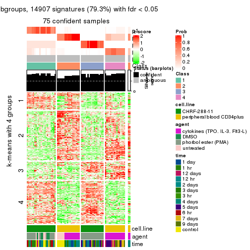</p>

</div>
<div id='tab-SD-kmeans-get-signatures-5'>
<pre><code class="r">get_signatures(res, k = 6)
</code></pre>

<p></p>

</div>
</div>


Signature heatmaps where rows are not scaled:


<script>
$( function() {
	$( '#tabs-SD-kmeans-get-signatures-no-scale' ).tabs();
} );
</script>
<div id='tabs-SD-kmeans-get-signatures-no-scale'>
<ul>
<li><a href='#tab-SD-kmeans-get-signatures-no-scale-1'>k = 2</a></li>
<li><a href='#tab-SD-kmeans-get-signatures-no-scale-2'>k = 3</a></li>
<li><a href='#tab-SD-kmeans-get-signatures-no-scale-3'>k = 4</a></li>
<li><a href='#tab-SD-kmeans-get-signatures-no-scale-4'>k = 5</a></li>
<li><a href='#tab-SD-kmeans-get-signatures-no-scale-5'>k = 6</a></li>
</ul>
<div id='tab-SD-kmeans-get-signatures-no-scale-1'>
<pre><code class="r">get_signatures(res, k = 2, scale_rows = FALSE)
</code></pre>

<p></p>

</div>
<div id='tab-SD-kmeans-get-signatures-no-scale-2'>
<pre><code class="r">get_signatures(res, k = 3, scale_rows = FALSE)
</code></pre>

<p></p>

</div>
<div id='tab-SD-kmeans-get-signatures-no-scale-3'>
<pre><code class="r">get_signatures(res, k = 4, scale_rows = FALSE)
</code></pre>

<p></p>

</div>
<div id='tab-SD-kmeans-get-signatures-no-scale-4'>
<pre><code class="r">get_signatures(res, k = 5, scale_rows = FALSE)
</code></pre>

<p></p>

</div>
<div id='tab-SD-kmeans-get-signatures-no-scale-5'>
<pre><code class="r">get_signatures(res, k = 6, scale_rows = FALSE)
</code></pre>

<p></p>

</div>
</div>


Compare the overlap of signatures from different k:

```r
compare_signatures(res)
```


`get_signature()` returns a data frame invisibly. TO get the list of signatures, the function
call should be assigned to a variable explicitly. In following code, if `plot` argument is set
to `FALSE`, no heatmap is plotted while only the differential analysis is performed.

```r
# code only for demonstration
tb = get_signature(res, k = ..., plot = FALSE)
```

An example of the output of `tb` is:

```
#>   which_row         fdr    mean_1    mean_2 scaled_mean_1 scaled_mean_2 km
#> 1        38 0.042760348  8.373488  9.131774    -0.5533452     0.5164555  1
#> 2        40 0.018707592  7.106213  8.469186    -0.6173731     0.5762149  1
#> 3        55 0.019134737 10.221463 11.207825    -0.6159697     0.5749050  1
#> 4        59 0.006059896  5.921854  7.869574    -0.6899429     0.6439467  1
#> 5        60 0.018055526  8.928898 10.211722    -0.6204761     0.5791110  1
#> 6        98 0.009384629 15.714769 14.887706     0.6635654    -0.6193277  2
...
```

The columns in `tb` are:

1. `which_row`: row indices corresponding to the input matrix.
2. `fdr`: FDR for the differential test. 
3. `mean_x`: The mean value in group x.
4. `scaled_mean_x`: The mean value in group x after rows are scaled.
5. `km`: Row groups if k-means clustering is applied to rows.


UMAP plot which shows how samples are separated.


<script>
$( function() {
	$( '#tabs-SD-kmeans-dimension-reduction' ).tabs();
} );
</script>
<div id='tabs-SD-kmeans-dimension-reduction'>
<ul>
<li><a href='#tab-SD-kmeans-dimension-reduction-1'>k = 2</a></li>
<li><a href='#tab-SD-kmeans-dimension-reduction-2'>k = 3</a></li>
<li><a href='#tab-SD-kmeans-dimension-reduction-3'>k = 4</a></li>
<li><a href='#tab-SD-kmeans-dimension-reduction-4'>k = 5</a></li>
<li><a href='#tab-SD-kmeans-dimension-reduction-5'>k = 6</a></li>
</ul>
<div id='tab-SD-kmeans-dimension-reduction-1'>
<pre><code class="r">dimension_reduction(res, k = 2, method = &quot;UMAP&quot;)
</code></pre>

<p></p>

</div>
<div id='tab-SD-kmeans-dimension-reduction-2'>
<pre><code class="r">dimension_reduction(res, k = 3, method = &quot;UMAP&quot;)
</code></pre>

<p></p>

</div>
<div id='tab-SD-kmeans-dimension-reduction-3'>
<pre><code class="r">dimension_reduction(res, k = 4, method = &quot;UMAP&quot;)
</code></pre>

<p>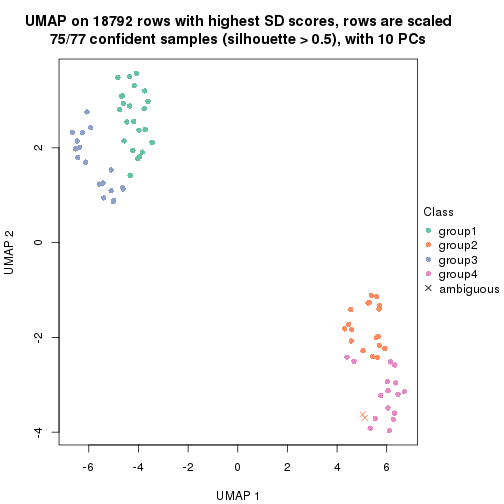</p>

</div>
<div id='tab-SD-kmeans-dimension-reduction-4'>
<pre><code class="r">dimension_reduction(res, k = 5, method = &quot;UMAP&quot;)
</code></pre>

<p></p>

</div>
<div id='tab-SD-kmeans-dimension-reduction-5'>
<pre><code class="r">dimension_reduction(res, k = 6, method = &quot;UMAP&quot;)
</code></pre>

<p></p>

</div>
</div>


Following heatmap shows how subgroups are split when increasing `k`:

```r
collect_classes(res)
```


Test correlation between subgroups and known annotations. If the known
annotation is numeric, one-way ANOVA test is applied, and if the known
annotation is discrete, chi-squared contingency table test is applied.

```r
test_to_known_factors(res)
```

```
#>            n cell.line(p) agent(p)  time(p) k
#> SD:kmeans 77     1.27e-17 3.00e-14 3.61e-01 2
#> SD:kmeans 77     1.27e-17 3.00e-14 3.61e-01 3
#> SD:kmeans 75     3.62e-16 4.17e-15 4.59e-06 4
#> SD:kmeans 75     3.62e-16 4.17e-15 4.59e-06 5
#> SD:kmeans 67     4.31e-13 3.04e-21 3.77e-13 6
```


If matrix rows can be associated to genes, consider to use `GO_Enrichment(res,
...)` to perform function enrichment for the signature genes.


 

---------------------------------------------------


### SD:skmeans*


The object with results only for a single top-value method and a single partition method 
can be extracted as:

```r
res = res_list["SD", "skmeans"]
# you can also extract it by
# res = res_list["SD:skmeans"]
```

A summary of `res` and all the functions that can be applied to it:

```r
res
```

```
#> A 'ConsensusPartition' object with k = 2, 3, 4, 5, 6.
#>   On a matrix with 18792 rows and 77 columns.
#>   Top rows (1000, 2000, 3000, 4000, 5000) are extracted by 'SD' method.
#>   Subgroups are detected by 'skmeans' method.
#>   Performed in total 1250 partitions by row resampling.
#>   Best k for subgroups seems to be 5.
#> 
#> Following methods can be applied to this 'ConsensusPartition' object:
#>  [1] "cola_report"             "collect_classes"         "collect_plots"          
#>  [4] "collect_stats"           "colnames"                "compare_signatures"     
#>  [7] "consensus_heatmap"       "dimension_reduction"     "functional_enrichment"  
#> [10] "get_anno_col"            "get_anno"                "get_classes"            
#> [13] "get_consensus"           "get_matrix"              "get_membership"         
#> [16] "get_param"               "get_signatures"          "get_stats"              
#> [19] "is_best_k"               "is_stable_k"             "membership_heatmap"     
#> [22] "ncol"                    "nrow"                    "plot_ecdf"              
#> [25] "rownames"                "select_partition_number" "show"                   
#> [28] "suggest_best_k"          "test_to_known_factors"
```

`collect_plots()` function collects all the plots made from `res` for all `k` (number of partitions)
into one single page to provide an easy and fast comparison between different `k`.

```r
collect_plots(res)
```


The plots are:

- The first row: a plot of the ECDF (Empirical cumulative distribution
  function) curves of the consensus matrix for each `k` and the heatmap of
  predicted classes for each `k`.
- The second row: heatmaps of the consensus matrix for each `k`.
- The third row: heatmaps of the membership matrix for each `k`.
- The fouth row: heatmaps of the signatures for each `k`.

All the plots in panels can be made by individual functions and they are
plotted later in this section.

`select_partition_number()` produces several plots showing different
statistics for choosing "optimized" `k`. There are following statistics:

- ECDF curves of the consensus matrix for each `k`;
- 1-PAC. [The PAC
  score](https://en.wikipedia.org/wiki/Consensus_clustering#Over-interpretation_potential_of_consensus_clustering)
  measures the proportion of the ambiguous subgrouping.
- Mean silhouette score.
- Concordance. The mean probability of fiting the consensus class ids in all
  partitions.
- Area increased. Denote $A_k$ as the area under the ECDF curve for current
  `k`, the area increased is defined as $A_k - A_{k-1}$.
- Rand index. The percent of pairs of samples that are both in a same cluster
  or both are not in a same cluster in the partition of k and k-1.
- Jaccard index. The ratio of pairs of samples are both in a same cluster in
  the partition of k and k-1 and the pairs of samples are both in a same
  cluster in the partition k or k-1.

The detailed explanations of these statistics can be found in [the cola
vignette](http://bioconductor.org/packages/devel/bioc/vignettes/cola/inst/doc/cola.html#toc_13).

Generally speaking, lower PAC score, higher mean silhouette score or higher
concordance corresponds to better partition. Rand index and Jaccard index
measure how similar the current partition is compared to partition with `k-1`.
If they are too similar, we won't accept `k` is better than `k-1`.

```r
select_partition_number(res)
```


The numeric values for all these statistics can be obtained by `get_stats()`.

```r
get_stats(res)
```

```
#>   k 1-PAC mean_silhouette concordance area_increased  Rand Jaccard
#> 2 2 1.000           1.000       1.000         0.5049 0.496   0.496
#> 3 3 0.749           0.962       0.917         0.2680 0.859   0.714
#> 4 4 1.000           0.969       0.980         0.1769 0.889   0.687
#> 5 5 0.921           0.925       0.935         0.0426 0.956   0.826
#> 6 6 0.895           0.839       0.863         0.0388 1.000   1.000
```

`suggest_best_k()` suggests the best $k$ based on these statistics. The rules are as follows:

- All $k$ with Jaccard index larger than 0.95 are removed because the increase of
  the partition number does not provides enough extra information. If all $k$ are removed,
  the best $k$ is assigned by `NA`.
- For $k$ with 1-PAC larger than 0.9, the maximal $k$ is taken as the "best k". Other $k$ is called "optional k".
- If it does not fit the second rule. The $k$ with the highest vote of highest
  1-PAC, mean silhouette and concordance is taken as the "best k".

```r
suggest_best_k(res)
```

```
#> [1] 5
#> attr(,"optional")
#> [1] 2 4
```

There is also optional best $k$ = 2 4 that is worth to check.

Following shows the table of the partitions (You need to click the **show/hide
code output** link to see it). The membership matrix (columns with name `p*`)
is inferred by
[`clue::cl_consensus()`](https://www.rdocumentation.org/link/cl_consensus?package=clue)
function with the `SE` method. Basically the value in the membership matrix
represents the probability to belong to a certain group. The finall class
label for an item is determined with the group with highest probability it
belongs to.

In `get_classes()` function, the entropy is calculated from the membership
matrix and the silhouette score is calculated from the consensus matrix.


<script>
$( function() {
	$( '#tabs-SD-skmeans-get-classes' ).tabs();
} );
</script>
<div id='tabs-SD-skmeans-get-classes'>
<ul>
<li><a href='#tab-SD-skmeans-get-classes-1'>k = 2</a></li>
<li><a href='#tab-SD-skmeans-get-classes-2'>k = 3</a></li>
<li><a href='#tab-SD-skmeans-get-classes-3'>k = 4</a></li>
<li><a href='#tab-SD-skmeans-get-classes-4'>k = 5</a></li>
<li><a href='#tab-SD-skmeans-get-classes-5'>k = 6</a></li>
</ul>

<div id='tab-SD-skmeans-get-classes-1'>
<p><a id='tab-SD-skmeans-get-classes-1-a' style='color:#0366d6' href='#'>show/hide code output</a></p>
<pre><code class="r">cbind(get_classes(res, k = 2), get_membership(res, k = 2))
</code></pre>

<pre><code>#&gt;          class entropy silhouette p1 p2
#&gt; GSM87962     1       0          1  1  0
#&gt; GSM87963     1       0          1  1  0
#&gt; GSM87983     1       0          1  1  0
#&gt; GSM87984     1       0          1  1  0
#&gt; GSM87961     1       0          1  1  0
#&gt; GSM87970     1       0          1  1  0
#&gt; GSM87971     1       0          1  1  0
#&gt; GSM87990     1       0          1  1  0
#&gt; GSM87991     1       0          1  1  0
#&gt; GSM87974     1       0          1  1  0
#&gt; GSM87994     1       0          1  1  0
#&gt; GSM87978     1       0          1  1  0
#&gt; GSM87979     1       0          1  1  0
#&gt; GSM87998     1       0          1  1  0
#&gt; GSM87999     1       0          1  1  0
#&gt; GSM87968     1       0          1  1  0
#&gt; GSM87987     1       0          1  1  0
#&gt; GSM87969     1       0          1  1  0
#&gt; GSM87988     1       0          1  1  0
#&gt; GSM87989     1       0          1  1  0
#&gt; GSM87972     1       0          1  1  0
#&gt; GSM87992     1       0          1  1  0
#&gt; GSM87973     1       0          1  1  0
#&gt; GSM87993     1       0          1  1  0
#&gt; GSM87975     1       0          1  1  0
#&gt; GSM87995     1       0          1  1  0
#&gt; GSM87976     1       0          1  1  0
#&gt; GSM87977     1       0          1  1  0
#&gt; GSM87996     1       0          1  1  0
#&gt; GSM87997     1       0          1  1  0
#&gt; GSM87980     1       0          1  1  0
#&gt; GSM88000     1       0          1  1  0
#&gt; GSM87981     1       0          1  1  0
#&gt; GSM87982     1       0          1  1  0
#&gt; GSM88001     1       0          1  1  0
#&gt; GSM87967     1       0          1  1  0
#&gt; GSM87964     1       0          1  1  0
#&gt; GSM87965     1       0          1  1  0
#&gt; GSM87966     1       0          1  1  0
#&gt; GSM87985     1       0          1  1  0
#&gt; GSM87986     1       0          1  1  0
#&gt; GSM88004     2       0          1  0  1
#&gt; GSM88015     2       0          1  0  1
#&gt; GSM88005     2       0          1  0  1
#&gt; GSM88006     2       0          1  0  1
#&gt; GSM88016     2       0          1  0  1
#&gt; GSM88007     2       0          1  0  1
#&gt; GSM88017     2       0          1  0  1
#&gt; GSM88029     2       0          1  0  1
#&gt; GSM88008     2       0          1  0  1
#&gt; GSM88009     2       0          1  0  1
#&gt; GSM88018     2       0          1  0  1
#&gt; GSM88024     2       0          1  0  1
#&gt; GSM88030     2       0          1  0  1
#&gt; GSM88036     2       0          1  0  1
#&gt; GSM88010     2       0          1  0  1
#&gt; GSM88011     2       0          1  0  1
#&gt; GSM88019     2       0          1  0  1
#&gt; GSM88027     2       0          1  0  1
#&gt; GSM88031     2       0          1  0  1
#&gt; GSM88012     2       0          1  0  1
#&gt; GSM88020     2       0          1  0  1
#&gt; GSM88032     2       0          1  0  1
#&gt; GSM88037     2       0          1  0  1
#&gt; GSM88013     2       0          1  0  1
#&gt; GSM88021     2       0          1  0  1
#&gt; GSM88025     2       0          1  0  1
#&gt; GSM88033     2       0          1  0  1
#&gt; GSM88014     2       0          1  0  1
#&gt; GSM88022     2       0          1  0  1
#&gt; GSM88034     2       0          1  0  1
#&gt; GSM88002     2       0          1  0  1
#&gt; GSM88003     2       0          1  0  1
#&gt; GSM88023     2       0          1  0  1
#&gt; GSM88026     2       0          1  0  1
#&gt; GSM88028     2       0          1  0  1
#&gt; GSM88035     2       0          1  0  1
</code></pre>

<script>
$('#tab-SD-skmeans-get-classes-1-a').parent().next().next().hide();
$('#tab-SD-skmeans-get-classes-1-a').click(function(){
  $('#tab-SD-skmeans-get-classes-1-a').parent().next().next().toggle();
  return(false);
});
</script>
</div>

<div id='tab-SD-skmeans-get-classes-2'>
<p><a id='tab-SD-skmeans-get-classes-2-a' style='color:#0366d6' href='#'>show/hide code output</a></p>
<pre><code class="r">cbind(get_classes(res, k = 3), get_membership(res, k = 3))
</code></pre>

<pre><code>#&gt;          class entropy silhouette    p1    p2    p3
#&gt; GSM87962     1  0.4399      1.000 0.812 0.000 0.188
#&gt; GSM87963     1  0.4399      1.000 0.812 0.000 0.188
#&gt; GSM87983     1  0.4399      1.000 0.812 0.000 0.188
#&gt; GSM87984     1  0.4399      1.000 0.812 0.000 0.188
#&gt; GSM87961     1  0.4399      1.000 0.812 0.000 0.188
#&gt; GSM87970     1  0.4399      1.000 0.812 0.000 0.188
#&gt; GSM87971     1  0.4399      1.000 0.812 0.000 0.188
#&gt; GSM87990     1  0.4399      1.000 0.812 0.000 0.188
#&gt; GSM87991     1  0.4399      1.000 0.812 0.000 0.188
#&gt; GSM87974     1  0.4399      1.000 0.812 0.000 0.188
#&gt; GSM87994     1  0.4399      1.000 0.812 0.000 0.188
#&gt; GSM87978     1  0.4399      1.000 0.812 0.000 0.188
#&gt; GSM87979     1  0.4399      1.000 0.812 0.000 0.188
#&gt; GSM87998     1  0.4399      1.000 0.812 0.000 0.188
#&gt; GSM87999     1  0.4399      1.000 0.812 0.000 0.188
#&gt; GSM87968     1  0.4399      1.000 0.812 0.000 0.188
#&gt; GSM87987     1  0.4399      1.000 0.812 0.000 0.188
#&gt; GSM87969     1  0.4399      1.000 0.812 0.000 0.188
#&gt; GSM87988     3  0.0000      1.000 0.000 0.000 1.000
#&gt; GSM87989     3  0.0000      1.000 0.000 0.000 1.000
#&gt; GSM87972     3  0.0000      1.000 0.000 0.000 1.000
#&gt; GSM87992     3  0.0000      1.000 0.000 0.000 1.000
#&gt; GSM87973     3  0.0000      1.000 0.000 0.000 1.000
#&gt; GSM87993     3  0.0000      1.000 0.000 0.000 1.000
#&gt; GSM87975     3  0.0000      1.000 0.000 0.000 1.000
#&gt; GSM87995     3  0.0000      1.000 0.000 0.000 1.000
#&gt; GSM87976     3  0.0000      1.000 0.000 0.000 1.000
#&gt; GSM87977     3  0.0000      1.000 0.000 0.000 1.000
#&gt; GSM87996     3  0.0000      1.000 0.000 0.000 1.000
#&gt; GSM87997     3  0.0000      1.000 0.000 0.000 1.000
#&gt; GSM87980     3  0.0000      1.000 0.000 0.000 1.000
#&gt; GSM88000     3  0.0000      1.000 0.000 0.000 1.000
#&gt; GSM87981     3  0.0000      1.000 0.000 0.000 1.000
#&gt; GSM87982     3  0.0000      1.000 0.000 0.000 1.000
#&gt; GSM88001     3  0.0000      1.000 0.000 0.000 1.000
#&gt; GSM87967     3  0.0000      1.000 0.000 0.000 1.000
#&gt; GSM87964     1  0.4399      1.000 0.812 0.000 0.188
#&gt; GSM87965     1  0.4399      1.000 0.812 0.000 0.188
#&gt; GSM87966     1  0.4399      1.000 0.812 0.000 0.188
#&gt; GSM87985     1  0.4399      1.000 0.812 0.000 0.188
#&gt; GSM87986     1  0.4399      1.000 0.812 0.000 0.188
#&gt; GSM88004     2  0.0000      0.926 0.000 1.000 0.000
#&gt; GSM88015     2  0.0000      0.926 0.000 1.000 0.000
#&gt; GSM88005     2  0.0000      0.926 0.000 1.000 0.000
#&gt; GSM88006     2  0.0000      0.926 0.000 1.000 0.000
#&gt; GSM88016     2  0.0000      0.926 0.000 1.000 0.000
#&gt; GSM88007     2  0.0000      0.926 0.000 1.000 0.000
#&gt; GSM88017     2  0.0000      0.926 0.000 1.000 0.000
#&gt; GSM88029     2  0.0000      0.926 0.000 1.000 0.000
#&gt; GSM88008     2  0.0000      0.926 0.000 1.000 0.000
#&gt; GSM88009     2  0.0000      0.926 0.000 1.000 0.000
#&gt; GSM88018     2  0.0000      0.926 0.000 1.000 0.000
#&gt; GSM88024     2  0.0000      0.926 0.000 1.000 0.000
#&gt; GSM88030     2  0.0747      0.926 0.016 0.984 0.000
#&gt; GSM88036     2  0.0747      0.926 0.016 0.984 0.000
#&gt; GSM88010     2  0.4399      0.909 0.188 0.812 0.000
#&gt; GSM88011     2  0.4399      0.909 0.188 0.812 0.000
#&gt; GSM88019     2  0.4399      0.909 0.188 0.812 0.000
#&gt; GSM88027     2  0.4399      0.909 0.188 0.812 0.000
#&gt; GSM88031     2  0.4399      0.909 0.188 0.812 0.000
#&gt; GSM88012     2  0.4399      0.909 0.188 0.812 0.000
#&gt; GSM88020     2  0.4399      0.909 0.188 0.812 0.000
#&gt; GSM88032     2  0.4399      0.909 0.188 0.812 0.000
#&gt; GSM88037     2  0.4399      0.909 0.188 0.812 0.000
#&gt; GSM88013     2  0.4399      0.909 0.188 0.812 0.000
#&gt; GSM88021     2  0.4399      0.909 0.188 0.812 0.000
#&gt; GSM88025     2  0.4399      0.909 0.188 0.812 0.000
#&gt; GSM88033     2  0.4399      0.909 0.188 0.812 0.000
#&gt; GSM88014     2  0.4399      0.909 0.188 0.812 0.000
#&gt; GSM88022     2  0.4399      0.909 0.188 0.812 0.000
#&gt; GSM88034     2  0.4399      0.909 0.188 0.812 0.000
#&gt; GSM88002     2  0.0000      0.926 0.000 1.000 0.000
#&gt; GSM88003     2  0.0000      0.926 0.000 1.000 0.000
#&gt; GSM88023     2  0.0000      0.926 0.000 1.000 0.000
#&gt; GSM88026     2  0.0000      0.926 0.000 1.000 0.000
#&gt; GSM88028     2  0.0000      0.926 0.000 1.000 0.000
#&gt; GSM88035     2  0.0000      0.926 0.000 1.000 0.000
</code></pre>

<script>
$('#tab-SD-skmeans-get-classes-2-a').parent().next().next().hide();
$('#tab-SD-skmeans-get-classes-2-a').click(function(){
  $('#tab-SD-skmeans-get-classes-2-a').parent().next().next().toggle();
  return(false);
});
</script>
</div>

<div id='tab-SD-skmeans-get-classes-3'>
<p><a id='tab-SD-skmeans-get-classes-3-a' style='color:#0366d6' href='#'>show/hide code output</a></p>
<pre><code class="r">cbind(get_classes(res, k = 4), get_membership(res, k = 4))
</code></pre>

<pre><code>#&gt;          class entropy silhouette    p1    p2    p3    p4
#&gt; GSM87962     1  0.0000      0.996 1.000 0.000 0.000 0.000
#&gt; GSM87963     1  0.0000      0.996 1.000 0.000 0.000 0.000
#&gt; GSM87983     1  0.0000      0.996 1.000 0.000 0.000 0.000
#&gt; GSM87984     1  0.0000      0.996 1.000 0.000 0.000 0.000
#&gt; GSM87961     1  0.0000      0.996 1.000 0.000 0.000 0.000
#&gt; GSM87970     1  0.0188      0.995 0.996 0.000 0.000 0.004
#&gt; GSM87971     1  0.0188      0.995 0.996 0.000 0.000 0.004
#&gt; GSM87990     1  0.0000      0.996 1.000 0.000 0.000 0.000
#&gt; GSM87991     1  0.0000      0.996 1.000 0.000 0.000 0.000
#&gt; GSM87974     1  0.0188      0.995 0.996 0.000 0.000 0.004
#&gt; GSM87994     1  0.0000      0.996 1.000 0.000 0.000 0.000
#&gt; GSM87978     1  0.0188      0.995 0.996 0.000 0.000 0.004
#&gt; GSM87979     1  0.0188      0.995 0.996 0.000 0.000 0.004
#&gt; GSM87998     1  0.0000      0.996 1.000 0.000 0.000 0.000
#&gt; GSM87999     1  0.0000      0.996 1.000 0.000 0.000 0.000
#&gt; GSM87968     1  0.0188      0.995 0.996 0.000 0.000 0.004
#&gt; GSM87987     1  0.1211      0.959 0.960 0.000 0.040 0.000
#&gt; GSM87969     1  0.0779      0.982 0.980 0.000 0.016 0.004
#&gt; GSM87988     3  0.0817      1.000 0.024 0.000 0.976 0.000
#&gt; GSM87989     3  0.0817      1.000 0.024 0.000 0.976 0.000
#&gt; GSM87972     3  0.0817      1.000 0.024 0.000 0.976 0.000
#&gt; GSM87992     3  0.0817      1.000 0.024 0.000 0.976 0.000
#&gt; GSM87973     3  0.0817      1.000 0.024 0.000 0.976 0.000
#&gt; GSM87993     3  0.0817      1.000 0.024 0.000 0.976 0.000
#&gt; GSM87975     3  0.0817      1.000 0.024 0.000 0.976 0.000
#&gt; GSM87995     3  0.0817      1.000 0.024 0.000 0.976 0.000
#&gt; GSM87976     3  0.0817      1.000 0.024 0.000 0.976 0.000
#&gt; GSM87977     3  0.0817      1.000 0.024 0.000 0.976 0.000
#&gt; GSM87996     3  0.0817      1.000 0.024 0.000 0.976 0.000
#&gt; GSM87997     3  0.0817      1.000 0.024 0.000 0.976 0.000
#&gt; GSM87980     3  0.0817      1.000 0.024 0.000 0.976 0.000
#&gt; GSM88000     3  0.0817      1.000 0.024 0.000 0.976 0.000
#&gt; GSM87981     3  0.0817      1.000 0.024 0.000 0.976 0.000
#&gt; GSM87982     3  0.0817      1.000 0.024 0.000 0.976 0.000
#&gt; GSM88001     3  0.0817      1.000 0.024 0.000 0.976 0.000
#&gt; GSM87967     3  0.0817      1.000 0.024 0.000 0.976 0.000
#&gt; GSM87964     1  0.0188      0.995 0.996 0.000 0.000 0.004
#&gt; GSM87965     1  0.0000      0.996 1.000 0.000 0.000 0.000
#&gt; GSM87966     1  0.0000      0.996 1.000 0.000 0.000 0.000
#&gt; GSM87985     1  0.0000      0.996 1.000 0.000 0.000 0.000
#&gt; GSM87986     1  0.0000      0.996 1.000 0.000 0.000 0.000
#&gt; GSM88004     2  0.0000      0.993 0.000 1.000 0.000 0.000
#&gt; GSM88015     2  0.0000      0.993 0.000 1.000 0.000 0.000
#&gt; GSM88005     2  0.0000      0.993 0.000 1.000 0.000 0.000
#&gt; GSM88006     2  0.0000      0.993 0.000 1.000 0.000 0.000
#&gt; GSM88016     2  0.0000      0.993 0.000 1.000 0.000 0.000
#&gt; GSM88007     2  0.0000      0.993 0.000 1.000 0.000 0.000
#&gt; GSM88017     2  0.0000      0.993 0.000 1.000 0.000 0.000
#&gt; GSM88029     2  0.0000      0.993 0.000 1.000 0.000 0.000
#&gt; GSM88008     2  0.0000      0.993 0.000 1.000 0.000 0.000
#&gt; GSM88009     2  0.0000      0.993 0.000 1.000 0.000 0.000
#&gt; GSM88018     2  0.0000      0.993 0.000 1.000 0.000 0.000
#&gt; GSM88024     2  0.0000      0.993 0.000 1.000 0.000 0.000
#&gt; GSM88030     4  0.4877      0.358 0.000 0.408 0.000 0.592
#&gt; GSM88036     4  0.4877      0.358 0.000 0.408 0.000 0.592
#&gt; GSM88010     4  0.0188      0.951 0.000 0.004 0.000 0.996
#&gt; GSM88011     4  0.0188      0.951 0.000 0.004 0.000 0.996
#&gt; GSM88019     4  0.0188      0.951 0.000 0.004 0.000 0.996
#&gt; GSM88027     4  0.0188      0.951 0.000 0.004 0.000 0.996
#&gt; GSM88031     4  0.0188      0.951 0.000 0.004 0.000 0.996
#&gt; GSM88012     4  0.0188      0.951 0.000 0.004 0.000 0.996
#&gt; GSM88020     4  0.0188      0.951 0.000 0.004 0.000 0.996
#&gt; GSM88032     4  0.0188      0.951 0.000 0.004 0.000 0.996
#&gt; GSM88037     4  0.0188      0.951 0.000 0.004 0.000 0.996
#&gt; GSM88013     4  0.0188      0.951 0.000 0.004 0.000 0.996
#&gt; GSM88021     4  0.0188      0.951 0.000 0.004 0.000 0.996
#&gt; GSM88025     4  0.0188      0.951 0.000 0.004 0.000 0.996
#&gt; GSM88033     4  0.0188      0.951 0.000 0.004 0.000 0.996
#&gt; GSM88014     4  0.0188      0.951 0.000 0.004 0.000 0.996
#&gt; GSM88022     4  0.0188      0.951 0.000 0.004 0.000 0.996
#&gt; GSM88034     4  0.0188      0.951 0.000 0.004 0.000 0.996
#&gt; GSM88002     2  0.0817      0.987 0.000 0.976 0.024 0.000
#&gt; GSM88003     2  0.0817      0.987 0.000 0.976 0.024 0.000
#&gt; GSM88023     2  0.0817      0.987 0.000 0.976 0.024 0.000
#&gt; GSM88026     2  0.0817      0.987 0.000 0.976 0.024 0.000
#&gt; GSM88028     2  0.0817      0.987 0.000 0.976 0.024 0.000
#&gt; GSM88035     2  0.0817      0.987 0.000 0.976 0.024 0.000
</code></pre>

<script>
$('#tab-SD-skmeans-get-classes-3-a').parent().next().next().hide();
$('#tab-SD-skmeans-get-classes-3-a').click(function(){
  $('#tab-SD-skmeans-get-classes-3-a').parent().next().next().toggle();
  return(false);
});
</script>
</div>

<div id='tab-SD-skmeans-get-classes-4'>
<p><a id='tab-SD-skmeans-get-classes-4-a' style='color:#0366d6' href='#'>show/hide code output</a></p>
<pre><code class="r">cbind(get_classes(res, k = 5), get_membership(res, k = 5))
</code></pre>

<pre><code>#&gt;          class entropy silhouette    p1    p2    p3    p4    p5
#&gt; GSM87962     1  0.1197      0.943 0.952 0.000 0.000 0.000 0.048
#&gt; GSM87963     1  0.1197      0.943 0.952 0.000 0.000 0.000 0.048
#&gt; GSM87983     1  0.1197      0.943 0.952 0.000 0.000 0.000 0.048
#&gt; GSM87984     1  0.1197      0.943 0.952 0.000 0.000 0.000 0.048
#&gt; GSM87961     1  0.1197      0.943 0.952 0.000 0.000 0.000 0.048
#&gt; GSM87970     1  0.1121      0.941 0.956 0.000 0.000 0.000 0.044
#&gt; GSM87971     1  0.1478      0.939 0.936 0.000 0.000 0.000 0.064
#&gt; GSM87990     1  0.0000      0.946 1.000 0.000 0.000 0.000 0.000
#&gt; GSM87991     1  0.0404      0.945 0.988 0.000 0.000 0.000 0.012
#&gt; GSM87974     1  0.2020      0.930 0.900 0.000 0.000 0.000 0.100
#&gt; GSM87994     1  0.1544      0.937 0.932 0.000 0.000 0.000 0.068
#&gt; GSM87978     1  0.2020      0.930 0.900 0.000 0.000 0.000 0.100
#&gt; GSM87979     1  0.2020      0.930 0.900 0.000 0.000 0.000 0.100
#&gt; GSM87998     1  0.1608      0.935 0.928 0.000 0.000 0.000 0.072
#&gt; GSM87999     1  0.1608      0.935 0.928 0.000 0.000 0.000 0.072
#&gt; GSM87968     1  0.2020      0.930 0.900 0.000 0.000 0.000 0.100
#&gt; GSM87987     1  0.2300      0.923 0.904 0.000 0.024 0.000 0.072
#&gt; GSM87969     1  0.2411      0.923 0.884 0.000 0.008 0.000 0.108
#&gt; GSM87988     3  0.0510      0.985 0.000 0.000 0.984 0.000 0.016
#&gt; GSM87989     3  0.0510      0.985 0.000 0.000 0.984 0.000 0.016
#&gt; GSM87972     3  0.0000      0.998 0.000 0.000 1.000 0.000 0.000
#&gt; GSM87992     3  0.0000      0.998 0.000 0.000 1.000 0.000 0.000
#&gt; GSM87973     3  0.0000      0.998 0.000 0.000 1.000 0.000 0.000
#&gt; GSM87993     3  0.0000      0.998 0.000 0.000 1.000 0.000 0.000
#&gt; GSM87975     3  0.0000      0.998 0.000 0.000 1.000 0.000 0.000
#&gt; GSM87995     3  0.0000      0.998 0.000 0.000 1.000 0.000 0.000
#&gt; GSM87976     3  0.0000      0.998 0.000 0.000 1.000 0.000 0.000
#&gt; GSM87977     3  0.0000      0.998 0.000 0.000 1.000 0.000 0.000
#&gt; GSM87996     3  0.0000      0.998 0.000 0.000 1.000 0.000 0.000
#&gt; GSM87997     3  0.0000      0.998 0.000 0.000 1.000 0.000 0.000
#&gt; GSM87980     3  0.0000      0.998 0.000 0.000 1.000 0.000 0.000
#&gt; GSM88000     3  0.0000      0.998 0.000 0.000 1.000 0.000 0.000
#&gt; GSM87981     3  0.0000      0.998 0.000 0.000 1.000 0.000 0.000
#&gt; GSM87982     3  0.0000      0.998 0.000 0.000 1.000 0.000 0.000
#&gt; GSM88001     3  0.0000      0.998 0.000 0.000 1.000 0.000 0.000
#&gt; GSM87967     3  0.0000      0.998 0.000 0.000 1.000 0.000 0.000
#&gt; GSM87964     1  0.1851      0.938 0.912 0.000 0.000 0.000 0.088
#&gt; GSM87965     1  0.1197      0.943 0.952 0.000 0.000 0.000 0.048
#&gt; GSM87966     1  0.1197      0.943 0.952 0.000 0.000 0.000 0.048
#&gt; GSM87985     1  0.1197      0.943 0.952 0.000 0.000 0.000 0.048
#&gt; GSM87986     1  0.1197      0.943 0.952 0.000 0.000 0.000 0.048
#&gt; GSM88004     2  0.0703      0.866 0.000 0.976 0.000 0.000 0.024
#&gt; GSM88015     2  0.0510      0.866 0.000 0.984 0.000 0.000 0.016
#&gt; GSM88005     2  0.0703      0.866 0.000 0.976 0.000 0.000 0.024
#&gt; GSM88006     2  0.0703      0.866 0.000 0.976 0.000 0.000 0.024
#&gt; GSM88016     2  0.0510      0.866 0.000 0.984 0.000 0.000 0.016
#&gt; GSM88007     2  0.0703      0.866 0.000 0.976 0.000 0.000 0.024
#&gt; GSM88017     2  0.0000      0.862 0.000 1.000 0.000 0.000 0.000
#&gt; GSM88029     2  0.0000      0.862 0.000 1.000 0.000 0.000 0.000
#&gt; GSM88008     2  0.0703      0.866 0.000 0.976 0.000 0.000 0.024
#&gt; GSM88009     2  0.0703      0.866 0.000 0.976 0.000 0.000 0.024
#&gt; GSM88018     2  0.0000      0.862 0.000 1.000 0.000 0.000 0.000
#&gt; GSM88024     2  0.0000      0.862 0.000 1.000 0.000 0.000 0.000
#&gt; GSM88030     2  0.4302      0.166 0.000 0.520 0.000 0.480 0.000
#&gt; GSM88036     2  0.4302      0.166 0.000 0.520 0.000 0.480 0.000
#&gt; GSM88010     4  0.3176      0.910 0.000 0.064 0.000 0.856 0.080
#&gt; GSM88011     4  0.3110      0.912 0.000 0.060 0.000 0.860 0.080
#&gt; GSM88019     4  0.3239      0.907 0.000 0.068 0.000 0.852 0.080
#&gt; GSM88027     4  0.3239      0.907 0.000 0.068 0.000 0.852 0.080
#&gt; GSM88031     4  0.0000      0.948 0.000 0.000 0.000 1.000 0.000
#&gt; GSM88012     4  0.1732      0.941 0.000 0.000 0.000 0.920 0.080
#&gt; GSM88020     4  0.0000      0.948 0.000 0.000 0.000 1.000 0.000
#&gt; GSM88032     4  0.0000      0.948 0.000 0.000 0.000 1.000 0.000
#&gt; GSM88037     4  0.0000      0.948 0.000 0.000 0.000 1.000 0.000
#&gt; GSM88013     4  0.1732      0.941 0.000 0.000 0.000 0.920 0.080
#&gt; GSM88021     4  0.0000      0.948 0.000 0.000 0.000 1.000 0.000
#&gt; GSM88025     4  0.0000      0.948 0.000 0.000 0.000 1.000 0.000
#&gt; GSM88033     4  0.0000      0.948 0.000 0.000 0.000 1.000 0.000
#&gt; GSM88014     4  0.1732      0.941 0.000 0.000 0.000 0.920 0.080
#&gt; GSM88022     4  0.1732      0.941 0.000 0.000 0.000 0.920 0.080
#&gt; GSM88034     4  0.0000      0.948 0.000 0.000 0.000 1.000 0.000
#&gt; GSM88002     5  0.3424      1.000 0.000 0.240 0.000 0.000 0.760
#&gt; GSM88003     5  0.3424      1.000 0.000 0.240 0.000 0.000 0.760
#&gt; GSM88023     5  0.3424      1.000 0.000 0.240 0.000 0.000 0.760
#&gt; GSM88026     5  0.3424      1.000 0.000 0.240 0.000 0.000 0.760
#&gt; GSM88028     5  0.3424      1.000 0.000 0.240 0.000 0.000 0.760
#&gt; GSM88035     5  0.3424      1.000 0.000 0.240 0.000 0.000 0.760
</code></pre>

<script>
$('#tab-SD-skmeans-get-classes-4-a').parent().next().next().hide();
$('#tab-SD-skmeans-get-classes-4-a').click(function(){
  $('#tab-SD-skmeans-get-classes-4-a').parent().next().next().toggle();
  return(false);
});
</script>
</div>

<div id='tab-SD-skmeans-get-classes-5'>
<p><a id='tab-SD-skmeans-get-classes-5-a' style='color:#0366d6' href='#'>show/hide code output</a></p>
<pre><code class="r">cbind(get_classes(res, k = 6), get_membership(res, k = 6))
</code></pre>

<pre><code>#&gt;          class entropy silhouette    p1    p2    p3    p4    p5 p6
#&gt; GSM87962     1  0.0260      0.809 0.992 0.000 0.000 0.000 0.000 NA
#&gt; GSM87963     1  0.0260      0.809 0.992 0.000 0.000 0.000 0.000 NA
#&gt; GSM87983     1  0.0000      0.808 1.000 0.000 0.000 0.000 0.000 NA
#&gt; GSM87984     1  0.0000      0.808 1.000 0.000 0.000 0.000 0.000 NA
#&gt; GSM87961     1  0.0260      0.809 0.992 0.000 0.000 0.000 0.000 NA
#&gt; GSM87970     1  0.3794      0.790 0.724 0.000 0.000 0.000 0.028 NA
#&gt; GSM87971     1  0.4083      0.782 0.668 0.000 0.000 0.000 0.028 NA
#&gt; GSM87990     1  0.2191      0.815 0.876 0.000 0.000 0.000 0.004 NA
#&gt; GSM87991     1  0.2553      0.812 0.848 0.000 0.000 0.000 0.008 NA
#&gt; GSM87974     1  0.4423      0.747 0.552 0.000 0.000 0.000 0.028 NA
#&gt; GSM87994     1  0.3998      0.769 0.644 0.000 0.000 0.000 0.016 NA
#&gt; GSM87978     1  0.4439      0.742 0.540 0.000 0.000 0.000 0.028 NA
#&gt; GSM87979     1  0.4439      0.742 0.540 0.000 0.000 0.000 0.028 NA
#&gt; GSM87998     1  0.4064      0.761 0.624 0.000 0.000 0.000 0.016 NA
#&gt; GSM87999     1  0.4064      0.761 0.624 0.000 0.000 0.000 0.016 NA
#&gt; GSM87968     1  0.4377      0.742 0.540 0.000 0.000 0.000 0.024 NA
#&gt; GSM87987     1  0.4303      0.756 0.616 0.000 0.008 0.000 0.016 NA
#&gt; GSM87969     1  0.4874      0.717 0.496 0.000 0.008 0.000 0.040 NA
#&gt; GSM87988     3  0.2822      0.910 0.000 0.000 0.852 0.000 0.040 NA
#&gt; GSM87989     3  0.2822      0.910 0.000 0.000 0.852 0.000 0.040 NA
#&gt; GSM87972     3  0.0520      0.952 0.000 0.000 0.984 0.000 0.008 NA
#&gt; GSM87992     3  0.1765      0.955 0.000 0.000 0.924 0.000 0.024 NA
#&gt; GSM87973     3  0.0000      0.958 0.000 0.000 1.000 0.000 0.000 NA
#&gt; GSM87993     3  0.1765      0.955 0.000 0.000 0.924 0.000 0.024 NA
#&gt; GSM87975     3  0.0000      0.958 0.000 0.000 1.000 0.000 0.000 NA
#&gt; GSM87995     3  0.1765      0.955 0.000 0.000 0.924 0.000 0.024 NA
#&gt; GSM87976     3  0.0000      0.958 0.000 0.000 1.000 0.000 0.000 NA
#&gt; GSM87977     3  0.0000      0.958 0.000 0.000 1.000 0.000 0.000 NA
#&gt; GSM87996     3  0.1765      0.955 0.000 0.000 0.924 0.000 0.024 NA
#&gt; GSM87997     3  0.1765      0.955 0.000 0.000 0.924 0.000 0.024 NA
#&gt; GSM87980     3  0.0000      0.958 0.000 0.000 1.000 0.000 0.000 NA
#&gt; GSM88000     3  0.1765      0.955 0.000 0.000 0.924 0.000 0.024 NA
#&gt; GSM87981     3  0.0000      0.958 0.000 0.000 1.000 0.000 0.000 NA
#&gt; GSM87982     3  0.0000      0.958 0.000 0.000 1.000 0.000 0.000 NA
#&gt; GSM88001     3  0.1765      0.955 0.000 0.000 0.924 0.000 0.024 NA
#&gt; GSM87967     3  0.0000      0.958 0.000 0.000 1.000 0.000 0.000 NA
#&gt; GSM87964     1  0.2573      0.782 0.864 0.000 0.000 0.000 0.024 NA
#&gt; GSM87965     1  0.0260      0.809 0.992 0.000 0.000 0.000 0.000 NA
#&gt; GSM87966     1  0.0000      0.808 1.000 0.000 0.000 0.000 0.000 NA
#&gt; GSM87985     1  0.0000      0.808 1.000 0.000 0.000 0.000 0.000 NA
#&gt; GSM87986     1  0.0000      0.808 1.000 0.000 0.000 0.000 0.000 NA
#&gt; GSM88004     2  0.0363      0.863 0.000 0.988 0.000 0.000 0.012 NA
#&gt; GSM88015     2  0.0291      0.862 0.000 0.992 0.000 0.000 0.004 NA
#&gt; GSM88005     2  0.0363      0.863 0.000 0.988 0.000 0.000 0.012 NA
#&gt; GSM88006     2  0.0363      0.863 0.000 0.988 0.000 0.000 0.012 NA
#&gt; GSM88016     2  0.0291      0.862 0.000 0.992 0.000 0.000 0.004 NA
#&gt; GSM88007     2  0.0363      0.863 0.000 0.988 0.000 0.000 0.012 NA
#&gt; GSM88017     2  0.2003      0.829 0.000 0.884 0.000 0.000 0.000 NA
#&gt; GSM88029     2  0.2048      0.827 0.000 0.880 0.000 0.000 0.000 NA
#&gt; GSM88008     2  0.0363      0.863 0.000 0.988 0.000 0.000 0.012 NA
#&gt; GSM88009     2  0.0363      0.863 0.000 0.988 0.000 0.000 0.012 NA
#&gt; GSM88018     2  0.1765      0.838 0.000 0.904 0.000 0.000 0.000 NA
#&gt; GSM88024     2  0.1863      0.835 0.000 0.896 0.000 0.000 0.000 NA
#&gt; GSM88030     2  0.6042      0.187 0.000 0.400 0.000 0.208 0.004 NA
#&gt; GSM88036     2  0.6042      0.187 0.000 0.400 0.000 0.208 0.004 NA
#&gt; GSM88010     4  0.1471      0.774 0.000 0.064 0.000 0.932 0.000 NA
#&gt; GSM88011     4  0.1411      0.777 0.000 0.060 0.000 0.936 0.000 NA
#&gt; GSM88019     4  0.2003      0.789 0.000 0.044 0.000 0.912 0.000 NA
#&gt; GSM88027     4  0.1983      0.777 0.000 0.072 0.000 0.908 0.000 NA
#&gt; GSM88031     4  0.3835      0.820 0.000 0.000 0.000 0.668 0.012 NA
#&gt; GSM88012     4  0.0146      0.804 0.000 0.000 0.000 0.996 0.000 NA
#&gt; GSM88020     4  0.3867      0.816 0.000 0.000 0.000 0.660 0.012 NA
#&gt; GSM88032     4  0.3835      0.820 0.000 0.000 0.000 0.668 0.012 NA
#&gt; GSM88037     4  0.3835      0.820 0.000 0.000 0.000 0.668 0.012 NA
#&gt; GSM88013     4  0.0000      0.805 0.000 0.000 0.000 1.000 0.000 NA
#&gt; GSM88021     4  0.3835      0.820 0.000 0.000 0.000 0.668 0.012 NA
#&gt; GSM88025     4  0.3835      0.820 0.000 0.000 0.000 0.668 0.012 NA
#&gt; GSM88033     4  0.3835      0.820 0.000 0.000 0.000 0.668 0.012 NA
#&gt; GSM88014     4  0.0000      0.805 0.000 0.000 0.000 1.000 0.000 NA
#&gt; GSM88022     4  0.0000      0.805 0.000 0.000 0.000 1.000 0.000 NA
#&gt; GSM88034     4  0.3883      0.814 0.000 0.000 0.000 0.656 0.012 NA
#&gt; GSM88002     5  0.1556      1.000 0.000 0.080 0.000 0.000 0.920 NA
#&gt; GSM88003     5  0.1556      1.000 0.000 0.080 0.000 0.000 0.920 NA
#&gt; GSM88023     5  0.1556      1.000 0.000 0.080 0.000 0.000 0.920 NA
#&gt; GSM88026     5  0.1556      1.000 0.000 0.080 0.000 0.000 0.920 NA
#&gt; GSM88028     5  0.1556      1.000 0.000 0.080 0.000 0.000 0.920 NA
#&gt; GSM88035     5  0.1556      1.000 0.000 0.080 0.000 0.000 0.920 NA
</code></pre>

<script>
$('#tab-SD-skmeans-get-classes-5-a').parent().next().next().hide();
$('#tab-SD-skmeans-get-classes-5-a').click(function(){
  $('#tab-SD-skmeans-get-classes-5-a').parent().next().next().toggle();
  return(false);
});
</script>
</div>
</div>

Heatmaps for the consensus matrix. It visualizes the probability of two
samples to be in a same group.


<script>
$( function() {
	$( '#tabs-SD-skmeans-consensus-heatmap' ).tabs();
} );
</script>
<div id='tabs-SD-skmeans-consensus-heatmap'>
<ul>
<li><a href='#tab-SD-skmeans-consensus-heatmap-1'>k = 2</a></li>
<li><a href='#tab-SD-skmeans-consensus-heatmap-2'>k = 3</a></li>
<li><a href='#tab-SD-skmeans-consensus-heatmap-3'>k = 4</a></li>
<li><a href='#tab-SD-skmeans-consensus-heatmap-4'>k = 5</a></li>
<li><a href='#tab-SD-skmeans-consensus-heatmap-5'>k = 6</a></li>
</ul>
<div id='tab-SD-skmeans-consensus-heatmap-1'>
<pre><code class="r">consensus_heatmap(res, k = 2)
</code></pre>

<p></p>

</div>
<div id='tab-SD-skmeans-consensus-heatmap-2'>
<pre><code class="r">consensus_heatmap(res, k = 3)
</code></pre>

<p></p>

</div>
<div id='tab-SD-skmeans-consensus-heatmap-3'>
<pre><code class="r">consensus_heatmap(res, k = 4)
</code></pre>

<p></p>

</div>
<div id='tab-SD-skmeans-consensus-heatmap-4'>
<pre><code class="r">consensus_heatmap(res, k = 5)
</code></pre>

<p></p>

</div>
<div id='tab-SD-skmeans-consensus-heatmap-5'>
<pre><code class="r">consensus_heatmap(res, k = 6)
</code></pre>

<p></p>

</div>
</div>

Heatmaps for the membership of samples in all partitions to see how consistent they are:


<script>
$( function() {
	$( '#tabs-SD-skmeans-membership-heatmap' ).tabs();
} );
</script>
<div id='tabs-SD-skmeans-membership-heatmap'>
<ul>
<li><a href='#tab-SD-skmeans-membership-heatmap-1'>k = 2</a></li>
<li><a href='#tab-SD-skmeans-membership-heatmap-2'>k = 3</a></li>
<li><a href='#tab-SD-skmeans-membership-heatmap-3'>k = 4</a></li>
<li><a href='#tab-SD-skmeans-membership-heatmap-4'>k = 5</a></li>
<li><a href='#tab-SD-skmeans-membership-heatmap-5'>k = 6</a></li>
</ul>
<div id='tab-SD-skmeans-membership-heatmap-1'>
<pre><code class="r">membership_heatmap(res, k = 2)
</code></pre>

<p></p>

</div>
<div id='tab-SD-skmeans-membership-heatmap-2'>
<pre><code class="r">membership_heatmap(res, k = 3)
</code></pre>

<p></p>

</div>
<div id='tab-SD-skmeans-membership-heatmap-3'>
<pre><code class="r">membership_heatmap(res, k = 4)
</code></pre>

<p></p>

</div>
<div id='tab-SD-skmeans-membership-heatmap-4'>
<pre><code class="r">membership_heatmap(res, k = 5)
</code></pre>

<p></p>

</div>
<div id='tab-SD-skmeans-membership-heatmap-5'>
<pre><code class="r">membership_heatmap(res, k = 6)
</code></pre>

<p></p>

</div>
</div>

As soon as we have had the classes for columns, we can look for signatures
which are significantly different between classes which can be candidate marks
for certain classes. Following are the heatmaps for signatures.


Signature heatmaps where rows are scaled:


<script>
$( function() {
	$( '#tabs-SD-skmeans-get-signatures' ).tabs();
} );
</script>
<div id='tabs-SD-skmeans-get-signatures'>
<ul>
<li><a href='#tab-SD-skmeans-get-signatures-1'>k = 2</a></li>
<li><a href='#tab-SD-skmeans-get-signatures-2'>k = 3</a></li>
<li><a href='#tab-SD-skmeans-get-signatures-3'>k = 4</a></li>
<li><a href='#tab-SD-skmeans-get-signatures-4'>k = 5</a></li>
<li><a href='#tab-SD-skmeans-get-signatures-5'>k = 6</a></li>
</ul>
<div id='tab-SD-skmeans-get-signatures-1'>
<pre><code class="r">get_signatures(res, k = 2)
</code></pre>

<p></p>

</div>
<div id='tab-SD-skmeans-get-signatures-2'>
<pre><code class="r">get_signatures(res, k = 3)
</code></pre>

<p></p>

</div>
<div id='tab-SD-skmeans-get-signatures-3'>
<pre><code class="r">get_signatures(res, k = 4)
</code></pre>

<p></p>

</div>
<div id='tab-SD-skmeans-get-signatures-4'>
<pre><code class="r">get_signatures(res, k = 5)
</code></pre>

<p></p>

</div>
<div id='tab-SD-skmeans-get-signatures-5'>
<pre><code class="r">get_signatures(res, k = 6)
</code></pre>

<p></p>

</div>
</div>


Signature heatmaps where rows are not scaled:


<script>
$( function() {
	$( '#tabs-SD-skmeans-get-signatures-no-scale' ).tabs();
} );
</script>
<div id='tabs-SD-skmeans-get-signatures-no-scale'>
<ul>
<li><a href='#tab-SD-skmeans-get-signatures-no-scale-1'>k = 2</a></li>
<li><a href='#tab-SD-skmeans-get-signatures-no-scale-2'>k = 3</a></li>
<li><a href='#tab-SD-skmeans-get-signatures-no-scale-3'>k = 4</a></li>
<li><a href='#tab-SD-skmeans-get-signatures-no-scale-4'>k = 5</a></li>
<li><a href='#tab-SD-skmeans-get-signatures-no-scale-5'>k = 6</a></li>
</ul>
<div id='tab-SD-skmeans-get-signatures-no-scale-1'>
<pre><code class="r">get_signatures(res, k = 2, scale_rows = FALSE)
</code></pre>

<p></p>

</div>
<div id='tab-SD-skmeans-get-signatures-no-scale-2'>
<pre><code class="r">get_signatures(res, k = 3, scale_rows = FALSE)
</code></pre>

<p></p>

</div>
<div id='tab-SD-skmeans-get-signatures-no-scale-3'>
<pre><code class="r">get_signatures(res, k = 4, scale_rows = FALSE)
</code></pre>

<p></p>

</div>
<div id='tab-SD-skmeans-get-signatures-no-scale-4'>
<pre><code class="r">get_signatures(res, k = 5, scale_rows = FALSE)
</code></pre>

<p></p>

</div>
<div id='tab-SD-skmeans-get-signatures-no-scale-5'>
<pre><code class="r">get_signatures(res, k = 6, scale_rows = FALSE)
</code></pre>

<p></p>

</div>
</div>


Compare the overlap of signatures from different k:

```r
compare_signatures(res)
```


`get_signature()` returns a data frame invisibly. TO get the list of signatures, the function
call should be assigned to a variable explicitly. In following code, if `plot` argument is set
to `FALSE`, no heatmap is plotted while only the differential analysis is performed.

```r
# code only for demonstration
tb = get_signature(res, k = ..., plot = FALSE)
```

An example of the output of `tb` is:

```
#>   which_row         fdr    mean_1    mean_2 scaled_mean_1 scaled_mean_2 km
#> 1        38 0.042760348  8.373488  9.131774    -0.5533452     0.5164555  1
#> 2        40 0.018707592  7.106213  8.469186    -0.6173731     0.5762149  1
#> 3        55 0.019134737 10.221463 11.207825    -0.6159697     0.5749050  1
#> 4        59 0.006059896  5.921854  7.869574    -0.6899429     0.6439467  1
#> 5        60 0.018055526  8.928898 10.211722    -0.6204761     0.5791110  1
#> 6        98 0.009384629 15.714769 14.887706     0.6635654    -0.6193277  2
...
```

The columns in `tb` are:

1. `which_row`: row indices corresponding to the input matrix.
2. `fdr`: FDR for the differential test. 
3. `mean_x`: The mean value in group x.
4. `scaled_mean_x`: The mean value in group x after rows are scaled.
5. `km`: Row groups if k-means clustering is applied to rows.


UMAP plot which shows how samples are separated.


<script>
$( function() {
	$( '#tabs-SD-skmeans-dimension-reduction' ).tabs();
} );
</script>
<div id='tabs-SD-skmeans-dimension-reduction'>
<ul>
<li><a href='#tab-SD-skmeans-dimension-reduction-1'>k = 2</a></li>
<li><a href='#tab-SD-skmeans-dimension-reduction-2'>k = 3</a></li>
<li><a href='#tab-SD-skmeans-dimension-reduction-3'>k = 4</a></li>
<li><a href='#tab-SD-skmeans-dimension-reduction-4'>k = 5</a></li>
<li><a href='#tab-SD-skmeans-dimension-reduction-5'>k = 6</a></li>
</ul>
<div id='tab-SD-skmeans-dimension-reduction-1'>
<pre><code class="r">dimension_reduction(res, k = 2, method = &quot;UMAP&quot;)
</code></pre>

<p></p>

</div>
<div id='tab-SD-skmeans-dimension-reduction-2'>
<pre><code class="r">dimension_reduction(res, k = 3, method = &quot;UMAP&quot;)
</code></pre>

<p></p>

</div>
<div id='tab-SD-skmeans-dimension-reduction-3'>
<pre><code class="r">dimension_reduction(res, k = 4, method = &quot;UMAP&quot;)
</code></pre>

<p></p>

</div>
<div id='tab-SD-skmeans-dimension-reduction-4'>
<pre><code class="r">dimension_reduction(res, k = 5, method = &quot;UMAP&quot;)
</code></pre>

<p></p>

</div>
<div id='tab-SD-skmeans-dimension-reduction-5'>
<pre><code class="r">dimension_reduction(res, k = 6, method = &quot;UMAP&quot;)
</code></pre>

<p></p>

</div>
</div>


Following heatmap shows how subgroups are split when increasing `k`:

```r
collect_classes(res)
```


Test correlation between subgroups and known annotations. If the known
annotation is numeric, one-way ANOVA test is applied, and if the known
annotation is discrete, chi-squared contingency table test is applied.

```r
test_to_known_factors(res)
```

```
#>             n cell.line(p) agent(p)  time(p) k
#> SD:skmeans 77     1.27e-17 3.00e-14 3.61e-01 2
#> SD:skmeans 77     1.90e-17 1.77e-15 3.80e-03 3
#> SD:skmeans 75     3.62e-16 4.17e-15 4.59e-06 4
#> SD:skmeans 75     1.99e-15 4.00e-21 4.90e-09 5
#> SD:skmeans 75     1.99e-15 4.00e-21 4.90e-09 6
```


If matrix rows can be associated to genes, consider to use `GO_Enrichment(res,
...)` to perform function enrichment for the signature genes.


 

---------------------------------------------------


### SD:pam*


The object with results only for a single top-value method and a single partition method 
can be extracted as:

```r
res = res_list["SD", "pam"]
# you can also extract it by
# res = res_list["SD:pam"]
```

A summary of `res` and all the functions that can be applied to it:

```r
res
```

```
#> A 'ConsensusPartition' object with k = 2, 3, 4, 5, 6.
#>   On a matrix with 18792 rows and 77 columns.
#>   Top rows (1000, 2000, 3000, 4000, 5000) are extracted by 'SD' method.
#>   Subgroups are detected by 'pam' method.
#>   Performed in total 1250 partitions by row resampling.
#>   Best k for subgroups seems to be 5.
#> 
#> Following methods can be applied to this 'ConsensusPartition' object:
#>  [1] "cola_report"             "collect_classes"         "collect_plots"          
#>  [4] "collect_stats"           "colnames"                "compare_signatures"     
#>  [7] "consensus_heatmap"       "dimension_reduction"     "functional_enrichment"  
#> [10] "get_anno_col"            "get_anno"                "get_classes"            
#> [13] "get_consensus"           "get_matrix"              "get_membership"         
#> [16] "get_param"               "get_signatures"          "get_stats"              
#> [19] "is_best_k"               "is_stable_k"             "membership_heatmap"     
#> [22] "ncol"                    "nrow"                    "plot_ecdf"              
#> [25] "rownames"                "select_partition_number" "show"                   
#> [28] "suggest_best_k"          "test_to_known_factors"
```

`collect_plots()` function collects all the plots made from `res` for all `k` (number of partitions)
into one single page to provide an easy and fast comparison between different `k`.

```r
collect_plots(res)
```

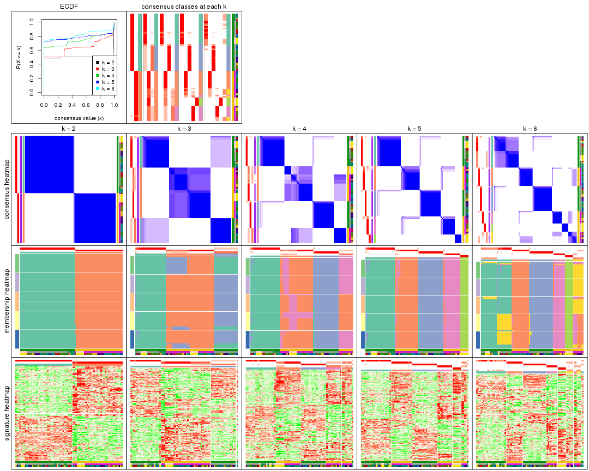

The plots are:

- The first row: a plot of the ECDF (Empirical cumulative distribution
  function) curves of the consensus matrix for each `k` and the heatmap of
  predicted classes for each `k`.
- The second row: heatmaps of the consensus matrix for each `k`.
- The third row: heatmaps of the membership matrix for each `k`.
- The fouth row: heatmaps of the signatures for each `k`.

All the plots in panels can be made by individual functions and they are
plotted later in this section.

`select_partition_number()` produces several plots showing different
statistics for choosing "optimized" `k`. There are following statistics:

- ECDF curves of the consensus matrix for each `k`;
- 1-PAC. [The PAC
  score](https://en.wikipedia.org/wiki/Consensus_clustering#Over-interpretation_potential_of_consensus_clustering)
  measures the proportion of the ambiguous subgrouping.
- Mean silhouette score.
- Concordance. The mean probability of fiting the consensus class ids in all
  partitions.
- Area increased. Denote $A_k$ as the area under the ECDF curve for current
  `k`, the area increased is defined as $A_k - A_{k-1}$.
- Rand index. The percent of pairs of samples that are both in a same cluster
  or both are not in a same cluster in the partition of k and k-1.
- Jaccard index. The ratio of pairs of samples are both in a same cluster in
  the partition of k and k-1 and the pairs of samples are both in a same
  cluster in the partition k or k-1.

The detailed explanations of these statistics can be found in [the cola
vignette](http://bioconductor.org/packages/devel/bioc/vignettes/cola/inst/doc/cola.html#toc_13).

Generally speaking, lower PAC score, higher mean silhouette score or higher
concordance corresponds to better partition. Rand index and Jaccard index
measure how similar the current partition is compared to partition with `k-1`.
If they are too similar, we won't accept `k` is better than `k-1`.

```r
select_partition_number(res)
```


The numeric values for all these statistics can be obtained by `get_stats()`.

```r
get_stats(res)
```

```
#>   k 1-PAC mean_silhouette concordance area_increased  Rand Jaccard
#> 2 2 1.000           0.994       0.997         0.5045 0.496   0.496
#> 3 3 0.742           0.914       0.866         0.2629 0.859   0.714
#> 4 4 0.843           0.782       0.852         0.1600 0.892   0.701
#> 5 5 0.943           0.893       0.962         0.0613 0.942   0.782
#> 6 6 0.895           0.805       0.869         0.0414 0.951   0.785
```

`suggest_best_k()` suggests the best $k$ based on these statistics. The rules are as follows:

- All $k$ with Jaccard index larger than 0.95 are removed because the increase of
  the partition number does not provides enough extra information. If all $k$ are removed,
  the best $k$ is assigned by `NA`.
- For $k$ with 1-PAC larger than 0.9, the maximal $k$ is taken as the "best k". Other $k$ is called "optional k".
- If it does not fit the second rule. The $k$ with the highest vote of highest
  1-PAC, mean silhouette and concordance is taken as the "best k".

```r
suggest_best_k(res)
```

```
#> [1] 5
#> attr(,"optional")
#> [1] 2
```

There is also optional best $k$ = 2 that is worth to check.

Following shows the table of the partitions (You need to click the **show/hide
code output** link to see it). The membership matrix (columns with name `p*`)
is inferred by
[`clue::cl_consensus()`](https://www.rdocumentation.org/link/cl_consensus?package=clue)
function with the `SE` method. Basically the value in the membership matrix
represents the probability to belong to a certain group. The finall class
label for an item is determined with the group with highest probability it
belongs to.

In `get_classes()` function, the entropy is calculated from the membership
matrix and the silhouette score is calculated from the consensus matrix.


<script>
$( function() {
	$( '#tabs-SD-pam-get-classes' ).tabs();
} );
</script>
<div id='tabs-SD-pam-get-classes'>
<ul>
<li><a href='#tab-SD-pam-get-classes-1'>k = 2</a></li>
<li><a href='#tab-SD-pam-get-classes-2'>k = 3</a></li>
<li><a href='#tab-SD-pam-get-classes-3'>k = 4</a></li>
<li><a href='#tab-SD-pam-get-classes-4'>k = 5</a></li>
<li><a href='#tab-SD-pam-get-classes-5'>k = 6</a></li>
</ul>

<div id='tab-SD-pam-get-classes-1'>
<p><a id='tab-SD-pam-get-classes-1-a' style='color:#0366d6' href='#'>show/hide code output</a></p>
<pre><code class="r">cbind(get_classes(res, k = 2), get_membership(res, k = 2))
</code></pre>

<pre><code>#&gt;          class entropy silhouette    p1    p2
#&gt; GSM87962     1   0.000      1.000 1.000 0.000
#&gt; GSM87963     1   0.000      1.000 1.000 0.000
#&gt; GSM87983     1   0.000      1.000 1.000 0.000
#&gt; GSM87984     1   0.000      1.000 1.000 0.000
#&gt; GSM87961     1   0.000      1.000 1.000 0.000
#&gt; GSM87970     1   0.000      1.000 1.000 0.000
#&gt; GSM87971     1   0.000      1.000 1.000 0.000
#&gt; GSM87990     1   0.000      1.000 1.000 0.000
#&gt; GSM87991     1   0.000      1.000 1.000 0.000
#&gt; GSM87974     1   0.000      1.000 1.000 0.000
#&gt; GSM87994     1   0.000      1.000 1.000 0.000
#&gt; GSM87978     1   0.000      1.000 1.000 0.000
#&gt; GSM87979     1   0.000      1.000 1.000 0.000
#&gt; GSM87998     1   0.000      1.000 1.000 0.000
#&gt; GSM87999     1   0.000      1.000 1.000 0.000
#&gt; GSM87968     1   0.000      1.000 1.000 0.000
#&gt; GSM87987     1   0.000      1.000 1.000 0.000
#&gt; GSM87969     1   0.000      1.000 1.000 0.000
#&gt; GSM87988     1   0.000      1.000 1.000 0.000
#&gt; GSM87989     1   0.000      1.000 1.000 0.000
#&gt; GSM87972     1   0.000      1.000 1.000 0.000
#&gt; GSM87992     1   0.000      1.000 1.000 0.000
#&gt; GSM87973     1   0.000      1.000 1.000 0.000
#&gt; GSM87993     1   0.000      1.000 1.000 0.000
#&gt; GSM87975     1   0.000      1.000 1.000 0.000
#&gt; GSM87995     1   0.000      1.000 1.000 0.000
#&gt; GSM87976     1   0.000      1.000 1.000 0.000
#&gt; GSM87977     1   0.000      1.000 1.000 0.000
#&gt; GSM87996     1   0.000      1.000 1.000 0.000
#&gt; GSM87997     1   0.000      1.000 1.000 0.000
#&gt; GSM87980     1   0.000      1.000 1.000 0.000
#&gt; GSM88000     1   0.000      1.000 1.000 0.000
#&gt; GSM87981     1   0.000      1.000 1.000 0.000
#&gt; GSM87982     1   0.000      1.000 1.000 0.000
#&gt; GSM88001     1   0.000      1.000 1.000 0.000
#&gt; GSM87967     1   0.000      1.000 1.000 0.000
#&gt; GSM87964     1   0.000      1.000 1.000 0.000
#&gt; GSM87965     1   0.000      1.000 1.000 0.000
#&gt; GSM87966     1   0.000      1.000 1.000 0.000
#&gt; GSM87985     1   0.000      1.000 1.000 0.000
#&gt; GSM87986     1   0.000      1.000 1.000 0.000
#&gt; GSM88004     2   0.000      0.994 0.000 1.000
#&gt; GSM88015     2   0.000      0.994 0.000 1.000
#&gt; GSM88005     2   0.000      0.994 0.000 1.000
#&gt; GSM88006     2   0.000      0.994 0.000 1.000
#&gt; GSM88016     2   0.000      0.994 0.000 1.000
#&gt; GSM88007     2   0.000      0.994 0.000 1.000
#&gt; GSM88017     2   0.000      0.994 0.000 1.000
#&gt; GSM88029     2   0.000      0.994 0.000 1.000
#&gt; GSM88008     2   0.000      0.994 0.000 1.000
#&gt; GSM88009     2   0.000      0.994 0.000 1.000
#&gt; GSM88018     2   0.000      0.994 0.000 1.000
#&gt; GSM88024     2   0.000      0.994 0.000 1.000
#&gt; GSM88030     2   0.000      0.994 0.000 1.000
#&gt; GSM88036     2   0.000      0.994 0.000 1.000
#&gt; GSM88010     2   0.000      0.994 0.000 1.000
#&gt; GSM88011     2   0.000      0.994 0.000 1.000
#&gt; GSM88019     2   0.000      0.994 0.000 1.000
#&gt; GSM88027     2   0.000      0.994 0.000 1.000
#&gt; GSM88031     2   0.000      0.994 0.000 1.000
#&gt; GSM88012     2   0.000      0.994 0.000 1.000
#&gt; GSM88020     2   0.000      0.994 0.000 1.000
#&gt; GSM88032     2   0.000      0.994 0.000 1.000
#&gt; GSM88037     2   0.000      0.994 0.000 1.000
#&gt; GSM88013     2   0.000      0.994 0.000 1.000
#&gt; GSM88021     2   0.000      0.994 0.000 1.000
#&gt; GSM88025     2   0.000      0.994 0.000 1.000
#&gt; GSM88033     2   0.000      0.994 0.000 1.000
#&gt; GSM88014     2   0.000      0.994 0.000 1.000
#&gt; GSM88022     2   0.000      0.994 0.000 1.000
#&gt; GSM88034     2   0.753      0.724 0.216 0.784
#&gt; GSM88002     2   0.000      0.994 0.000 1.000
#&gt; GSM88003     2   0.000      0.994 0.000 1.000
#&gt; GSM88023     2   0.000      0.994 0.000 1.000
#&gt; GSM88026     2   0.000      0.994 0.000 1.000
#&gt; GSM88028     2   0.000      0.994 0.000 1.000
#&gt; GSM88035     2   0.000      0.994 0.000 1.000
</code></pre>

<script>
$('#tab-SD-pam-get-classes-1-a').parent().next().next().hide();
$('#tab-SD-pam-get-classes-1-a').click(function(){
  $('#tab-SD-pam-get-classes-1-a').parent().next().next().toggle();
  return(false);
});
</script>
</div>

<div id='tab-SD-pam-get-classes-2'>
<p><a id='tab-SD-pam-get-classes-2-a' style='color:#0366d6' href='#'>show/hide code output</a></p>
<pre><code class="r">cbind(get_classes(res, k = 3), get_membership(res, k = 3))
</code></pre>

<pre><code>#&gt;          class entropy silhouette    p1    p2    p3
#&gt; GSM87962     1  0.0000      0.959 1.000 0.000 0.000
#&gt; GSM87963     1  0.0000      0.959 1.000 0.000 0.000
#&gt; GSM87983     1  0.0000      0.959 1.000 0.000 0.000
#&gt; GSM87984     1  0.0000      0.959 1.000 0.000 0.000
#&gt; GSM87961     1  0.0000      0.959 1.000 0.000 0.000
#&gt; GSM87970     1  0.0000      0.959 1.000 0.000 0.000
#&gt; GSM87971     1  0.0000      0.959 1.000 0.000 0.000
#&gt; GSM87990     1  0.0000      0.959 1.000 0.000 0.000
#&gt; GSM87991     1  0.0000      0.959 1.000 0.000 0.000
#&gt; GSM87974     1  0.0000      0.959 1.000 0.000 0.000
#&gt; GSM87994     1  0.0000      0.959 1.000 0.000 0.000
#&gt; GSM87978     1  0.0000      0.959 1.000 0.000 0.000
#&gt; GSM87979     1  0.0000      0.959 1.000 0.000 0.000
#&gt; GSM87998     1  0.3686      0.754 0.860 0.000 0.140
#&gt; GSM87999     1  0.2878      0.832 0.904 0.000 0.096
#&gt; GSM87968     1  0.0000      0.959 1.000 0.000 0.000
#&gt; GSM87987     1  0.6062     -0.143 0.616 0.000 0.384
#&gt; GSM87969     1  0.0424      0.951 0.992 0.000 0.008
#&gt; GSM87988     3  0.5465      0.999 0.288 0.000 0.712
#&gt; GSM87989     3  0.5465      0.999 0.288 0.000 0.712
#&gt; GSM87972     3  0.5591      0.975 0.304 0.000 0.696
#&gt; GSM87992     3  0.5465      0.999 0.288 0.000 0.712
#&gt; GSM87973     3  0.5465      0.999 0.288 0.000 0.712
#&gt; GSM87993     3  0.5465      0.999 0.288 0.000 0.712
#&gt; GSM87975     3  0.5465      0.999 0.288 0.000 0.712
#&gt; GSM87995     3  0.5465      0.999 0.288 0.000 0.712
#&gt; GSM87976     3  0.5465      0.999 0.288 0.000 0.712
#&gt; GSM87977     3  0.5465      0.999 0.288 0.000 0.712
#&gt; GSM87996     3  0.5465      0.999 0.288 0.000 0.712
#&gt; GSM87997     3  0.5465      0.999 0.288 0.000 0.712
#&gt; GSM87980     3  0.5465      0.999 0.288 0.000 0.712
#&gt; GSM88000     3  0.5465      0.999 0.288 0.000 0.712
#&gt; GSM87981     3  0.5465      0.999 0.288 0.000 0.712
#&gt; GSM87982     3  0.5465      0.999 0.288 0.000 0.712
#&gt; GSM88001     3  0.5465      0.999 0.288 0.000 0.712
#&gt; GSM87967     3  0.5465      0.999 0.288 0.000 0.712
#&gt; GSM87964     1  0.0000      0.959 1.000 0.000 0.000
#&gt; GSM87965     1  0.0000      0.959 1.000 0.000 0.000
#&gt; GSM87966     1  0.0000      0.959 1.000 0.000 0.000
#&gt; GSM87985     1  0.0000      0.959 1.000 0.000 0.000
#&gt; GSM87986     1  0.0000      0.959 1.000 0.000 0.000
#&gt; GSM88004     2  0.0000      0.900 0.000 1.000 0.000
#&gt; GSM88015     2  0.0000      0.900 0.000 1.000 0.000
#&gt; GSM88005     2  0.0000      0.900 0.000 1.000 0.000
#&gt; GSM88006     2  0.0000      0.900 0.000 1.000 0.000
#&gt; GSM88016     2  0.0000      0.900 0.000 1.000 0.000
#&gt; GSM88007     2  0.0000      0.900 0.000 1.000 0.000
#&gt; GSM88017     2  0.0000      0.900 0.000 1.000 0.000
#&gt; GSM88029     2  0.0000      0.900 0.000 1.000 0.000
#&gt; GSM88008     2  0.0000      0.900 0.000 1.000 0.000
#&gt; GSM88009     2  0.0000      0.900 0.000 1.000 0.000
#&gt; GSM88018     2  0.0000      0.900 0.000 1.000 0.000
#&gt; GSM88024     2  0.0000      0.900 0.000 1.000 0.000
#&gt; GSM88030     2  0.3412      0.887 0.000 0.876 0.124
#&gt; GSM88036     2  0.2165      0.890 0.000 0.936 0.064
#&gt; GSM88010     2  0.4504      0.880 0.000 0.804 0.196
#&gt; GSM88011     2  0.4504      0.880 0.000 0.804 0.196
#&gt; GSM88019     2  0.4887      0.874 0.000 0.772 0.228
#&gt; GSM88027     2  0.4702      0.877 0.000 0.788 0.212
#&gt; GSM88031     2  0.5465      0.860 0.000 0.712 0.288
#&gt; GSM88012     2  0.4504      0.880 0.000 0.804 0.196
#&gt; GSM88020     2  0.5465      0.860 0.000 0.712 0.288
#&gt; GSM88032     2  0.5465      0.860 0.000 0.712 0.288
#&gt; GSM88037     2  0.5465      0.860 0.000 0.712 0.288
#&gt; GSM88013     2  0.5465      0.860 0.000 0.712 0.288
#&gt; GSM88021     2  0.5465      0.860 0.000 0.712 0.288
#&gt; GSM88025     2  0.5465      0.860 0.000 0.712 0.288
#&gt; GSM88033     2  0.5465      0.860 0.000 0.712 0.288
#&gt; GSM88014     2  0.5465      0.860 0.000 0.712 0.288
#&gt; GSM88022     2  0.5465      0.860 0.000 0.712 0.288
#&gt; GSM88034     2  0.5465      0.860 0.000 0.712 0.288
#&gt; GSM88002     2  0.0000      0.900 0.000 1.000 0.000
#&gt; GSM88003     2  0.0000      0.900 0.000 1.000 0.000
#&gt; GSM88023     2  0.0000      0.900 0.000 1.000 0.000
#&gt; GSM88026     2  0.0000      0.900 0.000 1.000 0.000
#&gt; GSM88028     2  0.0000      0.900 0.000 1.000 0.000
#&gt; GSM88035     2  0.0000      0.900 0.000 1.000 0.000
</code></pre>

<script>
$('#tab-SD-pam-get-classes-2-a').parent().next().next().hide();
$('#tab-SD-pam-get-classes-2-a').click(function(){
  $('#tab-SD-pam-get-classes-2-a').parent().next().next().toggle();
  return(false);
});
</script>
</div>

<div id='tab-SD-pam-get-classes-3'>
<p><a id='tab-SD-pam-get-classes-3-a' style='color:#0366d6' href='#'>show/hide code output</a></p>
<pre><code class="r">cbind(get_classes(res, k = 4), get_membership(res, k = 4))
</code></pre>

<pre><code>#&gt;          class entropy silhouette    p1    p2    p3    p4
#&gt; GSM87962     1  0.0000     0.9727 1.000 0.000 0.000 0.000
#&gt; GSM87963     1  0.0000     0.9727 1.000 0.000 0.000 0.000
#&gt; GSM87983     1  0.0000     0.9727 1.000 0.000 0.000 0.000
#&gt; GSM87984     1  0.0000     0.9727 1.000 0.000 0.000 0.000
#&gt; GSM87961     1  0.0000     0.9727 1.000 0.000 0.000 0.000
#&gt; GSM87970     1  0.0000     0.9727 1.000 0.000 0.000 0.000
#&gt; GSM87971     1  0.0000     0.9727 1.000 0.000 0.000 0.000
#&gt; GSM87990     1  0.0000     0.9727 1.000 0.000 0.000 0.000
#&gt; GSM87991     1  0.0000     0.9727 1.000 0.000 0.000 0.000
#&gt; GSM87974     1  0.0000     0.9727 1.000 0.000 0.000 0.000
#&gt; GSM87994     1  0.0000     0.9727 1.000 0.000 0.000 0.000
#&gt; GSM87978     1  0.0000     0.9727 1.000 0.000 0.000 0.000
#&gt; GSM87979     1  0.0000     0.9727 1.000 0.000 0.000 0.000
#&gt; GSM87998     1  0.4564     0.5216 0.672 0.000 0.328 0.000
#&gt; GSM87999     1  0.2814     0.8442 0.868 0.000 0.132 0.000
#&gt; GSM87968     1  0.0188     0.9697 0.996 0.000 0.004 0.000
#&gt; GSM87987     3  0.4925     0.2256 0.428 0.000 0.572 0.000
#&gt; GSM87969     1  0.2216     0.8887 0.908 0.000 0.092 0.000
#&gt; GSM87988     3  0.0000     0.9736 0.000 0.000 1.000 0.000
#&gt; GSM87989     3  0.0000     0.9736 0.000 0.000 1.000 0.000
#&gt; GSM87972     3  0.0592     0.9586 0.016 0.000 0.984 0.000
#&gt; GSM87992     3  0.0000     0.9736 0.000 0.000 1.000 0.000
#&gt; GSM87973     3  0.0000     0.9736 0.000 0.000 1.000 0.000
#&gt; GSM87993     3  0.0000     0.9736 0.000 0.000 1.000 0.000
#&gt; GSM87975     3  0.0000     0.9736 0.000 0.000 1.000 0.000
#&gt; GSM87995     3  0.0000     0.9736 0.000 0.000 1.000 0.000
#&gt; GSM87976     3  0.0000     0.9736 0.000 0.000 1.000 0.000
#&gt; GSM87977     3  0.0000     0.9736 0.000 0.000 1.000 0.000
#&gt; GSM87996     3  0.0000     0.9736 0.000 0.000 1.000 0.000
#&gt; GSM87997     3  0.0000     0.9736 0.000 0.000 1.000 0.000
#&gt; GSM87980     3  0.0000     0.9736 0.000 0.000 1.000 0.000
#&gt; GSM88000     3  0.0000     0.9736 0.000 0.000 1.000 0.000
#&gt; GSM87981     3  0.0000     0.9736 0.000 0.000 1.000 0.000
#&gt; GSM87982     3  0.0000     0.9736 0.000 0.000 1.000 0.000
#&gt; GSM88001     3  0.0000     0.9736 0.000 0.000 1.000 0.000
#&gt; GSM87967     3  0.0000     0.9736 0.000 0.000 1.000 0.000
#&gt; GSM87964     1  0.0000     0.9727 1.000 0.000 0.000 0.000
#&gt; GSM87965     1  0.0000     0.9727 1.000 0.000 0.000 0.000
#&gt; GSM87966     1  0.0000     0.9727 1.000 0.000 0.000 0.000
#&gt; GSM87985     1  0.0000     0.9727 1.000 0.000 0.000 0.000
#&gt; GSM87986     1  0.0000     0.9727 1.000 0.000 0.000 0.000
#&gt; GSM88004     2  0.0000     0.6969 0.000 1.000 0.000 0.000
#&gt; GSM88015     2  0.0000     0.6969 0.000 1.000 0.000 0.000
#&gt; GSM88005     2  0.0000     0.6969 0.000 1.000 0.000 0.000
#&gt; GSM88006     2  0.0000     0.6969 0.000 1.000 0.000 0.000
#&gt; GSM88016     2  0.0000     0.6969 0.000 1.000 0.000 0.000
#&gt; GSM88007     2  0.0000     0.6969 0.000 1.000 0.000 0.000
#&gt; GSM88017     2  0.0000     0.6969 0.000 1.000 0.000 0.000
#&gt; GSM88029     2  0.0000     0.6969 0.000 1.000 0.000 0.000
#&gt; GSM88008     2  0.0000     0.6969 0.000 1.000 0.000 0.000
#&gt; GSM88009     2  0.0000     0.6969 0.000 1.000 0.000 0.000
#&gt; GSM88018     2  0.0000     0.6969 0.000 1.000 0.000 0.000
#&gt; GSM88024     2  0.0000     0.6969 0.000 1.000 0.000 0.000
#&gt; GSM88030     2  0.4661    -0.0538 0.000 0.652 0.000 0.348
#&gt; GSM88036     2  0.3688     0.3938 0.000 0.792 0.000 0.208
#&gt; GSM88010     2  0.4164     0.2241 0.000 0.736 0.000 0.264
#&gt; GSM88011     2  0.4877    -0.3146 0.000 0.592 0.000 0.408
#&gt; GSM88019     2  0.4994    -0.5456 0.000 0.520 0.000 0.480
#&gt; GSM88027     2  0.4941    -0.4070 0.000 0.564 0.000 0.436
#&gt; GSM88031     4  0.4564     1.0000 0.000 0.328 0.000 0.672
#&gt; GSM88012     2  0.4866    -0.3009 0.000 0.596 0.000 0.404
#&gt; GSM88020     4  0.4564     1.0000 0.000 0.328 0.000 0.672
#&gt; GSM88032     4  0.4564     1.0000 0.000 0.328 0.000 0.672
#&gt; GSM88037     4  0.4564     1.0000 0.000 0.328 0.000 0.672
#&gt; GSM88013     4  0.4564     1.0000 0.000 0.328 0.000 0.672
#&gt; GSM88021     4  0.4564     1.0000 0.000 0.328 0.000 0.672
#&gt; GSM88025     4  0.4564     1.0000 0.000 0.328 0.000 0.672
#&gt; GSM88033     4  0.4564     1.0000 0.000 0.328 0.000 0.672
#&gt; GSM88014     4  0.4564     1.0000 0.000 0.328 0.000 0.672
#&gt; GSM88022     4  0.4564     1.0000 0.000 0.328 0.000 0.672
#&gt; GSM88034     4  0.4564     1.0000 0.000 0.328 0.000 0.672
#&gt; GSM88002     2  0.4564     0.5702 0.000 0.672 0.000 0.328
#&gt; GSM88003     2  0.4564     0.5702 0.000 0.672 0.000 0.328
#&gt; GSM88023     2  0.4564     0.5702 0.000 0.672 0.000 0.328
#&gt; GSM88026     2  0.4564     0.5702 0.000 0.672 0.000 0.328
#&gt; GSM88028     2  0.4564     0.5702 0.000 0.672 0.000 0.328
#&gt; GSM88035     2  0.4564     0.5702 0.000 0.672 0.000 0.328
</code></pre>

<script>
$('#tab-SD-pam-get-classes-3-a').parent().next().next().hide();
$('#tab-SD-pam-get-classes-3-a').click(function(){
  $('#tab-SD-pam-get-classes-3-a').parent().next().next().toggle();
  return(false);
});
</script>
</div>

<div id='tab-SD-pam-get-classes-4'>
<p><a id='tab-SD-pam-get-classes-4-a' style='color:#0366d6' href='#'>show/hide code output</a></p>
<pre><code class="r">cbind(get_classes(res, k = 5), get_membership(res, k = 5))
</code></pre>

<pre><code>#&gt;          class entropy silhouette    p1    p2    p3    p4 p5
#&gt; GSM87962     1  0.0000      0.968 1.000 0.000 0.000 0.000  0
#&gt; GSM87963     1  0.0000      0.968 1.000 0.000 0.000 0.000  0
#&gt; GSM87983     1  0.0000      0.968 1.000 0.000 0.000 0.000  0
#&gt; GSM87984     1  0.0000      0.968 1.000 0.000 0.000 0.000  0
#&gt; GSM87961     1  0.0000      0.968 1.000 0.000 0.000 0.000  0
#&gt; GSM87970     1  0.0000      0.968 1.000 0.000 0.000 0.000  0
#&gt; GSM87971     1  0.0000      0.968 1.000 0.000 0.000 0.000  0
#&gt; GSM87990     1  0.0000      0.968 1.000 0.000 0.000 0.000  0
#&gt; GSM87991     1  0.0000      0.968 1.000 0.000 0.000 0.000  0
#&gt; GSM87974     1  0.0000      0.968 1.000 0.000 0.000 0.000  0
#&gt; GSM87994     1  0.0000      0.968 1.000 0.000 0.000 0.000  0
#&gt; GSM87978     1  0.0000      0.968 1.000 0.000 0.000 0.000  0
#&gt; GSM87979     1  0.0000      0.968 1.000 0.000 0.000 0.000  0
#&gt; GSM87998     1  0.3932      0.522 0.672 0.000 0.328 0.000  0
#&gt; GSM87999     1  0.2424      0.829 0.868 0.000 0.132 0.000  0
#&gt; GSM87968     1  0.0162      0.965 0.996 0.000 0.004 0.000  0
#&gt; GSM87987     3  0.4242      0.226 0.428 0.000 0.572 0.000  0
#&gt; GSM87969     1  0.1908      0.876 0.908 0.000 0.092 0.000  0
#&gt; GSM87988     3  0.0000      0.969 0.000 0.000 1.000 0.000  0
#&gt; GSM87989     3  0.0000      0.969 0.000 0.000 1.000 0.000  0
#&gt; GSM87972     3  0.0510      0.951 0.016 0.000 0.984 0.000  0
#&gt; GSM87992     3  0.0000      0.969 0.000 0.000 1.000 0.000  0
#&gt; GSM87973     3  0.0000      0.969 0.000 0.000 1.000 0.000  0
#&gt; GSM87993     3  0.0000      0.969 0.000 0.000 1.000 0.000  0
#&gt; GSM87975     3  0.0000      0.969 0.000 0.000 1.000 0.000  0
#&gt; GSM87995     3  0.0000      0.969 0.000 0.000 1.000 0.000  0
#&gt; GSM87976     3  0.0000      0.969 0.000 0.000 1.000 0.000  0
#&gt; GSM87977     3  0.0000      0.969 0.000 0.000 1.000 0.000  0
#&gt; GSM87996     3  0.0000      0.969 0.000 0.000 1.000 0.000  0
#&gt; GSM87997     3  0.0000      0.969 0.000 0.000 1.000 0.000  0
#&gt; GSM87980     3  0.0000      0.969 0.000 0.000 1.000 0.000  0
#&gt; GSM88000     3  0.0000      0.969 0.000 0.000 1.000 0.000  0
#&gt; GSM87981     3  0.0000      0.969 0.000 0.000 1.000 0.000  0
#&gt; GSM87982     3  0.0000      0.969 0.000 0.000 1.000 0.000  0
#&gt; GSM88001     3  0.0000      0.969 0.000 0.000 1.000 0.000  0
#&gt; GSM87967     3  0.0000      0.969 0.000 0.000 1.000 0.000  0
#&gt; GSM87964     1  0.0000      0.968 1.000 0.000 0.000 0.000  0
#&gt; GSM87965     1  0.0000      0.968 1.000 0.000 0.000 0.000  0
#&gt; GSM87966     1  0.0000      0.968 1.000 0.000 0.000 0.000  0
#&gt; GSM87985     1  0.0000      0.968 1.000 0.000 0.000 0.000  0
#&gt; GSM87986     1  0.0000      0.968 1.000 0.000 0.000 0.000  0
#&gt; GSM88004     2  0.0000      0.923 0.000 1.000 0.000 0.000  0
#&gt; GSM88015     2  0.0000      0.923 0.000 1.000 0.000 0.000  0
#&gt; GSM88005     2  0.0000      0.923 0.000 1.000 0.000 0.000  0
#&gt; GSM88006     2  0.0000      0.923 0.000 1.000 0.000 0.000  0
#&gt; GSM88016     2  0.0000      0.923 0.000 1.000 0.000 0.000  0
#&gt; GSM88007     2  0.0000      0.923 0.000 1.000 0.000 0.000  0
#&gt; GSM88017     2  0.0000      0.923 0.000 1.000 0.000 0.000  0
#&gt; GSM88029     2  0.0000      0.923 0.000 1.000 0.000 0.000  0
#&gt; GSM88008     2  0.0000      0.923 0.000 1.000 0.000 0.000  0
#&gt; GSM88009     2  0.0000      0.923 0.000 1.000 0.000 0.000  0
#&gt; GSM88018     2  0.0000      0.923 0.000 1.000 0.000 0.000  0
#&gt; GSM88024     2  0.0000      0.923 0.000 1.000 0.000 0.000  0
#&gt; GSM88030     4  0.4307     -0.045 0.000 0.500 0.000 0.500  0
#&gt; GSM88036     2  0.4074      0.362 0.000 0.636 0.000 0.364  0
#&gt; GSM88010     2  0.0703      0.908 0.000 0.976 0.000 0.024  0
#&gt; GSM88011     2  0.2074      0.840 0.000 0.896 0.000 0.104  0
#&gt; GSM88019     4  0.4114      0.315 0.000 0.376 0.000 0.624  0
#&gt; GSM88027     2  0.4171      0.324 0.000 0.604 0.000 0.396  0
#&gt; GSM88031     4  0.0000      0.908 0.000 0.000 0.000 1.000  0
#&gt; GSM88012     2  0.2929      0.751 0.000 0.820 0.000 0.180  0
#&gt; GSM88020     4  0.0000      0.908 0.000 0.000 0.000 1.000  0
#&gt; GSM88032     4  0.0000      0.908 0.000 0.000 0.000 1.000  0
#&gt; GSM88037     4  0.0000      0.908 0.000 0.000 0.000 1.000  0
#&gt; GSM88013     4  0.0000      0.908 0.000 0.000 0.000 1.000  0
#&gt; GSM88021     4  0.0000      0.908 0.000 0.000 0.000 1.000  0
#&gt; GSM88025     4  0.0000      0.908 0.000 0.000 0.000 1.000  0
#&gt; GSM88033     4  0.0000      0.908 0.000 0.000 0.000 1.000  0
#&gt; GSM88014     4  0.0000      0.908 0.000 0.000 0.000 1.000  0
#&gt; GSM88022     4  0.0000      0.908 0.000 0.000 0.000 1.000  0
#&gt; GSM88034     4  0.0000      0.908 0.000 0.000 0.000 1.000  0
#&gt; GSM88002     5  0.0000      1.000 0.000 0.000 0.000 0.000  1
#&gt; GSM88003     5  0.0000      1.000 0.000 0.000 0.000 0.000  1
#&gt; GSM88023     5  0.0000      1.000 0.000 0.000 0.000 0.000  1
#&gt; GSM88026     5  0.0000      1.000 0.000 0.000 0.000 0.000  1
#&gt; GSM88028     5  0.0000      1.000 0.000 0.000 0.000 0.000  1
#&gt; GSM88035     5  0.0000      1.000 0.000 0.000 0.000 0.000  1
</code></pre>

<script>
$('#tab-SD-pam-get-classes-4-a').parent().next().next().hide();
$('#tab-SD-pam-get-classes-4-a').click(function(){
  $('#tab-SD-pam-get-classes-4-a').parent().next().next().toggle();
  return(false);
});
</script>
</div>

<div id='tab-SD-pam-get-classes-5'>
<p><a id='tab-SD-pam-get-classes-5-a' style='color:#0366d6' href='#'>show/hide code output</a></p>
<pre><code class="r">cbind(get_classes(res, k = 6), get_membership(res, k = 6))
</code></pre>

<pre><code>#&gt;          class entropy silhouette    p1    p2    p3    p4 p5    p6
#&gt; GSM87962     1  0.3782      0.756 0.588 0.000 0.000 0.000  0 0.412
#&gt; GSM87963     1  0.3782      0.756 0.588 0.000 0.000 0.000  0 0.412
#&gt; GSM87983     1  0.3782      0.756 0.588 0.000 0.000 0.000  0 0.412
#&gt; GSM87984     1  0.3782      0.756 0.588 0.000 0.000 0.000  0 0.412
#&gt; GSM87961     1  0.3782      0.756 0.588 0.000 0.000 0.000  0 0.412
#&gt; GSM87970     1  0.0000      0.721 1.000 0.000 0.000 0.000  0 0.000
#&gt; GSM87971     1  0.0000      0.721 1.000 0.000 0.000 0.000  0 0.000
#&gt; GSM87990     1  0.3592      0.757 0.656 0.000 0.000 0.000  0 0.344
#&gt; GSM87991     1  0.3774      0.756 0.592 0.000 0.000 0.000  0 0.408
#&gt; GSM87974     1  0.0000      0.721 1.000 0.000 0.000 0.000  0 0.000
#&gt; GSM87994     1  0.3578      0.757 0.660 0.000 0.000 0.000  0 0.340
#&gt; GSM87978     1  0.0000      0.721 1.000 0.000 0.000 0.000  0 0.000
#&gt; GSM87979     1  0.0000      0.721 1.000 0.000 0.000 0.000  0 0.000
#&gt; GSM87998     1  0.2260      0.599 0.860 0.000 0.140 0.000  0 0.000
#&gt; GSM87999     1  0.0790      0.705 0.968 0.000 0.032 0.000  0 0.000
#&gt; GSM87968     1  0.0146      0.719 0.996 0.000 0.004 0.000  0 0.000
#&gt; GSM87987     1  0.3868     -0.258 0.508 0.000 0.492 0.000  0 0.000
#&gt; GSM87969     1  0.1387      0.673 0.932 0.000 0.068 0.000  0 0.000
#&gt; GSM87988     3  0.0000      0.970 0.000 0.000 1.000 0.000  0 0.000
#&gt; GSM87989     3  0.0000      0.970 0.000 0.000 1.000 0.000  0 0.000
#&gt; GSM87972     3  0.3789      0.419 0.416 0.000 0.584 0.000  0 0.000
#&gt; GSM87992     3  0.0000      0.970 0.000 0.000 1.000 0.000  0 0.000
#&gt; GSM87973     3  0.0000      0.970 0.000 0.000 1.000 0.000  0 0.000
#&gt; GSM87993     3  0.0000      0.970 0.000 0.000 1.000 0.000  0 0.000
#&gt; GSM87975     3  0.0000      0.970 0.000 0.000 1.000 0.000  0 0.000
#&gt; GSM87995     3  0.0000      0.970 0.000 0.000 1.000 0.000  0 0.000
#&gt; GSM87976     3  0.1007      0.928 0.044 0.000 0.956 0.000  0 0.000
#&gt; GSM87977     3  0.0000      0.970 0.000 0.000 1.000 0.000  0 0.000
#&gt; GSM87996     3  0.0000      0.970 0.000 0.000 1.000 0.000  0 0.000
#&gt; GSM87997     3  0.0000      0.970 0.000 0.000 1.000 0.000  0 0.000
#&gt; GSM87980     3  0.0000      0.970 0.000 0.000 1.000 0.000  0 0.000
#&gt; GSM88000     3  0.0000      0.970 0.000 0.000 1.000 0.000  0 0.000
#&gt; GSM87981     3  0.0000      0.970 0.000 0.000 1.000 0.000  0 0.000
#&gt; GSM87982     3  0.0000      0.970 0.000 0.000 1.000 0.000  0 0.000
#&gt; GSM88001     3  0.0000      0.970 0.000 0.000 1.000 0.000  0 0.000
#&gt; GSM87967     3  0.0000      0.970 0.000 0.000 1.000 0.000  0 0.000
#&gt; GSM87964     1  0.0713      0.724 0.972 0.000 0.000 0.000  0 0.028
#&gt; GSM87965     1  0.3782      0.756 0.588 0.000 0.000 0.000  0 0.412
#&gt; GSM87966     1  0.3782      0.756 0.588 0.000 0.000 0.000  0 0.412
#&gt; GSM87985     1  0.3782      0.756 0.588 0.000 0.000 0.000  0 0.412
#&gt; GSM87986     1  0.3782      0.756 0.588 0.000 0.000 0.000  0 0.412
#&gt; GSM88004     2  0.0000      0.948 0.000 1.000 0.000 0.000  0 0.000
#&gt; GSM88015     2  0.0000      0.948 0.000 1.000 0.000 0.000  0 0.000
#&gt; GSM88005     2  0.0000      0.948 0.000 1.000 0.000 0.000  0 0.000
#&gt; GSM88006     2  0.0000      0.948 0.000 1.000 0.000 0.000  0 0.000
#&gt; GSM88016     2  0.0146      0.947 0.000 0.996 0.000 0.000  0 0.004
#&gt; GSM88007     2  0.0000      0.948 0.000 1.000 0.000 0.000  0 0.000
#&gt; GSM88017     2  0.0146      0.947 0.000 0.996 0.000 0.000  0 0.004
#&gt; GSM88029     2  0.0458      0.936 0.000 0.984 0.000 0.000  0 0.016
#&gt; GSM88008     2  0.0000      0.948 0.000 1.000 0.000 0.000  0 0.000
#&gt; GSM88009     2  0.0000      0.948 0.000 1.000 0.000 0.000  0 0.000
#&gt; GSM88018     2  0.0146      0.947 0.000 0.996 0.000 0.000  0 0.004
#&gt; GSM88024     2  0.0146      0.947 0.000 0.996 0.000 0.000  0 0.004
#&gt; GSM88030     4  0.4310      0.171 0.000 0.440 0.000 0.540  0 0.020
#&gt; GSM88036     2  0.4092      0.314 0.000 0.636 0.000 0.344  0 0.020
#&gt; GSM88010     6  0.4161      0.549 0.000 0.448 0.000 0.012  0 0.540
#&gt; GSM88011     6  0.4395      0.613 0.000 0.404 0.000 0.028  0 0.568
#&gt; GSM88019     6  0.5463      0.647 0.000 0.312 0.000 0.148  0 0.540
#&gt; GSM88027     6  0.4624      0.585 0.000 0.432 0.000 0.040  0 0.528
#&gt; GSM88031     4  0.0000      0.915 0.000 0.000 0.000 1.000  0 0.000
#&gt; GSM88012     6  0.4508      0.622 0.000 0.396 0.000 0.036  0 0.568
#&gt; GSM88020     4  0.0000      0.915 0.000 0.000 0.000 1.000  0 0.000
#&gt; GSM88032     4  0.0000      0.915 0.000 0.000 0.000 1.000  0 0.000
#&gt; GSM88037     4  0.0000      0.915 0.000 0.000 0.000 1.000  0 0.000
#&gt; GSM88013     6  0.3817      0.353 0.000 0.000 0.000 0.432  0 0.568
#&gt; GSM88021     4  0.0000      0.915 0.000 0.000 0.000 1.000  0 0.000
#&gt; GSM88025     4  0.0000      0.915 0.000 0.000 0.000 1.000  0 0.000
#&gt; GSM88033     4  0.0000      0.915 0.000 0.000 0.000 1.000  0 0.000
#&gt; GSM88014     6  0.3817      0.353 0.000 0.000 0.000 0.432  0 0.568
#&gt; GSM88022     6  0.3817      0.353 0.000 0.000 0.000 0.432  0 0.568
#&gt; GSM88034     4  0.0000      0.915 0.000 0.000 0.000 1.000  0 0.000
#&gt; GSM88002     5  0.0000      1.000 0.000 0.000 0.000 0.000  1 0.000
#&gt; GSM88003     5  0.0000      1.000 0.000 0.000 0.000 0.000  1 0.000
#&gt; GSM88023     5  0.0000      1.000 0.000 0.000 0.000 0.000  1 0.000
#&gt; GSM88026     5  0.0000      1.000 0.000 0.000 0.000 0.000  1 0.000
#&gt; GSM88028     5  0.0000      1.000 0.000 0.000 0.000 0.000  1 0.000
#&gt; GSM88035     5  0.0000      1.000 0.000 0.000 0.000 0.000  1 0.000
</code></pre>

<script>
$('#tab-SD-pam-get-classes-5-a').parent().next().next().hide();
$('#tab-SD-pam-get-classes-5-a').click(function(){
  $('#tab-SD-pam-get-classes-5-a').parent().next().next().toggle();
  return(false);
});
</script>
</div>
</div>

Heatmaps for the consensus matrix. It visualizes the probability of two
samples to be in a same group.


<script>
$( function() {
	$( '#tabs-SD-pam-consensus-heatmap' ).tabs();
} );
</script>
<div id='tabs-SD-pam-consensus-heatmap'>
<ul>
<li><a href='#tab-SD-pam-consensus-heatmap-1'>k = 2</a></li>
<li><a href='#tab-SD-pam-consensus-heatmap-2'>k = 3</a></li>
<li><a href='#tab-SD-pam-consensus-heatmap-3'>k = 4</a></li>
<li><a href='#tab-SD-pam-consensus-heatmap-4'>k = 5</a></li>
<li><a href='#tab-SD-pam-consensus-heatmap-5'>k = 6</a></li>
</ul>
<div id='tab-SD-pam-consensus-heatmap-1'>
<pre><code class="r">consensus_heatmap(res, k = 2)
</code></pre>

<p></p>

</div>
<div id='tab-SD-pam-consensus-heatmap-2'>
<pre><code class="r">consensus_heatmap(res, k = 3)
</code></pre>

<p></p>

</div>
<div id='tab-SD-pam-consensus-heatmap-3'>
<pre><code class="r">consensus_heatmap(res, k = 4)
</code></pre>

<p></p>

</div>
<div id='tab-SD-pam-consensus-heatmap-4'>
<pre><code class="r">consensus_heatmap(res, k = 5)
</code></pre>

<p></p>

</div>
<div id='tab-SD-pam-consensus-heatmap-5'>
<pre><code class="r">consensus_heatmap(res, k = 6)
</code></pre>

<p></p>

</div>
</div>

Heatmaps for the membership of samples in all partitions to see how consistent they are:


<script>
$( function() {
	$( '#tabs-SD-pam-membership-heatmap' ).tabs();
} );
</script>
<div id='tabs-SD-pam-membership-heatmap'>
<ul>
<li><a href='#tab-SD-pam-membership-heatmap-1'>k = 2</a></li>
<li><a href='#tab-SD-pam-membership-heatmap-2'>k = 3</a></li>
<li><a href='#tab-SD-pam-membership-heatmap-3'>k = 4</a></li>
<li><a href='#tab-SD-pam-membership-heatmap-4'>k = 5</a></li>
<li><a href='#tab-SD-pam-membership-heatmap-5'>k = 6</a></li>
</ul>
<div id='tab-SD-pam-membership-heatmap-1'>
<pre><code class="r">membership_heatmap(res, k = 2)
</code></pre>

<p></p>

</div>
<div id='tab-SD-pam-membership-heatmap-2'>
<pre><code class="r">membership_heatmap(res, k = 3)
</code></pre>

<p></p>

</div>
<div id='tab-SD-pam-membership-heatmap-3'>
<pre><code class="r">membership_heatmap(res, k = 4)
</code></pre>

<p></p>

</div>
<div id='tab-SD-pam-membership-heatmap-4'>
<pre><code class="r">membership_heatmap(res, k = 5)
</code></pre>

<p></p>

</div>
<div id='tab-SD-pam-membership-heatmap-5'>
<pre><code class="r">membership_heatmap(res, k = 6)
</code></pre>

<p></p>

</div>
</div>

As soon as we have had the classes for columns, we can look for signatures
which are significantly different between classes which can be candidate marks
for certain classes. Following are the heatmaps for signatures.


Signature heatmaps where rows are scaled:


<script>
$( function() {
	$( '#tabs-SD-pam-get-signatures' ).tabs();
} );
</script>
<div id='tabs-SD-pam-get-signatures'>
<ul>
<li><a href='#tab-SD-pam-get-signatures-1'>k = 2</a></li>
<li><a href='#tab-SD-pam-get-signatures-2'>k = 3</a></li>
<li><a href='#tab-SD-pam-get-signatures-3'>k = 4</a></li>
<li><a href='#tab-SD-pam-get-signatures-4'>k = 5</a></li>
<li><a href='#tab-SD-pam-get-signatures-5'>k = 6</a></li>
</ul>
<div id='tab-SD-pam-get-signatures-1'>
<pre><code class="r">get_signatures(res, k = 2)
</code></pre>

<p></p>

</div>
<div id='tab-SD-pam-get-signatures-2'>
<pre><code class="r">get_signatures(res, k = 3)
</code></pre>

<p></p>

</div>
<div id='tab-SD-pam-get-signatures-3'>
<pre><code class="r">get_signatures(res, k = 4)
</code></pre>

<p></p>

</div>
<div id='tab-SD-pam-get-signatures-4'>
<pre><code class="r">get_signatures(res, k = 5)
</code></pre>

<p></p>

</div>
<div id='tab-SD-pam-get-signatures-5'>
<pre><code class="r">get_signatures(res, k = 6)
</code></pre>

<p></p>

</div>
</div>


Signature heatmaps where rows are not scaled:


<script>
$( function() {
	$( '#tabs-SD-pam-get-signatures-no-scale' ).tabs();
} );
</script>
<div id='tabs-SD-pam-get-signatures-no-scale'>
<ul>
<li><a href='#tab-SD-pam-get-signatures-no-scale-1'>k = 2</a></li>
<li><a href='#tab-SD-pam-get-signatures-no-scale-2'>k = 3</a></li>
<li><a href='#tab-SD-pam-get-signatures-no-scale-3'>k = 4</a></li>
<li><a href='#tab-SD-pam-get-signatures-no-scale-4'>k = 5</a></li>
<li><a href='#tab-SD-pam-get-signatures-no-scale-5'>k = 6</a></li>
</ul>
<div id='tab-SD-pam-get-signatures-no-scale-1'>
<pre><code class="r">get_signatures(res, k = 2, scale_rows = FALSE)
</code></pre>

<p></p>

</div>
<div id='tab-SD-pam-get-signatures-no-scale-2'>
<pre><code class="r">get_signatures(res, k = 3, scale_rows = FALSE)
</code></pre>

<p></p>

</div>
<div id='tab-SD-pam-get-signatures-no-scale-3'>
<pre><code class="r">get_signatures(res, k = 4, scale_rows = FALSE)
</code></pre>

<p></p>

</div>
<div id='tab-SD-pam-get-signatures-no-scale-4'>
<pre><code class="r">get_signatures(res, k = 5, scale_rows = FALSE)
</code></pre>

<p></p>

</div>
<div id='tab-SD-pam-get-signatures-no-scale-5'>
<pre><code class="r">get_signatures(res, k = 6, scale_rows = FALSE)
</code></pre>

<p></p>

</div>
</div>


Compare the overlap of signatures from different k:

```r
compare_signatures(res)
```


`get_signature()` returns a data frame invisibly. TO get the list of signatures, the function
call should be assigned to a variable explicitly. In following code, if `plot` argument is set
to `FALSE`, no heatmap is plotted while only the differential analysis is performed.

```r
# code only for demonstration
tb = get_signature(res, k = ..., plot = FALSE)
```

An example of the output of `tb` is:

```
#>   which_row         fdr    mean_1    mean_2 scaled_mean_1 scaled_mean_2 km
#> 1        38 0.042760348  8.373488  9.131774    -0.5533452     0.5164555  1
#> 2        40 0.018707592  7.106213  8.469186    -0.6173731     0.5762149  1
#> 3        55 0.019134737 10.221463 11.207825    -0.6159697     0.5749050  1
#> 4        59 0.006059896  5.921854  7.869574    -0.6899429     0.6439467  1
#> 5        60 0.018055526  8.928898 10.211722    -0.6204761     0.5791110  1
#> 6        98 0.009384629 15.714769 14.887706     0.6635654    -0.6193277  2
...
```

The columns in `tb` are:

1. `which_row`: row indices corresponding to the input matrix.
2. `fdr`: FDR for the differential test. 
3. `mean_x`: The mean value in group x.
4. `scaled_mean_x`: The mean value in group x after rows are scaled.
5. `km`: Row groups if k-means clustering is applied to rows.


UMAP plot which shows how samples are separated.


<script>
$( function() {
	$( '#tabs-SD-pam-dimension-reduction' ).tabs();
} );
</script>
<div id='tabs-SD-pam-dimension-reduction'>
<ul>
<li><a href='#tab-SD-pam-dimension-reduction-1'>k = 2</a></li>
<li><a href='#tab-SD-pam-dimension-reduction-2'>k = 3</a></li>
<li><a href='#tab-SD-pam-dimension-reduction-3'>k = 4</a></li>
<li><a href='#tab-SD-pam-dimension-reduction-4'>k = 5</a></li>
<li><a href='#tab-SD-pam-dimension-reduction-5'>k = 6</a></li>
</ul>
<div id='tab-SD-pam-dimension-reduction-1'>
<pre><code class="r">dimension_reduction(res, k = 2, method = &quot;UMAP&quot;)
</code></pre>

<p></p>

</div>
<div id='tab-SD-pam-dimension-reduction-2'>
<pre><code class="r">dimension_reduction(res, k = 3, method = &quot;UMAP&quot;)
</code></pre>

<p></p>

</div>
<div id='tab-SD-pam-dimension-reduction-3'>
<pre><code class="r">dimension_reduction(res, k = 4, method = &quot;UMAP&quot;)
</code></pre>

<p></p>

</div>
<div id='tab-SD-pam-dimension-reduction-4'>
<pre><code class="r">dimension_reduction(res, k = 5, method = &quot;UMAP&quot;)
</code></pre>

<p></p>

</div>
<div id='tab-SD-pam-dimension-reduction-5'>
<pre><code class="r">dimension_reduction(res, k = 6, method = &quot;UMAP&quot;)
</code></pre>

<p></p>

</div>
</div>


Following heatmap shows how subgroups are split when increasing `k`:

```r
collect_classes(res)
```


Test correlation between subgroups and known annotations. If the known
annotation is numeric, one-way ANOVA test is applied, and if the known
annotation is discrete, chi-squared contingency table test is applied.

```r
test_to_known_factors(res)
```

```
#>         n cell.line(p) agent(p)  time(p) k
#> SD:pam 77     1.27e-17 3.00e-14 3.61e-01 2
#> SD:pam 76     3.14e-17 1.71e-15 6.09e-03 3
#> SD:pam 69     6.99e-15 1.76e-13 2.23e-05 4
#> SD:pam 72     8.58e-15 2.48e-20 2.99e-07 5
#> SD:pam 70     1.02e-13 4.31e-18 7.39e-08 6
```


If matrix rows can be associated to genes, consider to use `GO_Enrichment(res,
...)` to perform function enrichment for the signature genes.


 

---------------------------------------------------


### SD:mclust*


The object with results only for a single top-value method and a single partition method 
can be extracted as:

```r
res = res_list["SD", "mclust"]
# you can also extract it by
# res = res_list["SD:mclust"]
```

A summary of `res` and all the functions that can be applied to it:

```r
res
```

```
#> A 'ConsensusPartition' object with k = 2, 3, 4, 5, 6.
#>   On a matrix with 18792 rows and 77 columns.
#>   Top rows (1000, 2000, 3000, 4000, 5000) are extracted by 'SD' method.
#>   Subgroups are detected by 'mclust' method.
#>   Performed in total 1250 partitions by row resampling.
#>   Best k for subgroups seems to be 6.
#> 
#> Following methods can be applied to this 'ConsensusPartition' object:
#>  [1] "cola_report"             "collect_classes"         "collect_plots"          
#>  [4] "collect_stats"           "colnames"                "compare_signatures"     
#>  [7] "consensus_heatmap"       "dimension_reduction"     "functional_enrichment"  
#> [10] "get_anno_col"            "get_anno"                "get_classes"            
#> [13] "get_consensus"           "get_matrix"              "get_membership"         
#> [16] "get_param"               "get_signatures"          "get_stats"              
#> [19] "is_best_k"               "is_stable_k"             "membership_heatmap"     
#> [22] "ncol"                    "nrow"                    "plot_ecdf"              
#> [25] "rownames"                "select_partition_number" "show"                   
#> [28] "suggest_best_k"          "test_to_known_factors"
```

`collect_plots()` function collects all the plots made from `res` for all `k` (number of partitions)
into one single page to provide an easy and fast comparison between different `k`.

```r
collect_plots(res)
```


The plots are:

- The first row: a plot of the ECDF (Empirical cumulative distribution
  function) curves of the consensus matrix for each `k` and the heatmap of
  predicted classes for each `k`.
- The second row: heatmaps of the consensus matrix for each `k`.
- The third row: heatmaps of the membership matrix for each `k`.
- The fouth row: heatmaps of the signatures for each `k`.

All the plots in panels can be made by individual functions and they are
plotted later in this section.

`select_partition_number()` produces several plots showing different
statistics for choosing "optimized" `k`. There are following statistics:

- ECDF curves of the consensus matrix for each `k`;
- 1-PAC. [The PAC
  score](https://en.wikipedia.org/wiki/Consensus_clustering#Over-interpretation_potential_of_consensus_clustering)
  measures the proportion of the ambiguous subgrouping.
- Mean silhouette score.
- Concordance. The mean probability of fiting the consensus class ids in all
  partitions.
- Area increased. Denote $A_k$ as the area under the ECDF curve for current
  `k`, the area increased is defined as $A_k - A_{k-1}$.
- Rand index. The percent of pairs of samples that are both in a same cluster
  or both are not in a same cluster in the partition of k and k-1.
- Jaccard index. The ratio of pairs of samples are both in a same cluster in
  the partition of k and k-1 and the pairs of samples are both in a same
  cluster in the partition k or k-1.

The detailed explanations of these statistics can be found in [the cola
vignette](http://bioconductor.org/packages/devel/bioc/vignettes/cola/inst/doc/cola.html#toc_13).

Generally speaking, lower PAC score, higher mean silhouette score or higher
concordance corresponds to better partition. Rand index and Jaccard index
measure how similar the current partition is compared to partition with `k-1`.
If they are too similar, we won't accept `k` is better than `k-1`.

```r
select_partition_number(res)
```


The numeric values for all these statistics can be obtained by `get_stats()`.

```r
get_stats(res)
```

```
#>   k 1-PAC mean_silhouette concordance area_increased  Rand Jaccard
#> 2 2 1.000           1.000       1.000         0.5049 0.496   0.496
#> 3 3 1.000           0.986       0.993         0.2774 0.859   0.714
#> 4 4 0.885           0.797       0.913         0.1252 0.904   0.740
#> 5 5 0.986           0.956       0.982         0.0718 0.900   0.671
#> 6 6 0.929           0.967       0.951         0.0439 0.973   0.875
```

`suggest_best_k()` suggests the best $k$ based on these statistics. The rules are as follows:

- All $k$ with Jaccard index larger than 0.95 are removed because the increase of
  the partition number does not provides enough extra information. If all $k$ are removed,
  the best $k$ is assigned by `NA`.
- For $k$ with 1-PAC larger than 0.9, the maximal $k$ is taken as the "best k". Other $k$ is called "optional k".
- If it does not fit the second rule. The $k$ with the highest vote of highest
  1-PAC, mean silhouette and concordance is taken as the "best k".

```r
suggest_best_k(res)
```

```
#> [1] 6
#> attr(,"optional")
#> [1] 2 3 5
```

There is also optional best $k$ = 2 3 5 that is worth to check.

Following shows the table of the partitions (You need to click the **show/hide
code output** link to see it). The membership matrix (columns with name `p*`)
is inferred by
[`clue::cl_consensus()`](https://www.rdocumentation.org/link/cl_consensus?package=clue)
function with the `SE` method. Basically the value in the membership matrix
represents the probability to belong to a certain group. The finall class
label for an item is determined with the group with highest probability it
belongs to.

In `get_classes()` function, the entropy is calculated from the membership
matrix and the silhouette score is calculated from the consensus matrix.


<script>
$( function() {
	$( '#tabs-SD-mclust-get-classes' ).tabs();
} );
</script>
<div id='tabs-SD-mclust-get-classes'>
<ul>
<li><a href='#tab-SD-mclust-get-classes-1'>k = 2</a></li>
<li><a href='#tab-SD-mclust-get-classes-2'>k = 3</a></li>
<li><a href='#tab-SD-mclust-get-classes-3'>k = 4</a></li>
<li><a href='#tab-SD-mclust-get-classes-4'>k = 5</a></li>
<li><a href='#tab-SD-mclust-get-classes-5'>k = 6</a></li>
</ul>

<div id='tab-SD-mclust-get-classes-1'>
<p><a id='tab-SD-mclust-get-classes-1-a' style='color:#0366d6' href='#'>show/hide code output</a></p>
<pre><code class="r">cbind(get_classes(res, k = 2), get_membership(res, k = 2))
</code></pre>

<pre><code>#&gt;          class entropy silhouette p1 p2
#&gt; GSM87962     1       0          1  1  0
#&gt; GSM87963     1       0          1  1  0
#&gt; GSM87983     1       0          1  1  0
#&gt; GSM87984     1       0          1  1  0
#&gt; GSM87961     1       0          1  1  0
#&gt; GSM87970     1       0          1  1  0
#&gt; GSM87971     1       0          1  1  0
#&gt; GSM87990     1       0          1  1  0
#&gt; GSM87991     1       0          1  1  0
#&gt; GSM87974     1       0          1  1  0
#&gt; GSM87994     1       0          1  1  0
#&gt; GSM87978     1       0          1  1  0
#&gt; GSM87979     1       0          1  1  0
#&gt; GSM87998     1       0          1  1  0
#&gt; GSM87999     1       0          1  1  0
#&gt; GSM87968     1       0          1  1  0
#&gt; GSM87987     1       0          1  1  0
#&gt; GSM87969     1       0          1  1  0
#&gt; GSM87988     1       0          1  1  0
#&gt; GSM87989     1       0          1  1  0
#&gt; GSM87972     1       0          1  1  0
#&gt; GSM87992     1       0          1  1  0
#&gt; GSM87973     1       0          1  1  0
#&gt; GSM87993     1       0          1  1  0
#&gt; GSM87975     1       0          1  1  0
#&gt; GSM87995     1       0          1  1  0
#&gt; GSM87976     1       0          1  1  0
#&gt; GSM87977     1       0          1  1  0
#&gt; GSM87996     1       0          1  1  0
#&gt; GSM87997     1       0          1  1  0
#&gt; GSM87980     1       0          1  1  0
#&gt; GSM88000     1       0          1  1  0
#&gt; GSM87981     1       0          1  1  0
#&gt; GSM87982     1       0          1  1  0
#&gt; GSM88001     1       0          1  1  0
#&gt; GSM87967     1       0          1  1  0
#&gt; GSM87964     1       0          1  1  0
#&gt; GSM87965     1       0          1  1  0
#&gt; GSM87966     1       0          1  1  0
#&gt; GSM87985     1       0          1  1  0
#&gt; GSM87986     1       0          1  1  0
#&gt; GSM88004     2       0          1  0  1
#&gt; GSM88015     2       0          1  0  1
#&gt; GSM88005     2       0          1  0  1
#&gt; GSM88006     2       0          1  0  1
#&gt; GSM88016     2       0          1  0  1
#&gt; GSM88007     2       0          1  0  1
#&gt; GSM88017     2       0          1  0  1
#&gt; GSM88029     2       0          1  0  1
#&gt; GSM88008     2       0          1  0  1
#&gt; GSM88009     2       0          1  0  1
#&gt; GSM88018     2       0          1  0  1
#&gt; GSM88024     2       0          1  0  1
#&gt; GSM88030     2       0          1  0  1
#&gt; GSM88036     2       0          1  0  1
#&gt; GSM88010     2       0          1  0  1
#&gt; GSM88011     2       0          1  0  1
#&gt; GSM88019     2       0          1  0  1
#&gt; GSM88027     2       0          1  0  1
#&gt; GSM88031     2       0          1  0  1
#&gt; GSM88012     2       0          1  0  1
#&gt; GSM88020     2       0          1  0  1
#&gt; GSM88032     2       0          1  0  1
#&gt; GSM88037     2       0          1  0  1
#&gt; GSM88013     2       0          1  0  1
#&gt; GSM88021     2       0          1  0  1
#&gt; GSM88025     2       0          1  0  1
#&gt; GSM88033     2       0          1  0  1
#&gt; GSM88014     2       0          1  0  1
#&gt; GSM88022     2       0          1  0  1
#&gt; GSM88034     2       0          1  0  1
#&gt; GSM88002     2       0          1  0  1
#&gt; GSM88003     2       0          1  0  1
#&gt; GSM88023     2       0          1  0  1
#&gt; GSM88026     2       0          1  0  1
#&gt; GSM88028     2       0          1  0  1
#&gt; GSM88035     2       0          1  0  1
</code></pre>

<script>
$('#tab-SD-mclust-get-classes-1-a').parent().next().next().hide();
$('#tab-SD-mclust-get-classes-1-a').click(function(){
  $('#tab-SD-mclust-get-classes-1-a').parent().next().next().toggle();
  return(false);
});
</script>
</div>

<div id='tab-SD-mclust-get-classes-2'>
<p><a id='tab-SD-mclust-get-classes-2-a' style='color:#0366d6' href='#'>show/hide code output</a></p>
<pre><code class="r">cbind(get_classes(res, k = 3), get_membership(res, k = 3))
</code></pre>

<pre><code>#&gt;          class entropy silhouette    p1 p2    p3
#&gt; GSM87962     1  0.0000      0.996 1.000  0 0.000
#&gt; GSM87963     1  0.0000      0.996 1.000  0 0.000
#&gt; GSM87983     1  0.0000      0.996 1.000  0 0.000
#&gt; GSM87984     1  0.0000      0.996 1.000  0 0.000
#&gt; GSM87961     1  0.0000      0.996 1.000  0 0.000
#&gt; GSM87970     1  0.0000      0.996 1.000  0 0.000
#&gt; GSM87971     1  0.0000      0.996 1.000  0 0.000
#&gt; GSM87990     1  0.0000      0.996 1.000  0 0.000
#&gt; GSM87991     1  0.0000      0.996 1.000  0 0.000
#&gt; GSM87974     1  0.0000      0.996 1.000  0 0.000
#&gt; GSM87994     1  0.0592      0.989 0.988  0 0.012
#&gt; GSM87978     1  0.0000      0.996 1.000  0 0.000
#&gt; GSM87979     1  0.0000      0.996 1.000  0 0.000
#&gt; GSM87998     1  0.0747      0.986 0.984  0 0.016
#&gt; GSM87999     1  0.0747      0.986 0.984  0 0.016
#&gt; GSM87968     1  0.0000      0.996 1.000  0 0.000
#&gt; GSM87987     1  0.0747      0.986 0.984  0 0.016
#&gt; GSM87969     1  0.0747      0.986 0.984  0 0.016
#&gt; GSM87988     3  0.3941      0.836 0.156  0 0.844
#&gt; GSM87989     3  0.3941      0.836 0.156  0 0.844
#&gt; GSM87972     3  0.3941      0.836 0.156  0 0.844
#&gt; GSM87992     3  0.0000      0.972 0.000  0 1.000
#&gt; GSM87973     3  0.0000      0.972 0.000  0 1.000
#&gt; GSM87993     3  0.0000      0.972 0.000  0 1.000
#&gt; GSM87975     3  0.0000      0.972 0.000  0 1.000
#&gt; GSM87995     3  0.0000      0.972 0.000  0 1.000
#&gt; GSM87976     3  0.0000      0.972 0.000  0 1.000
#&gt; GSM87977     3  0.0000      0.972 0.000  0 1.000
#&gt; GSM87996     3  0.0000      0.972 0.000  0 1.000
#&gt; GSM87997     3  0.0000      0.972 0.000  0 1.000
#&gt; GSM87980     3  0.0000      0.972 0.000  0 1.000
#&gt; GSM88000     3  0.0000      0.972 0.000  0 1.000
#&gt; GSM87981     3  0.0000      0.972 0.000  0 1.000
#&gt; GSM87982     3  0.0000      0.972 0.000  0 1.000
#&gt; GSM88001     3  0.0000      0.972 0.000  0 1.000
#&gt; GSM87967     3  0.0000      0.972 0.000  0 1.000
#&gt; GSM87964     1  0.0000      0.996 1.000  0 0.000
#&gt; GSM87965     1  0.0000      0.996 1.000  0 0.000
#&gt; GSM87966     1  0.0000      0.996 1.000  0 0.000
#&gt; GSM87985     1  0.0000      0.996 1.000  0 0.000
#&gt; GSM87986     1  0.0000      0.996 1.000  0 0.000
#&gt; GSM88004     2  0.0000      1.000 0.000  1 0.000
#&gt; GSM88015     2  0.0000      1.000 0.000  1 0.000
#&gt; GSM88005     2  0.0000      1.000 0.000  1 0.000
#&gt; GSM88006     2  0.0000      1.000 0.000  1 0.000
#&gt; GSM88016     2  0.0000      1.000 0.000  1 0.000
#&gt; GSM88007     2  0.0000      1.000 0.000  1 0.000
#&gt; GSM88017     2  0.0000      1.000 0.000  1 0.000
#&gt; GSM88029     2  0.0000      1.000 0.000  1 0.000
#&gt; GSM88008     2  0.0000      1.000 0.000  1 0.000
#&gt; GSM88009     2  0.0000      1.000 0.000  1 0.000
#&gt; GSM88018     2  0.0000      1.000 0.000  1 0.000
#&gt; GSM88024     2  0.0000      1.000 0.000  1 0.000
#&gt; GSM88030     2  0.0000      1.000 0.000  1 0.000
#&gt; GSM88036     2  0.0000      1.000 0.000  1 0.000
#&gt; GSM88010     2  0.0000      1.000 0.000  1 0.000
#&gt; GSM88011     2  0.0000      1.000 0.000  1 0.000
#&gt; GSM88019     2  0.0000      1.000 0.000  1 0.000
#&gt; GSM88027     2  0.0000      1.000 0.000  1 0.000
#&gt; GSM88031     2  0.0000      1.000 0.000  1 0.000
#&gt; GSM88012     2  0.0000      1.000 0.000  1 0.000
#&gt; GSM88020     2  0.0000      1.000 0.000  1 0.000
#&gt; GSM88032     2  0.0000      1.000 0.000  1 0.000
#&gt; GSM88037     2  0.0000      1.000 0.000  1 0.000
#&gt; GSM88013     2  0.0000      1.000 0.000  1 0.000
#&gt; GSM88021     2  0.0000      1.000 0.000  1 0.000
#&gt; GSM88025     2  0.0000      1.000 0.000  1 0.000
#&gt; GSM88033     2  0.0000      1.000 0.000  1 0.000
#&gt; GSM88014     2  0.0000      1.000 0.000  1 0.000
#&gt; GSM88022     2  0.0000      1.000 0.000  1 0.000
#&gt; GSM88034     2  0.0000      1.000 0.000  1 0.000
#&gt; GSM88002     2  0.0000      1.000 0.000  1 0.000
#&gt; GSM88003     2  0.0000      1.000 0.000  1 0.000
#&gt; GSM88023     2  0.0000      1.000 0.000  1 0.000
#&gt; GSM88026     2  0.0000      1.000 0.000  1 0.000
#&gt; GSM88028     2  0.0000      1.000 0.000  1 0.000
#&gt; GSM88035     2  0.0000      1.000 0.000  1 0.000
</code></pre>

<script>
$('#tab-SD-mclust-get-classes-2-a').parent().next().next().hide();
$('#tab-SD-mclust-get-classes-2-a').click(function(){
  $('#tab-SD-mclust-get-classes-2-a').parent().next().next().toggle();
  return(false);
});
</script>
</div>

<div id='tab-SD-mclust-get-classes-3'>
<p><a id='tab-SD-mclust-get-classes-3-a' style='color:#0366d6' href='#'>show/hide code output</a></p>
<pre><code class="r">cbind(get_classes(res, k = 4), get_membership(res, k = 4))
</code></pre>

<pre><code>#&gt;          class entropy silhouette    p1    p2    p3    p4
#&gt; GSM87962     1  0.0000     0.9749 1.000 0.000 0.000 0.000
#&gt; GSM87963     1  0.0000     0.9749 1.000 0.000 0.000 0.000
#&gt; GSM87983     1  0.0000     0.9749 1.000 0.000 0.000 0.000
#&gt; GSM87984     1  0.0000     0.9749 1.000 0.000 0.000 0.000
#&gt; GSM87961     1  0.0000     0.9749 1.000 0.000 0.000 0.000
#&gt; GSM87970     1  0.0000     0.9749 1.000 0.000 0.000 0.000
#&gt; GSM87971     1  0.0000     0.9749 1.000 0.000 0.000 0.000
#&gt; GSM87990     1  0.0000     0.9749 1.000 0.000 0.000 0.000
#&gt; GSM87991     1  0.0000     0.9749 1.000 0.000 0.000 0.000
#&gt; GSM87974     1  0.0000     0.9749 1.000 0.000 0.000 0.000
#&gt; GSM87994     1  0.0000     0.9749 1.000 0.000 0.000 0.000
#&gt; GSM87978     1  0.0000     0.9749 1.000 0.000 0.000 0.000
#&gt; GSM87979     1  0.0000     0.9749 1.000 0.000 0.000 0.000
#&gt; GSM87998     1  0.0000     0.9749 1.000 0.000 0.000 0.000
#&gt; GSM87999     1  0.0000     0.9749 1.000 0.000 0.000 0.000
#&gt; GSM87968     1  0.0000     0.9749 1.000 0.000 0.000 0.000
#&gt; GSM87987     1  0.0000     0.9749 1.000 0.000 0.000 0.000
#&gt; GSM87969     1  0.0000     0.9749 1.000 0.000 0.000 0.000
#&gt; GSM87988     1  0.3975     0.6752 0.760 0.000 0.240 0.000
#&gt; GSM87989     1  0.4431     0.5559 0.696 0.000 0.304 0.000
#&gt; GSM87972     3  0.5000    -0.0626 0.500 0.000 0.500 0.000
#&gt; GSM87992     3  0.0592     0.9381 0.016 0.000 0.984 0.000
#&gt; GSM87973     3  0.0000     0.9553 0.000 0.000 1.000 0.000
#&gt; GSM87993     3  0.0000     0.9553 0.000 0.000 1.000 0.000
#&gt; GSM87975     3  0.0000     0.9553 0.000 0.000 1.000 0.000
#&gt; GSM87995     3  0.0000     0.9553 0.000 0.000 1.000 0.000
#&gt; GSM87976     3  0.0000     0.9553 0.000 0.000 1.000 0.000
#&gt; GSM87977     3  0.0000     0.9553 0.000 0.000 1.000 0.000
#&gt; GSM87996     3  0.0000     0.9553 0.000 0.000 1.000 0.000
#&gt; GSM87997     3  0.0000     0.9553 0.000 0.000 1.000 0.000
#&gt; GSM87980     3  0.0000     0.9553 0.000 0.000 1.000 0.000
#&gt; GSM88000     3  0.0000     0.9553 0.000 0.000 1.000 0.000
#&gt; GSM87981     3  0.0000     0.9553 0.000 0.000 1.000 0.000
#&gt; GSM87982     3  0.0000     0.9553 0.000 0.000 1.000 0.000
#&gt; GSM88001     3  0.0000     0.9553 0.000 0.000 1.000 0.000
#&gt; GSM87967     3  0.0000     0.9553 0.000 0.000 1.000 0.000
#&gt; GSM87964     1  0.0000     0.9749 1.000 0.000 0.000 0.000
#&gt; GSM87965     1  0.0000     0.9749 1.000 0.000 0.000 0.000
#&gt; GSM87966     1  0.0000     0.9749 1.000 0.000 0.000 0.000
#&gt; GSM87985     1  0.0000     0.9749 1.000 0.000 0.000 0.000
#&gt; GSM87986     1  0.0000     0.9749 1.000 0.000 0.000 0.000
#&gt; GSM88004     4  0.4948     0.3324 0.000 0.440 0.000 0.560
#&gt; GSM88015     4  0.4998     0.3063 0.000 0.488 0.000 0.512
#&gt; GSM88005     4  0.4996     0.3159 0.000 0.484 0.000 0.516
#&gt; GSM88006     4  0.4998     0.3063 0.000 0.488 0.000 0.512
#&gt; GSM88016     4  0.4981     0.3507 0.000 0.464 0.000 0.536
#&gt; GSM88007     4  0.4996     0.3159 0.000 0.484 0.000 0.516
#&gt; GSM88017     4  0.4996     0.3159 0.000 0.484 0.000 0.516
#&gt; GSM88029     2  0.4925    -0.1734 0.000 0.572 0.000 0.428
#&gt; GSM88008     4  0.4996     0.3159 0.000 0.484 0.000 0.516
#&gt; GSM88009     4  0.4989     0.3378 0.000 0.472 0.000 0.528
#&gt; GSM88018     4  0.2589     0.7197 0.000 0.116 0.000 0.884
#&gt; GSM88024     4  0.4746     0.4848 0.000 0.368 0.000 0.632
#&gt; GSM88030     4  0.0000     0.7849 0.000 0.000 0.000 1.000
#&gt; GSM88036     4  0.0000     0.7849 0.000 0.000 0.000 1.000
#&gt; GSM88010     4  0.0000     0.7849 0.000 0.000 0.000 1.000
#&gt; GSM88011     4  0.0000     0.7849 0.000 0.000 0.000 1.000
#&gt; GSM88019     4  0.0000     0.7849 0.000 0.000 0.000 1.000
#&gt; GSM88027     4  0.0000     0.7849 0.000 0.000 0.000 1.000
#&gt; GSM88031     4  0.0000     0.7849 0.000 0.000 0.000 1.000
#&gt; GSM88012     4  0.0000     0.7849 0.000 0.000 0.000 1.000
#&gt; GSM88020     4  0.0000     0.7849 0.000 0.000 0.000 1.000
#&gt; GSM88032     4  0.0000     0.7849 0.000 0.000 0.000 1.000
#&gt; GSM88037     4  0.0000     0.7849 0.000 0.000 0.000 1.000
#&gt; GSM88013     4  0.0000     0.7849 0.000 0.000 0.000 1.000
#&gt; GSM88021     4  0.0000     0.7849 0.000 0.000 0.000 1.000
#&gt; GSM88025     4  0.0000     0.7849 0.000 0.000 0.000 1.000
#&gt; GSM88033     4  0.0000     0.7849 0.000 0.000 0.000 1.000
#&gt; GSM88014     4  0.0000     0.7849 0.000 0.000 0.000 1.000
#&gt; GSM88022     4  0.0000     0.7849 0.000 0.000 0.000 1.000
#&gt; GSM88034     4  0.0000     0.7849 0.000 0.000 0.000 1.000
#&gt; GSM88002     2  0.1792     0.8956 0.000 0.932 0.000 0.068
#&gt; GSM88003     2  0.1792     0.8956 0.000 0.932 0.000 0.068
#&gt; GSM88023     2  0.1792     0.8956 0.000 0.932 0.000 0.068
#&gt; GSM88026     2  0.1792     0.8956 0.000 0.932 0.000 0.068
#&gt; GSM88028     2  0.1792     0.8956 0.000 0.932 0.000 0.068
#&gt; GSM88035     2  0.1792     0.8956 0.000 0.932 0.000 0.068
</code></pre>

<script>
$('#tab-SD-mclust-get-classes-3-a').parent().next().next().hide();
$('#tab-SD-mclust-get-classes-3-a').click(function(){
  $('#tab-SD-mclust-get-classes-3-a').parent().next().next().toggle();
  return(false);
});
</script>
</div>

<div id='tab-SD-mclust-get-classes-4'>
<p><a id='tab-SD-mclust-get-classes-4-a' style='color:#0366d6' href='#'>show/hide code output</a></p>
<pre><code class="r">cbind(get_classes(res, k = 5), get_membership(res, k = 5))
</code></pre>

<pre><code>#&gt;          class entropy silhouette    p1    p2    p3    p4 p5
#&gt; GSM87962     1  0.0000      0.999 1.000 0.000 0.000 0.000  0
#&gt; GSM87963     1  0.0000      0.999 1.000 0.000 0.000 0.000  0
#&gt; GSM87983     1  0.0000      0.999 1.000 0.000 0.000 0.000  0
#&gt; GSM87984     1  0.0000      0.999 1.000 0.000 0.000 0.000  0
#&gt; GSM87961     1  0.0000      0.999 1.000 0.000 0.000 0.000  0
#&gt; GSM87970     1  0.0000      0.999 1.000 0.000 0.000 0.000  0
#&gt; GSM87971     1  0.0000      0.999 1.000 0.000 0.000 0.000  0
#&gt; GSM87990     1  0.0000      0.999 1.000 0.000 0.000 0.000  0
#&gt; GSM87991     1  0.0000      0.999 1.000 0.000 0.000 0.000  0
#&gt; GSM87974     1  0.0000      0.999 1.000 0.000 0.000 0.000  0
#&gt; GSM87994     1  0.0162      0.996 0.996 0.000 0.004 0.000  0
#&gt; GSM87978     1  0.0000      0.999 1.000 0.000 0.000 0.000  0
#&gt; GSM87979     1  0.0000      0.999 1.000 0.000 0.000 0.000  0
#&gt; GSM87998     1  0.0162      0.996 0.996 0.000 0.004 0.000  0
#&gt; GSM87999     1  0.0162      0.996 0.996 0.000 0.004 0.000  0
#&gt; GSM87968     1  0.0000      0.999 1.000 0.000 0.000 0.000  0
#&gt; GSM87987     1  0.0162      0.996 0.996 0.000 0.004 0.000  0
#&gt; GSM87969     1  0.0162      0.996 0.996 0.000 0.004 0.000  0
#&gt; GSM87988     3  0.2966      0.766 0.184 0.000 0.816 0.000  0
#&gt; GSM87989     3  0.2966      0.766 0.184 0.000 0.816 0.000  0
#&gt; GSM87972     3  0.2929      0.771 0.180 0.000 0.820 0.000  0
#&gt; GSM87992     3  0.0000      0.957 0.000 0.000 1.000 0.000  0
#&gt; GSM87973     3  0.0000      0.957 0.000 0.000 1.000 0.000  0
#&gt; GSM87993     3  0.0000      0.957 0.000 0.000 1.000 0.000  0
#&gt; GSM87975     3  0.0000      0.957 0.000 0.000 1.000 0.000  0
#&gt; GSM87995     3  0.0000      0.957 0.000 0.000 1.000 0.000  0
#&gt; GSM87976     3  0.0000      0.957 0.000 0.000 1.000 0.000  0
#&gt; GSM87977     3  0.0000      0.957 0.000 0.000 1.000 0.000  0
#&gt; GSM87996     3  0.0000      0.957 0.000 0.000 1.000 0.000  0
#&gt; GSM87997     3  0.0000      0.957 0.000 0.000 1.000 0.000  0
#&gt; GSM87980     3  0.0000      0.957 0.000 0.000 1.000 0.000  0
#&gt; GSM88000     3  0.0000      0.957 0.000 0.000 1.000 0.000  0
#&gt; GSM87981     3  0.0000      0.957 0.000 0.000 1.000 0.000  0
#&gt; GSM87982     3  0.0000      0.957 0.000 0.000 1.000 0.000  0
#&gt; GSM88001     3  0.0000      0.957 0.000 0.000 1.000 0.000  0
#&gt; GSM87967     3  0.0000      0.957 0.000 0.000 1.000 0.000  0
#&gt; GSM87964     1  0.0000      0.999 1.000 0.000 0.000 0.000  0
#&gt; GSM87965     1  0.0000      0.999 1.000 0.000 0.000 0.000  0
#&gt; GSM87966     1  0.0000      0.999 1.000 0.000 0.000 0.000  0
#&gt; GSM87985     1  0.0000      0.999 1.000 0.000 0.000 0.000  0
#&gt; GSM87986     1  0.0000      0.999 1.000 0.000 0.000 0.000  0
#&gt; GSM88004     2  0.0609      0.894 0.000 0.980 0.000 0.020  0
#&gt; GSM88015     2  0.0000      0.906 0.000 1.000 0.000 0.000  0
#&gt; GSM88005     2  0.0000      0.906 0.000 1.000 0.000 0.000  0
#&gt; GSM88006     2  0.0000      0.906 0.000 1.000 0.000 0.000  0
#&gt; GSM88016     2  0.4015      0.523 0.000 0.652 0.000 0.348  0
#&gt; GSM88007     2  0.0000      0.906 0.000 1.000 0.000 0.000  0
#&gt; GSM88017     2  0.0000      0.906 0.000 1.000 0.000 0.000  0
#&gt; GSM88029     2  0.4060      0.491 0.000 0.640 0.000 0.360  0
#&gt; GSM88008     2  0.0000      0.906 0.000 1.000 0.000 0.000  0
#&gt; GSM88009     2  0.0000      0.906 0.000 1.000 0.000 0.000  0
#&gt; GSM88018     2  0.0000      0.906 0.000 1.000 0.000 0.000  0
#&gt; GSM88024     2  0.1270      0.867 0.000 0.948 0.000 0.052  0
#&gt; GSM88030     4  0.0000      1.000 0.000 0.000 0.000 1.000  0
#&gt; GSM88036     4  0.0000      1.000 0.000 0.000 0.000 1.000  0
#&gt; GSM88010     4  0.0000      1.000 0.000 0.000 0.000 1.000  0
#&gt; GSM88011     4  0.0000      1.000 0.000 0.000 0.000 1.000  0
#&gt; GSM88019     4  0.0000      1.000 0.000 0.000 0.000 1.000  0
#&gt; GSM88027     4  0.0000      1.000 0.000 0.000 0.000 1.000  0
#&gt; GSM88031     4  0.0000      1.000 0.000 0.000 0.000 1.000  0
#&gt; GSM88012     4  0.0000      1.000 0.000 0.000 0.000 1.000  0
#&gt; GSM88020     4  0.0000      1.000 0.000 0.000 0.000 1.000  0
#&gt; GSM88032     4  0.0000      1.000 0.000 0.000 0.000 1.000  0
#&gt; GSM88037     4  0.0000      1.000 0.000 0.000 0.000 1.000  0
#&gt; GSM88013     4  0.0000      1.000 0.000 0.000 0.000 1.000  0
#&gt; GSM88021     4  0.0000      1.000 0.000 0.000 0.000 1.000  0
#&gt; GSM88025     4  0.0000      1.000 0.000 0.000 0.000 1.000  0
#&gt; GSM88033     4  0.0000      1.000 0.000 0.000 0.000 1.000  0
#&gt; GSM88014     4  0.0000      1.000 0.000 0.000 0.000 1.000  0
#&gt; GSM88022     4  0.0000      1.000 0.000 0.000 0.000 1.000  0
#&gt; GSM88034     4  0.0000      1.000 0.000 0.000 0.000 1.000  0
#&gt; GSM88002     5  0.0000      1.000 0.000 0.000 0.000 0.000  1
#&gt; GSM88003     5  0.0000      1.000 0.000 0.000 0.000 0.000  1
#&gt; GSM88023     5  0.0000      1.000 0.000 0.000 0.000 0.000  1
#&gt; GSM88026     5  0.0000      1.000 0.000 0.000 0.000 0.000  1
#&gt; GSM88028     5  0.0000      1.000 0.000 0.000 0.000 0.000  1
#&gt; GSM88035     5  0.0000      1.000 0.000 0.000 0.000 0.000  1
</code></pre>

<script>
$('#tab-SD-mclust-get-classes-4-a').parent().next().next().hide();
$('#tab-SD-mclust-get-classes-4-a').click(function(){
  $('#tab-SD-mclust-get-classes-4-a').parent().next().next().toggle();
  return(false);
});
</script>
</div>

<div id='tab-SD-mclust-get-classes-5'>
<p><a id='tab-SD-mclust-get-classes-5-a' style='color:#0366d6' href='#'>show/hide code output</a></p>
<pre><code class="r">cbind(get_classes(res, k = 6), get_membership(res, k = 6))
</code></pre>

<pre><code>#&gt;          class entropy silhouette    p1    p2    p3    p4 p5    p6
#&gt; GSM87962     1  0.0000      0.919 1.000 0.000 0.000 0.000  0 0.000
#&gt; GSM87963     1  0.0000      0.919 1.000 0.000 0.000 0.000  0 0.000
#&gt; GSM87983     1  0.0000      0.919 1.000 0.000 0.000 0.000  0 0.000
#&gt; GSM87984     1  0.0000      0.919 1.000 0.000 0.000 0.000  0 0.000
#&gt; GSM87961     1  0.0000      0.919 1.000 0.000 0.000 0.000  0 0.000
#&gt; GSM87970     1  0.0937      0.917 0.960 0.000 0.000 0.000  0 0.040
#&gt; GSM87971     1  0.2219      0.904 0.864 0.000 0.000 0.000  0 0.136
#&gt; GSM87990     1  0.0260      0.919 0.992 0.000 0.000 0.000  0 0.008
#&gt; GSM87991     1  0.0000      0.919 1.000 0.000 0.000 0.000  0 0.000
#&gt; GSM87974     1  0.2730      0.892 0.808 0.000 0.000 0.000  0 0.192
#&gt; GSM87994     1  0.2793      0.889 0.800 0.000 0.000 0.000  0 0.200
#&gt; GSM87978     1  0.2730      0.892 0.808 0.000 0.000 0.000  0 0.192
#&gt; GSM87979     1  0.2730      0.892 0.808 0.000 0.000 0.000  0 0.192
#&gt; GSM87998     1  0.2793      0.889 0.800 0.000 0.000 0.000  0 0.200
#&gt; GSM87999     1  0.2793      0.889 0.800 0.000 0.000 0.000  0 0.200
#&gt; GSM87968     1  0.2730      0.892 0.808 0.000 0.000 0.000  0 0.192
#&gt; GSM87987     1  0.2793      0.889 0.800 0.000 0.000 0.000  0 0.200
#&gt; GSM87969     1  0.2793      0.889 0.800 0.000 0.000 0.000  0 0.200
#&gt; GSM87988     3  0.0260      0.993 0.000 0.000 0.992 0.000  0 0.008
#&gt; GSM87989     3  0.0260      0.993 0.000 0.000 0.992 0.000  0 0.008
#&gt; GSM87972     3  0.0260      0.993 0.000 0.000 0.992 0.000  0 0.008
#&gt; GSM87992     3  0.0000      0.999 0.000 0.000 1.000 0.000  0 0.000
#&gt; GSM87973     3  0.0000      0.999 0.000 0.000 1.000 0.000  0 0.000
#&gt; GSM87993     3  0.0000      0.999 0.000 0.000 1.000 0.000  0 0.000
#&gt; GSM87975     3  0.0000      0.999 0.000 0.000 1.000 0.000  0 0.000
#&gt; GSM87995     3  0.0000      0.999 0.000 0.000 1.000 0.000  0 0.000
#&gt; GSM87976     3  0.0000      0.999 0.000 0.000 1.000 0.000  0 0.000
#&gt; GSM87977     3  0.0000      0.999 0.000 0.000 1.000 0.000  0 0.000
#&gt; GSM87996     3  0.0000      0.999 0.000 0.000 1.000 0.000  0 0.000
#&gt; GSM87997     3  0.0000      0.999 0.000 0.000 1.000 0.000  0 0.000
#&gt; GSM87980     3  0.0000      0.999 0.000 0.000 1.000 0.000  0 0.000
#&gt; GSM88000     3  0.0000      0.999 0.000 0.000 1.000 0.000  0 0.000
#&gt; GSM87981     3  0.0000      0.999 0.000 0.000 1.000 0.000  0 0.000
#&gt; GSM87982     3  0.0000      0.999 0.000 0.000 1.000 0.000  0 0.000
#&gt; GSM88001     3  0.0000      0.999 0.000 0.000 1.000 0.000  0 0.000
#&gt; GSM87967     3  0.0000      0.999 0.000 0.000 1.000 0.000  0 0.000
#&gt; GSM87964     1  0.0363      0.919 0.988 0.000 0.000 0.000  0 0.012
#&gt; GSM87965     1  0.0000      0.919 1.000 0.000 0.000 0.000  0 0.000
#&gt; GSM87966     1  0.0000      0.919 1.000 0.000 0.000 0.000  0 0.000
#&gt; GSM87985     1  0.0000      0.919 1.000 0.000 0.000 0.000  0 0.000
#&gt; GSM87986     1  0.0000      0.919 1.000 0.000 0.000 0.000  0 0.000
#&gt; GSM88004     2  0.0000      1.000 0.000 1.000 0.000 0.000  0 0.000
#&gt; GSM88015     2  0.0000      1.000 0.000 1.000 0.000 0.000  0 0.000
#&gt; GSM88005     2  0.0000      1.000 0.000 1.000 0.000 0.000  0 0.000
#&gt; GSM88006     2  0.0000      1.000 0.000 1.000 0.000 0.000  0 0.000
#&gt; GSM88016     2  0.0000      1.000 0.000 1.000 0.000 0.000  0 0.000
#&gt; GSM88007     2  0.0000      1.000 0.000 1.000 0.000 0.000  0 0.000
#&gt; GSM88017     2  0.0000      1.000 0.000 1.000 0.000 0.000  0 0.000
#&gt; GSM88029     2  0.0146      0.996 0.000 0.996 0.000 0.004  0 0.000
#&gt; GSM88008     2  0.0000      1.000 0.000 1.000 0.000 0.000  0 0.000
#&gt; GSM88009     2  0.0000      1.000 0.000 1.000 0.000 0.000  0 0.000
#&gt; GSM88018     2  0.0000      1.000 0.000 1.000 0.000 0.000  0 0.000
#&gt; GSM88024     2  0.0000      1.000 0.000 1.000 0.000 0.000  0 0.000
#&gt; GSM88030     4  0.0000      0.972 0.000 0.000 0.000 1.000  0 0.000
#&gt; GSM88036     4  0.0000      0.972 0.000 0.000 0.000 1.000  0 0.000
#&gt; GSM88010     4  0.0000      0.972 0.000 0.000 0.000 1.000  0 0.000
#&gt; GSM88011     4  0.0000      0.972 0.000 0.000 0.000 1.000  0 0.000
#&gt; GSM88019     4  0.0000      0.972 0.000 0.000 0.000 1.000  0 0.000
#&gt; GSM88027     4  0.0000      0.972 0.000 0.000 0.000 1.000  0 0.000
#&gt; GSM88031     6  0.2793      1.000 0.000 0.000 0.000 0.200  0 0.800
#&gt; GSM88012     4  0.0146      0.971 0.000 0.000 0.000 0.996  0 0.004
#&gt; GSM88020     6  0.2793      1.000 0.000 0.000 0.000 0.200  0 0.800
#&gt; GSM88032     6  0.2793      1.000 0.000 0.000 0.000 0.200  0 0.800
#&gt; GSM88037     6  0.2793      1.000 0.000 0.000 0.000 0.200  0 0.800
#&gt; GSM88013     4  0.1327      0.933 0.000 0.000 0.000 0.936  0 0.064
#&gt; GSM88021     6  0.2793      1.000 0.000 0.000 0.000 0.200  0 0.800
#&gt; GSM88025     6  0.2793      1.000 0.000 0.000 0.000 0.200  0 0.800
#&gt; GSM88033     6  0.2793      1.000 0.000 0.000 0.000 0.200  0 0.800
#&gt; GSM88014     4  0.1327      0.933 0.000 0.000 0.000 0.936  0 0.064
#&gt; GSM88022     4  0.1327      0.933 0.000 0.000 0.000 0.936  0 0.064
#&gt; GSM88034     6  0.2793      1.000 0.000 0.000 0.000 0.200  0 0.800
#&gt; GSM88002     5  0.0000      1.000 0.000 0.000 0.000 0.000  1 0.000
#&gt; GSM88003     5  0.0000      1.000 0.000 0.000 0.000 0.000  1 0.000
#&gt; GSM88023     5  0.0000      1.000 0.000 0.000 0.000 0.000  1 0.000
#&gt; GSM88026     5  0.0000      1.000 0.000 0.000 0.000 0.000  1 0.000
#&gt; GSM88028     5  0.0000      1.000 0.000 0.000 0.000 0.000  1 0.000
#&gt; GSM88035     5  0.0000      1.000 0.000 0.000 0.000 0.000  1 0.000
</code></pre>

<script>
$('#tab-SD-mclust-get-classes-5-a').parent().next().next().hide();
$('#tab-SD-mclust-get-classes-5-a').click(function(){
  $('#tab-SD-mclust-get-classes-5-a').parent().next().next().toggle();
  return(false);
});
</script>
</div>
</div>

Heatmaps for the consensus matrix. It visualizes the probability of two
samples to be in a same group.


<script>
$( function() {
	$( '#tabs-SD-mclust-consensus-heatmap' ).tabs();
} );
</script>
<div id='tabs-SD-mclust-consensus-heatmap'>
<ul>
<li><a href='#tab-SD-mclust-consensus-heatmap-1'>k = 2</a></li>
<li><a href='#tab-SD-mclust-consensus-heatmap-2'>k = 3</a></li>
<li><a href='#tab-SD-mclust-consensus-heatmap-3'>k = 4</a></li>
<li><a href='#tab-SD-mclust-consensus-heatmap-4'>k = 5</a></li>
<li><a href='#tab-SD-mclust-consensus-heatmap-5'>k = 6</a></li>
</ul>
<div id='tab-SD-mclust-consensus-heatmap-1'>
<pre><code class="r">consensus_heatmap(res, k = 2)
</code></pre>

<p></p>

</div>
<div id='tab-SD-mclust-consensus-heatmap-2'>
<pre><code class="r">consensus_heatmap(res, k = 3)
</code></pre>

<p></p>

</div>
<div id='tab-SD-mclust-consensus-heatmap-3'>
<pre><code class="r">consensus_heatmap(res, k = 4)
</code></pre>

<p></p>

</div>
<div id='tab-SD-mclust-consensus-heatmap-4'>
<pre><code class="r">consensus_heatmap(res, k = 5)
</code></pre>

<p></p>

</div>
<div id='tab-SD-mclust-consensus-heatmap-5'>
<pre><code class="r">consensus_heatmap(res, k = 6)
</code></pre>

<p></p>

</div>
</div>

Heatmaps for the membership of samples in all partitions to see how consistent they are:


<script>
$( function() {
	$( '#tabs-SD-mclust-membership-heatmap' ).tabs();
} );
</script>
<div id='tabs-SD-mclust-membership-heatmap'>
<ul>
<li><a href='#tab-SD-mclust-membership-heatmap-1'>k = 2</a></li>
<li><a href='#tab-SD-mclust-membership-heatmap-2'>k = 3</a></li>
<li><a href='#tab-SD-mclust-membership-heatmap-3'>k = 4</a></li>
<li><a href='#tab-SD-mclust-membership-heatmap-4'>k = 5</a></li>
<li><a href='#tab-SD-mclust-membership-heatmap-5'>k = 6</a></li>
</ul>
<div id='tab-SD-mclust-membership-heatmap-1'>
<pre><code class="r">membership_heatmap(res, k = 2)
</code></pre>

<p></p>

</div>
<div id='tab-SD-mclust-membership-heatmap-2'>
<pre><code class="r">membership_heatmap(res, k = 3)
</code></pre>

<p></p>

</div>
<div id='tab-SD-mclust-membership-heatmap-3'>
<pre><code class="r">membership_heatmap(res, k = 4)
</code></pre>

<p></p>

</div>
<div id='tab-SD-mclust-membership-heatmap-4'>
<pre><code class="r">membership_heatmap(res, k = 5)
</code></pre>

<p></p>

</div>
<div id='tab-SD-mclust-membership-heatmap-5'>
<pre><code class="r">membership_heatmap(res, k = 6)
</code></pre>

<p></p>

</div>
</div>

As soon as we have had the classes for columns, we can look for signatures
which are significantly different between classes which can be candidate marks
for certain classes. Following are the heatmaps for signatures.


Signature heatmaps where rows are scaled:


<script>
$( function() {
	$( '#tabs-SD-mclust-get-signatures' ).tabs();
} );
</script>
<div id='tabs-SD-mclust-get-signatures'>
<ul>
<li><a href='#tab-SD-mclust-get-signatures-1'>k = 2</a></li>
<li><a href='#tab-SD-mclust-get-signatures-2'>k = 3</a></li>
<li><a href='#tab-SD-mclust-get-signatures-3'>k = 4</a></li>
<li><a href='#tab-SD-mclust-get-signatures-4'>k = 5</a></li>
<li><a href='#tab-SD-mclust-get-signatures-5'>k = 6</a></li>
</ul>
<div id='tab-SD-mclust-get-signatures-1'>
<pre><code class="r">get_signatures(res, k = 2)
</code></pre>

<p></p>

</div>
<div id='tab-SD-mclust-get-signatures-2'>
<pre><code class="r">get_signatures(res, k = 3)
</code></pre>

<p></p>

</div>
<div id='tab-SD-mclust-get-signatures-3'>
<pre><code class="r">get_signatures(res, k = 4)
</code></pre>

<p></p>

</div>
<div id='tab-SD-mclust-get-signatures-4'>
<pre><code class="r">get_signatures(res, k = 5)
</code></pre>

<p></p>

</div>
<div id='tab-SD-mclust-get-signatures-5'>
<pre><code class="r">get_signatures(res, k = 6)
</code></pre>

<p></p>

</div>
</div>


Signature heatmaps where rows are not scaled:


<script>
$( function() {
	$( '#tabs-SD-mclust-get-signatures-no-scale' ).tabs();
} );
</script>
<div id='tabs-SD-mclust-get-signatures-no-scale'>
<ul>
<li><a href='#tab-SD-mclust-get-signatures-no-scale-1'>k = 2</a></li>
<li><a href='#tab-SD-mclust-get-signatures-no-scale-2'>k = 3</a></li>
<li><a href='#tab-SD-mclust-get-signatures-no-scale-3'>k = 4</a></li>
<li><a href='#tab-SD-mclust-get-signatures-no-scale-4'>k = 5</a></li>
<li><a href='#tab-SD-mclust-get-signatures-no-scale-5'>k = 6</a></li>
</ul>
<div id='tab-SD-mclust-get-signatures-no-scale-1'>
<pre><code class="r">get_signatures(res, k = 2, scale_rows = FALSE)
</code></pre>

<p></p>

</div>
<div id='tab-SD-mclust-get-signatures-no-scale-2'>
<pre><code class="r">get_signatures(res, k = 3, scale_rows = FALSE)
</code></pre>

<p></p>

</div>
<div id='tab-SD-mclust-get-signatures-no-scale-3'>
<pre><code class="r">get_signatures(res, k = 4, scale_rows = FALSE)
</code></pre>

<p></p>

</div>
<div id='tab-SD-mclust-get-signatures-no-scale-4'>
<pre><code class="r">get_signatures(res, k = 5, scale_rows = FALSE)
</code></pre>

<p></p>

</div>
<div id='tab-SD-mclust-get-signatures-no-scale-5'>
<pre><code class="r">get_signatures(res, k = 6, scale_rows = FALSE)
</code></pre>

<p></p>

</div>
</div>


Compare the overlap of signatures from different k:

```r
compare_signatures(res)
```


`get_signature()` returns a data frame invisibly. TO get the list of signatures, the function
call should be assigned to a variable explicitly. In following code, if `plot` argument is set
to `FALSE`, no heatmap is plotted while only the differential analysis is performed.

```r
# code only for demonstration
tb = get_signature(res, k = ..., plot = FALSE)
```

An example of the output of `tb` is:

```
#>   which_row         fdr    mean_1    mean_2 scaled_mean_1 scaled_mean_2 km
#> 1        38 0.042760348  8.373488  9.131774    -0.5533452     0.5164555  1
#> 2        40 0.018707592  7.106213  8.469186    -0.6173731     0.5762149  1
#> 3        55 0.019134737 10.221463 11.207825    -0.6159697     0.5749050  1
#> 4        59 0.006059896  5.921854  7.869574    -0.6899429     0.6439467  1
#> 5        60 0.018055526  8.928898 10.211722    -0.6204761     0.5791110  1
#> 6        98 0.009384629 15.714769 14.887706     0.6635654    -0.6193277  2
...
```

The columns in `tb` are:

1. `which_row`: row indices corresponding to the input matrix.
2. `fdr`: FDR for the differential test. 
3. `mean_x`: The mean value in group x.
4. `scaled_mean_x`: The mean value in group x after rows are scaled.
5. `km`: Row groups if k-means clustering is applied to rows.


UMAP plot which shows how samples are separated.


<script>
$( function() {
	$( '#tabs-SD-mclust-dimension-reduction' ).tabs();
} );
</script>
<div id='tabs-SD-mclust-dimension-reduction'>
<ul>
<li><a href='#tab-SD-mclust-dimension-reduction-1'>k = 2</a></li>
<li><a href='#tab-SD-mclust-dimension-reduction-2'>k = 3</a></li>
<li><a href='#tab-SD-mclust-dimension-reduction-3'>k = 4</a></li>
<li><a href='#tab-SD-mclust-dimension-reduction-4'>k = 5</a></li>
<li><a href='#tab-SD-mclust-dimension-reduction-5'>k = 6</a></li>
</ul>
<div id='tab-SD-mclust-dimension-reduction-1'>
<pre><code class="r">dimension_reduction(res, k = 2, method = &quot;UMAP&quot;)
</code></pre>

<p></p>

</div>
<div id='tab-SD-mclust-dimension-reduction-2'>
<pre><code class="r">dimension_reduction(res, k = 3, method = &quot;UMAP&quot;)
</code></pre>

<p></p>

</div>
<div id='tab-SD-mclust-dimension-reduction-3'>
<pre><code class="r">dimension_reduction(res, k = 4, method = &quot;UMAP&quot;)
</code></pre>

<p></p>

</div>
<div id='tab-SD-mclust-dimension-reduction-4'>
<pre><code class="r">dimension_reduction(res, k = 5, method = &quot;UMAP&quot;)
</code></pre>

<p></p>

</div>
<div id='tab-SD-mclust-dimension-reduction-5'>
<pre><code class="r">dimension_reduction(res, k = 6, method = &quot;UMAP&quot;)
</code></pre>

<p></p>

</div>
</div>


Following heatmap shows how subgroups are split when increasing `k`:

```r
collect_classes(res)
```


Test correlation between subgroups and known annotations. If the known
annotation is numeric, one-way ANOVA test is applied, and if the known
annotation is discrete, chi-squared contingency table test is applied.

```r
test_to_known_factors(res)
```

```
#>            n cell.line(p) agent(p)  time(p) k
#> SD:mclust 77     1.27e-17 3.00e-14 3.61e-01 2
#> SD:mclust 77     1.90e-17 1.77e-15 3.80e-03 3
#> SD:mclust 65     5.02e-14 8.07e-19 5.46e-06 4
#> SD:mclust 76     1.22e-15 1.84e-21 3.21e-08 5
#> SD:mclust 77     3.56e-15 2.90e-20 8.56e-08 6
```


If matrix rows can be associated to genes, consider to use `GO_Enrichment(res,
...)` to perform function enrichment for the signature genes.


 

---------------------------------------------------


### SD:NMF**


The object with results only for a single top-value method and a single partition method 
can be extracted as:

```r
res = res_list["SD", "NMF"]
# you can also extract it by
# res = res_list["SD:NMF"]
```

A summary of `res` and all the functions that can be applied to it:

```r
res
```

```
#> A 'ConsensusPartition' object with k = 2, 3, 4, 5, 6.
#>   On a matrix with 18792 rows and 77 columns.
#>   Top rows (1000, 2000, 3000, 4000, 5000) are extracted by 'SD' method.
#>   Subgroups are detected by 'NMF' method.
#>   Performed in total 1250 partitions by row resampling.
#>   Best k for subgroups seems to be 2.
#> 
#> Following methods can be applied to this 'ConsensusPartition' object:
#>  [1] "cola_report"             "collect_classes"         "collect_plots"          
#>  [4] "collect_stats"           "colnames"                "compare_signatures"     
#>  [7] "consensus_heatmap"       "dimension_reduction"     "functional_enrichment"  
#> [10] "get_anno_col"            "get_anno"                "get_classes"            
#> [13] "get_consensus"           "get_matrix"              "get_membership"         
#> [16] "get_param"               "get_signatures"          "get_stats"              
#> [19] "is_best_k"               "is_stable_k"             "membership_heatmap"     
#> [22] "ncol"                    "nrow"                    "plot_ecdf"              
#> [25] "rownames"                "select_partition_number" "show"                   
#> [28] "suggest_best_k"          "test_to_known_factors"
```

`collect_plots()` function collects all the plots made from `res` for all `k` (number of partitions)
into one single page to provide an easy and fast comparison between different `k`.

```r
collect_plots(res)
```


The plots are:

- The first row: a plot of the ECDF (Empirical cumulative distribution
  function) curves of the consensus matrix for each `k` and the heatmap of
  predicted classes for each `k`.
- The second row: heatmaps of the consensus matrix for each `k`.
- The third row: heatmaps of the membership matrix for each `k`.
- The fouth row: heatmaps of the signatures for each `k`.

All the plots in panels can be made by individual functions and they are
plotted later in this section.

`select_partition_number()` produces several plots showing different
statistics for choosing "optimized" `k`. There are following statistics:

- ECDF curves of the consensus matrix for each `k`;
- 1-PAC. [The PAC
  score](https://en.wikipedia.org/wiki/Consensus_clustering#Over-interpretation_potential_of_consensus_clustering)
  measures the proportion of the ambiguous subgrouping.
- Mean silhouette score.
- Concordance. The mean probability of fiting the consensus class ids in all
  partitions.
- Area increased. Denote $A_k$ as the area under the ECDF curve for current
  `k`, the area increased is defined as $A_k - A_{k-1}$.
- Rand index. The percent of pairs of samples that are both in a same cluster
  or both are not in a same cluster in the partition of k and k-1.
- Jaccard index. The ratio of pairs of samples are both in a same cluster in
  the partition of k and k-1 and the pairs of samples are both in a same
  cluster in the partition k or k-1.

The detailed explanations of these statistics can be found in [the cola
vignette](http://bioconductor.org/packages/devel/bioc/vignettes/cola/inst/doc/cola.html#toc_13).

Generally speaking, lower PAC score, higher mean silhouette score or higher
concordance corresponds to better partition. Rand index and Jaccard index
measure how similar the current partition is compared to partition with `k-1`.
If they are too similar, we won't accept `k` is better than `k-1`.

```r
select_partition_number(res)
```


The numeric values for all these statistics can be obtained by `get_stats()`.

```r
get_stats(res)
```

```
#>   k 1-PAC mean_silhouette concordance area_increased  Rand Jaccard
#> 2 2 1.000           1.000       1.000         0.5049 0.496   0.496
#> 3 3 0.696           0.816       0.832         0.2417 0.889   0.777
#> 4 4 0.893           0.904       0.953         0.1696 0.881   0.691
#> 5 5 0.815           0.849       0.906         0.0626 0.853   0.533
#> 6 6 0.875           0.843       0.912         0.0312 0.972   0.875
```

`suggest_best_k()` suggests the best $k$ based on these statistics. The rules are as follows:

- All $k$ with Jaccard index larger than 0.95 are removed because the increase of
  the partition number does not provides enough extra information. If all $k$ are removed,
  the best $k$ is assigned by `NA`.
- For $k$ with 1-PAC larger than 0.9, the maximal $k$ is taken as the "best k". Other $k$ is called "optional k".
- If it does not fit the second rule. The $k$ with the highest vote of highest
  1-PAC, mean silhouette and concordance is taken as the "best k".

```r
suggest_best_k(res)
```

```
#> [1] 2
```


Following shows the table of the partitions (You need to click the **show/hide
code output** link to see it). The membership matrix (columns with name `p*`)
is inferred by
[`clue::cl_consensus()`](https://www.rdocumentation.org/link/cl_consensus?package=clue)
function with the `SE` method. Basically the value in the membership matrix
represents the probability to belong to a certain group. The finall class
label for an item is determined with the group with highest probability it
belongs to.

In `get_classes()` function, the entropy is calculated from the membership
matrix and the silhouette score is calculated from the consensus matrix.


<script>
$( function() {
	$( '#tabs-SD-NMF-get-classes' ).tabs();
} );
</script>
<div id='tabs-SD-NMF-get-classes'>
<ul>
<li><a href='#tab-SD-NMF-get-classes-1'>k = 2</a></li>
<li><a href='#tab-SD-NMF-get-classes-2'>k = 3</a></li>
<li><a href='#tab-SD-NMF-get-classes-3'>k = 4</a></li>
<li><a href='#tab-SD-NMF-get-classes-4'>k = 5</a></li>
<li><a href='#tab-SD-NMF-get-classes-5'>k = 6</a></li>
</ul>

<div id='tab-SD-NMF-get-classes-1'>
<p><a id='tab-SD-NMF-get-classes-1-a' style='color:#0366d6' href='#'>show/hide code output</a></p>
<pre><code class="r">cbind(get_classes(res, k = 2), get_membership(res, k = 2))
</code></pre>

<pre><code>#&gt;          class entropy silhouette p1 p2
#&gt; GSM87962     1       0          1  1  0
#&gt; GSM87963     1       0          1  1  0
#&gt; GSM87983     1       0          1  1  0
#&gt; GSM87984     1       0          1  1  0
#&gt; GSM87961     1       0          1  1  0
#&gt; GSM87970     1       0          1  1  0
#&gt; GSM87971     1       0          1  1  0
#&gt; GSM87990     1       0          1  1  0
#&gt; GSM87991     1       0          1  1  0
#&gt; GSM87974     1       0          1  1  0
#&gt; GSM87994     1       0          1  1  0
#&gt; GSM87978     1       0          1  1  0
#&gt; GSM87979     1       0          1  1  0
#&gt; GSM87998     1       0          1  1  0
#&gt; GSM87999     1       0          1  1  0
#&gt; GSM87968     1       0          1  1  0
#&gt; GSM87987     1       0          1  1  0
#&gt; GSM87969     1       0          1  1  0
#&gt; GSM87988     1       0          1  1  0
#&gt; GSM87989     1       0          1  1  0
#&gt; GSM87972     1       0          1  1  0
#&gt; GSM87992     1       0          1  1  0
#&gt; GSM87973     1       0          1  1  0
#&gt; GSM87993     1       0          1  1  0
#&gt; GSM87975     1       0          1  1  0
#&gt; GSM87995     1       0          1  1  0
#&gt; GSM87976     1       0          1  1  0
#&gt; GSM87977     1       0          1  1  0
#&gt; GSM87996     1       0          1  1  0
#&gt; GSM87997     1       0          1  1  0
#&gt; GSM87980     1       0          1  1  0
#&gt; GSM88000     1       0          1  1  0
#&gt; GSM87981     1       0          1  1  0
#&gt; GSM87982     1       0          1  1  0
#&gt; GSM88001     1       0          1  1  0
#&gt; GSM87967     1       0          1  1  0
#&gt; GSM87964     1       0          1  1  0
#&gt; GSM87965     1       0          1  1  0
#&gt; GSM87966     1       0          1  1  0
#&gt; GSM87985     1       0          1  1  0
#&gt; GSM87986     1       0          1  1  0
#&gt; GSM88004     2       0          1  0  1
#&gt; GSM88015     2       0          1  0  1
#&gt; GSM88005     2       0          1  0  1
#&gt; GSM88006     2       0          1  0  1
#&gt; GSM88016     2       0          1  0  1
#&gt; GSM88007     2       0          1  0  1
#&gt; GSM88017     2       0          1  0  1
#&gt; GSM88029     2       0          1  0  1
#&gt; GSM88008     2       0          1  0  1
#&gt; GSM88009     2       0          1  0  1
#&gt; GSM88018     2       0          1  0  1
#&gt; GSM88024     2       0          1  0  1
#&gt; GSM88030     2       0          1  0  1
#&gt; GSM88036     2       0          1  0  1
#&gt; GSM88010     2       0          1  0  1
#&gt; GSM88011     2       0          1  0  1
#&gt; GSM88019     2       0          1  0  1
#&gt; GSM88027     2       0          1  0  1
#&gt; GSM88031     2       0          1  0  1
#&gt; GSM88012     2       0          1  0  1
#&gt; GSM88020     2       0          1  0  1
#&gt; GSM88032     2       0          1  0  1
#&gt; GSM88037     2       0          1  0  1
#&gt; GSM88013     2       0          1  0  1
#&gt; GSM88021     2       0          1  0  1
#&gt; GSM88025     2       0          1  0  1
#&gt; GSM88033     2       0          1  0  1
#&gt; GSM88014     2       0          1  0  1
#&gt; GSM88022     2       0          1  0  1
#&gt; GSM88034     2       0          1  0  1
#&gt; GSM88002     2       0          1  0  1
#&gt; GSM88003     2       0          1  0  1
#&gt; GSM88023     2       0          1  0  1
#&gt; GSM88026     2       0          1  0  1
#&gt; GSM88028     2       0          1  0  1
#&gt; GSM88035     2       0          1  0  1
</code></pre>

<script>
$('#tab-SD-NMF-get-classes-1-a').parent().next().next().hide();
$('#tab-SD-NMF-get-classes-1-a').click(function(){
  $('#tab-SD-NMF-get-classes-1-a').parent().next().next().toggle();
  return(false);
});
</script>
</div>

<div id='tab-SD-NMF-get-classes-2'>
<p><a id='tab-SD-NMF-get-classes-2-a' style='color:#0366d6' href='#'>show/hide code output</a></p>
<pre><code class="r">cbind(get_classes(res, k = 3), get_membership(res, k = 3))
</code></pre>

<pre><code>#&gt;          class entropy silhouette    p1    p2    p3
#&gt; GSM87962     1  0.5706      0.830 0.680 0.320 0.000
#&gt; GSM87963     1  0.5706      0.830 0.680 0.320 0.000
#&gt; GSM87983     1  0.5706      0.830 0.680 0.320 0.000
#&gt; GSM87984     1  0.5706      0.830 0.680 0.320 0.000
#&gt; GSM87961     1  0.5706      0.830 0.680 0.320 0.000
#&gt; GSM87970     1  0.5706      0.830 0.680 0.320 0.000
#&gt; GSM87971     1  0.5706      0.830 0.680 0.320 0.000
#&gt; GSM87990     1  0.5706      0.830 0.680 0.320 0.000
#&gt; GSM87991     1  0.5591      0.833 0.696 0.304 0.000
#&gt; GSM87974     1  0.5706      0.830 0.680 0.320 0.000
#&gt; GSM87994     1  0.2165      0.863 0.936 0.064 0.000
#&gt; GSM87978     1  0.5706      0.830 0.680 0.320 0.000
#&gt; GSM87979     1  0.5621      0.832 0.692 0.308 0.000
#&gt; GSM87998     1  0.1031      0.865 0.976 0.024 0.000
#&gt; GSM87999     1  0.1031      0.865 0.976 0.024 0.000
#&gt; GSM87968     1  0.5650      0.832 0.688 0.312 0.000
#&gt; GSM87987     1  0.0892      0.865 0.980 0.020 0.000
#&gt; GSM87969     1  0.1964      0.864 0.944 0.056 0.000
#&gt; GSM87988     1  0.0000      0.865 1.000 0.000 0.000
#&gt; GSM87989     1  0.0000      0.865 1.000 0.000 0.000
#&gt; GSM87972     1  0.0000      0.865 1.000 0.000 0.000
#&gt; GSM87992     1  0.0000      0.865 1.000 0.000 0.000
#&gt; GSM87973     1  0.0000      0.865 1.000 0.000 0.000
#&gt; GSM87993     1  0.0000      0.865 1.000 0.000 0.000
#&gt; GSM87975     1  0.0000      0.865 1.000 0.000 0.000
#&gt; GSM87995     1  0.0000      0.865 1.000 0.000 0.000
#&gt; GSM87976     1  0.0000      0.865 1.000 0.000 0.000
#&gt; GSM87977     1  0.0000      0.865 1.000 0.000 0.000
#&gt; GSM87996     1  0.0000      0.865 1.000 0.000 0.000
#&gt; GSM87997     1  0.0000      0.865 1.000 0.000 0.000
#&gt; GSM87980     1  0.0000      0.865 1.000 0.000 0.000
#&gt; GSM88000     1  0.0000      0.865 1.000 0.000 0.000
#&gt; GSM87981     1  0.0000      0.865 1.000 0.000 0.000
#&gt; GSM87982     1  0.0000      0.865 1.000 0.000 0.000
#&gt; GSM88001     1  0.0000      0.865 1.000 0.000 0.000
#&gt; GSM87967     1  0.0000      0.865 1.000 0.000 0.000
#&gt; GSM87964     1  0.5706      0.830 0.680 0.320 0.000
#&gt; GSM87965     1  0.5706      0.830 0.680 0.320 0.000
#&gt; GSM87966     1  0.5706      0.830 0.680 0.320 0.000
#&gt; GSM87985     1  0.5706      0.830 0.680 0.320 0.000
#&gt; GSM87986     1  0.5706      0.830 0.680 0.320 0.000
#&gt; GSM88004     2  0.5397      0.875 0.000 0.720 0.280
#&gt; GSM88015     2  0.2711      0.622 0.000 0.912 0.088
#&gt; GSM88005     2  0.4062      0.741 0.000 0.836 0.164
#&gt; GSM88006     2  0.4002      0.735 0.000 0.840 0.160
#&gt; GSM88016     2  0.4796      0.812 0.000 0.780 0.220
#&gt; GSM88007     2  0.5178      0.852 0.000 0.744 0.256
#&gt; GSM88017     2  0.5706      0.903 0.000 0.680 0.320
#&gt; GSM88029     2  0.5706      0.903 0.000 0.680 0.320
#&gt; GSM88008     2  0.5706      0.903 0.000 0.680 0.320
#&gt; GSM88009     2  0.5706      0.903 0.000 0.680 0.320
#&gt; GSM88018     2  0.5650      0.899 0.000 0.688 0.312
#&gt; GSM88024     2  0.5706      0.903 0.000 0.680 0.320
#&gt; GSM88030     3  0.4504      0.615 0.000 0.196 0.804
#&gt; GSM88036     3  0.5178      0.480 0.000 0.256 0.744
#&gt; GSM88010     3  0.6280     -0.355 0.000 0.460 0.540
#&gt; GSM88011     3  0.5363      0.446 0.000 0.276 0.724
#&gt; GSM88019     3  0.4555      0.619 0.000 0.200 0.800
#&gt; GSM88027     3  0.5254      0.478 0.000 0.264 0.736
#&gt; GSM88031     3  0.0000      0.853 0.000 0.000 1.000
#&gt; GSM88012     3  0.0424      0.848 0.000 0.008 0.992
#&gt; GSM88020     3  0.0000      0.853 0.000 0.000 1.000
#&gt; GSM88032     3  0.0000      0.853 0.000 0.000 1.000
#&gt; GSM88037     3  0.0000      0.853 0.000 0.000 1.000
#&gt; GSM88013     3  0.0000      0.853 0.000 0.000 1.000
#&gt; GSM88021     3  0.0000      0.853 0.000 0.000 1.000
#&gt; GSM88025     3  0.0000      0.853 0.000 0.000 1.000
#&gt; GSM88033     3  0.0000      0.853 0.000 0.000 1.000
#&gt; GSM88014     3  0.0000      0.853 0.000 0.000 1.000
#&gt; GSM88022     3  0.0000      0.853 0.000 0.000 1.000
#&gt; GSM88034     3  0.0000      0.853 0.000 0.000 1.000
#&gt; GSM88002     2  0.5706      0.903 0.000 0.680 0.320
#&gt; GSM88003     2  0.5706      0.903 0.000 0.680 0.320
#&gt; GSM88023     2  0.5706      0.903 0.000 0.680 0.320
#&gt; GSM88026     2  0.5706      0.903 0.000 0.680 0.320
#&gt; GSM88028     2  0.5706      0.903 0.000 0.680 0.320
#&gt; GSM88035     2  0.5706      0.903 0.000 0.680 0.320
</code></pre>

<script>
$('#tab-SD-NMF-get-classes-2-a').parent().next().next().hide();
$('#tab-SD-NMF-get-classes-2-a').click(function(){
  $('#tab-SD-NMF-get-classes-2-a').parent().next().next().toggle();
  return(false);
});
</script>
</div>

<div id='tab-SD-NMF-get-classes-3'>
<p><a id='tab-SD-NMF-get-classes-3-a' style='color:#0366d6' href='#'>show/hide code output</a></p>
<pre><code class="r">cbind(get_classes(res, k = 4), get_membership(res, k = 4))
</code></pre>

<pre><code>#&gt;          class entropy silhouette    p1    p2    p3    p4
#&gt; GSM87962     1  0.0592     0.8913 0.984 0.000 0.016 0.000
#&gt; GSM87963     1  0.0336     0.8860 0.992 0.000 0.008 0.000
#&gt; GSM87983     1  0.1637     0.8931 0.940 0.000 0.060 0.000
#&gt; GSM87984     1  0.0592     0.8913 0.984 0.000 0.016 0.000
#&gt; GSM87961     1  0.0336     0.8860 0.992 0.000 0.008 0.000
#&gt; GSM87970     1  0.4331     0.6535 0.712 0.000 0.288 0.000
#&gt; GSM87971     1  0.1940     0.8876 0.924 0.000 0.076 0.000
#&gt; GSM87990     1  0.3266     0.8270 0.832 0.000 0.168 0.000
#&gt; GSM87991     3  0.4250     0.6486 0.276 0.000 0.724 0.000
#&gt; GSM87974     3  0.4477     0.5806 0.312 0.000 0.688 0.000
#&gt; GSM87994     3  0.3400     0.7766 0.180 0.000 0.820 0.000
#&gt; GSM87978     3  0.4331     0.6268 0.288 0.000 0.712 0.000
#&gt; GSM87979     3  0.3726     0.7407 0.212 0.000 0.788 0.000
#&gt; GSM87998     3  0.2469     0.8428 0.108 0.000 0.892 0.000
#&gt; GSM87999     3  0.2408     0.8458 0.104 0.000 0.896 0.000
#&gt; GSM87968     3  0.3907     0.7159 0.232 0.000 0.768 0.000
#&gt; GSM87987     3  0.0817     0.8936 0.024 0.000 0.976 0.000
#&gt; GSM87969     3  0.1867     0.8672 0.072 0.000 0.928 0.000
#&gt; GSM87988     3  0.0000     0.9044 0.000 0.000 1.000 0.000
#&gt; GSM87989     3  0.0000     0.9044 0.000 0.000 1.000 0.000
#&gt; GSM87972     3  0.0000     0.9044 0.000 0.000 1.000 0.000
#&gt; GSM87992     3  0.0000     0.9044 0.000 0.000 1.000 0.000
#&gt; GSM87973     3  0.0000     0.9044 0.000 0.000 1.000 0.000
#&gt; GSM87993     3  0.0000     0.9044 0.000 0.000 1.000 0.000
#&gt; GSM87975     3  0.0000     0.9044 0.000 0.000 1.000 0.000
#&gt; GSM87995     3  0.0000     0.9044 0.000 0.000 1.000 0.000
#&gt; GSM87976     3  0.0000     0.9044 0.000 0.000 1.000 0.000
#&gt; GSM87977     3  0.0000     0.9044 0.000 0.000 1.000 0.000
#&gt; GSM87996     3  0.0000     0.9044 0.000 0.000 1.000 0.000
#&gt; GSM87997     3  0.0000     0.9044 0.000 0.000 1.000 0.000
#&gt; GSM87980     3  0.0000     0.9044 0.000 0.000 1.000 0.000
#&gt; GSM88000     3  0.0000     0.9044 0.000 0.000 1.000 0.000
#&gt; GSM87981     3  0.0000     0.9044 0.000 0.000 1.000 0.000
#&gt; GSM87982     3  0.0000     0.9044 0.000 0.000 1.000 0.000
#&gt; GSM88001     3  0.0000     0.9044 0.000 0.000 1.000 0.000
#&gt; GSM87967     3  0.0000     0.9044 0.000 0.000 1.000 0.000
#&gt; GSM87964     1  0.0592     0.8913 0.984 0.000 0.016 0.000
#&gt; GSM87965     1  0.3356     0.8187 0.824 0.000 0.176 0.000
#&gt; GSM87966     3  0.4994     0.0598 0.480 0.000 0.520 0.000
#&gt; GSM87985     1  0.1474     0.8942 0.948 0.000 0.052 0.000
#&gt; GSM87986     1  0.4277     0.6685 0.720 0.000 0.280 0.000
#&gt; GSM88004     2  0.0000     0.9986 0.000 1.000 0.000 0.000
#&gt; GSM88015     2  0.0188     0.9956 0.004 0.996 0.000 0.000
#&gt; GSM88005     2  0.0000     0.9986 0.000 1.000 0.000 0.000
#&gt; GSM88006     2  0.0000     0.9986 0.000 1.000 0.000 0.000
#&gt; GSM88016     2  0.0000     0.9986 0.000 1.000 0.000 0.000
#&gt; GSM88007     2  0.0000     0.9986 0.000 1.000 0.000 0.000
#&gt; GSM88017     2  0.0000     0.9986 0.000 1.000 0.000 0.000
#&gt; GSM88029     2  0.0000     0.9986 0.000 1.000 0.000 0.000
#&gt; GSM88008     2  0.0000     0.9986 0.000 1.000 0.000 0.000
#&gt; GSM88009     2  0.0000     0.9986 0.000 1.000 0.000 0.000
#&gt; GSM88018     2  0.0000     0.9986 0.000 1.000 0.000 0.000
#&gt; GSM88024     2  0.0000     0.9986 0.000 1.000 0.000 0.000
#&gt; GSM88030     4  0.1474     0.9456 0.000 0.052 0.000 0.948
#&gt; GSM88036     4  0.1716     0.9328 0.000 0.064 0.000 0.936
#&gt; GSM88010     4  0.0921     0.9672 0.000 0.028 0.000 0.972
#&gt; GSM88011     4  0.0000     0.9907 0.000 0.000 0.000 1.000
#&gt; GSM88019     4  0.0000     0.9907 0.000 0.000 0.000 1.000
#&gt; GSM88027     4  0.0000     0.9907 0.000 0.000 0.000 1.000
#&gt; GSM88031     4  0.0000     0.9907 0.000 0.000 0.000 1.000
#&gt; GSM88012     4  0.0000     0.9907 0.000 0.000 0.000 1.000
#&gt; GSM88020     4  0.0000     0.9907 0.000 0.000 0.000 1.000
#&gt; GSM88032     4  0.0000     0.9907 0.000 0.000 0.000 1.000
#&gt; GSM88037     4  0.0000     0.9907 0.000 0.000 0.000 1.000
#&gt; GSM88013     4  0.0000     0.9907 0.000 0.000 0.000 1.000
#&gt; GSM88021     4  0.0000     0.9907 0.000 0.000 0.000 1.000
#&gt; GSM88025     4  0.0000     0.9907 0.000 0.000 0.000 1.000
#&gt; GSM88033     4  0.0000     0.9907 0.000 0.000 0.000 1.000
#&gt; GSM88014     4  0.0000     0.9907 0.000 0.000 0.000 1.000
#&gt; GSM88022     4  0.0000     0.9907 0.000 0.000 0.000 1.000
#&gt; GSM88034     4  0.0000     0.9907 0.000 0.000 0.000 1.000
#&gt; GSM88002     2  0.0188     0.9976 0.004 0.996 0.000 0.000
#&gt; GSM88003     2  0.0188     0.9976 0.004 0.996 0.000 0.000
#&gt; GSM88023     2  0.0188     0.9976 0.004 0.996 0.000 0.000
#&gt; GSM88026     2  0.0188     0.9976 0.004 0.996 0.000 0.000
#&gt; GSM88028     2  0.0188     0.9976 0.004 0.996 0.000 0.000
#&gt; GSM88035     2  0.0188     0.9976 0.004 0.996 0.000 0.000
</code></pre>

<script>
$('#tab-SD-NMF-get-classes-3-a').parent().next().next().hide();
$('#tab-SD-NMF-get-classes-3-a').click(function(){
  $('#tab-SD-NMF-get-classes-3-a').parent().next().next().toggle();
  return(false);
});
</script>
</div>

<div id='tab-SD-NMF-get-classes-4'>
<p><a id='tab-SD-NMF-get-classes-4-a' style='color:#0366d6' href='#'>show/hide code output</a></p>
<pre><code class="r">cbind(get_classes(res, k = 5), get_membership(res, k = 5))
</code></pre>

<pre><code>#&gt;          class entropy silhouette    p1    p2    p3    p4    p5
#&gt; GSM87962     1  0.0290    0.87948 0.992 0.000 0.008 0.000 0.000
#&gt; GSM87963     1  0.0162    0.87306 0.996 0.000 0.000 0.000 0.004
#&gt; GSM87983     1  0.0955    0.88768 0.968 0.000 0.028 0.000 0.004
#&gt; GSM87984     1  0.0290    0.87948 0.992 0.000 0.008 0.000 0.000
#&gt; GSM87961     1  0.0324    0.87638 0.992 0.000 0.004 0.000 0.004
#&gt; GSM87970     1  0.1484    0.89361 0.944 0.000 0.048 0.000 0.008
#&gt; GSM87971     1  0.1195    0.87354 0.960 0.000 0.012 0.000 0.028
#&gt; GSM87990     1  0.0880    0.89014 0.968 0.000 0.032 0.000 0.000
#&gt; GSM87991     1  0.2605    0.87848 0.852 0.000 0.148 0.000 0.000
#&gt; GSM87974     1  0.2761    0.89164 0.872 0.000 0.104 0.000 0.024
#&gt; GSM87994     1  0.2813    0.86613 0.832 0.000 0.168 0.000 0.000
#&gt; GSM87978     1  0.3051    0.88816 0.852 0.000 0.120 0.000 0.028
#&gt; GSM87979     1  0.2583    0.88585 0.864 0.000 0.132 0.000 0.004
#&gt; GSM87998     1  0.3039    0.84855 0.808 0.000 0.192 0.000 0.000
#&gt; GSM87999     1  0.3109    0.84173 0.800 0.000 0.200 0.000 0.000
#&gt; GSM87968     1  0.3085    0.88878 0.852 0.000 0.116 0.000 0.032
#&gt; GSM87987     1  0.4304    0.27582 0.516 0.000 0.484 0.000 0.000
#&gt; GSM87969     1  0.3816    0.69950 0.696 0.000 0.304 0.000 0.000
#&gt; GSM87988     3  0.1197    0.95051 0.048 0.000 0.952 0.000 0.000
#&gt; GSM87989     3  0.1270    0.94588 0.052 0.000 0.948 0.000 0.000
#&gt; GSM87972     3  0.0290    0.98863 0.008 0.000 0.992 0.000 0.000
#&gt; GSM87992     3  0.0609    0.97860 0.020 0.000 0.980 0.000 0.000
#&gt; GSM87973     3  0.0162    0.99050 0.004 0.000 0.996 0.000 0.000
#&gt; GSM87993     3  0.0162    0.99050 0.004 0.000 0.996 0.000 0.000
#&gt; GSM87975     3  0.0451    0.98720 0.008 0.000 0.988 0.000 0.004
#&gt; GSM87995     3  0.0162    0.99050 0.004 0.000 0.996 0.000 0.000
#&gt; GSM87976     3  0.0451    0.98720 0.008 0.000 0.988 0.000 0.004
#&gt; GSM87977     3  0.0324    0.98913 0.004 0.000 0.992 0.000 0.004
#&gt; GSM87996     3  0.0162    0.99050 0.004 0.000 0.996 0.000 0.000
#&gt; GSM87997     3  0.0162    0.99050 0.004 0.000 0.996 0.000 0.000
#&gt; GSM87980     3  0.0324    0.98913 0.004 0.000 0.992 0.000 0.004
#&gt; GSM88000     3  0.0162    0.99050 0.004 0.000 0.996 0.000 0.000
#&gt; GSM87981     3  0.0324    0.98913 0.004 0.000 0.992 0.000 0.004
#&gt; GSM87982     3  0.0162    0.99050 0.004 0.000 0.996 0.000 0.000
#&gt; GSM88001     3  0.0162    0.99050 0.004 0.000 0.996 0.000 0.000
#&gt; GSM87967     3  0.0162    0.99050 0.004 0.000 0.996 0.000 0.000
#&gt; GSM87964     1  0.2227    0.84012 0.916 0.032 0.004 0.000 0.048
#&gt; GSM87965     1  0.1478    0.89607 0.936 0.000 0.064 0.000 0.000
#&gt; GSM87966     1  0.2424    0.88557 0.868 0.000 0.132 0.000 0.000
#&gt; GSM87985     1  0.0404    0.88171 0.988 0.000 0.012 0.000 0.000
#&gt; GSM87986     1  0.1704    0.89578 0.928 0.000 0.068 0.000 0.004
#&gt; GSM88004     2  0.2329    0.86635 0.000 0.876 0.000 0.000 0.124
#&gt; GSM88015     2  0.2389    0.88105 0.004 0.880 0.000 0.000 0.116
#&gt; GSM88005     2  0.2249    0.88487 0.008 0.896 0.000 0.000 0.096
#&gt; GSM88006     2  0.2136    0.88534 0.008 0.904 0.000 0.000 0.088
#&gt; GSM88016     2  0.1965    0.88221 0.000 0.904 0.000 0.000 0.096
#&gt; GSM88007     2  0.2293    0.88456 0.016 0.900 0.000 0.000 0.084
#&gt; GSM88017     2  0.1502    0.83825 0.004 0.940 0.000 0.000 0.056
#&gt; GSM88029     2  0.1502    0.83825 0.004 0.940 0.000 0.000 0.056
#&gt; GSM88008     2  0.2305    0.88454 0.012 0.896 0.000 0.000 0.092
#&gt; GSM88009     2  0.2074    0.87892 0.000 0.896 0.000 0.000 0.104
#&gt; GSM88018     2  0.1484    0.85539 0.008 0.944 0.000 0.000 0.048
#&gt; GSM88024     2  0.0566    0.85975 0.004 0.984 0.000 0.000 0.012
#&gt; GSM88030     4  0.5036    0.22196 0.004 0.452 0.000 0.520 0.024
#&gt; GSM88036     4  0.5049    0.16976 0.004 0.472 0.000 0.500 0.024
#&gt; GSM88010     2  0.4533    0.00581 0.000 0.544 0.000 0.448 0.008
#&gt; GSM88011     4  0.4359    0.32516 0.000 0.412 0.000 0.584 0.004
#&gt; GSM88019     4  0.3730    0.56997 0.000 0.288 0.000 0.712 0.000
#&gt; GSM88027     4  0.4251    0.41740 0.000 0.372 0.000 0.624 0.004
#&gt; GSM88031     4  0.0000    0.84684 0.000 0.000 0.000 1.000 0.000
#&gt; GSM88012     4  0.0510    0.84339 0.000 0.016 0.000 0.984 0.000
#&gt; GSM88020     4  0.1410    0.81711 0.000 0.060 0.000 0.940 0.000
#&gt; GSM88032     4  0.0000    0.84684 0.000 0.000 0.000 1.000 0.000
#&gt; GSM88037     4  0.0000    0.84684 0.000 0.000 0.000 1.000 0.000
#&gt; GSM88013     4  0.0290    0.84615 0.000 0.008 0.000 0.992 0.000
#&gt; GSM88021     4  0.0000    0.84684 0.000 0.000 0.000 1.000 0.000
#&gt; GSM88025     4  0.0000    0.84684 0.000 0.000 0.000 1.000 0.000
#&gt; GSM88033     4  0.0000    0.84684 0.000 0.000 0.000 1.000 0.000
#&gt; GSM88014     4  0.0290    0.84615 0.000 0.008 0.000 0.992 0.000
#&gt; GSM88022     4  0.0290    0.84615 0.000 0.008 0.000 0.992 0.000
#&gt; GSM88034     4  0.0771    0.83772 0.000 0.020 0.000 0.976 0.004
#&gt; GSM88002     5  0.2074    0.99250 0.000 0.104 0.000 0.000 0.896
#&gt; GSM88003     5  0.2020    0.99423 0.000 0.100 0.000 0.000 0.900
#&gt; GSM88023     5  0.2127    0.99308 0.000 0.108 0.000 0.000 0.892
#&gt; GSM88026     5  0.2074    0.99650 0.000 0.104 0.000 0.000 0.896
#&gt; GSM88028     5  0.2074    0.99650 0.000 0.104 0.000 0.000 0.896
#&gt; GSM88035     5  0.2074    0.99650 0.000 0.104 0.000 0.000 0.896
</code></pre>

<script>
$('#tab-SD-NMF-get-classes-4-a').parent().next().next().hide();
$('#tab-SD-NMF-get-classes-4-a').click(function(){
  $('#tab-SD-NMF-get-classes-4-a').parent().next().next().toggle();
  return(false);
});
</script>
</div>

<div id='tab-SD-NMF-get-classes-5'>
<p><a id='tab-SD-NMF-get-classes-5-a' style='color:#0366d6' href='#'>show/hide code output</a></p>
<pre><code class="r">cbind(get_classes(res, k = 6), get_membership(res, k = 6))
</code></pre>

<pre><code>#&gt;          class entropy silhouette    p1    p2    p3    p4    p5    p6
#&gt; GSM87962     1  0.0000     0.9244 1.000 0.000 0.000 0.000 0.000 0.000
#&gt; GSM87963     1  0.0146     0.9242 0.996 0.000 0.000 0.000 0.004 0.000
#&gt; GSM87983     1  0.0767     0.9238 0.976 0.000 0.008 0.000 0.004 0.012
#&gt; GSM87984     1  0.0000     0.9244 1.000 0.000 0.000 0.000 0.000 0.000
#&gt; GSM87961     1  0.0291     0.9238 0.992 0.000 0.000 0.000 0.004 0.004
#&gt; GSM87970     1  0.0725     0.9219 0.976 0.000 0.000 0.000 0.012 0.012
#&gt; GSM87971     1  0.1562     0.9084 0.940 0.004 0.000 0.000 0.032 0.024
#&gt; GSM87990     1  0.0865     0.9236 0.964 0.000 0.000 0.000 0.000 0.036
#&gt; GSM87991     1  0.1765     0.9130 0.924 0.000 0.024 0.000 0.000 0.052
#&gt; GSM87974     1  0.2307     0.9081 0.896 0.004 0.000 0.000 0.032 0.068
#&gt; GSM87994     1  0.2542     0.8905 0.876 0.000 0.044 0.000 0.000 0.080
#&gt; GSM87978     1  0.2307     0.9081 0.896 0.004 0.000 0.000 0.032 0.068
#&gt; GSM87979     1  0.1769     0.9180 0.924 0.000 0.004 0.000 0.012 0.060
#&gt; GSM87998     1  0.3458     0.8312 0.808 0.000 0.112 0.000 0.000 0.080
#&gt; GSM87999     1  0.3757     0.8023 0.780 0.000 0.136 0.000 0.000 0.084
#&gt; GSM87968     1  0.2670     0.9038 0.876 0.004 0.004 0.000 0.032 0.084
#&gt; GSM87987     1  0.4738     0.6033 0.640 0.000 0.276 0.000 0.000 0.084
#&gt; GSM87969     1  0.3354     0.8294 0.812 0.000 0.128 0.000 0.000 0.060
#&gt; GSM87988     3  0.2563     0.8670 0.052 0.000 0.876 0.000 0.000 0.072
#&gt; GSM87989     3  0.2680     0.8581 0.056 0.000 0.868 0.000 0.000 0.076
#&gt; GSM87972     3  0.0547     0.9704 0.000 0.000 0.980 0.000 0.000 0.020
#&gt; GSM87992     3  0.0806     0.9582 0.008 0.000 0.972 0.000 0.000 0.020
#&gt; GSM87973     3  0.0260     0.9734 0.000 0.000 0.992 0.000 0.000 0.008
#&gt; GSM87993     3  0.0000     0.9739 0.000 0.000 1.000 0.000 0.000 0.000
#&gt; GSM87975     3  0.1138     0.9567 0.012 0.000 0.960 0.000 0.004 0.024
#&gt; GSM87995     3  0.0000     0.9739 0.000 0.000 1.000 0.000 0.000 0.000
#&gt; GSM87976     3  0.1149     0.9574 0.008 0.000 0.960 0.000 0.008 0.024
#&gt; GSM87977     3  0.0260     0.9734 0.000 0.000 0.992 0.000 0.000 0.008
#&gt; GSM87996     3  0.0000     0.9739 0.000 0.000 1.000 0.000 0.000 0.000
#&gt; GSM87997     3  0.0000     0.9739 0.000 0.000 1.000 0.000 0.000 0.000
#&gt; GSM87980     3  0.0508     0.9707 0.000 0.000 0.984 0.000 0.004 0.012
#&gt; GSM88000     3  0.0000     0.9739 0.000 0.000 1.000 0.000 0.000 0.000
#&gt; GSM87981     3  0.0508     0.9707 0.000 0.000 0.984 0.000 0.004 0.012
#&gt; GSM87982     3  0.0260     0.9734 0.000 0.000 0.992 0.000 0.000 0.008
#&gt; GSM88001     3  0.0000     0.9739 0.000 0.000 1.000 0.000 0.000 0.000
#&gt; GSM87967     3  0.0260     0.9734 0.000 0.000 0.992 0.000 0.000 0.008
#&gt; GSM87964     1  0.2189     0.8946 0.912 0.008 0.004 0.000 0.032 0.044
#&gt; GSM87965     1  0.0146     0.9251 0.996 0.000 0.000 0.000 0.000 0.004
#&gt; GSM87966     1  0.0622     0.9251 0.980 0.000 0.012 0.000 0.000 0.008
#&gt; GSM87985     1  0.0146     0.9247 0.996 0.000 0.000 0.000 0.000 0.004
#&gt; GSM87986     1  0.0862     0.9230 0.972 0.000 0.008 0.000 0.004 0.016
#&gt; GSM88004     2  0.1418     0.7117 0.000 0.944 0.000 0.000 0.032 0.024
#&gt; GSM88015     2  0.2163     0.6552 0.000 0.892 0.000 0.000 0.016 0.092
#&gt; GSM88005     2  0.0146     0.7230 0.000 0.996 0.000 0.000 0.004 0.000
#&gt; GSM88006     2  0.0508     0.7215 0.000 0.984 0.000 0.000 0.004 0.012
#&gt; GSM88016     2  0.1858     0.6641 0.000 0.904 0.000 0.000 0.004 0.092
#&gt; GSM88007     2  0.0260     0.7230 0.000 0.992 0.000 0.000 0.008 0.000
#&gt; GSM88017     6  0.4026     0.7264 0.000 0.376 0.000 0.000 0.012 0.612
#&gt; GSM88029     6  0.4057     0.7078 0.000 0.388 0.000 0.000 0.012 0.600
#&gt; GSM88008     2  0.0717     0.7195 0.000 0.976 0.000 0.000 0.016 0.008
#&gt; GSM88009     2  0.0547     0.7207 0.000 0.980 0.000 0.000 0.020 0.000
#&gt; GSM88018     2  0.3684     0.1256 0.000 0.664 0.000 0.000 0.004 0.332
#&gt; GSM88024     2  0.3841    -0.0681 0.000 0.616 0.000 0.000 0.004 0.380
#&gt; GSM88030     6  0.4582     0.7734 0.004 0.176 0.000 0.076 0.016 0.728
#&gt; GSM88036     6  0.4510     0.7788 0.004 0.180 0.000 0.068 0.016 0.732
#&gt; GSM88010     2  0.4134     0.3751 0.000 0.656 0.000 0.316 0.000 0.028
#&gt; GSM88011     2  0.4403     0.2012 0.000 0.564 0.000 0.408 0.000 0.028
#&gt; GSM88019     4  0.3608     0.5784 0.000 0.272 0.000 0.716 0.000 0.012
#&gt; GSM88027     4  0.3975     0.3128 0.000 0.392 0.000 0.600 0.000 0.008
#&gt; GSM88031     4  0.0000     0.9285 0.000 0.000 0.000 1.000 0.000 0.000
#&gt; GSM88012     4  0.1088     0.9073 0.000 0.024 0.000 0.960 0.000 0.016
#&gt; GSM88020     4  0.1075     0.8923 0.000 0.000 0.000 0.952 0.000 0.048
#&gt; GSM88032     4  0.0000     0.9285 0.000 0.000 0.000 1.000 0.000 0.000
#&gt; GSM88037     4  0.0000     0.9285 0.000 0.000 0.000 1.000 0.000 0.000
#&gt; GSM88013     4  0.0405     0.9254 0.000 0.004 0.000 0.988 0.000 0.008
#&gt; GSM88021     4  0.0000     0.9285 0.000 0.000 0.000 1.000 0.000 0.000
#&gt; GSM88025     4  0.0000     0.9285 0.000 0.000 0.000 1.000 0.000 0.000
#&gt; GSM88033     4  0.0000     0.9285 0.000 0.000 0.000 1.000 0.000 0.000
#&gt; GSM88014     4  0.0260     0.9269 0.000 0.000 0.000 0.992 0.000 0.008
#&gt; GSM88022     4  0.0260     0.9269 0.000 0.000 0.000 0.992 0.000 0.008
#&gt; GSM88034     4  0.0260     0.9247 0.000 0.000 0.000 0.992 0.000 0.008
#&gt; GSM88002     5  0.1204     0.9883 0.000 0.056 0.000 0.000 0.944 0.000
#&gt; GSM88003     5  0.1204     0.9883 0.000 0.056 0.000 0.000 0.944 0.000
#&gt; GSM88023     5  0.1434     0.9908 0.000 0.048 0.000 0.000 0.940 0.012
#&gt; GSM88026     5  0.1462     0.9892 0.000 0.056 0.000 0.000 0.936 0.008
#&gt; GSM88028     5  0.1434     0.9908 0.000 0.048 0.000 0.000 0.940 0.012
#&gt; GSM88035     5  0.1434     0.9908 0.000 0.048 0.000 0.000 0.940 0.012
</code></pre>

<script>
$('#tab-SD-NMF-get-classes-5-a').parent().next().next().hide();
$('#tab-SD-NMF-get-classes-5-a').click(function(){
  $('#tab-SD-NMF-get-classes-5-a').parent().next().next().toggle();
  return(false);
});
</script>
</div>
</div>

Heatmaps for the consensus matrix. It visualizes the probability of two
samples to be in a same group.


<script>
$( function() {
	$( '#tabs-SD-NMF-consensus-heatmap' ).tabs();
} );
</script>
<div id='tabs-SD-NMF-consensus-heatmap'>
<ul>
<li><a href='#tab-SD-NMF-consensus-heatmap-1'>k = 2</a></li>
<li><a href='#tab-SD-NMF-consensus-heatmap-2'>k = 3</a></li>
<li><a href='#tab-SD-NMF-consensus-heatmap-3'>k = 4</a></li>
<li><a href='#tab-SD-NMF-consensus-heatmap-4'>k = 5</a></li>
<li><a href='#tab-SD-NMF-consensus-heatmap-5'>k = 6</a></li>
</ul>
<div id='tab-SD-NMF-consensus-heatmap-1'>
<pre><code class="r">consensus_heatmap(res, k = 2)
</code></pre>

<p></p>

</div>
<div id='tab-SD-NMF-consensus-heatmap-2'>
<pre><code class="r">consensus_heatmap(res, k = 3)
</code></pre>

<p></p>

</div>
<div id='tab-SD-NMF-consensus-heatmap-3'>
<pre><code class="r">consensus_heatmap(res, k = 4)
</code></pre>

<p></p>

</div>
<div id='tab-SD-NMF-consensus-heatmap-4'>
<pre><code class="r">consensus_heatmap(res, k = 5)
</code></pre>

<p></p>

</div>
<div id='tab-SD-NMF-consensus-heatmap-5'>
<pre><code class="r">consensus_heatmap(res, k = 6)
</code></pre>

<p></p>

</div>
</div>

Heatmaps for the membership of samples in all partitions to see how consistent they are:


<script>
$( function() {
	$( '#tabs-SD-NMF-membership-heatmap' ).tabs();
} );
</script>
<div id='tabs-SD-NMF-membership-heatmap'>
<ul>
<li><a href='#tab-SD-NMF-membership-heatmap-1'>k = 2</a></li>
<li><a href='#tab-SD-NMF-membership-heatmap-2'>k = 3</a></li>
<li><a href='#tab-SD-NMF-membership-heatmap-3'>k = 4</a></li>
<li><a href='#tab-SD-NMF-membership-heatmap-4'>k = 5</a></li>
<li><a href='#tab-SD-NMF-membership-heatmap-5'>k = 6</a></li>
</ul>
<div id='tab-SD-NMF-membership-heatmap-1'>
<pre><code class="r">membership_heatmap(res, k = 2)
</code></pre>

<p></p>

</div>
<div id='tab-SD-NMF-membership-heatmap-2'>
<pre><code class="r">membership_heatmap(res, k = 3)
</code></pre>

<p></p>

</div>
<div id='tab-SD-NMF-membership-heatmap-3'>
<pre><code class="r">membership_heatmap(res, k = 4)
</code></pre>

<p></p>

</div>
<div id='tab-SD-NMF-membership-heatmap-4'>
<pre><code class="r">membership_heatmap(res, k = 5)
</code></pre>

<p></p>

</div>
<div id='tab-SD-NMF-membership-heatmap-5'>
<pre><code class="r">membership_heatmap(res, k = 6)
</code></pre>

<p>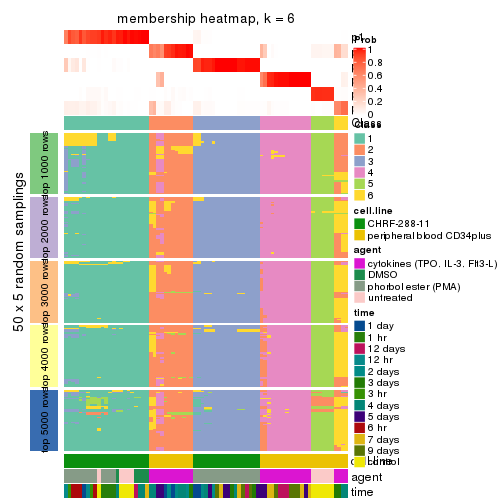</p>

</div>
</div>

As soon as we have had the classes for columns, we can look for signatures
which are significantly different between classes which can be candidate marks
for certain classes. Following are the heatmaps for signatures.


Signature heatmaps where rows are scaled:


<script>
$( function() {
	$( '#tabs-SD-NMF-get-signatures' ).tabs();
} );
</script>
<div id='tabs-SD-NMF-get-signatures'>
<ul>
<li><a href='#tab-SD-NMF-get-signatures-1'>k = 2</a></li>
<li><a href='#tab-SD-NMF-get-signatures-2'>k = 3</a></li>
<li><a href='#tab-SD-NMF-get-signatures-3'>k = 4</a></li>
<li><a href='#tab-SD-NMF-get-signatures-4'>k = 5</a></li>
<li><a href='#tab-SD-NMF-get-signatures-5'>k = 6</a></li>
</ul>
<div id='tab-SD-NMF-get-signatures-1'>
<pre><code class="r">get_signatures(res, k = 2)
</code></pre>

<p></p>

</div>
<div id='tab-SD-NMF-get-signatures-2'>
<pre><code class="r">get_signatures(res, k = 3)
</code></pre>

<p></p>

</div>
<div id='tab-SD-NMF-get-signatures-3'>
<pre><code class="r">get_signatures(res, k = 4)
</code></pre>

<p></p>

</div>
<div id='tab-SD-NMF-get-signatures-4'>
<pre><code class="r">get_signatures(res, k = 5)
</code></pre>

<p></p>

</div>
<div id='tab-SD-NMF-get-signatures-5'>
<pre><code class="r">get_signatures(res, k = 6)
</code></pre>

<p></p>

</div>
</div>


Signature heatmaps where rows are not scaled:


<script>
$( function() {
	$( '#tabs-SD-NMF-get-signatures-no-scale' ).tabs();
} );
</script>
<div id='tabs-SD-NMF-get-signatures-no-scale'>
<ul>
<li><a href='#tab-SD-NMF-get-signatures-no-scale-1'>k = 2</a></li>
<li><a href='#tab-SD-NMF-get-signatures-no-scale-2'>k = 3</a></li>
<li><a href='#tab-SD-NMF-get-signatures-no-scale-3'>k = 4</a></li>
<li><a href='#tab-SD-NMF-get-signatures-no-scale-4'>k = 5</a></li>
<li><a href='#tab-SD-NMF-get-signatures-no-scale-5'>k = 6</a></li>
</ul>
<div id='tab-SD-NMF-get-signatures-no-scale-1'>
<pre><code class="r">get_signatures(res, k = 2, scale_rows = FALSE)
</code></pre>

<p></p>

</div>
<div id='tab-SD-NMF-get-signatures-no-scale-2'>
<pre><code class="r">get_signatures(res, k = 3, scale_rows = FALSE)
</code></pre>

<p></p>

</div>
<div id='tab-SD-NMF-get-signatures-no-scale-3'>
<pre><code class="r">get_signatures(res, k = 4, scale_rows = FALSE)
</code></pre>

<p>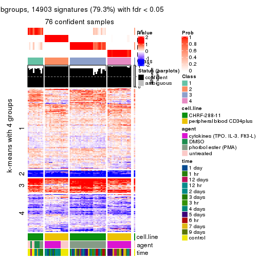</p>

</div>
<div id='tab-SD-NMF-get-signatures-no-scale-4'>
<pre><code class="r">get_signatures(res, k = 5, scale_rows = FALSE)
</code></pre>

<p></p>

</div>
<div id='tab-SD-NMF-get-signatures-no-scale-5'>
<pre><code class="r">get_signatures(res, k = 6, scale_rows = FALSE)
</code></pre>

<p></p>

</div>
</div>


Compare the overlap of signatures from different k:

```r
compare_signatures(res)
```


`get_signature()` returns a data frame invisibly. TO get the list of signatures, the function
call should be assigned to a variable explicitly. In following code, if `plot` argument is set
to `FALSE`, no heatmap is plotted while only the differential analysis is performed.

```r
# code only for demonstration
tb = get_signature(res, k = ..., plot = FALSE)
```

An example of the output of `tb` is:

```
#>   which_row         fdr    mean_1    mean_2 scaled_mean_1 scaled_mean_2 km
#> 1        38 0.042760348  8.373488  9.131774    -0.5533452     0.5164555  1
#> 2        40 0.018707592  7.106213  8.469186    -0.6173731     0.5762149  1
#> 3        55 0.019134737 10.221463 11.207825    -0.6159697     0.5749050  1
#> 4        59 0.006059896  5.921854  7.869574    -0.6899429     0.6439467  1
#> 5        60 0.018055526  8.928898 10.211722    -0.6204761     0.5791110  1
#> 6        98 0.009384629 15.714769 14.887706     0.6635654    -0.6193277  2
...
```

The columns in `tb` are:

1. `which_row`: row indices corresponding to the input matrix.
2. `fdr`: FDR for the differential test. 
3. `mean_x`: The mean value in group x.
4. `scaled_mean_x`: The mean value in group x after rows are scaled.
5. `km`: Row groups if k-means clustering is applied to rows.


UMAP plot which shows how samples are separated.


<script>
$( function() {
	$( '#tabs-SD-NMF-dimension-reduction' ).tabs();
} );
</script>
<div id='tabs-SD-NMF-dimension-reduction'>
<ul>
<li><a href='#tab-SD-NMF-dimension-reduction-1'>k = 2</a></li>
<li><a href='#tab-SD-NMF-dimension-reduction-2'>k = 3</a></li>
<li><a href='#tab-SD-NMF-dimension-reduction-3'>k = 4</a></li>
<li><a href='#tab-SD-NMF-dimension-reduction-4'>k = 5</a></li>
<li><a href='#tab-SD-NMF-dimension-reduction-5'>k = 6</a></li>
</ul>
<div id='tab-SD-NMF-dimension-reduction-1'>
<pre><code class="r">dimension_reduction(res, k = 2, method = &quot;UMAP&quot;)
</code></pre>

<p></p>

</div>
<div id='tab-SD-NMF-dimension-reduction-2'>
<pre><code class="r">dimension_reduction(res, k = 3, method = &quot;UMAP&quot;)
</code></pre>

<p></p>

</div>
<div id='tab-SD-NMF-dimension-reduction-3'>
<pre><code class="r">dimension_reduction(res, k = 4, method = &quot;UMAP&quot;)
</code></pre>

<p></p>

</div>
<div id='tab-SD-NMF-dimension-reduction-4'>
<pre><code class="r">dimension_reduction(res, k = 5, method = &quot;UMAP&quot;)
</code></pre>

<p></p>

</div>
<div id='tab-SD-NMF-dimension-reduction-5'>
<pre><code class="r">dimension_reduction(res, k = 6, method = &quot;UMAP&quot;)
</code></pre>

<p></p>

</div>
</div>


Following heatmap shows how subgroups are split when increasing `k`:

```r
collect_classes(res)
```


Test correlation between subgroups and known annotations. If the known
annotation is numeric, one-way ANOVA test is applied, and if the known
annotation is discrete, chi-squared contingency table test is applied.

```r
test_to_known_factors(res)
```

```
#>         n cell.line(p) agent(p)  time(p) k
#> SD:NMF 77     1.27e-17 3.00e-14 3.61e-01 2
#> SD:NMF 73     1.41e-16 3.74e-13 2.19e-03 3
#> SD:NMF 76     2.21e-16 4.65e-21 4.88e-05 4
#> SD:NMF 71     1.40e-14 5.41e-20 3.79e-08 5
#> SD:NMF 72     3.93e-14 1.26e-18 4.90e-08 6
```


If matrix rows can be associated to genes, consider to use `GO_Enrichment(res,
...)` to perform function enrichment for the signature genes.


 

---------------------------------------------------


### CV:hclust


The object with results only for a single top-value method and a single partition method 
can be extracted as:

```r
res = res_list["CV", "hclust"]
# you can also extract it by
# res = res_list["CV:hclust"]
```

A summary of `res` and all the functions that can be applied to it:

```r
res
```

```
#> A 'ConsensusPartition' object with k = 2, 3, 4, 5, 6.
#>   On a matrix with 18792 rows and 77 columns.
#>   Top rows (1000, 2000, 3000, 4000, 5000) are extracted by 'CV' method.
#>   Subgroups are detected by 'hclust' method.
#>   Performed in total 1250 partitions by row resampling.
#>   Best k for subgroups seems to be 2.
#> 
#> Following methods can be applied to this 'ConsensusPartition' object:
#>  [1] "cola_report"             "collect_classes"         "collect_plots"          
#>  [4] "collect_stats"           "colnames"                "compare_signatures"     
#>  [7] "consensus_heatmap"       "dimension_reduction"     "functional_enrichment"  
#> [10] "get_anno_col"            "get_anno"                "get_classes"            
#> [13] "get_consensus"           "get_matrix"              "get_membership"         
#> [16] "get_param"               "get_signatures"          "get_stats"              
#> [19] "is_best_k"               "is_stable_k"             "membership_heatmap"     
#> [22] "ncol"                    "nrow"                    "plot_ecdf"              
#> [25] "rownames"                "select_partition_number" "show"                   
#> [28] "suggest_best_k"          "test_to_known_factors"
```

`collect_plots()` function collects all the plots made from `res` for all `k` (number of partitions)
into one single page to provide an easy and fast comparison between different `k`.

```r
collect_plots(res)
```


The plots are:

- The first row: a plot of the ECDF (Empirical cumulative distribution
  function) curves of the consensus matrix for each `k` and the heatmap of
  predicted classes for each `k`.
- The second row: heatmaps of the consensus matrix for each `k`.
- The third row: heatmaps of the membership matrix for each `k`.
- The fouth row: heatmaps of the signatures for each `k`.

All the plots in panels can be made by individual functions and they are
plotted later in this section.

`select_partition_number()` produces several plots showing different
statistics for choosing "optimized" `k`. There are following statistics:

- ECDF curves of the consensus matrix for each `k`;
- 1-PAC. [The PAC
  score](https://en.wikipedia.org/wiki/Consensus_clustering#Over-interpretation_potential_of_consensus_clustering)
  measures the proportion of the ambiguous subgrouping.
- Mean silhouette score.
- Concordance. The mean probability of fiting the consensus class ids in all
  partitions.
- Area increased. Denote $A_k$ as the area under the ECDF curve for current
  `k`, the area increased is defined as $A_k - A_{k-1}$.
- Rand index. The percent of pairs of samples that are both in a same cluster
  or both are not in a same cluster in the partition of k and k-1.
- Jaccard index. The ratio of pairs of samples are both in a same cluster in
  the partition of k and k-1 and the pairs of samples are both in a same
  cluster in the partition k or k-1.

The detailed explanations of these statistics can be found in [the cola
vignette](http://bioconductor.org/packages/devel/bioc/vignettes/cola/inst/doc/cola.html#toc_13).

Generally speaking, lower PAC score, higher mean silhouette score or higher
concordance corresponds to better partition. Rand index and Jaccard index
measure how similar the current partition is compared to partition with `k-1`.
If they are too similar, we won't accept `k` is better than `k-1`.

```r
select_partition_number(res)
```


The numeric values for all these statistics can be obtained by `get_stats()`.

```r
get_stats(res)
```

```
#>   k 1-PAC mean_silhouette concordance area_increased  Rand Jaccard
#> 2 2 0.220           0.771       0.842         0.4298 0.496   0.496
#> 3 3 0.424           0.588       0.777         0.3743 0.948   0.898
#> 4 4 0.483           0.632       0.801         0.0912 0.879   0.743
#> 5 5 0.588           0.614       0.803         0.0929 0.927   0.798
#> 6 6 0.644           0.643       0.770         0.0549 0.930   0.778
```

`suggest_best_k()` suggests the best $k$ based on these statistics. The rules are as follows:

- All $k$ with Jaccard index larger than 0.95 are removed because the increase of
  the partition number does not provides enough extra information. If all $k$ are removed,
  the best $k$ is assigned by `NA`.
- For $k$ with 1-PAC larger than 0.9, the maximal $k$ is taken as the "best k". Other $k$ is called "optional k".
- If it does not fit the second rule. The $k$ with the highest vote of highest
  1-PAC, mean silhouette and concordance is taken as the "best k".

```r
suggest_best_k(res)
```

```
#> [1] 2
```


Following shows the table of the partitions (You need to click the **show/hide
code output** link to see it). The membership matrix (columns with name `p*`)
is inferred by
[`clue::cl_consensus()`](https://www.rdocumentation.org/link/cl_consensus?package=clue)
function with the `SE` method. Basically the value in the membership matrix
represents the probability to belong to a certain group. The finall class
label for an item is determined with the group with highest probability it
belongs to.

In `get_classes()` function, the entropy is calculated from the membership
matrix and the silhouette score is calculated from the consensus matrix.


<script>
$( function() {
	$( '#tabs-CV-hclust-get-classes' ).tabs();
} );
</script>
<div id='tabs-CV-hclust-get-classes'>
<ul>
<li><a href='#tab-CV-hclust-get-classes-1'>k = 2</a></li>
<li><a href='#tab-CV-hclust-get-classes-2'>k = 3</a></li>
<li><a href='#tab-CV-hclust-get-classes-3'>k = 4</a></li>
<li><a href='#tab-CV-hclust-get-classes-4'>k = 5</a></li>
<li><a href='#tab-CV-hclust-get-classes-5'>k = 6</a></li>
</ul>

<div id='tab-CV-hclust-get-classes-1'>
<p><a id='tab-CV-hclust-get-classes-1-a' style='color:#0366d6' href='#'>show/hide code output</a></p>
<pre><code class="r">cbind(get_classes(res, k = 2), get_membership(res, k = 2))
</code></pre>

<pre><code>#&gt;          class entropy silhouette    p1    p2
#&gt; GSM87962     1  0.0000      0.875 1.000 0.000
#&gt; GSM87963     1  0.0000      0.875 1.000 0.000
#&gt; GSM87983     1  0.0000      0.875 1.000 0.000
#&gt; GSM87984     1  0.0672      0.875 0.992 0.008
#&gt; GSM87961     1  0.5294      0.778 0.880 0.120
#&gt; GSM87970     1  0.9209      0.379 0.664 0.336
#&gt; GSM87971     1  0.9209      0.379 0.664 0.336
#&gt; GSM87990     1  0.4562      0.806 0.904 0.096
#&gt; GSM87991     1  0.0000      0.875 1.000 0.000
#&gt; GSM87974     1  0.9209      0.379 0.664 0.336
#&gt; GSM87994     1  0.0376      0.875 0.996 0.004
#&gt; GSM87978     1  0.9209      0.379 0.664 0.336
#&gt; GSM87979     1  0.9170      0.382 0.668 0.332
#&gt; GSM87998     1  0.0000      0.875 1.000 0.000
#&gt; GSM87999     1  0.0000      0.875 1.000 0.000
#&gt; GSM87968     1  0.9209      0.379 0.664 0.336
#&gt; GSM87987     1  0.0672      0.874 0.992 0.008
#&gt; GSM87969     1  0.0376      0.875 0.996 0.004
#&gt; GSM87988     1  0.0000      0.875 1.000 0.000
#&gt; GSM87989     1  0.0000      0.875 1.000 0.000
#&gt; GSM87972     1  0.2236      0.864 0.964 0.036
#&gt; GSM87992     1  0.0000      0.875 1.000 0.000
#&gt; GSM87973     1  0.2236      0.864 0.964 0.036
#&gt; GSM87993     1  0.0000      0.875 1.000 0.000
#&gt; GSM87975     1  0.9087      0.517 0.676 0.324
#&gt; GSM87995     1  0.0000      0.875 1.000 0.000
#&gt; GSM87976     1  0.9087      0.517 0.676 0.324
#&gt; GSM87977     1  0.0938      0.873 0.988 0.012
#&gt; GSM87996     1  0.0000      0.875 1.000 0.000
#&gt; GSM87997     1  0.0000      0.875 1.000 0.000
#&gt; GSM87980     1  0.1633      0.868 0.976 0.024
#&gt; GSM88000     1  0.0000      0.875 1.000 0.000
#&gt; GSM87981     1  0.1633      0.868 0.976 0.024
#&gt; GSM87982     1  0.1633      0.868 0.976 0.024
#&gt; GSM88001     1  0.0000      0.875 1.000 0.000
#&gt; GSM87967     1  0.0672      0.874 0.992 0.008
#&gt; GSM87964     1  0.9686      0.330 0.604 0.396
#&gt; GSM87965     1  0.5294      0.778 0.880 0.120
#&gt; GSM87966     1  0.0000      0.875 1.000 0.000
#&gt; GSM87985     1  0.4815      0.800 0.896 0.104
#&gt; GSM87986     1  0.0672      0.874 0.992 0.008
#&gt; GSM88004     2  0.5519      0.829 0.128 0.872
#&gt; GSM88015     2  0.5842      0.831 0.140 0.860
#&gt; GSM88005     2  0.9248      0.741 0.340 0.660
#&gt; GSM88006     2  0.5519      0.829 0.128 0.872
#&gt; GSM88016     2  0.5842      0.831 0.140 0.860
#&gt; GSM88007     2  0.5519      0.829 0.128 0.872
#&gt; GSM88017     2  0.6531      0.832 0.168 0.832
#&gt; GSM88029     2  0.5737      0.830 0.136 0.864
#&gt; GSM88008     2  0.9248      0.741 0.340 0.660
#&gt; GSM88009     2  0.5519      0.829 0.128 0.872
#&gt; GSM88018     2  0.5842      0.831 0.140 0.860
#&gt; GSM88024     2  0.6531      0.832 0.168 0.832
#&gt; GSM88030     2  0.6048      0.762 0.148 0.852
#&gt; GSM88036     2  0.6048      0.762 0.148 0.852
#&gt; GSM88010     2  0.7674      0.815 0.224 0.776
#&gt; GSM88011     2  0.9248      0.741 0.340 0.660
#&gt; GSM88019     2  0.9580      0.707 0.380 0.620
#&gt; GSM88027     2  0.9580      0.707 0.380 0.620
#&gt; GSM88031     2  0.9608      0.693 0.384 0.616
#&gt; GSM88012     2  0.7674      0.815 0.224 0.776
#&gt; GSM88020     2  0.7950      0.805 0.240 0.760
#&gt; GSM88032     2  0.9608      0.693 0.384 0.616
#&gt; GSM88037     2  0.9608      0.693 0.384 0.616
#&gt; GSM88013     2  0.9323      0.737 0.348 0.652
#&gt; GSM88021     2  0.6343      0.759 0.160 0.840
#&gt; GSM88025     2  0.8909      0.773 0.308 0.692
#&gt; GSM88033     2  0.9608      0.693 0.384 0.616
#&gt; GSM88014     2  0.9323      0.737 0.348 0.652
#&gt; GSM88022     2  0.9358      0.732 0.352 0.648
#&gt; GSM88034     2  0.6048      0.762 0.148 0.852
#&gt; GSM88002     2  0.5519      0.829 0.128 0.872
#&gt; GSM88003     2  0.5519      0.829 0.128 0.872
#&gt; GSM88023     2  0.5519      0.829 0.128 0.872
#&gt; GSM88026     2  0.5519      0.829 0.128 0.872
#&gt; GSM88028     2  0.5519      0.829 0.128 0.872
#&gt; GSM88035     2  0.5519      0.829 0.128 0.872
</code></pre>

<script>
$('#tab-CV-hclust-get-classes-1-a').parent().next().next().hide();
$('#tab-CV-hclust-get-classes-1-a').click(function(){
  $('#tab-CV-hclust-get-classes-1-a').parent().next().next().toggle();
  return(false);
});
</script>
</div>

<div id='tab-CV-hclust-get-classes-2'>
<p><a id='tab-CV-hclust-get-classes-2-a' style='color:#0366d6' href='#'>show/hide code output</a></p>
<pre><code class="r">cbind(get_classes(res, k = 3), get_membership(res, k = 3))
</code></pre>

<pre><code>#&gt;          class entropy silhouette    p1    p2    p3
#&gt; GSM87962     1  0.0000     0.8313 1.000 0.000 0.000
#&gt; GSM87963     1  0.0000     0.8313 1.000 0.000 0.000
#&gt; GSM87983     1  0.0000     0.8313 1.000 0.000 0.000
#&gt; GSM87984     1  0.0475     0.8317 0.992 0.004 0.004
#&gt; GSM87961     1  0.4137     0.7467 0.872 0.096 0.032
#&gt; GSM87970     1  0.9452     0.0858 0.496 0.284 0.220
#&gt; GSM87971     1  0.9304     0.1511 0.516 0.280 0.204
#&gt; GSM87990     1  0.6087     0.6922 0.780 0.076 0.144
#&gt; GSM87991     1  0.1529     0.8266 0.960 0.000 0.040
#&gt; GSM87974     1  0.9452     0.0858 0.496 0.284 0.220
#&gt; GSM87994     1  0.1031     0.8312 0.976 0.000 0.024
#&gt; GSM87978     1  0.9304     0.1511 0.516 0.280 0.204
#&gt; GSM87979     1  0.9211     0.1761 0.528 0.276 0.196
#&gt; GSM87998     1  0.0892     0.8302 0.980 0.000 0.020
#&gt; GSM87999     1  0.1529     0.8266 0.960 0.000 0.040
#&gt; GSM87968     1  0.9304     0.1511 0.516 0.280 0.204
#&gt; GSM87987     1  0.3038     0.8051 0.896 0.000 0.104
#&gt; GSM87969     1  0.2448     0.8169 0.924 0.000 0.076
#&gt; GSM87988     1  0.1529     0.8266 0.960 0.000 0.040
#&gt; GSM87989     1  0.1529     0.8266 0.960 0.000 0.040
#&gt; GSM87972     1  0.3752     0.7970 0.884 0.020 0.096
#&gt; GSM87992     1  0.1529     0.8266 0.960 0.000 0.040
#&gt; GSM87973     1  0.3752     0.7970 0.884 0.020 0.096
#&gt; GSM87993     1  0.1529     0.8266 0.960 0.000 0.040
#&gt; GSM87975     3  0.9431     1.0000 0.176 0.400 0.424
#&gt; GSM87995     1  0.1529     0.8266 0.960 0.000 0.040
#&gt; GSM87976     3  0.9431     1.0000 0.176 0.400 0.424
#&gt; GSM87977     1  0.2682     0.8142 0.920 0.004 0.076
#&gt; GSM87996     1  0.1529     0.8266 0.960 0.000 0.040
#&gt; GSM87997     1  0.1529     0.8266 0.960 0.000 0.040
#&gt; GSM87980     1  0.3359     0.8055 0.900 0.016 0.084
#&gt; GSM88000     1  0.1529     0.8266 0.960 0.000 0.040
#&gt; GSM87981     1  0.3359     0.8055 0.900 0.016 0.084
#&gt; GSM87982     1  0.3359     0.8055 0.900 0.016 0.084
#&gt; GSM88001     1  0.1529     0.8266 0.960 0.000 0.040
#&gt; GSM87967     1  0.2356     0.8167 0.928 0.000 0.072
#&gt; GSM87964     2  0.7997    -0.7592 0.060 0.472 0.468
#&gt; GSM87965     1  0.4137     0.7467 0.872 0.096 0.032
#&gt; GSM87966     1  0.0000     0.8313 1.000 0.000 0.000
#&gt; GSM87985     1  0.4642     0.7463 0.856 0.084 0.060
#&gt; GSM87986     1  0.0892     0.8298 0.980 0.000 0.020
#&gt; GSM88004     2  0.0000     0.5290 0.000 1.000 0.000
#&gt; GSM88015     2  0.0892     0.5235 0.000 0.980 0.020
#&gt; GSM88005     2  0.8399     0.3652 0.188 0.624 0.188
#&gt; GSM88006     2  0.0000     0.5290 0.000 1.000 0.000
#&gt; GSM88016     2  0.0892     0.5235 0.000 0.980 0.020
#&gt; GSM88007     2  0.0000     0.5290 0.000 1.000 0.000
#&gt; GSM88017     2  0.3267     0.5359 0.000 0.884 0.116
#&gt; GSM88029     2  0.0424     0.5261 0.000 0.992 0.008
#&gt; GSM88008     2  0.8399     0.3652 0.188 0.624 0.188
#&gt; GSM88009     2  0.0000     0.5290 0.000 1.000 0.000
#&gt; GSM88018     2  0.0892     0.5235 0.000 0.980 0.020
#&gt; GSM88024     2  0.3267     0.5359 0.000 0.884 0.116
#&gt; GSM88030     2  0.6295     0.4603 0.000 0.528 0.472
#&gt; GSM88036     2  0.6295     0.4603 0.000 0.528 0.472
#&gt; GSM88010     2  0.5785     0.5365 0.000 0.668 0.332
#&gt; GSM88011     2  0.9137     0.4109 0.188 0.536 0.276
#&gt; GSM88019     2  0.9515     0.3939 0.216 0.480 0.304
#&gt; GSM88027     2  0.9515     0.3939 0.216 0.480 0.304
#&gt; GSM88031     2  0.9651     0.3923 0.216 0.436 0.348
#&gt; GSM88012     2  0.5785     0.5365 0.000 0.668 0.332
#&gt; GSM88020     2  0.6062     0.5207 0.000 0.616 0.384
#&gt; GSM88032     2  0.9651     0.3923 0.216 0.436 0.348
#&gt; GSM88037     2  0.9651     0.3923 0.216 0.436 0.348
#&gt; GSM88013     2  0.9009     0.4579 0.132 0.464 0.404
#&gt; GSM88021     2  0.6520     0.4589 0.004 0.508 0.488
#&gt; GSM88025     2  0.8592     0.5072 0.116 0.552 0.332
#&gt; GSM88033     2  0.9651     0.3923 0.216 0.436 0.348
#&gt; GSM88014     2  0.9009     0.4579 0.132 0.464 0.404
#&gt; GSM88022     2  0.9131     0.4508 0.144 0.460 0.396
#&gt; GSM88034     2  0.6299     0.4588 0.000 0.524 0.476
#&gt; GSM88002     2  0.0000     0.5290 0.000 1.000 0.000
#&gt; GSM88003     2  0.0000     0.5290 0.000 1.000 0.000
#&gt; GSM88023     2  0.0000     0.5290 0.000 1.000 0.000
#&gt; GSM88026     2  0.0000     0.5290 0.000 1.000 0.000
#&gt; GSM88028     2  0.0000     0.5290 0.000 1.000 0.000
#&gt; GSM88035     2  0.0000     0.5290 0.000 1.000 0.000
</code></pre>

<script>
$('#tab-CV-hclust-get-classes-2-a').parent().next().next().hide();
$('#tab-CV-hclust-get-classes-2-a').click(function(){
  $('#tab-CV-hclust-get-classes-2-a').parent().next().next().toggle();
  return(false);
});
</script>
</div>

<div id='tab-CV-hclust-get-classes-3'>
<p><a id='tab-CV-hclust-get-classes-3-a' style='color:#0366d6' href='#'>show/hide code output</a></p>
<pre><code class="r">cbind(get_classes(res, k = 4), get_membership(res, k = 4))
</code></pre>

<pre><code>#&gt;          class entropy silhouette    p1    p2    p3    p4
#&gt; GSM87962     1  0.0000      0.831 1.000 0.000 0.000 0.000
#&gt; GSM87963     1  0.0000      0.831 1.000 0.000 0.000 0.000
#&gt; GSM87983     1  0.0000      0.831 1.000 0.000 0.000 0.000
#&gt; GSM87984     1  0.0376      0.832 0.992 0.004 0.000 0.004
#&gt; GSM87961     1  0.3400      0.760 0.872 0.064 0.064 0.000
#&gt; GSM87970     1  0.7842      0.194 0.484 0.144 0.348 0.024
#&gt; GSM87971     1  0.7787      0.249 0.504 0.144 0.328 0.024
#&gt; GSM87990     1  0.5115      0.694 0.768 0.044 0.172 0.016
#&gt; GSM87991     1  0.1302      0.826 0.956 0.000 0.044 0.000
#&gt; GSM87974     1  0.7842      0.194 0.484 0.144 0.348 0.024
#&gt; GSM87994     1  0.1004      0.831 0.972 0.000 0.024 0.004
#&gt; GSM87978     1  0.7787      0.249 0.504 0.144 0.328 0.024
#&gt; GSM87979     1  0.7747      0.270 0.516 0.144 0.316 0.024
#&gt; GSM87998     1  0.0817      0.830 0.976 0.000 0.024 0.000
#&gt; GSM87999     1  0.1302      0.826 0.956 0.000 0.044 0.000
#&gt; GSM87968     1  0.7787      0.249 0.504 0.144 0.328 0.024
#&gt; GSM87987     1  0.2924      0.802 0.884 0.000 0.100 0.016
#&gt; GSM87969     1  0.2125      0.817 0.920 0.000 0.076 0.004
#&gt; GSM87988     1  0.1302      0.826 0.956 0.000 0.044 0.000
#&gt; GSM87989     1  0.1302      0.826 0.956 0.000 0.044 0.000
#&gt; GSM87972     1  0.3048      0.796 0.876 0.000 0.108 0.016
#&gt; GSM87992     1  0.1302      0.826 0.956 0.000 0.044 0.000
#&gt; GSM87973     1  0.3048      0.796 0.876 0.000 0.108 0.016
#&gt; GSM87993     1  0.1302      0.826 0.956 0.000 0.044 0.000
#&gt; GSM87975     3  0.5122      0.899 0.164 0.080 0.756 0.000
#&gt; GSM87995     1  0.1302      0.826 0.956 0.000 0.044 0.000
#&gt; GSM87976     3  0.5122      0.899 0.164 0.080 0.756 0.000
#&gt; GSM87977     1  0.2450      0.813 0.912 0.000 0.072 0.016
#&gt; GSM87996     1  0.1302      0.826 0.956 0.000 0.044 0.000
#&gt; GSM87997     1  0.1302      0.826 0.956 0.000 0.044 0.000
#&gt; GSM87980     1  0.2796      0.804 0.892 0.000 0.092 0.016
#&gt; GSM88000     1  0.1302      0.826 0.956 0.000 0.044 0.000
#&gt; GSM87981     1  0.2796      0.804 0.892 0.000 0.092 0.016
#&gt; GSM87982     1  0.2796      0.804 0.892 0.000 0.092 0.016
#&gt; GSM88001     1  0.1302      0.826 0.956 0.000 0.044 0.000
#&gt; GSM87967     1  0.2300      0.816 0.920 0.000 0.064 0.016
#&gt; GSM87964     3  0.3286      0.797 0.044 0.080 0.876 0.000
#&gt; GSM87965     1  0.3400      0.760 0.872 0.064 0.064 0.000
#&gt; GSM87966     1  0.0000      0.831 1.000 0.000 0.000 0.000
#&gt; GSM87985     1  0.4028      0.758 0.852 0.052 0.080 0.016
#&gt; GSM87986     1  0.0927      0.830 0.976 0.000 0.008 0.016
#&gt; GSM88004     2  0.0188      0.764 0.000 0.996 0.000 0.004
#&gt; GSM88015     2  0.0921      0.753 0.000 0.972 0.000 0.028
#&gt; GSM88005     2  0.7516      0.253 0.188 0.612 0.156 0.044
#&gt; GSM88006     2  0.0188      0.764 0.000 0.996 0.000 0.004
#&gt; GSM88016     2  0.0921      0.753 0.000 0.972 0.000 0.028
#&gt; GSM88007     2  0.0188      0.764 0.000 0.996 0.000 0.004
#&gt; GSM88017     2  0.4072      0.469 0.000 0.748 0.000 0.252
#&gt; GSM88029     2  0.0592      0.760 0.000 0.984 0.000 0.016
#&gt; GSM88008     2  0.7516      0.253 0.188 0.612 0.156 0.044
#&gt; GSM88009     2  0.0188      0.764 0.000 0.996 0.000 0.004
#&gt; GSM88018     2  0.0921      0.753 0.000 0.972 0.000 0.028
#&gt; GSM88024     2  0.4103      0.461 0.000 0.744 0.000 0.256
#&gt; GSM88030     4  0.1022      0.414 0.000 0.032 0.000 0.968
#&gt; GSM88036     4  0.1022      0.414 0.000 0.032 0.000 0.968
#&gt; GSM88010     4  0.4564      0.497 0.000 0.328 0.000 0.672
#&gt; GSM88011     2  0.9517     -0.295 0.188 0.400 0.156 0.256
#&gt; GSM88019     2  0.9730     -0.385 0.212 0.344 0.164 0.280
#&gt; GSM88027     2  0.9730     -0.385 0.212 0.344 0.164 0.280
#&gt; GSM88031     4  0.9646      0.516 0.212 0.244 0.164 0.380
#&gt; GSM88012     4  0.4564      0.497 0.000 0.328 0.000 0.672
#&gt; GSM88020     4  0.3726      0.548 0.000 0.212 0.000 0.788
#&gt; GSM88032     4  0.9646      0.516 0.212 0.244 0.164 0.380
#&gt; GSM88037     4  0.9646      0.516 0.212 0.244 0.164 0.380
#&gt; GSM88013     4  0.9090      0.576 0.128 0.244 0.164 0.464
#&gt; GSM88021     4  0.3196      0.547 0.000 0.136 0.008 0.856
#&gt; GSM88025     4  0.6606      0.588 0.112 0.244 0.008 0.636
#&gt; GSM88033     4  0.9646      0.516 0.212 0.244 0.164 0.380
#&gt; GSM88014     4  0.9090      0.576 0.128 0.244 0.164 0.464
#&gt; GSM88022     4  0.9214      0.568 0.140 0.248 0.164 0.448
#&gt; GSM88034     4  0.0921      0.415 0.000 0.028 0.000 0.972
#&gt; GSM88002     2  0.0000      0.765 0.000 1.000 0.000 0.000
#&gt; GSM88003     2  0.0000      0.765 0.000 1.000 0.000 0.000
#&gt; GSM88023     2  0.0000      0.765 0.000 1.000 0.000 0.000
#&gt; GSM88026     2  0.0000      0.765 0.000 1.000 0.000 0.000
#&gt; GSM88028     2  0.0000      0.765 0.000 1.000 0.000 0.000
#&gt; GSM88035     2  0.0000      0.765 0.000 1.000 0.000 0.000
</code></pre>

<script>
$('#tab-CV-hclust-get-classes-3-a').parent().next().next().hide();
$('#tab-CV-hclust-get-classes-3-a').click(function(){
  $('#tab-CV-hclust-get-classes-3-a').parent().next().next().toggle();
  return(false);
});
</script>
</div>

<div id='tab-CV-hclust-get-classes-4'>
<p><a id='tab-CV-hclust-get-classes-4-a' style='color:#0366d6' href='#'>show/hide code output</a></p>
<pre><code class="r">cbind(get_classes(res, k = 5), get_membership(res, k = 5))
</code></pre>

<pre><code>#&gt;          class entropy silhouette    p1    p2    p3    p4    p5
#&gt; GSM87962     1  0.0703     0.7862 0.976 0.000 0.000 0.000 0.024
#&gt; GSM87963     1  0.0703     0.7862 0.976 0.000 0.000 0.000 0.024
#&gt; GSM87983     1  0.0703     0.7862 0.976 0.000 0.000 0.000 0.024
#&gt; GSM87984     1  0.1153     0.7862 0.964 0.000 0.004 0.008 0.024
#&gt; GSM87961     1  0.3465     0.6946 0.844 0.004 0.116 0.012 0.024
#&gt; GSM87970     3  0.6571     0.1575 0.412 0.008 0.424 0.156 0.000
#&gt; GSM87971     1  0.6569    -0.2716 0.432 0.008 0.404 0.156 0.000
#&gt; GSM87990     1  0.4901     0.5459 0.700 0.000 0.216 0.084 0.000
#&gt; GSM87991     1  0.2075     0.7794 0.924 0.000 0.032 0.004 0.040
#&gt; GSM87974     3  0.6571     0.1575 0.412 0.008 0.424 0.156 0.000
#&gt; GSM87994     1  0.1299     0.7888 0.960 0.000 0.012 0.008 0.020
#&gt; GSM87978     1  0.6569    -0.2716 0.432 0.008 0.404 0.156 0.000
#&gt; GSM87979     1  0.6562    -0.2399 0.444 0.008 0.392 0.156 0.000
#&gt; GSM87998     1  0.1173     0.7875 0.964 0.000 0.012 0.004 0.020
#&gt; GSM87999     1  0.1915     0.7773 0.928 0.000 0.032 0.000 0.040
#&gt; GSM87968     1  0.6569    -0.2716 0.432 0.008 0.404 0.156 0.000
#&gt; GSM87987     1  0.3754     0.7134 0.816 0.000 0.100 0.084 0.000
#&gt; GSM87969     1  0.2077     0.7649 0.908 0.000 0.084 0.008 0.000
#&gt; GSM87988     1  0.1579     0.7801 0.944 0.000 0.032 0.000 0.024
#&gt; GSM87989     1  0.1915     0.7773 0.928 0.000 0.032 0.000 0.040
#&gt; GSM87972     1  0.3857     0.6972 0.808 0.000 0.108 0.084 0.000
#&gt; GSM87992     1  0.1579     0.7801 0.944 0.000 0.032 0.000 0.024
#&gt; GSM87973     1  0.3857     0.6972 0.808 0.000 0.108 0.084 0.000
#&gt; GSM87993     1  0.1739     0.7813 0.940 0.000 0.032 0.004 0.024
#&gt; GSM87975     3  0.2690     0.5314 0.156 0.000 0.844 0.000 0.000
#&gt; GSM87995     1  0.1579     0.7801 0.944 0.000 0.032 0.000 0.024
#&gt; GSM87976     3  0.2690     0.5314 0.156 0.000 0.844 0.000 0.000
#&gt; GSM87977     1  0.3359     0.7263 0.844 0.000 0.072 0.084 0.000
#&gt; GSM87996     1  0.1579     0.7801 0.944 0.000 0.032 0.000 0.024
#&gt; GSM87997     1  0.1579     0.7801 0.944 0.000 0.032 0.000 0.024
#&gt; GSM87980     1  0.3648     0.7114 0.824 0.000 0.092 0.084 0.000
#&gt; GSM88000     1  0.1739     0.7813 0.940 0.000 0.032 0.004 0.024
#&gt; GSM87981     1  0.3648     0.7114 0.824 0.000 0.092 0.084 0.000
#&gt; GSM87982     1  0.3648     0.7114 0.824 0.000 0.092 0.084 0.000
#&gt; GSM88001     1  0.1579     0.7801 0.944 0.000 0.032 0.000 0.024
#&gt; GSM87967     1  0.3234     0.7313 0.852 0.000 0.064 0.084 0.000
#&gt; GSM87964     3  0.1168     0.4118 0.032 0.000 0.960 0.000 0.008
#&gt; GSM87965     1  0.3465     0.6946 0.844 0.004 0.116 0.012 0.024
#&gt; GSM87966     1  0.0703     0.7862 0.976 0.000 0.000 0.000 0.024
#&gt; GSM87985     1  0.4835     0.6518 0.768 0.004 0.116 0.088 0.024
#&gt; GSM87986     1  0.2482     0.7619 0.892 0.000 0.000 0.084 0.024
#&gt; GSM88004     2  0.0510     0.8359 0.000 0.984 0.000 0.016 0.000
#&gt; GSM88015     2  0.1478     0.8223 0.000 0.936 0.000 0.064 0.000
#&gt; GSM88005     2  0.5787    -0.1529 0.052 0.476 0.000 0.456 0.016
#&gt; GSM88006     2  0.0510     0.8359 0.000 0.984 0.000 0.016 0.000
#&gt; GSM88016     2  0.1478     0.8223 0.000 0.936 0.000 0.064 0.000
#&gt; GSM88007     2  0.0510     0.8359 0.000 0.984 0.000 0.016 0.000
#&gt; GSM88017     2  0.5240     0.4909 0.000 0.660 0.000 0.096 0.244
#&gt; GSM88029     2  0.2130     0.8245 0.000 0.908 0.000 0.080 0.012
#&gt; GSM88008     2  0.5787    -0.1529 0.052 0.476 0.000 0.456 0.016
#&gt; GSM88009     2  0.0510     0.8359 0.000 0.984 0.000 0.016 0.000
#&gt; GSM88018     2  0.1638     0.8212 0.000 0.932 0.000 0.064 0.004
#&gt; GSM88024     2  0.5265     0.4829 0.000 0.656 0.000 0.096 0.248
#&gt; GSM88030     5  0.1671     0.7166 0.000 0.000 0.000 0.076 0.924
#&gt; GSM88036     5  0.1671     0.7166 0.000 0.000 0.000 0.076 0.924
#&gt; GSM88010     4  0.6717    -0.0844 0.000 0.248 0.000 0.388 0.364
#&gt; GSM88011     4  0.5226     0.6325 0.052 0.264 0.000 0.668 0.016
#&gt; GSM88019     4  0.4370     0.7175 0.056 0.200 0.000 0.744 0.000
#&gt; GSM88027     4  0.4337     0.7163 0.056 0.196 0.000 0.748 0.000
#&gt; GSM88031     4  0.4462     0.7645 0.056 0.124 0.000 0.788 0.032
#&gt; GSM88012     4  0.6717    -0.0844 0.000 0.248 0.000 0.388 0.364
#&gt; GSM88020     5  0.5611     0.5217 0.000 0.152 0.000 0.212 0.636
#&gt; GSM88032     4  0.4462     0.7645 0.056 0.124 0.000 0.788 0.032
#&gt; GSM88037     4  0.4462     0.7645 0.056 0.124 0.000 0.788 0.032
#&gt; GSM88013     4  0.5096     0.7068 0.028 0.152 0.000 0.736 0.084
#&gt; GSM88021     5  0.4961     0.5580 0.000 0.028 0.000 0.448 0.524
#&gt; GSM88025     5  0.6941    -0.0303 0.028 0.152 0.000 0.396 0.424
#&gt; GSM88033     4  0.4462     0.7645 0.056 0.124 0.000 0.788 0.032
#&gt; GSM88014     4  0.5096     0.7068 0.028 0.152 0.000 0.736 0.084
#&gt; GSM88022     4  0.5236     0.7200 0.036 0.156 0.000 0.728 0.080
#&gt; GSM88034     5  0.1732     0.7167 0.000 0.000 0.000 0.080 0.920
#&gt; GSM88002     2  0.1195     0.8376 0.000 0.960 0.000 0.028 0.012
#&gt; GSM88003     2  0.1195     0.8376 0.000 0.960 0.000 0.028 0.012
#&gt; GSM88023     2  0.1493     0.8360 0.000 0.948 0.000 0.028 0.024
#&gt; GSM88026     2  0.1493     0.8360 0.000 0.948 0.000 0.028 0.024
#&gt; GSM88028     2  0.1493     0.8360 0.000 0.948 0.000 0.028 0.024
#&gt; GSM88035     2  0.1493     0.8360 0.000 0.948 0.000 0.028 0.024
</code></pre>

<script>
$('#tab-CV-hclust-get-classes-4-a').parent().next().next().hide();
$('#tab-CV-hclust-get-classes-4-a').click(function(){
  $('#tab-CV-hclust-get-classes-4-a').parent().next().next().toggle();
  return(false);
});
</script>
</div>

<div id='tab-CV-hclust-get-classes-5'>
<p><a id='tab-CV-hclust-get-classes-5-a' style='color:#0366d6' href='#'>show/hide code output</a></p>
<pre><code class="r">cbind(get_classes(res, k = 6), get_membership(res, k = 6))
</code></pre>

<pre><code>#&gt;          class entropy silhouette    p1    p2    p3    p4    p5 p6
#&gt; GSM87962     3   0.107     0.8086 0.000 0.000 0.952 0.000 0.000 NA
#&gt; GSM87963     3   0.107     0.8086 0.000 0.000 0.952 0.000 0.000 NA
#&gt; GSM87983     3   0.107     0.8086 0.000 0.000 0.952 0.000 0.000 NA
#&gt; GSM87984     3   0.158     0.8074 0.012 0.000 0.936 0.004 0.000 NA
#&gt; GSM87961     3   0.341     0.6835 0.124 0.004 0.820 0.004 0.000 NA
#&gt; GSM87970     1   0.472     0.6033 0.592 0.008 0.360 0.040 0.000 NA
#&gt; GSM87971     1   0.539     0.5804 0.544 0.008 0.380 0.040 0.000 NA
#&gt; GSM87990     3   0.425     0.4412 0.288 0.000 0.676 0.028 0.000 NA
#&gt; GSM87991     3   0.232     0.7839 0.000 0.000 0.864 0.004 0.000 NA
#&gt; GSM87974     1   0.472     0.6033 0.592 0.008 0.360 0.040 0.000 NA
#&gt; GSM87994     3   0.154     0.8147 0.008 0.000 0.936 0.004 0.000 NA
#&gt; GSM87978     1   0.477     0.5818 0.572 0.008 0.380 0.040 0.000 NA
#&gt; GSM87979     1   0.480     0.5591 0.560 0.008 0.392 0.040 0.000 NA
#&gt; GSM87998     3   0.128     0.8126 0.000 0.000 0.944 0.004 0.000 NA
#&gt; GSM87999     3   0.218     0.7820 0.000 0.000 0.868 0.000 0.000 NA
#&gt; GSM87968     1   0.477     0.5818 0.572 0.008 0.380 0.040 0.000 NA
#&gt; GSM87987     3   0.349     0.6950 0.172 0.000 0.792 0.028 0.000 NA
#&gt; GSM87969     3   0.206     0.7823 0.088 0.000 0.900 0.004 0.000 NA
#&gt; GSM87988     3   0.144     0.8035 0.000 0.000 0.928 0.000 0.000 NA
#&gt; GSM87989     3   0.218     0.7820 0.000 0.000 0.868 0.000 0.000 NA
#&gt; GSM87972     3   0.356     0.6589 0.180 0.000 0.784 0.028 0.000 NA
#&gt; GSM87992     3   0.144     0.8035 0.000 0.000 0.928 0.000 0.000 NA
#&gt; GSM87973     3   0.356     0.6589 0.180 0.000 0.784 0.028 0.000 NA
#&gt; GSM87993     3   0.159     0.8042 0.000 0.000 0.924 0.004 0.000 NA
#&gt; GSM87975     1   0.424     0.2617 0.736 0.000 0.136 0.000 0.000 NA
#&gt; GSM87995     3   0.144     0.8035 0.000 0.000 0.928 0.000 0.000 NA
#&gt; GSM87976     1   0.424     0.2617 0.736 0.000 0.136 0.000 0.000 NA
#&gt; GSM87977     3   0.324     0.7049 0.144 0.000 0.820 0.028 0.000 NA
#&gt; GSM87996     3   0.144     0.8035 0.000 0.000 0.928 0.000 0.000 NA
#&gt; GSM87997     3   0.144     0.8035 0.000 0.000 0.928 0.000 0.000 NA
#&gt; GSM87980     3   0.343     0.6814 0.164 0.000 0.800 0.028 0.000 NA
#&gt; GSM88000     3   0.159     0.8042 0.000 0.000 0.924 0.004 0.000 NA
#&gt; GSM87981     3   0.343     0.6814 0.164 0.000 0.800 0.028 0.000 NA
#&gt; GSM87982     3   0.343     0.6814 0.164 0.000 0.800 0.028 0.000 NA
#&gt; GSM88001     3   0.144     0.8035 0.000 0.000 0.928 0.000 0.000 NA
#&gt; GSM87967     3   0.299     0.7304 0.120 0.000 0.844 0.028 0.000 NA
#&gt; GSM87964     1   0.279     0.0822 0.800 0.000 0.000 0.000 0.000 NA
#&gt; GSM87965     3   0.341     0.6835 0.124 0.004 0.820 0.004 0.000 NA
#&gt; GSM87966     3   0.107     0.8086 0.000 0.000 0.952 0.000 0.000 NA
#&gt; GSM87985     3   0.455     0.5925 0.192 0.004 0.728 0.028 0.000 NA
#&gt; GSM87986     3   0.319     0.7705 0.072 0.000 0.852 0.028 0.000 NA
#&gt; GSM88004     2   0.222     0.7767 0.000 0.864 0.000 0.136 0.000 NA
#&gt; GSM88015     2   0.424     0.7369 0.012 0.752 0.000 0.156 0.000 NA
#&gt; GSM88005     4   0.534     0.3634 0.012 0.280 0.000 0.600 0.000 NA
#&gt; GSM88006     2   0.222     0.7767 0.000 0.864 0.000 0.136 0.000 NA
#&gt; GSM88016     2   0.424     0.7369 0.012 0.752 0.000 0.156 0.000 NA
#&gt; GSM88007     2   0.222     0.7767 0.000 0.864 0.000 0.136 0.000 NA
#&gt; GSM88017     2   0.574     0.4392 0.000 0.532 0.000 0.192 0.272 NA
#&gt; GSM88029     2   0.430     0.7276 0.000 0.720 0.000 0.188 0.000 NA
#&gt; GSM88008     4   0.534     0.3634 0.012 0.280 0.000 0.600 0.000 NA
#&gt; GSM88009     2   0.222     0.7767 0.000 0.864 0.000 0.136 0.000 NA
#&gt; GSM88018     2   0.438     0.7356 0.012 0.748 0.000 0.156 0.004 NA
#&gt; GSM88024     2   0.576     0.4308 0.000 0.528 0.000 0.192 0.276 NA
#&gt; GSM88030     5   0.377     0.6241 0.000 0.000 0.000 0.012 0.684 NA
#&gt; GSM88036     5   0.377     0.6241 0.000 0.000 0.000 0.012 0.684 NA
#&gt; GSM88010     4   0.626     0.0319 0.040 0.128 0.000 0.420 0.412 NA
#&gt; GSM88011     4   0.360     0.6276 0.012 0.068 0.000 0.812 0.000 NA
#&gt; GSM88019     4   0.153     0.6968 0.000 0.068 0.000 0.928 0.000 NA
#&gt; GSM88027     4   0.147     0.6962 0.000 0.064 0.000 0.932 0.000 NA
#&gt; GSM88031     4   0.079     0.7074 0.000 0.000 0.000 0.968 0.000 NA
#&gt; GSM88012     4   0.626     0.0319 0.040 0.128 0.000 0.420 0.412 NA
#&gt; GSM88020     5   0.382     0.3653 0.000 0.032 0.000 0.240 0.728 NA
#&gt; GSM88032     4   0.079     0.7074 0.000 0.000 0.000 0.968 0.000 NA
#&gt; GSM88037     4   0.079     0.7074 0.000 0.000 0.000 0.968 0.000 NA
#&gt; GSM88013     4   0.290     0.6520 0.000 0.032 0.000 0.840 0.128 NA
#&gt; GSM88021     5   0.648     0.4157 0.060 0.032 0.000 0.156 0.600 NA
#&gt; GSM88025     5   0.453    -0.0971 0.000 0.032 0.000 0.456 0.512 NA
#&gt; GSM88033     4   0.079     0.7074 0.000 0.000 0.000 0.968 0.000 NA
#&gt; GSM88014     4   0.290     0.6520 0.000 0.032 0.000 0.840 0.128 NA
#&gt; GSM88022     4   0.291     0.6620 0.000 0.032 0.000 0.848 0.116 NA
#&gt; GSM88034     5   0.385     0.6238 0.000 0.000 0.000 0.016 0.680 NA
#&gt; GSM88002     2   0.176     0.7402 0.000 0.904 0.000 0.000 0.000 NA
#&gt; GSM88003     2   0.176     0.7402 0.000 0.904 0.000 0.000 0.000 NA
#&gt; GSM88023     2   0.196     0.7380 0.000 0.888 0.000 0.000 0.000 NA
#&gt; GSM88026     2   0.196     0.7380 0.000 0.888 0.000 0.000 0.000 NA
#&gt; GSM88028     2   0.196     0.7380 0.000 0.888 0.000 0.000 0.000 NA
#&gt; GSM88035     2   0.196     0.7380 0.000 0.888 0.000 0.000 0.000 NA
</code></pre>

<script>
$('#tab-CV-hclust-get-classes-5-a').parent().next().next().hide();
$('#tab-CV-hclust-get-classes-5-a').click(function(){
  $('#tab-CV-hclust-get-classes-5-a').parent().next().next().toggle();
  return(false);
});
</script>
</div>
</div>

Heatmaps for the consensus matrix. It visualizes the probability of two
samples to be in a same group.


<script>
$( function() {
	$( '#tabs-CV-hclust-consensus-heatmap' ).tabs();
} );
</script>
<div id='tabs-CV-hclust-consensus-heatmap'>
<ul>
<li><a href='#tab-CV-hclust-consensus-heatmap-1'>k = 2</a></li>
<li><a href='#tab-CV-hclust-consensus-heatmap-2'>k = 3</a></li>
<li><a href='#tab-CV-hclust-consensus-heatmap-3'>k = 4</a></li>
<li><a href='#tab-CV-hclust-consensus-heatmap-4'>k = 5</a></li>
<li><a href='#tab-CV-hclust-consensus-heatmap-5'>k = 6</a></li>
</ul>
<div id='tab-CV-hclust-consensus-heatmap-1'>
<pre><code class="r">consensus_heatmap(res, k = 2)
</code></pre>

<p></p>

</div>
<div id='tab-CV-hclust-consensus-heatmap-2'>
<pre><code class="r">consensus_heatmap(res, k = 3)
</code></pre>

<p></p>

</div>
<div id='tab-CV-hclust-consensus-heatmap-3'>
<pre><code class="r">consensus_heatmap(res, k = 4)
</code></pre>

<p></p>

</div>
<div id='tab-CV-hclust-consensus-heatmap-4'>
<pre><code class="r">consensus_heatmap(res, k = 5)
</code></pre>

<p></p>

</div>
<div id='tab-CV-hclust-consensus-heatmap-5'>
<pre><code class="r">consensus_heatmap(res, k = 6)
</code></pre>

<p></p>

</div>
</div>

Heatmaps for the membership of samples in all partitions to see how consistent they are:


<script>
$( function() {
	$( '#tabs-CV-hclust-membership-heatmap' ).tabs();
} );
</script>
<div id='tabs-CV-hclust-membership-heatmap'>
<ul>
<li><a href='#tab-CV-hclust-membership-heatmap-1'>k = 2</a></li>
<li><a href='#tab-CV-hclust-membership-heatmap-2'>k = 3</a></li>
<li><a href='#tab-CV-hclust-membership-heatmap-3'>k = 4</a></li>
<li><a href='#tab-CV-hclust-membership-heatmap-4'>k = 5</a></li>
<li><a href='#tab-CV-hclust-membership-heatmap-5'>k = 6</a></li>
</ul>
<div id='tab-CV-hclust-membership-heatmap-1'>
<pre><code class="r">membership_heatmap(res, k = 2)
</code></pre>

<p></p>

</div>
<div id='tab-CV-hclust-membership-heatmap-2'>
<pre><code class="r">membership_heatmap(res, k = 3)
</code></pre>

<p></p>

</div>
<div id='tab-CV-hclust-membership-heatmap-3'>
<pre><code class="r">membership_heatmap(res, k = 4)
</code></pre>

<p></p>

</div>
<div id='tab-CV-hclust-membership-heatmap-4'>
<pre><code class="r">membership_heatmap(res, k = 5)
</code></pre>

<p></p>

</div>
<div id='tab-CV-hclust-membership-heatmap-5'>
<pre><code class="r">membership_heatmap(res, k = 6)
</code></pre>

<p></p>

</div>
</div>

As soon as we have had the classes for columns, we can look for signatures
which are significantly different between classes which can be candidate marks
for certain classes. Following are the heatmaps for signatures.


Signature heatmaps where rows are scaled:


<script>
$( function() {
	$( '#tabs-CV-hclust-get-signatures' ).tabs();
} );
</script>
<div id='tabs-CV-hclust-get-signatures'>
<ul>
<li><a href='#tab-CV-hclust-get-signatures-1'>k = 2</a></li>
<li><a href='#tab-CV-hclust-get-signatures-2'>k = 3</a></li>
<li><a href='#tab-CV-hclust-get-signatures-3'>k = 4</a></li>
<li><a href='#tab-CV-hclust-get-signatures-4'>k = 5</a></li>
<li><a href='#tab-CV-hclust-get-signatures-5'>k = 6</a></li>
</ul>
<div id='tab-CV-hclust-get-signatures-1'>
<pre><code class="r">get_signatures(res, k = 2)
</code></pre>

<p></p>

</div>
<div id='tab-CV-hclust-get-signatures-2'>
<pre><code class="r">get_signatures(res, k = 3)
</code></pre>

<p></p>

</div>
<div id='tab-CV-hclust-get-signatures-3'>
<pre><code class="r">get_signatures(res, k = 4)
</code></pre>

<p></p>

</div>
<div id='tab-CV-hclust-get-signatures-4'>
<pre><code class="r">get_signatures(res, k = 5)
</code></pre>

<p></p>

</div>
<div id='tab-CV-hclust-get-signatures-5'>
<pre><code class="r">get_signatures(res, k = 6)
</code></pre>

<p></p>

</div>
</div>


Signature heatmaps where rows are not scaled:


<script>
$( function() {
	$( '#tabs-CV-hclust-get-signatures-no-scale' ).tabs();
} );
</script>
<div id='tabs-CV-hclust-get-signatures-no-scale'>
<ul>
<li><a href='#tab-CV-hclust-get-signatures-no-scale-1'>k = 2</a></li>
<li><a href='#tab-CV-hclust-get-signatures-no-scale-2'>k = 3</a></li>
<li><a href='#tab-CV-hclust-get-signatures-no-scale-3'>k = 4</a></li>
<li><a href='#tab-CV-hclust-get-signatures-no-scale-4'>k = 5</a></li>
<li><a href='#tab-CV-hclust-get-signatures-no-scale-5'>k = 6</a></li>
</ul>
<div id='tab-CV-hclust-get-signatures-no-scale-1'>
<pre><code class="r">get_signatures(res, k = 2, scale_rows = FALSE)
</code></pre>

<p></p>

</div>
<div id='tab-CV-hclust-get-signatures-no-scale-2'>
<pre><code class="r">get_signatures(res, k = 3, scale_rows = FALSE)
</code></pre>

<p></p>

</div>
<div id='tab-CV-hclust-get-signatures-no-scale-3'>
<pre><code class="r">get_signatures(res, k = 4, scale_rows = FALSE)
</code></pre>

<p></p>

</div>
<div id='tab-CV-hclust-get-signatures-no-scale-4'>
<pre><code class="r">get_signatures(res, k = 5, scale_rows = FALSE)
</code></pre>

<p>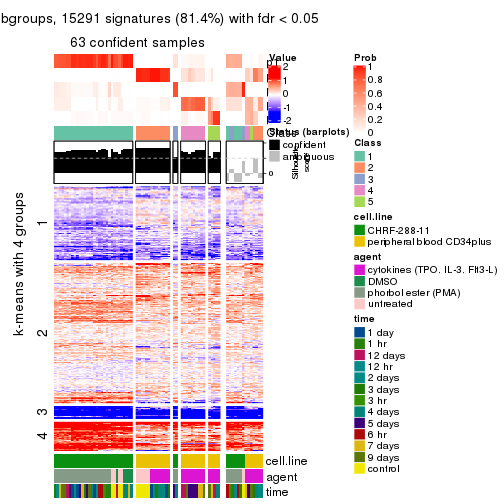</p>

</div>
<div id='tab-CV-hclust-get-signatures-no-scale-5'>
<pre><code class="r">get_signatures(res, k = 6, scale_rows = FALSE)
</code></pre>

<p></p>

</div>
</div>


Compare the overlap of signatures from different k:

```r
compare_signatures(res)
```


`get_signature()` returns a data frame invisibly. TO get the list of signatures, the function
call should be assigned to a variable explicitly. In following code, if `plot` argument is set
to `FALSE`, no heatmap is plotted while only the differential analysis is performed.

```r
# code only for demonstration
tb = get_signature(res, k = ..., plot = FALSE)
```

An example of the output of `tb` is:

```
#>   which_row         fdr    mean_1    mean_2 scaled_mean_1 scaled_mean_2 km
#> 1        38 0.042760348  8.373488  9.131774    -0.5533452     0.5164555  1
#> 2        40 0.018707592  7.106213  8.469186    -0.6173731     0.5762149  1
#> 3        55 0.019134737 10.221463 11.207825    -0.6159697     0.5749050  1
#> 4        59 0.006059896  5.921854  7.869574    -0.6899429     0.6439467  1
#> 5        60 0.018055526  8.928898 10.211722    -0.6204761     0.5791110  1
#> 6        98 0.009384629 15.714769 14.887706     0.6635654    -0.6193277  2
...
```

The columns in `tb` are:

1. `which_row`: row indices corresponding to the input matrix.
2. `fdr`: FDR for the differential test. 
3. `mean_x`: The mean value in group x.
4. `scaled_mean_x`: The mean value in group x after rows are scaled.
5. `km`: Row groups if k-means clustering is applied to rows.


UMAP plot which shows how samples are separated.


<script>
$( function() {
	$( '#tabs-CV-hclust-dimension-reduction' ).tabs();
} );
</script>
<div id='tabs-CV-hclust-dimension-reduction'>
<ul>
<li><a href='#tab-CV-hclust-dimension-reduction-1'>k = 2</a></li>
<li><a href='#tab-CV-hclust-dimension-reduction-2'>k = 3</a></li>
<li><a href='#tab-CV-hclust-dimension-reduction-3'>k = 4</a></li>
<li><a href='#tab-CV-hclust-dimension-reduction-4'>k = 5</a></li>
<li><a href='#tab-CV-hclust-dimension-reduction-5'>k = 6</a></li>
</ul>
<div id='tab-CV-hclust-dimension-reduction-1'>
<pre><code class="r">dimension_reduction(res, k = 2, method = &quot;UMAP&quot;)
</code></pre>

<p></p>

</div>
<div id='tab-CV-hclust-dimension-reduction-2'>
<pre><code class="r">dimension_reduction(res, k = 3, method = &quot;UMAP&quot;)
</code></pre>

<p></p>

</div>
<div id='tab-CV-hclust-dimension-reduction-3'>
<pre><code class="r">dimension_reduction(res, k = 4, method = &quot;UMAP&quot;)
</code></pre>

<p>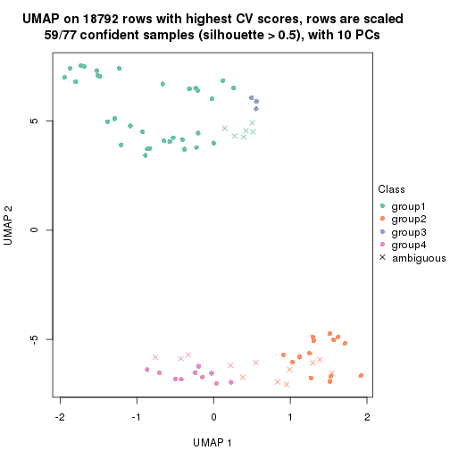</p>

</div>
<div id='tab-CV-hclust-dimension-reduction-4'>
<pre><code class="r">dimension_reduction(res, k = 5, method = &quot;UMAP&quot;)
</code></pre>

<p></p>

</div>
<div id='tab-CV-hclust-dimension-reduction-5'>
<pre><code class="r">dimension_reduction(res, k = 6, method = &quot;UMAP&quot;)
</code></pre>

<p></p>

</div>
</div>


Following heatmap shows how subgroups are split when increasing `k`:

```r
collect_classes(res)
```


Test correlation between subgroups and known annotations. If the known
annotation is numeric, one-way ANOVA test is applied, and if the known
annotation is discrete, chi-squared contingency table test is applied.

```r
test_to_known_factors(res)
```

```
#>            n cell.line(p) agent(p) time(p) k
#> CV:hclust 70     4.39e-16 4.85e-13 0.81283 2
#> CV:hclust 54     1.88e-12 5.41e-08 0.88261 3
#> CV:hclust 59     9.61e-13 2.72e-09 0.22029 4
#> CV:hclust 63     6.79e-13 1.44e-09 0.42341 5
#> CV:hclust 64     4.18e-13 4.85e-10 0.00264 6
```


If matrix rows can be associated to genes, consider to use `GO_Enrichment(res,
...)` to perform function enrichment for the signature genes.


 

---------------------------------------------------


### CV:kmeans**


The object with results only for a single top-value method and a single partition method 
can be extracted as:

```r
res = res_list["CV", "kmeans"]
# you can also extract it by
# res = res_list["CV:kmeans"]
```

A summary of `res` and all the functions that can be applied to it:

```r
res
```

```
#> A 'ConsensusPartition' object with k = 2, 3, 4, 5, 6.
#>   On a matrix with 18792 rows and 77 columns.
#>   Top rows (1000, 2000, 3000, 4000, 5000) are extracted by 'CV' method.
#>   Subgroups are detected by 'kmeans' method.
#>   Performed in total 1250 partitions by row resampling.
#>   Best k for subgroups seems to be 2.
#> 
#> Following methods can be applied to this 'ConsensusPartition' object:
#>  [1] "cola_report"             "collect_classes"         "collect_plots"          
#>  [4] "collect_stats"           "colnames"                "compare_signatures"     
#>  [7] "consensus_heatmap"       "dimension_reduction"     "functional_enrichment"  
#> [10] "get_anno_col"            "get_anno"                "get_classes"            
#> [13] "get_consensus"           "get_matrix"              "get_membership"         
#> [16] "get_param"               "get_signatures"          "get_stats"              
#> [19] "is_best_k"               "is_stable_k"             "membership_heatmap"     
#> [22] "ncol"                    "nrow"                    "plot_ecdf"              
#> [25] "rownames"                "select_partition_number" "show"                   
#> [28] "suggest_best_k"          "test_to_known_factors"
```

`collect_plots()` function collects all the plots made from `res` for all `k` (number of partitions)
into one single page to provide an easy and fast comparison between different `k`.

```r
collect_plots(res)
```


The plots are:

- The first row: a plot of the ECDF (Empirical cumulative distribution
  function) curves of the consensus matrix for each `k` and the heatmap of
  predicted classes for each `k`.
- The second row: heatmaps of the consensus matrix for each `k`.
- The third row: heatmaps of the membership matrix for each `k`.
- The fouth row: heatmaps of the signatures for each `k`.

All the plots in panels can be made by individual functions and they are
plotted later in this section.

`select_partition_number()` produces several plots showing different
statistics for choosing "optimized" `k`. There are following statistics:

- ECDF curves of the consensus matrix for each `k`;
- 1-PAC. [The PAC
  score](https://en.wikipedia.org/wiki/Consensus_clustering#Over-interpretation_potential_of_consensus_clustering)
  measures the proportion of the ambiguous subgrouping.
- Mean silhouette score.
- Concordance. The mean probability of fiting the consensus class ids in all
  partitions.
- Area increased. Denote $A_k$ as the area under the ECDF curve for current
  `k`, the area increased is defined as $A_k - A_{k-1}$.
- Rand index. The percent of pairs of samples that are both in a same cluster
  or both are not in a same cluster in the partition of k and k-1.
- Jaccard index. The ratio of pairs of samples are both in a same cluster in
  the partition of k and k-1 and the pairs of samples are both in a same
  cluster in the partition k or k-1.

The detailed explanations of these statistics can be found in [the cola
vignette](http://bioconductor.org/packages/devel/bioc/vignettes/cola/inst/doc/cola.html#toc_13).

Generally speaking, lower PAC score, higher mean silhouette score or higher
concordance corresponds to better partition. Rand index and Jaccard index
measure how similar the current partition is compared to partition with `k-1`.
If they are too similar, we won't accept `k` is better than `k-1`.

```r
select_partition_number(res)
```


The numeric values for all these statistics can be obtained by `get_stats()`.

```r
get_stats(res)
```

```
#>   k 1-PAC mean_silhouette concordance area_increased  Rand Jaccard
#> 2 2 1.000           0.987       0.995         0.5055 0.496   0.496
#> 3 3 0.690           0.496       0.681         0.2404 0.900   0.800
#> 4 4 0.585           0.778       0.774         0.1327 0.761   0.460
#> 5 5 0.622           0.716       0.773         0.0846 1.000   1.000
#> 6 6 0.683           0.628       0.696         0.0500 0.953   0.810
```

`suggest_best_k()` suggests the best $k$ based on these statistics. The rules are as follows:

- All $k$ with Jaccard index larger than 0.95 are removed because the increase of
  the partition number does not provides enough extra information. If all $k$ are removed,
  the best $k$ is assigned by `NA`.
- For $k$ with 1-PAC larger than 0.9, the maximal $k$ is taken as the "best k". Other $k$ is called "optional k".
- If it does not fit the second rule. The $k$ with the highest vote of highest
  1-PAC, mean silhouette and concordance is taken as the "best k".

```r
suggest_best_k(res)
```

```
#> [1] 2
```


Following shows the table of the partitions (You need to click the **show/hide
code output** link to see it). The membership matrix (columns with name `p*`)
is inferred by
[`clue::cl_consensus()`](https://www.rdocumentation.org/link/cl_consensus?package=clue)
function with the `SE` method. Basically the value in the membership matrix
represents the probability to belong to a certain group. The finall class
label for an item is determined with the group with highest probability it
belongs to.

In `get_classes()` function, the entropy is calculated from the membership
matrix and the silhouette score is calculated from the consensus matrix.


<script>
$( function() {
	$( '#tabs-CV-kmeans-get-classes' ).tabs();
} );
</script>
<div id='tabs-CV-kmeans-get-classes'>
<ul>
<li><a href='#tab-CV-kmeans-get-classes-1'>k = 2</a></li>
<li><a href='#tab-CV-kmeans-get-classes-2'>k = 3</a></li>
<li><a href='#tab-CV-kmeans-get-classes-3'>k = 4</a></li>
<li><a href='#tab-CV-kmeans-get-classes-4'>k = 5</a></li>
<li><a href='#tab-CV-kmeans-get-classes-5'>k = 6</a></li>
</ul>

<div id='tab-CV-kmeans-get-classes-1'>
<p><a id='tab-CV-kmeans-get-classes-1-a' style='color:#0366d6' href='#'>show/hide code output</a></p>
<pre><code class="r">cbind(get_classes(res, k = 2), get_membership(res, k = 2))
</code></pre>

<pre><code>#&gt;          class entropy silhouette    p1    p2
#&gt; GSM87962     1   0.000      0.990 1.000 0.000
#&gt; GSM87963     1   0.000      0.990 1.000 0.000
#&gt; GSM87983     1   0.000      0.990 1.000 0.000
#&gt; GSM87984     1   0.000      0.990 1.000 0.000
#&gt; GSM87961     1   0.000      0.990 1.000 0.000
#&gt; GSM87970     1   0.000      0.990 1.000 0.000
#&gt; GSM87971     1   0.963      0.366 0.612 0.388
#&gt; GSM87990     1   0.000      0.990 1.000 0.000
#&gt; GSM87991     1   0.000      0.990 1.000 0.000
#&gt; GSM87974     1   0.000      0.990 1.000 0.000
#&gt; GSM87994     1   0.000      0.990 1.000 0.000
#&gt; GSM87978     1   0.000      0.990 1.000 0.000
#&gt; GSM87979     1   0.000      0.990 1.000 0.000
#&gt; GSM87998     1   0.000      0.990 1.000 0.000
#&gt; GSM87999     1   0.000      0.990 1.000 0.000
#&gt; GSM87968     1   0.000      0.990 1.000 0.000
#&gt; GSM87987     1   0.000      0.990 1.000 0.000
#&gt; GSM87969     1   0.000      0.990 1.000 0.000
#&gt; GSM87988     1   0.000      0.990 1.000 0.000
#&gt; GSM87989     1   0.000      0.990 1.000 0.000
#&gt; GSM87972     1   0.000      0.990 1.000 0.000
#&gt; GSM87992     1   0.000      0.990 1.000 0.000
#&gt; GSM87973     1   0.000      0.990 1.000 0.000
#&gt; GSM87993     1   0.000      0.990 1.000 0.000
#&gt; GSM87975     1   0.000      0.990 1.000 0.000
#&gt; GSM87995     1   0.000      0.990 1.000 0.000
#&gt; GSM87976     1   0.000      0.990 1.000 0.000
#&gt; GSM87977     1   0.000      0.990 1.000 0.000
#&gt; GSM87996     1   0.000      0.990 1.000 0.000
#&gt; GSM87997     1   0.000      0.990 1.000 0.000
#&gt; GSM87980     1   0.000      0.990 1.000 0.000
#&gt; GSM88000     1   0.000      0.990 1.000 0.000
#&gt; GSM87981     1   0.000      0.990 1.000 0.000
#&gt; GSM87982     1   0.000      0.990 1.000 0.000
#&gt; GSM88001     1   0.000      0.990 1.000 0.000
#&gt; GSM87967     1   0.000      0.990 1.000 0.000
#&gt; GSM87964     1   0.000      0.990 1.000 0.000
#&gt; GSM87965     1   0.000      0.990 1.000 0.000
#&gt; GSM87966     1   0.000      0.990 1.000 0.000
#&gt; GSM87985     1   0.000      0.990 1.000 0.000
#&gt; GSM87986     1   0.000      0.990 1.000 0.000
#&gt; GSM88004     2   0.000      1.000 0.000 1.000
#&gt; GSM88015     2   0.000      1.000 0.000 1.000
#&gt; GSM88005     2   0.000      1.000 0.000 1.000
#&gt; GSM88006     2   0.000      1.000 0.000 1.000
#&gt; GSM88016     2   0.000      1.000 0.000 1.000
#&gt; GSM88007     2   0.000      1.000 0.000 1.000
#&gt; GSM88017     2   0.000      1.000 0.000 1.000
#&gt; GSM88029     2   0.000      1.000 0.000 1.000
#&gt; GSM88008     2   0.000      1.000 0.000 1.000
#&gt; GSM88009     2   0.000      1.000 0.000 1.000
#&gt; GSM88018     2   0.000      1.000 0.000 1.000
#&gt; GSM88024     2   0.000      1.000 0.000 1.000
#&gt; GSM88030     2   0.000      1.000 0.000 1.000
#&gt; GSM88036     2   0.000      1.000 0.000 1.000
#&gt; GSM88010     2   0.000      1.000 0.000 1.000
#&gt; GSM88011     2   0.000      1.000 0.000 1.000
#&gt; GSM88019     2   0.000      1.000 0.000 1.000
#&gt; GSM88027     2   0.000      1.000 0.000 1.000
#&gt; GSM88031     2   0.000      1.000 0.000 1.000
#&gt; GSM88012     2   0.000      1.000 0.000 1.000
#&gt; GSM88020     2   0.000      1.000 0.000 1.000
#&gt; GSM88032     2   0.000      1.000 0.000 1.000
#&gt; GSM88037     2   0.000      1.000 0.000 1.000
#&gt; GSM88013     2   0.000      1.000 0.000 1.000
#&gt; GSM88021     2   0.000      1.000 0.000 1.000
#&gt; GSM88025     2   0.000      1.000 0.000 1.000
#&gt; GSM88033     2   0.000      1.000 0.000 1.000
#&gt; GSM88014     2   0.000      1.000 0.000 1.000
#&gt; GSM88022     2   0.000      1.000 0.000 1.000
#&gt; GSM88034     2   0.000      1.000 0.000 1.000
#&gt; GSM88002     2   0.000      1.000 0.000 1.000
#&gt; GSM88003     2   0.000      1.000 0.000 1.000
#&gt; GSM88023     2   0.000      1.000 0.000 1.000
#&gt; GSM88026     2   0.000      1.000 0.000 1.000
#&gt; GSM88028     2   0.000      1.000 0.000 1.000
#&gt; GSM88035     2   0.000      1.000 0.000 1.000
</code></pre>

<script>
$('#tab-CV-kmeans-get-classes-1-a').parent().next().next().hide();
$('#tab-CV-kmeans-get-classes-1-a').click(function(){
  $('#tab-CV-kmeans-get-classes-1-a').parent().next().next().toggle();
  return(false);
});
</script>
</div>

<div id='tab-CV-kmeans-get-classes-2'>
<p><a id='tab-CV-kmeans-get-classes-2-a' style='color:#0366d6' href='#'>show/hide code output</a></p>
<pre><code class="r">cbind(get_classes(res, k = 3), get_membership(res, k = 3))
</code></pre>

<pre><code>#&gt;          class entropy silhouette    p1    p2    p3
#&gt; GSM87962     1  0.2356      0.807 0.928 0.000 0.072
#&gt; GSM87963     1  0.2356      0.807 0.928 0.000 0.072
#&gt; GSM87983     1  0.2356      0.807 0.928 0.000 0.072
#&gt; GSM87984     1  0.2356      0.807 0.928 0.000 0.072
#&gt; GSM87961     1  0.6286      0.759 0.536 0.000 0.464
#&gt; GSM87970     1  0.6305      0.751 0.516 0.000 0.484
#&gt; GSM87971     3  0.5397     -0.486 0.280 0.000 0.720
#&gt; GSM87990     1  0.6291      0.758 0.532 0.000 0.468
#&gt; GSM87991     1  0.1031      0.808 0.976 0.000 0.024
#&gt; GSM87974     1  0.6305      0.751 0.516 0.000 0.484
#&gt; GSM87994     1  0.1031      0.808 0.976 0.000 0.024
#&gt; GSM87978     1  0.6305      0.751 0.516 0.000 0.484
#&gt; GSM87979     1  0.6305      0.751 0.516 0.000 0.484
#&gt; GSM87998     1  0.1031      0.808 0.976 0.000 0.024
#&gt; GSM87999     1  0.0237      0.807 0.996 0.000 0.004
#&gt; GSM87968     1  0.6305      0.751 0.516 0.000 0.484
#&gt; GSM87987     1  0.2537      0.806 0.920 0.000 0.080
#&gt; GSM87969     1  0.6111      0.775 0.604 0.000 0.396
#&gt; GSM87988     1  0.0000      0.807 1.000 0.000 0.000
#&gt; GSM87989     1  0.0000      0.807 1.000 0.000 0.000
#&gt; GSM87972     1  0.6154      0.757 0.592 0.000 0.408
#&gt; GSM87992     1  0.0000      0.807 1.000 0.000 0.000
#&gt; GSM87973     1  0.6140      0.758 0.596 0.000 0.404
#&gt; GSM87993     1  0.0000      0.807 1.000 0.000 0.000
#&gt; GSM87975     1  0.6154      0.757 0.592 0.000 0.408
#&gt; GSM87995     1  0.0000      0.807 1.000 0.000 0.000
#&gt; GSM87976     1  0.6280      0.752 0.540 0.000 0.460
#&gt; GSM87977     1  0.6280      0.752 0.540 0.000 0.460
#&gt; GSM87996     1  0.0000      0.807 1.000 0.000 0.000
#&gt; GSM87997     1  0.0000      0.807 1.000 0.000 0.000
#&gt; GSM87980     1  0.6154      0.757 0.592 0.000 0.408
#&gt; GSM88000     1  0.0747      0.809 0.984 0.000 0.016
#&gt; GSM87981     1  0.6154      0.757 0.592 0.000 0.408
#&gt; GSM87982     1  0.6079      0.763 0.612 0.000 0.388
#&gt; GSM88001     1  0.0000      0.807 1.000 0.000 0.000
#&gt; GSM87967     1  0.0592      0.807 0.988 0.000 0.012
#&gt; GSM87964     1  0.6302      0.752 0.520 0.000 0.480
#&gt; GSM87965     1  0.2356      0.807 0.928 0.000 0.072
#&gt; GSM87966     1  0.1753      0.808 0.952 0.000 0.048
#&gt; GSM87985     1  0.6291      0.758 0.532 0.000 0.468
#&gt; GSM87986     1  0.2356      0.807 0.928 0.000 0.072
#&gt; GSM88004     2  0.6302     -0.507 0.000 0.520 0.480
#&gt; GSM88015     2  0.6302     -0.494 0.000 0.520 0.480
#&gt; GSM88005     2  0.6299     -0.493 0.000 0.524 0.476
#&gt; GSM88006     2  0.6302     -0.507 0.000 0.520 0.480
#&gt; GSM88016     2  0.6302     -0.494 0.000 0.520 0.480
#&gt; GSM88007     2  0.6302     -0.507 0.000 0.520 0.480
#&gt; GSM88017     3  0.6305      0.540 0.000 0.484 0.516
#&gt; GSM88029     3  0.6309      0.557 0.000 0.496 0.504
#&gt; GSM88008     2  0.6299     -0.493 0.000 0.524 0.476
#&gt; GSM88009     2  0.6302     -0.507 0.000 0.520 0.480
#&gt; GSM88018     2  0.6305     -0.502 0.000 0.516 0.484
#&gt; GSM88024     3  0.6307      0.546 0.000 0.488 0.512
#&gt; GSM88030     2  0.2537      0.480 0.000 0.920 0.080
#&gt; GSM88036     2  0.2537      0.480 0.000 0.920 0.080
#&gt; GSM88010     2  0.6111     -0.172 0.000 0.604 0.396
#&gt; GSM88011     2  0.5254      0.309 0.000 0.736 0.264
#&gt; GSM88019     2  0.5431      0.276 0.000 0.716 0.284
#&gt; GSM88027     2  0.5465      0.257 0.000 0.712 0.288
#&gt; GSM88031     2  0.0237      0.506 0.000 0.996 0.004
#&gt; GSM88012     2  0.6062     -0.101 0.000 0.616 0.384
#&gt; GSM88020     2  0.1529      0.492 0.000 0.960 0.040
#&gt; GSM88032     2  0.0237      0.506 0.000 0.996 0.004
#&gt; GSM88037     2  0.0237      0.506 0.000 0.996 0.004
#&gt; GSM88013     2  0.3412      0.467 0.000 0.876 0.124
#&gt; GSM88021     2  0.0747      0.501 0.000 0.984 0.016
#&gt; GSM88025     2  0.0237      0.506 0.000 0.996 0.004
#&gt; GSM88033     2  0.0237      0.506 0.000 0.996 0.004
#&gt; GSM88014     2  0.3412      0.467 0.000 0.876 0.124
#&gt; GSM88022     2  0.5098      0.341 0.000 0.752 0.248
#&gt; GSM88034     2  0.1529      0.492 0.000 0.960 0.040
#&gt; GSM88002     3  0.6309      0.557 0.000 0.496 0.504
#&gt; GSM88003     3  0.6308      0.554 0.000 0.492 0.508
#&gt; GSM88023     3  0.6308      0.551 0.000 0.492 0.508
#&gt; GSM88026     3  0.6309      0.557 0.000 0.496 0.504
#&gt; GSM88028     3  0.6309      0.557 0.000 0.496 0.504
#&gt; GSM88035     3  0.6309      0.557 0.000 0.496 0.504
</code></pre>

<script>
$('#tab-CV-kmeans-get-classes-2-a').parent().next().next().hide();
$('#tab-CV-kmeans-get-classes-2-a').click(function(){
  $('#tab-CV-kmeans-get-classes-2-a').parent().next().next().toggle();
  return(false);
});
</script>
</div>

<div id='tab-CV-kmeans-get-classes-3'>
<p><a id='tab-CV-kmeans-get-classes-3-a' style='color:#0366d6' href='#'>show/hide code output</a></p>
<pre><code class="r">cbind(get_classes(res, k = 4), get_membership(res, k = 4))
</code></pre>

<pre><code>#&gt;          class entropy silhouette    p1    p2    p3    p4
#&gt; GSM87962     3  0.7009      0.777 0.372 0.108 0.516 0.004
#&gt; GSM87963     3  0.6982      0.772 0.380 0.104 0.512 0.004
#&gt; GSM87983     3  0.7078      0.781 0.364 0.116 0.516 0.004
#&gt; GSM87984     3  0.6973      0.776 0.376 0.104 0.516 0.004
#&gt; GSM87961     1  0.1936      0.833 0.940 0.032 0.028 0.000
#&gt; GSM87970     1  0.0592      0.850 0.984 0.016 0.000 0.000
#&gt; GSM87971     1  0.2983      0.730 0.880 0.108 0.008 0.004
#&gt; GSM87990     1  0.2909      0.768 0.888 0.092 0.020 0.000
#&gt; GSM87991     3  0.6133      0.844 0.268 0.088 0.644 0.000
#&gt; GSM87974     1  0.0592      0.850 0.984 0.016 0.000 0.000
#&gt; GSM87994     3  0.6074      0.845 0.268 0.084 0.648 0.000
#&gt; GSM87978     1  0.0336      0.846 0.992 0.008 0.000 0.000
#&gt; GSM87979     1  0.0524      0.846 0.988 0.008 0.004 0.000
#&gt; GSM87998     3  0.5953      0.846 0.268 0.076 0.656 0.000
#&gt; GSM87999     3  0.5520      0.848 0.244 0.060 0.696 0.000
#&gt; GSM87968     1  0.0336      0.846 0.992 0.008 0.000 0.000
#&gt; GSM87987     3  0.6627      0.749 0.412 0.084 0.504 0.000
#&gt; GSM87969     1  0.4621      0.631 0.796 0.076 0.128 0.000
#&gt; GSM87988     3  0.4328      0.845 0.244 0.008 0.748 0.000
#&gt; GSM87989     3  0.4675      0.845 0.244 0.020 0.736 0.000
#&gt; GSM87972     1  0.4428      0.792 0.808 0.068 0.124 0.000
#&gt; GSM87992     3  0.4328      0.843 0.244 0.008 0.748 0.000
#&gt; GSM87973     1  0.4804      0.770 0.780 0.072 0.148 0.000
#&gt; GSM87993     3  0.5137      0.820 0.244 0.040 0.716 0.000
#&gt; GSM87975     1  0.4700      0.786 0.792 0.084 0.124 0.000
#&gt; GSM87995     3  0.4328      0.843 0.244 0.008 0.748 0.000
#&gt; GSM87976     1  0.2739      0.843 0.904 0.060 0.036 0.000
#&gt; GSM87977     1  0.2840      0.841 0.900 0.056 0.044 0.000
#&gt; GSM87996     3  0.4328      0.843 0.244 0.008 0.748 0.000
#&gt; GSM87997     3  0.4776      0.833 0.244 0.024 0.732 0.000
#&gt; GSM87980     1  0.4879      0.779 0.780 0.092 0.128 0.000
#&gt; GSM88000     3  0.5393      0.793 0.268 0.044 0.688 0.000
#&gt; GSM87981     1  0.4621      0.785 0.796 0.076 0.128 0.000
#&gt; GSM87982     1  0.5100      0.748 0.756 0.076 0.168 0.000
#&gt; GSM88001     3  0.4328      0.843 0.244 0.008 0.748 0.000
#&gt; GSM87967     3  0.5744      0.806 0.256 0.068 0.676 0.000
#&gt; GSM87964     1  0.1022      0.849 0.968 0.032 0.000 0.000
#&gt; GSM87965     3  0.7079      0.765 0.384 0.112 0.500 0.004
#&gt; GSM87966     3  0.6995      0.808 0.324 0.120 0.552 0.004
#&gt; GSM87985     1  0.2450      0.804 0.912 0.072 0.016 0.000
#&gt; GSM87986     3  0.6973      0.776 0.376 0.104 0.516 0.004
#&gt; GSM88004     2  0.4482      0.881 0.000 0.728 0.008 0.264
#&gt; GSM88015     2  0.4690      0.873 0.000 0.724 0.016 0.260
#&gt; GSM88005     2  0.5522      0.845 0.000 0.668 0.044 0.288
#&gt; GSM88006     2  0.4606      0.880 0.000 0.724 0.012 0.264
#&gt; GSM88016     2  0.4748      0.875 0.000 0.716 0.016 0.268
#&gt; GSM88007     2  0.4606      0.880 0.000 0.724 0.012 0.264
#&gt; GSM88017     2  0.5500      0.858 0.004 0.712 0.056 0.228
#&gt; GSM88029     2  0.4468      0.878 0.000 0.752 0.016 0.232
#&gt; GSM88008     2  0.5522      0.845 0.000 0.668 0.044 0.288
#&gt; GSM88009     2  0.4606      0.880 0.000 0.724 0.012 0.264
#&gt; GSM88018     2  0.4839      0.873 0.004 0.724 0.016 0.256
#&gt; GSM88024     2  0.5631      0.849 0.000 0.696 0.072 0.232
#&gt; GSM88030     4  0.5459      0.646 0.004 0.128 0.120 0.748
#&gt; GSM88036     4  0.5459      0.646 0.004 0.128 0.120 0.748
#&gt; GSM88010     2  0.5414      0.731 0.000 0.604 0.020 0.376
#&gt; GSM88011     4  0.5712      0.294 0.000 0.308 0.048 0.644
#&gt; GSM88019     4  0.5773      0.217 0.000 0.336 0.044 0.620
#&gt; GSM88027     4  0.5713      0.200 0.000 0.340 0.040 0.620
#&gt; GSM88031     4  0.0188      0.769 0.000 0.004 0.000 0.996
#&gt; GSM88012     2  0.5582      0.682 0.000 0.576 0.024 0.400
#&gt; GSM88020     4  0.3917      0.721 0.004 0.044 0.108 0.844
#&gt; GSM88032     4  0.0376      0.769 0.000 0.004 0.004 0.992
#&gt; GSM88037     4  0.0188      0.769 0.000 0.004 0.000 0.996
#&gt; GSM88013     4  0.3245      0.716 0.000 0.100 0.028 0.872
#&gt; GSM88021     4  0.1732      0.766 0.004 0.008 0.040 0.948
#&gt; GSM88025     4  0.0657      0.770 0.000 0.012 0.004 0.984
#&gt; GSM88033     4  0.0804      0.770 0.000 0.012 0.008 0.980
#&gt; GSM88014     4  0.3245      0.716 0.000 0.100 0.028 0.872
#&gt; GSM88022     4  0.5574      0.370 0.000 0.284 0.048 0.668
#&gt; GSM88034     4  0.3917      0.721 0.004 0.044 0.108 0.844
#&gt; GSM88002     2  0.5900      0.852 0.000 0.684 0.096 0.220
#&gt; GSM88003     2  0.5900      0.852 0.000 0.684 0.096 0.220
#&gt; GSM88023     2  0.5750      0.851 0.000 0.696 0.088 0.216
#&gt; GSM88026     2  0.5750      0.851 0.000 0.696 0.088 0.216
#&gt; GSM88028     2  0.5750      0.851 0.000 0.696 0.088 0.216
#&gt; GSM88035     2  0.5750      0.851 0.000 0.696 0.088 0.216
</code></pre>

<script>
$('#tab-CV-kmeans-get-classes-3-a').parent().next().next().hide();
$('#tab-CV-kmeans-get-classes-3-a').click(function(){
  $('#tab-CV-kmeans-get-classes-3-a').parent().next().next().toggle();
  return(false);
});
</script>
</div>

<div id='tab-CV-kmeans-get-classes-4'>
<p><a id='tab-CV-kmeans-get-classes-4-a' style='color:#0366d6' href='#'>show/hide code output</a></p>
<pre><code class="r">cbind(get_classes(res, k = 5), get_membership(res, k = 5))
</code></pre>

<pre><code>#&gt;          class entropy silhouette    p1    p2    p3    p4 p5
#&gt; GSM87962     3  0.6586      0.663 0.236 0.000 0.460 0.000 NA
#&gt; GSM87963     3  0.6710      0.622 0.272 0.000 0.424 0.000 NA
#&gt; GSM87983     3  0.6533      0.673 0.224 0.000 0.472 0.000 NA
#&gt; GSM87984     3  0.6558      0.669 0.232 0.000 0.468 0.000 NA
#&gt; GSM87961     1  0.2352      0.781 0.912 0.000 0.032 0.008 NA
#&gt; GSM87970     1  0.0404      0.803 0.988 0.000 0.000 0.000 NA
#&gt; GSM87971     1  0.1554      0.786 0.952 0.024 0.008 0.012 NA
#&gt; GSM87990     1  0.3696      0.612 0.772 0.000 0.016 0.000 NA
#&gt; GSM87991     3  0.5568      0.751 0.116 0.000 0.644 0.004 NA
#&gt; GSM87974     1  0.0703      0.803 0.976 0.000 0.000 0.000 NA
#&gt; GSM87994     3  0.5464      0.753 0.116 0.000 0.660 0.004 NA
#&gt; GSM87978     1  0.0451      0.800 0.988 0.000 0.000 0.008 NA
#&gt; GSM87979     1  0.0451      0.800 0.988 0.000 0.000 0.008 NA
#&gt; GSM87998     3  0.5493      0.754 0.124 0.000 0.660 0.004 NA
#&gt; GSM87999     3  0.4872      0.757 0.092 0.000 0.724 0.004 NA
#&gt; GSM87968     1  0.0451      0.800 0.988 0.000 0.000 0.008 NA
#&gt; GSM87987     3  0.6671      0.625 0.292 0.000 0.440 0.000 NA
#&gt; GSM87969     1  0.5872      0.400 0.636 0.000 0.140 0.012 NA
#&gt; GSM87988     3  0.2712      0.750 0.088 0.000 0.880 0.000 NA
#&gt; GSM87989     3  0.3030      0.749 0.088 0.000 0.868 0.004 NA
#&gt; GSM87972     1  0.5351      0.744 0.724 0.000 0.132 0.036 NA
#&gt; GSM87992     3  0.1851      0.743 0.088 0.000 0.912 0.000 NA
#&gt; GSM87973     1  0.5973      0.699 0.660 0.000 0.196 0.044 NA
#&gt; GSM87993     3  0.3248      0.706 0.088 0.000 0.856 0.004 NA
#&gt; GSM87975     1  0.6257      0.715 0.648 0.000 0.136 0.056 NA
#&gt; GSM87995     3  0.1851      0.743 0.088 0.000 0.912 0.000 NA
#&gt; GSM87976     1  0.4643      0.776 0.776 0.000 0.044 0.048 NA
#&gt; GSM87977     1  0.3986      0.789 0.828 0.000 0.068 0.036 NA
#&gt; GSM87996     3  0.1851      0.743 0.088 0.000 0.912 0.000 NA
#&gt; GSM87997     3  0.2608      0.731 0.088 0.000 0.888 0.004 NA
#&gt; GSM87980     1  0.6418      0.695 0.624 0.000 0.168 0.048 NA
#&gt; GSM88000     3  0.3888      0.666 0.112 0.000 0.816 0.008 NA
#&gt; GSM87981     1  0.5589      0.729 0.700 0.000 0.156 0.036 NA
#&gt; GSM87982     1  0.6127      0.668 0.628 0.000 0.232 0.036 NA
#&gt; GSM88001     3  0.1851      0.743 0.088 0.000 0.912 0.000 NA
#&gt; GSM87967     3  0.5143      0.683 0.108 0.000 0.740 0.032 NA
#&gt; GSM87964     1  0.2787      0.789 0.880 0.000 0.004 0.028 NA
#&gt; GSM87965     3  0.6748      0.605 0.284 0.000 0.408 0.000 NA
#&gt; GSM87966     3  0.6217      0.706 0.164 0.000 0.520 0.000 NA
#&gt; GSM87985     1  0.3190      0.709 0.840 0.000 0.012 0.008 NA
#&gt; GSM87986     3  0.6558      0.669 0.232 0.000 0.468 0.000 NA
#&gt; GSM88004     2  0.1393      0.852 0.000 0.956 0.008 0.012 NA
#&gt; GSM88015     2  0.2515      0.841 0.000 0.908 0.020 0.032 NA
#&gt; GSM88005     2  0.3700      0.781 0.000 0.840 0.020 0.080 NA
#&gt; GSM88006     2  0.1393      0.852 0.000 0.956 0.008 0.012 NA
#&gt; GSM88016     2  0.2342      0.842 0.000 0.916 0.020 0.024 NA
#&gt; GSM88007     2  0.1393      0.852 0.000 0.956 0.008 0.012 NA
#&gt; GSM88017     2  0.2629      0.832 0.000 0.880 0.012 0.004 NA
#&gt; GSM88029     2  0.1800      0.852 0.000 0.932 0.020 0.000 NA
#&gt; GSM88008     2  0.3700      0.781 0.000 0.840 0.020 0.080 NA
#&gt; GSM88009     2  0.1393      0.852 0.000 0.956 0.008 0.012 NA
#&gt; GSM88018     2  0.2767      0.840 0.004 0.900 0.024 0.032 NA
#&gt; GSM88024     2  0.3511      0.767 0.000 0.800 0.012 0.004 NA
#&gt; GSM88030     4  0.6194      0.565 0.000 0.156 0.000 0.516 NA
#&gt; GSM88036     4  0.6194      0.565 0.000 0.156 0.000 0.516 NA
#&gt; GSM88010     2  0.4371      0.674 0.000 0.776 0.028 0.164 NA
#&gt; GSM88011     4  0.6294      0.340 0.000 0.396 0.032 0.500 NA
#&gt; GSM88019     4  0.6098      0.312 0.000 0.416 0.020 0.492 NA
#&gt; GSM88027     4  0.6020      0.298 0.000 0.420 0.016 0.492 NA
#&gt; GSM88031     4  0.1732      0.737 0.000 0.080 0.000 0.920 NA
#&gt; GSM88012     2  0.4741      0.640 0.000 0.744 0.028 0.188 NA
#&gt; GSM88020     4  0.5488      0.627 0.000 0.092 0.000 0.608 NA
#&gt; GSM88032     4  0.2017      0.737 0.000 0.080 0.000 0.912 NA
#&gt; GSM88037     4  0.1732      0.737 0.000 0.080 0.000 0.920 NA
#&gt; GSM88013     4  0.4846      0.673 0.000 0.192 0.028 0.736 NA
#&gt; GSM88021     4  0.3886      0.724 0.000 0.068 0.020 0.828 NA
#&gt; GSM88025     4  0.2352      0.737 0.000 0.092 0.004 0.896 NA
#&gt; GSM88033     4  0.2193      0.737 0.000 0.092 0.000 0.900 NA
#&gt; GSM88014     4  0.4846      0.673 0.000 0.192 0.028 0.736 NA
#&gt; GSM88022     4  0.6199      0.408 0.000 0.364 0.036 0.536 NA
#&gt; GSM88034     4  0.5488      0.627 0.000 0.092 0.000 0.608 NA
#&gt; GSM88002     2  0.3409      0.822 0.000 0.824 0.032 0.000 NA
#&gt; GSM88003     2  0.3366      0.822 0.000 0.828 0.032 0.000 NA
#&gt; GSM88023     2  0.3400      0.824 0.000 0.828 0.036 0.000 NA
#&gt; GSM88026     2  0.3400      0.826 0.000 0.828 0.036 0.000 NA
#&gt; GSM88028     2  0.3400      0.824 0.000 0.828 0.036 0.000 NA
#&gt; GSM88035     2  0.3400      0.824 0.000 0.828 0.036 0.000 NA
</code></pre>

<script>
$('#tab-CV-kmeans-get-classes-4-a').parent().next().next().hide();
$('#tab-CV-kmeans-get-classes-4-a').click(function(){
  $('#tab-CV-kmeans-get-classes-4-a').parent().next().next().toggle();
  return(false);
});
</script>
</div>

<div id='tab-CV-kmeans-get-classes-5'>
<p><a id='tab-CV-kmeans-get-classes-5-a' style='color:#0366d6' href='#'>show/hide code output</a></p>
<pre><code class="r">cbind(get_classes(res, k = 6), get_membership(res, k = 6))
</code></pre>

<pre><code>#&gt;          class entropy silhouette    p1    p2    p3    p4    p5    p6
#&gt; GSM87962     1  0.1285     0.6042 0.944 0.000 0.052 0.000 0.004 0.000
#&gt; GSM87963     1  0.1806     0.5913 0.908 0.000 0.088 0.000 0.004 0.000
#&gt; GSM87983     1  0.1219     0.6024 0.948 0.000 0.048 0.000 0.004 0.000
#&gt; GSM87984     1  0.1267     0.6032 0.940 0.000 0.060 0.000 0.000 0.000
#&gt; GSM87961     3  0.3152     0.7124 0.196 0.000 0.792 0.000 0.008 0.004
#&gt; GSM87970     3  0.1624     0.7681 0.040 0.000 0.936 0.004 0.000 0.020
#&gt; GSM87971     3  0.1477     0.7622 0.048 0.000 0.940 0.000 0.004 0.008
#&gt; GSM87990     3  0.3707     0.5263 0.312 0.000 0.680 0.000 0.000 0.008
#&gt; GSM87991     1  0.3929     0.4035 0.792 0.000 0.000 0.020 0.112 0.076
#&gt; GSM87974     3  0.2009     0.7683 0.040 0.000 0.916 0.004 0.000 0.040
#&gt; GSM87994     1  0.3286     0.4269 0.832 0.000 0.000 0.012 0.112 0.044
#&gt; GSM87978     3  0.1542     0.7626 0.052 0.000 0.936 0.000 0.004 0.008
#&gt; GSM87979     3  0.1644     0.7623 0.052 0.000 0.932 0.000 0.004 0.012
#&gt; GSM87998     1  0.4344     0.3423 0.756 0.000 0.004 0.016 0.148 0.076
#&gt; GSM87999     1  0.4824     0.1815 0.700 0.000 0.000 0.020 0.184 0.096
#&gt; GSM87968     3  0.1644     0.7623 0.052 0.000 0.932 0.000 0.004 0.012
#&gt; GSM87987     1  0.2848     0.5256 0.816 0.000 0.176 0.000 0.000 0.008
#&gt; GSM87969     1  0.5125    -0.0335 0.528 0.000 0.400 0.000 0.008 0.064
#&gt; GSM87988     1  0.4328    -0.7460 0.520 0.000 0.000 0.000 0.460 0.020
#&gt; GSM87989     1  0.5352    -0.6171 0.532 0.000 0.000 0.016 0.380 0.072
#&gt; GSM87972     3  0.5784     0.7197 0.056 0.000 0.628 0.000 0.164 0.152
#&gt; GSM87992     5  0.3854     0.9274 0.464 0.000 0.000 0.000 0.536 0.000
#&gt; GSM87973     3  0.6565     0.6278 0.060 0.000 0.512 0.004 0.268 0.156
#&gt; GSM87993     5  0.4025     0.8782 0.416 0.000 0.000 0.000 0.576 0.008
#&gt; GSM87975     3  0.6343     0.6867 0.056 0.000 0.528 0.000 0.152 0.264
#&gt; GSM87995     5  0.3854     0.9274 0.464 0.000 0.000 0.000 0.536 0.000
#&gt; GSM87976     3  0.5149     0.7328 0.024 0.000 0.664 0.004 0.080 0.228
#&gt; GSM87977     3  0.5054     0.7393 0.036 0.000 0.696 0.000 0.160 0.108
#&gt; GSM87996     5  0.3854     0.9274 0.464 0.000 0.000 0.000 0.536 0.000
#&gt; GSM87997     5  0.3828     0.9162 0.440 0.000 0.000 0.000 0.560 0.000
#&gt; GSM87980     3  0.6741     0.6303 0.056 0.000 0.456 0.000 0.244 0.244
#&gt; GSM88000     5  0.4294     0.8201 0.388 0.000 0.012 0.000 0.592 0.008
#&gt; GSM87981     3  0.6133     0.6839 0.056 0.000 0.572 0.000 0.224 0.148
#&gt; GSM87982     3  0.6365     0.6454 0.060 0.000 0.528 0.000 0.264 0.148
#&gt; GSM88001     5  0.3854     0.9274 0.464 0.000 0.000 0.000 0.536 0.000
#&gt; GSM87967     1  0.6511    -0.4191 0.424 0.000 0.032 0.004 0.368 0.172
#&gt; GSM87964     3  0.4195     0.7419 0.040 0.000 0.776 0.004 0.040 0.140
#&gt; GSM87965     1  0.2213     0.5765 0.888 0.000 0.100 0.000 0.008 0.004
#&gt; GSM87966     1  0.0767     0.5746 0.976 0.000 0.008 0.000 0.012 0.004
#&gt; GSM87985     3  0.3606     0.6290 0.264 0.000 0.724 0.000 0.008 0.004
#&gt; GSM87986     1  0.1204     0.6028 0.944 0.000 0.056 0.000 0.000 0.000
#&gt; GSM88004     2  0.1555     0.8088 0.000 0.940 0.000 0.008 0.012 0.040
#&gt; GSM88015     2  0.3049     0.7976 0.000 0.868 0.020 0.016 0.024 0.072
#&gt; GSM88005     2  0.4388     0.7117 0.000 0.780 0.012 0.100 0.036 0.072
#&gt; GSM88006     2  0.1555     0.8088 0.000 0.940 0.000 0.008 0.012 0.040
#&gt; GSM88016     2  0.2687     0.8011 0.000 0.884 0.008 0.016 0.020 0.072
#&gt; GSM88007     2  0.1555     0.8088 0.000 0.940 0.000 0.008 0.012 0.040
#&gt; GSM88017     2  0.3812     0.7682 0.000 0.788 0.008 0.000 0.072 0.132
#&gt; GSM88029     2  0.2762     0.8084 0.000 0.864 0.004 0.012 0.012 0.108
#&gt; GSM88008     2  0.4388     0.7117 0.000 0.780 0.012 0.100 0.036 0.072
#&gt; GSM88009     2  0.1555     0.8088 0.000 0.940 0.000 0.008 0.012 0.040
#&gt; GSM88018     2  0.3641     0.7879 0.000 0.828 0.024 0.016 0.032 0.100
#&gt; GSM88024     2  0.4069     0.7516 0.000 0.764 0.008 0.000 0.080 0.148
#&gt; GSM88030     4  0.7442     0.4595 0.000 0.112 0.004 0.368 0.272 0.244
#&gt; GSM88036     4  0.7442     0.4595 0.000 0.112 0.004 0.368 0.272 0.244
#&gt; GSM88010     2  0.4794     0.6276 0.000 0.716 0.004 0.152 0.016 0.112
#&gt; GSM88011     4  0.5959     0.5409 0.000 0.232 0.020 0.612 0.036 0.100
#&gt; GSM88019     4  0.5819     0.5289 0.000 0.244 0.008 0.604 0.032 0.112
#&gt; GSM88027     4  0.5714     0.5263 0.000 0.244 0.008 0.612 0.028 0.108
#&gt; GSM88031     4  0.0922     0.7335 0.000 0.024 0.000 0.968 0.004 0.004
#&gt; GSM88012     2  0.5107     0.6014 0.000 0.680 0.004 0.176 0.016 0.124
#&gt; GSM88020     4  0.6584     0.5578 0.000 0.052 0.000 0.488 0.236 0.224
#&gt; GSM88032     4  0.1232     0.7328 0.000 0.024 0.000 0.956 0.004 0.016
#&gt; GSM88037     4  0.0922     0.7335 0.000 0.024 0.000 0.968 0.004 0.004
#&gt; GSM88013     4  0.3739     0.6929 0.000 0.112 0.004 0.800 0.004 0.080
#&gt; GSM88021     4  0.5039     0.6873 0.000 0.024 0.020 0.720 0.092 0.144
#&gt; GSM88025     4  0.1719     0.7323 0.000 0.032 0.000 0.932 0.004 0.032
#&gt; GSM88033     4  0.1334     0.7322 0.000 0.032 0.000 0.948 0.000 0.020
#&gt; GSM88014     4  0.3739     0.6929 0.000 0.112 0.004 0.800 0.004 0.080
#&gt; GSM88022     4  0.5743     0.5691 0.000 0.200 0.008 0.632 0.036 0.124
#&gt; GSM88034     4  0.6534     0.5573 0.000 0.052 0.000 0.496 0.252 0.200
#&gt; GSM88002     2  0.3463     0.7731 0.000 0.748 0.000 0.008 0.004 0.240
#&gt; GSM88003     2  0.3323     0.7734 0.000 0.752 0.000 0.008 0.000 0.240
#&gt; GSM88023     2  0.3373     0.7717 0.000 0.744 0.000 0.008 0.000 0.248
#&gt; GSM88026     2  0.3349     0.7732 0.000 0.748 0.000 0.008 0.000 0.244
#&gt; GSM88028     2  0.3373     0.7717 0.000 0.744 0.000 0.008 0.000 0.248
#&gt; GSM88035     2  0.3373     0.7717 0.000 0.744 0.000 0.008 0.000 0.248
</code></pre>

<script>
$('#tab-CV-kmeans-get-classes-5-a').parent().next().next().hide();
$('#tab-CV-kmeans-get-classes-5-a').click(function(){
  $('#tab-CV-kmeans-get-classes-5-a').parent().next().next().toggle();
  return(false);
});
</script>
</div>
</div>

Heatmaps for the consensus matrix. It visualizes the probability of two
samples to be in a same group.


<script>
$( function() {
	$( '#tabs-CV-kmeans-consensus-heatmap' ).tabs();
} );
</script>
<div id='tabs-CV-kmeans-consensus-heatmap'>
<ul>
<li><a href='#tab-CV-kmeans-consensus-heatmap-1'>k = 2</a></li>
<li><a href='#tab-CV-kmeans-consensus-heatmap-2'>k = 3</a></li>
<li><a href='#tab-CV-kmeans-consensus-heatmap-3'>k = 4</a></li>
<li><a href='#tab-CV-kmeans-consensus-heatmap-4'>k = 5</a></li>
<li><a href='#tab-CV-kmeans-consensus-heatmap-5'>k = 6</a></li>
</ul>
<div id='tab-CV-kmeans-consensus-heatmap-1'>
<pre><code class="r">consensus_heatmap(res, k = 2)
</code></pre>

<p></p>

</div>
<div id='tab-CV-kmeans-consensus-heatmap-2'>
<pre><code class="r">consensus_heatmap(res, k = 3)
</code></pre>

<p></p>

</div>
<div id='tab-CV-kmeans-consensus-heatmap-3'>
<pre><code class="r">consensus_heatmap(res, k = 4)
</code></pre>

<p></p>

</div>
<div id='tab-CV-kmeans-consensus-heatmap-4'>
<pre><code class="r">consensus_heatmap(res, k = 5)
</code></pre>

<p></p>

</div>
<div id='tab-CV-kmeans-consensus-heatmap-5'>
<pre><code class="r">consensus_heatmap(res, k = 6)
</code></pre>

<p></p>

</div>
</div>

Heatmaps for the membership of samples in all partitions to see how consistent they are:


<script>
$( function() {
	$( '#tabs-CV-kmeans-membership-heatmap' ).tabs();
} );
</script>
<div id='tabs-CV-kmeans-membership-heatmap'>
<ul>
<li><a href='#tab-CV-kmeans-membership-heatmap-1'>k = 2</a></li>
<li><a href='#tab-CV-kmeans-membership-heatmap-2'>k = 3</a></li>
<li><a href='#tab-CV-kmeans-membership-heatmap-3'>k = 4</a></li>
<li><a href='#tab-CV-kmeans-membership-heatmap-4'>k = 5</a></li>
<li><a href='#tab-CV-kmeans-membership-heatmap-5'>k = 6</a></li>
</ul>
<div id='tab-CV-kmeans-membership-heatmap-1'>
<pre><code class="r">membership_heatmap(res, k = 2)
</code></pre>

<p></p>

</div>
<div id='tab-CV-kmeans-membership-heatmap-2'>
<pre><code class="r">membership_heatmap(res, k = 3)
</code></pre>

<p></p>

</div>
<div id='tab-CV-kmeans-membership-heatmap-3'>
<pre><code class="r">membership_heatmap(res, k = 4)
</code></pre>

<p></p>

</div>
<div id='tab-CV-kmeans-membership-heatmap-4'>
<pre><code class="r">membership_heatmap(res, k = 5)
</code></pre>

<p></p>

</div>
<div id='tab-CV-kmeans-membership-heatmap-5'>
<pre><code class="r">membership_heatmap(res, k = 6)
</code></pre>

<p></p>

</div>
</div>

As soon as we have had the classes for columns, we can look for signatures
which are significantly different between classes which can be candidate marks
for certain classes. Following are the heatmaps for signatures.


Signature heatmaps where rows are scaled:


<script>
$( function() {
	$( '#tabs-CV-kmeans-get-signatures' ).tabs();
} );
</script>
<div id='tabs-CV-kmeans-get-signatures'>
<ul>
<li><a href='#tab-CV-kmeans-get-signatures-1'>k = 2</a></li>
<li><a href='#tab-CV-kmeans-get-signatures-2'>k = 3</a></li>
<li><a href='#tab-CV-kmeans-get-signatures-3'>k = 4</a></li>
<li><a href='#tab-CV-kmeans-get-signatures-4'>k = 5</a></li>
<li><a href='#tab-CV-kmeans-get-signatures-5'>k = 6</a></li>
</ul>
<div id='tab-CV-kmeans-get-signatures-1'>
<pre><code class="r">get_signatures(res, k = 2)
</code></pre>

<p></p>

</div>
<div id='tab-CV-kmeans-get-signatures-2'>
<pre><code class="r">get_signatures(res, k = 3)
</code></pre>

<p></p>

</div>
<div id='tab-CV-kmeans-get-signatures-3'>
<pre><code class="r">get_signatures(res, k = 4)
</code></pre>

<p></p>

</div>
<div id='tab-CV-kmeans-get-signatures-4'>
<pre><code class="r">get_signatures(res, k = 5)
</code></pre>

<p></p>

</div>
<div id='tab-CV-kmeans-get-signatures-5'>
<pre><code class="r">get_signatures(res, k = 6)
</code></pre>

<p></p>

</div>
</div>


Signature heatmaps where rows are not scaled:


<script>
$( function() {
	$( '#tabs-CV-kmeans-get-signatures-no-scale' ).tabs();
} );
</script>
<div id='tabs-CV-kmeans-get-signatures-no-scale'>
<ul>
<li><a href='#tab-CV-kmeans-get-signatures-no-scale-1'>k = 2</a></li>
<li><a href='#tab-CV-kmeans-get-signatures-no-scale-2'>k = 3</a></li>
<li><a href='#tab-CV-kmeans-get-signatures-no-scale-3'>k = 4</a></li>
<li><a href='#tab-CV-kmeans-get-signatures-no-scale-4'>k = 5</a></li>
<li><a href='#tab-CV-kmeans-get-signatures-no-scale-5'>k = 6</a></li>
</ul>
<div id='tab-CV-kmeans-get-signatures-no-scale-1'>
<pre><code class="r">get_signatures(res, k = 2, scale_rows = FALSE)
</code></pre>

<p></p>

</div>
<div id='tab-CV-kmeans-get-signatures-no-scale-2'>
<pre><code class="r">get_signatures(res, k = 3, scale_rows = FALSE)
</code></pre>

<p></p>

</div>
<div id='tab-CV-kmeans-get-signatures-no-scale-3'>
<pre><code class="r">get_signatures(res, k = 4, scale_rows = FALSE)
</code></pre>

<p></p>

</div>
<div id='tab-CV-kmeans-get-signatures-no-scale-4'>
<pre><code class="r">get_signatures(res, k = 5, scale_rows = FALSE)
</code></pre>

<p></p>

</div>
<div id='tab-CV-kmeans-get-signatures-no-scale-5'>
<pre><code class="r">get_signatures(res, k = 6, scale_rows = FALSE)
</code></pre>

<p></p>

</div>
</div>


Compare the overlap of signatures from different k:

```r
compare_signatures(res)
```


`get_signature()` returns a data frame invisibly. TO get the list of signatures, the function
call should be assigned to a variable explicitly. In following code, if `plot` argument is set
to `FALSE`, no heatmap is plotted while only the differential analysis is performed.

```r
# code only for demonstration
tb = get_signature(res, k = ..., plot = FALSE)
```

An example of the output of `tb` is:

```
#>   which_row         fdr    mean_1    mean_2 scaled_mean_1 scaled_mean_2 km
#> 1        38 0.042760348  8.373488  9.131774    -0.5533452     0.5164555  1
#> 2        40 0.018707592  7.106213  8.469186    -0.6173731     0.5762149  1
#> 3        55 0.019134737 10.221463 11.207825    -0.6159697     0.5749050  1
#> 4        59 0.006059896  5.921854  7.869574    -0.6899429     0.6439467  1
#> 5        60 0.018055526  8.928898 10.211722    -0.6204761     0.5791110  1
#> 6        98 0.009384629 15.714769 14.887706     0.6635654    -0.6193277  2
...
```

The columns in `tb` are:

1. `which_row`: row indices corresponding to the input matrix.
2. `fdr`: FDR for the differential test. 
3. `mean_x`: The mean value in group x.
4. `scaled_mean_x`: The mean value in group x after rows are scaled.
5. `km`: Row groups if k-means clustering is applied to rows.


UMAP plot which shows how samples are separated.


<script>
$( function() {
	$( '#tabs-CV-kmeans-dimension-reduction' ).tabs();
} );
</script>
<div id='tabs-CV-kmeans-dimension-reduction'>
<ul>
<li><a href='#tab-CV-kmeans-dimension-reduction-1'>k = 2</a></li>
<li><a href='#tab-CV-kmeans-dimension-reduction-2'>k = 3</a></li>
<li><a href='#tab-CV-kmeans-dimension-reduction-3'>k = 4</a></li>
<li><a href='#tab-CV-kmeans-dimension-reduction-4'>k = 5</a></li>
<li><a href='#tab-CV-kmeans-dimension-reduction-5'>k = 6</a></li>
</ul>
<div id='tab-CV-kmeans-dimension-reduction-1'>
<pre><code class="r">dimension_reduction(res, k = 2, method = &quot;UMAP&quot;)
</code></pre>

<p></p>

</div>
<div id='tab-CV-kmeans-dimension-reduction-2'>
<pre><code class="r">dimension_reduction(res, k = 3, method = &quot;UMAP&quot;)
</code></pre>

<p></p>

</div>
<div id='tab-CV-kmeans-dimension-reduction-3'>
<pre><code class="r">dimension_reduction(res, k = 4, method = &quot;UMAP&quot;)
</code></pre>

<p></p>

</div>
<div id='tab-CV-kmeans-dimension-reduction-4'>
<pre><code class="r">dimension_reduction(res, k = 5, method = &quot;UMAP&quot;)
</code></pre>

<p></p>

</div>
<div id='tab-CV-kmeans-dimension-reduction-5'>
<pre><code class="r">dimension_reduction(res, k = 6, method = &quot;UMAP&quot;)
</code></pre>

<p></p>

</div>
</div>


Following heatmap shows how subgroups are split when increasing `k`:

```r
collect_classes(res)
```


Test correlation between subgroups and known annotations. If the known
annotation is numeric, one-way ANOVA test is applied, and if the known
annotation is discrete, chi-squared contingency table test is applied.

```r
test_to_known_factors(res)
```

```
#>            n cell.line(p) agent(p) time(p) k
#> CV:kmeans 76     2.11e-17 4.87e-14  0.4296 2
#> CV:kmeans 55     1.14e-12 7.09e-11  0.0276 3
#> CV:kmeans 73     9.72e-16 7.86e-12  0.1816 4
#> CV:kmeans 72     1.59e-15 1.45e-11  0.1453 5
#> CV:kmeans 67     9.75e-14 8.91e-15  0.0168 6
```


If matrix rows can be associated to genes, consider to use `GO_Enrichment(res,
...)` to perform function enrichment for the signature genes.


 

---------------------------------------------------


### CV:skmeans**


The object with results only for a single top-value method and a single partition method 
can be extracted as:

```r
res = res_list["CV", "skmeans"]
# you can also extract it by
# res = res_list["CV:skmeans"]
```

A summary of `res` and all the functions that can be applied to it:

```r
res
```

```
#> A 'ConsensusPartition' object with k = 2, 3, 4, 5, 6.
#>   On a matrix with 18792 rows and 77 columns.
#>   Top rows (1000, 2000, 3000, 4000, 5000) are extracted by 'CV' method.
#>   Subgroups are detected by 'skmeans' method.
#>   Performed in total 1250 partitions by row resampling.
#>   Best k for subgroups seems to be 2.
#> 
#> Following methods can be applied to this 'ConsensusPartition' object:
#>  [1] "cola_report"             "collect_classes"         "collect_plots"          
#>  [4] "collect_stats"           "colnames"                "compare_signatures"     
#>  [7] "consensus_heatmap"       "dimension_reduction"     "functional_enrichment"  
#> [10] "get_anno_col"            "get_anno"                "get_classes"            
#> [13] "get_consensus"           "get_matrix"              "get_membership"         
#> [16] "get_param"               "get_signatures"          "get_stats"              
#> [19] "is_best_k"               "is_stable_k"             "membership_heatmap"     
#> [22] "ncol"                    "nrow"                    "plot_ecdf"              
#> [25] "rownames"                "select_partition_number" "show"                   
#> [28] "suggest_best_k"          "test_to_known_factors"
```

`collect_plots()` function collects all the plots made from `res` for all `k` (number of partitions)
into one single page to provide an easy and fast comparison between different `k`.

```r
collect_plots(res)
```


The plots are:

- The first row: a plot of the ECDF (Empirical cumulative distribution
  function) curves of the consensus matrix for each `k` and the heatmap of
  predicted classes for each `k`.
- The second row: heatmaps of the consensus matrix for each `k`.
- The third row: heatmaps of the membership matrix for each `k`.
- The fouth row: heatmaps of the signatures for each `k`.

All the plots in panels can be made by individual functions and they are
plotted later in this section.

`select_partition_number()` produces several plots showing different
statistics for choosing "optimized" `k`. There are following statistics:

- ECDF curves of the consensus matrix for each `k`;
- 1-PAC. [The PAC
  score](https://en.wikipedia.org/wiki/Consensus_clustering#Over-interpretation_potential_of_consensus_clustering)
  measures the proportion of the ambiguous subgrouping.
- Mean silhouette score.
- Concordance. The mean probability of fiting the consensus class ids in all
  partitions.
- Area increased. Denote $A_k$ as the area under the ECDF curve for current
  `k`, the area increased is defined as $A_k - A_{k-1}$.
- Rand index. The percent of pairs of samples that are both in a same cluster
  or both are not in a same cluster in the partition of k and k-1.
- Jaccard index. The ratio of pairs of samples are both in a same cluster in
  the partition of k and k-1 and the pairs of samples are both in a same
  cluster in the partition k or k-1.

The detailed explanations of these statistics can be found in [the cola
vignette](http://bioconductor.org/packages/devel/bioc/vignettes/cola/inst/doc/cola.html#toc_13).

Generally speaking, lower PAC score, higher mean silhouette score or higher
concordance corresponds to better partition. Rand index and Jaccard index
measure how similar the current partition is compared to partition with `k-1`.
If they are too similar, we won't accept `k` is better than `k-1`.

```r
select_partition_number(res)
```


The numeric values for all these statistics can be obtained by `get_stats()`.

```r
get_stats(res)
```

```
#>   k 1-PAC mean_silhouette concordance area_increased  Rand Jaccard
#> 2 2 1.000           0.986       0.995         0.5055 0.496   0.496
#> 3 3 0.753           0.928       0.896         0.2668 0.859   0.714
#> 4 4 0.804           0.876       0.926         0.1754 0.891   0.691
#> 5 5 0.767           0.734       0.839         0.0568 0.914   0.673
#> 6 6 0.747           0.665       0.781         0.0393 0.959   0.798
```

`suggest_best_k()` suggests the best $k$ based on these statistics. The rules are as follows:

- All $k$ with Jaccard index larger than 0.95 are removed because the increase of
  the partition number does not provides enough extra information. If all $k$ are removed,
  the best $k$ is assigned by `NA`.
- For $k$ with 1-PAC larger than 0.9, the maximal $k$ is taken as the "best k". Other $k$ is called "optional k".
- If it does not fit the second rule. The $k$ with the highest vote of highest
  1-PAC, mean silhouette and concordance is taken as the "best k".

```r
suggest_best_k(res)
```

```
#> [1] 2
```


Following shows the table of the partitions (You need to click the **show/hide
code output** link to see it). The membership matrix (columns with name `p*`)
is inferred by
[`clue::cl_consensus()`](https://www.rdocumentation.org/link/cl_consensus?package=clue)
function with the `SE` method. Basically the value in the membership matrix
represents the probability to belong to a certain group. The finall class
label for an item is determined with the group with highest probability it
belongs to.

In `get_classes()` function, the entropy is calculated from the membership
matrix and the silhouette score is calculated from the consensus matrix.


<script>
$( function() {
	$( '#tabs-CV-skmeans-get-classes' ).tabs();
} );
</script>
<div id='tabs-CV-skmeans-get-classes'>
<ul>
<li><a href='#tab-CV-skmeans-get-classes-1'>k = 2</a></li>
<li><a href='#tab-CV-skmeans-get-classes-2'>k = 3</a></li>
<li><a href='#tab-CV-skmeans-get-classes-3'>k = 4</a></li>
<li><a href='#tab-CV-skmeans-get-classes-4'>k = 5</a></li>
<li><a href='#tab-CV-skmeans-get-classes-5'>k = 6</a></li>
</ul>

<div id='tab-CV-skmeans-get-classes-1'>
<p><a id='tab-CV-skmeans-get-classes-1-a' style='color:#0366d6' href='#'>show/hide code output</a></p>
<pre><code class="r">cbind(get_classes(res, k = 2), get_membership(res, k = 2))
</code></pre>

<pre><code>#&gt;          class entropy silhouette    p1    p2
#&gt; GSM87962     1   0.000      0.990 1.000 0.000
#&gt; GSM87963     1   0.000      0.990 1.000 0.000
#&gt; GSM87983     1   0.000      0.990 1.000 0.000
#&gt; GSM87984     1   0.000      0.990 1.000 0.000
#&gt; GSM87961     1   0.000      0.990 1.000 0.000
#&gt; GSM87970     1   0.000      0.990 1.000 0.000
#&gt; GSM87971     1   0.969      0.344 0.604 0.396
#&gt; GSM87990     1   0.000      0.990 1.000 0.000
#&gt; GSM87991     1   0.000      0.990 1.000 0.000
#&gt; GSM87974     1   0.000      0.990 1.000 0.000
#&gt; GSM87994     1   0.000      0.990 1.000 0.000
#&gt; GSM87978     1   0.000      0.990 1.000 0.000
#&gt; GSM87979     1   0.000      0.990 1.000 0.000
#&gt; GSM87998     1   0.000      0.990 1.000 0.000
#&gt; GSM87999     1   0.000      0.990 1.000 0.000
#&gt; GSM87968     1   0.000      0.990 1.000 0.000
#&gt; GSM87987     1   0.000      0.990 1.000 0.000
#&gt; GSM87969     1   0.000      0.990 1.000 0.000
#&gt; GSM87988     1   0.000      0.990 1.000 0.000
#&gt; GSM87989     1   0.000      0.990 1.000 0.000
#&gt; GSM87972     1   0.000      0.990 1.000 0.000
#&gt; GSM87992     1   0.000      0.990 1.000 0.000
#&gt; GSM87973     1   0.000      0.990 1.000 0.000
#&gt; GSM87993     1   0.000      0.990 1.000 0.000
#&gt; GSM87975     1   0.000      0.990 1.000 0.000
#&gt; GSM87995     1   0.000      0.990 1.000 0.000
#&gt; GSM87976     1   0.000      0.990 1.000 0.000
#&gt; GSM87977     1   0.000      0.990 1.000 0.000
#&gt; GSM87996     1   0.000      0.990 1.000 0.000
#&gt; GSM87997     1   0.000      0.990 1.000 0.000
#&gt; GSM87980     1   0.000      0.990 1.000 0.000
#&gt; GSM88000     1   0.000      0.990 1.000 0.000
#&gt; GSM87981     1   0.000      0.990 1.000 0.000
#&gt; GSM87982     1   0.000      0.990 1.000 0.000
#&gt; GSM88001     1   0.000      0.990 1.000 0.000
#&gt; GSM87967     1   0.000      0.990 1.000 0.000
#&gt; GSM87964     1   0.000      0.990 1.000 0.000
#&gt; GSM87965     1   0.000      0.990 1.000 0.000
#&gt; GSM87966     1   0.000      0.990 1.000 0.000
#&gt; GSM87985     1   0.000      0.990 1.000 0.000
#&gt; GSM87986     1   0.000      0.990 1.000 0.000
#&gt; GSM88004     2   0.000      1.000 0.000 1.000
#&gt; GSM88015     2   0.000      1.000 0.000 1.000
#&gt; GSM88005     2   0.000      1.000 0.000 1.000
#&gt; GSM88006     2   0.000      1.000 0.000 1.000
#&gt; GSM88016     2   0.000      1.000 0.000 1.000
#&gt; GSM88007     2   0.000      1.000 0.000 1.000
#&gt; GSM88017     2   0.000      1.000 0.000 1.000
#&gt; GSM88029     2   0.000      1.000 0.000 1.000
#&gt; GSM88008     2   0.000      1.000 0.000 1.000
#&gt; GSM88009     2   0.000      1.000 0.000 1.000
#&gt; GSM88018     2   0.000      1.000 0.000 1.000
#&gt; GSM88024     2   0.000      1.000 0.000 1.000
#&gt; GSM88030     2   0.000      1.000 0.000 1.000
#&gt; GSM88036     2   0.000      1.000 0.000 1.000
#&gt; GSM88010     2   0.000      1.000 0.000 1.000
#&gt; GSM88011     2   0.000      1.000 0.000 1.000
#&gt; GSM88019     2   0.000      1.000 0.000 1.000
#&gt; GSM88027     2   0.000      1.000 0.000 1.000
#&gt; GSM88031     2   0.000      1.000 0.000 1.000
#&gt; GSM88012     2   0.000      1.000 0.000 1.000
#&gt; GSM88020     2   0.000      1.000 0.000 1.000
#&gt; GSM88032     2   0.000      1.000 0.000 1.000
#&gt; GSM88037     2   0.000      1.000 0.000 1.000
#&gt; GSM88013     2   0.000      1.000 0.000 1.000
#&gt; GSM88021     2   0.000      1.000 0.000 1.000
#&gt; GSM88025     2   0.000      1.000 0.000 1.000
#&gt; GSM88033     2   0.000      1.000 0.000 1.000
#&gt; GSM88014     2   0.000      1.000 0.000 1.000
#&gt; GSM88022     2   0.000      1.000 0.000 1.000
#&gt; GSM88034     2   0.000      1.000 0.000 1.000
#&gt; GSM88002     2   0.000      1.000 0.000 1.000
#&gt; GSM88003     2   0.000      1.000 0.000 1.000
#&gt; GSM88023     2   0.000      1.000 0.000 1.000
#&gt; GSM88026     2   0.000      1.000 0.000 1.000
#&gt; GSM88028     2   0.000      1.000 0.000 1.000
#&gt; GSM88035     2   0.000      1.000 0.000 1.000
</code></pre>

<script>
$('#tab-CV-skmeans-get-classes-1-a').parent().next().next().hide();
$('#tab-CV-skmeans-get-classes-1-a').click(function(){
  $('#tab-CV-skmeans-get-classes-1-a').parent().next().next().toggle();
  return(false);
});
</script>
</div>

<div id='tab-CV-skmeans-get-classes-2'>
<p><a id='tab-CV-skmeans-get-classes-2-a' style='color:#0366d6' href='#'>show/hide code output</a></p>
<pre><code class="r">cbind(get_classes(res, k = 3), get_membership(res, k = 3))
</code></pre>

<pre><code>#&gt;          class entropy silhouette    p1    p2    p3
#&gt; GSM87962     1  0.4796      0.983 0.780 0.000 0.220
#&gt; GSM87963     1  0.4796      0.983 0.780 0.000 0.220
#&gt; GSM87983     1  0.4796      0.983 0.780 0.000 0.220
#&gt; GSM87984     1  0.4796      0.983 0.780 0.000 0.220
#&gt; GSM87961     3  0.0000      0.956 0.000 0.000 1.000
#&gt; GSM87970     3  0.0000      0.956 0.000 0.000 1.000
#&gt; GSM87971     3  0.4654      0.688 0.000 0.208 0.792
#&gt; GSM87990     3  0.2878      0.851 0.096 0.000 0.904
#&gt; GSM87991     1  0.4750      0.985 0.784 0.000 0.216
#&gt; GSM87974     3  0.0000      0.956 0.000 0.000 1.000
#&gt; GSM87994     1  0.4750      0.985 0.784 0.000 0.216
#&gt; GSM87978     3  0.0000      0.956 0.000 0.000 1.000
#&gt; GSM87979     3  0.0000      0.956 0.000 0.000 1.000
#&gt; GSM87998     1  0.4750      0.985 0.784 0.000 0.216
#&gt; GSM87999     1  0.4750      0.985 0.784 0.000 0.216
#&gt; GSM87968     3  0.0000      0.956 0.000 0.000 1.000
#&gt; GSM87987     1  0.4796      0.983 0.780 0.000 0.220
#&gt; GSM87969     1  0.6235      0.593 0.564 0.000 0.436
#&gt; GSM87988     1  0.4750      0.985 0.784 0.000 0.216
#&gt; GSM87989     1  0.4750      0.985 0.784 0.000 0.216
#&gt; GSM87972     3  0.0237      0.956 0.004 0.000 0.996
#&gt; GSM87992     1  0.4750      0.985 0.784 0.000 0.216
#&gt; GSM87973     3  0.0747      0.952 0.016 0.000 0.984
#&gt; GSM87993     1  0.4750      0.985 0.784 0.000 0.216
#&gt; GSM87975     3  0.0237      0.956 0.004 0.000 0.996
#&gt; GSM87995     1  0.4750      0.985 0.784 0.000 0.216
#&gt; GSM87976     3  0.0237      0.956 0.004 0.000 0.996
#&gt; GSM87977     3  0.0747      0.952 0.016 0.000 0.984
#&gt; GSM87996     1  0.4750      0.985 0.784 0.000 0.216
#&gt; GSM87997     1  0.4750      0.985 0.784 0.000 0.216
#&gt; GSM87980     3  0.0747      0.952 0.016 0.000 0.984
#&gt; GSM88000     1  0.4750      0.985 0.784 0.000 0.216
#&gt; GSM87981     3  0.0747      0.952 0.016 0.000 0.984
#&gt; GSM87982     3  0.3038      0.844 0.104 0.000 0.896
#&gt; GSM88001     1  0.4750      0.985 0.784 0.000 0.216
#&gt; GSM87967     1  0.4750      0.985 0.784 0.000 0.216
#&gt; GSM87964     3  0.0000      0.956 0.000 0.000 1.000
#&gt; GSM87965     1  0.4796      0.983 0.780 0.000 0.220
#&gt; GSM87966     1  0.4796      0.983 0.780 0.000 0.220
#&gt; GSM87985     3  0.1643      0.920 0.044 0.000 0.956
#&gt; GSM87986     1  0.4796      0.983 0.780 0.000 0.220
#&gt; GSM88004     2  0.0000      0.913 0.000 1.000 0.000
#&gt; GSM88015     2  0.0000      0.913 0.000 1.000 0.000
#&gt; GSM88005     2  0.0000      0.913 0.000 1.000 0.000
#&gt; GSM88006     2  0.0000      0.913 0.000 1.000 0.000
#&gt; GSM88016     2  0.0000      0.913 0.000 1.000 0.000
#&gt; GSM88007     2  0.0000      0.913 0.000 1.000 0.000
#&gt; GSM88017     2  0.0000      0.913 0.000 1.000 0.000
#&gt; GSM88029     2  0.0000      0.913 0.000 1.000 0.000
#&gt; GSM88008     2  0.0000      0.913 0.000 1.000 0.000
#&gt; GSM88009     2  0.0000      0.913 0.000 1.000 0.000
#&gt; GSM88018     2  0.0000      0.913 0.000 1.000 0.000
#&gt; GSM88024     2  0.0000      0.913 0.000 1.000 0.000
#&gt; GSM88030     2  0.1860      0.911 0.052 0.948 0.000
#&gt; GSM88036     2  0.1860      0.911 0.052 0.948 0.000
#&gt; GSM88010     2  0.4504      0.896 0.196 0.804 0.000
#&gt; GSM88011     2  0.4750      0.894 0.216 0.784 0.000
#&gt; GSM88019     2  0.4702      0.894 0.212 0.788 0.000
#&gt; GSM88027     2  0.4702      0.894 0.212 0.788 0.000
#&gt; GSM88031     2  0.4750      0.894 0.216 0.784 0.000
#&gt; GSM88012     2  0.4504      0.896 0.196 0.804 0.000
#&gt; GSM88020     2  0.4750      0.894 0.216 0.784 0.000
#&gt; GSM88032     2  0.4750      0.894 0.216 0.784 0.000
#&gt; GSM88037     2  0.4750      0.894 0.216 0.784 0.000
#&gt; GSM88013     2  0.4750      0.894 0.216 0.784 0.000
#&gt; GSM88021     2  0.4750      0.894 0.216 0.784 0.000
#&gt; GSM88025     2  0.4750      0.894 0.216 0.784 0.000
#&gt; GSM88033     2  0.4750      0.894 0.216 0.784 0.000
#&gt; GSM88014     2  0.4750      0.894 0.216 0.784 0.000
#&gt; GSM88022     2  0.4750      0.894 0.216 0.784 0.000
#&gt; GSM88034     2  0.4750      0.894 0.216 0.784 0.000
#&gt; GSM88002     2  0.0000      0.913 0.000 1.000 0.000
#&gt; GSM88003     2  0.0000      0.913 0.000 1.000 0.000
#&gt; GSM88023     2  0.0000      0.913 0.000 1.000 0.000
#&gt; GSM88026     2  0.0000      0.913 0.000 1.000 0.000
#&gt; GSM88028     2  0.0000      0.913 0.000 1.000 0.000
#&gt; GSM88035     2  0.0000      0.913 0.000 1.000 0.000
</code></pre>

<script>
$('#tab-CV-skmeans-get-classes-2-a').parent().next().next().hide();
$('#tab-CV-skmeans-get-classes-2-a').click(function(){
  $('#tab-CV-skmeans-get-classes-2-a').parent().next().next().toggle();
  return(false);
});
</script>
</div>

<div id='tab-CV-skmeans-get-classes-3'>
<p><a id='tab-CV-skmeans-get-classes-3-a' style='color:#0366d6' href='#'>show/hide code output</a></p>
<pre><code class="r">cbind(get_classes(res, k = 4), get_membership(res, k = 4))
</code></pre>

<pre><code>#&gt;          class entropy silhouette    p1    p2    p3    p4
#&gt; GSM87962     1  0.3539      0.844 0.820 0.000 0.176 0.004
#&gt; GSM87963     1  0.3539      0.844 0.820 0.000 0.176 0.004
#&gt; GSM87983     1  0.3539      0.844 0.820 0.000 0.176 0.004
#&gt; GSM87984     1  0.3539      0.844 0.820 0.000 0.176 0.004
#&gt; GSM87961     3  0.0921      0.864 0.028 0.000 0.972 0.000
#&gt; GSM87970     3  0.0000      0.869 0.000 0.000 1.000 0.000
#&gt; GSM87971     3  0.0000      0.869 0.000 0.000 1.000 0.000
#&gt; GSM87990     3  0.3105      0.754 0.140 0.000 0.856 0.004
#&gt; GSM87991     1  0.1302      0.892 0.956 0.000 0.044 0.000
#&gt; GSM87974     3  0.0000      0.869 0.000 0.000 1.000 0.000
#&gt; GSM87994     1  0.1824      0.888 0.936 0.000 0.060 0.004
#&gt; GSM87978     3  0.0000      0.869 0.000 0.000 1.000 0.000
#&gt; GSM87979     3  0.0000      0.869 0.000 0.000 1.000 0.000
#&gt; GSM87998     1  0.1302      0.892 0.956 0.000 0.044 0.000
#&gt; GSM87999     1  0.0000      0.894 1.000 0.000 0.000 0.000
#&gt; GSM87968     3  0.0000      0.869 0.000 0.000 1.000 0.000
#&gt; GSM87987     1  0.3831      0.818 0.792 0.000 0.204 0.004
#&gt; GSM87969     1  0.4313      0.599 0.736 0.000 0.260 0.004
#&gt; GSM87988     1  0.0188      0.894 0.996 0.000 0.000 0.004
#&gt; GSM87989     1  0.0336      0.894 0.992 0.000 0.000 0.008
#&gt; GSM87972     3  0.3649      0.836 0.204 0.000 0.796 0.000
#&gt; GSM87992     1  0.0336      0.894 0.992 0.000 0.000 0.008
#&gt; GSM87973     3  0.4086      0.827 0.216 0.000 0.776 0.008
#&gt; GSM87993     1  0.0336      0.894 0.992 0.000 0.000 0.008
#&gt; GSM87975     3  0.3649      0.836 0.204 0.000 0.796 0.000
#&gt; GSM87995     1  0.0336      0.894 0.992 0.000 0.000 0.008
#&gt; GSM87976     3  0.3311      0.841 0.172 0.000 0.828 0.000
#&gt; GSM87977     3  0.4194      0.814 0.228 0.000 0.764 0.008
#&gt; GSM87996     1  0.0336      0.894 0.992 0.000 0.000 0.008
#&gt; GSM87997     1  0.0336      0.894 0.992 0.000 0.000 0.008
#&gt; GSM87980     3  0.4086      0.827 0.216 0.000 0.776 0.008
#&gt; GSM88000     1  0.0336      0.894 0.992 0.000 0.000 0.008
#&gt; GSM87981     3  0.3870      0.833 0.208 0.000 0.788 0.004
#&gt; GSM87982     3  0.4897      0.688 0.332 0.000 0.660 0.008
#&gt; GSM88001     1  0.0336      0.894 0.992 0.000 0.000 0.008
#&gt; GSM87967     1  0.0336      0.894 0.992 0.000 0.000 0.008
#&gt; GSM87964     3  0.0000      0.869 0.000 0.000 1.000 0.000
#&gt; GSM87965     1  0.3539      0.844 0.820 0.000 0.176 0.004
#&gt; GSM87966     1  0.3539      0.844 0.820 0.000 0.176 0.004
#&gt; GSM87985     3  0.1902      0.832 0.064 0.000 0.932 0.004
#&gt; GSM87986     1  0.3539      0.844 0.820 0.000 0.176 0.004
#&gt; GSM88004     2  0.0000      0.972 0.000 1.000 0.000 0.000
#&gt; GSM88015     2  0.0000      0.972 0.000 1.000 0.000 0.000
#&gt; GSM88005     2  0.0000      0.972 0.000 1.000 0.000 0.000
#&gt; GSM88006     2  0.0000      0.972 0.000 1.000 0.000 0.000
#&gt; GSM88016     2  0.0000      0.972 0.000 1.000 0.000 0.000
#&gt; GSM88007     2  0.0000      0.972 0.000 1.000 0.000 0.000
#&gt; GSM88017     2  0.0000      0.972 0.000 1.000 0.000 0.000
#&gt; GSM88029     2  0.0000      0.972 0.000 1.000 0.000 0.000
#&gt; GSM88008     2  0.0000      0.972 0.000 1.000 0.000 0.000
#&gt; GSM88009     2  0.0000      0.972 0.000 1.000 0.000 0.000
#&gt; GSM88018     2  0.0000      0.972 0.000 1.000 0.000 0.000
#&gt; GSM88024     2  0.0000      0.972 0.000 1.000 0.000 0.000
#&gt; GSM88030     4  0.4543      0.577 0.000 0.324 0.000 0.676
#&gt; GSM88036     4  0.4543      0.577 0.000 0.324 0.000 0.676
#&gt; GSM88010     2  0.3610      0.726 0.000 0.800 0.000 0.200
#&gt; GSM88011     4  0.1022      0.914 0.000 0.032 0.000 0.968
#&gt; GSM88019     4  0.3528      0.774 0.000 0.192 0.000 0.808
#&gt; GSM88027     4  0.3726      0.748 0.000 0.212 0.000 0.788
#&gt; GSM88031     4  0.0469      0.925 0.000 0.012 0.000 0.988
#&gt; GSM88012     2  0.4222      0.617 0.000 0.728 0.000 0.272
#&gt; GSM88020     4  0.0469      0.925 0.000 0.012 0.000 0.988
#&gt; GSM88032     4  0.0469      0.925 0.000 0.012 0.000 0.988
#&gt; GSM88037     4  0.0469      0.925 0.000 0.012 0.000 0.988
#&gt; GSM88013     4  0.0469      0.925 0.000 0.012 0.000 0.988
#&gt; GSM88021     4  0.0469      0.925 0.000 0.012 0.000 0.988
#&gt; GSM88025     4  0.0469      0.925 0.000 0.012 0.000 0.988
#&gt; GSM88033     4  0.0469      0.925 0.000 0.012 0.000 0.988
#&gt; GSM88014     4  0.0469      0.925 0.000 0.012 0.000 0.988
#&gt; GSM88022     4  0.0469      0.925 0.000 0.012 0.000 0.988
#&gt; GSM88034     4  0.0469      0.925 0.000 0.012 0.000 0.988
#&gt; GSM88002     2  0.0000      0.972 0.000 1.000 0.000 0.000
#&gt; GSM88003     2  0.0000      0.972 0.000 1.000 0.000 0.000
#&gt; GSM88023     2  0.0000      0.972 0.000 1.000 0.000 0.000
#&gt; GSM88026     2  0.0000      0.972 0.000 1.000 0.000 0.000
#&gt; GSM88028     2  0.0000      0.972 0.000 1.000 0.000 0.000
#&gt; GSM88035     2  0.0000      0.972 0.000 1.000 0.000 0.000
</code></pre>

<script>
$('#tab-CV-skmeans-get-classes-3-a').parent().next().next().hide();
$('#tab-CV-skmeans-get-classes-3-a').click(function(){
  $('#tab-CV-skmeans-get-classes-3-a').parent().next().next().toggle();
  return(false);
});
</script>
</div>

<div id='tab-CV-skmeans-get-classes-4'>
<p><a id='tab-CV-skmeans-get-classes-4-a' style='color:#0366d6' href='#'>show/hide code output</a></p>
<pre><code class="r">cbind(get_classes(res, k = 5), get_membership(res, k = 5))
</code></pre>

<pre><code>#&gt;          class entropy silhouette    p1    p2    p3    p4    p5
#&gt; GSM87962     1  0.0510     0.8548 0.984 0.000 0.000 0.000 0.016
#&gt; GSM87963     1  0.0510     0.8548 0.984 0.000 0.000 0.000 0.016
#&gt; GSM87983     1  0.0404     0.8555 0.988 0.000 0.000 0.000 0.012
#&gt; GSM87984     1  0.0510     0.8548 0.984 0.000 0.000 0.000 0.016
#&gt; GSM87961     5  0.3563     0.7220 0.208 0.000 0.012 0.000 0.780
#&gt; GSM87970     5  0.0794     0.8220 0.000 0.000 0.028 0.000 0.972
#&gt; GSM87971     5  0.0609     0.8280 0.020 0.000 0.000 0.000 0.980
#&gt; GSM87990     5  0.4047     0.5318 0.320 0.000 0.004 0.000 0.676
#&gt; GSM87991     1  0.1671     0.8274 0.924 0.000 0.076 0.000 0.000
#&gt; GSM87974     5  0.0880     0.8206 0.000 0.000 0.032 0.000 0.968
#&gt; GSM87994     1  0.1410     0.8368 0.940 0.000 0.060 0.000 0.000
#&gt; GSM87978     5  0.0609     0.8280 0.020 0.000 0.000 0.000 0.980
#&gt; GSM87979     5  0.0609     0.8280 0.020 0.000 0.000 0.000 0.980
#&gt; GSM87998     1  0.2561     0.7690 0.856 0.000 0.144 0.000 0.000
#&gt; GSM87999     1  0.2813     0.7371 0.832 0.000 0.168 0.000 0.000
#&gt; GSM87968     5  0.0609     0.8280 0.020 0.000 0.000 0.000 0.980
#&gt; GSM87987     1  0.3196     0.6972 0.804 0.000 0.004 0.000 0.192
#&gt; GSM87969     1  0.4944     0.5080 0.700 0.000 0.208 0.000 0.092
#&gt; GSM87988     1  0.4219     0.0482 0.584 0.000 0.416 0.000 0.000
#&gt; GSM87989     3  0.4278     0.3756 0.452 0.000 0.548 0.000 0.000
#&gt; GSM87972     3  0.4410     0.1236 0.004 0.000 0.556 0.000 0.440
#&gt; GSM87992     3  0.4161     0.5212 0.392 0.000 0.608 0.000 0.000
#&gt; GSM87973     3  0.3715     0.4998 0.004 0.000 0.736 0.000 0.260
#&gt; GSM87993     3  0.3661     0.6144 0.276 0.000 0.724 0.000 0.000
#&gt; GSM87975     5  0.4211     0.4085 0.004 0.000 0.360 0.000 0.636
#&gt; GSM87995     3  0.4161     0.5212 0.392 0.000 0.608 0.000 0.000
#&gt; GSM87976     5  0.3305     0.6572 0.000 0.000 0.224 0.000 0.776
#&gt; GSM87977     3  0.4990     0.3560 0.040 0.000 0.600 0.000 0.360
#&gt; GSM87996     3  0.4161     0.5212 0.392 0.000 0.608 0.000 0.000
#&gt; GSM87997     3  0.3999     0.5704 0.344 0.000 0.656 0.000 0.000
#&gt; GSM87980     3  0.3969     0.4401 0.004 0.000 0.692 0.000 0.304
#&gt; GSM88000     3  0.3480     0.6192 0.248 0.000 0.752 0.000 0.000
#&gt; GSM87981     3  0.4047     0.4141 0.004 0.000 0.676 0.000 0.320
#&gt; GSM87982     3  0.3942     0.4977 0.012 0.000 0.728 0.000 0.260
#&gt; GSM88001     3  0.4161     0.5212 0.392 0.000 0.608 0.000 0.000
#&gt; GSM87967     3  0.3707     0.6112 0.284 0.000 0.716 0.000 0.000
#&gt; GSM87964     5  0.1341     0.8115 0.000 0.000 0.056 0.000 0.944
#&gt; GSM87965     1  0.0510     0.8548 0.984 0.000 0.000 0.000 0.016
#&gt; GSM87966     1  0.1012     0.8512 0.968 0.000 0.020 0.000 0.012
#&gt; GSM87985     5  0.4126     0.5245 0.380 0.000 0.000 0.000 0.620
#&gt; GSM87986     1  0.0404     0.8555 0.988 0.000 0.000 0.000 0.012
#&gt; GSM88004     2  0.0162     0.9274 0.000 0.996 0.004 0.000 0.000
#&gt; GSM88015     2  0.0510     0.9253 0.000 0.984 0.016 0.000 0.000
#&gt; GSM88005     2  0.0703     0.9228 0.000 0.976 0.024 0.000 0.000
#&gt; GSM88006     2  0.0162     0.9274 0.000 0.996 0.004 0.000 0.000
#&gt; GSM88016     2  0.0510     0.9253 0.000 0.984 0.016 0.000 0.000
#&gt; GSM88007     2  0.0162     0.9274 0.000 0.996 0.004 0.000 0.000
#&gt; GSM88017     2  0.3427     0.8193 0.012 0.796 0.192 0.000 0.000
#&gt; GSM88029     2  0.1478     0.9227 0.000 0.936 0.064 0.000 0.000
#&gt; GSM88008     2  0.0703     0.9228 0.000 0.976 0.024 0.000 0.000
#&gt; GSM88009     2  0.0162     0.9274 0.000 0.996 0.004 0.000 0.000
#&gt; GSM88018     2  0.0510     0.9253 0.000 0.984 0.016 0.000 0.000
#&gt; GSM88024     2  0.3427     0.8193 0.012 0.796 0.192 0.000 0.000
#&gt; GSM88030     4  0.6602     0.4119 0.012 0.292 0.180 0.516 0.000
#&gt; GSM88036     4  0.6616     0.4025 0.012 0.296 0.180 0.512 0.000
#&gt; GSM88010     2  0.3300     0.6996 0.000 0.792 0.004 0.204 0.000
#&gt; GSM88011     4  0.2482     0.8313 0.000 0.084 0.024 0.892 0.000
#&gt; GSM88019     4  0.3488     0.7648 0.000 0.168 0.024 0.808 0.000
#&gt; GSM88027     4  0.3745     0.7305 0.000 0.196 0.024 0.780 0.000
#&gt; GSM88031     4  0.0162     0.8688 0.000 0.000 0.004 0.996 0.000
#&gt; GSM88012     2  0.4645     0.6111 0.000 0.688 0.044 0.268 0.000
#&gt; GSM88020     4  0.3039     0.8105 0.012 0.000 0.152 0.836 0.000
#&gt; GSM88032     4  0.0162     0.8688 0.000 0.000 0.004 0.996 0.000
#&gt; GSM88037     4  0.0162     0.8688 0.000 0.000 0.004 0.996 0.000
#&gt; GSM88013     4  0.0162     0.8689 0.000 0.000 0.004 0.996 0.000
#&gt; GSM88021     4  0.1792     0.8459 0.000 0.000 0.084 0.916 0.000
#&gt; GSM88025     4  0.0000     0.8686 0.000 0.000 0.000 1.000 0.000
#&gt; GSM88033     4  0.0000     0.8686 0.000 0.000 0.000 1.000 0.000
#&gt; GSM88014     4  0.0162     0.8689 0.000 0.000 0.004 0.996 0.000
#&gt; GSM88022     4  0.1310     0.8592 0.000 0.020 0.024 0.956 0.000
#&gt; GSM88034     4  0.3039     0.8105 0.012 0.000 0.152 0.836 0.000
#&gt; GSM88002     2  0.1410     0.9248 0.000 0.940 0.060 0.000 0.000
#&gt; GSM88003     2  0.1410     0.9248 0.000 0.940 0.060 0.000 0.000
#&gt; GSM88023     2  0.1410     0.9248 0.000 0.940 0.060 0.000 0.000
#&gt; GSM88026     2  0.1410     0.9248 0.000 0.940 0.060 0.000 0.000
#&gt; GSM88028     2  0.1410     0.9248 0.000 0.940 0.060 0.000 0.000
#&gt; GSM88035     2  0.1410     0.9248 0.000 0.940 0.060 0.000 0.000
</code></pre>

<script>
$('#tab-CV-skmeans-get-classes-4-a').parent().next().next().hide();
$('#tab-CV-skmeans-get-classes-4-a').click(function(){
  $('#tab-CV-skmeans-get-classes-4-a').parent().next().next().toggle();
  return(false);
});
</script>
</div>

<div id='tab-CV-skmeans-get-classes-5'>
<p><a id='tab-CV-skmeans-get-classes-5-a' style='color:#0366d6' href='#'>show/hide code output</a></p>
<pre><code class="r">cbind(get_classes(res, k = 6), get_membership(res, k = 6))
</code></pre>

<pre><code>#&gt;          class entropy silhouette    p1    p2    p3    p4    p5    p6
#&gt; GSM87962     1  0.0000      0.852 1.000 0.000 0.000 0.000 0.000 0.000
#&gt; GSM87963     1  0.0000      0.852 1.000 0.000 0.000 0.000 0.000 0.000
#&gt; GSM87983     1  0.0000      0.852 1.000 0.000 0.000 0.000 0.000 0.000
#&gt; GSM87984     1  0.0000      0.852 1.000 0.000 0.000 0.000 0.000 0.000
#&gt; GSM87961     5  0.3384      0.683 0.228 0.000 0.008 0.000 0.760 0.004
#&gt; GSM87970     5  0.1334      0.770 0.000 0.000 0.020 0.000 0.948 0.032
#&gt; GSM87971     5  0.0993      0.777 0.024 0.000 0.000 0.000 0.964 0.012
#&gt; GSM87990     5  0.3984      0.390 0.396 0.000 0.000 0.000 0.596 0.008
#&gt; GSM87991     1  0.3189      0.746 0.796 0.000 0.184 0.000 0.000 0.020
#&gt; GSM87974     5  0.1408      0.769 0.000 0.000 0.020 0.000 0.944 0.036
#&gt; GSM87994     1  0.2821      0.784 0.832 0.000 0.152 0.000 0.000 0.016
#&gt; GSM87978     5  0.0993      0.777 0.024 0.000 0.000 0.000 0.964 0.012
#&gt; GSM87979     5  0.1074      0.776 0.028 0.000 0.000 0.000 0.960 0.012
#&gt; GSM87998     1  0.3641      0.673 0.732 0.000 0.248 0.000 0.000 0.020
#&gt; GSM87999     1  0.3859      0.605 0.692 0.000 0.288 0.000 0.000 0.020
#&gt; GSM87968     5  0.0993      0.777 0.024 0.000 0.000 0.000 0.964 0.012
#&gt; GSM87987     1  0.3585      0.726 0.792 0.000 0.048 0.000 0.156 0.004
#&gt; GSM87969     1  0.4488      0.588 0.720 0.000 0.204 0.000 0.052 0.024
#&gt; GSM87988     3  0.4229      0.168 0.436 0.000 0.548 0.000 0.000 0.016
#&gt; GSM87989     3  0.4018      0.479 0.324 0.000 0.656 0.000 0.000 0.020
#&gt; GSM87972     3  0.5607      0.231 0.000 0.000 0.532 0.000 0.284 0.184
#&gt; GSM87992     3  0.3508      0.550 0.292 0.000 0.704 0.000 0.000 0.004
#&gt; GSM87973     3  0.3914      0.556 0.000 0.000 0.768 0.000 0.104 0.128
#&gt; GSM87993     3  0.2135      0.647 0.128 0.000 0.872 0.000 0.000 0.000
#&gt; GSM87975     5  0.5771      0.148 0.000 0.000 0.380 0.000 0.444 0.176
#&gt; GSM87995     3  0.3371      0.554 0.292 0.000 0.708 0.000 0.000 0.000
#&gt; GSM87976     5  0.5391      0.442 0.000 0.000 0.244 0.000 0.580 0.176
#&gt; GSM87977     3  0.5479      0.383 0.032 0.000 0.612 0.000 0.264 0.092
#&gt; GSM87996     3  0.3371      0.554 0.292 0.000 0.708 0.000 0.000 0.000
#&gt; GSM87997     3  0.2969      0.605 0.224 0.000 0.776 0.000 0.000 0.000
#&gt; GSM87980     3  0.4980      0.436 0.000 0.000 0.648 0.000 0.184 0.168
#&gt; GSM88000     3  0.1644      0.653 0.076 0.000 0.920 0.000 0.000 0.004
#&gt; GSM87981     3  0.4977      0.434 0.000 0.000 0.648 0.000 0.188 0.164
#&gt; GSM87982     3  0.4377      0.521 0.000 0.000 0.720 0.000 0.120 0.160
#&gt; GSM88001     3  0.3371      0.554 0.292 0.000 0.708 0.000 0.000 0.000
#&gt; GSM87967     3  0.3626      0.648 0.144 0.000 0.788 0.000 0.000 0.068
#&gt; GSM87964     5  0.2888      0.728 0.000 0.000 0.056 0.000 0.852 0.092
#&gt; GSM87965     1  0.0000      0.852 1.000 0.000 0.000 0.000 0.000 0.000
#&gt; GSM87966     1  0.0713      0.845 0.972 0.000 0.028 0.000 0.000 0.000
#&gt; GSM87985     5  0.3727      0.470 0.388 0.000 0.000 0.000 0.612 0.000
#&gt; GSM87986     1  0.0146      0.852 0.996 0.000 0.004 0.000 0.000 0.000
#&gt; GSM88004     2  0.0291      0.824 0.000 0.992 0.000 0.004 0.000 0.004
#&gt; GSM88015     2  0.1152      0.817 0.000 0.952 0.004 0.000 0.000 0.044
#&gt; GSM88005     2  0.1901      0.796 0.000 0.924 0.008 0.028 0.000 0.040
#&gt; GSM88006     2  0.0291      0.824 0.000 0.992 0.000 0.004 0.000 0.004
#&gt; GSM88016     2  0.1152      0.817 0.000 0.952 0.004 0.000 0.000 0.044
#&gt; GSM88007     2  0.0291      0.824 0.000 0.992 0.000 0.004 0.000 0.004
#&gt; GSM88017     6  0.3756      0.309 0.000 0.400 0.000 0.000 0.000 0.600
#&gt; GSM88029     2  0.3610      0.778 0.000 0.792 0.052 0.004 0.000 0.152
#&gt; GSM88008     2  0.1901      0.796 0.000 0.924 0.008 0.028 0.000 0.040
#&gt; GSM88009     2  0.0291      0.824 0.000 0.992 0.000 0.004 0.000 0.004
#&gt; GSM88018     2  0.1588      0.807 0.000 0.924 0.004 0.000 0.000 0.072
#&gt; GSM88024     6  0.3747      0.328 0.000 0.396 0.000 0.000 0.000 0.604
#&gt; GSM88030     6  0.4614      0.635 0.000 0.108 0.000 0.208 0.000 0.684
#&gt; GSM88036     6  0.4628      0.637 0.000 0.112 0.000 0.204 0.000 0.684
#&gt; GSM88010     2  0.3912      0.540 0.000 0.732 0.000 0.224 0.000 0.044
#&gt; GSM88011     4  0.2763      0.767 0.000 0.088 0.008 0.868 0.000 0.036
#&gt; GSM88019     4  0.3128      0.739 0.000 0.096 0.008 0.844 0.000 0.052
#&gt; GSM88027     4  0.3358      0.710 0.000 0.116 0.008 0.824 0.000 0.052
#&gt; GSM88031     4  0.1387      0.840 0.000 0.000 0.000 0.932 0.000 0.068
#&gt; GSM88012     2  0.5267      0.439 0.000 0.612 0.008 0.260 0.000 0.120
#&gt; GSM88020     6  0.3727      0.394 0.000 0.000 0.000 0.388 0.000 0.612
#&gt; GSM88032     4  0.1387      0.840 0.000 0.000 0.000 0.932 0.000 0.068
#&gt; GSM88037     4  0.1387      0.840 0.000 0.000 0.000 0.932 0.000 0.068
#&gt; GSM88013     4  0.0692      0.840 0.000 0.004 0.000 0.976 0.000 0.020
#&gt; GSM88021     4  0.3684      0.283 0.000 0.000 0.000 0.628 0.000 0.372
#&gt; GSM88025     4  0.1663      0.833 0.000 0.000 0.000 0.912 0.000 0.088
#&gt; GSM88033     4  0.1663      0.833 0.000 0.000 0.000 0.912 0.000 0.088
#&gt; GSM88014     4  0.0692      0.840 0.000 0.004 0.000 0.976 0.000 0.020
#&gt; GSM88022     4  0.1693      0.824 0.000 0.020 0.004 0.932 0.000 0.044
#&gt; GSM88034     6  0.3747      0.377 0.000 0.000 0.000 0.396 0.000 0.604
#&gt; GSM88002     2  0.3785      0.784 0.000 0.780 0.064 0.004 0.000 0.152
#&gt; GSM88003     2  0.3785      0.784 0.000 0.780 0.064 0.004 0.000 0.152
#&gt; GSM88023     2  0.3857      0.783 0.000 0.772 0.064 0.004 0.000 0.160
#&gt; GSM88026     2  0.3857      0.783 0.000 0.772 0.064 0.004 0.000 0.160
#&gt; GSM88028     2  0.3857      0.783 0.000 0.772 0.064 0.004 0.000 0.160
#&gt; GSM88035     2  0.3857      0.783 0.000 0.772 0.064 0.004 0.000 0.160
</code></pre>

<script>
$('#tab-CV-skmeans-get-classes-5-a').parent().next().next().hide();
$('#tab-CV-skmeans-get-classes-5-a').click(function(){
  $('#tab-CV-skmeans-get-classes-5-a').parent().next().next().toggle();
  return(false);
});
</script>
</div>
</div>

Heatmaps for the consensus matrix. It visualizes the probability of two
samples to be in a same group.


<script>
$( function() {
	$( '#tabs-CV-skmeans-consensus-heatmap' ).tabs();
} );
</script>
<div id='tabs-CV-skmeans-consensus-heatmap'>
<ul>
<li><a href='#tab-CV-skmeans-consensus-heatmap-1'>k = 2</a></li>
<li><a href='#tab-CV-skmeans-consensus-heatmap-2'>k = 3</a></li>
<li><a href='#tab-CV-skmeans-consensus-heatmap-3'>k = 4</a></li>
<li><a href='#tab-CV-skmeans-consensus-heatmap-4'>k = 5</a></li>
<li><a href='#tab-CV-skmeans-consensus-heatmap-5'>k = 6</a></li>
</ul>
<div id='tab-CV-skmeans-consensus-heatmap-1'>
<pre><code class="r">consensus_heatmap(res, k = 2)
</code></pre>

<p></p>

</div>
<div id='tab-CV-skmeans-consensus-heatmap-2'>
<pre><code class="r">consensus_heatmap(res, k = 3)
</code></pre>

<p></p>

</div>
<div id='tab-CV-skmeans-consensus-heatmap-3'>
<pre><code class="r">consensus_heatmap(res, k = 4)
</code></pre>

<p></p>

</div>
<div id='tab-CV-skmeans-consensus-heatmap-4'>
<pre><code class="r">consensus_heatmap(res, k = 5)
</code></pre>

<p></p>

</div>
<div id='tab-CV-skmeans-consensus-heatmap-5'>
<pre><code class="r">consensus_heatmap(res, k = 6)
</code></pre>

<p></p>

</div>
</div>

Heatmaps for the membership of samples in all partitions to see how consistent they are:


<script>
$( function() {
	$( '#tabs-CV-skmeans-membership-heatmap' ).tabs();
} );
</script>
<div id='tabs-CV-skmeans-membership-heatmap'>
<ul>
<li><a href='#tab-CV-skmeans-membership-heatmap-1'>k = 2</a></li>
<li><a href='#tab-CV-skmeans-membership-heatmap-2'>k = 3</a></li>
<li><a href='#tab-CV-skmeans-membership-heatmap-3'>k = 4</a></li>
<li><a href='#tab-CV-skmeans-membership-heatmap-4'>k = 5</a></li>
<li><a href='#tab-CV-skmeans-membership-heatmap-5'>k = 6</a></li>
</ul>
<div id='tab-CV-skmeans-membership-heatmap-1'>
<pre><code class="r">membership_heatmap(res, k = 2)
</code></pre>

<p></p>

</div>
<div id='tab-CV-skmeans-membership-heatmap-2'>
<pre><code class="r">membership_heatmap(res, k = 3)
</code></pre>

<p></p>

</div>
<div id='tab-CV-skmeans-membership-heatmap-3'>
<pre><code class="r">membership_heatmap(res, k = 4)
</code></pre>

<p></p>

</div>
<div id='tab-CV-skmeans-membership-heatmap-4'>
<pre><code class="r">membership_heatmap(res, k = 5)
</code></pre>

<p>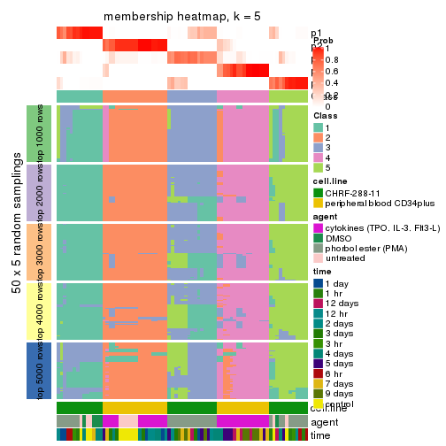</p>

</div>
<div id='tab-CV-skmeans-membership-heatmap-5'>
<pre><code class="r">membership_heatmap(res, k = 6)
</code></pre>

<p></p>

</div>
</div>

As soon as we have had the classes for columns, we can look for signatures
which are significantly different between classes which can be candidate marks
for certain classes. Following are the heatmaps for signatures.


Signature heatmaps where rows are scaled:


<script>
$( function() {
	$( '#tabs-CV-skmeans-get-signatures' ).tabs();
} );
</script>
<div id='tabs-CV-skmeans-get-signatures'>
<ul>
<li><a href='#tab-CV-skmeans-get-signatures-1'>k = 2</a></li>
<li><a href='#tab-CV-skmeans-get-signatures-2'>k = 3</a></li>
<li><a href='#tab-CV-skmeans-get-signatures-3'>k = 4</a></li>
<li><a href='#tab-CV-skmeans-get-signatures-4'>k = 5</a></li>
<li><a href='#tab-CV-skmeans-get-signatures-5'>k = 6</a></li>
</ul>
<div id='tab-CV-skmeans-get-signatures-1'>
<pre><code class="r">get_signatures(res, k = 2)
</code></pre>

<p></p>

</div>
<div id='tab-CV-skmeans-get-signatures-2'>
<pre><code class="r">get_signatures(res, k = 3)
</code></pre>

<p></p>

</div>
<div id='tab-CV-skmeans-get-signatures-3'>
<pre><code class="r">get_signatures(res, k = 4)
</code></pre>

<p></p>

</div>
<div id='tab-CV-skmeans-get-signatures-4'>
<pre><code class="r">get_signatures(res, k = 5)
</code></pre>

<p></p>

</div>
<div id='tab-CV-skmeans-get-signatures-5'>
<pre><code class="r">get_signatures(res, k = 6)
</code></pre>

<p></p>

</div>
</div>


Signature heatmaps where rows are not scaled:


<script>
$( function() {
	$( '#tabs-CV-skmeans-get-signatures-no-scale' ).tabs();
} );
</script>
<div id='tabs-CV-skmeans-get-signatures-no-scale'>
<ul>
<li><a href='#tab-CV-skmeans-get-signatures-no-scale-1'>k = 2</a></li>
<li><a href='#tab-CV-skmeans-get-signatures-no-scale-2'>k = 3</a></li>
<li><a href='#tab-CV-skmeans-get-signatures-no-scale-3'>k = 4</a></li>
<li><a href='#tab-CV-skmeans-get-signatures-no-scale-4'>k = 5</a></li>
<li><a href='#tab-CV-skmeans-get-signatures-no-scale-5'>k = 6</a></li>
</ul>
<div id='tab-CV-skmeans-get-signatures-no-scale-1'>
<pre><code class="r">get_signatures(res, k = 2, scale_rows = FALSE)
</code></pre>

<p></p>

</div>
<div id='tab-CV-skmeans-get-signatures-no-scale-2'>
<pre><code class="r">get_signatures(res, k = 3, scale_rows = FALSE)
</code></pre>

<p></p>

</div>
<div id='tab-CV-skmeans-get-signatures-no-scale-3'>
<pre><code class="r">get_signatures(res, k = 4, scale_rows = FALSE)
</code></pre>

<p></p>

</div>
<div id='tab-CV-skmeans-get-signatures-no-scale-4'>
<pre><code class="r">get_signatures(res, k = 5, scale_rows = FALSE)
</code></pre>

<p></p>

</div>
<div id='tab-CV-skmeans-get-signatures-no-scale-5'>
<pre><code class="r">get_signatures(res, k = 6, scale_rows = FALSE)
</code></pre>

<p></p>

</div>
</div>


Compare the overlap of signatures from different k:

```r
compare_signatures(res)
```


`get_signature()` returns a data frame invisibly. TO get the list of signatures, the function
call should be assigned to a variable explicitly. In following code, if `plot` argument is set
to `FALSE`, no heatmap is plotted while only the differential analysis is performed.

```r
# code only for demonstration
tb = get_signature(res, k = ..., plot = FALSE)
```

An example of the output of `tb` is:

```
#>   which_row         fdr    mean_1    mean_2 scaled_mean_1 scaled_mean_2 km
#> 1        38 0.042760348  8.373488  9.131774    -0.5533452     0.5164555  1
#> 2        40 0.018707592  7.106213  8.469186    -0.6173731     0.5762149  1
#> 3        55 0.019134737 10.221463 11.207825    -0.6159697     0.5749050  1
#> 4        59 0.006059896  5.921854  7.869574    -0.6899429     0.6439467  1
#> 5        60 0.018055526  8.928898 10.211722    -0.6204761     0.5791110  1
#> 6        98 0.009384629 15.714769 14.887706     0.6635654    -0.6193277  2
...
```

The columns in `tb` are:

1. `which_row`: row indices corresponding to the input matrix.
2. `fdr`: FDR for the differential test. 
3. `mean_x`: The mean value in group x.
4. `scaled_mean_x`: The mean value in group x after rows are scaled.
5. `km`: Row groups if k-means clustering is applied to rows.


UMAP plot which shows how samples are separated.


<script>
$( function() {
	$( '#tabs-CV-skmeans-dimension-reduction' ).tabs();
} );
</script>
<div id='tabs-CV-skmeans-dimension-reduction'>
<ul>
<li><a href='#tab-CV-skmeans-dimension-reduction-1'>k = 2</a></li>
<li><a href='#tab-CV-skmeans-dimension-reduction-2'>k = 3</a></li>
<li><a href='#tab-CV-skmeans-dimension-reduction-3'>k = 4</a></li>
<li><a href='#tab-CV-skmeans-dimension-reduction-4'>k = 5</a></li>
<li><a href='#tab-CV-skmeans-dimension-reduction-5'>k = 6</a></li>
</ul>
<div id='tab-CV-skmeans-dimension-reduction-1'>
<pre><code class="r">dimension_reduction(res, k = 2, method = &quot;UMAP&quot;)
</code></pre>

<p></p>

</div>
<div id='tab-CV-skmeans-dimension-reduction-2'>
<pre><code class="r">dimension_reduction(res, k = 3, method = &quot;UMAP&quot;)
</code></pre>

<p></p>

</div>
<div id='tab-CV-skmeans-dimension-reduction-3'>
<pre><code class="r">dimension_reduction(res, k = 4, method = &quot;UMAP&quot;)
</code></pre>

<p></p>

</div>
<div id='tab-CV-skmeans-dimension-reduction-4'>
<pre><code class="r">dimension_reduction(res, k = 5, method = &quot;UMAP&quot;)
</code></pre>

<p>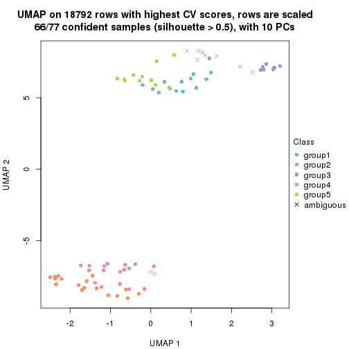</p>

</div>
<div id='tab-CV-skmeans-dimension-reduction-5'>
<pre><code class="r">dimension_reduction(res, k = 6, method = &quot;UMAP&quot;)
</code></pre>

<p>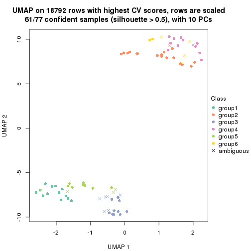</p>

</div>
</div>


Following heatmap shows how subgroups are split when increasing `k`:

```r
collect_classes(res)
```


Test correlation between subgroups and known annotations. If the known
annotation is numeric, one-way ANOVA test is applied, and if the known
annotation is discrete, chi-squared contingency table test is applied.

```r
test_to_known_factors(res)
```

```
#>             n cell.line(p) agent(p) time(p) k
#> CV:skmeans 76     2.11e-17 4.87e-14 0.42960 2
#> CV:skmeans 77     1.90e-17 7.46e-13 0.65729 3
#> CV:skmeans 77     1.35e-16 8.44e-13 0.06074 4
#> CV:skmeans 66     1.58e-13 4.68e-11 0.00313 5
#> CV:skmeans 61     7.55e-12 1.62e-09 0.00709 6
```


If matrix rows can be associated to genes, consider to use `GO_Enrichment(res,
...)` to perform function enrichment for the signature genes.


 

---------------------------------------------------


### CV:pam*


The object with results only for a single top-value method and a single partition method 
can be extracted as:

```r
res = res_list["CV", "pam"]
# you can also extract it by
# res = res_list["CV:pam"]
```

A summary of `res` and all the functions that can be applied to it:

```r
res
```

```
#> A 'ConsensusPartition' object with k = 2, 3, 4, 5, 6.
#>   On a matrix with 18792 rows and 77 columns.
#>   Top rows (1000, 2000, 3000, 4000, 5000) are extracted by 'CV' method.
#>   Subgroups are detected by 'pam' method.
#>   Performed in total 1250 partitions by row resampling.
#>   Best k for subgroups seems to be 2.
#> 
#> Following methods can be applied to this 'ConsensusPartition' object:
#>  [1] "cola_report"             "collect_classes"         "collect_plots"          
#>  [4] "collect_stats"           "colnames"                "compare_signatures"     
#>  [7] "consensus_heatmap"       "dimension_reduction"     "functional_enrichment"  
#> [10] "get_anno_col"            "get_anno"                "get_classes"            
#> [13] "get_consensus"           "get_matrix"              "get_membership"         
#> [16] "get_param"               "get_signatures"          "get_stats"              
#> [19] "is_best_k"               "is_stable_k"             "membership_heatmap"     
#> [22] "ncol"                    "nrow"                    "plot_ecdf"              
#> [25] "rownames"                "select_partition_number" "show"                   
#> [28] "suggest_best_k"          "test_to_known_factors"
```

`collect_plots()` function collects all the plots made from `res` for all `k` (number of partitions)
into one single page to provide an easy and fast comparison between different `k`.

```r
collect_plots(res)
```


The plots are:

- The first row: a plot of the ECDF (Empirical cumulative distribution
  function) curves of the consensus matrix for each `k` and the heatmap of
  predicted classes for each `k`.
- The second row: heatmaps of the consensus matrix for each `k`.
- The third row: heatmaps of the membership matrix for each `k`.
- The fouth row: heatmaps of the signatures for each `k`.

All the plots in panels can be made by individual functions and they are
plotted later in this section.

`select_partition_number()` produces several plots showing different
statistics for choosing "optimized" `k`. There are following statistics:

- ECDF curves of the consensus matrix for each `k`;
- 1-PAC. [The PAC
  score](https://en.wikipedia.org/wiki/Consensus_clustering#Over-interpretation_potential_of_consensus_clustering)
  measures the proportion of the ambiguous subgrouping.
- Mean silhouette score.
- Concordance. The mean probability of fiting the consensus class ids in all
  partitions.
- Area increased. Denote $A_k$ as the area under the ECDF curve for current
  `k`, the area increased is defined as $A_k - A_{k-1}$.
- Rand index. The percent of pairs of samples that are both in a same cluster
  or both are not in a same cluster in the partition of k and k-1.
- Jaccard index. The ratio of pairs of samples are both in a same cluster in
  the partition of k and k-1 and the pairs of samples are both in a same
  cluster in the partition k or k-1.

The detailed explanations of these statistics can be found in [the cola
vignette](http://bioconductor.org/packages/devel/bioc/vignettes/cola/inst/doc/cola.html#toc_13).

Generally speaking, lower PAC score, higher mean silhouette score or higher
concordance corresponds to better partition. Rand index and Jaccard index
measure how similar the current partition is compared to partition with `k-1`.
If they are too similar, we won't accept `k` is better than `k-1`.

```r
select_partition_number(res)
```


The numeric values for all these statistics can be obtained by `get_stats()`.

```r
get_stats(res)
```

```
#>   k 1-PAC mean_silhouette concordance area_increased  Rand Jaccard
#> 2 2 0.946           0.936       0.974         0.5010 0.496   0.496
#> 3 3 0.678           0.824       0.866         0.2799 0.857   0.712
#> 4 4 0.794           0.704       0.877         0.1699 0.859   0.621
#> 5 5 0.786           0.671       0.840         0.0545 0.933   0.744
#> 6 6 0.796           0.741       0.847         0.0394 0.934   0.703
```

`suggest_best_k()` suggests the best $k$ based on these statistics. The rules are as follows:

- All $k$ with Jaccard index larger than 0.95 are removed because the increase of
  the partition number does not provides enough extra information. If all $k$ are removed,
  the best $k$ is assigned by `NA`.
- For $k$ with 1-PAC larger than 0.9, the maximal $k$ is taken as the "best k". Other $k$ is called "optional k".
- If it does not fit the second rule. The $k$ with the highest vote of highest
  1-PAC, mean silhouette and concordance is taken as the "best k".

```r
suggest_best_k(res)
```

```
#> [1] 2
```


Following shows the table of the partitions (You need to click the **show/hide
code output** link to see it). The membership matrix (columns with name `p*`)
is inferred by
[`clue::cl_consensus()`](https://www.rdocumentation.org/link/cl_consensus?package=clue)
function with the `SE` method. Basically the value in the membership matrix
represents the probability to belong to a certain group. The finall class
label for an item is determined with the group with highest probability it
belongs to.

In `get_classes()` function, the entropy is calculated from the membership
matrix and the silhouette score is calculated from the consensus matrix.


<script>
$( function() {
	$( '#tabs-CV-pam-get-classes' ).tabs();
} );
</script>
<div id='tabs-CV-pam-get-classes'>
<ul>
<li><a href='#tab-CV-pam-get-classes-1'>k = 2</a></li>
<li><a href='#tab-CV-pam-get-classes-2'>k = 3</a></li>
<li><a href='#tab-CV-pam-get-classes-3'>k = 4</a></li>
<li><a href='#tab-CV-pam-get-classes-4'>k = 5</a></li>
<li><a href='#tab-CV-pam-get-classes-5'>k = 6</a></li>
</ul>

<div id='tab-CV-pam-get-classes-1'>
<p><a id='tab-CV-pam-get-classes-1-a' style='color:#0366d6' href='#'>show/hide code output</a></p>
<pre><code class="r">cbind(get_classes(res, k = 2), get_membership(res, k = 2))
</code></pre>

<pre><code>#&gt;          class entropy silhouette    p1    p2
#&gt; GSM87962     1  0.0000     0.9911 1.000 0.000
#&gt; GSM87963     1  0.0000     0.9911 1.000 0.000
#&gt; GSM87983     1  0.0000     0.9911 1.000 0.000
#&gt; GSM87984     1  0.0000     0.9911 1.000 0.000
#&gt; GSM87961     1  0.0000     0.9911 1.000 0.000
#&gt; GSM87970     1  0.0000     0.9911 1.000 0.000
#&gt; GSM87971     1  0.8499     0.5874 0.724 0.276
#&gt; GSM87990     1  0.0000     0.9911 1.000 0.000
#&gt; GSM87991     1  0.0000     0.9911 1.000 0.000
#&gt; GSM87974     1  0.0000     0.9911 1.000 0.000
#&gt; GSM87994     1  0.0000     0.9911 1.000 0.000
#&gt; GSM87978     1  0.0000     0.9911 1.000 0.000
#&gt; GSM87979     1  0.0376     0.9874 0.996 0.004
#&gt; GSM87998     1  0.0000     0.9911 1.000 0.000
#&gt; GSM87999     1  0.0000     0.9911 1.000 0.000
#&gt; GSM87968     1  0.1184     0.9757 0.984 0.016
#&gt; GSM87987     1  0.0000     0.9911 1.000 0.000
#&gt; GSM87969     1  0.0000     0.9911 1.000 0.000
#&gt; GSM87988     1  0.0000     0.9911 1.000 0.000
#&gt; GSM87989     1  0.0000     0.9911 1.000 0.000
#&gt; GSM87972     1  0.0000     0.9911 1.000 0.000
#&gt; GSM87992     1  0.0000     0.9911 1.000 0.000
#&gt; GSM87973     1  0.0000     0.9911 1.000 0.000
#&gt; GSM87993     1  0.0000     0.9911 1.000 0.000
#&gt; GSM87975     1  0.0000     0.9911 1.000 0.000
#&gt; GSM87995     1  0.0000     0.9911 1.000 0.000
#&gt; GSM87976     1  0.0000     0.9911 1.000 0.000
#&gt; GSM87977     1  0.0000     0.9911 1.000 0.000
#&gt; GSM87996     1  0.0000     0.9911 1.000 0.000
#&gt; GSM87997     1  0.0000     0.9911 1.000 0.000
#&gt; GSM87980     1  0.0000     0.9911 1.000 0.000
#&gt; GSM88000     1  0.0000     0.9911 1.000 0.000
#&gt; GSM87981     1  0.0000     0.9911 1.000 0.000
#&gt; GSM87982     1  0.0000     0.9911 1.000 0.000
#&gt; GSM88001     1  0.0000     0.9911 1.000 0.000
#&gt; GSM87967     1  0.0000     0.9911 1.000 0.000
#&gt; GSM87964     1  0.2236     0.9546 0.964 0.036
#&gt; GSM87965     1  0.0000     0.9911 1.000 0.000
#&gt; GSM87966     1  0.0000     0.9911 1.000 0.000
#&gt; GSM87985     1  0.0000     0.9911 1.000 0.000
#&gt; GSM87986     1  0.0000     0.9911 1.000 0.000
#&gt; GSM88004     2  0.0000     0.9498 0.000 1.000
#&gt; GSM88015     2  0.0000     0.9498 0.000 1.000
#&gt; GSM88005     2  0.0000     0.9498 0.000 1.000
#&gt; GSM88006     2  0.0000     0.9498 0.000 1.000
#&gt; GSM88016     2  0.0000     0.9498 0.000 1.000
#&gt; GSM88007     2  0.0000     0.9498 0.000 1.000
#&gt; GSM88017     2  0.0000     0.9498 0.000 1.000
#&gt; GSM88029     2  0.0000     0.9498 0.000 1.000
#&gt; GSM88008     2  0.0000     0.9498 0.000 1.000
#&gt; GSM88009     2  0.0000     0.9498 0.000 1.000
#&gt; GSM88018     2  0.0000     0.9498 0.000 1.000
#&gt; GSM88024     2  0.0000     0.9498 0.000 1.000
#&gt; GSM88030     2  0.0938     0.9411 0.012 0.988
#&gt; GSM88036     2  0.2603     0.9151 0.044 0.956
#&gt; GSM88010     2  0.0000     0.9498 0.000 1.000
#&gt; GSM88011     2  0.0000     0.9498 0.000 1.000
#&gt; GSM88019     2  0.0000     0.9498 0.000 1.000
#&gt; GSM88027     2  0.0000     0.9498 0.000 1.000
#&gt; GSM88031     2  0.0000     0.9498 0.000 1.000
#&gt; GSM88012     2  0.0000     0.9498 0.000 1.000
#&gt; GSM88020     2  0.8267     0.6630 0.260 0.740
#&gt; GSM88032     2  0.9996     0.0701 0.488 0.512
#&gt; GSM88037     2  0.9170     0.5154 0.332 0.668
#&gt; GSM88013     2  0.0000     0.9498 0.000 1.000
#&gt; GSM88021     2  0.8608     0.6246 0.284 0.716
#&gt; GSM88025     2  0.0000     0.9498 0.000 1.000
#&gt; GSM88033     2  0.0000     0.9498 0.000 1.000
#&gt; GSM88014     2  0.0000     0.9498 0.000 1.000
#&gt; GSM88022     2  0.0000     0.9498 0.000 1.000
#&gt; GSM88034     2  0.8443     0.6450 0.272 0.728
#&gt; GSM88002     2  0.0000     0.9498 0.000 1.000
#&gt; GSM88003     2  0.0000     0.9498 0.000 1.000
#&gt; GSM88023     2  0.0000     0.9498 0.000 1.000
#&gt; GSM88026     2  0.0000     0.9498 0.000 1.000
#&gt; GSM88028     2  0.0000     0.9498 0.000 1.000
#&gt; GSM88035     2  0.0000     0.9498 0.000 1.000
</code></pre>

<script>
$('#tab-CV-pam-get-classes-1-a').parent().next().next().hide();
$('#tab-CV-pam-get-classes-1-a').click(function(){
  $('#tab-CV-pam-get-classes-1-a').parent().next().next().toggle();
  return(false);
});
</script>
</div>

<div id='tab-CV-pam-get-classes-2'>
<p><a id='tab-CV-pam-get-classes-2-a' style='color:#0366d6' href='#'>show/hide code output</a></p>
<pre><code class="r">cbind(get_classes(res, k = 3), get_membership(res, k = 3))
</code></pre>

<pre><code>#&gt;          class entropy silhouette    p1    p2    p3
#&gt; GSM87962     1  0.0592      0.814 0.988 0.000 0.012
#&gt; GSM87963     1  0.0592      0.814 0.988 0.000 0.012
#&gt; GSM87983     3  0.6140      0.593 0.404 0.000 0.596
#&gt; GSM87984     1  0.5254      0.505 0.736 0.000 0.264
#&gt; GSM87961     1  0.0000      0.820 1.000 0.000 0.000
#&gt; GSM87970     1  0.0000      0.820 1.000 0.000 0.000
#&gt; GSM87971     1  0.4702      0.589 0.788 0.212 0.000
#&gt; GSM87990     1  0.0000      0.820 1.000 0.000 0.000
#&gt; GSM87991     1  0.6308     -0.371 0.508 0.000 0.492
#&gt; GSM87974     1  0.0000      0.820 1.000 0.000 0.000
#&gt; GSM87994     3  0.4452      0.949 0.192 0.000 0.808
#&gt; GSM87978     1  0.0000      0.820 1.000 0.000 0.000
#&gt; GSM87979     1  0.0000      0.820 1.000 0.000 0.000
#&gt; GSM87998     3  0.4452      0.949 0.192 0.000 0.808
#&gt; GSM87999     3  0.4452      0.949 0.192 0.000 0.808
#&gt; GSM87968     1  0.0000      0.820 1.000 0.000 0.000
#&gt; GSM87987     1  0.3752      0.701 0.856 0.000 0.144
#&gt; GSM87969     1  0.0000      0.820 1.000 0.000 0.000
#&gt; GSM87988     3  0.4452      0.949 0.192 0.000 0.808
#&gt; GSM87989     3  0.4452      0.949 0.192 0.000 0.808
#&gt; GSM87972     3  0.5760      0.738 0.328 0.000 0.672
#&gt; GSM87992     3  0.4452      0.949 0.192 0.000 0.808
#&gt; GSM87973     3  0.4605      0.938 0.204 0.000 0.796
#&gt; GSM87993     3  0.4452      0.949 0.192 0.000 0.808
#&gt; GSM87975     1  0.5058      0.578 0.756 0.000 0.244
#&gt; GSM87995     3  0.4452      0.949 0.192 0.000 0.808
#&gt; GSM87976     1  0.4555      0.634 0.800 0.000 0.200
#&gt; GSM87977     1  0.5678      0.450 0.684 0.000 0.316
#&gt; GSM87996     3  0.4452      0.949 0.192 0.000 0.808
#&gt; GSM87997     3  0.4452      0.949 0.192 0.000 0.808
#&gt; GSM87980     1  0.5733      0.413 0.676 0.000 0.324
#&gt; GSM88000     3  0.4452      0.949 0.192 0.000 0.808
#&gt; GSM87981     3  0.4605      0.938 0.204 0.000 0.796
#&gt; GSM87982     3  0.4605      0.938 0.204 0.000 0.796
#&gt; GSM88001     3  0.4452      0.949 0.192 0.000 0.808
#&gt; GSM87967     3  0.4452      0.949 0.192 0.000 0.808
#&gt; GSM87964     1  0.0000      0.820 1.000 0.000 0.000
#&gt; GSM87965     1  0.0237      0.818 0.996 0.000 0.004
#&gt; GSM87966     1  0.6308     -0.371 0.508 0.000 0.492
#&gt; GSM87985     1  0.0000      0.820 1.000 0.000 0.000
#&gt; GSM87986     3  0.6095      0.617 0.392 0.000 0.608
#&gt; GSM88004     2  0.0000      0.925 0.000 1.000 0.000
#&gt; GSM88015     2  0.0000      0.925 0.000 1.000 0.000
#&gt; GSM88005     2  0.0000      0.925 0.000 1.000 0.000
#&gt; GSM88006     2  0.0000      0.925 0.000 1.000 0.000
#&gt; GSM88016     2  0.0000      0.925 0.000 1.000 0.000
#&gt; GSM88007     2  0.0000      0.925 0.000 1.000 0.000
#&gt; GSM88017     2  0.0000      0.925 0.000 1.000 0.000
#&gt; GSM88029     2  0.0424      0.924 0.000 0.992 0.008
#&gt; GSM88008     2  0.0000      0.925 0.000 1.000 0.000
#&gt; GSM88009     2  0.0000      0.925 0.000 1.000 0.000
#&gt; GSM88018     2  0.0000      0.925 0.000 1.000 0.000
#&gt; GSM88024     2  0.0000      0.925 0.000 1.000 0.000
#&gt; GSM88030     2  0.4452      0.890 0.000 0.808 0.192
#&gt; GSM88036     2  0.0237      0.924 0.000 0.996 0.004
#&gt; GSM88010     2  0.0000      0.925 0.000 1.000 0.000
#&gt; GSM88011     2  0.4399      0.891 0.000 0.812 0.188
#&gt; GSM88019     2  0.4399      0.891 0.000 0.812 0.188
#&gt; GSM88027     2  0.4399      0.891 0.000 0.812 0.188
#&gt; GSM88031     2  0.4452      0.890 0.000 0.808 0.192
#&gt; GSM88012     2  0.0000      0.925 0.000 1.000 0.000
#&gt; GSM88020     2  0.7605      0.776 0.124 0.684 0.192
#&gt; GSM88032     2  0.4452      0.890 0.000 0.808 0.192
#&gt; GSM88037     2  0.4452      0.890 0.000 0.808 0.192
#&gt; GSM88013     2  0.4452      0.890 0.000 0.808 0.192
#&gt; GSM88021     2  0.4808      0.887 0.008 0.804 0.188
#&gt; GSM88025     2  0.4452      0.890 0.000 0.808 0.192
#&gt; GSM88033     2  0.4452      0.890 0.000 0.808 0.192
#&gt; GSM88014     2  0.4452      0.890 0.000 0.808 0.192
#&gt; GSM88022     2  0.4399      0.891 0.000 0.812 0.188
#&gt; GSM88034     2  0.7059      0.813 0.092 0.716 0.192
#&gt; GSM88002     2  0.0000      0.925 0.000 1.000 0.000
#&gt; GSM88003     2  0.0000      0.925 0.000 1.000 0.000
#&gt; GSM88023     2  0.0000      0.925 0.000 1.000 0.000
#&gt; GSM88026     2  0.0000      0.925 0.000 1.000 0.000
#&gt; GSM88028     2  0.0000      0.925 0.000 1.000 0.000
#&gt; GSM88035     2  0.0000      0.925 0.000 1.000 0.000
</code></pre>

<script>
$('#tab-CV-pam-get-classes-2-a').parent().next().next().hide();
$('#tab-CV-pam-get-classes-2-a').click(function(){
  $('#tab-CV-pam-get-classes-2-a').parent().next().next().toggle();
  return(false);
});
</script>
</div>

<div id='tab-CV-pam-get-classes-3'>
<p><a id='tab-CV-pam-get-classes-3-a' style='color:#0366d6' href='#'>show/hide code output</a></p>
<pre><code class="r">cbind(get_classes(res, k = 4), get_membership(res, k = 4))
</code></pre>

<pre><code>#&gt;          class entropy silhouette    p1    p2    p3    p4
#&gt; GSM87962     1  0.0592     0.8735 0.984 0.000 0.016 0.000
#&gt; GSM87963     1  0.0592     0.8735 0.984 0.000 0.016 0.000
#&gt; GSM87983     3  0.4855     0.4431 0.400 0.000 0.600 0.000
#&gt; GSM87984     1  0.4072     0.5620 0.748 0.000 0.252 0.000
#&gt; GSM87961     1  0.0000     0.8806 1.000 0.000 0.000 0.000
#&gt; GSM87970     1  0.0000     0.8806 1.000 0.000 0.000 0.000
#&gt; GSM87971     1  0.1637     0.8302 0.940 0.060 0.000 0.000
#&gt; GSM87990     1  0.0188     0.8793 0.996 0.000 0.004 0.000
#&gt; GSM87991     3  0.4967     0.3552 0.452 0.000 0.548 0.000
#&gt; GSM87974     1  0.0000     0.8806 1.000 0.000 0.000 0.000
#&gt; GSM87994     3  0.3486     0.7333 0.188 0.000 0.812 0.000
#&gt; GSM87978     1  0.0000     0.8806 1.000 0.000 0.000 0.000
#&gt; GSM87979     1  0.0000     0.8806 1.000 0.000 0.000 0.000
#&gt; GSM87998     3  0.3486     0.7333 0.188 0.000 0.812 0.000
#&gt; GSM87999     3  0.3486     0.7333 0.188 0.000 0.812 0.000
#&gt; GSM87968     1  0.0000     0.8806 1.000 0.000 0.000 0.000
#&gt; GSM87987     1  0.2281     0.8069 0.904 0.000 0.096 0.000
#&gt; GSM87969     1  0.0000     0.8806 1.000 0.000 0.000 0.000
#&gt; GSM87988     3  0.0000     0.8243 0.000 0.000 1.000 0.000
#&gt; GSM87989     3  0.0188     0.8242 0.004 0.000 0.996 0.000
#&gt; GSM87972     3  0.2149     0.7739 0.088 0.000 0.912 0.000
#&gt; GSM87992     3  0.0000     0.8243 0.000 0.000 1.000 0.000
#&gt; GSM87973     3  0.0592     0.8200 0.016 0.000 0.984 0.000
#&gt; GSM87993     3  0.0188     0.8242 0.004 0.000 0.996 0.000
#&gt; GSM87975     1  0.4955     0.2502 0.556 0.000 0.444 0.000
#&gt; GSM87995     3  0.0000     0.8243 0.000 0.000 1.000 0.000
#&gt; GSM87976     1  0.4817     0.3735 0.612 0.000 0.388 0.000
#&gt; GSM87977     1  0.4967     0.2519 0.548 0.000 0.452 0.000
#&gt; GSM87996     3  0.0000     0.8243 0.000 0.000 1.000 0.000
#&gt; GSM87997     3  0.0188     0.8242 0.004 0.000 0.996 0.000
#&gt; GSM87980     3  0.4972     0.0031 0.456 0.000 0.544 0.000
#&gt; GSM88000     3  0.0188     0.8242 0.004 0.000 0.996 0.000
#&gt; GSM87981     3  0.0592     0.8200 0.016 0.000 0.984 0.000
#&gt; GSM87982     3  0.0592     0.8200 0.016 0.000 0.984 0.000
#&gt; GSM88001     3  0.0000     0.8243 0.000 0.000 1.000 0.000
#&gt; GSM87967     3  0.3444     0.7395 0.184 0.000 0.816 0.000
#&gt; GSM87964     1  0.0000     0.8806 1.000 0.000 0.000 0.000
#&gt; GSM87965     1  0.0469     0.8759 0.988 0.000 0.012 0.000
#&gt; GSM87966     3  0.4967     0.3552 0.452 0.000 0.548 0.000
#&gt; GSM87985     1  0.0188     0.8793 0.996 0.000 0.004 0.000
#&gt; GSM87986     3  0.4817     0.4636 0.388 0.000 0.612 0.000
#&gt; GSM88004     2  0.4776     0.8635 0.000 0.624 0.000 0.376
#&gt; GSM88015     2  0.4776     0.8635 0.000 0.624 0.000 0.376
#&gt; GSM88005     2  0.4776     0.8635 0.000 0.624 0.000 0.376
#&gt; GSM88006     2  0.4776     0.8635 0.000 0.624 0.000 0.376
#&gt; GSM88016     2  0.4776     0.8635 0.000 0.624 0.000 0.376
#&gt; GSM88007     2  0.4776     0.8635 0.000 0.624 0.000 0.376
#&gt; GSM88017     2  0.4776     0.8635 0.000 0.624 0.000 0.376
#&gt; GSM88029     2  0.2149     0.1397 0.000 0.912 0.000 0.088
#&gt; GSM88008     2  0.4776     0.8635 0.000 0.624 0.000 0.376
#&gt; GSM88009     2  0.4776     0.8635 0.000 0.624 0.000 0.376
#&gt; GSM88018     2  0.4776     0.8635 0.000 0.624 0.000 0.376
#&gt; GSM88024     2  0.4776     0.8635 0.000 0.624 0.000 0.376
#&gt; GSM88030     2  0.4916    -0.6164 0.000 0.576 0.000 0.424
#&gt; GSM88036     2  0.0469     0.3045 0.000 0.988 0.000 0.012
#&gt; GSM88010     2  0.4776     0.8635 0.000 0.624 0.000 0.376
#&gt; GSM88011     4  0.0817     0.5156 0.000 0.024 0.000 0.976
#&gt; GSM88019     4  0.0817     0.5156 0.000 0.024 0.000 0.976
#&gt; GSM88027     4  0.0817     0.5156 0.000 0.024 0.000 0.976
#&gt; GSM88031     4  0.4776     0.7909 0.000 0.376 0.000 0.624
#&gt; GSM88012     2  0.4776     0.8635 0.000 0.624 0.000 0.376
#&gt; GSM88020     2  0.6387    -0.6772 0.064 0.492 0.000 0.444
#&gt; GSM88032     4  0.4776     0.7909 0.000 0.376 0.000 0.624
#&gt; GSM88037     4  0.4776     0.7909 0.000 0.376 0.000 0.624
#&gt; GSM88013     4  0.4776     0.7909 0.000 0.376 0.000 0.624
#&gt; GSM88021     4  0.0895     0.5177 0.004 0.020 0.000 0.976
#&gt; GSM88025     4  0.4776     0.7909 0.000 0.376 0.000 0.624
#&gt; GSM88033     4  0.4776     0.7909 0.000 0.376 0.000 0.624
#&gt; GSM88014     4  0.4776     0.7909 0.000 0.376 0.000 0.624
#&gt; GSM88022     4  0.0817     0.5156 0.000 0.024 0.000 0.976
#&gt; GSM88034     4  0.4776     0.7909 0.000 0.376 0.000 0.624
#&gt; GSM88002     2  0.4776     0.8635 0.000 0.624 0.000 0.376
#&gt; GSM88003     2  0.4776     0.8635 0.000 0.624 0.000 0.376
#&gt; GSM88023     2  0.4776     0.8635 0.000 0.624 0.000 0.376
#&gt; GSM88026     2  0.4776     0.8635 0.000 0.624 0.000 0.376
#&gt; GSM88028     2  0.4776     0.8635 0.000 0.624 0.000 0.376
#&gt; GSM88035     2  0.4776     0.8635 0.000 0.624 0.000 0.376
</code></pre>

<script>
$('#tab-CV-pam-get-classes-3-a').parent().next().next().hide();
$('#tab-CV-pam-get-classes-3-a').click(function(){
  $('#tab-CV-pam-get-classes-3-a').parent().next().next().toggle();
  return(false);
});
</script>
</div>

<div id='tab-CV-pam-get-classes-4'>
<p><a id='tab-CV-pam-get-classes-4-a' style='color:#0366d6' href='#'>show/hide code output</a></p>
<pre><code class="r">cbind(get_classes(res, k = 5), get_membership(res, k = 5))
</code></pre>

<pre><code>#&gt;          class entropy silhouette    p1    p2    p3    p4    p5
#&gt; GSM87962     5  0.4415     0.2575 0.444 0.000 0.004 0.000 0.552
#&gt; GSM87963     5  0.4415     0.2575 0.444 0.000 0.004 0.000 0.552
#&gt; GSM87983     5  0.4617     0.2811 0.012 0.000 0.436 0.000 0.552
#&gt; GSM87984     5  0.5838     0.4106 0.336 0.000 0.112 0.000 0.552
#&gt; GSM87961     1  0.4262    -0.0467 0.560 0.000 0.000 0.000 0.440
#&gt; GSM87970     1  0.0000     0.8161 1.000 0.000 0.000 0.000 0.000
#&gt; GSM87971     1  0.0000     0.8161 1.000 0.000 0.000 0.000 0.000
#&gt; GSM87990     1  0.3366     0.5879 0.784 0.000 0.004 0.000 0.212
#&gt; GSM87991     3  0.5092    -0.1206 0.036 0.000 0.524 0.000 0.440
#&gt; GSM87974     1  0.0000     0.8161 1.000 0.000 0.000 0.000 0.000
#&gt; GSM87994     3  0.3424     0.6040 0.000 0.000 0.760 0.000 0.240
#&gt; GSM87978     1  0.0000     0.8161 1.000 0.000 0.000 0.000 0.000
#&gt; GSM87979     1  0.0000     0.8161 1.000 0.000 0.000 0.000 0.000
#&gt; GSM87998     3  0.3109     0.6746 0.000 0.000 0.800 0.000 0.200
#&gt; GSM87999     3  0.3109     0.6677 0.000 0.000 0.800 0.000 0.200
#&gt; GSM87968     1  0.0000     0.8161 1.000 0.000 0.000 0.000 0.000
#&gt; GSM87987     1  0.2921     0.7016 0.856 0.000 0.020 0.000 0.124
#&gt; GSM87969     1  0.3039     0.6092 0.808 0.000 0.000 0.000 0.192
#&gt; GSM87988     3  0.0000     0.8554 0.000 0.000 1.000 0.000 0.000
#&gt; GSM87989     3  0.0162     0.8556 0.004 0.000 0.996 0.000 0.000
#&gt; GSM87972     3  0.2074     0.7751 0.104 0.000 0.896 0.000 0.000
#&gt; GSM87992     3  0.0000     0.8554 0.000 0.000 1.000 0.000 0.000
#&gt; GSM87973     3  0.0162     0.8556 0.004 0.000 0.996 0.000 0.000
#&gt; GSM87993     3  0.0162     0.8556 0.004 0.000 0.996 0.000 0.000
#&gt; GSM87975     1  0.3752     0.4003 0.708 0.000 0.292 0.000 0.000
#&gt; GSM87995     3  0.0000     0.8554 0.000 0.000 1.000 0.000 0.000
#&gt; GSM87976     1  0.0000     0.8161 1.000 0.000 0.000 0.000 0.000
#&gt; GSM87977     1  0.1117     0.7923 0.964 0.000 0.016 0.000 0.020
#&gt; GSM87996     3  0.0000     0.8554 0.000 0.000 1.000 0.000 0.000
#&gt; GSM87997     3  0.0162     0.8556 0.004 0.000 0.996 0.000 0.000
#&gt; GSM87980     3  0.4227     0.0742 0.420 0.000 0.580 0.000 0.000
#&gt; GSM88000     3  0.0162     0.8556 0.004 0.000 0.996 0.000 0.000
#&gt; GSM87981     3  0.1197     0.8267 0.048 0.000 0.952 0.000 0.000
#&gt; GSM87982     3  0.0162     0.8556 0.004 0.000 0.996 0.000 0.000
#&gt; GSM88001     3  0.0000     0.8554 0.000 0.000 1.000 0.000 0.000
#&gt; GSM87967     3  0.2763     0.7348 0.004 0.000 0.848 0.000 0.148
#&gt; GSM87964     1  0.0000     0.8161 1.000 0.000 0.000 0.000 0.000
#&gt; GSM87965     5  0.4415     0.2575 0.444 0.000 0.004 0.000 0.552
#&gt; GSM87966     5  0.4702     0.2804 0.016 0.000 0.432 0.000 0.552
#&gt; GSM87985     1  0.4410    -0.0614 0.556 0.000 0.004 0.000 0.440
#&gt; GSM87986     5  0.4273     0.2461 0.000 0.000 0.448 0.000 0.552
#&gt; GSM88004     2  0.0000     0.8252 0.000 1.000 0.000 0.000 0.000
#&gt; GSM88015     2  0.0000     0.8252 0.000 1.000 0.000 0.000 0.000
#&gt; GSM88005     2  0.0000     0.8252 0.000 1.000 0.000 0.000 0.000
#&gt; GSM88006     2  0.0000     0.8252 0.000 1.000 0.000 0.000 0.000
#&gt; GSM88016     2  0.0000     0.8252 0.000 1.000 0.000 0.000 0.000
#&gt; GSM88007     2  0.0000     0.8252 0.000 1.000 0.000 0.000 0.000
#&gt; GSM88017     2  0.0000     0.8252 0.000 1.000 0.000 0.000 0.000
#&gt; GSM88029     2  0.5559     0.6209 0.000 0.544 0.000 0.076 0.380
#&gt; GSM88008     2  0.0000     0.8252 0.000 1.000 0.000 0.000 0.000
#&gt; GSM88009     2  0.0000     0.8252 0.000 1.000 0.000 0.000 0.000
#&gt; GSM88018     2  0.0000     0.8252 0.000 1.000 0.000 0.000 0.000
#&gt; GSM88024     2  0.0000     0.8252 0.000 1.000 0.000 0.000 0.000
#&gt; GSM88030     4  0.4555     0.5870 0.000 0.200 0.000 0.732 0.068
#&gt; GSM88036     2  0.5449     0.3286 0.000 0.556 0.000 0.376 0.068
#&gt; GSM88010     2  0.0000     0.8252 0.000 1.000 0.000 0.000 0.000
#&gt; GSM88011     4  0.4126     0.6040 0.000 0.380 0.000 0.620 0.000
#&gt; GSM88019     4  0.4126     0.6040 0.000 0.380 0.000 0.620 0.000
#&gt; GSM88027     4  0.4126     0.6040 0.000 0.380 0.000 0.620 0.000
#&gt; GSM88031     4  0.0000     0.8010 0.000 0.000 0.000 1.000 0.000
#&gt; GSM88012     2  0.0000     0.8252 0.000 1.000 0.000 0.000 0.000
#&gt; GSM88020     4  0.4051     0.7143 0.020 0.096 0.000 0.816 0.068
#&gt; GSM88032     4  0.0000     0.8010 0.000 0.000 0.000 1.000 0.000
#&gt; GSM88037     4  0.0000     0.8010 0.000 0.000 0.000 1.000 0.000
#&gt; GSM88013     4  0.0404     0.7991 0.000 0.012 0.000 0.988 0.000
#&gt; GSM88021     4  0.4264     0.6052 0.004 0.376 0.000 0.620 0.000
#&gt; GSM88025     4  0.0000     0.8010 0.000 0.000 0.000 1.000 0.000
#&gt; GSM88033     4  0.0000     0.8010 0.000 0.000 0.000 1.000 0.000
#&gt; GSM88014     4  0.0000     0.8010 0.000 0.000 0.000 1.000 0.000
#&gt; GSM88022     4  0.4126     0.6040 0.000 0.380 0.000 0.620 0.000
#&gt; GSM88034     4  0.1544     0.7737 0.000 0.000 0.000 0.932 0.068
#&gt; GSM88002     2  0.4126     0.6890 0.000 0.620 0.000 0.000 0.380
#&gt; GSM88003     2  0.3949     0.7092 0.000 0.668 0.000 0.000 0.332
#&gt; GSM88023     2  0.4126     0.6890 0.000 0.620 0.000 0.000 0.380
#&gt; GSM88026     2  0.4126     0.6890 0.000 0.620 0.000 0.000 0.380
#&gt; GSM88028     2  0.4126     0.6890 0.000 0.620 0.000 0.000 0.380
#&gt; GSM88035     2  0.4126     0.6890 0.000 0.620 0.000 0.000 0.380
</code></pre>

<script>
$('#tab-CV-pam-get-classes-4-a').parent().next().next().hide();
$('#tab-CV-pam-get-classes-4-a').click(function(){
  $('#tab-CV-pam-get-classes-4-a').parent().next().next().toggle();
  return(false);
});
</script>
</div>

<div id='tab-CV-pam-get-classes-5'>
<p><a id='tab-CV-pam-get-classes-5-a' style='color:#0366d6' href='#'>show/hide code output</a></p>
<pre><code class="r">cbind(get_classes(res, k = 6), get_membership(res, k = 6))
</code></pre>

<pre><code>#&gt;          class entropy silhouette    p1    p2    p3    p4    p5    p6
#&gt; GSM87962     1   0.186      0.800 0.896 0.000 0.000 0.000 0.000 0.104
#&gt; GSM87963     1   0.186      0.800 0.896 0.000 0.000 0.000 0.000 0.104
#&gt; GSM87983     1   0.196      0.788 0.896 0.000 0.100 0.000 0.000 0.004
#&gt; GSM87984     1   0.202      0.802 0.896 0.000 0.008 0.000 0.000 0.096
#&gt; GSM87961     1   0.383      0.357 0.556 0.000 0.000 0.000 0.000 0.444
#&gt; GSM87970     6   0.000      0.876 0.000 0.000 0.000 0.000 0.000 1.000
#&gt; GSM87971     6   0.000      0.876 0.000 0.000 0.000 0.000 0.000 1.000
#&gt; GSM87990     6   0.337      0.494 0.292 0.000 0.000 0.000 0.000 0.708
#&gt; GSM87991     1   0.477      0.433 0.600 0.000 0.332 0.000 0.000 0.068
#&gt; GSM87974     6   0.000      0.876 0.000 0.000 0.000 0.000 0.000 1.000
#&gt; GSM87994     3   0.382      0.230 0.432 0.000 0.568 0.000 0.000 0.000
#&gt; GSM87978     6   0.000      0.876 0.000 0.000 0.000 0.000 0.000 1.000
#&gt; GSM87979     6   0.000      0.876 0.000 0.000 0.000 0.000 0.000 1.000
#&gt; GSM87998     3   0.279      0.711 0.200 0.000 0.800 0.000 0.000 0.000
#&gt; GSM87999     3   0.348      0.511 0.316 0.000 0.684 0.000 0.000 0.000
#&gt; GSM87968     6   0.000      0.876 0.000 0.000 0.000 0.000 0.000 1.000
#&gt; GSM87987     6   0.285      0.691 0.208 0.000 0.000 0.000 0.000 0.792
#&gt; GSM87969     6   0.308      0.616 0.240 0.000 0.000 0.000 0.000 0.760
#&gt; GSM87988     3   0.000      0.883 0.000 0.000 1.000 0.000 0.000 0.000
#&gt; GSM87989     3   0.000      0.883 0.000 0.000 1.000 0.000 0.000 0.000
#&gt; GSM87972     3   0.218      0.781 0.000 0.000 0.868 0.000 0.000 0.132
#&gt; GSM87992     3   0.000      0.883 0.000 0.000 1.000 0.000 0.000 0.000
#&gt; GSM87973     3   0.000      0.883 0.000 0.000 1.000 0.000 0.000 0.000
#&gt; GSM87993     3   0.000      0.883 0.000 0.000 1.000 0.000 0.000 0.000
#&gt; GSM87975     6   0.343      0.497 0.000 0.000 0.304 0.000 0.000 0.696
#&gt; GSM87995     3   0.000      0.883 0.000 0.000 1.000 0.000 0.000 0.000
#&gt; GSM87976     6   0.000      0.876 0.000 0.000 0.000 0.000 0.000 1.000
#&gt; GSM87977     6   0.139      0.833 0.068 0.000 0.000 0.000 0.000 0.932
#&gt; GSM87996     3   0.000      0.883 0.000 0.000 1.000 0.000 0.000 0.000
#&gt; GSM87997     3   0.000      0.883 0.000 0.000 1.000 0.000 0.000 0.000
#&gt; GSM87980     3   0.377      0.249 0.000 0.000 0.592 0.000 0.000 0.408
#&gt; GSM88000     3   0.000      0.883 0.000 0.000 1.000 0.000 0.000 0.000
#&gt; GSM87981     3   0.101      0.856 0.000 0.000 0.956 0.000 0.000 0.044
#&gt; GSM87982     3   0.000      0.883 0.000 0.000 1.000 0.000 0.000 0.000
#&gt; GSM88001     3   0.000      0.883 0.000 0.000 1.000 0.000 0.000 0.000
#&gt; GSM87967     3   0.234      0.764 0.148 0.000 0.852 0.000 0.000 0.000
#&gt; GSM87964     6   0.079      0.859 0.032 0.000 0.000 0.000 0.000 0.968
#&gt; GSM87965     1   0.186      0.800 0.896 0.000 0.000 0.000 0.000 0.104
#&gt; GSM87966     1   0.231      0.787 0.880 0.000 0.104 0.000 0.000 0.016
#&gt; GSM87985     1   0.366      0.524 0.636 0.000 0.000 0.000 0.000 0.364
#&gt; GSM87986     1   0.186      0.786 0.896 0.000 0.104 0.000 0.000 0.000
#&gt; GSM88004     2   0.371      0.818 0.000 0.620 0.000 0.000 0.380 0.000
#&gt; GSM88015     2   0.371      0.818 0.000 0.620 0.000 0.000 0.380 0.000
#&gt; GSM88005     2   0.371      0.818 0.000 0.620 0.000 0.000 0.380 0.000
#&gt; GSM88006     2   0.371      0.818 0.000 0.620 0.000 0.000 0.380 0.000
#&gt; GSM88016     2   0.371      0.818 0.000 0.620 0.000 0.000 0.380 0.000
#&gt; GSM88007     2   0.371      0.818 0.000 0.620 0.000 0.000 0.380 0.000
#&gt; GSM88017     2   0.371      0.818 0.000 0.620 0.000 0.000 0.380 0.000
#&gt; GSM88029     5   0.209      0.864 0.000 0.028 0.000 0.068 0.904 0.000
#&gt; GSM88008     2   0.371      0.818 0.000 0.620 0.000 0.000 0.380 0.000
#&gt; GSM88009     2   0.371      0.818 0.000 0.620 0.000 0.000 0.380 0.000
#&gt; GSM88018     2   0.371      0.818 0.000 0.620 0.000 0.000 0.380 0.000
#&gt; GSM88024     2   0.371      0.818 0.000 0.620 0.000 0.000 0.380 0.000
#&gt; GSM88030     2   0.511     -0.248 0.104 0.580 0.000 0.316 0.000 0.000
#&gt; GSM88036     2   0.505     -0.223 0.104 0.596 0.000 0.300 0.000 0.000
#&gt; GSM88010     2   0.371      0.818 0.000 0.620 0.000 0.000 0.380 0.000
#&gt; GSM88011     4   0.343      0.635 0.000 0.304 0.000 0.696 0.000 0.000
#&gt; GSM88019     4   0.343      0.635 0.000 0.304 0.000 0.696 0.000 0.000
#&gt; GSM88027     4   0.343      0.635 0.000 0.304 0.000 0.696 0.000 0.000
#&gt; GSM88031     4   0.000      0.777 0.000 0.000 0.000 1.000 0.000 0.000
#&gt; GSM88012     2   0.371      0.818 0.000 0.620 0.000 0.000 0.380 0.000
#&gt; GSM88020     4   0.550      0.441 0.104 0.380 0.000 0.508 0.000 0.008
#&gt; GSM88032     4   0.000      0.777 0.000 0.000 0.000 1.000 0.000 0.000
#&gt; GSM88037     4   0.000      0.777 0.000 0.000 0.000 1.000 0.000 0.000
#&gt; GSM88013     4   0.150      0.748 0.000 0.076 0.000 0.924 0.000 0.000
#&gt; GSM88021     4   0.395      0.644 0.028 0.276 0.000 0.696 0.000 0.000
#&gt; GSM88025     4   0.000      0.777 0.000 0.000 0.000 1.000 0.000 0.000
#&gt; GSM88033     4   0.000      0.777 0.000 0.000 0.000 1.000 0.000 0.000
#&gt; GSM88014     4   0.000      0.777 0.000 0.000 0.000 1.000 0.000 0.000
#&gt; GSM88022     4   0.343      0.635 0.000 0.304 0.000 0.696 0.000 0.000
#&gt; GSM88034     4   0.527      0.449 0.104 0.380 0.000 0.516 0.000 0.000
#&gt; GSM88002     5   0.000      0.964 0.000 0.000 0.000 0.000 1.000 0.000
#&gt; GSM88003     5   0.114      0.893 0.000 0.052 0.000 0.000 0.948 0.000
#&gt; GSM88023     5   0.000      0.964 0.000 0.000 0.000 0.000 1.000 0.000
#&gt; GSM88026     5   0.000      0.964 0.000 0.000 0.000 0.000 1.000 0.000
#&gt; GSM88028     5   0.000      0.964 0.000 0.000 0.000 0.000 1.000 0.000
#&gt; GSM88035     5   0.000      0.964 0.000 0.000 0.000 0.000 1.000 0.000
</code></pre>

<script>
$('#tab-CV-pam-get-classes-5-a').parent().next().next().hide();
$('#tab-CV-pam-get-classes-5-a').click(function(){
  $('#tab-CV-pam-get-classes-5-a').parent().next().next().toggle();
  return(false);
});
</script>
</div>
</div>

Heatmaps for the consensus matrix. It visualizes the probability of two
samples to be in a same group.


<script>
$( function() {
	$( '#tabs-CV-pam-consensus-heatmap' ).tabs();
} );
</script>
<div id='tabs-CV-pam-consensus-heatmap'>
<ul>
<li><a href='#tab-CV-pam-consensus-heatmap-1'>k = 2</a></li>
<li><a href='#tab-CV-pam-consensus-heatmap-2'>k = 3</a></li>
<li><a href='#tab-CV-pam-consensus-heatmap-3'>k = 4</a></li>
<li><a href='#tab-CV-pam-consensus-heatmap-4'>k = 5</a></li>
<li><a href='#tab-CV-pam-consensus-heatmap-5'>k = 6</a></li>
</ul>
<div id='tab-CV-pam-consensus-heatmap-1'>
<pre><code class="r">consensus_heatmap(res, k = 2)
</code></pre>

<p></p>

</div>
<div id='tab-CV-pam-consensus-heatmap-2'>
<pre><code class="r">consensus_heatmap(res, k = 3)
</code></pre>

<p></p>

</div>
<div id='tab-CV-pam-consensus-heatmap-3'>
<pre><code class="r">consensus_heatmap(res, k = 4)
</code></pre>

<p></p>

</div>
<div id='tab-CV-pam-consensus-heatmap-4'>
<pre><code class="r">consensus_heatmap(res, k = 5)
</code></pre>

<p></p>

</div>
<div id='tab-CV-pam-consensus-heatmap-5'>
<pre><code class="r">consensus_heatmap(res, k = 6)
</code></pre>

<p></p>

</div>
</div>

Heatmaps for the membership of samples in all partitions to see how consistent they are:


<script>
$( function() {
	$( '#tabs-CV-pam-membership-heatmap' ).tabs();
} );
</script>
<div id='tabs-CV-pam-membership-heatmap'>
<ul>
<li><a href='#tab-CV-pam-membership-heatmap-1'>k = 2</a></li>
<li><a href='#tab-CV-pam-membership-heatmap-2'>k = 3</a></li>
<li><a href='#tab-CV-pam-membership-heatmap-3'>k = 4</a></li>
<li><a href='#tab-CV-pam-membership-heatmap-4'>k = 5</a></li>
<li><a href='#tab-CV-pam-membership-heatmap-5'>k = 6</a></li>
</ul>
<div id='tab-CV-pam-membership-heatmap-1'>
<pre><code class="r">membership_heatmap(res, k = 2)
</code></pre>

<p></p>

</div>
<div id='tab-CV-pam-membership-heatmap-2'>
<pre><code class="r">membership_heatmap(res, k = 3)
</code></pre>

<p></p>

</div>
<div id='tab-CV-pam-membership-heatmap-3'>
<pre><code class="r">membership_heatmap(res, k = 4)
</code></pre>

<p></p>

</div>
<div id='tab-CV-pam-membership-heatmap-4'>
<pre><code class="r">membership_heatmap(res, k = 5)
</code></pre>

<p></p>

</div>
<div id='tab-CV-pam-membership-heatmap-5'>
<pre><code class="r">membership_heatmap(res, k = 6)
</code></pre>

<p></p>

</div>
</div>

As soon as we have had the classes for columns, we can look for signatures
which are significantly different between classes which can be candidate marks
for certain classes. Following are the heatmaps for signatures.


Signature heatmaps where rows are scaled:


<script>
$( function() {
	$( '#tabs-CV-pam-get-signatures' ).tabs();
} );
</script>
<div id='tabs-CV-pam-get-signatures'>
<ul>
<li><a href='#tab-CV-pam-get-signatures-1'>k = 2</a></li>
<li><a href='#tab-CV-pam-get-signatures-2'>k = 3</a></li>
<li><a href='#tab-CV-pam-get-signatures-3'>k = 4</a></li>
<li><a href='#tab-CV-pam-get-signatures-4'>k = 5</a></li>
<li><a href='#tab-CV-pam-get-signatures-5'>k = 6</a></li>
</ul>
<div id='tab-CV-pam-get-signatures-1'>
<pre><code class="r">get_signatures(res, k = 2)
</code></pre>

<p></p>

</div>
<div id='tab-CV-pam-get-signatures-2'>
<pre><code class="r">get_signatures(res, k = 3)
</code></pre>

<p></p>

</div>
<div id='tab-CV-pam-get-signatures-3'>
<pre><code class="r">get_signatures(res, k = 4)
</code></pre>

<p></p>

</div>
<div id='tab-CV-pam-get-signatures-4'>
<pre><code class="r">get_signatures(res, k = 5)
</code></pre>

<p></p>

</div>
<div id='tab-CV-pam-get-signatures-5'>
<pre><code class="r">get_signatures(res, k = 6)
</code></pre>

<p></p>

</div>
</div>


Signature heatmaps where rows are not scaled:


<script>
$( function() {
	$( '#tabs-CV-pam-get-signatures-no-scale' ).tabs();
} );
</script>
<div id='tabs-CV-pam-get-signatures-no-scale'>
<ul>
<li><a href='#tab-CV-pam-get-signatures-no-scale-1'>k = 2</a></li>
<li><a href='#tab-CV-pam-get-signatures-no-scale-2'>k = 3</a></li>
<li><a href='#tab-CV-pam-get-signatures-no-scale-3'>k = 4</a></li>
<li><a href='#tab-CV-pam-get-signatures-no-scale-4'>k = 5</a></li>
<li><a href='#tab-CV-pam-get-signatures-no-scale-5'>k = 6</a></li>
</ul>
<div id='tab-CV-pam-get-signatures-no-scale-1'>
<pre><code class="r">get_signatures(res, k = 2, scale_rows = FALSE)
</code></pre>

<p></p>

</div>
<div id='tab-CV-pam-get-signatures-no-scale-2'>
<pre><code class="r">get_signatures(res, k = 3, scale_rows = FALSE)
</code></pre>

<p></p>

</div>
<div id='tab-CV-pam-get-signatures-no-scale-3'>
<pre><code class="r">get_signatures(res, k = 4, scale_rows = FALSE)
</code></pre>

<p></p>

</div>
<div id='tab-CV-pam-get-signatures-no-scale-4'>
<pre><code class="r">get_signatures(res, k = 5, scale_rows = FALSE)
</code></pre>

<p></p>

</div>
<div id='tab-CV-pam-get-signatures-no-scale-5'>
<pre><code class="r">get_signatures(res, k = 6, scale_rows = FALSE)
</code></pre>

<p></p>

</div>
</div>


Compare the overlap of signatures from different k:

```r
compare_signatures(res)
```


`get_signature()` returns a data frame invisibly. TO get the list of signatures, the function
call should be assigned to a variable explicitly. In following code, if `plot` argument is set
to `FALSE`, no heatmap is plotted while only the differential analysis is performed.

```r
# code only for demonstration
tb = get_signature(res, k = ..., plot = FALSE)
```

An example of the output of `tb` is:

```
#>   which_row         fdr    mean_1    mean_2 scaled_mean_1 scaled_mean_2 km
#> 1        38 0.042760348  8.373488  9.131774    -0.5533452     0.5164555  1
#> 2        40 0.018707592  7.106213  8.469186    -0.6173731     0.5762149  1
#> 3        55 0.019134737 10.221463 11.207825    -0.6159697     0.5749050  1
#> 4        59 0.006059896  5.921854  7.869574    -0.6899429     0.6439467  1
#> 5        60 0.018055526  8.928898 10.211722    -0.6204761     0.5791110  1
#> 6        98 0.009384629 15.714769 14.887706     0.6635654    -0.6193277  2
...
```

The columns in `tb` are:

1. `which_row`: row indices corresponding to the input matrix.
2. `fdr`: FDR for the differential test. 
3. `mean_x`: The mean value in group x.
4. `scaled_mean_x`: The mean value in group x after rows are scaled.
5. `km`: Row groups if k-means clustering is applied to rows.


UMAP plot which shows how samples are separated.


<script>
$( function() {
	$( '#tabs-CV-pam-dimension-reduction' ).tabs();
} );
</script>
<div id='tabs-CV-pam-dimension-reduction'>
<ul>
<li><a href='#tab-CV-pam-dimension-reduction-1'>k = 2</a></li>
<li><a href='#tab-CV-pam-dimension-reduction-2'>k = 3</a></li>
<li><a href='#tab-CV-pam-dimension-reduction-3'>k = 4</a></li>
<li><a href='#tab-CV-pam-dimension-reduction-4'>k = 5</a></li>
<li><a href='#tab-CV-pam-dimension-reduction-5'>k = 6</a></li>
</ul>
<div id='tab-CV-pam-dimension-reduction-1'>
<pre><code class="r">dimension_reduction(res, k = 2, method = &quot;UMAP&quot;)
</code></pre>

<p></p>

</div>
<div id='tab-CV-pam-dimension-reduction-2'>
<pre><code class="r">dimension_reduction(res, k = 3, method = &quot;UMAP&quot;)
</code></pre>

<p></p>

</div>
<div id='tab-CV-pam-dimension-reduction-3'>
<pre><code class="r">dimension_reduction(res, k = 4, method = &quot;UMAP&quot;)
</code></pre>

<p></p>

</div>
<div id='tab-CV-pam-dimension-reduction-4'>
<pre><code class="r">dimension_reduction(res, k = 5, method = &quot;UMAP&quot;)
</code></pre>

<p>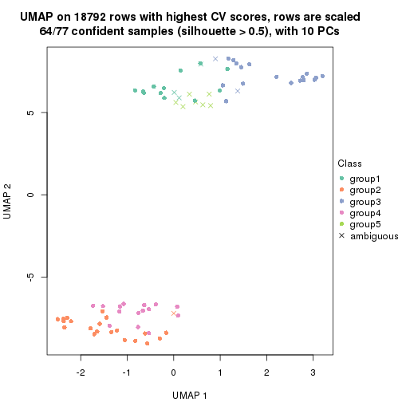</p>

</div>
<div id='tab-CV-pam-dimension-reduction-5'>
<pre><code class="r">dimension_reduction(res, k = 6, method = &quot;UMAP&quot;)
</code></pre>

<p></p>

</div>
</div>


Following heatmap shows how subgroups are split when increasing `k`:

```r
collect_classes(res)
```


Test correlation between subgroups and known annotations. If the known
annotation is numeric, one-way ANOVA test is applied, and if the known
annotation is discrete, chi-squared contingency table test is applied.

```r
test_to_known_factors(res)
```

```
#>         n cell.line(p) agent(p)  time(p) k
#> CV:pam 76     2.12e-17 4.96e-14 3.81e-01 2
#> CV:pam 73     1.41e-16 3.91e-13 1.52e-01 3
#> CV:pam 65     5.02e-14 2.68e-13 1.70e-03 4
#> CV:pam 64     8.21e-14 4.38e-13 2.08e-04 5
#> CV:pam 67     4.31e-13 2.29e-22 9.41e-06 6
```


If matrix rows can be associated to genes, consider to use `GO_Enrichment(res,
...)` to perform function enrichment for the signature genes.


 

---------------------------------------------------


### CV:mclust**


The object with results only for a single top-value method and a single partition method 
can be extracted as:

```r
res = res_list["CV", "mclust"]
# you can also extract it by
# res = res_list["CV:mclust"]
```

A summary of `res` and all the functions that can be applied to it:

```r
res
```

```
#> A 'ConsensusPartition' object with k = 2, 3, 4, 5, 6.
#>   On a matrix with 18792 rows and 77 columns.
#>   Top rows (1000, 2000, 3000, 4000, 5000) are extracted by 'CV' method.
#>   Subgroups are detected by 'mclust' method.
#>   Performed in total 1250 partitions by row resampling.
#>   Best k for subgroups seems to be 2.
#> 
#> Following methods can be applied to this 'ConsensusPartition' object:
#>  [1] "cola_report"             "collect_classes"         "collect_plots"          
#>  [4] "collect_stats"           "colnames"                "compare_signatures"     
#>  [7] "consensus_heatmap"       "dimension_reduction"     "functional_enrichment"  
#> [10] "get_anno_col"            "get_anno"                "get_classes"            
#> [13] "get_consensus"           "get_matrix"              "get_membership"         
#> [16] "get_param"               "get_signatures"          "get_stats"              
#> [19] "is_best_k"               "is_stable_k"             "membership_heatmap"     
#> [22] "ncol"                    "nrow"                    "plot_ecdf"              
#> [25] "rownames"                "select_partition_number" "show"                   
#> [28] "suggest_best_k"          "test_to_known_factors"
```

`collect_plots()` function collects all the plots made from `res` for all `k` (number of partitions)
into one single page to provide an easy and fast comparison between different `k`.

```r
collect_plots(res)
```


The plots are:

- The first row: a plot of the ECDF (Empirical cumulative distribution
  function) curves of the consensus matrix for each `k` and the heatmap of
  predicted classes for each `k`.
- The second row: heatmaps of the consensus matrix for each `k`.
- The third row: heatmaps of the membership matrix for each `k`.
- The fouth row: heatmaps of the signatures for each `k`.

All the plots in panels can be made by individual functions and they are
plotted later in this section.

`select_partition_number()` produces several plots showing different
statistics for choosing "optimized" `k`. There are following statistics:

- ECDF curves of the consensus matrix for each `k`;
- 1-PAC. [The PAC
  score](https://en.wikipedia.org/wiki/Consensus_clustering#Over-interpretation_potential_of_consensus_clustering)
  measures the proportion of the ambiguous subgrouping.
- Mean silhouette score.
- Concordance. The mean probability of fiting the consensus class ids in all
  partitions.
- Area increased. Denote $A_k$ as the area under the ECDF curve for current
  `k`, the area increased is defined as $A_k - A_{k-1}$.
- Rand index. The percent of pairs of samples that are both in a same cluster
  or both are not in a same cluster in the partition of k and k-1.
- Jaccard index. The ratio of pairs of samples are both in a same cluster in
  the partition of k and k-1 and the pairs of samples are both in a same
  cluster in the partition k or k-1.

The detailed explanations of these statistics can be found in [the cola
vignette](http://bioconductor.org/packages/devel/bioc/vignettes/cola/inst/doc/cola.html#toc_13).

Generally speaking, lower PAC score, higher mean silhouette score or higher
concordance corresponds to better partition. Rand index and Jaccard index
measure how similar the current partition is compared to partition with `k-1`.
If they are too similar, we won't accept `k` is better than `k-1`.

```r
select_partition_number(res)
```


The numeric values for all these statistics can be obtained by `get_stats()`.

```r
get_stats(res)
```

```
#>   k 1-PAC mean_silhouette concordance area_increased  Rand Jaccard
#> 2 2 1.000           1.000       1.000         0.5049 0.496   0.496
#> 3 3 0.732           0.846       0.867         0.2399 0.861   0.719
#> 4 4 0.663           0.669       0.819         0.1104 0.840   0.597
#> 5 5 0.687           0.727       0.831         0.0986 0.912   0.707
#> 6 6 0.677           0.603       0.771         0.0551 0.942   0.760
```

`suggest_best_k()` suggests the best $k$ based on these statistics. The rules are as follows:

- All $k$ with Jaccard index larger than 0.95 are removed because the increase of
  the partition number does not provides enough extra information. If all $k$ are removed,
  the best $k$ is assigned by `NA`.
- For $k$ with 1-PAC larger than 0.9, the maximal $k$ is taken as the "best k". Other $k$ is called "optional k".
- If it does not fit the second rule. The $k$ with the highest vote of highest
  1-PAC, mean silhouette and concordance is taken as the "best k".

```r
suggest_best_k(res)
```

```
#> [1] 2
```


Following shows the table of the partitions (You need to click the **show/hide
code output** link to see it). The membership matrix (columns with name `p*`)
is inferred by
[`clue::cl_consensus()`](https://www.rdocumentation.org/link/cl_consensus?package=clue)
function with the `SE` method. Basically the value in the membership matrix
represents the probability to belong to a certain group. The finall class
label for an item is determined with the group with highest probability it
belongs to.

In `get_classes()` function, the entropy is calculated from the membership
matrix and the silhouette score is calculated from the consensus matrix.


<script>
$( function() {
	$( '#tabs-CV-mclust-get-classes' ).tabs();
} );
</script>
<div id='tabs-CV-mclust-get-classes'>
<ul>
<li><a href='#tab-CV-mclust-get-classes-1'>k = 2</a></li>
<li><a href='#tab-CV-mclust-get-classes-2'>k = 3</a></li>
<li><a href='#tab-CV-mclust-get-classes-3'>k = 4</a></li>
<li><a href='#tab-CV-mclust-get-classes-4'>k = 5</a></li>
<li><a href='#tab-CV-mclust-get-classes-5'>k = 6</a></li>
</ul>

<div id='tab-CV-mclust-get-classes-1'>
<p><a id='tab-CV-mclust-get-classes-1-a' style='color:#0366d6' href='#'>show/hide code output</a></p>
<pre><code class="r">cbind(get_classes(res, k = 2), get_membership(res, k = 2))
</code></pre>

<pre><code>#&gt;          class entropy silhouette p1 p2
#&gt; GSM87962     1       0          1  1  0
#&gt; GSM87963     1       0          1  1  0
#&gt; GSM87983     1       0          1  1  0
#&gt; GSM87984     1       0          1  1  0
#&gt; GSM87961     1       0          1  1  0
#&gt; GSM87970     1       0          1  1  0
#&gt; GSM87971     1       0          1  1  0
#&gt; GSM87990     1       0          1  1  0
#&gt; GSM87991     1       0          1  1  0
#&gt; GSM87974     1       0          1  1  0
#&gt; GSM87994     1       0          1  1  0
#&gt; GSM87978     1       0          1  1  0
#&gt; GSM87979     1       0          1  1  0
#&gt; GSM87998     1       0          1  1  0
#&gt; GSM87999     1       0          1  1  0
#&gt; GSM87968     1       0          1  1  0
#&gt; GSM87987     1       0          1  1  0
#&gt; GSM87969     1       0          1  1  0
#&gt; GSM87988     1       0          1  1  0
#&gt; GSM87989     1       0          1  1  0
#&gt; GSM87972     1       0          1  1  0
#&gt; GSM87992     1       0          1  1  0
#&gt; GSM87973     1       0          1  1  0
#&gt; GSM87993     1       0          1  1  0
#&gt; GSM87975     1       0          1  1  0
#&gt; GSM87995     1       0          1  1  0
#&gt; GSM87976     1       0          1  1  0
#&gt; GSM87977     1       0          1  1  0
#&gt; GSM87996     1       0          1  1  0
#&gt; GSM87997     1       0          1  1  0
#&gt; GSM87980     1       0          1  1  0
#&gt; GSM88000     1       0          1  1  0
#&gt; GSM87981     1       0          1  1  0
#&gt; GSM87982     1       0          1  1  0
#&gt; GSM88001     1       0          1  1  0
#&gt; GSM87967     1       0          1  1  0
#&gt; GSM87964     1       0          1  1  0
#&gt; GSM87965     1       0          1  1  0
#&gt; GSM87966     1       0          1  1  0
#&gt; GSM87985     1       0          1  1  0
#&gt; GSM87986     1       0          1  1  0
#&gt; GSM88004     2       0          1  0  1
#&gt; GSM88015     2       0          1  0  1
#&gt; GSM88005     2       0          1  0  1
#&gt; GSM88006     2       0          1  0  1
#&gt; GSM88016     2       0          1  0  1
#&gt; GSM88007     2       0          1  0  1
#&gt; GSM88017     2       0          1  0  1
#&gt; GSM88029     2       0          1  0  1
#&gt; GSM88008     2       0          1  0  1
#&gt; GSM88009     2       0          1  0  1
#&gt; GSM88018     2       0          1  0  1
#&gt; GSM88024     2       0          1  0  1
#&gt; GSM88030     2       0          1  0  1
#&gt; GSM88036     2       0          1  0  1
#&gt; GSM88010     2       0          1  0  1
#&gt; GSM88011     2       0          1  0  1
#&gt; GSM88019     2       0          1  0  1
#&gt; GSM88027     2       0          1  0  1
#&gt; GSM88031     2       0          1  0  1
#&gt; GSM88012     2       0          1  0  1
#&gt; GSM88020     2       0          1  0  1
#&gt; GSM88032     2       0          1  0  1
#&gt; GSM88037     2       0          1  0  1
#&gt; GSM88013     2       0          1  0  1
#&gt; GSM88021     2       0          1  0  1
#&gt; GSM88025     2       0          1  0  1
#&gt; GSM88033     2       0          1  0  1
#&gt; GSM88014     2       0          1  0  1
#&gt; GSM88022     2       0          1  0  1
#&gt; GSM88034     2       0          1  0  1
#&gt; GSM88002     2       0          1  0  1
#&gt; GSM88003     2       0          1  0  1
#&gt; GSM88023     2       0          1  0  1
#&gt; GSM88026     2       0          1  0  1
#&gt; GSM88028     2       0          1  0  1
#&gt; GSM88035     2       0          1  0  1
</code></pre>

<script>
$('#tab-CV-mclust-get-classes-1-a').parent().next().next().hide();
$('#tab-CV-mclust-get-classes-1-a').click(function(){
  $('#tab-CV-mclust-get-classes-1-a').parent().next().next().toggle();
  return(false);
});
</script>
</div>

<div id='tab-CV-mclust-get-classes-2'>
<p><a id='tab-CV-mclust-get-classes-2-a' style='color:#0366d6' href='#'>show/hide code output</a></p>
<pre><code class="r">cbind(get_classes(res, k = 3), get_membership(res, k = 3))
</code></pre>

<pre><code>#&gt;          class entropy silhouette    p1    p2    p3
#&gt; GSM87962     1  0.1860      0.870 0.948 0.000 0.052
#&gt; GSM87963     1  0.1860      0.870 0.948 0.000 0.052
#&gt; GSM87983     1  0.2165      0.881 0.936 0.000 0.064
#&gt; GSM87984     1  0.1860      0.870 0.948 0.000 0.052
#&gt; GSM87961     3  0.6154      0.804 0.408 0.000 0.592
#&gt; GSM87970     3  0.5178      0.813 0.256 0.000 0.744
#&gt; GSM87971     3  0.6644      0.682 0.160 0.092 0.748
#&gt; GSM87990     3  0.5363      0.814 0.276 0.000 0.724
#&gt; GSM87991     1  0.1643      0.875 0.956 0.000 0.044
#&gt; GSM87974     3  0.6192      0.800 0.420 0.000 0.580
#&gt; GSM87994     1  0.0000      0.891 1.000 0.000 0.000
#&gt; GSM87978     3  0.5178      0.813 0.256 0.000 0.744
#&gt; GSM87979     3  0.5216      0.814 0.260 0.000 0.740
#&gt; GSM87998     1  0.1411      0.871 0.964 0.000 0.036
#&gt; GSM87999     1  0.0000      0.891 1.000 0.000 0.000
#&gt; GSM87968     3  0.5178      0.813 0.256 0.000 0.744
#&gt; GSM87987     1  0.2625      0.878 0.916 0.000 0.084
#&gt; GSM87969     1  0.2711      0.824 0.912 0.000 0.088
#&gt; GSM87988     1  0.1411      0.871 0.964 0.000 0.036
#&gt; GSM87989     1  0.0000      0.891 1.000 0.000 0.000
#&gt; GSM87972     3  0.6267      0.773 0.452 0.000 0.548
#&gt; GSM87992     1  0.0000      0.891 1.000 0.000 0.000
#&gt; GSM87973     3  0.6274      0.765 0.456 0.000 0.544
#&gt; GSM87993     1  0.1860      0.870 0.948 0.000 0.052
#&gt; GSM87975     3  0.6244      0.786 0.440 0.000 0.560
#&gt; GSM87995     1  0.0000      0.891 1.000 0.000 0.000
#&gt; GSM87976     3  0.6215      0.795 0.428 0.000 0.572
#&gt; GSM87977     1  0.5291      0.354 0.732 0.000 0.268
#&gt; GSM87996     1  0.0000      0.891 1.000 0.000 0.000
#&gt; GSM87997     1  0.1411      0.871 0.964 0.000 0.036
#&gt; GSM87980     3  0.6267      0.773 0.452 0.000 0.548
#&gt; GSM88000     1  0.6126     -0.363 0.600 0.000 0.400
#&gt; GSM87981     3  0.6267      0.773 0.452 0.000 0.548
#&gt; GSM87982     3  0.6267      0.773 0.452 0.000 0.548
#&gt; GSM88001     1  0.1411      0.871 0.964 0.000 0.036
#&gt; GSM87967     1  0.1529      0.872 0.960 0.000 0.040
#&gt; GSM87964     3  0.5178      0.813 0.256 0.000 0.744
#&gt; GSM87965     1  0.4842      0.512 0.776 0.000 0.224
#&gt; GSM87966     1  0.0237      0.891 0.996 0.000 0.004
#&gt; GSM87985     3  0.5254      0.813 0.264 0.000 0.736
#&gt; GSM87986     1  0.2356      0.881 0.928 0.000 0.072
#&gt; GSM88004     2  0.4654      0.880 0.000 0.792 0.208
#&gt; GSM88015     2  0.4654      0.880 0.000 0.792 0.208
#&gt; GSM88005     2  0.0892      0.929 0.000 0.980 0.020
#&gt; GSM88006     2  0.1031      0.928 0.000 0.976 0.024
#&gt; GSM88016     2  0.4605      0.882 0.000 0.796 0.204
#&gt; GSM88007     2  0.4605      0.882 0.000 0.796 0.204
#&gt; GSM88017     2  0.0747      0.931 0.000 0.984 0.016
#&gt; GSM88029     2  0.1289      0.929 0.000 0.968 0.032
#&gt; GSM88008     2  0.4605      0.882 0.000 0.796 0.204
#&gt; GSM88009     2  0.4605      0.882 0.000 0.796 0.204
#&gt; GSM88018     2  0.4702      0.881 0.000 0.788 0.212
#&gt; GSM88024     2  0.0592      0.929 0.000 0.988 0.012
#&gt; GSM88030     2  0.0592      0.929 0.000 0.988 0.012
#&gt; GSM88036     2  0.0592      0.929 0.000 0.988 0.012
#&gt; GSM88010     2  0.0592      0.931 0.000 0.988 0.012
#&gt; GSM88011     2  0.0000      0.931 0.000 1.000 0.000
#&gt; GSM88019     2  0.0000      0.931 0.000 1.000 0.000
#&gt; GSM88027     2  0.0000      0.931 0.000 1.000 0.000
#&gt; GSM88031     2  0.0237      0.931 0.000 0.996 0.004
#&gt; GSM88012     2  0.0592      0.931 0.000 0.988 0.012
#&gt; GSM88020     2  0.0592      0.929 0.000 0.988 0.012
#&gt; GSM88032     2  0.0237      0.931 0.000 0.996 0.004
#&gt; GSM88037     2  0.0237      0.931 0.000 0.996 0.004
#&gt; GSM88013     2  0.0237      0.931 0.000 0.996 0.004
#&gt; GSM88021     2  0.0424      0.930 0.000 0.992 0.008
#&gt; GSM88025     2  0.0592      0.929 0.000 0.988 0.012
#&gt; GSM88033     2  0.0424      0.930 0.000 0.992 0.008
#&gt; GSM88014     2  0.0237      0.931 0.000 0.996 0.004
#&gt; GSM88022     2  0.0000      0.931 0.000 1.000 0.000
#&gt; GSM88034     2  0.0592      0.929 0.000 0.988 0.012
#&gt; GSM88002     2  0.4605      0.882 0.000 0.796 0.204
#&gt; GSM88003     2  0.4605      0.882 0.000 0.796 0.204
#&gt; GSM88023     2  0.4605      0.882 0.000 0.796 0.204
#&gt; GSM88026     2  0.4605      0.882 0.000 0.796 0.204
#&gt; GSM88028     2  0.4654      0.880 0.000 0.792 0.208
#&gt; GSM88035     2  0.4605      0.882 0.000 0.796 0.204
</code></pre>

<script>
$('#tab-CV-mclust-get-classes-2-a').parent().next().next().hide();
$('#tab-CV-mclust-get-classes-2-a').click(function(){
  $('#tab-CV-mclust-get-classes-2-a').parent().next().next().toggle();
  return(false);
});
</script>
</div>

<div id='tab-CV-mclust-get-classes-3'>
<p><a id='tab-CV-mclust-get-classes-3-a' style='color:#0366d6' href='#'>show/hide code output</a></p>
<pre><code class="r">cbind(get_classes(res, k = 4), get_membership(res, k = 4))
</code></pre>

<pre><code>#&gt;          class entropy silhouette    p1    p2    p3    p4
#&gt; GSM87962     3  0.2647      0.749 0.120 0.000 0.880 0.000
#&gt; GSM87963     3  0.2814      0.734 0.132 0.000 0.868 0.000
#&gt; GSM87983     3  0.1867      0.774 0.072 0.000 0.928 0.000
#&gt; GSM87984     3  0.2149      0.768 0.088 0.000 0.912 0.000
#&gt; GSM87961     1  0.4103      0.881 0.744 0.000 0.256 0.000
#&gt; GSM87970     1  0.4103      0.881 0.744 0.000 0.256 0.000
#&gt; GSM87971     1  0.3486      0.842 0.812 0.000 0.188 0.000
#&gt; GSM87990     1  0.4977      0.495 0.540 0.000 0.460 0.000
#&gt; GSM87991     3  0.1211      0.781 0.040 0.000 0.960 0.000
#&gt; GSM87974     1  0.3837      0.871 0.776 0.000 0.224 0.000
#&gt; GSM87994     3  0.1211      0.780 0.040 0.000 0.960 0.000
#&gt; GSM87978     1  0.4103      0.881 0.744 0.000 0.256 0.000
#&gt; GSM87979     1  0.4134      0.877 0.740 0.000 0.260 0.000
#&gt; GSM87998     3  0.1211      0.779 0.040 0.000 0.960 0.000
#&gt; GSM87999     3  0.0592      0.774 0.016 0.000 0.984 0.000
#&gt; GSM87968     1  0.4072      0.881 0.748 0.000 0.252 0.000
#&gt; GSM87987     3  0.1867      0.774 0.072 0.000 0.928 0.000
#&gt; GSM87969     3  0.2281      0.764 0.096 0.000 0.904 0.000
#&gt; GSM87988     3  0.0000      0.774 0.000 0.000 1.000 0.000
#&gt; GSM87989     3  0.0469      0.777 0.012 0.000 0.988 0.000
#&gt; GSM87972     3  0.4994     -0.245 0.480 0.000 0.520 0.000
#&gt; GSM87992     3  0.0592      0.778 0.016 0.000 0.984 0.000
#&gt; GSM87973     3  0.4994     -0.228 0.480 0.000 0.520 0.000
#&gt; GSM87993     3  0.0817      0.780 0.024 0.000 0.976 0.000
#&gt; GSM87975     1  0.4500      0.792 0.684 0.000 0.316 0.000
#&gt; GSM87995     3  0.0000      0.774 0.000 0.000 1.000 0.000
#&gt; GSM87976     1  0.3837      0.856 0.776 0.000 0.224 0.000
#&gt; GSM87977     3  0.4967     -0.172 0.452 0.000 0.548 0.000
#&gt; GSM87996     3  0.0000      0.774 0.000 0.000 1.000 0.000
#&gt; GSM87997     3  0.0000      0.774 0.000 0.000 1.000 0.000
#&gt; GSM87980     3  0.4992     -0.229 0.476 0.000 0.524 0.000
#&gt; GSM88000     3  0.4304      0.389 0.284 0.000 0.716 0.000
#&gt; GSM87981     3  0.4996     -0.243 0.484 0.000 0.516 0.000
#&gt; GSM87982     3  0.4989     -0.215 0.472 0.000 0.528 0.000
#&gt; GSM88001     3  0.0000      0.774 0.000 0.000 1.000 0.000
#&gt; GSM87967     3  0.3528      0.580 0.192 0.000 0.808 0.000
#&gt; GSM87964     1  0.3444      0.838 0.816 0.000 0.184 0.000
#&gt; GSM87965     3  0.3024      0.723 0.148 0.000 0.852 0.000
#&gt; GSM87966     3  0.1022      0.780 0.032 0.000 0.968 0.000
#&gt; GSM87985     1  0.4925      0.580 0.572 0.000 0.428 0.000
#&gt; GSM87986     3  0.1867      0.774 0.072 0.000 0.928 0.000
#&gt; GSM88004     2  0.0188      0.842 0.000 0.996 0.000 0.004
#&gt; GSM88015     2  0.1792      0.787 0.068 0.932 0.000 0.000
#&gt; GSM88005     2  0.3768      0.757 0.184 0.808 0.000 0.008
#&gt; GSM88006     2  0.3895      0.756 0.184 0.804 0.000 0.012
#&gt; GSM88016     2  0.0188      0.844 0.000 0.996 0.000 0.004
#&gt; GSM88007     2  0.0188      0.842 0.000 0.996 0.000 0.004
#&gt; GSM88017     2  0.3768      0.757 0.184 0.808 0.000 0.008
#&gt; GSM88029     2  0.5948      0.566 0.144 0.696 0.000 0.160
#&gt; GSM88008     2  0.0336      0.843 0.000 0.992 0.000 0.008
#&gt; GSM88009     2  0.0188      0.842 0.000 0.996 0.000 0.004
#&gt; GSM88018     2  0.2124      0.792 0.068 0.924 0.000 0.008
#&gt; GSM88024     2  0.6001      0.572 0.184 0.688 0.000 0.128
#&gt; GSM88030     4  0.4121      0.520 0.184 0.020 0.000 0.796
#&gt; GSM88036     4  0.4121      0.520 0.184 0.020 0.000 0.796
#&gt; GSM88010     2  0.3688      0.715 0.000 0.792 0.000 0.208
#&gt; GSM88011     2  0.3764      0.705 0.000 0.784 0.000 0.216
#&gt; GSM88019     2  0.3726      0.710 0.000 0.788 0.000 0.212
#&gt; GSM88027     2  0.3837      0.693 0.000 0.776 0.000 0.224
#&gt; GSM88031     4  0.4746      0.680 0.000 0.368 0.000 0.632
#&gt; GSM88012     2  0.3688      0.715 0.000 0.792 0.000 0.208
#&gt; GSM88020     4  0.1297      0.597 0.016 0.020 0.000 0.964
#&gt; GSM88032     4  0.4746      0.680 0.000 0.368 0.000 0.632
#&gt; GSM88037     4  0.4746      0.680 0.000 0.368 0.000 0.632
#&gt; GSM88013     4  0.4746      0.680 0.000 0.368 0.000 0.632
#&gt; GSM88021     4  0.4697      0.678 0.000 0.356 0.000 0.644
#&gt; GSM88025     4  0.4746      0.680 0.000 0.368 0.000 0.632
#&gt; GSM88033     4  0.4605      0.683 0.000 0.336 0.000 0.664
#&gt; GSM88014     4  0.4916      0.550 0.000 0.424 0.000 0.576
#&gt; GSM88022     2  0.3837      0.693 0.000 0.776 0.000 0.224
#&gt; GSM88034     4  0.0524      0.591 0.008 0.004 0.000 0.988
#&gt; GSM88002     2  0.0000      0.843 0.000 1.000 0.000 0.000
#&gt; GSM88003     2  0.0336      0.843 0.000 0.992 0.000 0.008
#&gt; GSM88023     2  0.0000      0.843 0.000 1.000 0.000 0.000
#&gt; GSM88026     2  0.0336      0.843 0.000 0.992 0.000 0.008
#&gt; GSM88028     2  0.0188      0.842 0.000 0.996 0.000 0.004
#&gt; GSM88035     2  0.0336      0.843 0.000 0.992 0.000 0.008
</code></pre>

<script>
$('#tab-CV-mclust-get-classes-3-a').parent().next().next().hide();
$('#tab-CV-mclust-get-classes-3-a').click(function(){
  $('#tab-CV-mclust-get-classes-3-a').parent().next().next().toggle();
  return(false);
});
</script>
</div>

<div id='tab-CV-mclust-get-classes-4'>
<p><a id='tab-CV-mclust-get-classes-4-a' style='color:#0366d6' href='#'>show/hide code output</a></p>
<pre><code class="r">cbind(get_classes(res, k = 5), get_membership(res, k = 5))
</code></pre>

<pre><code>#&gt;          class entropy silhouette    p1    p2    p3    p4    p5
#&gt; GSM87962     3  0.4248      0.769 0.240 0.000 0.728 0.000 0.032
#&gt; GSM87963     3  0.4302      0.763 0.248 0.000 0.720 0.000 0.032
#&gt; GSM87983     3  0.3694      0.795 0.172 0.000 0.796 0.000 0.032
#&gt; GSM87984     3  0.3944      0.789 0.200 0.000 0.768 0.000 0.032
#&gt; GSM87961     1  0.3343      0.777 0.860 0.000 0.084 0.028 0.028
#&gt; GSM87970     1  0.2696      0.794 0.900 0.000 0.040 0.028 0.032
#&gt; GSM87971     1  0.1544      0.750 0.932 0.000 0.000 0.000 0.068
#&gt; GSM87990     1  0.4134      0.638 0.760 0.000 0.196 0.000 0.044
#&gt; GSM87991     3  0.2921      0.814 0.124 0.000 0.856 0.000 0.020
#&gt; GSM87974     1  0.2617      0.791 0.904 0.000 0.032 0.028 0.036
#&gt; GSM87994     3  0.2561      0.812 0.144 0.000 0.856 0.000 0.000
#&gt; GSM87978     1  0.2228      0.789 0.912 0.000 0.040 0.000 0.048
#&gt; GSM87979     1  0.1121      0.790 0.956 0.000 0.044 0.000 0.000
#&gt; GSM87998     3  0.2773      0.809 0.164 0.000 0.836 0.000 0.000
#&gt; GSM87999     3  0.2921      0.814 0.124 0.000 0.856 0.000 0.020
#&gt; GSM87968     1  0.2359      0.786 0.904 0.000 0.036 0.000 0.060
#&gt; GSM87987     3  0.4237      0.766 0.200 0.000 0.752 0.000 0.048
#&gt; GSM87969     3  0.4210      0.777 0.224 0.000 0.740 0.000 0.036
#&gt; GSM87988     3  0.0451      0.798 0.004 0.000 0.988 0.000 0.008
#&gt; GSM87989     3  0.1725      0.811 0.044 0.000 0.936 0.000 0.020
#&gt; GSM87972     1  0.5809      0.485 0.548 0.000 0.380 0.028 0.044
#&gt; GSM87992     3  0.0290      0.797 0.000 0.000 0.992 0.000 0.008
#&gt; GSM87973     3  0.4900      0.409 0.300 0.000 0.660 0.028 0.012
#&gt; GSM87993     3  0.0579      0.796 0.000 0.000 0.984 0.008 0.008
#&gt; GSM87975     1  0.4932      0.694 0.708 0.000 0.232 0.028 0.032
#&gt; GSM87995     3  0.0290      0.797 0.000 0.000 0.992 0.000 0.008
#&gt; GSM87976     1  0.4399      0.726 0.792 0.000 0.120 0.028 0.060
#&gt; GSM87977     3  0.5195      0.325 0.388 0.000 0.564 0.000 0.048
#&gt; GSM87996     3  0.0290      0.797 0.000 0.000 0.992 0.000 0.008
#&gt; GSM87997     3  0.1251      0.806 0.036 0.000 0.956 0.000 0.008
#&gt; GSM87980     1  0.5482      0.348 0.512 0.000 0.440 0.028 0.020
#&gt; GSM88000     3  0.1399      0.787 0.000 0.000 0.952 0.028 0.020
#&gt; GSM87981     1  0.5857      0.514 0.568 0.000 0.352 0.028 0.052
#&gt; GSM87982     3  0.5141      0.218 0.360 0.000 0.600 0.028 0.012
#&gt; GSM88001     3  0.0290      0.797 0.000 0.000 0.992 0.000 0.008
#&gt; GSM87967     3  0.3274      0.628 0.220 0.000 0.780 0.000 0.000
#&gt; GSM87964     1  0.2379      0.771 0.912 0.000 0.012 0.028 0.048
#&gt; GSM87965     3  0.4378      0.761 0.248 0.000 0.716 0.000 0.036
#&gt; GSM87966     3  0.2561      0.812 0.144 0.000 0.856 0.000 0.000
#&gt; GSM87985     1  0.3919      0.645 0.776 0.000 0.188 0.000 0.036
#&gt; GSM87986     3  0.3805      0.794 0.184 0.000 0.784 0.000 0.032
#&gt; GSM88004     2  0.0000      0.878 0.000 1.000 0.000 0.000 0.000
#&gt; GSM88015     2  0.1205      0.865 0.040 0.956 0.000 0.004 0.000
#&gt; GSM88005     2  0.5396      0.189 0.000 0.560 0.000 0.376 0.064
#&gt; GSM88006     2  0.1478      0.856 0.000 0.936 0.000 0.000 0.064
#&gt; GSM88016     2  0.0000      0.878 0.000 1.000 0.000 0.000 0.000
#&gt; GSM88007     2  0.0000      0.878 0.000 1.000 0.000 0.000 0.000
#&gt; GSM88017     2  0.1478      0.856 0.000 0.936 0.000 0.000 0.064
#&gt; GSM88029     2  0.4754      0.606 0.000 0.684 0.000 0.264 0.052
#&gt; GSM88008     2  0.2329      0.791 0.000 0.876 0.000 0.124 0.000
#&gt; GSM88009     2  0.0000      0.878 0.000 1.000 0.000 0.000 0.000
#&gt; GSM88018     2  0.1205      0.865 0.040 0.956 0.000 0.004 0.000
#&gt; GSM88024     2  0.6368      0.246 0.000 0.488 0.000 0.332 0.180
#&gt; GSM88030     5  0.2969      0.879 0.000 0.020 0.000 0.128 0.852
#&gt; GSM88036     5  0.2969      0.879 0.000 0.020 0.000 0.128 0.852
#&gt; GSM88010     2  0.3074      0.698 0.000 0.804 0.000 0.196 0.000
#&gt; GSM88011     4  0.3452      0.653 0.000 0.244 0.000 0.756 0.000
#&gt; GSM88019     4  0.3913      0.563 0.000 0.324 0.000 0.676 0.000
#&gt; GSM88027     4  0.2732      0.698 0.000 0.160 0.000 0.840 0.000
#&gt; GSM88031     4  0.2228      0.726 0.000 0.040 0.000 0.912 0.048
#&gt; GSM88012     2  0.3143      0.687 0.000 0.796 0.000 0.204 0.000
#&gt; GSM88020     5  0.3242      0.865 0.000 0.000 0.000 0.216 0.784
#&gt; GSM88032     4  0.2984      0.703 0.000 0.032 0.000 0.860 0.108
#&gt; GSM88037     4  0.2984      0.703 0.000 0.032 0.000 0.860 0.108
#&gt; GSM88013     4  0.1043      0.727 0.000 0.040 0.000 0.960 0.000
#&gt; GSM88021     4  0.4465      0.616 0.000 0.060 0.000 0.736 0.204
#&gt; GSM88025     4  0.3805      0.636 0.000 0.032 0.000 0.784 0.184
#&gt; GSM88033     4  0.4442      0.476 0.000 0.028 0.000 0.688 0.284
#&gt; GSM88014     4  0.1478      0.730 0.000 0.064 0.000 0.936 0.000
#&gt; GSM88022     4  0.3774      0.607 0.000 0.296 0.000 0.704 0.000
#&gt; GSM88034     5  0.3636      0.794 0.000 0.000 0.000 0.272 0.728
#&gt; GSM88002     2  0.1197      0.865 0.000 0.952 0.000 0.048 0.000
#&gt; GSM88003     2  0.0000      0.878 0.000 1.000 0.000 0.000 0.000
#&gt; GSM88023     2  0.0000      0.878 0.000 1.000 0.000 0.000 0.000
#&gt; GSM88026     2  0.1043      0.868 0.000 0.960 0.000 0.040 0.000
#&gt; GSM88028     2  0.0000      0.878 0.000 1.000 0.000 0.000 0.000
#&gt; GSM88035     2  0.0000      0.878 0.000 1.000 0.000 0.000 0.000
</code></pre>

<script>
$('#tab-CV-mclust-get-classes-4-a').parent().next().next().hide();
$('#tab-CV-mclust-get-classes-4-a').click(function(){
  $('#tab-CV-mclust-get-classes-4-a').parent().next().next().toggle();
  return(false);
});
</script>
</div>

<div id='tab-CV-mclust-get-classes-5'>
<p><a id='tab-CV-mclust-get-classes-5-a' style='color:#0366d6' href='#'>show/hide code output</a></p>
<pre><code class="r">cbind(get_classes(res, k = 6), get_membership(res, k = 6))
</code></pre>

<pre><code>#&gt;          class entropy silhouette    p1    p2    p3    p4    p5    p6
#&gt; GSM87962     1  0.4138    0.60504 0.720 0.000 0.228 0.000 0.048 0.004
#&gt; GSM87963     1  0.4023    0.61021 0.720 0.000 0.240 0.000 0.036 0.004
#&gt; GSM87983     1  0.3878    0.62404 0.736 0.000 0.228 0.000 0.032 0.004
#&gt; GSM87984     1  0.4152    0.59705 0.712 0.000 0.240 0.000 0.044 0.004
#&gt; GSM87961     5  0.5845    0.25360 0.192 0.000 0.376 0.000 0.432 0.000
#&gt; GSM87970     5  0.3439    0.72250 0.120 0.000 0.072 0.000 0.808 0.000
#&gt; GSM87971     5  0.1657    0.70745 0.016 0.000 0.056 0.000 0.928 0.000
#&gt; GSM87990     5  0.6006    0.24448 0.256 0.000 0.316 0.000 0.428 0.000
#&gt; GSM87991     1  0.2076    0.67710 0.912 0.000 0.060 0.000 0.012 0.016
#&gt; GSM87974     5  0.2740    0.71629 0.120 0.000 0.028 0.000 0.852 0.000
#&gt; GSM87994     1  0.1141    0.68455 0.948 0.000 0.052 0.000 0.000 0.000
#&gt; GSM87978     5  0.2672    0.72874 0.052 0.000 0.080 0.000 0.868 0.000
#&gt; GSM87979     5  0.3534    0.71118 0.076 0.000 0.124 0.000 0.800 0.000
#&gt; GSM87998     1  0.2973    0.67117 0.836 0.000 0.136 0.000 0.024 0.004
#&gt; GSM87999     1  0.0458    0.67434 0.984 0.000 0.000 0.000 0.000 0.016
#&gt; GSM87968     5  0.2201    0.71873 0.028 0.000 0.076 0.000 0.896 0.000
#&gt; GSM87987     1  0.5064    0.59926 0.604 0.000 0.300 0.000 0.092 0.004
#&gt; GSM87969     1  0.4539    0.48155 0.644 0.000 0.304 0.000 0.048 0.004
#&gt; GSM87988     1  0.2762    0.62693 0.804 0.000 0.196 0.000 0.000 0.000
#&gt; GSM87989     1  0.1088    0.67390 0.960 0.000 0.024 0.000 0.000 0.016
#&gt; GSM87972     3  0.4122    0.66920 0.048 0.000 0.704 0.000 0.248 0.000
#&gt; GSM87992     1  0.2793    0.62442 0.800 0.000 0.200 0.000 0.000 0.000
#&gt; GSM87973     3  0.4533    0.70483 0.156 0.000 0.704 0.000 0.140 0.000
#&gt; GSM87993     1  0.3368    0.59757 0.756 0.000 0.232 0.000 0.012 0.000
#&gt; GSM87975     3  0.4161    0.38374 0.012 0.000 0.540 0.000 0.448 0.000
#&gt; GSM87995     1  0.2793    0.62442 0.800 0.000 0.200 0.000 0.000 0.000
#&gt; GSM87976     5  0.1267    0.63825 0.000 0.000 0.060 0.000 0.940 0.000
#&gt; GSM87977     3  0.5434    0.50467 0.164 0.000 0.564 0.000 0.272 0.000
#&gt; GSM87996     1  0.2793    0.62442 0.800 0.000 0.200 0.000 0.000 0.000
#&gt; GSM87997     1  0.2883    0.61374 0.788 0.000 0.212 0.000 0.000 0.000
#&gt; GSM87980     3  0.4281    0.69237 0.068 0.000 0.704 0.000 0.228 0.000
#&gt; GSM88000     3  0.4504   -0.01263 0.432 0.000 0.536 0.000 0.032 0.000
#&gt; GSM87981     3  0.4061    0.67226 0.044 0.000 0.708 0.000 0.248 0.000
#&gt; GSM87982     3  0.4602    0.70612 0.160 0.000 0.696 0.000 0.144 0.000
#&gt; GSM88001     1  0.2793    0.62442 0.800 0.000 0.200 0.000 0.000 0.000
#&gt; GSM87967     1  0.5024    0.28068 0.572 0.000 0.340 0.000 0.088 0.000
#&gt; GSM87964     5  0.2662    0.71584 0.120 0.000 0.024 0.000 0.856 0.000
#&gt; GSM87965     1  0.4884    0.05739 0.488 0.000 0.460 0.000 0.048 0.004
#&gt; GSM87966     1  0.2833    0.66376 0.836 0.000 0.148 0.000 0.012 0.004
#&gt; GSM87985     5  0.5911    0.34428 0.228 0.000 0.316 0.000 0.456 0.000
#&gt; GSM87986     1  0.3878    0.62404 0.736 0.000 0.228 0.000 0.032 0.004
#&gt; GSM88004     2  0.0000    0.86799 0.000 1.000 0.000 0.000 0.000 0.000
#&gt; GSM88015     2  0.3066    0.77036 0.000 0.832 0.124 0.044 0.000 0.000
#&gt; GSM88005     2  0.6276   -0.00537 0.000 0.476 0.040 0.344 0.000 0.140
#&gt; GSM88006     2  0.0000    0.86799 0.000 1.000 0.000 0.000 0.000 0.000
#&gt; GSM88016     2  0.0363    0.86536 0.000 0.988 0.000 0.012 0.000 0.000
#&gt; GSM88007     2  0.0260    0.86666 0.000 0.992 0.000 0.008 0.000 0.000
#&gt; GSM88017     2  0.1116    0.86451 0.000 0.960 0.008 0.028 0.000 0.004
#&gt; GSM88029     2  0.3849    0.73578 0.000 0.796 0.004 0.080 0.008 0.112
#&gt; GSM88008     2  0.4159    0.56699 0.000 0.704 0.040 0.252 0.000 0.004
#&gt; GSM88009     2  0.0000    0.86799 0.000 1.000 0.000 0.000 0.000 0.000
#&gt; GSM88018     2  0.2531    0.79632 0.000 0.856 0.132 0.012 0.000 0.000
#&gt; GSM88024     6  0.6046   -0.21846 0.000 0.372 0.008 0.188 0.000 0.432
#&gt; GSM88030     6  0.3076    0.61450 0.000 0.000 0.000 0.240 0.000 0.760
#&gt; GSM88036     6  0.3101    0.61540 0.000 0.000 0.000 0.244 0.000 0.756
#&gt; GSM88010     2  0.3133    0.64097 0.000 0.780 0.008 0.212 0.000 0.000
#&gt; GSM88011     4  0.5704    0.57615 0.000 0.116 0.040 0.608 0.000 0.236
#&gt; GSM88019     4  0.6027    0.55569 0.000 0.164 0.036 0.564 0.000 0.236
#&gt; GSM88027     4  0.5908    0.57240 0.000 0.156 0.032 0.576 0.000 0.236
#&gt; GSM88031     4  0.0363    0.55991 0.000 0.012 0.000 0.988 0.000 0.000
#&gt; GSM88012     2  0.3384    0.62583 0.000 0.760 0.008 0.228 0.000 0.004
#&gt; GSM88020     6  0.3747    0.54912 0.000 0.000 0.000 0.396 0.000 0.604
#&gt; GSM88032     4  0.0146    0.55975 0.000 0.000 0.000 0.996 0.000 0.004
#&gt; GSM88037     4  0.0146    0.55975 0.000 0.000 0.000 0.996 0.000 0.004
#&gt; GSM88013     4  0.5034    0.57282 0.000 0.132 0.000 0.628 0.000 0.240
#&gt; GSM88021     4  0.1995    0.52308 0.000 0.036 0.000 0.912 0.000 0.052
#&gt; GSM88025     4  0.3815    0.38559 0.000 0.092 0.000 0.776 0.000 0.132
#&gt; GSM88033     4  0.3858    0.22646 0.000 0.044 0.000 0.740 0.000 0.216
#&gt; GSM88014     4  0.5321    0.56587 0.000 0.156 0.004 0.608 0.000 0.232
#&gt; GSM88022     4  0.6061    0.45309 0.000 0.312 0.004 0.448 0.000 0.236
#&gt; GSM88034     6  0.3765    0.53336 0.000 0.000 0.000 0.404 0.000 0.596
#&gt; GSM88002     2  0.1296    0.86121 0.000 0.948 0.004 0.044 0.000 0.004
#&gt; GSM88003     2  0.0972    0.86515 0.000 0.964 0.008 0.028 0.000 0.000
#&gt; GSM88023     2  0.0547    0.86767 0.000 0.980 0.000 0.020 0.000 0.000
#&gt; GSM88026     2  0.1296    0.85495 0.000 0.952 0.032 0.012 0.000 0.004
#&gt; GSM88028     2  0.0713    0.86596 0.000 0.972 0.000 0.028 0.000 0.000
#&gt; GSM88035     2  0.0713    0.86596 0.000 0.972 0.000 0.028 0.000 0.000
</code></pre>

<script>
$('#tab-CV-mclust-get-classes-5-a').parent().next().next().hide();
$('#tab-CV-mclust-get-classes-5-a').click(function(){
  $('#tab-CV-mclust-get-classes-5-a').parent().next().next().toggle();
  return(false);
});
</script>
</div>
</div>

Heatmaps for the consensus matrix. It visualizes the probability of two
samples to be in a same group.


<script>
$( function() {
	$( '#tabs-CV-mclust-consensus-heatmap' ).tabs();
} );
</script>
<div id='tabs-CV-mclust-consensus-heatmap'>
<ul>
<li><a href='#tab-CV-mclust-consensus-heatmap-1'>k = 2</a></li>
<li><a href='#tab-CV-mclust-consensus-heatmap-2'>k = 3</a></li>
<li><a href='#tab-CV-mclust-consensus-heatmap-3'>k = 4</a></li>
<li><a href='#tab-CV-mclust-consensus-heatmap-4'>k = 5</a></li>
<li><a href='#tab-CV-mclust-consensus-heatmap-5'>k = 6</a></li>
</ul>
<div id='tab-CV-mclust-consensus-heatmap-1'>
<pre><code class="r">consensus_heatmap(res, k = 2)
</code></pre>

<p></p>

</div>
<div id='tab-CV-mclust-consensus-heatmap-2'>
<pre><code class="r">consensus_heatmap(res, k = 3)
</code></pre>

<p>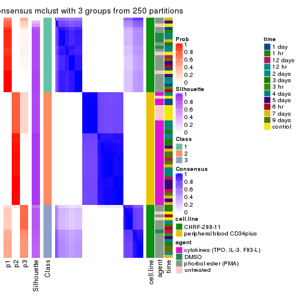</p>

</div>
<div id='tab-CV-mclust-consensus-heatmap-3'>
<pre><code class="r">consensus_heatmap(res, k = 4)
</code></pre>

<p></p>

</div>
<div id='tab-CV-mclust-consensus-heatmap-4'>
<pre><code class="r">consensus_heatmap(res, k = 5)
</code></pre>

<p></p>

</div>
<div id='tab-CV-mclust-consensus-heatmap-5'>
<pre><code class="r">consensus_heatmap(res, k = 6)
</code></pre>

<p></p>

</div>
</div>

Heatmaps for the membership of samples in all partitions to see how consistent they are:


<script>
$( function() {
	$( '#tabs-CV-mclust-membership-heatmap' ).tabs();
} );
</script>
<div id='tabs-CV-mclust-membership-heatmap'>
<ul>
<li><a href='#tab-CV-mclust-membership-heatmap-1'>k = 2</a></li>
<li><a href='#tab-CV-mclust-membership-heatmap-2'>k = 3</a></li>
<li><a href='#tab-CV-mclust-membership-heatmap-3'>k = 4</a></li>
<li><a href='#tab-CV-mclust-membership-heatmap-4'>k = 5</a></li>
<li><a href='#tab-CV-mclust-membership-heatmap-5'>k = 6</a></li>
</ul>
<div id='tab-CV-mclust-membership-heatmap-1'>
<pre><code class="r">membership_heatmap(res, k = 2)
</code></pre>

<p></p>

</div>
<div id='tab-CV-mclust-membership-heatmap-2'>
<pre><code class="r">membership_heatmap(res, k = 3)
</code></pre>

<p></p>

</div>
<div id='tab-CV-mclust-membership-heatmap-3'>
<pre><code class="r">membership_heatmap(res, k = 4)
</code></pre>

<p></p>

</div>
<div id='tab-CV-mclust-membership-heatmap-4'>
<pre><code class="r">membership_heatmap(res, k = 5)
</code></pre>

<p></p>

</div>
<div id='tab-CV-mclust-membership-heatmap-5'>
<pre><code class="r">membership_heatmap(res, k = 6)
</code></pre>

<p></p>

</div>
</div>

As soon as we have had the classes for columns, we can look for signatures
which are significantly different between classes which can be candidate marks
for certain classes. Following are the heatmaps for signatures.


Signature heatmaps where rows are scaled:


<script>
$( function() {
	$( '#tabs-CV-mclust-get-signatures' ).tabs();
} );
</script>
<div id='tabs-CV-mclust-get-signatures'>
<ul>
<li><a href='#tab-CV-mclust-get-signatures-1'>k = 2</a></li>
<li><a href='#tab-CV-mclust-get-signatures-2'>k = 3</a></li>
<li><a href='#tab-CV-mclust-get-signatures-3'>k = 4</a></li>
<li><a href='#tab-CV-mclust-get-signatures-4'>k = 5</a></li>
<li><a href='#tab-CV-mclust-get-signatures-5'>k = 6</a></li>
</ul>
<div id='tab-CV-mclust-get-signatures-1'>
<pre><code class="r">get_signatures(res, k = 2)
</code></pre>

<p></p>

</div>
<div id='tab-CV-mclust-get-signatures-2'>
<pre><code class="r">get_signatures(res, k = 3)
</code></pre>

<p></p>

</div>
<div id='tab-CV-mclust-get-signatures-3'>
<pre><code class="r">get_signatures(res, k = 4)
</code></pre>

<p></p>

</div>
<div id='tab-CV-mclust-get-signatures-4'>
<pre><code class="r">get_signatures(res, k = 5)
</code></pre>

<p></p>

</div>
<div id='tab-CV-mclust-get-signatures-5'>
<pre><code class="r">get_signatures(res, k = 6)
</code></pre>

<p></p>

</div>
</div>


Signature heatmaps where rows are not scaled:


<script>
$( function() {
	$( '#tabs-CV-mclust-get-signatures-no-scale' ).tabs();
} );
</script>
<div id='tabs-CV-mclust-get-signatures-no-scale'>
<ul>
<li><a href='#tab-CV-mclust-get-signatures-no-scale-1'>k = 2</a></li>
<li><a href='#tab-CV-mclust-get-signatures-no-scale-2'>k = 3</a></li>
<li><a href='#tab-CV-mclust-get-signatures-no-scale-3'>k = 4</a></li>
<li><a href='#tab-CV-mclust-get-signatures-no-scale-4'>k = 5</a></li>
<li><a href='#tab-CV-mclust-get-signatures-no-scale-5'>k = 6</a></li>
</ul>
<div id='tab-CV-mclust-get-signatures-no-scale-1'>
<pre><code class="r">get_signatures(res, k = 2, scale_rows = FALSE)
</code></pre>

<p></p>

</div>
<div id='tab-CV-mclust-get-signatures-no-scale-2'>
<pre><code class="r">get_signatures(res, k = 3, scale_rows = FALSE)
</code></pre>

<p>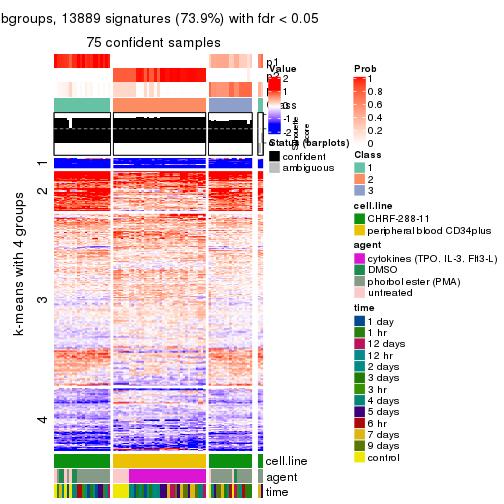</p>

</div>
<div id='tab-CV-mclust-get-signatures-no-scale-3'>
<pre><code class="r">get_signatures(res, k = 4, scale_rows = FALSE)
</code></pre>

<p></p>

</div>
<div id='tab-CV-mclust-get-signatures-no-scale-4'>
<pre><code class="r">get_signatures(res, k = 5, scale_rows = FALSE)
</code></pre>

<p></p>

</div>
<div id='tab-CV-mclust-get-signatures-no-scale-5'>
<pre><code class="r">get_signatures(res, k = 6, scale_rows = FALSE)
</code></pre>

<p></p>

</div>
</div>


Compare the overlap of signatures from different k:

```r
compare_signatures(res)
```


`get_signature()` returns a data frame invisibly. TO get the list of signatures, the function
call should be assigned to a variable explicitly. In following code, if `plot` argument is set
to `FALSE`, no heatmap is plotted while only the differential analysis is performed.

```r
# code only for demonstration
tb = get_signature(res, k = ..., plot = FALSE)
```

An example of the output of `tb` is:

```
#>   which_row         fdr    mean_1    mean_2 scaled_mean_1 scaled_mean_2 km
#> 1        38 0.042760348  8.373488  9.131774    -0.5533452     0.5164555  1
#> 2        40 0.018707592  7.106213  8.469186    -0.6173731     0.5762149  1
#> 3        55 0.019134737 10.221463 11.207825    -0.6159697     0.5749050  1
#> 4        59 0.006059896  5.921854  7.869574    -0.6899429     0.6439467  1
#> 5        60 0.018055526  8.928898 10.211722    -0.6204761     0.5791110  1
#> 6        98 0.009384629 15.714769 14.887706     0.6635654    -0.6193277  2
...
```

The columns in `tb` are:

1. `which_row`: row indices corresponding to the input matrix.
2. `fdr`: FDR for the differential test. 
3. `mean_x`: The mean value in group x.
4. `scaled_mean_x`: The mean value in group x after rows are scaled.
5. `km`: Row groups if k-means clustering is applied to rows.


UMAP plot which shows how samples are separated.


<script>
$( function() {
	$( '#tabs-CV-mclust-dimension-reduction' ).tabs();
} );
</script>
<div id='tabs-CV-mclust-dimension-reduction'>
<ul>
<li><a href='#tab-CV-mclust-dimension-reduction-1'>k = 2</a></li>
<li><a href='#tab-CV-mclust-dimension-reduction-2'>k = 3</a></li>
<li><a href='#tab-CV-mclust-dimension-reduction-3'>k = 4</a></li>
<li><a href='#tab-CV-mclust-dimension-reduction-4'>k = 5</a></li>
<li><a href='#tab-CV-mclust-dimension-reduction-5'>k = 6</a></li>
</ul>
<div id='tab-CV-mclust-dimension-reduction-1'>
<pre><code class="r">dimension_reduction(res, k = 2, method = &quot;UMAP&quot;)
</code></pre>

<p></p>

</div>
<div id='tab-CV-mclust-dimension-reduction-2'>
<pre><code class="r">dimension_reduction(res, k = 3, method = &quot;UMAP&quot;)
</code></pre>

<p></p>

</div>
<div id='tab-CV-mclust-dimension-reduction-3'>
<pre><code class="r">dimension_reduction(res, k = 4, method = &quot;UMAP&quot;)
</code></pre>

<p></p>

</div>
<div id='tab-CV-mclust-dimension-reduction-4'>
<pre><code class="r">dimension_reduction(res, k = 5, method = &quot;UMAP&quot;)
</code></pre>

<p></p>

</div>
<div id='tab-CV-mclust-dimension-reduction-5'>
<pre><code class="r">dimension_reduction(res, k = 6, method = &quot;UMAP&quot;)
</code></pre>

<p></p>

</div>
</div>


Following heatmap shows how subgroups are split when increasing `k`:

```r
collect_classes(res)
```


Test correlation between subgroups and known annotations. If the known
annotation is numeric, one-way ANOVA test is applied, and if the known
annotation is discrete, chi-squared contingency table test is applied.

```r
test_to_known_factors(res)
```

```
#>            n cell.line(p) agent(p) time(p) k
#> CV:mclust 77     1.27e-17 3.00e-14  0.3612 2
#> CV:mclust 75     5.18e-17 1.88e-12  0.5822 3
#> CV:mclust 69     6.99e-15 3.04e-10  0.0286 4
#> CV:mclust 69     3.69e-14 1.01e-09  0.0529 5
#> CV:mclust 64     1.81e-12 2.33e-09  0.0406 6
```


If matrix rows can be associated to genes, consider to use `GO_Enrichment(res,
...)` to perform function enrichment for the signature genes.


 

---------------------------------------------------


### CV:NMF**


The object with results only for a single top-value method and a single partition method 
can be extracted as:

```r
res = res_list["CV", "NMF"]
# you can also extract it by
# res = res_list["CV:NMF"]
```

A summary of `res` and all the functions that can be applied to it:

```r
res
```

```
#> A 'ConsensusPartition' object with k = 2, 3, 4, 5, 6.
#>   On a matrix with 18792 rows and 77 columns.
#>   Top rows (1000, 2000, 3000, 4000, 5000) are extracted by 'CV' method.
#>   Subgroups are detected by 'NMF' method.
#>   Performed in total 1250 partitions by row resampling.
#>   Best k for subgroups seems to be 2.
#> 
#> Following methods can be applied to this 'ConsensusPartition' object:
#>  [1] "cola_report"             "collect_classes"         "collect_plots"          
#>  [4] "collect_stats"           "colnames"                "compare_signatures"     
#>  [7] "consensus_heatmap"       "dimension_reduction"     "functional_enrichment"  
#> [10] "get_anno_col"            "get_anno"                "get_classes"            
#> [13] "get_consensus"           "get_matrix"              "get_membership"         
#> [16] "get_param"               "get_signatures"          "get_stats"              
#> [19] "is_best_k"               "is_stable_k"             "membership_heatmap"     
#> [22] "ncol"                    "nrow"                    "plot_ecdf"              
#> [25] "rownames"                "select_partition_number" "show"                   
#> [28] "suggest_best_k"          "test_to_known_factors"
```

`collect_plots()` function collects all the plots made from `res` for all `k` (number of partitions)
into one single page to provide an easy and fast comparison between different `k`.

```r
collect_plots(res)
```


The plots are:

- The first row: a plot of the ECDF (Empirical cumulative distribution
  function) curves of the consensus matrix for each `k` and the heatmap of
  predicted classes for each `k`.
- The second row: heatmaps of the consensus matrix for each `k`.
- The third row: heatmaps of the membership matrix for each `k`.
- The fouth row: heatmaps of the signatures for each `k`.

All the plots in panels can be made by individual functions and they are
plotted later in this section.

`select_partition_number()` produces several plots showing different
statistics for choosing "optimized" `k`. There are following statistics:

- ECDF curves of the consensus matrix for each `k`;
- 1-PAC. [The PAC
  score](https://en.wikipedia.org/wiki/Consensus_clustering#Over-interpretation_potential_of_consensus_clustering)
  measures the proportion of the ambiguous subgrouping.
- Mean silhouette score.
- Concordance. The mean probability of fiting the consensus class ids in all
  partitions.
- Area increased. Denote $A_k$ as the area under the ECDF curve for current
  `k`, the area increased is defined as $A_k - A_{k-1}$.
- Rand index. The percent of pairs of samples that are both in a same cluster
  or both are not in a same cluster in the partition of k and k-1.
- Jaccard index. The ratio of pairs of samples are both in a same cluster in
  the partition of k and k-1 and the pairs of samples are both in a same
  cluster in the partition k or k-1.

The detailed explanations of these statistics can be found in [the cola
vignette](http://bioconductor.org/packages/devel/bioc/vignettes/cola/inst/doc/cola.html#toc_13).

Generally speaking, lower PAC score, higher mean silhouette score or higher
concordance corresponds to better partition. Rand index and Jaccard index
measure how similar the current partition is compared to partition with `k-1`.
If they are too similar, we won't accept `k` is better than `k-1`.

```r
select_partition_number(res)
```


The numeric values for all these statistics can be obtained by `get_stats()`.

```r
get_stats(res)
```

```
#>   k 1-PAC mean_silhouette concordance area_increased  Rand Jaccard
#> 2 2 1.000           0.979       0.992         0.5059 0.494   0.494
#> 3 3 0.838           0.866       0.943         0.2516 0.825   0.661
#> 4 4 0.780           0.794       0.889         0.0899 0.878   0.688
#> 5 5 0.699           0.723       0.843         0.0851 0.934   0.790
#> 6 6 0.657           0.481       0.712         0.0569 0.911   0.684
```

`suggest_best_k()` suggests the best $k$ based on these statistics. The rules are as follows:

- All $k$ with Jaccard index larger than 0.95 are removed because the increase of
  the partition number does not provides enough extra information. If all $k$ are removed,
  the best $k$ is assigned by `NA`.
- For $k$ with 1-PAC larger than 0.9, the maximal $k$ is taken as the "best k". Other $k$ is called "optional k".
- If it does not fit the second rule. The $k$ with the highest vote of highest
  1-PAC, mean silhouette and concordance is taken as the "best k".

```r
suggest_best_k(res)
```

```
#> [1] 2
```


Following shows the table of the partitions (You need to click the **show/hide
code output** link to see it). The membership matrix (columns with name `p*`)
is inferred by
[`clue::cl_consensus()`](https://www.rdocumentation.org/link/cl_consensus?package=clue)
function with the `SE` method. Basically the value in the membership matrix
represents the probability to belong to a certain group. The finall class
label for an item is determined with the group with highest probability it
belongs to.

In `get_classes()` function, the entropy is calculated from the membership
matrix and the silhouette score is calculated from the consensus matrix.


<script>
$( function() {
	$( '#tabs-CV-NMF-get-classes' ).tabs();
} );
</script>
<div id='tabs-CV-NMF-get-classes'>
<ul>
<li><a href='#tab-CV-NMF-get-classes-1'>k = 2</a></li>
<li><a href='#tab-CV-NMF-get-classes-2'>k = 3</a></li>
<li><a href='#tab-CV-NMF-get-classes-3'>k = 4</a></li>
<li><a href='#tab-CV-NMF-get-classes-4'>k = 5</a></li>
<li><a href='#tab-CV-NMF-get-classes-5'>k = 6</a></li>
</ul>

<div id='tab-CV-NMF-get-classes-1'>
<p><a id='tab-CV-NMF-get-classes-1-a' style='color:#0366d6' href='#'>show/hide code output</a></p>
<pre><code class="r">cbind(get_classes(res, k = 2), get_membership(res, k = 2))
</code></pre>

<pre><code>#&gt;          class entropy silhouette    p1    p2
#&gt; GSM87962     1  0.0000      0.993 1.000 0.000
#&gt; GSM87963     1  0.0000      0.993 1.000 0.000
#&gt; GSM87983     1  0.0000      0.993 1.000 0.000
#&gt; GSM87984     1  0.0000      0.993 1.000 0.000
#&gt; GSM87961     1  0.0000      0.993 1.000 0.000
#&gt; GSM87970     1  0.0000      0.993 1.000 0.000
#&gt; GSM87971     2  0.9686      0.333 0.396 0.604
#&gt; GSM87990     1  0.0000      0.993 1.000 0.000
#&gt; GSM87991     1  0.0000      0.993 1.000 0.000
#&gt; GSM87974     1  0.3879      0.916 0.924 0.076
#&gt; GSM87994     1  0.0000      0.993 1.000 0.000
#&gt; GSM87978     1  0.0000      0.993 1.000 0.000
#&gt; GSM87979     1  0.0000      0.993 1.000 0.000
#&gt; GSM87998     1  0.0000      0.993 1.000 0.000
#&gt; GSM87999     1  0.0000      0.993 1.000 0.000
#&gt; GSM87968     1  0.0000      0.993 1.000 0.000
#&gt; GSM87987     1  0.0000      0.993 1.000 0.000
#&gt; GSM87969     1  0.0000      0.993 1.000 0.000
#&gt; GSM87988     1  0.0000      0.993 1.000 0.000
#&gt; GSM87989     1  0.0000      0.993 1.000 0.000
#&gt; GSM87972     1  0.0000      0.993 1.000 0.000
#&gt; GSM87992     1  0.0000      0.993 1.000 0.000
#&gt; GSM87973     1  0.0000      0.993 1.000 0.000
#&gt; GSM87993     1  0.0000      0.993 1.000 0.000
#&gt; GSM87975     1  0.0000      0.993 1.000 0.000
#&gt; GSM87995     1  0.0000      0.993 1.000 0.000
#&gt; GSM87976     1  0.0672      0.986 0.992 0.008
#&gt; GSM87977     1  0.0000      0.993 1.000 0.000
#&gt; GSM87996     1  0.0000      0.993 1.000 0.000
#&gt; GSM87997     1  0.0000      0.993 1.000 0.000
#&gt; GSM87980     1  0.0000      0.993 1.000 0.000
#&gt; GSM88000     1  0.0000      0.993 1.000 0.000
#&gt; GSM87981     1  0.0000      0.993 1.000 0.000
#&gt; GSM87982     1  0.0000      0.993 1.000 0.000
#&gt; GSM88001     1  0.0000      0.993 1.000 0.000
#&gt; GSM87967     1  0.0000      0.993 1.000 0.000
#&gt; GSM87964     1  0.6623      0.792 0.828 0.172
#&gt; GSM87965     1  0.0000      0.993 1.000 0.000
#&gt; GSM87966     1  0.0000      0.993 1.000 0.000
#&gt; GSM87985     1  0.0000      0.993 1.000 0.000
#&gt; GSM87986     1  0.0000      0.993 1.000 0.000
#&gt; GSM88004     2  0.0000      0.989 0.000 1.000
#&gt; GSM88015     2  0.0000      0.989 0.000 1.000
#&gt; GSM88005     2  0.0000      0.989 0.000 1.000
#&gt; GSM88006     2  0.0000      0.989 0.000 1.000
#&gt; GSM88016     2  0.0000      0.989 0.000 1.000
#&gt; GSM88007     2  0.0000      0.989 0.000 1.000
#&gt; GSM88017     2  0.0000      0.989 0.000 1.000
#&gt; GSM88029     2  0.0000      0.989 0.000 1.000
#&gt; GSM88008     2  0.0000      0.989 0.000 1.000
#&gt; GSM88009     2  0.0000      0.989 0.000 1.000
#&gt; GSM88018     2  0.0000      0.989 0.000 1.000
#&gt; GSM88024     2  0.0000      0.989 0.000 1.000
#&gt; GSM88030     2  0.0000      0.989 0.000 1.000
#&gt; GSM88036     2  0.0000      0.989 0.000 1.000
#&gt; GSM88010     2  0.0000      0.989 0.000 1.000
#&gt; GSM88011     2  0.0000      0.989 0.000 1.000
#&gt; GSM88019     2  0.0000      0.989 0.000 1.000
#&gt; GSM88027     2  0.0000      0.989 0.000 1.000
#&gt; GSM88031     2  0.0000      0.989 0.000 1.000
#&gt; GSM88012     2  0.0000      0.989 0.000 1.000
#&gt; GSM88020     2  0.0000      0.989 0.000 1.000
#&gt; GSM88032     2  0.0000      0.989 0.000 1.000
#&gt; GSM88037     2  0.0000      0.989 0.000 1.000
#&gt; GSM88013     2  0.0000      0.989 0.000 1.000
#&gt; GSM88021     2  0.0000      0.989 0.000 1.000
#&gt; GSM88025     2  0.0000      0.989 0.000 1.000
#&gt; GSM88033     2  0.0000      0.989 0.000 1.000
#&gt; GSM88014     2  0.0000      0.989 0.000 1.000
#&gt; GSM88022     2  0.0000      0.989 0.000 1.000
#&gt; GSM88034     2  0.0000      0.989 0.000 1.000
#&gt; GSM88002     2  0.0000      0.989 0.000 1.000
#&gt; GSM88003     2  0.0000      0.989 0.000 1.000
#&gt; GSM88023     2  0.0000      0.989 0.000 1.000
#&gt; GSM88026     2  0.0000      0.989 0.000 1.000
#&gt; GSM88028     2  0.0000      0.989 0.000 1.000
#&gt; GSM88035     2  0.0000      0.989 0.000 1.000
</code></pre>

<script>
$('#tab-CV-NMF-get-classes-1-a').parent().next().next().hide();
$('#tab-CV-NMF-get-classes-1-a').click(function(){
  $('#tab-CV-NMF-get-classes-1-a').parent().next().next().toggle();
  return(false);
});
</script>
</div>

<div id='tab-CV-NMF-get-classes-2'>
<p><a id='tab-CV-NMF-get-classes-2-a' style='color:#0366d6' href='#'>show/hide code output</a></p>
<pre><code class="r">cbind(get_classes(res, k = 3), get_membership(res, k = 3))
</code></pre>

<pre><code>#&gt;          class entropy silhouette    p1    p2    p3
#&gt; GSM87962     1  0.0000     0.9686 1.000 0.000 0.000
#&gt; GSM87963     1  0.0000     0.9686 1.000 0.000 0.000
#&gt; GSM87983     1  0.0000     0.9686 1.000 0.000 0.000
#&gt; GSM87984     1  0.0000     0.9686 1.000 0.000 0.000
#&gt; GSM87961     1  0.0237     0.9659 0.996 0.004 0.000
#&gt; GSM87970     1  0.3192     0.8586 0.888 0.112 0.000
#&gt; GSM87971     2  0.4605     0.6920 0.204 0.796 0.000
#&gt; GSM87990     1  0.0237     0.9659 0.996 0.004 0.000
#&gt; GSM87991     1  0.0000     0.9686 1.000 0.000 0.000
#&gt; GSM87974     2  0.5678     0.5493 0.316 0.684 0.000
#&gt; GSM87994     1  0.0000     0.9686 1.000 0.000 0.000
#&gt; GSM87978     1  0.5397     0.5922 0.720 0.280 0.000
#&gt; GSM87979     1  0.3686     0.8232 0.860 0.140 0.000
#&gt; GSM87998     1  0.0000     0.9686 1.000 0.000 0.000
#&gt; GSM87999     1  0.0000     0.9686 1.000 0.000 0.000
#&gt; GSM87968     2  0.6225     0.2610 0.432 0.568 0.000
#&gt; GSM87987     1  0.0000     0.9686 1.000 0.000 0.000
#&gt; GSM87969     1  0.0000     0.9686 1.000 0.000 0.000
#&gt; GSM87988     1  0.0000     0.9686 1.000 0.000 0.000
#&gt; GSM87989     1  0.0000     0.9686 1.000 0.000 0.000
#&gt; GSM87972     1  0.0000     0.9686 1.000 0.000 0.000
#&gt; GSM87992     1  0.0000     0.9686 1.000 0.000 0.000
#&gt; GSM87973     1  0.0000     0.9686 1.000 0.000 0.000
#&gt; GSM87993     1  0.0000     0.9686 1.000 0.000 0.000
#&gt; GSM87975     1  0.0424     0.9630 0.992 0.008 0.000
#&gt; GSM87995     1  0.0000     0.9686 1.000 0.000 0.000
#&gt; GSM87976     1  0.6308    -0.0441 0.508 0.492 0.000
#&gt; GSM87977     1  0.0000     0.9686 1.000 0.000 0.000
#&gt; GSM87996     1  0.0000     0.9686 1.000 0.000 0.000
#&gt; GSM87997     1  0.0237     0.9656 0.996 0.000 0.004
#&gt; GSM87980     1  0.0000     0.9686 1.000 0.000 0.000
#&gt; GSM88000     1  0.0000     0.9686 1.000 0.000 0.000
#&gt; GSM87981     1  0.0000     0.9686 1.000 0.000 0.000
#&gt; GSM87982     1  0.0000     0.9686 1.000 0.000 0.000
#&gt; GSM88001     1  0.0000     0.9686 1.000 0.000 0.000
#&gt; GSM87967     1  0.0000     0.9686 1.000 0.000 0.000
#&gt; GSM87964     2  0.5431     0.6039 0.284 0.716 0.000
#&gt; GSM87965     1  0.0000     0.9686 1.000 0.000 0.000
#&gt; GSM87966     1  0.0000     0.9686 1.000 0.000 0.000
#&gt; GSM87985     1  0.0237     0.9659 0.996 0.004 0.000
#&gt; GSM87986     1  0.0000     0.9686 1.000 0.000 0.000
#&gt; GSM88004     2  0.0000     0.8857 0.000 1.000 0.000
#&gt; GSM88015     2  0.0000     0.8857 0.000 1.000 0.000
#&gt; GSM88005     2  0.2796     0.8265 0.000 0.908 0.092
#&gt; GSM88006     2  0.0892     0.8833 0.000 0.980 0.020
#&gt; GSM88016     2  0.0000     0.8857 0.000 1.000 0.000
#&gt; GSM88007     2  0.0000     0.8857 0.000 1.000 0.000
#&gt; GSM88017     2  0.1964     0.8592 0.000 0.944 0.056
#&gt; GSM88029     2  0.2711     0.8277 0.000 0.912 0.088
#&gt; GSM88008     2  0.0000     0.8857 0.000 1.000 0.000
#&gt; GSM88009     2  0.0000     0.8857 0.000 1.000 0.000
#&gt; GSM88018     2  0.0000     0.8857 0.000 1.000 0.000
#&gt; GSM88024     3  0.5178     0.6959 0.000 0.256 0.744
#&gt; GSM88030     3  0.0000     0.9031 0.000 0.000 1.000
#&gt; GSM88036     3  0.0424     0.9022 0.000 0.008 0.992
#&gt; GSM88010     2  0.0592     0.8852 0.000 0.988 0.012
#&gt; GSM88011     3  0.6026     0.5042 0.000 0.376 0.624
#&gt; GSM88019     3  0.5678     0.5754 0.000 0.316 0.684
#&gt; GSM88027     3  0.5882     0.5546 0.000 0.348 0.652
#&gt; GSM88031     3  0.0000     0.9031 0.000 0.000 1.000
#&gt; GSM88012     2  0.5016     0.6498 0.000 0.760 0.240
#&gt; GSM88020     3  0.0000     0.9031 0.000 0.000 1.000
#&gt; GSM88032     3  0.0000     0.9031 0.000 0.000 1.000
#&gt; GSM88037     3  0.0000     0.9031 0.000 0.000 1.000
#&gt; GSM88013     3  0.0747     0.8996 0.000 0.016 0.984
#&gt; GSM88021     3  0.0237     0.9031 0.000 0.004 0.996
#&gt; GSM88025     3  0.0237     0.9031 0.000 0.004 0.996
#&gt; GSM88033     3  0.0000     0.9031 0.000 0.000 1.000
#&gt; GSM88014     3  0.0892     0.8980 0.000 0.020 0.980
#&gt; GSM88022     3  0.3482     0.8231 0.000 0.128 0.872
#&gt; GSM88034     3  0.0000     0.9031 0.000 0.000 1.000
#&gt; GSM88002     2  0.1411     0.8744 0.000 0.964 0.036
#&gt; GSM88003     2  0.0747     0.8846 0.000 0.984 0.016
#&gt; GSM88023     2  0.0000     0.8857 0.000 1.000 0.000
#&gt; GSM88026     2  0.0747     0.8846 0.000 0.984 0.016
#&gt; GSM88028     2  0.0892     0.8833 0.000 0.980 0.020
#&gt; GSM88035     2  0.1163     0.8794 0.000 0.972 0.028
</code></pre>

<script>
$('#tab-CV-NMF-get-classes-2-a').parent().next().next().hide();
$('#tab-CV-NMF-get-classes-2-a').click(function(){
  $('#tab-CV-NMF-get-classes-2-a').parent().next().next().toggle();
  return(false);
});
</script>
</div>

<div id='tab-CV-NMF-get-classes-3'>
<p><a id='tab-CV-NMF-get-classes-3-a' style='color:#0366d6' href='#'>show/hide code output</a></p>
<pre><code class="r">cbind(get_classes(res, k = 4), get_membership(res, k = 4))
</code></pre>

<pre><code>#&gt;          class entropy silhouette    p1    p2    p3    p4
#&gt; GSM87962     3  0.0000     0.9429 0.000 0.000 1.000 0.000
#&gt; GSM87963     3  0.0336     0.9388 0.008 0.000 0.992 0.000
#&gt; GSM87983     3  0.0188     0.9413 0.004 0.000 0.996 0.000
#&gt; GSM87984     3  0.0592     0.9368 0.016 0.000 0.984 0.000
#&gt; GSM87961     3  0.3636     0.7257 0.172 0.008 0.820 0.000
#&gt; GSM87970     1  0.5138     0.6096 0.600 0.008 0.392 0.000
#&gt; GSM87971     1  0.7023     0.6322 0.576 0.232 0.192 0.000
#&gt; GSM87990     3  0.2973     0.7911 0.144 0.000 0.856 0.000
#&gt; GSM87991     3  0.0000     0.9429 0.000 0.000 1.000 0.000
#&gt; GSM87974     1  0.5785     0.7404 0.664 0.064 0.272 0.000
#&gt; GSM87994     3  0.0000     0.9429 0.000 0.000 1.000 0.000
#&gt; GSM87978     1  0.5917     0.4927 0.520 0.036 0.444 0.000
#&gt; GSM87979     3  0.2142     0.8768 0.016 0.056 0.928 0.000
#&gt; GSM87998     3  0.0188     0.9414 0.004 0.000 0.996 0.000
#&gt; GSM87999     3  0.0188     0.9412 0.000 0.000 0.996 0.004
#&gt; GSM87968     3  0.7228    -0.3403 0.340 0.156 0.504 0.000
#&gt; GSM87987     3  0.0000     0.9429 0.000 0.000 1.000 0.000
#&gt; GSM87969     3  0.0469     0.9371 0.012 0.000 0.988 0.000
#&gt; GSM87988     3  0.0000     0.9429 0.000 0.000 1.000 0.000
#&gt; GSM87989     3  0.0000     0.9429 0.000 0.000 1.000 0.000
#&gt; GSM87972     3  0.3024     0.7918 0.148 0.000 0.852 0.000
#&gt; GSM87992     3  0.0000     0.9429 0.000 0.000 1.000 0.000
#&gt; GSM87973     3  0.0336     0.9402 0.008 0.000 0.992 0.000
#&gt; GSM87993     3  0.0000     0.9429 0.000 0.000 1.000 0.000
#&gt; GSM87975     1  0.4040     0.7247 0.752 0.000 0.248 0.000
#&gt; GSM87995     3  0.0000     0.9429 0.000 0.000 1.000 0.000
#&gt; GSM87976     1  0.4720     0.7055 0.672 0.004 0.324 0.000
#&gt; GSM87977     3  0.0336     0.9402 0.008 0.000 0.992 0.000
#&gt; GSM87996     3  0.0000     0.9429 0.000 0.000 1.000 0.000
#&gt; GSM87997     3  0.0000     0.9429 0.000 0.000 1.000 0.000
#&gt; GSM87980     3  0.3649     0.6825 0.204 0.000 0.796 0.000
#&gt; GSM88000     3  0.0000     0.9429 0.000 0.000 1.000 0.000
#&gt; GSM87981     3  0.2011     0.8730 0.080 0.000 0.920 0.000
#&gt; GSM87982     3  0.1118     0.9187 0.036 0.000 0.964 0.000
#&gt; GSM88001     3  0.0000     0.9429 0.000 0.000 1.000 0.000
#&gt; GSM87967     3  0.0376     0.9400 0.004 0.000 0.992 0.004
#&gt; GSM87964     1  0.4882     0.7402 0.708 0.020 0.272 0.000
#&gt; GSM87965     3  0.0000     0.9429 0.000 0.000 1.000 0.000
#&gt; GSM87966     3  0.0000     0.9429 0.000 0.000 1.000 0.000
#&gt; GSM87985     3  0.0707     0.9355 0.020 0.000 0.980 0.000
#&gt; GSM87986     3  0.0336     0.9388 0.008 0.000 0.992 0.000
#&gt; GSM88004     2  0.0000     0.9130 0.000 1.000 0.000 0.000
#&gt; GSM88015     2  0.0592     0.9088 0.016 0.984 0.000 0.000
#&gt; GSM88005     2  0.1042     0.9104 0.008 0.972 0.000 0.020
#&gt; GSM88006     2  0.0779     0.9132 0.004 0.980 0.000 0.016
#&gt; GSM88016     2  0.0000     0.9130 0.000 1.000 0.000 0.000
#&gt; GSM88007     2  0.0000     0.9130 0.000 1.000 0.000 0.000
#&gt; GSM88017     1  0.4525     0.2842 0.804 0.116 0.000 0.080
#&gt; GSM88029     2  0.1724     0.9026 0.032 0.948 0.000 0.020
#&gt; GSM88008     2  0.0336     0.9146 0.000 0.992 0.000 0.008
#&gt; GSM88009     2  0.0000     0.9130 0.000 1.000 0.000 0.000
#&gt; GSM88018     1  0.4981     0.0415 0.536 0.464 0.000 0.000
#&gt; GSM88024     4  0.6824     0.6041 0.324 0.120 0.000 0.556
#&gt; GSM88030     4  0.4917     0.6679 0.336 0.008 0.000 0.656
#&gt; GSM88036     4  0.4955     0.6622 0.344 0.008 0.000 0.648
#&gt; GSM88010     2  0.2973     0.8396 0.020 0.884 0.000 0.096
#&gt; GSM88011     2  0.4483     0.6097 0.004 0.712 0.000 0.284
#&gt; GSM88019     4  0.4907     0.1783 0.000 0.420 0.000 0.580
#&gt; GSM88027     2  0.4304     0.6166 0.000 0.716 0.000 0.284
#&gt; GSM88031     4  0.0188     0.8253 0.004 0.000 0.000 0.996
#&gt; GSM88012     2  0.7662     0.1471 0.344 0.436 0.000 0.220
#&gt; GSM88020     4  0.4134     0.7227 0.260 0.000 0.000 0.740
#&gt; GSM88032     4  0.0188     0.8253 0.004 0.000 0.000 0.996
#&gt; GSM88037     4  0.0188     0.8253 0.004 0.000 0.000 0.996
#&gt; GSM88013     4  0.0592     0.8231 0.000 0.016 0.000 0.984
#&gt; GSM88021     4  0.1610     0.8214 0.032 0.016 0.000 0.952
#&gt; GSM88025     4  0.0000     0.8255 0.000 0.000 0.000 1.000
#&gt; GSM88033     4  0.0000     0.8255 0.000 0.000 0.000 1.000
#&gt; GSM88014     4  0.1661     0.8052 0.004 0.052 0.000 0.944
#&gt; GSM88022     4  0.4804     0.2875 0.000 0.384 0.000 0.616
#&gt; GSM88034     4  0.1792     0.8117 0.068 0.000 0.000 0.932
#&gt; GSM88002     2  0.0895     0.9116 0.004 0.976 0.000 0.020
#&gt; GSM88003     2  0.0895     0.9095 0.020 0.976 0.000 0.004
#&gt; GSM88023     2  0.0592     0.9077 0.016 0.984 0.000 0.000
#&gt; GSM88026     2  0.0469     0.9147 0.000 0.988 0.000 0.012
#&gt; GSM88028     2  0.0469     0.9147 0.000 0.988 0.000 0.012
#&gt; GSM88035     2  0.0779     0.9133 0.004 0.980 0.000 0.016
</code></pre>

<script>
$('#tab-CV-NMF-get-classes-3-a').parent().next().next().hide();
$('#tab-CV-NMF-get-classes-3-a').click(function(){
  $('#tab-CV-NMF-get-classes-3-a').parent().next().next().toggle();
  return(false);
});
</script>
</div>

<div id='tab-CV-NMF-get-classes-4'>
<p><a id='tab-CV-NMF-get-classes-4-a' style='color:#0366d6' href='#'>show/hide code output</a></p>
<pre><code class="r">cbind(get_classes(res, k = 5), get_membership(res, k = 5))
</code></pre>

<pre><code>#&gt;          class entropy silhouette    p1    p2    p3    p4    p5
#&gt; GSM87962     3  0.3522     0.7385 0.212 0.000 0.780 0.004 0.004
#&gt; GSM87963     3  0.3675     0.7400 0.216 0.000 0.772 0.004 0.008
#&gt; GSM87983     3  0.3074     0.7507 0.196 0.000 0.804 0.000 0.000
#&gt; GSM87984     3  0.3109     0.7513 0.200 0.000 0.800 0.000 0.000
#&gt; GSM87961     1  0.4401     0.1614 0.656 0.000 0.328 0.000 0.016
#&gt; GSM87970     1  0.5708     0.6722 0.588 0.000 0.300 0.000 0.112
#&gt; GSM87971     1  0.4597     0.6848 0.756 0.028 0.180 0.000 0.036
#&gt; GSM87990     3  0.5204     0.4988 0.392 0.000 0.560 0.000 0.048
#&gt; GSM87991     3  0.4042     0.6750 0.032 0.000 0.756 0.000 0.212
#&gt; GSM87974     1  0.4747     0.7094 0.720 0.000 0.196 0.000 0.084
#&gt; GSM87994     3  0.0703     0.8276 0.024 0.000 0.976 0.000 0.000
#&gt; GSM87978     1  0.3814     0.6905 0.720 0.000 0.276 0.000 0.004
#&gt; GSM87979     3  0.5665    -0.0717 0.424 0.008 0.516 0.004 0.048
#&gt; GSM87998     3  0.1430     0.8229 0.052 0.000 0.944 0.004 0.000
#&gt; GSM87999     3  0.0566     0.8288 0.012 0.000 0.984 0.000 0.004
#&gt; GSM87968     1  0.5422     0.6725 0.648 0.016 0.284 0.004 0.048
#&gt; GSM87987     3  0.1764     0.8176 0.064 0.000 0.928 0.000 0.008
#&gt; GSM87969     3  0.1638     0.8128 0.064 0.000 0.932 0.000 0.004
#&gt; GSM87988     3  0.0404     0.8285 0.012 0.000 0.988 0.000 0.000
#&gt; GSM87989     3  0.0404     0.8293 0.000 0.000 0.988 0.000 0.012
#&gt; GSM87972     3  0.4010     0.6642 0.136 0.000 0.792 0.000 0.072
#&gt; GSM87992     3  0.0162     0.8284 0.004 0.000 0.996 0.000 0.000
#&gt; GSM87973     3  0.3430     0.7075 0.152 0.000 0.824 0.012 0.012
#&gt; GSM87993     3  0.0290     0.8276 0.008 0.000 0.992 0.000 0.000
#&gt; GSM87975     1  0.5759     0.6895 0.616 0.000 0.224 0.000 0.160
#&gt; GSM87995     3  0.0162     0.8277 0.004 0.000 0.996 0.000 0.000
#&gt; GSM87976     1  0.5510     0.6903 0.648 0.000 0.208 0.000 0.144
#&gt; GSM87977     3  0.2463     0.7830 0.100 0.000 0.888 0.004 0.008
#&gt; GSM87996     3  0.0000     0.8285 0.000 0.000 1.000 0.000 0.000
#&gt; GSM87997     3  0.0162     0.8277 0.004 0.000 0.996 0.000 0.000
#&gt; GSM87980     3  0.4887     0.5295 0.148 0.000 0.720 0.000 0.132
#&gt; GSM88000     3  0.0162     0.8284 0.004 0.000 0.996 0.000 0.000
#&gt; GSM87981     3  0.4003     0.4711 0.288 0.000 0.704 0.000 0.008
#&gt; GSM87982     3  0.0771     0.8243 0.020 0.000 0.976 0.000 0.004
#&gt; GSM88001     3  0.0000     0.8285 0.000 0.000 1.000 0.000 0.000
#&gt; GSM87967     3  0.0960     0.8251 0.016 0.000 0.972 0.008 0.004
#&gt; GSM87964     1  0.5820     0.6688 0.612 0.000 0.192 0.000 0.196
#&gt; GSM87965     3  0.3074     0.7590 0.196 0.000 0.804 0.000 0.000
#&gt; GSM87966     3  0.3123     0.7547 0.184 0.000 0.812 0.000 0.004
#&gt; GSM87985     3  0.4760     0.5098 0.416 0.000 0.564 0.000 0.020
#&gt; GSM87986     3  0.3109     0.7514 0.200 0.000 0.800 0.000 0.000
#&gt; GSM88004     2  0.0162     0.9163 0.000 0.996 0.000 0.000 0.004
#&gt; GSM88015     2  0.2773     0.8053 0.112 0.868 0.000 0.000 0.020
#&gt; GSM88005     2  0.0968     0.9086 0.012 0.972 0.004 0.000 0.012
#&gt; GSM88006     2  0.1012     0.9091 0.012 0.968 0.000 0.000 0.020
#&gt; GSM88016     2  0.0000     0.9161 0.000 1.000 0.000 0.000 0.000
#&gt; GSM88007     2  0.0162     0.9163 0.000 0.996 0.000 0.000 0.004
#&gt; GSM88017     5  0.5898     0.5506 0.148 0.192 0.000 0.016 0.644
#&gt; GSM88029     2  0.1281     0.8940 0.032 0.956 0.000 0.012 0.000
#&gt; GSM88008     2  0.0451     0.9145 0.008 0.988 0.000 0.000 0.004
#&gt; GSM88009     2  0.0162     0.9163 0.000 0.996 0.000 0.000 0.004
#&gt; GSM88018     1  0.4924     0.3341 0.668 0.272 0.000 0.000 0.060
#&gt; GSM88024     5  0.4114     0.6162 0.000 0.244 0.000 0.024 0.732
#&gt; GSM88030     5  0.3003     0.7059 0.000 0.000 0.000 0.188 0.812
#&gt; GSM88036     5  0.3013     0.7137 0.008 0.000 0.000 0.160 0.832
#&gt; GSM88010     2  0.6025     0.4274 0.180 0.612 0.000 0.200 0.008
#&gt; GSM88011     4  0.5383     0.2313 0.004 0.408 0.000 0.540 0.048
#&gt; GSM88019     4  0.4063     0.7232 0.032 0.108 0.000 0.816 0.044
#&gt; GSM88027     2  0.4455     0.2634 0.000 0.588 0.000 0.404 0.008
#&gt; GSM88031     4  0.0162     0.8574 0.000 0.000 0.000 0.996 0.004
#&gt; GSM88012     1  0.7127     0.0208 0.468 0.224 0.000 0.280 0.028
#&gt; GSM88020     5  0.4150     0.4414 0.000 0.000 0.000 0.388 0.612
#&gt; GSM88032     4  0.0162     0.8576 0.000 0.000 0.000 0.996 0.004
#&gt; GSM88037     4  0.0000     0.8579 0.000 0.000 0.000 1.000 0.000
#&gt; GSM88013     4  0.0290     0.8572 0.000 0.000 0.000 0.992 0.008
#&gt; GSM88021     4  0.3327     0.7774 0.060 0.004 0.000 0.852 0.084
#&gt; GSM88025     4  0.0290     0.8572 0.000 0.000 0.000 0.992 0.008
#&gt; GSM88033     4  0.0290     0.8572 0.000 0.000 0.000 0.992 0.008
#&gt; GSM88014     4  0.0290     0.8567 0.000 0.008 0.000 0.992 0.000
#&gt; GSM88022     4  0.2494     0.8139 0.016 0.044 0.000 0.908 0.032
#&gt; GSM88034     4  0.3274     0.5876 0.000 0.000 0.000 0.780 0.220
#&gt; GSM88002     2  0.0566     0.9152 0.004 0.984 0.000 0.000 0.012
#&gt; GSM88003     2  0.0807     0.9141 0.012 0.976 0.000 0.000 0.012
#&gt; GSM88023     2  0.0510     0.9132 0.016 0.984 0.000 0.000 0.000
#&gt; GSM88026     2  0.0324     0.9163 0.004 0.992 0.000 0.000 0.004
#&gt; GSM88028     2  0.0693     0.9151 0.008 0.980 0.000 0.000 0.012
#&gt; GSM88035     2  0.0566     0.9152 0.004 0.984 0.000 0.000 0.012
</code></pre>

<script>
$('#tab-CV-NMF-get-classes-4-a').parent().next().next().hide();
$('#tab-CV-NMF-get-classes-4-a').click(function(){
  $('#tab-CV-NMF-get-classes-4-a').parent().next().next().toggle();
  return(false);
});
</script>
</div>

<div id='tab-CV-NMF-get-classes-5'>
<p><a id='tab-CV-NMF-get-classes-5-a' style='color:#0366d6' href='#'>show/hide code output</a></p>
<pre><code class="r">cbind(get_classes(res, k = 6), get_membership(res, k = 6))
</code></pre>

<pre><code>#&gt;          class entropy silhouette    p1    p2    p3    p4    p5    p6
#&gt; GSM87962     1  0.2884     0.3508 0.864 0.000 0.064 0.000 0.008 0.064
#&gt; GSM87963     1  0.2703     0.3607 0.876 0.000 0.052 0.000 0.008 0.064
#&gt; GSM87983     1  0.1410     0.4087 0.944 0.000 0.044 0.000 0.004 0.008
#&gt; GSM87984     1  0.2062     0.3828 0.900 0.000 0.088 0.000 0.004 0.008
#&gt; GSM87961     1  0.4885    -0.4845 0.484 0.000 0.048 0.000 0.464 0.004
#&gt; GSM87970     5  0.6136     0.5368 0.224 0.000 0.324 0.000 0.444 0.008
#&gt; GSM87971     5  0.4379     0.6418 0.124 0.004 0.140 0.000 0.732 0.000
#&gt; GSM87990     1  0.5198     0.0851 0.644 0.000 0.248 0.000 0.080 0.028
#&gt; GSM87991     1  0.4543     0.2609 0.704 0.000 0.032 0.000 0.036 0.228
#&gt; GSM87974     5  0.5058     0.6015 0.108 0.000 0.292 0.000 0.600 0.000
#&gt; GSM87994     1  0.2980     0.3869 0.800 0.000 0.192 0.000 0.008 0.000
#&gt; GSM87978     5  0.5475     0.6213 0.184 0.000 0.224 0.000 0.588 0.004
#&gt; GSM87979     5  0.5904     0.3073 0.396 0.004 0.152 0.000 0.444 0.004
#&gt; GSM87998     1  0.3665     0.3539 0.728 0.000 0.252 0.000 0.020 0.000
#&gt; GSM87999     1  0.4720     0.3349 0.684 0.000 0.228 0.000 0.012 0.076
#&gt; GSM87968     5  0.4915     0.6115 0.156 0.008 0.140 0.004 0.692 0.000
#&gt; GSM87987     1  0.3376     0.3722 0.792 0.000 0.180 0.000 0.024 0.004
#&gt; GSM87969     3  0.4488     0.0457 0.468 0.000 0.508 0.000 0.016 0.008
#&gt; GSM87988     1  0.3810     0.2794 0.572 0.000 0.428 0.000 0.000 0.000
#&gt; GSM87989     1  0.4280     0.2655 0.556 0.000 0.428 0.000 0.008 0.008
#&gt; GSM87972     3  0.5166     0.1041 0.420 0.000 0.516 0.000 0.036 0.028
#&gt; GSM87992     1  0.3833     0.2710 0.556 0.000 0.444 0.000 0.000 0.000
#&gt; GSM87973     3  0.5978    -0.0440 0.420 0.000 0.448 0.004 0.104 0.024
#&gt; GSM87993     1  0.3828     0.2754 0.560 0.000 0.440 0.000 0.000 0.000
#&gt; GSM87975     3  0.4734    -0.1035 0.016 0.000 0.604 0.000 0.348 0.032
#&gt; GSM87995     1  0.3833     0.2703 0.556 0.000 0.444 0.000 0.000 0.000
#&gt; GSM87976     3  0.4846    -0.3286 0.016 0.000 0.520 0.000 0.436 0.028
#&gt; GSM87977     1  0.4482     0.2006 0.528 0.000 0.448 0.012 0.012 0.000
#&gt; GSM87996     1  0.3833     0.2724 0.556 0.000 0.444 0.000 0.000 0.000
#&gt; GSM87997     1  0.3955     0.2754 0.560 0.000 0.436 0.000 0.004 0.000
#&gt; GSM87980     3  0.4537     0.3940 0.236 0.000 0.696 0.000 0.052 0.016
#&gt; GSM88000     1  0.3843     0.2591 0.548 0.000 0.452 0.000 0.000 0.000
#&gt; GSM87981     3  0.5563     0.3807 0.272 0.000 0.544 0.000 0.184 0.000
#&gt; GSM87982     1  0.3991     0.1914 0.524 0.000 0.472 0.000 0.004 0.000
#&gt; GSM88001     1  0.3838     0.2669 0.552 0.000 0.448 0.000 0.000 0.000
#&gt; GSM87967     1  0.4493     0.2426 0.540 0.000 0.436 0.004 0.016 0.004
#&gt; GSM87964     5  0.6256     0.5223 0.120 0.000 0.408 0.000 0.428 0.044
#&gt; GSM87965     1  0.0993     0.4168 0.964 0.000 0.024 0.000 0.012 0.000
#&gt; GSM87966     1  0.0806     0.4169 0.972 0.000 0.020 0.000 0.000 0.008
#&gt; GSM87985     1  0.3934     0.1189 0.708 0.000 0.032 0.000 0.260 0.000
#&gt; GSM87986     1  0.0405     0.4200 0.988 0.000 0.008 0.000 0.004 0.000
#&gt; GSM88004     2  0.1036     0.8413 0.004 0.964 0.008 0.000 0.024 0.000
#&gt; GSM88015     2  0.5258     0.5538 0.036 0.648 0.028 0.000 0.264 0.024
#&gt; GSM88005     2  0.2587     0.8092 0.016 0.892 0.036 0.004 0.052 0.000
#&gt; GSM88006     2  0.1672     0.8285 0.004 0.932 0.016 0.000 0.048 0.000
#&gt; GSM88016     2  0.2213     0.8177 0.000 0.908 0.012 0.000 0.032 0.048
#&gt; GSM88007     2  0.1881     0.8279 0.004 0.924 0.016 0.000 0.052 0.004
#&gt; GSM88017     6  0.5885     0.5963 0.000 0.192 0.064 0.000 0.128 0.616
#&gt; GSM88029     2  0.4956     0.7560 0.000 0.744 0.076 0.024 0.044 0.112
#&gt; GSM88008     2  0.1465     0.8341 0.000 0.948 0.020 0.004 0.024 0.004
#&gt; GSM88009     2  0.0692     0.8403 0.000 0.976 0.000 0.000 0.020 0.004
#&gt; GSM88018     5  0.3882     0.3976 0.004 0.160 0.004 0.000 0.776 0.056
#&gt; GSM88024     6  0.4300     0.6948 0.000 0.184 0.036 0.004 0.028 0.748
#&gt; GSM88030     6  0.1745     0.7615 0.000 0.000 0.012 0.068 0.000 0.920
#&gt; GSM88036     6  0.1524     0.7609 0.000 0.000 0.008 0.060 0.000 0.932
#&gt; GSM88010     2  0.5755     0.3262 0.000 0.520 0.004 0.180 0.296 0.000
#&gt; GSM88011     4  0.4990     0.5950 0.000 0.192 0.024 0.708 0.024 0.052
#&gt; GSM88019     4  0.2280     0.7997 0.000 0.036 0.016 0.912 0.008 0.028
#&gt; GSM88027     4  0.5148     0.1940 0.000 0.432 0.020 0.512 0.008 0.028
#&gt; GSM88031     4  0.0000     0.8396 0.000 0.000 0.000 1.000 0.000 0.000
#&gt; GSM88012     5  0.5715     0.1426 0.000 0.176 0.008 0.264 0.552 0.000
#&gt; GSM88020     6  0.4616     0.5039 0.000 0.000 0.072 0.280 0.000 0.648
#&gt; GSM88032     4  0.0806     0.8316 0.000 0.000 0.008 0.972 0.000 0.020
#&gt; GSM88037     4  0.0000     0.8396 0.000 0.000 0.000 1.000 0.000 0.000
#&gt; GSM88013     4  0.0146     0.8390 0.000 0.000 0.000 0.996 0.000 0.004
#&gt; GSM88021     4  0.4766     0.5879 0.000 0.004 0.012 0.712 0.164 0.108
#&gt; GSM88025     4  0.0291     0.8384 0.000 0.000 0.004 0.992 0.000 0.004
#&gt; GSM88033     4  0.0603     0.8349 0.000 0.000 0.004 0.980 0.000 0.016
#&gt; GSM88014     4  0.0000     0.8396 0.000 0.000 0.000 1.000 0.000 0.000
#&gt; GSM88022     4  0.0692     0.8322 0.000 0.020 0.000 0.976 0.004 0.000
#&gt; GSM88034     4  0.4535     0.3495 0.000 0.004 0.032 0.628 0.004 0.332
#&gt; GSM88002     2  0.2811     0.8349 0.000 0.872 0.076 0.000 0.032 0.020
#&gt; GSM88003     2  0.3119     0.8300 0.000 0.856 0.076 0.000 0.032 0.036
#&gt; GSM88023     2  0.3113     0.8331 0.000 0.856 0.076 0.000 0.040 0.028
#&gt; GSM88026     2  0.2883     0.8341 0.000 0.868 0.076 0.000 0.036 0.020
#&gt; GSM88028     2  0.3046     0.8305 0.000 0.860 0.076 0.000 0.032 0.032
#&gt; GSM88035     2  0.3119     0.8294 0.000 0.856 0.076 0.000 0.036 0.032
</code></pre>

<script>
$('#tab-CV-NMF-get-classes-5-a').parent().next().next().hide();
$('#tab-CV-NMF-get-classes-5-a').click(function(){
  $('#tab-CV-NMF-get-classes-5-a').parent().next().next().toggle();
  return(false);
});
</script>
</div>
</div>

Heatmaps for the consensus matrix. It visualizes the probability of two
samples to be in a same group.


<script>
$( function() {
	$( '#tabs-CV-NMF-consensus-heatmap' ).tabs();
} );
</script>
<div id='tabs-CV-NMF-consensus-heatmap'>
<ul>
<li><a href='#tab-CV-NMF-consensus-heatmap-1'>k = 2</a></li>
<li><a href='#tab-CV-NMF-consensus-heatmap-2'>k = 3</a></li>
<li><a href='#tab-CV-NMF-consensus-heatmap-3'>k = 4</a></li>
<li><a href='#tab-CV-NMF-consensus-heatmap-4'>k = 5</a></li>
<li><a href='#tab-CV-NMF-consensus-heatmap-5'>k = 6</a></li>
</ul>
<div id='tab-CV-NMF-consensus-heatmap-1'>
<pre><code class="r">consensus_heatmap(res, k = 2)
</code></pre>

<p>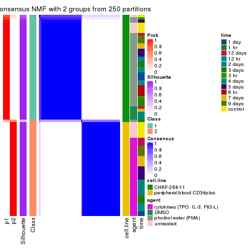</p>

</div>
<div id='tab-CV-NMF-consensus-heatmap-2'>
<pre><code class="r">consensus_heatmap(res, k = 3)
</code></pre>

<p></p>

</div>
<div id='tab-CV-NMF-consensus-heatmap-3'>
<pre><code class="r">consensus_heatmap(res, k = 4)
</code></pre>

<p></p>

</div>
<div id='tab-CV-NMF-consensus-heatmap-4'>
<pre><code class="r">consensus_heatmap(res, k = 5)
</code></pre>

<p></p>

</div>
<div id='tab-CV-NMF-consensus-heatmap-5'>
<pre><code class="r">consensus_heatmap(res, k = 6)
</code></pre>

<p></p>

</div>
</div>

Heatmaps for the membership of samples in all partitions to see how consistent they are:


<script>
$( function() {
	$( '#tabs-CV-NMF-membership-heatmap' ).tabs();
} );
</script>
<div id='tabs-CV-NMF-membership-heatmap'>
<ul>
<li><a href='#tab-CV-NMF-membership-heatmap-1'>k = 2</a></li>
<li><a href='#tab-CV-NMF-membership-heatmap-2'>k = 3</a></li>
<li><a href='#tab-CV-NMF-membership-heatmap-3'>k = 4</a></li>
<li><a href='#tab-CV-NMF-membership-heatmap-4'>k = 5</a></li>
<li><a href='#tab-CV-NMF-membership-heatmap-5'>k = 6</a></li>
</ul>
<div id='tab-CV-NMF-membership-heatmap-1'>
<pre><code class="r">membership_heatmap(res, k = 2)
</code></pre>

<p></p>

</div>
<div id='tab-CV-NMF-membership-heatmap-2'>
<pre><code class="r">membership_heatmap(res, k = 3)
</code></pre>

<p></p>

</div>
<div id='tab-CV-NMF-membership-heatmap-3'>
<pre><code class="r">membership_heatmap(res, k = 4)
</code></pre>

<p></p>

</div>
<div id='tab-CV-NMF-membership-heatmap-4'>
<pre><code class="r">membership_heatmap(res, k = 5)
</code></pre>

<p></p>

</div>
<div id='tab-CV-NMF-membership-heatmap-5'>
<pre><code class="r">membership_heatmap(res, k = 6)
</code></pre>

<p></p>

</div>
</div>

As soon as we have had the classes for columns, we can look for signatures
which are significantly different between classes which can be candidate marks
for certain classes. Following are the heatmaps for signatures.


Signature heatmaps where rows are scaled:


<script>
$( function() {
	$( '#tabs-CV-NMF-get-signatures' ).tabs();
} );
</script>
<div id='tabs-CV-NMF-get-signatures'>
<ul>
<li><a href='#tab-CV-NMF-get-signatures-1'>k = 2</a></li>
<li><a href='#tab-CV-NMF-get-signatures-2'>k = 3</a></li>
<li><a href='#tab-CV-NMF-get-signatures-3'>k = 4</a></li>
<li><a href='#tab-CV-NMF-get-signatures-4'>k = 5</a></li>
<li><a href='#tab-CV-NMF-get-signatures-5'>k = 6</a></li>
</ul>
<div id='tab-CV-NMF-get-signatures-1'>
<pre><code class="r">get_signatures(res, k = 2)
</code></pre>

<p></p>

</div>
<div id='tab-CV-NMF-get-signatures-2'>
<pre><code class="r">get_signatures(res, k = 3)
</code></pre>

<p></p>

</div>
<div id='tab-CV-NMF-get-signatures-3'>
<pre><code class="r">get_signatures(res, k = 4)
</code></pre>

<p></p>

</div>
<div id='tab-CV-NMF-get-signatures-4'>
<pre><code class="r">get_signatures(res, k = 5)
</code></pre>

<p></p>

</div>
<div id='tab-CV-NMF-get-signatures-5'>
<pre><code class="r">get_signatures(res, k = 6)
</code></pre>

<p></p>

</div>
</div>


Signature heatmaps where rows are not scaled:


<script>
$( function() {
	$( '#tabs-CV-NMF-get-signatures-no-scale' ).tabs();
} );
</script>
<div id='tabs-CV-NMF-get-signatures-no-scale'>
<ul>
<li><a href='#tab-CV-NMF-get-signatures-no-scale-1'>k = 2</a></li>
<li><a href='#tab-CV-NMF-get-signatures-no-scale-2'>k = 3</a></li>
<li><a href='#tab-CV-NMF-get-signatures-no-scale-3'>k = 4</a></li>
<li><a href='#tab-CV-NMF-get-signatures-no-scale-4'>k = 5</a></li>
<li><a href='#tab-CV-NMF-get-signatures-no-scale-5'>k = 6</a></li>
</ul>
<div id='tab-CV-NMF-get-signatures-no-scale-1'>
<pre><code class="r">get_signatures(res, k = 2, scale_rows = FALSE)
</code></pre>

<p></p>

</div>
<div id='tab-CV-NMF-get-signatures-no-scale-2'>
<pre><code class="r">get_signatures(res, k = 3, scale_rows = FALSE)
</code></pre>

<p></p>

</div>
<div id='tab-CV-NMF-get-signatures-no-scale-3'>
<pre><code class="r">get_signatures(res, k = 4, scale_rows = FALSE)
</code></pre>

<p></p>

</div>
<div id='tab-CV-NMF-get-signatures-no-scale-4'>
<pre><code class="r">get_signatures(res, k = 5, scale_rows = FALSE)
</code></pre>

<p></p>

</div>
<div id='tab-CV-NMF-get-signatures-no-scale-5'>
<pre><code class="r">get_signatures(res, k = 6, scale_rows = FALSE)
</code></pre>

<p></p>

</div>
</div>


Compare the overlap of signatures from different k:

```r
compare_signatures(res)
```


`get_signature()` returns a data frame invisibly. TO get the list of signatures, the function
call should be assigned to a variable explicitly. In following code, if `plot` argument is set
to `FALSE`, no heatmap is plotted while only the differential analysis is performed.

```r
# code only for demonstration
tb = get_signature(res, k = ..., plot = FALSE)
```

An example of the output of `tb` is:

```
#>   which_row         fdr    mean_1    mean_2 scaled_mean_1 scaled_mean_2 km
#> 1        38 0.042760348  8.373488  9.131774    -0.5533452     0.5164555  1
#> 2        40 0.018707592  7.106213  8.469186    -0.6173731     0.5762149  1
#> 3        55 0.019134737 10.221463 11.207825    -0.6159697     0.5749050  1
#> 4        59 0.006059896  5.921854  7.869574    -0.6899429     0.6439467  1
#> 5        60 0.018055526  8.928898 10.211722    -0.6204761     0.5791110  1
#> 6        98 0.009384629 15.714769 14.887706     0.6635654    -0.6193277  2
...
```

The columns in `tb` are:

1. `which_row`: row indices corresponding to the input matrix.
2. `fdr`: FDR for the differential test. 
3. `mean_x`: The mean value in group x.
4. `scaled_mean_x`: The mean value in group x after rows are scaled.
5. `km`: Row groups if k-means clustering is applied to rows.


UMAP plot which shows how samples are separated.


<script>
$( function() {
	$( '#tabs-CV-NMF-dimension-reduction' ).tabs();
} );
</script>
<div id='tabs-CV-NMF-dimension-reduction'>
<ul>
<li><a href='#tab-CV-NMF-dimension-reduction-1'>k = 2</a></li>
<li><a href='#tab-CV-NMF-dimension-reduction-2'>k = 3</a></li>
<li><a href='#tab-CV-NMF-dimension-reduction-3'>k = 4</a></li>
<li><a href='#tab-CV-NMF-dimension-reduction-4'>k = 5</a></li>
<li><a href='#tab-CV-NMF-dimension-reduction-5'>k = 6</a></li>
</ul>
<div id='tab-CV-NMF-dimension-reduction-1'>
<pre><code class="r">dimension_reduction(res, k = 2, method = &quot;UMAP&quot;)
</code></pre>

<p></p>

</div>
<div id='tab-CV-NMF-dimension-reduction-2'>
<pre><code class="r">dimension_reduction(res, k = 3, method = &quot;UMAP&quot;)
</code></pre>

<p></p>

</div>
<div id='tab-CV-NMF-dimension-reduction-3'>
<pre><code class="r">dimension_reduction(res, k = 4, method = &quot;UMAP&quot;)
</code></pre>

<p></p>

</div>
<div id='tab-CV-NMF-dimension-reduction-4'>
<pre><code class="r">dimension_reduction(res, k = 5, method = &quot;UMAP&quot;)
</code></pre>

<p></p>

</div>
<div id='tab-CV-NMF-dimension-reduction-5'>
<pre><code class="r">dimension_reduction(res, k = 6, method = &quot;UMAP&quot;)
</code></pre>

<p></p>

</div>
</div>


Following heatmap shows how subgroups are split when increasing `k`:

```r
collect_classes(res)
```


Test correlation between subgroups and known annotations. If the known
annotation is numeric, one-way ANOVA test is applied, and if the known
annotation is discrete, chi-squared contingency table test is applied.

```r
test_to_known_factors(res)
```

```
#>         n cell.line(p) agent(p)  time(p) k
#> CV:NMF 76     2.11e-17 4.87e-14 4.30e-01 2
#> CV:NMF 75     9.29e-15 9.66e-13 3.52e-02 3
#> CV:NMF 70     4.27e-15 3.04e-11 4.69e-02 4
#> CV:NMF 67     9.75e-14 4.98e-10 3.96e-03 5
#> CV:NMF 37     4.60e-08 6.93e-07 6.23e-05 6
```


If matrix rows can be associated to genes, consider to use `GO_Enrichment(res,
...)` to perform function enrichment for the signature genes.


 

---------------------------------------------------


### MAD:hclust*


The object with results only for a single top-value method and a single partition method 
can be extracted as:

```r
res = res_list["MAD", "hclust"]
# you can also extract it by
# res = res_list["MAD:hclust"]
```

A summary of `res` and all the functions that can be applied to it:

```r
res
```

```
#> A 'ConsensusPartition' object with k = 2, 3, 4, 5, 6.
#>   On a matrix with 18792 rows and 77 columns.
#>   Top rows (1000, 2000, 3000, 4000, 5000) are extracted by 'MAD' method.
#>   Subgroups are detected by 'hclust' method.
#>   Performed in total 1250 partitions by row resampling.
#>   Best k for subgroups seems to be 3.
#> 
#> Following methods can be applied to this 'ConsensusPartition' object:
#>  [1] "cola_report"             "collect_classes"         "collect_plots"          
#>  [4] "collect_stats"           "colnames"                "compare_signatures"     
#>  [7] "consensus_heatmap"       "dimension_reduction"     "functional_enrichment"  
#> [10] "get_anno_col"            "get_anno"                "get_classes"            
#> [13] "get_consensus"           "get_matrix"              "get_membership"         
#> [16] "get_param"               "get_signatures"          "get_stats"              
#> [19] "is_best_k"               "is_stable_k"             "membership_heatmap"     
#> [22] "ncol"                    "nrow"                    "plot_ecdf"              
#> [25] "rownames"                "select_partition_number" "show"                   
#> [28] "suggest_best_k"          "test_to_known_factors"
```

`collect_plots()` function collects all the plots made from `res` for all `k` (number of partitions)
into one single page to provide an easy and fast comparison between different `k`.

```r
collect_plots(res)
```


The plots are:

- The first row: a plot of the ECDF (Empirical cumulative distribution
  function) curves of the consensus matrix for each `k` and the heatmap of
  predicted classes for each `k`.
- The second row: heatmaps of the consensus matrix for each `k`.
- The third row: heatmaps of the membership matrix for each `k`.
- The fouth row: heatmaps of the signatures for each `k`.

All the plots in panels can be made by individual functions and they are
plotted later in this section.

`select_partition_number()` produces several plots showing different
statistics for choosing "optimized" `k`. There are following statistics:

- ECDF curves of the consensus matrix for each `k`;
- 1-PAC. [The PAC
  score](https://en.wikipedia.org/wiki/Consensus_clustering#Over-interpretation_potential_of_consensus_clustering)
  measures the proportion of the ambiguous subgrouping.
- Mean silhouette score.
- Concordance. The mean probability of fiting the consensus class ids in all
  partitions.
- Area increased. Denote $A_k$ as the area under the ECDF curve for current
  `k`, the area increased is defined as $A_k - A_{k-1}$.
- Rand index. The percent of pairs of samples that are both in a same cluster
  or both are not in a same cluster in the partition of k and k-1.
- Jaccard index. The ratio of pairs of samples are both in a same cluster in
  the partition of k and k-1 and the pairs of samples are both in a same
  cluster in the partition k or k-1.

The detailed explanations of these statistics can be found in [the cola
vignette](http://bioconductor.org/packages/devel/bioc/vignettes/cola/inst/doc/cola.html#toc_13).

Generally speaking, lower PAC score, higher mean silhouette score or higher
concordance corresponds to better partition. Rand index and Jaccard index
measure how similar the current partition is compared to partition with `k-1`.
If they are too similar, we won't accept `k` is better than `k-1`.

```r
select_partition_number(res)
```


The numeric values for all these statistics can be obtained by `get_stats()`.

```r
get_stats(res)
```

```
#>   k 1-PAC mean_silhouette concordance area_increased  Rand Jaccard
#> 2 2 1.000           1.000       1.000         0.5049 0.496   0.496
#> 3 3 0.921           0.903       0.950         0.1819 0.923   0.846
#> 4 4 0.721           0.844       0.894         0.2165 0.857   0.659
#> 5 5 0.814           0.848       0.893         0.0649 0.955   0.837
#> 6 6 0.842           0.854       0.882         0.0368 0.959   0.822
```

`suggest_best_k()` suggests the best $k$ based on these statistics. The rules are as follows:

- All $k$ with Jaccard index larger than 0.95 are removed because the increase of
  the partition number does not provides enough extra information. If all $k$ are removed,
  the best $k$ is assigned by `NA`.
- For $k$ with 1-PAC larger than 0.9, the maximal $k$ is taken as the "best k". Other $k$ is called "optional k".
- If it does not fit the second rule. The $k$ with the highest vote of highest
  1-PAC, mean silhouette and concordance is taken as the "best k".

```r
suggest_best_k(res)
```

```
#> [1] 3
#> attr(,"optional")
#> [1] 2
```

There is also optional best $k$ = 2 that is worth to check.

Following shows the table of the partitions (You need to click the **show/hide
code output** link to see it). The membership matrix (columns with name `p*`)
is inferred by
[`clue::cl_consensus()`](https://www.rdocumentation.org/link/cl_consensus?package=clue)
function with the `SE` method. Basically the value in the membership matrix
represents the probability to belong to a certain group. The finall class
label for an item is determined with the group with highest probability it
belongs to.

In `get_classes()` function, the entropy is calculated from the membership
matrix and the silhouette score is calculated from the consensus matrix.


<script>
$( function() {
	$( '#tabs-MAD-hclust-get-classes' ).tabs();
} );
</script>
<div id='tabs-MAD-hclust-get-classes'>
<ul>
<li><a href='#tab-MAD-hclust-get-classes-1'>k = 2</a></li>
<li><a href='#tab-MAD-hclust-get-classes-2'>k = 3</a></li>
<li><a href='#tab-MAD-hclust-get-classes-3'>k = 4</a></li>
<li><a href='#tab-MAD-hclust-get-classes-4'>k = 5</a></li>
<li><a href='#tab-MAD-hclust-get-classes-5'>k = 6</a></li>
</ul>

<div id='tab-MAD-hclust-get-classes-1'>
<p><a id='tab-MAD-hclust-get-classes-1-a' style='color:#0366d6' href='#'>show/hide code output</a></p>
<pre><code class="r">cbind(get_classes(res, k = 2), get_membership(res, k = 2))
</code></pre>

<pre><code>#&gt;          class entropy silhouette p1 p2
#&gt; GSM87962     1       0          1  1  0
#&gt; GSM87963     1       0          1  1  0
#&gt; GSM87983     1       0          1  1  0
#&gt; GSM87984     1       0          1  1  0
#&gt; GSM87961     1       0          1  1  0
#&gt; GSM87970     1       0          1  1  0
#&gt; GSM87971     1       0          1  1  0
#&gt; GSM87990     1       0          1  1  0
#&gt; GSM87991     1       0          1  1  0
#&gt; GSM87974     1       0          1  1  0
#&gt; GSM87994     1       0          1  1  0
#&gt; GSM87978     1       0          1  1  0
#&gt; GSM87979     1       0          1  1  0
#&gt; GSM87998     1       0          1  1  0
#&gt; GSM87999     1       0          1  1  0
#&gt; GSM87968     1       0          1  1  0
#&gt; GSM87987     1       0          1  1  0
#&gt; GSM87969     1       0          1  1  0
#&gt; GSM87988     1       0          1  1  0
#&gt; GSM87989     1       0          1  1  0
#&gt; GSM87972     1       0          1  1  0
#&gt; GSM87992     1       0          1  1  0
#&gt; GSM87973     1       0          1  1  0
#&gt; GSM87993     1       0          1  1  0
#&gt; GSM87975     1       0          1  1  0
#&gt; GSM87995     1       0          1  1  0
#&gt; GSM87976     1       0          1  1  0
#&gt; GSM87977     1       0          1  1  0
#&gt; GSM87996     1       0          1  1  0
#&gt; GSM87997     1       0          1  1  0
#&gt; GSM87980     1       0          1  1  0
#&gt; GSM88000     1       0          1  1  0
#&gt; GSM87981     1       0          1  1  0
#&gt; GSM87982     1       0          1  1  0
#&gt; GSM88001     1       0          1  1  0
#&gt; GSM87967     1       0          1  1  0
#&gt; GSM87964     1       0          1  1  0
#&gt; GSM87965     1       0          1  1  0
#&gt; GSM87966     1       0          1  1  0
#&gt; GSM87985     1       0          1  1  0
#&gt; GSM87986     1       0          1  1  0
#&gt; GSM88004     2       0          1  0  1
#&gt; GSM88015     2       0          1  0  1
#&gt; GSM88005     2       0          1  0  1
#&gt; GSM88006     2       0          1  0  1
#&gt; GSM88016     2       0          1  0  1
#&gt; GSM88007     2       0          1  0  1
#&gt; GSM88017     2       0          1  0  1
#&gt; GSM88029     2       0          1  0  1
#&gt; GSM88008     2       0          1  0  1
#&gt; GSM88009     2       0          1  0  1
#&gt; GSM88018     2       0          1  0  1
#&gt; GSM88024     2       0          1  0  1
#&gt; GSM88030     2       0          1  0  1
#&gt; GSM88036     2       0          1  0  1
#&gt; GSM88010     2       0          1  0  1
#&gt; GSM88011     2       0          1  0  1
#&gt; GSM88019     2       0          1  0  1
#&gt; GSM88027     2       0          1  0  1
#&gt; GSM88031     2       0          1  0  1
#&gt; GSM88012     2       0          1  0  1
#&gt; GSM88020     2       0          1  0  1
#&gt; GSM88032     2       0          1  0  1
#&gt; GSM88037     2       0          1  0  1
#&gt; GSM88013     2       0          1  0  1
#&gt; GSM88021     2       0          1  0  1
#&gt; GSM88025     2       0          1  0  1
#&gt; GSM88033     2       0          1  0  1
#&gt; GSM88014     2       0          1  0  1
#&gt; GSM88022     2       0          1  0  1
#&gt; GSM88034     2       0          1  0  1
#&gt; GSM88002     2       0          1  0  1
#&gt; GSM88003     2       0          1  0  1
#&gt; GSM88023     2       0          1  0  1
#&gt; GSM88026     2       0          1  0  1
#&gt; GSM88028     2       0          1  0  1
#&gt; GSM88035     2       0          1  0  1
</code></pre>

<script>
$('#tab-MAD-hclust-get-classes-1-a').parent().next().next().hide();
$('#tab-MAD-hclust-get-classes-1-a').click(function(){
  $('#tab-MAD-hclust-get-classes-1-a').parent().next().next().toggle();
  return(false);
});
</script>
</div>

<div id='tab-MAD-hclust-get-classes-2'>
<p><a id='tab-MAD-hclust-get-classes-2-a' style='color:#0366d6' href='#'>show/hide code output</a></p>
<pre><code class="r">cbind(get_classes(res, k = 3), get_membership(res, k = 3))
</code></pre>

<pre><code>#&gt;          class entropy silhouette p1    p2    p3
#&gt; GSM87962     1  0.0000      1.000  1 0.000 0.000
#&gt; GSM87963     1  0.0000      1.000  1 0.000 0.000
#&gt; GSM87983     1  0.0000      1.000  1 0.000 0.000
#&gt; GSM87984     1  0.0000      1.000  1 0.000 0.000
#&gt; GSM87961     1  0.0000      1.000  1 0.000 0.000
#&gt; GSM87970     1  0.0000      1.000  1 0.000 0.000
#&gt; GSM87971     1  0.0000      1.000  1 0.000 0.000
#&gt; GSM87990     1  0.0000      1.000  1 0.000 0.000
#&gt; GSM87991     1  0.0000      1.000  1 0.000 0.000
#&gt; GSM87974     1  0.0000      1.000  1 0.000 0.000
#&gt; GSM87994     1  0.0000      1.000  1 0.000 0.000
#&gt; GSM87978     1  0.0000      1.000  1 0.000 0.000
#&gt; GSM87979     1  0.0000      1.000  1 0.000 0.000
#&gt; GSM87998     1  0.0000      1.000  1 0.000 0.000
#&gt; GSM87999     1  0.0000      1.000  1 0.000 0.000
#&gt; GSM87968     1  0.0000      1.000  1 0.000 0.000
#&gt; GSM87987     1  0.0000      1.000  1 0.000 0.000
#&gt; GSM87969     1  0.0000      1.000  1 0.000 0.000
#&gt; GSM87988     1  0.0000      1.000  1 0.000 0.000
#&gt; GSM87989     1  0.0000      1.000  1 0.000 0.000
#&gt; GSM87972     1  0.0000      1.000  1 0.000 0.000
#&gt; GSM87992     1  0.0000      1.000  1 0.000 0.000
#&gt; GSM87973     1  0.0000      1.000  1 0.000 0.000
#&gt; GSM87993     1  0.0000      1.000  1 0.000 0.000
#&gt; GSM87975     1  0.0000      1.000  1 0.000 0.000
#&gt; GSM87995     1  0.0000      1.000  1 0.000 0.000
#&gt; GSM87976     1  0.0000      1.000  1 0.000 0.000
#&gt; GSM87977     1  0.0000      1.000  1 0.000 0.000
#&gt; GSM87996     1  0.0000      1.000  1 0.000 0.000
#&gt; GSM87997     1  0.0000      1.000  1 0.000 0.000
#&gt; GSM87980     1  0.0000      1.000  1 0.000 0.000
#&gt; GSM88000     1  0.0000      1.000  1 0.000 0.000
#&gt; GSM87981     1  0.0000      1.000  1 0.000 0.000
#&gt; GSM87982     1  0.0000      1.000  1 0.000 0.000
#&gt; GSM88001     1  0.0000      1.000  1 0.000 0.000
#&gt; GSM87967     1  0.0000      1.000  1 0.000 0.000
#&gt; GSM87964     1  0.0000      1.000  1 0.000 0.000
#&gt; GSM87965     1  0.0000      1.000  1 0.000 0.000
#&gt; GSM87966     1  0.0000      1.000  1 0.000 0.000
#&gt; GSM87985     1  0.0000      1.000  1 0.000 0.000
#&gt; GSM87986     1  0.0000      1.000  1 0.000 0.000
#&gt; GSM88004     2  0.0000      0.845  0 1.000 0.000
#&gt; GSM88015     2  0.0000      0.845  0 1.000 0.000
#&gt; GSM88005     2  0.0000      0.845  0 1.000 0.000
#&gt; GSM88006     2  0.0000      0.845  0 1.000 0.000
#&gt; GSM88016     2  0.0000      0.845  0 1.000 0.000
#&gt; GSM88007     2  0.0000      0.845  0 1.000 0.000
#&gt; GSM88017     2  0.0000      0.845  0 1.000 0.000
#&gt; GSM88029     2  0.0592      0.840  0 0.988 0.012
#&gt; GSM88008     2  0.0000      0.845  0 1.000 0.000
#&gt; GSM88009     2  0.0000      0.845  0 1.000 0.000
#&gt; GSM88018     2  0.0000      0.845  0 1.000 0.000
#&gt; GSM88024     2  0.0000      0.845  0 1.000 0.000
#&gt; GSM88030     2  0.6140      0.475  0 0.596 0.404
#&gt; GSM88036     2  0.6140      0.475  0 0.596 0.404
#&gt; GSM88010     2  0.6192      0.496  0 0.580 0.420
#&gt; GSM88011     2  0.6192      0.496  0 0.580 0.420
#&gt; GSM88019     2  0.5098      0.689  0 0.752 0.248
#&gt; GSM88027     2  0.5098      0.689  0 0.752 0.248
#&gt; GSM88031     3  0.0000      1.000  0 0.000 1.000
#&gt; GSM88012     2  0.6192      0.496  0 0.580 0.420
#&gt; GSM88020     3  0.0000      1.000  0 0.000 1.000
#&gt; GSM88032     3  0.0000      1.000  0 0.000 1.000
#&gt; GSM88037     3  0.0000      1.000  0 0.000 1.000
#&gt; GSM88013     2  0.6192      0.496  0 0.580 0.420
#&gt; GSM88021     3  0.0000      1.000  0 0.000 1.000
#&gt; GSM88025     3  0.0000      1.000  0 0.000 1.000
#&gt; GSM88033     3  0.0000      1.000  0 0.000 1.000
#&gt; GSM88014     2  0.6192      0.496  0 0.580 0.420
#&gt; GSM88022     2  0.6192      0.496  0 0.580 0.420
#&gt; GSM88034     3  0.0000      1.000  0 0.000 1.000
#&gt; GSM88002     2  0.0000      0.845  0 1.000 0.000
#&gt; GSM88003     2  0.0000      0.845  0 1.000 0.000
#&gt; GSM88023     2  0.0000      0.845  0 1.000 0.000
#&gt; GSM88026     2  0.0000      0.845  0 1.000 0.000
#&gt; GSM88028     2  0.0000      0.845  0 1.000 0.000
#&gt; GSM88035     2  0.0000      0.845  0 1.000 0.000
</code></pre>

<script>
$('#tab-MAD-hclust-get-classes-2-a').parent().next().next().hide();
$('#tab-MAD-hclust-get-classes-2-a').click(function(){
  $('#tab-MAD-hclust-get-classes-2-a').parent().next().next().toggle();
  return(false);
});
</script>
</div>

<div id='tab-MAD-hclust-get-classes-3'>
<p><a id='tab-MAD-hclust-get-classes-3-a' style='color:#0366d6' href='#'>show/hide code output</a></p>
<pre><code class="r">cbind(get_classes(res, k = 4), get_membership(res, k = 4))
</code></pre>

<pre><code>#&gt;          class entropy silhouette    p1    p2    p3    p4
#&gt; GSM87962     1  0.2647      0.947 0.880 0.000 0.120 0.000
#&gt; GSM87963     1  0.2647      0.947 0.880 0.000 0.120 0.000
#&gt; GSM87983     1  0.2647      0.947 0.880 0.000 0.120 0.000
#&gt; GSM87984     1  0.2647      0.947 0.880 0.000 0.120 0.000
#&gt; GSM87961     1  0.2647      0.947 0.880 0.000 0.120 0.000
#&gt; GSM87970     1  0.2589      0.945 0.884 0.000 0.116 0.000
#&gt; GSM87971     1  0.2589      0.945 0.884 0.000 0.116 0.000
#&gt; GSM87990     1  0.2647      0.947 0.880 0.000 0.120 0.000
#&gt; GSM87991     1  0.2647      0.947 0.880 0.000 0.120 0.000
#&gt; GSM87974     1  0.2647      0.944 0.880 0.000 0.120 0.000
#&gt; GSM87994     3  0.1940      0.905 0.076 0.000 0.924 0.000
#&gt; GSM87978     1  0.4250      0.792 0.724 0.000 0.276 0.000
#&gt; GSM87979     1  0.4277      0.789 0.720 0.000 0.280 0.000
#&gt; GSM87998     3  0.1940      0.905 0.076 0.000 0.924 0.000
#&gt; GSM87999     3  0.1940      0.905 0.076 0.000 0.924 0.000
#&gt; GSM87968     1  0.4250      0.792 0.724 0.000 0.276 0.000
#&gt; GSM87987     3  0.4454      0.449 0.308 0.000 0.692 0.000
#&gt; GSM87969     1  0.4855      0.557 0.600 0.000 0.400 0.000
#&gt; GSM87988     3  0.1474      0.927 0.052 0.000 0.948 0.000
#&gt; GSM87989     3  0.1474      0.927 0.052 0.000 0.948 0.000
#&gt; GSM87972     3  0.0000      0.963 0.000 0.000 1.000 0.000
#&gt; GSM87992     3  0.0000      0.963 0.000 0.000 1.000 0.000
#&gt; GSM87973     3  0.0000      0.963 0.000 0.000 1.000 0.000
#&gt; GSM87993     3  0.0000      0.963 0.000 0.000 1.000 0.000
#&gt; GSM87975     3  0.0000      0.963 0.000 0.000 1.000 0.000
#&gt; GSM87995     3  0.0000      0.963 0.000 0.000 1.000 0.000
#&gt; GSM87976     3  0.0000      0.963 0.000 0.000 1.000 0.000
#&gt; GSM87977     3  0.0000      0.963 0.000 0.000 1.000 0.000
#&gt; GSM87996     3  0.0000      0.963 0.000 0.000 1.000 0.000
#&gt; GSM87997     3  0.0000      0.963 0.000 0.000 1.000 0.000
#&gt; GSM87980     3  0.0000      0.963 0.000 0.000 1.000 0.000
#&gt; GSM88000     3  0.0000      0.963 0.000 0.000 1.000 0.000
#&gt; GSM87981     3  0.0000      0.963 0.000 0.000 1.000 0.000
#&gt; GSM87982     3  0.0000      0.963 0.000 0.000 1.000 0.000
#&gt; GSM88001     3  0.0000      0.963 0.000 0.000 1.000 0.000
#&gt; GSM87967     3  0.0000      0.963 0.000 0.000 1.000 0.000
#&gt; GSM87964     1  0.2589      0.945 0.884 0.000 0.116 0.000
#&gt; GSM87965     1  0.2647      0.947 0.880 0.000 0.120 0.000
#&gt; GSM87966     1  0.2647      0.947 0.880 0.000 0.120 0.000
#&gt; GSM87985     1  0.2647      0.947 0.880 0.000 0.120 0.000
#&gt; GSM87986     1  0.2647      0.947 0.880 0.000 0.120 0.000
#&gt; GSM88004     2  0.0000      0.814 0.000 1.000 0.000 0.000
#&gt; GSM88015     2  0.0000      0.814 0.000 1.000 0.000 0.000
#&gt; GSM88005     2  0.0000      0.814 0.000 1.000 0.000 0.000
#&gt; GSM88006     2  0.0000      0.814 0.000 1.000 0.000 0.000
#&gt; GSM88016     2  0.0000      0.814 0.000 1.000 0.000 0.000
#&gt; GSM88007     2  0.0000      0.814 0.000 1.000 0.000 0.000
#&gt; GSM88017     2  0.0000      0.814 0.000 1.000 0.000 0.000
#&gt; GSM88029     2  0.0469      0.811 0.000 0.988 0.000 0.012
#&gt; GSM88008     2  0.0000      0.814 0.000 1.000 0.000 0.000
#&gt; GSM88009     2  0.0000      0.814 0.000 1.000 0.000 0.000
#&gt; GSM88018     2  0.0000      0.814 0.000 1.000 0.000 0.000
#&gt; GSM88024     2  0.0000      0.814 0.000 1.000 0.000 0.000
#&gt; GSM88030     2  0.4866      0.454 0.000 0.596 0.000 0.404
#&gt; GSM88036     2  0.4866      0.454 0.000 0.596 0.000 0.404
#&gt; GSM88010     2  0.4907      0.472 0.000 0.580 0.000 0.420
#&gt; GSM88011     2  0.4907      0.472 0.000 0.580 0.000 0.420
#&gt; GSM88019     2  0.4040      0.671 0.000 0.752 0.000 0.248
#&gt; GSM88027     2  0.4040      0.671 0.000 0.752 0.000 0.248
#&gt; GSM88031     4  0.0000      1.000 0.000 0.000 0.000 1.000
#&gt; GSM88012     2  0.4907      0.472 0.000 0.580 0.000 0.420
#&gt; GSM88020     4  0.0000      1.000 0.000 0.000 0.000 1.000
#&gt; GSM88032     4  0.0000      1.000 0.000 0.000 0.000 1.000
#&gt; GSM88037     4  0.0000      1.000 0.000 0.000 0.000 1.000
#&gt; GSM88013     2  0.4907      0.472 0.000 0.580 0.000 0.420
#&gt; GSM88021     4  0.0000      1.000 0.000 0.000 0.000 1.000
#&gt; GSM88025     4  0.0000      1.000 0.000 0.000 0.000 1.000
#&gt; GSM88033     4  0.0000      1.000 0.000 0.000 0.000 1.000
#&gt; GSM88014     2  0.4907      0.472 0.000 0.580 0.000 0.420
#&gt; GSM88022     2  0.4907      0.472 0.000 0.580 0.000 0.420
#&gt; GSM88034     4  0.0000      1.000 0.000 0.000 0.000 1.000
#&gt; GSM88002     2  0.2589      0.772 0.116 0.884 0.000 0.000
#&gt; GSM88003     2  0.2589      0.772 0.116 0.884 0.000 0.000
#&gt; GSM88023     2  0.2589      0.772 0.116 0.884 0.000 0.000
#&gt; GSM88026     2  0.2589      0.772 0.116 0.884 0.000 0.000
#&gt; GSM88028     2  0.2589      0.772 0.116 0.884 0.000 0.000
#&gt; GSM88035     2  0.2589      0.772 0.116 0.884 0.000 0.000
</code></pre>

<script>
$('#tab-MAD-hclust-get-classes-3-a').parent().next().next().hide();
$('#tab-MAD-hclust-get-classes-3-a').click(function(){
  $('#tab-MAD-hclust-get-classes-3-a').parent().next().next().toggle();
  return(false);
});
</script>
</div>

<div id='tab-MAD-hclust-get-classes-4'>
<p><a id='tab-MAD-hclust-get-classes-4-a' style='color:#0366d6' href='#'>show/hide code output</a></p>
<pre><code class="r">cbind(get_classes(res, k = 5), get_membership(res, k = 5))
</code></pre>

<pre><code>#&gt;          class entropy silhouette    p1    p2    p3    p4    p5
#&gt; GSM87962     1  0.0000      0.945 1.000 0.000 0.000 0.000 0.000
#&gt; GSM87963     1  0.0000      0.945 1.000 0.000 0.000 0.000 0.000
#&gt; GSM87983     1  0.0000      0.945 1.000 0.000 0.000 0.000 0.000
#&gt; GSM87984     1  0.0000      0.945 1.000 0.000 0.000 0.000 0.000
#&gt; GSM87961     1  0.0000      0.945 1.000 0.000 0.000 0.000 0.000
#&gt; GSM87970     1  0.0162      0.944 0.996 0.000 0.000 0.000 0.004
#&gt; GSM87971     1  0.0162      0.944 0.996 0.000 0.000 0.000 0.004
#&gt; GSM87990     1  0.0000      0.945 1.000 0.000 0.000 0.000 0.000
#&gt; GSM87991     1  0.0000      0.945 1.000 0.000 0.000 0.000 0.000
#&gt; GSM87974     1  0.0324      0.942 0.992 0.000 0.004 0.000 0.004
#&gt; GSM87994     3  0.2230      0.869 0.116 0.000 0.884 0.000 0.000
#&gt; GSM87978     1  0.2890      0.811 0.836 0.000 0.160 0.000 0.004
#&gt; GSM87979     1  0.2732      0.811 0.840 0.000 0.160 0.000 0.000
#&gt; GSM87998     3  0.2230      0.869 0.116 0.000 0.884 0.000 0.000
#&gt; GSM87999     3  0.2230      0.869 0.116 0.000 0.884 0.000 0.000
#&gt; GSM87968     1  0.2890      0.811 0.836 0.000 0.160 0.000 0.004
#&gt; GSM87987     3  0.4242      0.244 0.428 0.000 0.572 0.000 0.000
#&gt; GSM87969     1  0.3684      0.625 0.720 0.000 0.280 0.000 0.000
#&gt; GSM87988     3  0.1908      0.888 0.092 0.000 0.908 0.000 0.000
#&gt; GSM87989     3  0.1908      0.888 0.092 0.000 0.908 0.000 0.000
#&gt; GSM87972     3  0.0000      0.946 0.000 0.000 1.000 0.000 0.000
#&gt; GSM87992     3  0.0000      0.946 0.000 0.000 1.000 0.000 0.000
#&gt; GSM87973     3  0.0000      0.946 0.000 0.000 1.000 0.000 0.000
#&gt; GSM87993     3  0.0000      0.946 0.000 0.000 1.000 0.000 0.000
#&gt; GSM87975     3  0.0000      0.946 0.000 0.000 1.000 0.000 0.000
#&gt; GSM87995     3  0.0000      0.946 0.000 0.000 1.000 0.000 0.000
#&gt; GSM87976     3  0.0000      0.946 0.000 0.000 1.000 0.000 0.000
#&gt; GSM87977     3  0.0000      0.946 0.000 0.000 1.000 0.000 0.000
#&gt; GSM87996     3  0.0000      0.946 0.000 0.000 1.000 0.000 0.000
#&gt; GSM87997     3  0.0000      0.946 0.000 0.000 1.000 0.000 0.000
#&gt; GSM87980     3  0.0000      0.946 0.000 0.000 1.000 0.000 0.000
#&gt; GSM88000     3  0.0000      0.946 0.000 0.000 1.000 0.000 0.000
#&gt; GSM87981     3  0.0000      0.946 0.000 0.000 1.000 0.000 0.000
#&gt; GSM87982     3  0.0000      0.946 0.000 0.000 1.000 0.000 0.000
#&gt; GSM88001     3  0.0000      0.946 0.000 0.000 1.000 0.000 0.000
#&gt; GSM87967     3  0.0000      0.946 0.000 0.000 1.000 0.000 0.000
#&gt; GSM87964     1  0.0162      0.944 0.996 0.000 0.000 0.000 0.004
#&gt; GSM87965     1  0.0000      0.945 1.000 0.000 0.000 0.000 0.000
#&gt; GSM87966     1  0.0000      0.945 1.000 0.000 0.000 0.000 0.000
#&gt; GSM87985     1  0.0000      0.945 1.000 0.000 0.000 0.000 0.000
#&gt; GSM87986     1  0.0000      0.945 1.000 0.000 0.000 0.000 0.000
#&gt; GSM88004     2  0.2377      0.732 0.000 0.872 0.000 0.000 0.128
#&gt; GSM88015     2  0.2377      0.732 0.000 0.872 0.000 0.000 0.128
#&gt; GSM88005     2  0.2377      0.732 0.000 0.872 0.000 0.000 0.128
#&gt; GSM88006     2  0.2377      0.732 0.000 0.872 0.000 0.000 0.128
#&gt; GSM88016     2  0.2377      0.732 0.000 0.872 0.000 0.000 0.128
#&gt; GSM88007     2  0.2377      0.732 0.000 0.872 0.000 0.000 0.128
#&gt; GSM88017     2  0.2377      0.732 0.000 0.872 0.000 0.000 0.128
#&gt; GSM88029     2  0.1851      0.728 0.000 0.912 0.000 0.000 0.088
#&gt; GSM88008     2  0.2377      0.732 0.000 0.872 0.000 0.000 0.128
#&gt; GSM88009     2  0.2377      0.732 0.000 0.872 0.000 0.000 0.128
#&gt; GSM88018     2  0.2377      0.732 0.000 0.872 0.000 0.000 0.128
#&gt; GSM88024     2  0.2377      0.732 0.000 0.872 0.000 0.000 0.128
#&gt; GSM88030     2  0.5125      0.546 0.000 0.696 0.000 0.148 0.156
#&gt; GSM88036     2  0.5125      0.546 0.000 0.696 0.000 0.148 0.156
#&gt; GSM88010     2  0.3895      0.569 0.000 0.680 0.000 0.320 0.000
#&gt; GSM88011     2  0.3895      0.569 0.000 0.680 0.000 0.320 0.000
#&gt; GSM88019     2  0.2605      0.681 0.000 0.852 0.000 0.148 0.000
#&gt; GSM88027     2  0.2605      0.681 0.000 0.852 0.000 0.148 0.000
#&gt; GSM88031     4  0.0000      0.977 0.000 0.000 0.000 1.000 0.000
#&gt; GSM88012     2  0.3895      0.569 0.000 0.680 0.000 0.320 0.000
#&gt; GSM88020     4  0.0000      0.977 0.000 0.000 0.000 1.000 0.000
#&gt; GSM88032     4  0.0000      0.977 0.000 0.000 0.000 1.000 0.000
#&gt; GSM88037     4  0.0000      0.977 0.000 0.000 0.000 1.000 0.000
#&gt; GSM88013     2  0.3895      0.569 0.000 0.680 0.000 0.320 0.000
#&gt; GSM88021     4  0.0000      0.977 0.000 0.000 0.000 1.000 0.000
#&gt; GSM88025     4  0.0000      0.977 0.000 0.000 0.000 1.000 0.000
#&gt; GSM88033     4  0.0000      0.977 0.000 0.000 0.000 1.000 0.000
#&gt; GSM88014     2  0.3895      0.569 0.000 0.680 0.000 0.320 0.000
#&gt; GSM88022     2  0.3895      0.569 0.000 0.680 0.000 0.320 0.000
#&gt; GSM88034     4  0.2690      0.829 0.000 0.000 0.000 0.844 0.156
#&gt; GSM88002     5  0.2732      1.000 0.000 0.160 0.000 0.000 0.840
#&gt; GSM88003     5  0.2732      1.000 0.000 0.160 0.000 0.000 0.840
#&gt; GSM88023     5  0.2732      1.000 0.000 0.160 0.000 0.000 0.840
#&gt; GSM88026     5  0.2732      1.000 0.000 0.160 0.000 0.000 0.840
#&gt; GSM88028     5  0.2732      1.000 0.000 0.160 0.000 0.000 0.840
#&gt; GSM88035     5  0.2732      1.000 0.000 0.160 0.000 0.000 0.840
</code></pre>

<script>
$('#tab-MAD-hclust-get-classes-4-a').parent().next().next().hide();
$('#tab-MAD-hclust-get-classes-4-a').click(function(){
  $('#tab-MAD-hclust-get-classes-4-a').parent().next().next().toggle();
  return(false);
});
</script>
</div>

<div id='tab-MAD-hclust-get-classes-5'>
<p><a id='tab-MAD-hclust-get-classes-5-a' style='color:#0366d6' href='#'>show/hide code output</a></p>
<pre><code class="r">cbind(get_classes(res, k = 6), get_membership(res, k = 6))
</code></pre>

<pre><code>#&gt;          class entropy silhouette    p1    p2    p3    p4    p5    p6
#&gt; GSM87962     1  0.0000     0.9124 1.000 0.000 0.000 0.000 0.000 0.000
#&gt; GSM87963     1  0.0000     0.9124 1.000 0.000 0.000 0.000 0.000 0.000
#&gt; GSM87983     1  0.0000     0.9124 1.000 0.000 0.000 0.000 0.000 0.000
#&gt; GSM87984     1  0.0000     0.9124 1.000 0.000 0.000 0.000 0.000 0.000
#&gt; GSM87961     1  0.0000     0.9124 1.000 0.000 0.000 0.000 0.000 0.000
#&gt; GSM87970     1  0.2520     0.8531 0.844 0.152 0.000 0.000 0.004 0.000
#&gt; GSM87971     1  0.2520     0.8531 0.844 0.152 0.000 0.000 0.004 0.000
#&gt; GSM87990     1  0.2178     0.8630 0.868 0.132 0.000 0.000 0.000 0.000
#&gt; GSM87991     1  0.0000     0.9124 1.000 0.000 0.000 0.000 0.000 0.000
#&gt; GSM87974     1  0.2631     0.8528 0.840 0.152 0.000 0.000 0.008 0.000
#&gt; GSM87994     3  0.3700     0.8028 0.116 0.076 0.800 0.000 0.008 0.000
#&gt; GSM87978     1  0.3473     0.8153 0.824 0.088 0.076 0.000 0.012 0.000
#&gt; GSM87979     1  0.3318     0.8148 0.836 0.076 0.076 0.000 0.012 0.000
#&gt; GSM87998     3  0.3700     0.8028 0.116 0.076 0.800 0.000 0.008 0.000
#&gt; GSM87999     3  0.3700     0.8028 0.116 0.076 0.800 0.000 0.008 0.000
#&gt; GSM87968     1  0.3473     0.8153 0.824 0.088 0.076 0.000 0.012 0.000
#&gt; GSM87987     3  0.5290     0.1620 0.428 0.076 0.488 0.000 0.008 0.000
#&gt; GSM87969     1  0.4411     0.6633 0.720 0.076 0.196 0.000 0.008 0.000
#&gt; GSM87988     3  0.3314     0.8253 0.092 0.076 0.828 0.000 0.004 0.000
#&gt; GSM87989     3  0.3314     0.8253 0.092 0.076 0.828 0.000 0.004 0.000
#&gt; GSM87972     3  0.0000     0.9258 0.000 0.000 1.000 0.000 0.000 0.000
#&gt; GSM87992     3  0.0000     0.9258 0.000 0.000 1.000 0.000 0.000 0.000
#&gt; GSM87973     3  0.0000     0.9258 0.000 0.000 1.000 0.000 0.000 0.000
#&gt; GSM87993     3  0.0000     0.9258 0.000 0.000 1.000 0.000 0.000 0.000
#&gt; GSM87975     3  0.0000     0.9258 0.000 0.000 1.000 0.000 0.000 0.000
#&gt; GSM87995     3  0.0000     0.9258 0.000 0.000 1.000 0.000 0.000 0.000
#&gt; GSM87976     3  0.0000     0.9258 0.000 0.000 1.000 0.000 0.000 0.000
#&gt; GSM87977     3  0.0000     0.9258 0.000 0.000 1.000 0.000 0.000 0.000
#&gt; GSM87996     3  0.0000     0.9258 0.000 0.000 1.000 0.000 0.000 0.000
#&gt; GSM87997     3  0.0000     0.9258 0.000 0.000 1.000 0.000 0.000 0.000
#&gt; GSM87980     3  0.0000     0.9258 0.000 0.000 1.000 0.000 0.000 0.000
#&gt; GSM88000     3  0.0000     0.9258 0.000 0.000 1.000 0.000 0.000 0.000
#&gt; GSM87981     3  0.0000     0.9258 0.000 0.000 1.000 0.000 0.000 0.000
#&gt; GSM87982     3  0.0000     0.9258 0.000 0.000 1.000 0.000 0.000 0.000
#&gt; GSM88001     3  0.0000     0.9258 0.000 0.000 1.000 0.000 0.000 0.000
#&gt; GSM87967     3  0.0000     0.9258 0.000 0.000 1.000 0.000 0.000 0.000
#&gt; GSM87964     1  0.2668     0.8432 0.828 0.168 0.000 0.000 0.004 0.000
#&gt; GSM87965     1  0.0000     0.9124 1.000 0.000 0.000 0.000 0.000 0.000
#&gt; GSM87966     1  0.0000     0.9124 1.000 0.000 0.000 0.000 0.000 0.000
#&gt; GSM87985     1  0.0000     0.9124 1.000 0.000 0.000 0.000 0.000 0.000
#&gt; GSM87986     1  0.0000     0.9124 1.000 0.000 0.000 0.000 0.000 0.000
#&gt; GSM88004     2  0.3390     0.9929 0.000 0.704 0.000 0.296 0.000 0.000
#&gt; GSM88015     2  0.3390     0.9929 0.000 0.704 0.000 0.296 0.000 0.000
#&gt; GSM88005     2  0.3390     0.9929 0.000 0.704 0.000 0.296 0.000 0.000
#&gt; GSM88006     2  0.3390     0.9929 0.000 0.704 0.000 0.296 0.000 0.000
#&gt; GSM88016     2  0.3390     0.9929 0.000 0.704 0.000 0.296 0.000 0.000
#&gt; GSM88007     2  0.3390     0.9929 0.000 0.704 0.000 0.296 0.000 0.000
#&gt; GSM88017     2  0.3390     0.9929 0.000 0.704 0.000 0.296 0.000 0.000
#&gt; GSM88029     2  0.3578     0.9166 0.000 0.660 0.000 0.340 0.000 0.000
#&gt; GSM88008     2  0.3390     0.9929 0.000 0.704 0.000 0.296 0.000 0.000
#&gt; GSM88009     2  0.3390     0.9929 0.000 0.704 0.000 0.296 0.000 0.000
#&gt; GSM88018     2  0.3390     0.9929 0.000 0.704 0.000 0.296 0.000 0.000
#&gt; GSM88024     2  0.3390     0.9929 0.000 0.704 0.000 0.296 0.000 0.000
#&gt; GSM88030     4  0.5956     0.3385 0.000 0.292 0.000 0.452 0.000 0.256
#&gt; GSM88036     4  0.5956     0.3385 0.000 0.292 0.000 0.452 0.000 0.256
#&gt; GSM88010     4  0.0000     0.7509 0.000 0.000 0.000 1.000 0.000 0.000
#&gt; GSM88011     4  0.0146     0.7483 0.000 0.004 0.000 0.996 0.000 0.000
#&gt; GSM88019     4  0.3634     0.0509 0.000 0.356 0.000 0.644 0.000 0.000
#&gt; GSM88027     4  0.3634     0.0509 0.000 0.356 0.000 0.644 0.000 0.000
#&gt; GSM88031     6  0.3330     0.9319 0.000 0.000 0.000 0.284 0.000 0.716
#&gt; GSM88012     4  0.0000     0.7509 0.000 0.000 0.000 1.000 0.000 0.000
#&gt; GSM88020     6  0.3330     0.9319 0.000 0.000 0.000 0.284 0.000 0.716
#&gt; GSM88032     6  0.3330     0.9319 0.000 0.000 0.000 0.284 0.000 0.716
#&gt; GSM88037     6  0.3330     0.9319 0.000 0.000 0.000 0.284 0.000 0.716
#&gt; GSM88013     4  0.0000     0.7509 0.000 0.000 0.000 1.000 0.000 0.000
#&gt; GSM88021     6  0.3330     0.9319 0.000 0.000 0.000 0.284 0.000 0.716
#&gt; GSM88025     6  0.3330     0.9319 0.000 0.000 0.000 0.284 0.000 0.716
#&gt; GSM88033     6  0.2562     0.8512 0.000 0.000 0.000 0.172 0.000 0.828
#&gt; GSM88014     4  0.0000     0.7509 0.000 0.000 0.000 1.000 0.000 0.000
#&gt; GSM88022     4  0.0000     0.7509 0.000 0.000 0.000 1.000 0.000 0.000
#&gt; GSM88034     6  0.0000     0.6886 0.000 0.000 0.000 0.000 0.000 1.000
#&gt; GSM88002     5  0.0363     1.0000 0.000 0.012 0.000 0.000 0.988 0.000
#&gt; GSM88003     5  0.0363     1.0000 0.000 0.012 0.000 0.000 0.988 0.000
#&gt; GSM88023     5  0.0363     1.0000 0.000 0.012 0.000 0.000 0.988 0.000
#&gt; GSM88026     5  0.0363     1.0000 0.000 0.012 0.000 0.000 0.988 0.000
#&gt; GSM88028     5  0.0363     1.0000 0.000 0.012 0.000 0.000 0.988 0.000
#&gt; GSM88035     5  0.0363     1.0000 0.000 0.012 0.000 0.000 0.988 0.000
</code></pre>

<script>
$('#tab-MAD-hclust-get-classes-5-a').parent().next().next().hide();
$('#tab-MAD-hclust-get-classes-5-a').click(function(){
  $('#tab-MAD-hclust-get-classes-5-a').parent().next().next().toggle();
  return(false);
});
</script>
</div>
</div>

Heatmaps for the consensus matrix. It visualizes the probability of two
samples to be in a same group.


<script>
$( function() {
	$( '#tabs-MAD-hclust-consensus-heatmap' ).tabs();
} );
</script>
<div id='tabs-MAD-hclust-consensus-heatmap'>
<ul>
<li><a href='#tab-MAD-hclust-consensus-heatmap-1'>k = 2</a></li>
<li><a href='#tab-MAD-hclust-consensus-heatmap-2'>k = 3</a></li>
<li><a href='#tab-MAD-hclust-consensus-heatmap-3'>k = 4</a></li>
<li><a href='#tab-MAD-hclust-consensus-heatmap-4'>k = 5</a></li>
<li><a href='#tab-MAD-hclust-consensus-heatmap-5'>k = 6</a></li>
</ul>
<div id='tab-MAD-hclust-consensus-heatmap-1'>
<pre><code class="r">consensus_heatmap(res, k = 2)
</code></pre>

<p></p>

</div>
<div id='tab-MAD-hclust-consensus-heatmap-2'>
<pre><code class="r">consensus_heatmap(res, k = 3)
</code></pre>

<p></p>

</div>
<div id='tab-MAD-hclust-consensus-heatmap-3'>
<pre><code class="r">consensus_heatmap(res, k = 4)
</code></pre>

<p>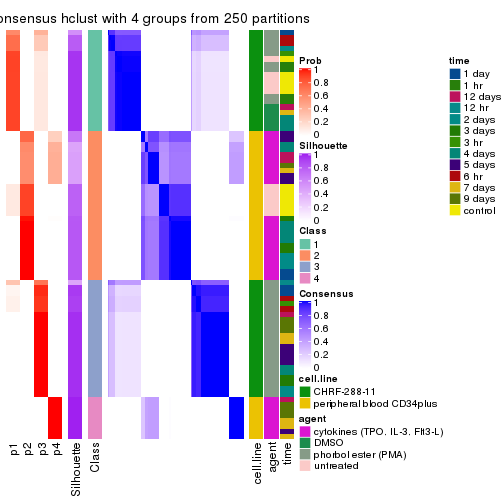</p>

</div>
<div id='tab-MAD-hclust-consensus-heatmap-4'>
<pre><code class="r">consensus_heatmap(res, k = 5)
</code></pre>

<p></p>

</div>
<div id='tab-MAD-hclust-consensus-heatmap-5'>
<pre><code class="r">consensus_heatmap(res, k = 6)
</code></pre>

<p></p>

</div>
</div>

Heatmaps for the membership of samples in all partitions to see how consistent they are:


<script>
$( function() {
	$( '#tabs-MAD-hclust-membership-heatmap' ).tabs();
} );
</script>
<div id='tabs-MAD-hclust-membership-heatmap'>
<ul>
<li><a href='#tab-MAD-hclust-membership-heatmap-1'>k = 2</a></li>
<li><a href='#tab-MAD-hclust-membership-heatmap-2'>k = 3</a></li>
<li><a href='#tab-MAD-hclust-membership-heatmap-3'>k = 4</a></li>
<li><a href='#tab-MAD-hclust-membership-heatmap-4'>k = 5</a></li>
<li><a href='#tab-MAD-hclust-membership-heatmap-5'>k = 6</a></li>
</ul>
<div id='tab-MAD-hclust-membership-heatmap-1'>
<pre><code class="r">membership_heatmap(res, k = 2)
</code></pre>

<p></p>

</div>
<div id='tab-MAD-hclust-membership-heatmap-2'>
<pre><code class="r">membership_heatmap(res, k = 3)
</code></pre>

<p></p>

</div>
<div id='tab-MAD-hclust-membership-heatmap-3'>
<pre><code class="r">membership_heatmap(res, k = 4)
</code></pre>

<p></p>

</div>
<div id='tab-MAD-hclust-membership-heatmap-4'>
<pre><code class="r">membership_heatmap(res, k = 5)
</code></pre>

<p>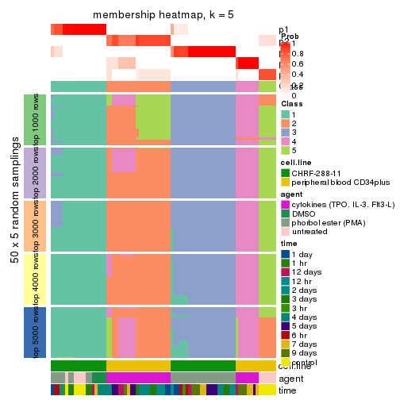</p>

</div>
<div id='tab-MAD-hclust-membership-heatmap-5'>
<pre><code class="r">membership_heatmap(res, k = 6)
</code></pre>

<p></p>

</div>
</div>

As soon as we have had the classes for columns, we can look for signatures
which are significantly different between classes which can be candidate marks
for certain classes. Following are the heatmaps for signatures.


Signature heatmaps where rows are scaled:


<script>
$( function() {
	$( '#tabs-MAD-hclust-get-signatures' ).tabs();
} );
</script>
<div id='tabs-MAD-hclust-get-signatures'>
<ul>
<li><a href='#tab-MAD-hclust-get-signatures-1'>k = 2</a></li>
<li><a href='#tab-MAD-hclust-get-signatures-2'>k = 3</a></li>
<li><a href='#tab-MAD-hclust-get-signatures-3'>k = 4</a></li>
<li><a href='#tab-MAD-hclust-get-signatures-4'>k = 5</a></li>
<li><a href='#tab-MAD-hclust-get-signatures-5'>k = 6</a></li>
</ul>
<div id='tab-MAD-hclust-get-signatures-1'>
<pre><code class="r">get_signatures(res, k = 2)
</code></pre>

<p></p>

</div>
<div id='tab-MAD-hclust-get-signatures-2'>
<pre><code class="r">get_signatures(res, k = 3)
</code></pre>

<p></p>

</div>
<div id='tab-MAD-hclust-get-signatures-3'>
<pre><code class="r">get_signatures(res, k = 4)
</code></pre>

<p></p>

</div>
<div id='tab-MAD-hclust-get-signatures-4'>
<pre><code class="r">get_signatures(res, k = 5)
</code></pre>

<p></p>

</div>
<div id='tab-MAD-hclust-get-signatures-5'>
<pre><code class="r">get_signatures(res, k = 6)
</code></pre>

<p></p>

</div>
</div>


Signature heatmaps where rows are not scaled:


<script>
$( function() {
	$( '#tabs-MAD-hclust-get-signatures-no-scale' ).tabs();
} );
</script>
<div id='tabs-MAD-hclust-get-signatures-no-scale'>
<ul>
<li><a href='#tab-MAD-hclust-get-signatures-no-scale-1'>k = 2</a></li>
<li><a href='#tab-MAD-hclust-get-signatures-no-scale-2'>k = 3</a></li>
<li><a href='#tab-MAD-hclust-get-signatures-no-scale-3'>k = 4</a></li>
<li><a href='#tab-MAD-hclust-get-signatures-no-scale-4'>k = 5</a></li>
<li><a href='#tab-MAD-hclust-get-signatures-no-scale-5'>k = 6</a></li>
</ul>
<div id='tab-MAD-hclust-get-signatures-no-scale-1'>
<pre><code class="r">get_signatures(res, k = 2, scale_rows = FALSE)
</code></pre>

<p></p>

</div>
<div id='tab-MAD-hclust-get-signatures-no-scale-2'>
<pre><code class="r">get_signatures(res, k = 3, scale_rows = FALSE)
</code></pre>

<p></p>

</div>
<div id='tab-MAD-hclust-get-signatures-no-scale-3'>
<pre><code class="r">get_signatures(res, k = 4, scale_rows = FALSE)
</code></pre>

<p></p>

</div>
<div id='tab-MAD-hclust-get-signatures-no-scale-4'>
<pre><code class="r">get_signatures(res, k = 5, scale_rows = FALSE)
</code></pre>

<p></p>

</div>
<div id='tab-MAD-hclust-get-signatures-no-scale-5'>
<pre><code class="r">get_signatures(res, k = 6, scale_rows = FALSE)
</code></pre>

<p>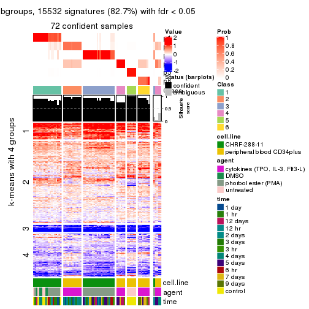</p>

</div>
</div>


Compare the overlap of signatures from different k:

```r
compare_signatures(res)
```


`get_signature()` returns a data frame invisibly. TO get the list of signatures, the function
call should be assigned to a variable explicitly. In following code, if `plot` argument is set
to `FALSE`, no heatmap is plotted while only the differential analysis is performed.

```r
# code only for demonstration
tb = get_signature(res, k = ..., plot = FALSE)
```

An example of the output of `tb` is:

```
#>   which_row         fdr    mean_1    mean_2 scaled_mean_1 scaled_mean_2 km
#> 1        38 0.042760348  8.373488  9.131774    -0.5533452     0.5164555  1
#> 2        40 0.018707592  7.106213  8.469186    -0.6173731     0.5762149  1
#> 3        55 0.019134737 10.221463 11.207825    -0.6159697     0.5749050  1
#> 4        59 0.006059896  5.921854  7.869574    -0.6899429     0.6439467  1
#> 5        60 0.018055526  8.928898 10.211722    -0.6204761     0.5791110  1
#> 6        98 0.009384629 15.714769 14.887706     0.6635654    -0.6193277  2
...
```

The columns in `tb` are:

1. `which_row`: row indices corresponding to the input matrix.
2. `fdr`: FDR for the differential test. 
3. `mean_x`: The mean value in group x.
4. `scaled_mean_x`: The mean value in group x after rows are scaled.
5. `km`: Row groups if k-means clustering is applied to rows.


UMAP plot which shows how samples are separated.


<script>
$( function() {
	$( '#tabs-MAD-hclust-dimension-reduction' ).tabs();
} );
</script>
<div id='tabs-MAD-hclust-dimension-reduction'>
<ul>
<li><a href='#tab-MAD-hclust-dimension-reduction-1'>k = 2</a></li>
<li><a href='#tab-MAD-hclust-dimension-reduction-2'>k = 3</a></li>
<li><a href='#tab-MAD-hclust-dimension-reduction-3'>k = 4</a></li>
<li><a href='#tab-MAD-hclust-dimension-reduction-4'>k = 5</a></li>
<li><a href='#tab-MAD-hclust-dimension-reduction-5'>k = 6</a></li>
</ul>
<div id='tab-MAD-hclust-dimension-reduction-1'>
<pre><code class="r">dimension_reduction(res, k = 2, method = &quot;UMAP&quot;)
</code></pre>

<p>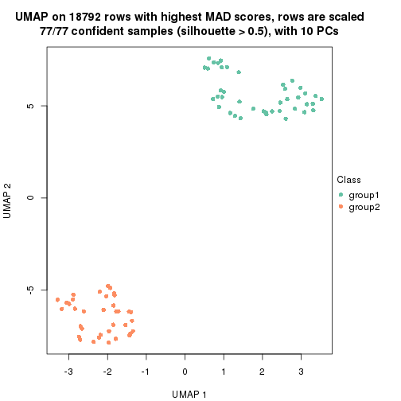</p>

</div>
<div id='tab-MAD-hclust-dimension-reduction-2'>
<pre><code class="r">dimension_reduction(res, k = 3, method = &quot;UMAP&quot;)
</code></pre>

<p>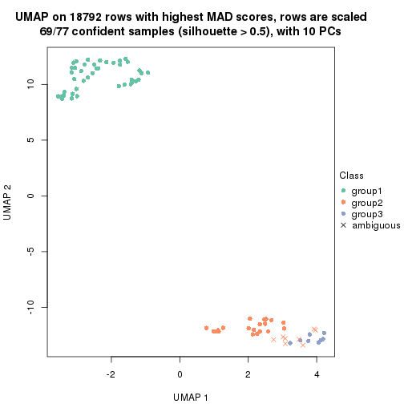</p>

</div>
<div id='tab-MAD-hclust-dimension-reduction-3'>
<pre><code class="r">dimension_reduction(res, k = 4, method = &quot;UMAP&quot;)
</code></pre>

<p></p>

</div>
<div id='tab-MAD-hclust-dimension-reduction-4'>
<pre><code class="r">dimension_reduction(res, k = 5, method = &quot;UMAP&quot;)
</code></pre>

<p>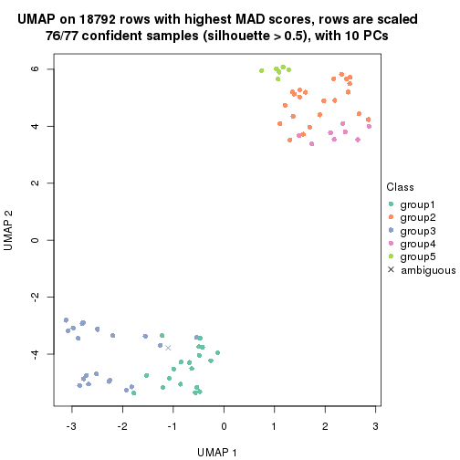</p>

</div>
<div id='tab-MAD-hclust-dimension-reduction-5'>
<pre><code class="r">dimension_reduction(res, k = 6, method = &quot;UMAP&quot;)
</code></pre>

<p></p>

</div>
</div>


Following heatmap shows how subgroups are split when increasing `k`:

```r
collect_classes(res)
```

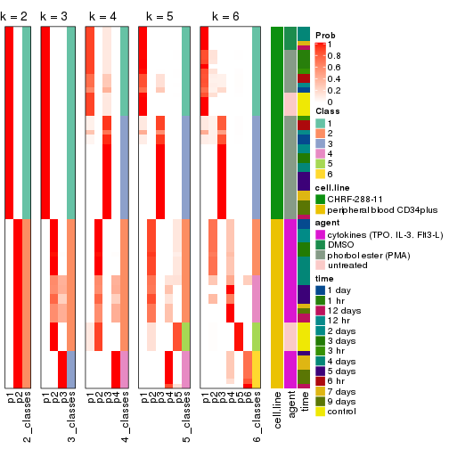


Test correlation between subgroups and known annotations. If the known
annotation is numeric, one-way ANOVA test is applied, and if the known
annotation is discrete, chi-squared contingency table test is applied.

```r
test_to_known_factors(res)
```

```
#>             n cell.line(p) agent(p)  time(p) k
#> MAD:hclust 77     1.27e-17 3.00e-14 3.61e-01 2
#> MAD:hclust 69     1.04e-15 1.38e-11 1.62e-02 3
#> MAD:hclust 68     1.14e-14 8.37e-14 3.84e-03 4
#> MAD:hclust 76     1.22e-15 7.53e-23 2.07e-05 5
#> MAD:hclust 72     3.93e-14 6.66e-20 8.21e-06 6
```


If matrix rows can be associated to genes, consider to use `GO_Enrichment(res,
...)` to perform function enrichment for the signature genes.


 

---------------------------------------------------


### MAD:kmeans**


The object with results only for a single top-value method and a single partition method 
can be extracted as:

```r
res = res_list["MAD", "kmeans"]
# you can also extract it by
# res = res_list["MAD:kmeans"]
```

A summary of `res` and all the functions that can be applied to it:

```r
res
```

```
#> A 'ConsensusPartition' object with k = 2, 3, 4, 5, 6.
#>   On a matrix with 18792 rows and 77 columns.
#>   Top rows (1000, 2000, 3000, 4000, 5000) are extracted by 'MAD' method.
#>   Subgroups are detected by 'kmeans' method.
#>   Performed in total 1250 partitions by row resampling.
#>   Best k for subgroups seems to be 2.
#> 
#> Following methods can be applied to this 'ConsensusPartition' object:
#>  [1] "cola_report"             "collect_classes"         "collect_plots"          
#>  [4] "collect_stats"           "colnames"                "compare_signatures"     
#>  [7] "consensus_heatmap"       "dimension_reduction"     "functional_enrichment"  
#> [10] "get_anno_col"            "get_anno"                "get_classes"            
#> [13] "get_consensus"           "get_matrix"              "get_membership"         
#> [16] "get_param"               "get_signatures"          "get_stats"              
#> [19] "is_best_k"               "is_stable_k"             "membership_heatmap"     
#> [22] "ncol"                    "nrow"                    "plot_ecdf"              
#> [25] "rownames"                "select_partition_number" "show"                   
#> [28] "suggest_best_k"          "test_to_known_factors"
```

`collect_plots()` function collects all the plots made from `res` for all `k` (number of partitions)
into one single page to provide an easy and fast comparison between different `k`.

```r
collect_plots(res)
```


The plots are:

- The first row: a plot of the ECDF (Empirical cumulative distribution
  function) curves of the consensus matrix for each `k` and the heatmap of
  predicted classes for each `k`.
- The second row: heatmaps of the consensus matrix for each `k`.
- The third row: heatmaps of the membership matrix for each `k`.
- The fouth row: heatmaps of the signatures for each `k`.

All the plots in panels can be made by individual functions and they are
plotted later in this section.

`select_partition_number()` produces several plots showing different
statistics for choosing "optimized" `k`. There are following statistics:

- ECDF curves of the consensus matrix for each `k`;
- 1-PAC. [The PAC
  score](https://en.wikipedia.org/wiki/Consensus_clustering#Over-interpretation_potential_of_consensus_clustering)
  measures the proportion of the ambiguous subgrouping.
- Mean silhouette score.
- Concordance. The mean probability of fiting the consensus class ids in all
  partitions.
- Area increased. Denote $A_k$ as the area under the ECDF curve for current
  `k`, the area increased is defined as $A_k - A_{k-1}$.
- Rand index. The percent of pairs of samples that are both in a same cluster
  or both are not in a same cluster in the partition of k and k-1.
- Jaccard index. The ratio of pairs of samples are both in a same cluster in
  the partition of k and k-1 and the pairs of samples are both in a same
  cluster in the partition k or k-1.

The detailed explanations of these statistics can be found in [the cola
vignette](http://bioconductor.org/packages/devel/bioc/vignettes/cola/inst/doc/cola.html#toc_13).

Generally speaking, lower PAC score, higher mean silhouette score or higher
concordance corresponds to better partition. Rand index and Jaccard index
measure how similar the current partition is compared to partition with `k-1`.
If they are too similar, we won't accept `k` is better than `k-1`.

```r
select_partition_number(res)
```


The numeric values for all these statistics can be obtained by `get_stats()`.

```r
get_stats(res)
```

```
#>   k 1-PAC mean_silhouette concordance area_increased  Rand Jaccard
#> 2 2 1.000           1.000       1.000         0.5049 0.496   0.496
#> 3 3 0.712           0.914       0.790         0.2417 0.859   0.714
#> 4 4 0.644           0.827       0.751         0.1163 0.889   0.687
#> 5 5 0.594           0.794       0.780         0.0808 1.000   1.000
#> 6 6 0.752           0.710       0.750         0.0477 0.945   0.783
```

`suggest_best_k()` suggests the best $k$ based on these statistics. The rules are as follows:

- All $k$ with Jaccard index larger than 0.95 are removed because the increase of
  the partition number does not provides enough extra information. If all $k$ are removed,
  the best $k$ is assigned by `NA`.
- For $k$ with 1-PAC larger than 0.9, the maximal $k$ is taken as the "best k". Other $k$ is called "optional k".
- If it does not fit the second rule. The $k$ with the highest vote of highest
  1-PAC, mean silhouette and concordance is taken as the "best k".

```r
suggest_best_k(res)
```

```
#> [1] 2
```


Following shows the table of the partitions (You need to click the **show/hide
code output** link to see it). The membership matrix (columns with name `p*`)
is inferred by
[`clue::cl_consensus()`](https://www.rdocumentation.org/link/cl_consensus?package=clue)
function with the `SE` method. Basically the value in the membership matrix
represents the probability to belong to a certain group. The finall class
label for an item is determined with the group with highest probability it
belongs to.

In `get_classes()` function, the entropy is calculated from the membership
matrix and the silhouette score is calculated from the consensus matrix.


<script>
$( function() {
	$( '#tabs-MAD-kmeans-get-classes' ).tabs();
} );
</script>
<div id='tabs-MAD-kmeans-get-classes'>
<ul>
<li><a href='#tab-MAD-kmeans-get-classes-1'>k = 2</a></li>
<li><a href='#tab-MAD-kmeans-get-classes-2'>k = 3</a></li>
<li><a href='#tab-MAD-kmeans-get-classes-3'>k = 4</a></li>
<li><a href='#tab-MAD-kmeans-get-classes-4'>k = 5</a></li>
<li><a href='#tab-MAD-kmeans-get-classes-5'>k = 6</a></li>
</ul>

<div id='tab-MAD-kmeans-get-classes-1'>
<p><a id='tab-MAD-kmeans-get-classes-1-a' style='color:#0366d6' href='#'>show/hide code output</a></p>
<pre><code class="r">cbind(get_classes(res, k = 2), get_membership(res, k = 2))
</code></pre>

<pre><code>#&gt;          class entropy silhouette p1 p2
#&gt; GSM87962     1       0          1  1  0
#&gt; GSM87963     1       0          1  1  0
#&gt; GSM87983     1       0          1  1  0
#&gt; GSM87984     1       0          1  1  0
#&gt; GSM87961     1       0          1  1  0
#&gt; GSM87970     1       0          1  1  0
#&gt; GSM87971     1       0          1  1  0
#&gt; GSM87990     1       0          1  1  0
#&gt; GSM87991     1       0          1  1  0
#&gt; GSM87974     1       0          1  1  0
#&gt; GSM87994     1       0          1  1  0
#&gt; GSM87978     1       0          1  1  0
#&gt; GSM87979     1       0          1  1  0
#&gt; GSM87998     1       0          1  1  0
#&gt; GSM87999     1       0          1  1  0
#&gt; GSM87968     1       0          1  1  0
#&gt; GSM87987     1       0          1  1  0
#&gt; GSM87969     1       0          1  1  0
#&gt; GSM87988     1       0          1  1  0
#&gt; GSM87989     1       0          1  1  0
#&gt; GSM87972     1       0          1  1  0
#&gt; GSM87992     1       0          1  1  0
#&gt; GSM87973     1       0          1  1  0
#&gt; GSM87993     1       0          1  1  0
#&gt; GSM87975     1       0          1  1  0
#&gt; GSM87995     1       0          1  1  0
#&gt; GSM87976     1       0          1  1  0
#&gt; GSM87977     1       0          1  1  0
#&gt; GSM87996     1       0          1  1  0
#&gt; GSM87997     1       0          1  1  0
#&gt; GSM87980     1       0          1  1  0
#&gt; GSM88000     1       0          1  1  0
#&gt; GSM87981     1       0          1  1  0
#&gt; GSM87982     1       0          1  1  0
#&gt; GSM88001     1       0          1  1  0
#&gt; GSM87967     1       0          1  1  0
#&gt; GSM87964     1       0          1  1  0
#&gt; GSM87965     1       0          1  1  0
#&gt; GSM87966     1       0          1  1  0
#&gt; GSM87985     1       0          1  1  0
#&gt; GSM87986     1       0          1  1  0
#&gt; GSM88004     2       0          1  0  1
#&gt; GSM88015     2       0          1  0  1
#&gt; GSM88005     2       0          1  0  1
#&gt; GSM88006     2       0          1  0  1
#&gt; GSM88016     2       0          1  0  1
#&gt; GSM88007     2       0          1  0  1
#&gt; GSM88017     2       0          1  0  1
#&gt; GSM88029     2       0          1  0  1
#&gt; GSM88008     2       0          1  0  1
#&gt; GSM88009     2       0          1  0  1
#&gt; GSM88018     2       0          1  0  1
#&gt; GSM88024     2       0          1  0  1
#&gt; GSM88030     2       0          1  0  1
#&gt; GSM88036     2       0          1  0  1
#&gt; GSM88010     2       0          1  0  1
#&gt; GSM88011     2       0          1  0  1
#&gt; GSM88019     2       0          1  0  1
#&gt; GSM88027     2       0          1  0  1
#&gt; GSM88031     2       0          1  0  1
#&gt; GSM88012     2       0          1  0  1
#&gt; GSM88020     2       0          1  0  1
#&gt; GSM88032     2       0          1  0  1
#&gt; GSM88037     2       0          1  0  1
#&gt; GSM88013     2       0          1  0  1
#&gt; GSM88021     2       0          1  0  1
#&gt; GSM88025     2       0          1  0  1
#&gt; GSM88033     2       0          1  0  1
#&gt; GSM88014     2       0          1  0  1
#&gt; GSM88022     2       0          1  0  1
#&gt; GSM88034     2       0          1  0  1
#&gt; GSM88002     2       0          1  0  1
#&gt; GSM88003     2       0          1  0  1
#&gt; GSM88023     2       0          1  0  1
#&gt; GSM88026     2       0          1  0  1
#&gt; GSM88028     2       0          1  0  1
#&gt; GSM88035     2       0          1  0  1
</code></pre>

<script>
$('#tab-MAD-kmeans-get-classes-1-a').parent().next().next().hide();
$('#tab-MAD-kmeans-get-classes-1-a').click(function(){
  $('#tab-MAD-kmeans-get-classes-1-a').parent().next().next().toggle();
  return(false);
});
</script>
</div>

<div id='tab-MAD-kmeans-get-classes-2'>
<p><a id='tab-MAD-kmeans-get-classes-2-a' style='color:#0366d6' href='#'>show/hide code output</a></p>
<pre><code class="r">cbind(get_classes(res, k = 3), get_membership(res, k = 3))
</code></pre>

<pre><code>#&gt;          class entropy silhouette    p1    p2    p3
#&gt; GSM87962     1   0.631      1.000 0.508 0.000 0.492
#&gt; GSM87963     1   0.631      1.000 0.508 0.000 0.492
#&gt; GSM87983     1   0.631      1.000 0.508 0.000 0.492
#&gt; GSM87984     1   0.631      1.000 0.508 0.000 0.492
#&gt; GSM87961     1   0.631      1.000 0.508 0.000 0.492
#&gt; GSM87970     1   0.631      1.000 0.508 0.000 0.492
#&gt; GSM87971     1   0.631      1.000 0.508 0.000 0.492
#&gt; GSM87990     1   0.631      1.000 0.508 0.000 0.492
#&gt; GSM87991     1   0.631      1.000 0.508 0.000 0.492
#&gt; GSM87974     1   0.631      1.000 0.508 0.000 0.492
#&gt; GSM87994     1   0.631      1.000 0.508 0.000 0.492
#&gt; GSM87978     1   0.631      1.000 0.508 0.000 0.492
#&gt; GSM87979     1   0.631      1.000 0.508 0.000 0.492
#&gt; GSM87998     1   0.631      1.000 0.508 0.000 0.492
#&gt; GSM87999     1   0.631      1.000 0.508 0.000 0.492
#&gt; GSM87968     1   0.631      1.000 0.508 0.000 0.492
#&gt; GSM87987     1   0.631      1.000 0.508 0.000 0.492
#&gt; GSM87969     1   0.631      1.000 0.508 0.000 0.492
#&gt; GSM87988     3   0.000      1.000 0.000 0.000 1.000
#&gt; GSM87989     3   0.000      1.000 0.000 0.000 1.000
#&gt; GSM87972     3   0.000      1.000 0.000 0.000 1.000
#&gt; GSM87992     3   0.000      1.000 0.000 0.000 1.000
#&gt; GSM87973     3   0.000      1.000 0.000 0.000 1.000
#&gt; GSM87993     3   0.000      1.000 0.000 0.000 1.000
#&gt; GSM87975     3   0.000      1.000 0.000 0.000 1.000
#&gt; GSM87995     3   0.000      1.000 0.000 0.000 1.000
#&gt; GSM87976     3   0.000      1.000 0.000 0.000 1.000
#&gt; GSM87977     3   0.000      1.000 0.000 0.000 1.000
#&gt; GSM87996     3   0.000      1.000 0.000 0.000 1.000
#&gt; GSM87997     3   0.000      1.000 0.000 0.000 1.000
#&gt; GSM87980     3   0.000      1.000 0.000 0.000 1.000
#&gt; GSM88000     3   0.000      1.000 0.000 0.000 1.000
#&gt; GSM87981     3   0.000      1.000 0.000 0.000 1.000
#&gt; GSM87982     3   0.000      1.000 0.000 0.000 1.000
#&gt; GSM88001     3   0.000      1.000 0.000 0.000 1.000
#&gt; GSM87967     3   0.000      1.000 0.000 0.000 1.000
#&gt; GSM87964     1   0.631      1.000 0.508 0.000 0.492
#&gt; GSM87965     1   0.631      1.000 0.508 0.000 0.492
#&gt; GSM87966     1   0.631      1.000 0.508 0.000 0.492
#&gt; GSM87985     1   0.631      1.000 0.508 0.000 0.492
#&gt; GSM87986     1   0.631      1.000 0.508 0.000 0.492
#&gt; GSM88004     2   0.000      0.828 0.000 1.000 0.000
#&gt; GSM88015     2   0.000      0.828 0.000 1.000 0.000
#&gt; GSM88005     2   0.000      0.828 0.000 1.000 0.000
#&gt; GSM88006     2   0.000      0.828 0.000 1.000 0.000
#&gt; GSM88016     2   0.000      0.828 0.000 1.000 0.000
#&gt; GSM88007     2   0.000      0.828 0.000 1.000 0.000
#&gt; GSM88017     2   0.000      0.828 0.000 1.000 0.000
#&gt; GSM88029     2   0.000      0.828 0.000 1.000 0.000
#&gt; GSM88008     2   0.000      0.828 0.000 1.000 0.000
#&gt; GSM88009     2   0.000      0.828 0.000 1.000 0.000
#&gt; GSM88018     2   0.000      0.828 0.000 1.000 0.000
#&gt; GSM88024     2   0.000      0.828 0.000 1.000 0.000
#&gt; GSM88030     2   0.475      0.828 0.216 0.784 0.000
#&gt; GSM88036     2   0.475      0.828 0.216 0.784 0.000
#&gt; GSM88010     2   0.595      0.816 0.360 0.640 0.000
#&gt; GSM88011     2   0.595      0.816 0.360 0.640 0.000
#&gt; GSM88019     2   0.593      0.816 0.356 0.644 0.000
#&gt; GSM88027     2   0.593      0.816 0.356 0.644 0.000
#&gt; GSM88031     2   0.620      0.806 0.424 0.576 0.000
#&gt; GSM88012     2   0.620      0.806 0.424 0.576 0.000
#&gt; GSM88020     2   0.620      0.806 0.424 0.576 0.000
#&gt; GSM88032     2   0.620      0.806 0.424 0.576 0.000
#&gt; GSM88037     2   0.620      0.806 0.424 0.576 0.000
#&gt; GSM88013     2   0.620      0.806 0.424 0.576 0.000
#&gt; GSM88021     2   0.620      0.806 0.424 0.576 0.000
#&gt; GSM88025     2   0.620      0.806 0.424 0.576 0.000
#&gt; GSM88033     2   0.620      0.806 0.424 0.576 0.000
#&gt; GSM88014     2   0.620      0.806 0.424 0.576 0.000
#&gt; GSM88022     2   0.620      0.806 0.424 0.576 0.000
#&gt; GSM88034     2   0.620      0.806 0.424 0.576 0.000
#&gt; GSM88002     2   0.296      0.809 0.100 0.900 0.000
#&gt; GSM88003     2   0.296      0.809 0.100 0.900 0.000
#&gt; GSM88023     2   0.296      0.809 0.100 0.900 0.000
#&gt; GSM88026     2   0.296      0.809 0.100 0.900 0.000
#&gt; GSM88028     2   0.296      0.809 0.100 0.900 0.000
#&gt; GSM88035     2   0.296      0.809 0.100 0.900 0.000
</code></pre>

<script>
$('#tab-MAD-kmeans-get-classes-2-a').parent().next().next().hide();
$('#tab-MAD-kmeans-get-classes-2-a').click(function(){
  $('#tab-MAD-kmeans-get-classes-2-a').parent().next().next().toggle();
  return(false);
});
</script>
</div>

<div id='tab-MAD-kmeans-get-classes-3'>
<p><a id='tab-MAD-kmeans-get-classes-3-a' style='color:#0366d6' href='#'>show/hide code output</a></p>
<pre><code class="r">cbind(get_classes(res, k = 4), get_membership(res, k = 4))
</code></pre>

<pre><code>#&gt;          class entropy silhouette    p1    p2    p3    p4
#&gt; GSM87962     1  0.5565      0.926 0.684 0.056 0.260 0.000
#&gt; GSM87963     1  0.5565      0.926 0.684 0.056 0.260 0.000
#&gt; GSM87983     1  0.4576      0.923 0.728 0.012 0.260 0.000
#&gt; GSM87984     1  0.4576      0.923 0.728 0.012 0.260 0.000
#&gt; GSM87961     1  0.5565      0.926 0.684 0.056 0.260 0.000
#&gt; GSM87970     1  0.6547      0.911 0.616 0.124 0.260 0.000
#&gt; GSM87971     1  0.6547      0.911 0.616 0.124 0.260 0.000
#&gt; GSM87990     1  0.4576      0.925 0.728 0.012 0.260 0.000
#&gt; GSM87991     1  0.5172      0.911 0.704 0.036 0.260 0.000
#&gt; GSM87974     1  0.6723      0.908 0.600 0.140 0.260 0.000
#&gt; GSM87994     1  0.6138      0.898 0.648 0.092 0.260 0.000
#&gt; GSM87978     1  0.6805      0.906 0.592 0.148 0.260 0.000
#&gt; GSM87979     1  0.6805      0.906 0.592 0.148 0.260 0.000
#&gt; GSM87998     1  0.6219      0.894 0.640 0.096 0.264 0.000
#&gt; GSM87999     1  0.6219      0.894 0.640 0.096 0.264 0.000
#&gt; GSM87968     1  0.6805      0.906 0.592 0.148 0.260 0.000
#&gt; GSM87987     1  0.6273      0.894 0.636 0.100 0.264 0.000
#&gt; GSM87969     1  0.6957      0.900 0.576 0.164 0.260 0.000
#&gt; GSM87988     3  0.1637      0.904 0.000 0.060 0.940 0.000
#&gt; GSM87989     3  0.1637      0.904 0.000 0.060 0.940 0.000
#&gt; GSM87972     3  0.2345      0.944 0.000 0.100 0.900 0.000
#&gt; GSM87992     3  0.0000      0.944 0.000 0.000 1.000 0.000
#&gt; GSM87973     3  0.2216      0.947 0.000 0.092 0.908 0.000
#&gt; GSM87993     3  0.0000      0.944 0.000 0.000 1.000 0.000
#&gt; GSM87975     3  0.2216      0.947 0.000 0.092 0.908 0.000
#&gt; GSM87995     3  0.0000      0.944 0.000 0.000 1.000 0.000
#&gt; GSM87976     3  0.2216      0.947 0.000 0.092 0.908 0.000
#&gt; GSM87977     3  0.2216      0.947 0.000 0.092 0.908 0.000
#&gt; GSM87996     3  0.0000      0.944 0.000 0.000 1.000 0.000
#&gt; GSM87997     3  0.0000      0.944 0.000 0.000 1.000 0.000
#&gt; GSM87980     3  0.2216      0.947 0.000 0.092 0.908 0.000
#&gt; GSM88000     3  0.0000      0.944 0.000 0.000 1.000 0.000
#&gt; GSM87981     3  0.2216      0.947 0.000 0.092 0.908 0.000
#&gt; GSM87982     3  0.2216      0.947 0.000 0.092 0.908 0.000
#&gt; GSM88001     3  0.0000      0.944 0.000 0.000 1.000 0.000
#&gt; GSM87967     3  0.2216      0.947 0.000 0.092 0.908 0.000
#&gt; GSM87964     1  0.6452      0.911 0.624 0.116 0.260 0.000
#&gt; GSM87965     1  0.5565      0.926 0.684 0.056 0.260 0.000
#&gt; GSM87966     1  0.4576      0.923 0.728 0.012 0.260 0.000
#&gt; GSM87985     1  0.4576      0.923 0.728 0.012 0.260 0.000
#&gt; GSM87986     1  0.4576      0.923 0.728 0.012 0.260 0.000
#&gt; GSM88004     2  0.4817      0.789 0.000 0.612 0.000 0.388
#&gt; GSM88015     2  0.4817      0.789 0.000 0.612 0.000 0.388
#&gt; GSM88005     2  0.4817      0.789 0.000 0.612 0.000 0.388
#&gt; GSM88006     2  0.4817      0.789 0.000 0.612 0.000 0.388
#&gt; GSM88016     2  0.4817      0.789 0.000 0.612 0.000 0.388
#&gt; GSM88007     2  0.4817      0.789 0.000 0.612 0.000 0.388
#&gt; GSM88017     2  0.4991      0.786 0.004 0.608 0.000 0.388
#&gt; GSM88029     2  0.5125      0.782 0.008 0.604 0.000 0.388
#&gt; GSM88008     2  0.4817      0.789 0.000 0.612 0.000 0.388
#&gt; GSM88009     2  0.4817      0.789 0.000 0.612 0.000 0.388
#&gt; GSM88018     2  0.4991      0.786 0.004 0.608 0.000 0.388
#&gt; GSM88024     2  0.4991      0.786 0.004 0.608 0.000 0.388
#&gt; GSM88030     4  0.4957      0.111 0.016 0.300 0.000 0.684
#&gt; GSM88036     4  0.4957      0.111 0.016 0.300 0.000 0.684
#&gt; GSM88010     4  0.4139      0.649 0.024 0.176 0.000 0.800
#&gt; GSM88011     4  0.4139      0.649 0.024 0.176 0.000 0.800
#&gt; GSM88019     4  0.4225      0.635 0.024 0.184 0.000 0.792
#&gt; GSM88027     4  0.4225      0.635 0.024 0.184 0.000 0.792
#&gt; GSM88031     4  0.0469      0.844 0.012 0.000 0.000 0.988
#&gt; GSM88012     4  0.0817      0.837 0.024 0.000 0.000 0.976
#&gt; GSM88020     4  0.0469      0.844 0.012 0.000 0.000 0.988
#&gt; GSM88032     4  0.0469      0.844 0.012 0.000 0.000 0.988
#&gt; GSM88037     4  0.0469      0.844 0.012 0.000 0.000 0.988
#&gt; GSM88013     4  0.0707      0.838 0.020 0.000 0.000 0.980
#&gt; GSM88021     4  0.0469      0.844 0.012 0.000 0.000 0.988
#&gt; GSM88025     4  0.0469      0.844 0.012 0.000 0.000 0.988
#&gt; GSM88033     4  0.0469      0.844 0.012 0.000 0.000 0.988
#&gt; GSM88014     4  0.0707      0.838 0.020 0.000 0.000 0.980
#&gt; GSM88022     4  0.0817      0.837 0.024 0.000 0.000 0.976
#&gt; GSM88034     4  0.0592      0.842 0.016 0.000 0.000 0.984
#&gt; GSM88002     2  0.7641      0.572 0.208 0.416 0.000 0.376
#&gt; GSM88003     2  0.7641      0.572 0.208 0.416 0.000 0.376
#&gt; GSM88023     2  0.7599      0.572 0.200 0.424 0.000 0.376
#&gt; GSM88026     2  0.7599      0.572 0.200 0.424 0.000 0.376
#&gt; GSM88028     2  0.7621      0.572 0.204 0.420 0.000 0.376
#&gt; GSM88035     2  0.7621      0.572 0.204 0.420 0.000 0.376
</code></pre>

<script>
$('#tab-MAD-kmeans-get-classes-3-a').parent().next().next().hide();
$('#tab-MAD-kmeans-get-classes-3-a').click(function(){
  $('#tab-MAD-kmeans-get-classes-3-a').parent().next().next().toggle();
  return(false);
});
</script>
</div>

<div id='tab-MAD-kmeans-get-classes-4'>
<p><a id='tab-MAD-kmeans-get-classes-4-a' style='color:#0366d6' href='#'>show/hide code output</a></p>
<pre><code class="r">cbind(get_classes(res, k = 5), get_membership(res, k = 5))
</code></pre>

<pre><code>#&gt;          class entropy silhouette    p1    p2    p3    p4 p5
#&gt; GSM87962     1  0.3216      0.866 0.848 0.000 0.108 0.000 NA
#&gt; GSM87963     1  0.3216      0.866 0.848 0.000 0.108 0.000 NA
#&gt; GSM87983     1  0.2127      0.864 0.892 0.000 0.108 0.000 NA
#&gt; GSM87984     1  0.2127      0.864 0.892 0.000 0.108 0.000 NA
#&gt; GSM87961     1  0.3216      0.866 0.848 0.000 0.108 0.000 NA
#&gt; GSM87970     1  0.5223      0.841 0.672 0.000 0.108 0.000 NA
#&gt; GSM87971     1  0.5403      0.835 0.644 0.000 0.108 0.000 NA
#&gt; GSM87990     1  0.2984      0.868 0.860 0.000 0.108 0.000 NA
#&gt; GSM87991     1  0.3427      0.853 0.836 0.000 0.108 0.000 NA
#&gt; GSM87974     1  0.5631      0.825 0.600 0.000 0.108 0.000 NA
#&gt; GSM87994     1  0.6191      0.785 0.628 0.040 0.108 0.000 NA
#&gt; GSM87978     1  0.5683      0.822 0.588 0.000 0.108 0.000 NA
#&gt; GSM87979     1  0.5683      0.822 0.588 0.000 0.108 0.000 NA
#&gt; GSM87998     1  0.6312      0.779 0.608 0.040 0.108 0.000 NA
#&gt; GSM87999     1  0.6312      0.779 0.608 0.040 0.108 0.000 NA
#&gt; GSM87968     1  0.5683      0.822 0.588 0.000 0.108 0.000 NA
#&gt; GSM87987     1  0.6438      0.775 0.584 0.040 0.108 0.000 NA
#&gt; GSM87969     1  0.6046      0.783 0.512 0.004 0.108 0.000 NA
#&gt; GSM87988     3  0.3521      0.763 0.000 0.040 0.820 0.000 NA
#&gt; GSM87989     3  0.3521      0.763 0.000 0.040 0.820 0.000 NA
#&gt; GSM87972     3  0.5126      0.848 0.000 0.152 0.696 0.000 NA
#&gt; GSM87992     3  0.0000      0.856 0.000 0.000 1.000 0.000 NA
#&gt; GSM87973     3  0.4751      0.863 0.000 0.152 0.732 0.000 NA
#&gt; GSM87993     3  0.0000      0.856 0.000 0.000 1.000 0.000 NA
#&gt; GSM87975     3  0.4926      0.856 0.000 0.152 0.716 0.000 NA
#&gt; GSM87995     3  0.0000      0.856 0.000 0.000 1.000 0.000 NA
#&gt; GSM87976     3  0.4926      0.856 0.000 0.152 0.716 0.000 NA
#&gt; GSM87977     3  0.4751      0.863 0.000 0.152 0.732 0.000 NA
#&gt; GSM87996     3  0.0000      0.856 0.000 0.000 1.000 0.000 NA
#&gt; GSM87997     3  0.0000      0.856 0.000 0.000 1.000 0.000 NA
#&gt; GSM87980     3  0.4751      0.863 0.000 0.152 0.732 0.000 NA
#&gt; GSM88000     3  0.0000      0.856 0.000 0.000 1.000 0.000 NA
#&gt; GSM87981     3  0.4751      0.863 0.000 0.152 0.732 0.000 NA
#&gt; GSM87982     3  0.4559      0.865 0.000 0.152 0.748 0.000 NA
#&gt; GSM88001     3  0.0000      0.856 0.000 0.000 1.000 0.000 NA
#&gt; GSM87967     3  0.4559      0.865 0.000 0.152 0.748 0.000 NA
#&gt; GSM87964     1  0.4879      0.842 0.716 0.000 0.108 0.000 NA
#&gt; GSM87965     1  0.3216      0.866 0.848 0.000 0.108 0.000 NA
#&gt; GSM87966     1  0.2127      0.864 0.892 0.000 0.108 0.000 NA
#&gt; GSM87985     1  0.2127      0.864 0.892 0.000 0.108 0.000 NA
#&gt; GSM87986     1  0.2127      0.864 0.892 0.000 0.108 0.000 NA
#&gt; GSM88004     2  0.6569      0.819 0.000 0.468 0.000 0.240 NA
#&gt; GSM88015     2  0.6621      0.814 0.000 0.448 0.000 0.240 NA
#&gt; GSM88005     2  0.6569      0.819 0.000 0.468 0.000 0.240 NA
#&gt; GSM88006     2  0.6569      0.819 0.000 0.468 0.000 0.240 NA
#&gt; GSM88016     2  0.6621      0.814 0.000 0.448 0.000 0.240 NA
#&gt; GSM88007     2  0.6569      0.819 0.000 0.468 0.000 0.240 NA
#&gt; GSM88017     2  0.7322      0.794 0.032 0.424 0.000 0.240 NA
#&gt; GSM88029     2  0.7322      0.794 0.032 0.424 0.000 0.240 NA
#&gt; GSM88008     2  0.6569      0.819 0.000 0.468 0.000 0.240 NA
#&gt; GSM88009     2  0.6569      0.819 0.000 0.468 0.000 0.240 NA
#&gt; GSM88018     2  0.6987      0.800 0.012 0.424 0.000 0.240 NA
#&gt; GSM88024     2  0.6987      0.800 0.012 0.424 0.000 0.240 NA
#&gt; GSM88030     4  0.7089      0.123 0.064 0.156 0.000 0.540 NA
#&gt; GSM88036     4  0.7089      0.123 0.064 0.156 0.000 0.540 NA
#&gt; GSM88010     4  0.5135      0.697 0.036 0.048 0.000 0.716 NA
#&gt; GSM88011     4  0.5135      0.697 0.036 0.048 0.000 0.716 NA
#&gt; GSM88019     4  0.5043      0.693 0.028 0.048 0.000 0.716 NA
#&gt; GSM88027     4  0.5043      0.693 0.028 0.048 0.000 0.716 NA
#&gt; GSM88031     4  0.0000      0.830 0.000 0.000 0.000 1.000 NA
#&gt; GSM88012     4  0.2712      0.818 0.032 0.000 0.000 0.880 NA
#&gt; GSM88020     4  0.0000      0.830 0.000 0.000 0.000 1.000 NA
#&gt; GSM88032     4  0.0000      0.830 0.000 0.000 0.000 1.000 NA
#&gt; GSM88037     4  0.0000      0.830 0.000 0.000 0.000 1.000 NA
#&gt; GSM88013     4  0.2712      0.818 0.032 0.000 0.000 0.880 NA
#&gt; GSM88021     4  0.0000      0.830 0.000 0.000 0.000 1.000 NA
#&gt; GSM88025     4  0.0000      0.830 0.000 0.000 0.000 1.000 NA
#&gt; GSM88033     4  0.0162      0.830 0.004 0.000 0.000 0.996 NA
#&gt; GSM88014     4  0.2712      0.818 0.032 0.000 0.000 0.880 NA
#&gt; GSM88022     4  0.2712      0.818 0.032 0.000 0.000 0.880 NA
#&gt; GSM88034     4  0.1041      0.815 0.004 0.000 0.000 0.964 NA
#&gt; GSM88002     2  0.3873      0.666 0.012 0.768 0.000 0.212 NA
#&gt; GSM88003     2  0.3873      0.666 0.012 0.768 0.000 0.212 NA
#&gt; GSM88023     2  0.3210      0.666 0.000 0.788 0.000 0.212 NA
#&gt; GSM88026     2  0.3366      0.666 0.004 0.784 0.000 0.212 NA
#&gt; GSM88028     2  0.3210      0.666 0.000 0.788 0.000 0.212 NA
#&gt; GSM88035     2  0.3210      0.666 0.000 0.788 0.000 0.212 NA
</code></pre>

<script>
$('#tab-MAD-kmeans-get-classes-4-a').parent().next().next().hide();
$('#tab-MAD-kmeans-get-classes-4-a').click(function(){
  $('#tab-MAD-kmeans-get-classes-4-a').parent().next().next().toggle();
  return(false);
});
</script>
</div>

<div id='tab-MAD-kmeans-get-classes-5'>
<p><a id='tab-MAD-kmeans-get-classes-5-a' style='color:#0366d6' href='#'>show/hide code output</a></p>
<pre><code class="r">cbind(get_classes(res, k = 6), get_membership(res, k = 6))
</code></pre>

<pre><code>#&gt;          class entropy silhouette    p1    p2    p3    p4    p5    p6
#&gt; GSM87962     1  0.0146      0.782 0.996 0.000 0.000 0.000 0.004 0.000
#&gt; GSM87963     1  0.0146      0.782 0.996 0.000 0.000 0.000 0.004 0.000
#&gt; GSM87983     1  0.1007      0.778 0.956 0.000 0.000 0.000 0.000 0.044
#&gt; GSM87984     1  0.1007      0.778 0.956 0.000 0.000 0.000 0.000 0.044
#&gt; GSM87961     1  0.0146      0.782 0.996 0.000 0.000 0.000 0.004 0.000
#&gt; GSM87970     1  0.4645      0.735 0.732 0.000 0.004 0.024 0.164 0.076
#&gt; GSM87971     1  0.4970      0.728 0.704 0.000 0.004 0.024 0.164 0.104
#&gt; GSM87990     1  0.1610      0.782 0.916 0.000 0.000 0.000 0.000 0.084
#&gt; GSM87991     1  0.2178      0.745 0.868 0.000 0.000 0.000 0.000 0.132
#&gt; GSM87974     1  0.5543      0.707 0.640 0.000 0.004 0.024 0.160 0.172
#&gt; GSM87994     1  0.3854      0.561 0.536 0.000 0.000 0.000 0.000 0.464
#&gt; GSM87978     1  0.5543      0.707 0.640 0.000 0.004 0.024 0.160 0.172
#&gt; GSM87979     1  0.5543      0.707 0.640 0.000 0.004 0.024 0.160 0.172
#&gt; GSM87998     1  0.3862      0.555 0.524 0.000 0.000 0.000 0.000 0.476
#&gt; GSM87999     1  0.3862      0.555 0.524 0.000 0.000 0.000 0.000 0.476
#&gt; GSM87968     1  0.5543      0.707 0.640 0.000 0.004 0.024 0.160 0.172
#&gt; GSM87987     1  0.3866      0.553 0.516 0.000 0.000 0.000 0.000 0.484
#&gt; GSM87969     1  0.5973      0.657 0.568 0.000 0.004 0.024 0.160 0.244
#&gt; GSM87988     6  0.6325      1.000 0.076 0.000 0.356 0.012 0.060 0.496
#&gt; GSM87989     6  0.6325      1.000 0.076 0.000 0.356 0.012 0.060 0.496
#&gt; GSM87972     3  0.2859      0.572 0.076 0.000 0.872 0.008 0.008 0.036
#&gt; GSM87992     3  0.7030      0.317 0.076 0.000 0.560 0.064 0.120 0.180
#&gt; GSM87973     3  0.1757      0.622 0.076 0.000 0.916 0.008 0.000 0.000
#&gt; GSM87993     3  0.7030      0.317 0.076 0.000 0.560 0.064 0.120 0.180
#&gt; GSM87975     3  0.2935      0.596 0.076 0.000 0.872 0.020 0.016 0.016
#&gt; GSM87995     3  0.7030      0.317 0.076 0.000 0.560 0.064 0.120 0.180
#&gt; GSM87976     3  0.2935      0.596 0.076 0.000 0.872 0.020 0.016 0.016
#&gt; GSM87977     3  0.1501      0.623 0.076 0.000 0.924 0.000 0.000 0.000
#&gt; GSM87996     3  0.7030      0.317 0.076 0.000 0.560 0.064 0.120 0.180
#&gt; GSM87997     3  0.7030      0.317 0.076 0.000 0.560 0.064 0.120 0.180
#&gt; GSM87980     3  0.1501      0.623 0.076 0.000 0.924 0.000 0.000 0.000
#&gt; GSM88000     3  0.7030      0.317 0.076 0.000 0.560 0.064 0.120 0.180
#&gt; GSM87981     3  0.1901      0.621 0.076 0.000 0.912 0.004 0.008 0.000
#&gt; GSM87982     3  0.2044      0.621 0.076 0.000 0.908 0.004 0.008 0.004
#&gt; GSM88001     3  0.7030      0.317 0.076 0.000 0.560 0.064 0.120 0.180
#&gt; GSM87967     3  0.2044      0.621 0.076 0.000 0.908 0.004 0.008 0.004
#&gt; GSM87964     1  0.4388      0.732 0.764 0.000 0.004 0.048 0.140 0.044
#&gt; GSM87965     1  0.0146      0.782 0.996 0.000 0.000 0.000 0.004 0.000
#&gt; GSM87966     1  0.1007      0.778 0.956 0.000 0.000 0.000 0.000 0.044
#&gt; GSM87985     1  0.1007      0.778 0.956 0.000 0.000 0.000 0.000 0.044
#&gt; GSM87986     1  0.1007      0.778 0.956 0.000 0.000 0.000 0.000 0.044
#&gt; GSM88004     2  0.0790      0.830 0.000 0.968 0.000 0.000 0.032 0.000
#&gt; GSM88015     2  0.0363      0.832 0.000 0.988 0.000 0.000 0.000 0.012
#&gt; GSM88005     2  0.0790      0.830 0.000 0.968 0.000 0.000 0.032 0.000
#&gt; GSM88006     2  0.0790      0.830 0.000 0.968 0.000 0.000 0.032 0.000
#&gt; GSM88016     2  0.0363      0.832 0.000 0.988 0.000 0.000 0.000 0.012
#&gt; GSM88007     2  0.0790      0.830 0.000 0.968 0.000 0.000 0.032 0.000
#&gt; GSM88017     2  0.1820      0.796 0.000 0.924 0.012 0.000 0.008 0.056
#&gt; GSM88029     2  0.1882      0.792 0.000 0.920 0.012 0.000 0.008 0.060
#&gt; GSM88008     2  0.0790      0.830 0.000 0.968 0.000 0.000 0.032 0.000
#&gt; GSM88009     2  0.0790      0.830 0.000 0.968 0.000 0.000 0.032 0.000
#&gt; GSM88018     2  0.0717      0.829 0.000 0.976 0.000 0.000 0.008 0.016
#&gt; GSM88024     2  0.0717      0.829 0.000 0.976 0.000 0.000 0.008 0.016
#&gt; GSM88030     2  0.6870      0.225 0.000 0.512 0.040 0.264 0.040 0.144
#&gt; GSM88036     2  0.6870      0.225 0.000 0.512 0.040 0.264 0.040 0.144
#&gt; GSM88010     4  0.6332      0.605 0.000 0.364 0.000 0.452 0.040 0.144
#&gt; GSM88011     4  0.6332      0.605 0.000 0.364 0.000 0.452 0.040 0.144
#&gt; GSM88019     4  0.6604      0.572 0.000 0.380 0.012 0.436 0.044 0.128
#&gt; GSM88027     4  0.6604      0.572 0.000 0.380 0.012 0.436 0.044 0.128
#&gt; GSM88031     4  0.2300      0.836 0.000 0.144 0.000 0.856 0.000 0.000
#&gt; GSM88012     4  0.5294      0.814 0.000 0.144 0.000 0.672 0.036 0.148
#&gt; GSM88020     4  0.2886      0.836 0.000 0.144 0.016 0.836 0.004 0.000
#&gt; GSM88032     4  0.2300      0.836 0.000 0.144 0.000 0.856 0.000 0.000
#&gt; GSM88037     4  0.2300      0.836 0.000 0.144 0.000 0.856 0.000 0.000
#&gt; GSM88013     4  0.5225      0.817 0.000 0.144 0.000 0.680 0.036 0.140
#&gt; GSM88021     4  0.2886      0.836 0.000 0.144 0.016 0.836 0.004 0.000
#&gt; GSM88025     4  0.2886      0.836 0.000 0.144 0.016 0.836 0.004 0.000
#&gt; GSM88033     4  0.2300      0.836 0.000 0.144 0.000 0.856 0.000 0.000
#&gt; GSM88014     4  0.5225      0.817 0.000 0.144 0.000 0.680 0.036 0.140
#&gt; GSM88022     4  0.5260      0.815 0.000 0.144 0.000 0.676 0.036 0.144
#&gt; GSM88034     4  0.3240      0.817 0.000 0.144 0.000 0.820 0.008 0.028
#&gt; GSM88002     5  0.4927      0.978 0.000 0.380 0.012 0.024 0.572 0.012
#&gt; GSM88003     5  0.4927      0.978 0.000 0.380 0.012 0.024 0.572 0.012
#&gt; GSM88023     5  0.4121      0.982 0.000 0.380 0.000 0.016 0.604 0.000
#&gt; GSM88026     5  0.4570      0.982 0.000 0.380 0.008 0.020 0.588 0.004
#&gt; GSM88028     5  0.4333      0.981 0.000 0.380 0.004 0.020 0.596 0.000
#&gt; GSM88035     5  0.4333      0.981 0.000 0.380 0.004 0.020 0.596 0.000
</code></pre>

<script>
$('#tab-MAD-kmeans-get-classes-5-a').parent().next().next().hide();
$('#tab-MAD-kmeans-get-classes-5-a').click(function(){
  $('#tab-MAD-kmeans-get-classes-5-a').parent().next().next().toggle();
  return(false);
});
</script>
</div>
</div>

Heatmaps for the consensus matrix. It visualizes the probability of two
samples to be in a same group.


<script>
$( function() {
	$( '#tabs-MAD-kmeans-consensus-heatmap' ).tabs();
} );
</script>
<div id='tabs-MAD-kmeans-consensus-heatmap'>
<ul>
<li><a href='#tab-MAD-kmeans-consensus-heatmap-1'>k = 2</a></li>
<li><a href='#tab-MAD-kmeans-consensus-heatmap-2'>k = 3</a></li>
<li><a href='#tab-MAD-kmeans-consensus-heatmap-3'>k = 4</a></li>
<li><a href='#tab-MAD-kmeans-consensus-heatmap-4'>k = 5</a></li>
<li><a href='#tab-MAD-kmeans-consensus-heatmap-5'>k = 6</a></li>
</ul>
<div id='tab-MAD-kmeans-consensus-heatmap-1'>
<pre><code class="r">consensus_heatmap(res, k = 2)
</code></pre>

<p></p>

</div>
<div id='tab-MAD-kmeans-consensus-heatmap-2'>
<pre><code class="r">consensus_heatmap(res, k = 3)
</code></pre>

<p></p>

</div>
<div id='tab-MAD-kmeans-consensus-heatmap-3'>
<pre><code class="r">consensus_heatmap(res, k = 4)
</code></pre>

<p></p>

</div>
<div id='tab-MAD-kmeans-consensus-heatmap-4'>
<pre><code class="r">consensus_heatmap(res, k = 5)
</code></pre>

<p></p>

</div>
<div id='tab-MAD-kmeans-consensus-heatmap-5'>
<pre><code class="r">consensus_heatmap(res, k = 6)
</code></pre>

<p></p>

</div>
</div>

Heatmaps for the membership of samples in all partitions to see how consistent they are:


<script>
$( function() {
	$( '#tabs-MAD-kmeans-membership-heatmap' ).tabs();
} );
</script>
<div id='tabs-MAD-kmeans-membership-heatmap'>
<ul>
<li><a href='#tab-MAD-kmeans-membership-heatmap-1'>k = 2</a></li>
<li><a href='#tab-MAD-kmeans-membership-heatmap-2'>k = 3</a></li>
<li><a href='#tab-MAD-kmeans-membership-heatmap-3'>k = 4</a></li>
<li><a href='#tab-MAD-kmeans-membership-heatmap-4'>k = 5</a></li>
<li><a href='#tab-MAD-kmeans-membership-heatmap-5'>k = 6</a></li>
</ul>
<div id='tab-MAD-kmeans-membership-heatmap-1'>
<pre><code class="r">membership_heatmap(res, k = 2)
</code></pre>

<p></p>

</div>
<div id='tab-MAD-kmeans-membership-heatmap-2'>
<pre><code class="r">membership_heatmap(res, k = 3)
</code></pre>

<p></p>

</div>
<div id='tab-MAD-kmeans-membership-heatmap-3'>
<pre><code class="r">membership_heatmap(res, k = 4)
</code></pre>

<p></p>

</div>
<div id='tab-MAD-kmeans-membership-heatmap-4'>
<pre><code class="r">membership_heatmap(res, k = 5)
</code></pre>

<p></p>

</div>
<div id='tab-MAD-kmeans-membership-heatmap-5'>
<pre><code class="r">membership_heatmap(res, k = 6)
</code></pre>

<p></p>

</div>
</div>

As soon as we have had the classes for columns, we can look for signatures
which are significantly different between classes which can be candidate marks
for certain classes. Following are the heatmaps for signatures.


Signature heatmaps where rows are scaled:


<script>
$( function() {
	$( '#tabs-MAD-kmeans-get-signatures' ).tabs();
} );
</script>
<div id='tabs-MAD-kmeans-get-signatures'>
<ul>
<li><a href='#tab-MAD-kmeans-get-signatures-1'>k = 2</a></li>
<li><a href='#tab-MAD-kmeans-get-signatures-2'>k = 3</a></li>
<li><a href='#tab-MAD-kmeans-get-signatures-3'>k = 4</a></li>
<li><a href='#tab-MAD-kmeans-get-signatures-4'>k = 5</a></li>
<li><a href='#tab-MAD-kmeans-get-signatures-5'>k = 6</a></li>
</ul>
<div id='tab-MAD-kmeans-get-signatures-1'>
<pre><code class="r">get_signatures(res, k = 2)
</code></pre>

<p></p>

</div>
<div id='tab-MAD-kmeans-get-signatures-2'>
<pre><code class="r">get_signatures(res, k = 3)
</code></pre>

<p></p>

</div>
<div id='tab-MAD-kmeans-get-signatures-3'>
<pre><code class="r">get_signatures(res, k = 4)
</code></pre>

<p></p>

</div>
<div id='tab-MAD-kmeans-get-signatures-4'>
<pre><code class="r">get_signatures(res, k = 5)
</code></pre>

<p></p>

</div>
<div id='tab-MAD-kmeans-get-signatures-5'>
<pre><code class="r">get_signatures(res, k = 6)
</code></pre>

<p></p>

</div>
</div>


Signature heatmaps where rows are not scaled:


<script>
$( function() {
	$( '#tabs-MAD-kmeans-get-signatures-no-scale' ).tabs();
} );
</script>
<div id='tabs-MAD-kmeans-get-signatures-no-scale'>
<ul>
<li><a href='#tab-MAD-kmeans-get-signatures-no-scale-1'>k = 2</a></li>
<li><a href='#tab-MAD-kmeans-get-signatures-no-scale-2'>k = 3</a></li>
<li><a href='#tab-MAD-kmeans-get-signatures-no-scale-3'>k = 4</a></li>
<li><a href='#tab-MAD-kmeans-get-signatures-no-scale-4'>k = 5</a></li>
<li><a href='#tab-MAD-kmeans-get-signatures-no-scale-5'>k = 6</a></li>
</ul>
<div id='tab-MAD-kmeans-get-signatures-no-scale-1'>
<pre><code class="r">get_signatures(res, k = 2, scale_rows = FALSE)
</code></pre>

<p></p>

</div>
<div id='tab-MAD-kmeans-get-signatures-no-scale-2'>
<pre><code class="r">get_signatures(res, k = 3, scale_rows = FALSE)
</code></pre>

<p></p>

</div>
<div id='tab-MAD-kmeans-get-signatures-no-scale-3'>
<pre><code class="r">get_signatures(res, k = 4, scale_rows = FALSE)
</code></pre>

<p></p>

</div>
<div id='tab-MAD-kmeans-get-signatures-no-scale-4'>
<pre><code class="r">get_signatures(res, k = 5, scale_rows = FALSE)
</code></pre>

<p></p>

</div>
<div id='tab-MAD-kmeans-get-signatures-no-scale-5'>
<pre><code class="r">get_signatures(res, k = 6, scale_rows = FALSE)
</code></pre>

<p></p>

</div>
</div>


Compare the overlap of signatures from different k:

```r
compare_signatures(res)
```


`get_signature()` returns a data frame invisibly. TO get the list of signatures, the function
call should be assigned to a variable explicitly. In following code, if `plot` argument is set
to `FALSE`, no heatmap is plotted while only the differential analysis is performed.

```r
# code only for demonstration
tb = get_signature(res, k = ..., plot = FALSE)
```

An example of the output of `tb` is:

```
#>   which_row         fdr    mean_1    mean_2 scaled_mean_1 scaled_mean_2 km
#> 1        38 0.042760348  8.373488  9.131774    -0.5533452     0.5164555  1
#> 2        40 0.018707592  7.106213  8.469186    -0.6173731     0.5762149  1
#> 3        55 0.019134737 10.221463 11.207825    -0.6159697     0.5749050  1
#> 4        59 0.006059896  5.921854  7.869574    -0.6899429     0.6439467  1
#> 5        60 0.018055526  8.928898 10.211722    -0.6204761     0.5791110  1
#> 6        98 0.009384629 15.714769 14.887706     0.6635654    -0.6193277  2
...
```

The columns in `tb` are:

1. `which_row`: row indices corresponding to the input matrix.
2. `fdr`: FDR for the differential test. 
3. `mean_x`: The mean value in group x.
4. `scaled_mean_x`: The mean value in group x after rows are scaled.
5. `km`: Row groups if k-means clustering is applied to rows.


UMAP plot which shows how samples are separated.


<script>
$( function() {
	$( '#tabs-MAD-kmeans-dimension-reduction' ).tabs();
} );
</script>
<div id='tabs-MAD-kmeans-dimension-reduction'>
<ul>
<li><a href='#tab-MAD-kmeans-dimension-reduction-1'>k = 2</a></li>
<li><a href='#tab-MAD-kmeans-dimension-reduction-2'>k = 3</a></li>
<li><a href='#tab-MAD-kmeans-dimension-reduction-3'>k = 4</a></li>
<li><a href='#tab-MAD-kmeans-dimension-reduction-4'>k = 5</a></li>
<li><a href='#tab-MAD-kmeans-dimension-reduction-5'>k = 6</a></li>
</ul>
<div id='tab-MAD-kmeans-dimension-reduction-1'>
<pre><code class="r">dimension_reduction(res, k = 2, method = &quot;UMAP&quot;)
</code></pre>

<p></p>

</div>
<div id='tab-MAD-kmeans-dimension-reduction-2'>
<pre><code class="r">dimension_reduction(res, k = 3, method = &quot;UMAP&quot;)
</code></pre>

<p></p>

</div>
<div id='tab-MAD-kmeans-dimension-reduction-3'>
<pre><code class="r">dimension_reduction(res, k = 4, method = &quot;UMAP&quot;)
</code></pre>

<p></p>

</div>
<div id='tab-MAD-kmeans-dimension-reduction-4'>
<pre><code class="r">dimension_reduction(res, k = 5, method = &quot;UMAP&quot;)
</code></pre>

<p></p>

</div>
<div id='tab-MAD-kmeans-dimension-reduction-5'>
<pre><code class="r">dimension_reduction(res, k = 6, method = &quot;UMAP&quot;)
</code></pre>

<p></p>

</div>
</div>


Following heatmap shows how subgroups are split when increasing `k`:

```r
collect_classes(res)
```


Test correlation between subgroups and known annotations. If the known
annotation is numeric, one-way ANOVA test is applied, and if the known
annotation is discrete, chi-squared contingency table test is applied.

```r
test_to_known_factors(res)
```

```
#>             n cell.line(p) agent(p)  time(p) k
#> MAD:kmeans 77     1.27e-17 3.00e-14 3.61e-01 2
#> MAD:kmeans 77     1.90e-17 1.77e-15 3.80e-03 3
#> MAD:kmeans 75     3.62e-16 4.17e-15 4.59e-06 4
#> MAD:kmeans 75     3.62e-16 4.17e-15 4.59e-06 5
#> MAD:kmeans 68     2.67e-13 1.25e-16 2.76e-09 6
```


If matrix rows can be associated to genes, consider to use `GO_Enrichment(res,
...)` to perform function enrichment for the signature genes.


 

---------------------------------------------------


### MAD:skmeans*


The object with results only for a single top-value method and a single partition method 
can be extracted as:

```r
res = res_list["MAD", "skmeans"]
# you can also extract it by
# res = res_list["MAD:skmeans"]
```

A summary of `res` and all the functions that can be applied to it:

```r
res
```

```
#> A 'ConsensusPartition' object with k = 2, 3, 4, 5, 6.
#>   On a matrix with 18792 rows and 77 columns.
#>   Top rows (1000, 2000, 3000, 4000, 5000) are extracted by 'MAD' method.
#>   Subgroups are detected by 'skmeans' method.
#>   Performed in total 1250 partitions by row resampling.
#>   Best k for subgroups seems to be 5.
#> 
#> Following methods can be applied to this 'ConsensusPartition' object:
#>  [1] "cola_report"             "collect_classes"         "collect_plots"          
#>  [4] "collect_stats"           "colnames"                "compare_signatures"     
#>  [7] "consensus_heatmap"       "dimension_reduction"     "functional_enrichment"  
#> [10] "get_anno_col"            "get_anno"                "get_classes"            
#> [13] "get_consensus"           "get_matrix"              "get_membership"         
#> [16] "get_param"               "get_signatures"          "get_stats"              
#> [19] "is_best_k"               "is_stable_k"             "membership_heatmap"     
#> [22] "ncol"                    "nrow"                    "plot_ecdf"              
#> [25] "rownames"                "select_partition_number" "show"                   
#> [28] "suggest_best_k"          "test_to_known_factors"
```

`collect_plots()` function collects all the plots made from `res` for all `k` (number of partitions)
into one single page to provide an easy and fast comparison between different `k`.

```r
collect_plots(res)
```


The plots are:

- The first row: a plot of the ECDF (Empirical cumulative distribution
  function) curves of the consensus matrix for each `k` and the heatmap of
  predicted classes for each `k`.
- The second row: heatmaps of the consensus matrix for each `k`.
- The third row: heatmaps of the membership matrix for each `k`.
- The fouth row: heatmaps of the signatures for each `k`.

All the plots in panels can be made by individual functions and they are
plotted later in this section.

`select_partition_number()` produces several plots showing different
statistics for choosing "optimized" `k`. There are following statistics:

- ECDF curves of the consensus matrix for each `k`;
- 1-PAC. [The PAC
  score](https://en.wikipedia.org/wiki/Consensus_clustering#Over-interpretation_potential_of_consensus_clustering)
  measures the proportion of the ambiguous subgrouping.
- Mean silhouette score.
- Concordance. The mean probability of fiting the consensus class ids in all
  partitions.
- Area increased. Denote $A_k$ as the area under the ECDF curve for current
  `k`, the area increased is defined as $A_k - A_{k-1}$.
- Rand index. The percent of pairs of samples that are both in a same cluster
  or both are not in a same cluster in the partition of k and k-1.
- Jaccard index. The ratio of pairs of samples are both in a same cluster in
  the partition of k and k-1 and the pairs of samples are both in a same
  cluster in the partition k or k-1.

The detailed explanations of these statistics can be found in [the cola
vignette](http://bioconductor.org/packages/devel/bioc/vignettes/cola/inst/doc/cola.html#toc_13).

Generally speaking, lower PAC score, higher mean silhouette score or higher
concordance corresponds to better partition. Rand index and Jaccard index
measure how similar the current partition is compared to partition with `k-1`.
If they are too similar, we won't accept `k` is better than `k-1`.

```r
select_partition_number(res)
```


The numeric values for all these statistics can be obtained by `get_stats()`.

```r
get_stats(res)
```

```
#>   k 1-PAC mean_silhouette concordance area_increased  Rand Jaccard
#> 2 2 1.000           1.000       1.000         0.5049 0.496   0.496
#> 3 3 1.000           0.997       0.993         0.2790 0.859   0.714
#> 4 4 1.000           0.961       0.973         0.1663 0.889   0.687
#> 5 5 0.906           0.906       0.924         0.0438 0.975   0.899
#> 6 6 0.865           0.736       0.830         0.0398 0.950   0.780
```

`suggest_best_k()` suggests the best $k$ based on these statistics. The rules are as follows:

- All $k$ with Jaccard index larger than 0.95 are removed because the increase of
  the partition number does not provides enough extra information. If all $k$ are removed,
  the best $k$ is assigned by `NA`.
- For $k$ with 1-PAC larger than 0.9, the maximal $k$ is taken as the "best k". Other $k$ is called "optional k".
- If it does not fit the second rule. The $k$ with the highest vote of highest
  1-PAC, mean silhouette and concordance is taken as the "best k".

```r
suggest_best_k(res)
```

```
#> [1] 5
#> attr(,"optional")
#> [1] 2 3 4
```

There is also optional best $k$ = 2 3 4 that is worth to check.

Following shows the table of the partitions (You need to click the **show/hide
code output** link to see it). The membership matrix (columns with name `p*`)
is inferred by
[`clue::cl_consensus()`](https://www.rdocumentation.org/link/cl_consensus?package=clue)
function with the `SE` method. Basically the value in the membership matrix
represents the probability to belong to a certain group. The finall class
label for an item is determined with the group with highest probability it
belongs to.

In `get_classes()` function, the entropy is calculated from the membership
matrix and the silhouette score is calculated from the consensus matrix.


<script>
$( function() {
	$( '#tabs-MAD-skmeans-get-classes' ).tabs();
} );
</script>
<div id='tabs-MAD-skmeans-get-classes'>
<ul>
<li><a href='#tab-MAD-skmeans-get-classes-1'>k = 2</a></li>
<li><a href='#tab-MAD-skmeans-get-classes-2'>k = 3</a></li>
<li><a href='#tab-MAD-skmeans-get-classes-3'>k = 4</a></li>
<li><a href='#tab-MAD-skmeans-get-classes-4'>k = 5</a></li>
<li><a href='#tab-MAD-skmeans-get-classes-5'>k = 6</a></li>
</ul>

<div id='tab-MAD-skmeans-get-classes-1'>
<p><a id='tab-MAD-skmeans-get-classes-1-a' style='color:#0366d6' href='#'>show/hide code output</a></p>
<pre><code class="r">cbind(get_classes(res, k = 2), get_membership(res, k = 2))
</code></pre>

<pre><code>#&gt;          class entropy silhouette p1 p2
#&gt; GSM87962     1       0          1  1  0
#&gt; GSM87963     1       0          1  1  0
#&gt; GSM87983     1       0          1  1  0
#&gt; GSM87984     1       0          1  1  0
#&gt; GSM87961     1       0          1  1  0
#&gt; GSM87970     1       0          1  1  0
#&gt; GSM87971     1       0          1  1  0
#&gt; GSM87990     1       0          1  1  0
#&gt; GSM87991     1       0          1  1  0
#&gt; GSM87974     1       0          1  1  0
#&gt; GSM87994     1       0          1  1  0
#&gt; GSM87978     1       0          1  1  0
#&gt; GSM87979     1       0          1  1  0
#&gt; GSM87998     1       0          1  1  0
#&gt; GSM87999     1       0          1  1  0
#&gt; GSM87968     1       0          1  1  0
#&gt; GSM87987     1       0          1  1  0
#&gt; GSM87969     1       0          1  1  0
#&gt; GSM87988     1       0          1  1  0
#&gt; GSM87989     1       0          1  1  0
#&gt; GSM87972     1       0          1  1  0
#&gt; GSM87992     1       0          1  1  0
#&gt; GSM87973     1       0          1  1  0
#&gt; GSM87993     1       0          1  1  0
#&gt; GSM87975     1       0          1  1  0
#&gt; GSM87995     1       0          1  1  0
#&gt; GSM87976     1       0          1  1  0
#&gt; GSM87977     1       0          1  1  0
#&gt; GSM87996     1       0          1  1  0
#&gt; GSM87997     1       0          1  1  0
#&gt; GSM87980     1       0          1  1  0
#&gt; GSM88000     1       0          1  1  0
#&gt; GSM87981     1       0          1  1  0
#&gt; GSM87982     1       0          1  1  0
#&gt; GSM88001     1       0          1  1  0
#&gt; GSM87967     1       0          1  1  0
#&gt; GSM87964     1       0          1  1  0
#&gt; GSM87965     1       0          1  1  0
#&gt; GSM87966     1       0          1  1  0
#&gt; GSM87985     1       0          1  1  0
#&gt; GSM87986     1       0          1  1  0
#&gt; GSM88004     2       0          1  0  1
#&gt; GSM88015     2       0          1  0  1
#&gt; GSM88005     2       0          1  0  1
#&gt; GSM88006     2       0          1  0  1
#&gt; GSM88016     2       0          1  0  1
#&gt; GSM88007     2       0          1  0  1
#&gt; GSM88017     2       0          1  0  1
#&gt; GSM88029     2       0          1  0  1
#&gt; GSM88008     2       0          1  0  1
#&gt; GSM88009     2       0          1  0  1
#&gt; GSM88018     2       0          1  0  1
#&gt; GSM88024     2       0          1  0  1
#&gt; GSM88030     2       0          1  0  1
#&gt; GSM88036     2       0          1  0  1
#&gt; GSM88010     2       0          1  0  1
#&gt; GSM88011     2       0          1  0  1
#&gt; GSM88019     2       0          1  0  1
#&gt; GSM88027     2       0          1  0  1
#&gt; GSM88031     2       0          1  0  1
#&gt; GSM88012     2       0          1  0  1
#&gt; GSM88020     2       0          1  0  1
#&gt; GSM88032     2       0          1  0  1
#&gt; GSM88037     2       0          1  0  1
#&gt; GSM88013     2       0          1  0  1
#&gt; GSM88021     2       0          1  0  1
#&gt; GSM88025     2       0          1  0  1
#&gt; GSM88033     2       0          1  0  1
#&gt; GSM88014     2       0          1  0  1
#&gt; GSM88022     2       0          1  0  1
#&gt; GSM88034     2       0          1  0  1
#&gt; GSM88002     2       0          1  0  1
#&gt; GSM88003     2       0          1  0  1
#&gt; GSM88023     2       0          1  0  1
#&gt; GSM88026     2       0          1  0  1
#&gt; GSM88028     2       0          1  0  1
#&gt; GSM88035     2       0          1  0  1
</code></pre>

<script>
$('#tab-MAD-skmeans-get-classes-1-a').parent().next().next().hide();
$('#tab-MAD-skmeans-get-classes-1-a').click(function(){
  $('#tab-MAD-skmeans-get-classes-1-a').parent().next().next().toggle();
  return(false);
});
</script>
</div>

<div id='tab-MAD-skmeans-get-classes-2'>
<p><a id='tab-MAD-skmeans-get-classes-2-a' style='color:#0366d6' href='#'>show/hide code output</a></p>
<pre><code class="r">cbind(get_classes(res, k = 3), get_membership(res, k = 3))
</code></pre>

<pre><code>#&gt;          class entropy silhouette    p1    p2    p3
#&gt; GSM87962     1  0.0000      1.000 1.000 0.000 0.000
#&gt; GSM87963     1  0.0000      1.000 1.000 0.000 0.000
#&gt; GSM87983     1  0.0000      1.000 1.000 0.000 0.000
#&gt; GSM87984     1  0.0000      1.000 1.000 0.000 0.000
#&gt; GSM87961     1  0.0000      1.000 1.000 0.000 0.000
#&gt; GSM87970     1  0.0000      1.000 1.000 0.000 0.000
#&gt; GSM87971     1  0.0000      1.000 1.000 0.000 0.000
#&gt; GSM87990     1  0.0000      1.000 1.000 0.000 0.000
#&gt; GSM87991     1  0.0000      1.000 1.000 0.000 0.000
#&gt; GSM87974     1  0.0000      1.000 1.000 0.000 0.000
#&gt; GSM87994     1  0.0000      1.000 1.000 0.000 0.000
#&gt; GSM87978     1  0.0000      1.000 1.000 0.000 0.000
#&gt; GSM87979     1  0.0000      1.000 1.000 0.000 0.000
#&gt; GSM87998     1  0.0000      1.000 1.000 0.000 0.000
#&gt; GSM87999     1  0.0000      1.000 1.000 0.000 0.000
#&gt; GSM87968     1  0.0000      1.000 1.000 0.000 0.000
#&gt; GSM87987     1  0.0000      1.000 1.000 0.000 0.000
#&gt; GSM87969     1  0.0000      1.000 1.000 0.000 0.000
#&gt; GSM87988     3  0.0747      1.000 0.016 0.000 0.984
#&gt; GSM87989     3  0.0747      1.000 0.016 0.000 0.984
#&gt; GSM87972     3  0.0747      1.000 0.016 0.000 0.984
#&gt; GSM87992     3  0.0747      1.000 0.016 0.000 0.984
#&gt; GSM87973     3  0.0747      1.000 0.016 0.000 0.984
#&gt; GSM87993     3  0.0747      1.000 0.016 0.000 0.984
#&gt; GSM87975     3  0.0747      1.000 0.016 0.000 0.984
#&gt; GSM87995     3  0.0747      1.000 0.016 0.000 0.984
#&gt; GSM87976     3  0.0747      1.000 0.016 0.000 0.984
#&gt; GSM87977     3  0.0747      1.000 0.016 0.000 0.984
#&gt; GSM87996     3  0.0747      1.000 0.016 0.000 0.984
#&gt; GSM87997     3  0.0747      1.000 0.016 0.000 0.984
#&gt; GSM87980     3  0.0747      1.000 0.016 0.000 0.984
#&gt; GSM88000     3  0.0747      1.000 0.016 0.000 0.984
#&gt; GSM87981     3  0.0747      1.000 0.016 0.000 0.984
#&gt; GSM87982     3  0.0747      1.000 0.016 0.000 0.984
#&gt; GSM88001     3  0.0747      1.000 0.016 0.000 0.984
#&gt; GSM87967     3  0.0747      1.000 0.016 0.000 0.984
#&gt; GSM87964     1  0.0000      1.000 1.000 0.000 0.000
#&gt; GSM87965     1  0.0000      1.000 1.000 0.000 0.000
#&gt; GSM87966     1  0.0000      1.000 1.000 0.000 0.000
#&gt; GSM87985     1  0.0000      1.000 1.000 0.000 0.000
#&gt; GSM87986     1  0.0000      1.000 1.000 0.000 0.000
#&gt; GSM88004     2  0.0424      0.994 0.000 0.992 0.008
#&gt; GSM88015     2  0.0424      0.994 0.000 0.992 0.008
#&gt; GSM88005     2  0.0424      0.994 0.000 0.992 0.008
#&gt; GSM88006     2  0.0424      0.994 0.000 0.992 0.008
#&gt; GSM88016     2  0.0424      0.994 0.000 0.992 0.008
#&gt; GSM88007     2  0.0424      0.994 0.000 0.992 0.008
#&gt; GSM88017     2  0.0424      0.994 0.000 0.992 0.008
#&gt; GSM88029     2  0.0424      0.994 0.000 0.992 0.008
#&gt; GSM88008     2  0.0424      0.994 0.000 0.992 0.008
#&gt; GSM88009     2  0.0424      0.994 0.000 0.992 0.008
#&gt; GSM88018     2  0.0424      0.994 0.000 0.992 0.008
#&gt; GSM88024     2  0.0424      0.994 0.000 0.992 0.008
#&gt; GSM88030     2  0.0000      0.994 0.000 1.000 0.000
#&gt; GSM88036     2  0.0000      0.994 0.000 1.000 0.000
#&gt; GSM88010     2  0.0424      0.993 0.000 0.992 0.008
#&gt; GSM88011     2  0.0424      0.993 0.000 0.992 0.008
#&gt; GSM88019     2  0.0424      0.993 0.000 0.992 0.008
#&gt; GSM88027     2  0.0424      0.993 0.000 0.992 0.008
#&gt; GSM88031     2  0.0424      0.993 0.000 0.992 0.008
#&gt; GSM88012     2  0.0424      0.993 0.000 0.992 0.008
#&gt; GSM88020     2  0.0424      0.993 0.000 0.992 0.008
#&gt; GSM88032     2  0.0424      0.993 0.000 0.992 0.008
#&gt; GSM88037     2  0.0424      0.993 0.000 0.992 0.008
#&gt; GSM88013     2  0.0424      0.993 0.000 0.992 0.008
#&gt; GSM88021     2  0.0424      0.993 0.000 0.992 0.008
#&gt; GSM88025     2  0.0424      0.993 0.000 0.992 0.008
#&gt; GSM88033     2  0.0424      0.993 0.000 0.992 0.008
#&gt; GSM88014     2  0.0424      0.993 0.000 0.992 0.008
#&gt; GSM88022     2  0.0424      0.993 0.000 0.992 0.008
#&gt; GSM88034     2  0.0424      0.993 0.000 0.992 0.008
#&gt; GSM88002     2  0.0424      0.994 0.000 0.992 0.008
#&gt; GSM88003     2  0.0424      0.994 0.000 0.992 0.008
#&gt; GSM88023     2  0.0424      0.994 0.000 0.992 0.008
#&gt; GSM88026     2  0.0424      0.994 0.000 0.992 0.008
#&gt; GSM88028     2  0.0424      0.994 0.000 0.992 0.008
#&gt; GSM88035     2  0.0424      0.994 0.000 0.992 0.008
</code></pre>

<script>
$('#tab-MAD-skmeans-get-classes-2-a').parent().next().next().hide();
$('#tab-MAD-skmeans-get-classes-2-a').click(function(){
  $('#tab-MAD-skmeans-get-classes-2-a').parent().next().next().toggle();
  return(false);
});
</script>
</div>

<div id='tab-MAD-skmeans-get-classes-3'>
<p><a id='tab-MAD-skmeans-get-classes-3-a' style='color:#0366d6' href='#'>show/hide code output</a></p>
<pre><code class="r">cbind(get_classes(res, k = 4), get_membership(res, k = 4))
</code></pre>

<pre><code>#&gt;          class entropy silhouette    p1    p2    p3    p4
#&gt; GSM87962     1  0.0000      0.990 1.000 0.000 0.000 0.000
#&gt; GSM87963     1  0.0000      0.990 1.000 0.000 0.000 0.000
#&gt; GSM87983     1  0.0000      0.990 1.000 0.000 0.000 0.000
#&gt; GSM87984     1  0.0000      0.990 1.000 0.000 0.000 0.000
#&gt; GSM87961     1  0.0000      0.990 1.000 0.000 0.000 0.000
#&gt; GSM87970     1  0.0817      0.985 0.976 0.000 0.000 0.024
#&gt; GSM87971     1  0.1118      0.983 0.964 0.000 0.000 0.036
#&gt; GSM87990     1  0.0000      0.990 1.000 0.000 0.000 0.000
#&gt; GSM87991     1  0.0000      0.990 1.000 0.000 0.000 0.000
#&gt; GSM87974     1  0.1118      0.983 0.964 0.000 0.000 0.036
#&gt; GSM87994     1  0.0469      0.989 0.988 0.000 0.000 0.012
#&gt; GSM87978     1  0.1118      0.983 0.964 0.000 0.000 0.036
#&gt; GSM87979     1  0.1118      0.983 0.964 0.000 0.000 0.036
#&gt; GSM87998     1  0.0469      0.989 0.988 0.000 0.000 0.012
#&gt; GSM87999     1  0.0469      0.989 0.988 0.000 0.000 0.012
#&gt; GSM87968     1  0.1118      0.983 0.964 0.000 0.000 0.036
#&gt; GSM87987     1  0.0469      0.989 0.988 0.000 0.000 0.012
#&gt; GSM87969     1  0.1118      0.983 0.964 0.000 0.000 0.036
#&gt; GSM87988     3  0.0000      0.998 0.000 0.000 1.000 0.000
#&gt; GSM87989     3  0.0000      0.998 0.000 0.000 1.000 0.000
#&gt; GSM87972     3  0.0188      0.998 0.000 0.000 0.996 0.004
#&gt; GSM87992     3  0.0000      0.998 0.000 0.000 1.000 0.000
#&gt; GSM87973     3  0.0188      0.998 0.000 0.000 0.996 0.004
#&gt; GSM87993     3  0.0000      0.998 0.000 0.000 1.000 0.000
#&gt; GSM87975     3  0.0188      0.998 0.000 0.000 0.996 0.004
#&gt; GSM87995     3  0.0000      0.998 0.000 0.000 1.000 0.000
#&gt; GSM87976     3  0.0188      0.998 0.000 0.000 0.996 0.004
#&gt; GSM87977     3  0.0188      0.998 0.000 0.000 0.996 0.004
#&gt; GSM87996     3  0.0000      0.998 0.000 0.000 1.000 0.000
#&gt; GSM87997     3  0.0000      0.998 0.000 0.000 1.000 0.000
#&gt; GSM87980     3  0.0188      0.998 0.000 0.000 0.996 0.004
#&gt; GSM88000     3  0.0000      0.998 0.000 0.000 1.000 0.000
#&gt; GSM87981     3  0.0188      0.998 0.000 0.000 0.996 0.004
#&gt; GSM87982     3  0.0188      0.998 0.000 0.000 0.996 0.004
#&gt; GSM88001     3  0.0000      0.998 0.000 0.000 1.000 0.000
#&gt; GSM87967     3  0.0188      0.998 0.000 0.000 0.996 0.004
#&gt; GSM87964     1  0.0817      0.985 0.976 0.000 0.000 0.024
#&gt; GSM87965     1  0.0000      0.990 1.000 0.000 0.000 0.000
#&gt; GSM87966     1  0.0000      0.990 1.000 0.000 0.000 0.000
#&gt; GSM87985     1  0.0000      0.990 1.000 0.000 0.000 0.000
#&gt; GSM87986     1  0.0000      0.990 1.000 0.000 0.000 0.000
#&gt; GSM88004     2  0.0188      0.997 0.000 0.996 0.000 0.004
#&gt; GSM88015     2  0.0188      0.997 0.000 0.996 0.000 0.004
#&gt; GSM88005     2  0.0188      0.997 0.000 0.996 0.000 0.004
#&gt; GSM88006     2  0.0188      0.997 0.000 0.996 0.000 0.004
#&gt; GSM88016     2  0.0188      0.997 0.000 0.996 0.000 0.004
#&gt; GSM88007     2  0.0188      0.997 0.000 0.996 0.000 0.004
#&gt; GSM88017     2  0.0188      0.997 0.000 0.996 0.000 0.004
#&gt; GSM88029     2  0.0188      0.997 0.000 0.996 0.000 0.004
#&gt; GSM88008     2  0.0188      0.997 0.000 0.996 0.000 0.004
#&gt; GSM88009     2  0.0188      0.997 0.000 0.996 0.000 0.004
#&gt; GSM88018     2  0.0188      0.997 0.000 0.996 0.000 0.004
#&gt; GSM88024     2  0.0188      0.997 0.000 0.996 0.000 0.004
#&gt; GSM88030     4  0.4999      0.152 0.000 0.492 0.000 0.508
#&gt; GSM88036     4  0.4999      0.152 0.000 0.492 0.000 0.508
#&gt; GSM88010     4  0.1389      0.937 0.000 0.048 0.000 0.952
#&gt; GSM88011     4  0.1389      0.937 0.000 0.048 0.000 0.952
#&gt; GSM88019     4  0.1389      0.937 0.000 0.048 0.000 0.952
#&gt; GSM88027     4  0.1389      0.937 0.000 0.048 0.000 0.952
#&gt; GSM88031     4  0.1211      0.941 0.000 0.040 0.000 0.960
#&gt; GSM88012     4  0.1211      0.941 0.000 0.040 0.000 0.960
#&gt; GSM88020     4  0.1211      0.941 0.000 0.040 0.000 0.960
#&gt; GSM88032     4  0.1211      0.941 0.000 0.040 0.000 0.960
#&gt; GSM88037     4  0.1211      0.941 0.000 0.040 0.000 0.960
#&gt; GSM88013     4  0.1211      0.941 0.000 0.040 0.000 0.960
#&gt; GSM88021     4  0.1211      0.941 0.000 0.040 0.000 0.960
#&gt; GSM88025     4  0.1211      0.941 0.000 0.040 0.000 0.960
#&gt; GSM88033     4  0.1211      0.941 0.000 0.040 0.000 0.960
#&gt; GSM88014     4  0.1211      0.941 0.000 0.040 0.000 0.960
#&gt; GSM88022     4  0.1211      0.941 0.000 0.040 0.000 0.960
#&gt; GSM88034     4  0.1211      0.941 0.000 0.040 0.000 0.960
#&gt; GSM88002     2  0.0188      0.995 0.000 0.996 0.000 0.004
#&gt; GSM88003     2  0.0188      0.995 0.000 0.996 0.000 0.004
#&gt; GSM88023     2  0.0188      0.995 0.000 0.996 0.000 0.004
#&gt; GSM88026     2  0.0188      0.995 0.000 0.996 0.000 0.004
#&gt; GSM88028     2  0.0188      0.995 0.000 0.996 0.000 0.004
#&gt; GSM88035     2  0.0188      0.995 0.000 0.996 0.000 0.004
</code></pre>

<script>
$('#tab-MAD-skmeans-get-classes-3-a').parent().next().next().hide();
$('#tab-MAD-skmeans-get-classes-3-a').click(function(){
  $('#tab-MAD-skmeans-get-classes-3-a').parent().next().next().toggle();
  return(false);
});
</script>
</div>

<div id='tab-MAD-skmeans-get-classes-4'>
<p><a id='tab-MAD-skmeans-get-classes-4-a' style='color:#0366d6' href='#'>show/hide code output</a></p>
<pre><code class="r">cbind(get_classes(res, k = 5), get_membership(res, k = 5))
</code></pre>

<pre><code>#&gt;          class entropy silhouette    p1    p2    p3    p4    p5
#&gt; GSM87962     1  0.0000      0.940 1.000 0.000 0.000 0.000 0.000
#&gt; GSM87963     1  0.0162      0.940 0.996 0.000 0.000 0.000 0.004
#&gt; GSM87983     1  0.0000      0.940 1.000 0.000 0.000 0.000 0.000
#&gt; GSM87984     1  0.0000      0.940 1.000 0.000 0.000 0.000 0.000
#&gt; GSM87961     1  0.0162      0.940 0.996 0.000 0.000 0.000 0.004
#&gt; GSM87970     1  0.2377      0.929 0.872 0.000 0.000 0.000 0.128
#&gt; GSM87971     1  0.2605      0.925 0.852 0.000 0.000 0.000 0.148
#&gt; GSM87990     1  0.0963      0.942 0.964 0.000 0.000 0.000 0.036
#&gt; GSM87991     1  0.0000      0.940 1.000 0.000 0.000 0.000 0.000
#&gt; GSM87974     1  0.2773      0.920 0.836 0.000 0.000 0.000 0.164
#&gt; GSM87994     1  0.2020      0.936 0.900 0.000 0.000 0.000 0.100
#&gt; GSM87978     1  0.2773      0.920 0.836 0.000 0.000 0.000 0.164
#&gt; GSM87979     1  0.2773      0.920 0.836 0.000 0.000 0.000 0.164
#&gt; GSM87998     1  0.2074      0.935 0.896 0.000 0.000 0.000 0.104
#&gt; GSM87999     1  0.2074      0.935 0.896 0.000 0.000 0.000 0.104
#&gt; GSM87968     1  0.2773      0.920 0.836 0.000 0.000 0.000 0.164
#&gt; GSM87987     1  0.2074      0.935 0.896 0.000 0.000 0.000 0.104
#&gt; GSM87969     1  0.2773      0.920 0.836 0.000 0.000 0.000 0.164
#&gt; GSM87988     3  0.0404      0.995 0.000 0.000 0.988 0.000 0.012
#&gt; GSM87989     3  0.0404      0.995 0.000 0.000 0.988 0.000 0.012
#&gt; GSM87972     3  0.0000      0.995 0.000 0.000 1.000 0.000 0.000
#&gt; GSM87992     3  0.0404      0.995 0.000 0.000 0.988 0.000 0.012
#&gt; GSM87973     3  0.0000      0.995 0.000 0.000 1.000 0.000 0.000
#&gt; GSM87993     3  0.0404      0.995 0.000 0.000 0.988 0.000 0.012
#&gt; GSM87975     3  0.0000      0.995 0.000 0.000 1.000 0.000 0.000
#&gt; GSM87995     3  0.0404      0.995 0.000 0.000 0.988 0.000 0.012
#&gt; GSM87976     3  0.0000      0.995 0.000 0.000 1.000 0.000 0.000
#&gt; GSM87977     3  0.0000      0.995 0.000 0.000 1.000 0.000 0.000
#&gt; GSM87996     3  0.0404      0.995 0.000 0.000 0.988 0.000 0.012
#&gt; GSM87997     3  0.0404      0.995 0.000 0.000 0.988 0.000 0.012
#&gt; GSM87980     3  0.0000      0.995 0.000 0.000 1.000 0.000 0.000
#&gt; GSM88000     3  0.0404      0.995 0.000 0.000 0.988 0.000 0.012
#&gt; GSM87981     3  0.0000      0.995 0.000 0.000 1.000 0.000 0.000
#&gt; GSM87982     3  0.0000      0.995 0.000 0.000 1.000 0.000 0.000
#&gt; GSM88001     3  0.0404      0.995 0.000 0.000 0.988 0.000 0.012
#&gt; GSM87967     3  0.0000      0.995 0.000 0.000 1.000 0.000 0.000
#&gt; GSM87964     1  0.1410      0.931 0.940 0.000 0.000 0.000 0.060
#&gt; GSM87965     1  0.0162      0.940 0.996 0.000 0.000 0.000 0.004
#&gt; GSM87966     1  0.0000      0.940 1.000 0.000 0.000 0.000 0.000
#&gt; GSM87985     1  0.0000      0.940 1.000 0.000 0.000 0.000 0.000
#&gt; GSM87986     1  0.0000      0.940 1.000 0.000 0.000 0.000 0.000
#&gt; GSM88004     2  0.0703      0.982 0.000 0.976 0.000 0.000 0.024
#&gt; GSM88015     2  0.0162      0.982 0.000 0.996 0.000 0.000 0.004
#&gt; GSM88005     2  0.0703      0.982 0.000 0.976 0.000 0.000 0.024
#&gt; GSM88006     2  0.0703      0.982 0.000 0.976 0.000 0.000 0.024
#&gt; GSM88016     2  0.0000      0.982 0.000 1.000 0.000 0.000 0.000
#&gt; GSM88007     2  0.0703      0.982 0.000 0.976 0.000 0.000 0.024
#&gt; GSM88017     2  0.0000      0.982 0.000 1.000 0.000 0.000 0.000
#&gt; GSM88029     2  0.0000      0.982 0.000 1.000 0.000 0.000 0.000
#&gt; GSM88008     2  0.0703      0.982 0.000 0.976 0.000 0.000 0.024
#&gt; GSM88009     2  0.0703      0.982 0.000 0.976 0.000 0.000 0.024
#&gt; GSM88018     2  0.0000      0.982 0.000 1.000 0.000 0.000 0.000
#&gt; GSM88024     2  0.0000      0.982 0.000 1.000 0.000 0.000 0.000
#&gt; GSM88030     4  0.4740      0.145 0.000 0.468 0.000 0.516 0.016
#&gt; GSM88036     4  0.4740      0.145 0.000 0.468 0.000 0.516 0.016
#&gt; GSM88010     4  0.4817      0.602 0.000 0.300 0.000 0.656 0.044
#&gt; GSM88011     4  0.4797      0.607 0.000 0.296 0.000 0.660 0.044
#&gt; GSM88019     4  0.4908      0.581 0.000 0.320 0.000 0.636 0.044
#&gt; GSM88027     4  0.4908      0.581 0.000 0.320 0.000 0.636 0.044
#&gt; GSM88031     4  0.0000      0.831 0.000 0.000 0.000 1.000 0.000
#&gt; GSM88012     4  0.1121      0.826 0.000 0.000 0.000 0.956 0.044
#&gt; GSM88020     4  0.0404      0.827 0.000 0.000 0.000 0.988 0.012
#&gt; GSM88032     4  0.0000      0.831 0.000 0.000 0.000 1.000 0.000
#&gt; GSM88037     4  0.0000      0.831 0.000 0.000 0.000 1.000 0.000
#&gt; GSM88013     4  0.1121      0.826 0.000 0.000 0.000 0.956 0.044
#&gt; GSM88021     4  0.0000      0.831 0.000 0.000 0.000 1.000 0.000
#&gt; GSM88025     4  0.0000      0.831 0.000 0.000 0.000 1.000 0.000
#&gt; GSM88033     4  0.0000      0.831 0.000 0.000 0.000 1.000 0.000
#&gt; GSM88014     4  0.1121      0.826 0.000 0.000 0.000 0.956 0.044
#&gt; GSM88022     4  0.1121      0.826 0.000 0.000 0.000 0.956 0.044
#&gt; GSM88034     4  0.0404      0.827 0.000 0.000 0.000 0.988 0.012
#&gt; GSM88002     5  0.3395      1.000 0.000 0.236 0.000 0.000 0.764
#&gt; GSM88003     5  0.3395      1.000 0.000 0.236 0.000 0.000 0.764
#&gt; GSM88023     5  0.3395      1.000 0.000 0.236 0.000 0.000 0.764
#&gt; GSM88026     5  0.3395      1.000 0.000 0.236 0.000 0.000 0.764
#&gt; GSM88028     5  0.3395      1.000 0.000 0.236 0.000 0.000 0.764
#&gt; GSM88035     5  0.3395      1.000 0.000 0.236 0.000 0.000 0.764
</code></pre>

<script>
$('#tab-MAD-skmeans-get-classes-4-a').parent().next().next().hide();
$('#tab-MAD-skmeans-get-classes-4-a').click(function(){
  $('#tab-MAD-skmeans-get-classes-4-a').parent().next().next().toggle();
  return(false);
});
</script>
</div>

<div id='tab-MAD-skmeans-get-classes-5'>
<p><a id='tab-MAD-skmeans-get-classes-5-a' style='color:#0366d6' href='#'>show/hide code output</a></p>
<pre><code class="r">cbind(get_classes(res, k = 6), get_membership(res, k = 6))
</code></pre>

<pre><code>#&gt;          class entropy silhouette    p1    p2    p3    p4    p5    p6
#&gt; GSM87962     1  0.0547      0.685 0.980 0.000 0.000 0.000 0.000 0.020
#&gt; GSM87963     1  0.0547      0.685 0.980 0.000 0.000 0.000 0.000 0.020
#&gt; GSM87983     1  0.0000      0.690 1.000 0.000 0.000 0.000 0.000 0.000
#&gt; GSM87984     1  0.0000      0.690 1.000 0.000 0.000 0.000 0.000 0.000
#&gt; GSM87961     1  0.0547      0.685 0.980 0.000 0.000 0.000 0.000 0.020
#&gt; GSM87970     1  0.3659     -0.304 0.636 0.000 0.000 0.000 0.000 0.364
#&gt; GSM87971     1  0.3854     -0.712 0.536 0.000 0.000 0.000 0.000 0.464
#&gt; GSM87990     1  0.1444      0.622 0.928 0.000 0.000 0.000 0.000 0.072
#&gt; GSM87991     1  0.0790      0.672 0.968 0.000 0.000 0.000 0.000 0.032
#&gt; GSM87974     6  0.3847      0.948 0.456 0.000 0.000 0.000 0.000 0.544
#&gt; GSM87994     1  0.4118     -0.023 0.660 0.000 0.000 0.000 0.028 0.312
#&gt; GSM87978     6  0.3838      0.964 0.448 0.000 0.000 0.000 0.000 0.552
#&gt; GSM87979     6  0.3838      0.964 0.448 0.000 0.000 0.000 0.000 0.552
#&gt; GSM87998     1  0.4251     -0.122 0.624 0.000 0.000 0.000 0.028 0.348
#&gt; GSM87999     1  0.4251     -0.122 0.624 0.000 0.000 0.000 0.028 0.348
#&gt; GSM87968     6  0.3833      0.961 0.444 0.000 0.000 0.000 0.000 0.556
#&gt; GSM87987     1  0.4264     -0.140 0.620 0.000 0.000 0.000 0.028 0.352
#&gt; GSM87969     6  0.4434      0.889 0.428 0.000 0.000 0.000 0.028 0.544
#&gt; GSM87988     3  0.2971      0.904 0.000 0.000 0.844 0.000 0.052 0.104
#&gt; GSM87989     3  0.2971      0.904 0.000 0.000 0.844 0.000 0.052 0.104
#&gt; GSM87972     3  0.0363      0.952 0.000 0.000 0.988 0.000 0.012 0.000
#&gt; GSM87992     3  0.1829      0.953 0.000 0.000 0.920 0.000 0.024 0.056
#&gt; GSM87973     3  0.0000      0.956 0.000 0.000 1.000 0.000 0.000 0.000
#&gt; GSM87993     3  0.1829      0.953 0.000 0.000 0.920 0.000 0.024 0.056
#&gt; GSM87975     3  0.0000      0.956 0.000 0.000 1.000 0.000 0.000 0.000
#&gt; GSM87995     3  0.1829      0.953 0.000 0.000 0.920 0.000 0.024 0.056
#&gt; GSM87976     3  0.0000      0.956 0.000 0.000 1.000 0.000 0.000 0.000
#&gt; GSM87977     3  0.0000      0.956 0.000 0.000 1.000 0.000 0.000 0.000
#&gt; GSM87996     3  0.1829      0.953 0.000 0.000 0.920 0.000 0.024 0.056
#&gt; GSM87997     3  0.1829      0.953 0.000 0.000 0.920 0.000 0.024 0.056
#&gt; GSM87980     3  0.0000      0.956 0.000 0.000 1.000 0.000 0.000 0.000
#&gt; GSM88000     3  0.1829      0.953 0.000 0.000 0.920 0.000 0.024 0.056
#&gt; GSM87981     3  0.0000      0.956 0.000 0.000 1.000 0.000 0.000 0.000
#&gt; GSM87982     3  0.0000      0.956 0.000 0.000 1.000 0.000 0.000 0.000
#&gt; GSM88001     3  0.1829      0.953 0.000 0.000 0.920 0.000 0.024 0.056
#&gt; GSM87967     3  0.0000      0.956 0.000 0.000 1.000 0.000 0.000 0.000
#&gt; GSM87964     1  0.2969      0.258 0.776 0.000 0.000 0.000 0.000 0.224
#&gt; GSM87965     1  0.0547      0.685 0.980 0.000 0.000 0.000 0.000 0.020
#&gt; GSM87966     1  0.0000      0.690 1.000 0.000 0.000 0.000 0.000 0.000
#&gt; GSM87985     1  0.0000      0.690 1.000 0.000 0.000 0.000 0.000 0.000
#&gt; GSM87986     1  0.0000      0.690 1.000 0.000 0.000 0.000 0.000 0.000
#&gt; GSM88004     2  0.0547      0.871 0.000 0.980 0.000 0.000 0.020 0.000
#&gt; GSM88015     2  0.0405      0.871 0.000 0.988 0.000 0.000 0.008 0.004
#&gt; GSM88005     2  0.0547      0.871 0.000 0.980 0.000 0.000 0.020 0.000
#&gt; GSM88006     2  0.0547      0.871 0.000 0.980 0.000 0.000 0.020 0.000
#&gt; GSM88016     2  0.0405      0.871 0.000 0.988 0.000 0.000 0.008 0.004
#&gt; GSM88007     2  0.0547      0.871 0.000 0.980 0.000 0.000 0.020 0.000
#&gt; GSM88017     2  0.1644      0.842 0.000 0.920 0.000 0.000 0.004 0.076
#&gt; GSM88029     2  0.1700      0.840 0.000 0.916 0.000 0.000 0.004 0.080
#&gt; GSM88008     2  0.0547      0.871 0.000 0.980 0.000 0.000 0.020 0.000
#&gt; GSM88009     2  0.0547      0.871 0.000 0.980 0.000 0.000 0.020 0.000
#&gt; GSM88018     2  0.0790      0.862 0.000 0.968 0.000 0.000 0.000 0.032
#&gt; GSM88024     2  0.1285      0.854 0.000 0.944 0.000 0.000 0.004 0.052
#&gt; GSM88030     2  0.6466      0.126 0.000 0.412 0.000 0.280 0.020 0.288
#&gt; GSM88036     2  0.6466      0.126 0.000 0.412 0.000 0.280 0.020 0.288
#&gt; GSM88010     4  0.3076      0.603 0.000 0.240 0.000 0.760 0.000 0.000
#&gt; GSM88011     4  0.3050      0.608 0.000 0.236 0.000 0.764 0.000 0.000
#&gt; GSM88019     4  0.3629      0.558 0.000 0.276 0.000 0.712 0.000 0.012
#&gt; GSM88027     4  0.3575      0.550 0.000 0.284 0.000 0.708 0.000 0.008
#&gt; GSM88031     4  0.3558      0.811 0.000 0.000 0.000 0.760 0.028 0.212
#&gt; GSM88012     4  0.0000      0.786 0.000 0.000 0.000 1.000 0.000 0.000
#&gt; GSM88020     4  0.3720      0.801 0.000 0.000 0.000 0.736 0.028 0.236
#&gt; GSM88032     4  0.3558      0.811 0.000 0.000 0.000 0.760 0.028 0.212
#&gt; GSM88037     4  0.3558      0.811 0.000 0.000 0.000 0.760 0.028 0.212
#&gt; GSM88013     4  0.0000      0.786 0.000 0.000 0.000 1.000 0.000 0.000
#&gt; GSM88021     4  0.3558      0.811 0.000 0.000 0.000 0.760 0.028 0.212
#&gt; GSM88025     4  0.3558      0.811 0.000 0.000 0.000 0.760 0.028 0.212
#&gt; GSM88033     4  0.3558      0.811 0.000 0.000 0.000 0.760 0.028 0.212
#&gt; GSM88014     4  0.0000      0.786 0.000 0.000 0.000 1.000 0.000 0.000
#&gt; GSM88022     4  0.0000      0.786 0.000 0.000 0.000 1.000 0.000 0.000
#&gt; GSM88034     4  0.3911      0.786 0.000 0.000 0.000 0.712 0.032 0.256
#&gt; GSM88002     5  0.1663      1.000 0.000 0.088 0.000 0.000 0.912 0.000
#&gt; GSM88003     5  0.1663      1.000 0.000 0.088 0.000 0.000 0.912 0.000
#&gt; GSM88023     5  0.1663      1.000 0.000 0.088 0.000 0.000 0.912 0.000
#&gt; GSM88026     5  0.1663      1.000 0.000 0.088 0.000 0.000 0.912 0.000
#&gt; GSM88028     5  0.1663      1.000 0.000 0.088 0.000 0.000 0.912 0.000
#&gt; GSM88035     5  0.1663      1.000 0.000 0.088 0.000 0.000 0.912 0.000
</code></pre>

<script>
$('#tab-MAD-skmeans-get-classes-5-a').parent().next().next().hide();
$('#tab-MAD-skmeans-get-classes-5-a').click(function(){
  $('#tab-MAD-skmeans-get-classes-5-a').parent().next().next().toggle();
  return(false);
});
</script>
</div>
</div>

Heatmaps for the consensus matrix. It visualizes the probability of two
samples to be in a same group.


<script>
$( function() {
	$( '#tabs-MAD-skmeans-consensus-heatmap' ).tabs();
} );
</script>
<div id='tabs-MAD-skmeans-consensus-heatmap'>
<ul>
<li><a href='#tab-MAD-skmeans-consensus-heatmap-1'>k = 2</a></li>
<li><a href='#tab-MAD-skmeans-consensus-heatmap-2'>k = 3</a></li>
<li><a href='#tab-MAD-skmeans-consensus-heatmap-3'>k = 4</a></li>
<li><a href='#tab-MAD-skmeans-consensus-heatmap-4'>k = 5</a></li>
<li><a href='#tab-MAD-skmeans-consensus-heatmap-5'>k = 6</a></li>
</ul>
<div id='tab-MAD-skmeans-consensus-heatmap-1'>
<pre><code class="r">consensus_heatmap(res, k = 2)
</code></pre>

<p></p>

</div>
<div id='tab-MAD-skmeans-consensus-heatmap-2'>
<pre><code class="r">consensus_heatmap(res, k = 3)
</code></pre>

<p></p>

</div>
<div id='tab-MAD-skmeans-consensus-heatmap-3'>
<pre><code class="r">consensus_heatmap(res, k = 4)
</code></pre>

<p></p>

</div>
<div id='tab-MAD-skmeans-consensus-heatmap-4'>
<pre><code class="r">consensus_heatmap(res, k = 5)
</code></pre>

<p></p>

</div>
<div id='tab-MAD-skmeans-consensus-heatmap-5'>
<pre><code class="r">consensus_heatmap(res, k = 6)
</code></pre>

<p></p>

</div>
</div>

Heatmaps for the membership of samples in all partitions to see how consistent they are:


<script>
$( function() {
	$( '#tabs-MAD-skmeans-membership-heatmap' ).tabs();
} );
</script>
<div id='tabs-MAD-skmeans-membership-heatmap'>
<ul>
<li><a href='#tab-MAD-skmeans-membership-heatmap-1'>k = 2</a></li>
<li><a href='#tab-MAD-skmeans-membership-heatmap-2'>k = 3</a></li>
<li><a href='#tab-MAD-skmeans-membership-heatmap-3'>k = 4</a></li>
<li><a href='#tab-MAD-skmeans-membership-heatmap-4'>k = 5</a></li>
<li><a href='#tab-MAD-skmeans-membership-heatmap-5'>k = 6</a></li>
</ul>
<div id='tab-MAD-skmeans-membership-heatmap-1'>
<pre><code class="r">membership_heatmap(res, k = 2)
</code></pre>

<p></p>

</div>
<div id='tab-MAD-skmeans-membership-heatmap-2'>
<pre><code class="r">membership_heatmap(res, k = 3)
</code></pre>

<p></p>

</div>
<div id='tab-MAD-skmeans-membership-heatmap-3'>
<pre><code class="r">membership_heatmap(res, k = 4)
</code></pre>

<p></p>

</div>
<div id='tab-MAD-skmeans-membership-heatmap-4'>
<pre><code class="r">membership_heatmap(res, k = 5)
</code></pre>

<p></p>

</div>
<div id='tab-MAD-skmeans-membership-heatmap-5'>
<pre><code class="r">membership_heatmap(res, k = 6)
</code></pre>

<p></p>

</div>
</div>

As soon as we have had the classes for columns, we can look for signatures
which are significantly different between classes which can be candidate marks
for certain classes. Following are the heatmaps for signatures.


Signature heatmaps where rows are scaled:


<script>
$( function() {
	$( '#tabs-MAD-skmeans-get-signatures' ).tabs();
} );
</script>
<div id='tabs-MAD-skmeans-get-signatures'>
<ul>
<li><a href='#tab-MAD-skmeans-get-signatures-1'>k = 2</a></li>
<li><a href='#tab-MAD-skmeans-get-signatures-2'>k = 3</a></li>
<li><a href='#tab-MAD-skmeans-get-signatures-3'>k = 4</a></li>
<li><a href='#tab-MAD-skmeans-get-signatures-4'>k = 5</a></li>
<li><a href='#tab-MAD-skmeans-get-signatures-5'>k = 6</a></li>
</ul>
<div id='tab-MAD-skmeans-get-signatures-1'>
<pre><code class="r">get_signatures(res, k = 2)
</code></pre>

<p></p>

</div>
<div id='tab-MAD-skmeans-get-signatures-2'>
<pre><code class="r">get_signatures(res, k = 3)
</code></pre>

<p></p>

</div>
<div id='tab-MAD-skmeans-get-signatures-3'>
<pre><code class="r">get_signatures(res, k = 4)
</code></pre>

<p></p>

</div>
<div id='tab-MAD-skmeans-get-signatures-4'>
<pre><code class="r">get_signatures(res, k = 5)
</code></pre>

<p></p>

</div>
<div id='tab-MAD-skmeans-get-signatures-5'>
<pre><code class="r">get_signatures(res, k = 6)
</code></pre>

<p></p>

</div>
</div>


Signature heatmaps where rows are not scaled:


<script>
$( function() {
	$( '#tabs-MAD-skmeans-get-signatures-no-scale' ).tabs();
} );
</script>
<div id='tabs-MAD-skmeans-get-signatures-no-scale'>
<ul>
<li><a href='#tab-MAD-skmeans-get-signatures-no-scale-1'>k = 2</a></li>
<li><a href='#tab-MAD-skmeans-get-signatures-no-scale-2'>k = 3</a></li>
<li><a href='#tab-MAD-skmeans-get-signatures-no-scale-3'>k = 4</a></li>
<li><a href='#tab-MAD-skmeans-get-signatures-no-scale-4'>k = 5</a></li>
<li><a href='#tab-MAD-skmeans-get-signatures-no-scale-5'>k = 6</a></li>
</ul>
<div id='tab-MAD-skmeans-get-signatures-no-scale-1'>
<pre><code class="r">get_signatures(res, k = 2, scale_rows = FALSE)
</code></pre>

<p></p>

</div>
<div id='tab-MAD-skmeans-get-signatures-no-scale-2'>
<pre><code class="r">get_signatures(res, k = 3, scale_rows = FALSE)
</code></pre>

<p></p>

</div>
<div id='tab-MAD-skmeans-get-signatures-no-scale-3'>
<pre><code class="r">get_signatures(res, k = 4, scale_rows = FALSE)
</code></pre>

<p></p>

</div>
<div id='tab-MAD-skmeans-get-signatures-no-scale-4'>
<pre><code class="r">get_signatures(res, k = 5, scale_rows = FALSE)
</code></pre>

<p></p>

</div>
<div id='tab-MAD-skmeans-get-signatures-no-scale-5'>
<pre><code class="r">get_signatures(res, k = 6, scale_rows = FALSE)
</code></pre>

<p></p>

</div>
</div>


Compare the overlap of signatures from different k:

```r
compare_signatures(res)
```


`get_signature()` returns a data frame invisibly. TO get the list of signatures, the function
call should be assigned to a variable explicitly. In following code, if `plot` argument is set
to `FALSE`, no heatmap is plotted while only the differential analysis is performed.

```r
# code only for demonstration
tb = get_signature(res, k = ..., plot = FALSE)
```

An example of the output of `tb` is:

```
#>   which_row         fdr    mean_1    mean_2 scaled_mean_1 scaled_mean_2 km
#> 1        38 0.042760348  8.373488  9.131774    -0.5533452     0.5164555  1
#> 2        40 0.018707592  7.106213  8.469186    -0.6173731     0.5762149  1
#> 3        55 0.019134737 10.221463 11.207825    -0.6159697     0.5749050  1
#> 4        59 0.006059896  5.921854  7.869574    -0.6899429     0.6439467  1
#> 5        60 0.018055526  8.928898 10.211722    -0.6204761     0.5791110  1
#> 6        98 0.009384629 15.714769 14.887706     0.6635654    -0.6193277  2
...
```

The columns in `tb` are:

1. `which_row`: row indices corresponding to the input matrix.
2. `fdr`: FDR for the differential test. 
3. `mean_x`: The mean value in group x.
4. `scaled_mean_x`: The mean value in group x after rows are scaled.
5. `km`: Row groups if k-means clustering is applied to rows.


UMAP plot which shows how samples are separated.


<script>
$( function() {
	$( '#tabs-MAD-skmeans-dimension-reduction' ).tabs();
} );
</script>
<div id='tabs-MAD-skmeans-dimension-reduction'>
<ul>
<li><a href='#tab-MAD-skmeans-dimension-reduction-1'>k = 2</a></li>
<li><a href='#tab-MAD-skmeans-dimension-reduction-2'>k = 3</a></li>
<li><a href='#tab-MAD-skmeans-dimension-reduction-3'>k = 4</a></li>
<li><a href='#tab-MAD-skmeans-dimension-reduction-4'>k = 5</a></li>
<li><a href='#tab-MAD-skmeans-dimension-reduction-5'>k = 6</a></li>
</ul>
<div id='tab-MAD-skmeans-dimension-reduction-1'>
<pre><code class="r">dimension_reduction(res, k = 2, method = &quot;UMAP&quot;)
</code></pre>

<p></p>

</div>
<div id='tab-MAD-skmeans-dimension-reduction-2'>
<pre><code class="r">dimension_reduction(res, k = 3, method = &quot;UMAP&quot;)
</code></pre>

<p></p>

</div>
<div id='tab-MAD-skmeans-dimension-reduction-3'>
<pre><code class="r">dimension_reduction(res, k = 4, method = &quot;UMAP&quot;)
</code></pre>

<p></p>

</div>
<div id='tab-MAD-skmeans-dimension-reduction-4'>
<pre><code class="r">dimension_reduction(res, k = 5, method = &quot;UMAP&quot;)
</code></pre>

<p></p>

</div>
<div id='tab-MAD-skmeans-dimension-reduction-5'>
<pre><code class="r">dimension_reduction(res, k = 6, method = &quot;UMAP&quot;)
</code></pre>

<p></p>

</div>
</div>


Following heatmap shows how subgroups are split when increasing `k`:

```r
collect_classes(res)
```


Test correlation between subgroups and known annotations. If the known
annotation is numeric, one-way ANOVA test is applied, and if the known
annotation is discrete, chi-squared contingency table test is applied.

```r
test_to_known_factors(res)
```

```
#>              n cell.line(p) agent(p)  time(p) k
#> MAD:skmeans 77     1.27e-17 3.00e-14 3.61e-01 2
#> MAD:skmeans 77     1.90e-17 1.77e-15 3.80e-03 3
#> MAD:skmeans 75     3.62e-16 4.17e-15 4.59e-06 4
#> MAD:skmeans 75     1.99e-15 4.00e-21 4.90e-09 5
#> MAD:skmeans 68     2.67e-13 2.21e-23 5.58e-11 6
```


If matrix rows can be associated to genes, consider to use `GO_Enrichment(res,
...)` to perform function enrichment for the signature genes.


 

---------------------------------------------------


### MAD:pam*


The object with results only for a single top-value method and a single partition method 
can be extracted as:

```r
res = res_list["MAD", "pam"]
# you can also extract it by
# res = res_list["MAD:pam"]
```

A summary of `res` and all the functions that can be applied to it:

```r
res
```

```
#> A 'ConsensusPartition' object with k = 2, 3, 4, 5, 6.
#>   On a matrix with 18792 rows and 77 columns.
#>   Top rows (1000, 2000, 3000, 4000, 5000) are extracted by 'MAD' method.
#>   Subgroups are detected by 'pam' method.
#>   Performed in total 1250 partitions by row resampling.
#>   Best k for subgroups seems to be 6.
#> 
#> Following methods can be applied to this 'ConsensusPartition' object:
#>  [1] "cola_report"             "collect_classes"         "collect_plots"          
#>  [4] "collect_stats"           "colnames"                "compare_signatures"     
#>  [7] "consensus_heatmap"       "dimension_reduction"     "functional_enrichment"  
#> [10] "get_anno_col"            "get_anno"                "get_classes"            
#> [13] "get_consensus"           "get_matrix"              "get_membership"         
#> [16] "get_param"               "get_signatures"          "get_stats"              
#> [19] "is_best_k"               "is_stable_k"             "membership_heatmap"     
#> [22] "ncol"                    "nrow"                    "plot_ecdf"              
#> [25] "rownames"                "select_partition_number" "show"                   
#> [28] "suggest_best_k"          "test_to_known_factors"
```

`collect_plots()` function collects all the plots made from `res` for all `k` (number of partitions)
into one single page to provide an easy and fast comparison between different `k`.

```r
collect_plots(res)
```


The plots are:

- The first row: a plot of the ECDF (Empirical cumulative distribution
  function) curves of the consensus matrix for each `k` and the heatmap of
  predicted classes for each `k`.
- The second row: heatmaps of the consensus matrix for each `k`.
- The third row: heatmaps of the membership matrix for each `k`.
- The fouth row: heatmaps of the signatures for each `k`.

All the plots in panels can be made by individual functions and they are
plotted later in this section.

`select_partition_number()` produces several plots showing different
statistics for choosing "optimized" `k`. There are following statistics:

- ECDF curves of the consensus matrix for each `k`;
- 1-PAC. [The PAC
  score](https://en.wikipedia.org/wiki/Consensus_clustering#Over-interpretation_potential_of_consensus_clustering)
  measures the proportion of the ambiguous subgrouping.
- Mean silhouette score.
- Concordance. The mean probability of fiting the consensus class ids in all
  partitions.
- Area increased. Denote $A_k$ as the area under the ECDF curve for current
  `k`, the area increased is defined as $A_k - A_{k-1}$.
- Rand index. The percent of pairs of samples that are both in a same cluster
  or both are not in a same cluster in the partition of k and k-1.
- Jaccard index. The ratio of pairs of samples are both in a same cluster in
  the partition of k and k-1 and the pairs of samples are both in a same
  cluster in the partition k or k-1.

The detailed explanations of these statistics can be found in [the cola
vignette](http://bioconductor.org/packages/devel/bioc/vignettes/cola/inst/doc/cola.html#toc_13).

Generally speaking, lower PAC score, higher mean silhouette score or higher
concordance corresponds to better partition. Rand index and Jaccard index
measure how similar the current partition is compared to partition with `k-1`.
If they are too similar, we won't accept `k` is better than `k-1`.

```r
select_partition_number(res)
```


The numeric values for all these statistics can be obtained by `get_stats()`.

```r
get_stats(res)
```

```
#>   k 1-PAC mean_silhouette concordance area_increased  Rand Jaccard
#> 2 2 1.000           0.996       0.998         0.5047 0.496   0.496
#> 3 3 1.000           0.965       0.986         0.2834 0.857   0.712
#> 4 4 0.844           0.781       0.896         0.1365 0.889   0.686
#> 5 5 0.949           0.920       0.967         0.0649 0.933   0.743
#> 6 6 0.941           0.911       0.957         0.0562 0.941   0.733
```

`suggest_best_k()` suggests the best $k$ based on these statistics. The rules are as follows:

- All $k$ with Jaccard index larger than 0.95 are removed because the increase of
  the partition number does not provides enough extra information. If all $k$ are removed,
  the best $k$ is assigned by `NA`.
- For $k$ with 1-PAC larger than 0.9, the maximal $k$ is taken as the "best k". Other $k$ is called "optional k".
- If it does not fit the second rule. The $k$ with the highest vote of highest
  1-PAC, mean silhouette and concordance is taken as the "best k".

```r
suggest_best_k(res)
```

```
#> [1] 6
#> attr(,"optional")
#> [1] 2 3 5
```

There is also optional best $k$ = 2 3 5 that is worth to check.

Following shows the table of the partitions (You need to click the **show/hide
code output** link to see it). The membership matrix (columns with name `p*`)
is inferred by
[`clue::cl_consensus()`](https://www.rdocumentation.org/link/cl_consensus?package=clue)
function with the `SE` method. Basically the value in the membership matrix
represents the probability to belong to a certain group. The finall class
label for an item is determined with the group with highest probability it
belongs to.

In `get_classes()` function, the entropy is calculated from the membership
matrix and the silhouette score is calculated from the consensus matrix.


<script>
$( function() {
	$( '#tabs-MAD-pam-get-classes' ).tabs();
} );
</script>
<div id='tabs-MAD-pam-get-classes'>
<ul>
<li><a href='#tab-MAD-pam-get-classes-1'>k = 2</a></li>
<li><a href='#tab-MAD-pam-get-classes-2'>k = 3</a></li>
<li><a href='#tab-MAD-pam-get-classes-3'>k = 4</a></li>
<li><a href='#tab-MAD-pam-get-classes-4'>k = 5</a></li>
<li><a href='#tab-MAD-pam-get-classes-5'>k = 6</a></li>
</ul>

<div id='tab-MAD-pam-get-classes-1'>
<p><a id='tab-MAD-pam-get-classes-1-a' style='color:#0366d6' href='#'>show/hide code output</a></p>
<pre><code class="r">cbind(get_classes(res, k = 2), get_membership(res, k = 2))
</code></pre>

<pre><code>#&gt;          class entropy silhouette    p1    p2
#&gt; GSM87962     1   0.000      1.000 1.000 0.000
#&gt; GSM87963     1   0.000      1.000 1.000 0.000
#&gt; GSM87983     1   0.000      1.000 1.000 0.000
#&gt; GSM87984     1   0.000      1.000 1.000 0.000
#&gt; GSM87961     1   0.000      1.000 1.000 0.000
#&gt; GSM87970     1   0.000      1.000 1.000 0.000
#&gt; GSM87971     1   0.000      1.000 1.000 0.000
#&gt; GSM87990     1   0.000      1.000 1.000 0.000
#&gt; GSM87991     1   0.000      1.000 1.000 0.000
#&gt; GSM87974     1   0.000      1.000 1.000 0.000
#&gt; GSM87994     1   0.000      1.000 1.000 0.000
#&gt; GSM87978     1   0.000      1.000 1.000 0.000
#&gt; GSM87979     1   0.000      1.000 1.000 0.000
#&gt; GSM87998     1   0.000      1.000 1.000 0.000
#&gt; GSM87999     1   0.000      1.000 1.000 0.000
#&gt; GSM87968     1   0.000      1.000 1.000 0.000
#&gt; GSM87987     1   0.000      1.000 1.000 0.000
#&gt; GSM87969     1   0.000      1.000 1.000 0.000
#&gt; GSM87988     1   0.000      1.000 1.000 0.000
#&gt; GSM87989     1   0.000      1.000 1.000 0.000
#&gt; GSM87972     1   0.000      1.000 1.000 0.000
#&gt; GSM87992     1   0.000      1.000 1.000 0.000
#&gt; GSM87973     1   0.000      1.000 1.000 0.000
#&gt; GSM87993     1   0.000      1.000 1.000 0.000
#&gt; GSM87975     1   0.000      1.000 1.000 0.000
#&gt; GSM87995     1   0.000      1.000 1.000 0.000
#&gt; GSM87976     1   0.000      1.000 1.000 0.000
#&gt; GSM87977     1   0.000      1.000 1.000 0.000
#&gt; GSM87996     1   0.000      1.000 1.000 0.000
#&gt; GSM87997     1   0.000      1.000 1.000 0.000
#&gt; GSM87980     1   0.000      1.000 1.000 0.000
#&gt; GSM88000     1   0.000      1.000 1.000 0.000
#&gt; GSM87981     1   0.000      1.000 1.000 0.000
#&gt; GSM87982     1   0.000      1.000 1.000 0.000
#&gt; GSM88001     1   0.000      1.000 1.000 0.000
#&gt; GSM87967     1   0.000      1.000 1.000 0.000
#&gt; GSM87964     1   0.000      1.000 1.000 0.000
#&gt; GSM87965     1   0.000      1.000 1.000 0.000
#&gt; GSM87966     1   0.000      1.000 1.000 0.000
#&gt; GSM87985     1   0.000      1.000 1.000 0.000
#&gt; GSM87986     1   0.000      1.000 1.000 0.000
#&gt; GSM88004     2   0.000      0.996 0.000 1.000
#&gt; GSM88015     2   0.000      0.996 0.000 1.000
#&gt; GSM88005     2   0.000      0.996 0.000 1.000
#&gt; GSM88006     2   0.000      0.996 0.000 1.000
#&gt; GSM88016     2   0.000      0.996 0.000 1.000
#&gt; GSM88007     2   0.000      0.996 0.000 1.000
#&gt; GSM88017     2   0.000      0.996 0.000 1.000
#&gt; GSM88029     2   0.000      0.996 0.000 1.000
#&gt; GSM88008     2   0.000      0.996 0.000 1.000
#&gt; GSM88009     2   0.000      0.996 0.000 1.000
#&gt; GSM88018     2   0.000      0.996 0.000 1.000
#&gt; GSM88024     2   0.000      0.996 0.000 1.000
#&gt; GSM88030     2   0.000      0.996 0.000 1.000
#&gt; GSM88036     2   0.000      0.996 0.000 1.000
#&gt; GSM88010     2   0.000      0.996 0.000 1.000
#&gt; GSM88011     2   0.000      0.996 0.000 1.000
#&gt; GSM88019     2   0.000      0.996 0.000 1.000
#&gt; GSM88027     2   0.000      0.996 0.000 1.000
#&gt; GSM88031     2   0.000      0.996 0.000 1.000
#&gt; GSM88012     2   0.000      0.996 0.000 1.000
#&gt; GSM88020     2   0.000      0.996 0.000 1.000
#&gt; GSM88032     2   0.000      0.996 0.000 1.000
#&gt; GSM88037     2   0.000      0.996 0.000 1.000
#&gt; GSM88013     2   0.000      0.996 0.000 1.000
#&gt; GSM88021     2   0.000      0.996 0.000 1.000
#&gt; GSM88025     2   0.000      0.996 0.000 1.000
#&gt; GSM88033     2   0.000      0.996 0.000 1.000
#&gt; GSM88014     2   0.000      0.996 0.000 1.000
#&gt; GSM88022     2   0.000      0.996 0.000 1.000
#&gt; GSM88034     2   0.563      0.848 0.132 0.868
#&gt; GSM88002     2   0.000      0.996 0.000 1.000
#&gt; GSM88003     2   0.000      0.996 0.000 1.000
#&gt; GSM88023     2   0.000      0.996 0.000 1.000
#&gt; GSM88026     2   0.000      0.996 0.000 1.000
#&gt; GSM88028     2   0.000      0.996 0.000 1.000
#&gt; GSM88035     2   0.000      0.996 0.000 1.000
</code></pre>

<script>
$('#tab-MAD-pam-get-classes-1-a').parent().next().next().hide();
$('#tab-MAD-pam-get-classes-1-a').click(function(){
  $('#tab-MAD-pam-get-classes-1-a').parent().next().next().toggle();
  return(false);
});
</script>
</div>

<div id='tab-MAD-pam-get-classes-2'>
<p><a id='tab-MAD-pam-get-classes-2-a' style='color:#0366d6' href='#'>show/hide code output</a></p>
<pre><code class="r">cbind(get_classes(res, k = 3), get_membership(res, k = 3))
</code></pre>

<pre><code>#&gt;          class entropy silhouette    p1 p2    p3
#&gt; GSM87962     1  0.0000      0.969 1.000  0 0.000
#&gt; GSM87963     1  0.0000      0.969 1.000  0 0.000
#&gt; GSM87983     1  0.0000      0.969 1.000  0 0.000
#&gt; GSM87984     1  0.0000      0.969 1.000  0 0.000
#&gt; GSM87961     1  0.0000      0.969 1.000  0 0.000
#&gt; GSM87970     1  0.0000      0.969 1.000  0 0.000
#&gt; GSM87971     1  0.0000      0.969 1.000  0 0.000
#&gt; GSM87990     1  0.0000      0.969 1.000  0 0.000
#&gt; GSM87991     1  0.0000      0.969 1.000  0 0.000
#&gt; GSM87974     1  0.0000      0.969 1.000  0 0.000
#&gt; GSM87994     1  0.0000      0.969 1.000  0 0.000
#&gt; GSM87978     1  0.0000      0.969 1.000  0 0.000
#&gt; GSM87979     1  0.0000      0.969 1.000  0 0.000
#&gt; GSM87998     1  0.5178      0.656 0.744  0 0.256
#&gt; GSM87999     1  0.5905      0.465 0.648  0 0.352
#&gt; GSM87968     1  0.0000      0.969 1.000  0 0.000
#&gt; GSM87987     3  0.6192      0.260 0.420  0 0.580
#&gt; GSM87969     1  0.0592      0.959 0.988  0 0.012
#&gt; GSM87988     3  0.0000      0.976 0.000  0 1.000
#&gt; GSM87989     3  0.0000      0.976 0.000  0 1.000
#&gt; GSM87972     3  0.0000      0.976 0.000  0 1.000
#&gt; GSM87992     3  0.0000      0.976 0.000  0 1.000
#&gt; GSM87973     3  0.0000      0.976 0.000  0 1.000
#&gt; GSM87993     3  0.0000      0.976 0.000  0 1.000
#&gt; GSM87975     3  0.0000      0.976 0.000  0 1.000
#&gt; GSM87995     3  0.0000      0.976 0.000  0 1.000
#&gt; GSM87976     3  0.0000      0.976 0.000  0 1.000
#&gt; GSM87977     3  0.0000      0.976 0.000  0 1.000
#&gt; GSM87996     3  0.0000      0.976 0.000  0 1.000
#&gt; GSM87997     3  0.0000      0.976 0.000  0 1.000
#&gt; GSM87980     3  0.0000      0.976 0.000  0 1.000
#&gt; GSM88000     3  0.0000      0.976 0.000  0 1.000
#&gt; GSM87981     3  0.0000      0.976 0.000  0 1.000
#&gt; GSM87982     3  0.0000      0.976 0.000  0 1.000
#&gt; GSM88001     3  0.0000      0.976 0.000  0 1.000
#&gt; GSM87967     3  0.0000      0.976 0.000  0 1.000
#&gt; GSM87964     1  0.0000      0.969 1.000  0 0.000
#&gt; GSM87965     1  0.0000      0.969 1.000  0 0.000
#&gt; GSM87966     1  0.0000      0.969 1.000  0 0.000
#&gt; GSM87985     1  0.0000      0.969 1.000  0 0.000
#&gt; GSM87986     1  0.0000      0.969 1.000  0 0.000
#&gt; GSM88004     2  0.0000      1.000 0.000  1 0.000
#&gt; GSM88015     2  0.0000      1.000 0.000  1 0.000
#&gt; GSM88005     2  0.0000      1.000 0.000  1 0.000
#&gt; GSM88006     2  0.0000      1.000 0.000  1 0.000
#&gt; GSM88016     2  0.0000      1.000 0.000  1 0.000
#&gt; GSM88007     2  0.0000      1.000 0.000  1 0.000
#&gt; GSM88017     2  0.0000      1.000 0.000  1 0.000
#&gt; GSM88029     2  0.0000      1.000 0.000  1 0.000
#&gt; GSM88008     2  0.0000      1.000 0.000  1 0.000
#&gt; GSM88009     2  0.0000      1.000 0.000  1 0.000
#&gt; GSM88018     2  0.0000      1.000 0.000  1 0.000
#&gt; GSM88024     2  0.0000      1.000 0.000  1 0.000
#&gt; GSM88030     2  0.0000      1.000 0.000  1 0.000
#&gt; GSM88036     2  0.0000      1.000 0.000  1 0.000
#&gt; GSM88010     2  0.0000      1.000 0.000  1 0.000
#&gt; GSM88011     2  0.0000      1.000 0.000  1 0.000
#&gt; GSM88019     2  0.0000      1.000 0.000  1 0.000
#&gt; GSM88027     2  0.0000      1.000 0.000  1 0.000
#&gt; GSM88031     2  0.0000      1.000 0.000  1 0.000
#&gt; GSM88012     2  0.0000      1.000 0.000  1 0.000
#&gt; GSM88020     2  0.0000      1.000 0.000  1 0.000
#&gt; GSM88032     2  0.0000      1.000 0.000  1 0.000
#&gt; GSM88037     2  0.0000      1.000 0.000  1 0.000
#&gt; GSM88013     2  0.0000      1.000 0.000  1 0.000
#&gt; GSM88021     2  0.0000      1.000 0.000  1 0.000
#&gt; GSM88025     2  0.0000      1.000 0.000  1 0.000
#&gt; GSM88033     2  0.0000      1.000 0.000  1 0.000
#&gt; GSM88014     2  0.0000      1.000 0.000  1 0.000
#&gt; GSM88022     2  0.0000      1.000 0.000  1 0.000
#&gt; GSM88034     2  0.0000      1.000 0.000  1 0.000
#&gt; GSM88002     2  0.0000      1.000 0.000  1 0.000
#&gt; GSM88003     2  0.0000      1.000 0.000  1 0.000
#&gt; GSM88023     2  0.0000      1.000 0.000  1 0.000
#&gt; GSM88026     2  0.0000      1.000 0.000  1 0.000
#&gt; GSM88028     2  0.0000      1.000 0.000  1 0.000
#&gt; GSM88035     2  0.0000      1.000 0.000  1 0.000
</code></pre>

<script>
$('#tab-MAD-pam-get-classes-2-a').parent().next().next().hide();
$('#tab-MAD-pam-get-classes-2-a').click(function(){
  $('#tab-MAD-pam-get-classes-2-a').parent().next().next().toggle();
  return(false);
});
</script>
</div>

<div id='tab-MAD-pam-get-classes-3'>
<p><a id='tab-MAD-pam-get-classes-3-a' style='color:#0366d6' href='#'>show/hide code output</a></p>
<pre><code class="r">cbind(get_classes(res, k = 4), get_membership(res, k = 4))
</code></pre>

<pre><code>#&gt;          class entropy silhouette    p1    p2    p3    p4
#&gt; GSM87962     1  0.0000     0.9691 1.000 0.000 0.000 0.000
#&gt; GSM87963     1  0.0000     0.9691 1.000 0.000 0.000 0.000
#&gt; GSM87983     1  0.0000     0.9691 1.000 0.000 0.000 0.000
#&gt; GSM87984     1  0.0000     0.9691 1.000 0.000 0.000 0.000
#&gt; GSM87961     1  0.0000     0.9691 1.000 0.000 0.000 0.000
#&gt; GSM87970     1  0.0000     0.9691 1.000 0.000 0.000 0.000
#&gt; GSM87971     1  0.0000     0.9691 1.000 0.000 0.000 0.000
#&gt; GSM87990     1  0.0000     0.9691 1.000 0.000 0.000 0.000
#&gt; GSM87991     1  0.0000     0.9691 1.000 0.000 0.000 0.000
#&gt; GSM87974     1  0.0000     0.9691 1.000 0.000 0.000 0.000
#&gt; GSM87994     1  0.0000     0.9691 1.000 0.000 0.000 0.000
#&gt; GSM87978     1  0.0000     0.9691 1.000 0.000 0.000 0.000
#&gt; GSM87979     1  0.0000     0.9691 1.000 0.000 0.000 0.000
#&gt; GSM87998     1  0.4103     0.6557 0.744 0.000 0.256 0.000
#&gt; GSM87999     1  0.4679     0.4650 0.648 0.000 0.352 0.000
#&gt; GSM87968     1  0.0000     0.9691 1.000 0.000 0.000 0.000
#&gt; GSM87987     3  0.4907     0.2599 0.420 0.000 0.580 0.000
#&gt; GSM87969     1  0.0469     0.9590 0.988 0.000 0.012 0.000
#&gt; GSM87988     3  0.0000     0.9750 0.000 0.000 1.000 0.000
#&gt; GSM87989     3  0.0000     0.9750 0.000 0.000 1.000 0.000
#&gt; GSM87972     3  0.0000     0.9750 0.000 0.000 1.000 0.000
#&gt; GSM87992     3  0.0000     0.9750 0.000 0.000 1.000 0.000
#&gt; GSM87973     3  0.0000     0.9750 0.000 0.000 1.000 0.000
#&gt; GSM87993     3  0.0000     0.9750 0.000 0.000 1.000 0.000
#&gt; GSM87975     3  0.0000     0.9750 0.000 0.000 1.000 0.000
#&gt; GSM87995     3  0.0000     0.9750 0.000 0.000 1.000 0.000
#&gt; GSM87976     3  0.0000     0.9750 0.000 0.000 1.000 0.000
#&gt; GSM87977     3  0.0000     0.9750 0.000 0.000 1.000 0.000
#&gt; GSM87996     3  0.0000     0.9750 0.000 0.000 1.000 0.000
#&gt; GSM87997     3  0.0000     0.9750 0.000 0.000 1.000 0.000
#&gt; GSM87980     3  0.0000     0.9750 0.000 0.000 1.000 0.000
#&gt; GSM88000     3  0.0000     0.9750 0.000 0.000 1.000 0.000
#&gt; GSM87981     3  0.0000     0.9750 0.000 0.000 1.000 0.000
#&gt; GSM87982     3  0.0000     0.9750 0.000 0.000 1.000 0.000
#&gt; GSM88001     3  0.0000     0.9750 0.000 0.000 1.000 0.000
#&gt; GSM87967     3  0.0000     0.9750 0.000 0.000 1.000 0.000
#&gt; GSM87964     1  0.0000     0.9691 1.000 0.000 0.000 0.000
#&gt; GSM87965     1  0.0000     0.9691 1.000 0.000 0.000 0.000
#&gt; GSM87966     1  0.0000     0.9691 1.000 0.000 0.000 0.000
#&gt; GSM87985     1  0.0000     0.9691 1.000 0.000 0.000 0.000
#&gt; GSM87986     1  0.0000     0.9691 1.000 0.000 0.000 0.000
#&gt; GSM88004     2  0.4776     0.7053 0.000 0.624 0.000 0.376
#&gt; GSM88015     2  0.4776     0.7053 0.000 0.624 0.000 0.376
#&gt; GSM88005     2  0.4776     0.7053 0.000 0.624 0.000 0.376
#&gt; GSM88006     2  0.4776     0.7053 0.000 0.624 0.000 0.376
#&gt; GSM88016     2  0.4776     0.7053 0.000 0.624 0.000 0.376
#&gt; GSM88007     2  0.4776     0.7053 0.000 0.624 0.000 0.376
#&gt; GSM88017     2  0.4776     0.7053 0.000 0.624 0.000 0.376
#&gt; GSM88029     2  0.4776     0.7053 0.000 0.624 0.000 0.376
#&gt; GSM88008     2  0.4776     0.7053 0.000 0.624 0.000 0.376
#&gt; GSM88009     2  0.4776     0.7053 0.000 0.624 0.000 0.376
#&gt; GSM88018     2  0.4776     0.7053 0.000 0.624 0.000 0.376
#&gt; GSM88024     2  0.4776     0.7053 0.000 0.624 0.000 0.376
#&gt; GSM88030     4  0.3873     0.4909 0.000 0.228 0.000 0.772
#&gt; GSM88036     4  0.4134     0.4258 0.000 0.260 0.000 0.740
#&gt; GSM88010     4  0.4916    -0.0697 0.000 0.424 0.000 0.576
#&gt; GSM88011     4  0.4855     0.0469 0.000 0.400 0.000 0.600
#&gt; GSM88019     4  0.4605     0.2581 0.000 0.336 0.000 0.664
#&gt; GSM88027     4  0.4790     0.1244 0.000 0.380 0.000 0.620
#&gt; GSM88031     4  0.0000     0.7739 0.000 0.000 0.000 1.000
#&gt; GSM88012     4  0.4830     0.0806 0.000 0.392 0.000 0.608
#&gt; GSM88020     4  0.0000     0.7739 0.000 0.000 0.000 1.000
#&gt; GSM88032     4  0.0000     0.7739 0.000 0.000 0.000 1.000
#&gt; GSM88037     4  0.0000     0.7739 0.000 0.000 0.000 1.000
#&gt; GSM88013     4  0.0000     0.7739 0.000 0.000 0.000 1.000
#&gt; GSM88021     4  0.0000     0.7739 0.000 0.000 0.000 1.000
#&gt; GSM88025     4  0.0000     0.7739 0.000 0.000 0.000 1.000
#&gt; GSM88033     4  0.0000     0.7739 0.000 0.000 0.000 1.000
#&gt; GSM88014     4  0.0000     0.7739 0.000 0.000 0.000 1.000
#&gt; GSM88022     4  0.0000     0.7739 0.000 0.000 0.000 1.000
#&gt; GSM88034     4  0.0000     0.7739 0.000 0.000 0.000 1.000
#&gt; GSM88002     2  0.0000     0.5813 0.000 1.000 0.000 0.000
#&gt; GSM88003     2  0.0000     0.5813 0.000 1.000 0.000 0.000
#&gt; GSM88023     2  0.0000     0.5813 0.000 1.000 0.000 0.000
#&gt; GSM88026     2  0.0000     0.5813 0.000 1.000 0.000 0.000
#&gt; GSM88028     2  0.0000     0.5813 0.000 1.000 0.000 0.000
#&gt; GSM88035     2  0.0000     0.5813 0.000 1.000 0.000 0.000
</code></pre>

<script>
$('#tab-MAD-pam-get-classes-3-a').parent().next().next().hide();
$('#tab-MAD-pam-get-classes-3-a').click(function(){
  $('#tab-MAD-pam-get-classes-3-a').parent().next().next().toggle();
  return(false);
});
</script>
</div>

<div id='tab-MAD-pam-get-classes-4'>
<p><a id='tab-MAD-pam-get-classes-4-a' style='color:#0366d6' href='#'>show/hide code output</a></p>
<pre><code class="r">cbind(get_classes(res, k = 5), get_membership(res, k = 5))
</code></pre>

<pre><code>#&gt;          class entropy silhouette    p1    p2    p3    p4 p5
#&gt; GSM87962     1  0.0000      0.964 1.000 0.000 0.000 0.000  0
#&gt; GSM87963     1  0.0000      0.964 1.000 0.000 0.000 0.000  0
#&gt; GSM87983     1  0.0000      0.964 1.000 0.000 0.000 0.000  0
#&gt; GSM87984     1  0.0000      0.964 1.000 0.000 0.000 0.000  0
#&gt; GSM87961     1  0.0000      0.964 1.000 0.000 0.000 0.000  0
#&gt; GSM87970     1  0.0000      0.964 1.000 0.000 0.000 0.000  0
#&gt; GSM87971     1  0.0000      0.964 1.000 0.000 0.000 0.000  0
#&gt; GSM87990     1  0.0000      0.964 1.000 0.000 0.000 0.000  0
#&gt; GSM87991     1  0.0000      0.964 1.000 0.000 0.000 0.000  0
#&gt; GSM87974     1  0.0000      0.964 1.000 0.000 0.000 0.000  0
#&gt; GSM87994     1  0.0000      0.964 1.000 0.000 0.000 0.000  0
#&gt; GSM87978     1  0.0000      0.964 1.000 0.000 0.000 0.000  0
#&gt; GSM87979     1  0.0000      0.964 1.000 0.000 0.000 0.000  0
#&gt; GSM87998     1  0.3534      0.649 0.744 0.000 0.256 0.000  0
#&gt; GSM87999     1  0.4030      0.465 0.648 0.000 0.352 0.000  0
#&gt; GSM87968     1  0.0000      0.964 1.000 0.000 0.000 0.000  0
#&gt; GSM87987     3  0.4227      0.260 0.420 0.000 0.580 0.000  0
#&gt; GSM87969     1  0.0404      0.953 0.988 0.000 0.012 0.000  0
#&gt; GSM87988     3  0.0000      0.970 0.000 0.000 1.000 0.000  0
#&gt; GSM87989     3  0.0000      0.970 0.000 0.000 1.000 0.000  0
#&gt; GSM87972     3  0.0000      0.970 0.000 0.000 1.000 0.000  0
#&gt; GSM87992     3  0.0000      0.970 0.000 0.000 1.000 0.000  0
#&gt; GSM87973     3  0.0000      0.970 0.000 0.000 1.000 0.000  0
#&gt; GSM87993     3  0.0000      0.970 0.000 0.000 1.000 0.000  0
#&gt; GSM87975     3  0.0000      0.970 0.000 0.000 1.000 0.000  0
#&gt; GSM87995     3  0.0000      0.970 0.000 0.000 1.000 0.000  0
#&gt; GSM87976     3  0.0000      0.970 0.000 0.000 1.000 0.000  0
#&gt; GSM87977     3  0.0000      0.970 0.000 0.000 1.000 0.000  0
#&gt; GSM87996     3  0.0000      0.970 0.000 0.000 1.000 0.000  0
#&gt; GSM87997     3  0.0000      0.970 0.000 0.000 1.000 0.000  0
#&gt; GSM87980     3  0.0000      0.970 0.000 0.000 1.000 0.000  0
#&gt; GSM88000     3  0.0000      0.970 0.000 0.000 1.000 0.000  0
#&gt; GSM87981     3  0.0000      0.970 0.000 0.000 1.000 0.000  0
#&gt; GSM87982     3  0.0000      0.970 0.000 0.000 1.000 0.000  0
#&gt; GSM88001     3  0.0000      0.970 0.000 0.000 1.000 0.000  0
#&gt; GSM87967     3  0.0000      0.970 0.000 0.000 1.000 0.000  0
#&gt; GSM87964     1  0.0000      0.964 1.000 0.000 0.000 0.000  0
#&gt; GSM87965     1  0.0000      0.964 1.000 0.000 0.000 0.000  0
#&gt; GSM87966     1  0.0000      0.964 1.000 0.000 0.000 0.000  0
#&gt; GSM87985     1  0.0000      0.964 1.000 0.000 0.000 0.000  0
#&gt; GSM87986     1  0.0000      0.964 1.000 0.000 0.000 0.000  0
#&gt; GSM88004     2  0.0000      0.946 0.000 1.000 0.000 0.000  0
#&gt; GSM88015     2  0.0000      0.946 0.000 1.000 0.000 0.000  0
#&gt; GSM88005     2  0.0000      0.946 0.000 1.000 0.000 0.000  0
#&gt; GSM88006     2  0.0000      0.946 0.000 1.000 0.000 0.000  0
#&gt; GSM88016     2  0.0000      0.946 0.000 1.000 0.000 0.000  0
#&gt; GSM88007     2  0.0000      0.946 0.000 1.000 0.000 0.000  0
#&gt; GSM88017     2  0.0000      0.946 0.000 1.000 0.000 0.000  0
#&gt; GSM88029     2  0.0000      0.946 0.000 1.000 0.000 0.000  0
#&gt; GSM88008     2  0.0000      0.946 0.000 1.000 0.000 0.000  0
#&gt; GSM88009     2  0.0000      0.946 0.000 1.000 0.000 0.000  0
#&gt; GSM88018     2  0.0000      0.946 0.000 1.000 0.000 0.000  0
#&gt; GSM88024     2  0.0000      0.946 0.000 1.000 0.000 0.000  0
#&gt; GSM88030     4  0.3816      0.578 0.000 0.304 0.000 0.696  0
#&gt; GSM88036     4  0.4088      0.455 0.000 0.368 0.000 0.632  0
#&gt; GSM88010     2  0.1410      0.913 0.000 0.940 0.000 0.060  0
#&gt; GSM88011     2  0.2561      0.849 0.000 0.856 0.000 0.144  0
#&gt; GSM88019     2  0.3534      0.704 0.000 0.744 0.000 0.256  0
#&gt; GSM88027     2  0.2891      0.817 0.000 0.824 0.000 0.176  0
#&gt; GSM88031     4  0.0000      0.932 0.000 0.000 0.000 1.000  0
#&gt; GSM88012     2  0.2690      0.838 0.000 0.844 0.000 0.156  0
#&gt; GSM88020     4  0.0000      0.932 0.000 0.000 0.000 1.000  0
#&gt; GSM88032     4  0.0000      0.932 0.000 0.000 0.000 1.000  0
#&gt; GSM88037     4  0.0000      0.932 0.000 0.000 0.000 1.000  0
#&gt; GSM88013     4  0.0000      0.932 0.000 0.000 0.000 1.000  0
#&gt; GSM88021     4  0.0000      0.932 0.000 0.000 0.000 1.000  0
#&gt; GSM88025     4  0.0000      0.932 0.000 0.000 0.000 1.000  0
#&gt; GSM88033     4  0.0000      0.932 0.000 0.000 0.000 1.000  0
#&gt; GSM88014     4  0.0000      0.932 0.000 0.000 0.000 1.000  0
#&gt; GSM88022     4  0.0000      0.932 0.000 0.000 0.000 1.000  0
#&gt; GSM88034     4  0.0000      0.932 0.000 0.000 0.000 1.000  0
#&gt; GSM88002     5  0.0000      1.000 0.000 0.000 0.000 0.000  1
#&gt; GSM88003     5  0.0000      1.000 0.000 0.000 0.000 0.000  1
#&gt; GSM88023     5  0.0000      1.000 0.000 0.000 0.000 0.000  1
#&gt; GSM88026     5  0.0000      1.000 0.000 0.000 0.000 0.000  1
#&gt; GSM88028     5  0.0000      1.000 0.000 0.000 0.000 0.000  1
#&gt; GSM88035     5  0.0000      1.000 0.000 0.000 0.000 0.000  1
</code></pre>

<script>
$('#tab-MAD-pam-get-classes-4-a').parent().next().next().hide();
$('#tab-MAD-pam-get-classes-4-a').click(function(){
  $('#tab-MAD-pam-get-classes-4-a').parent().next().next().toggle();
  return(false);
});
</script>
</div>

<div id='tab-MAD-pam-get-classes-5'>
<p><a id='tab-MAD-pam-get-classes-5-a' style='color:#0366d6' href='#'>show/hide code output</a></p>
<pre><code class="r">cbind(get_classes(res, k = 6), get_membership(res, k = 6))
</code></pre>

<pre><code>#&gt;          class entropy silhouette    p1    p2    p3    p4 p5    p6
#&gt; GSM87962     1  0.0000      0.910 1.000 0.000 0.000 0.000  0 0.000
#&gt; GSM87963     1  0.0000      0.910 1.000 0.000 0.000 0.000  0 0.000
#&gt; GSM87983     1  0.0000      0.910 1.000 0.000 0.000 0.000  0 0.000
#&gt; GSM87984     1  0.0000      0.910 1.000 0.000 0.000 0.000  0 0.000
#&gt; GSM87961     1  0.0000      0.910 1.000 0.000 0.000 0.000  0 0.000
#&gt; GSM87970     6  0.1007      0.965 0.044 0.000 0.000 0.000  0 0.956
#&gt; GSM87971     6  0.1007      0.965 0.044 0.000 0.000 0.000  0 0.956
#&gt; GSM87990     1  0.3797      0.287 0.580 0.000 0.000 0.000  0 0.420
#&gt; GSM87991     1  0.0000      0.910 1.000 0.000 0.000 0.000  0 0.000
#&gt; GSM87974     6  0.1007      0.965 0.044 0.000 0.000 0.000  0 0.956
#&gt; GSM87994     1  0.3797      0.287 0.580 0.000 0.000 0.000  0 0.420
#&gt; GSM87978     6  0.1007      0.965 0.044 0.000 0.000 0.000  0 0.956
#&gt; GSM87979     6  0.1007      0.965 0.044 0.000 0.000 0.000  0 0.956
#&gt; GSM87998     6  0.1151      0.940 0.012 0.000 0.032 0.000  0 0.956
#&gt; GSM87999     6  0.2255      0.886 0.028 0.000 0.080 0.000  0 0.892
#&gt; GSM87968     6  0.1007      0.965 0.044 0.000 0.000 0.000  0 0.956
#&gt; GSM87987     6  0.1007      0.965 0.044 0.000 0.000 0.000  0 0.956
#&gt; GSM87969     6  0.1007      0.965 0.044 0.000 0.000 0.000  0 0.956
#&gt; GSM87988     3  0.0000      0.990 0.000 0.000 1.000 0.000  0 0.000
#&gt; GSM87989     3  0.0000      0.990 0.000 0.000 1.000 0.000  0 0.000
#&gt; GSM87972     6  0.1007      0.928 0.000 0.000 0.044 0.000  0 0.956
#&gt; GSM87992     3  0.0000      0.990 0.000 0.000 1.000 0.000  0 0.000
#&gt; GSM87973     3  0.0000      0.990 0.000 0.000 1.000 0.000  0 0.000
#&gt; GSM87993     3  0.0000      0.990 0.000 0.000 1.000 0.000  0 0.000
#&gt; GSM87975     3  0.0000      0.990 0.000 0.000 1.000 0.000  0 0.000
#&gt; GSM87995     3  0.0000      0.990 0.000 0.000 1.000 0.000  0 0.000
#&gt; GSM87976     3  0.2340      0.819 0.000 0.000 0.852 0.000  0 0.148
#&gt; GSM87977     3  0.0000      0.990 0.000 0.000 1.000 0.000  0 0.000
#&gt; GSM87996     3  0.0000      0.990 0.000 0.000 1.000 0.000  0 0.000
#&gt; GSM87997     3  0.0000      0.990 0.000 0.000 1.000 0.000  0 0.000
#&gt; GSM87980     3  0.0000      0.990 0.000 0.000 1.000 0.000  0 0.000
#&gt; GSM88000     3  0.0000      0.990 0.000 0.000 1.000 0.000  0 0.000
#&gt; GSM87981     3  0.0000      0.990 0.000 0.000 1.000 0.000  0 0.000
#&gt; GSM87982     3  0.0000      0.990 0.000 0.000 1.000 0.000  0 0.000
#&gt; GSM88001     3  0.0000      0.990 0.000 0.000 1.000 0.000  0 0.000
#&gt; GSM87967     3  0.0000      0.990 0.000 0.000 1.000 0.000  0 0.000
#&gt; GSM87964     6  0.2597      0.815 0.176 0.000 0.000 0.000  0 0.824
#&gt; GSM87965     1  0.0000      0.910 1.000 0.000 0.000 0.000  0 0.000
#&gt; GSM87966     1  0.0000      0.910 1.000 0.000 0.000 0.000  0 0.000
#&gt; GSM87985     1  0.0000      0.910 1.000 0.000 0.000 0.000  0 0.000
#&gt; GSM87986     1  0.0000      0.910 1.000 0.000 0.000 0.000  0 0.000
#&gt; GSM88004     2  0.0000      0.944 0.000 1.000 0.000 0.000  0 0.000
#&gt; GSM88015     2  0.0000      0.944 0.000 1.000 0.000 0.000  0 0.000
#&gt; GSM88005     2  0.0000      0.944 0.000 1.000 0.000 0.000  0 0.000
#&gt; GSM88006     2  0.0000      0.944 0.000 1.000 0.000 0.000  0 0.000
#&gt; GSM88016     2  0.0000      0.944 0.000 1.000 0.000 0.000  0 0.000
#&gt; GSM88007     2  0.0000      0.944 0.000 1.000 0.000 0.000  0 0.000
#&gt; GSM88017     2  0.0000      0.944 0.000 1.000 0.000 0.000  0 0.000
#&gt; GSM88029     2  0.0000      0.944 0.000 1.000 0.000 0.000  0 0.000
#&gt; GSM88008     2  0.0000      0.944 0.000 1.000 0.000 0.000  0 0.000
#&gt; GSM88009     2  0.0000      0.944 0.000 1.000 0.000 0.000  0 0.000
#&gt; GSM88018     2  0.0000      0.944 0.000 1.000 0.000 0.000  0 0.000
#&gt; GSM88024     2  0.0000      0.944 0.000 1.000 0.000 0.000  0 0.000
#&gt; GSM88030     4  0.3934      0.558 0.000 0.304 0.000 0.676  0 0.020
#&gt; GSM88036     4  0.4155      0.440 0.000 0.364 0.000 0.616  0 0.020
#&gt; GSM88010     2  0.1267      0.911 0.000 0.940 0.000 0.060  0 0.000
#&gt; GSM88011     2  0.2911      0.832 0.000 0.832 0.000 0.144  0 0.024
#&gt; GSM88019     2  0.3175      0.703 0.000 0.744 0.000 0.256  0 0.000
#&gt; GSM88027     2  0.2597      0.816 0.000 0.824 0.000 0.176  0 0.000
#&gt; GSM88031     4  0.0000      0.925 0.000 0.000 0.000 1.000  0 0.000
#&gt; GSM88012     2  0.3025      0.820 0.000 0.820 0.000 0.156  0 0.024
#&gt; GSM88020     4  0.0000      0.925 0.000 0.000 0.000 1.000  0 0.000
#&gt; GSM88032     4  0.0000      0.925 0.000 0.000 0.000 1.000  0 0.000
#&gt; GSM88037     4  0.0000      0.925 0.000 0.000 0.000 1.000  0 0.000
#&gt; GSM88013     4  0.0632      0.916 0.000 0.000 0.000 0.976  0 0.024
#&gt; GSM88021     4  0.0146      0.924 0.000 0.000 0.000 0.996  0 0.004
#&gt; GSM88025     4  0.0000      0.925 0.000 0.000 0.000 1.000  0 0.000
#&gt; GSM88033     4  0.0000      0.925 0.000 0.000 0.000 1.000  0 0.000
#&gt; GSM88014     4  0.0632      0.916 0.000 0.000 0.000 0.976  0 0.024
#&gt; GSM88022     4  0.0632      0.916 0.000 0.000 0.000 0.976  0 0.024
#&gt; GSM88034     4  0.0000      0.925 0.000 0.000 0.000 1.000  0 0.000
#&gt; GSM88002     5  0.0000      1.000 0.000 0.000 0.000 0.000  1 0.000
#&gt; GSM88003     5  0.0000      1.000 0.000 0.000 0.000 0.000  1 0.000
#&gt; GSM88023     5  0.0000      1.000 0.000 0.000 0.000 0.000  1 0.000
#&gt; GSM88026     5  0.0000      1.000 0.000 0.000 0.000 0.000  1 0.000
#&gt; GSM88028     5  0.0000      1.000 0.000 0.000 0.000 0.000  1 0.000
#&gt; GSM88035     5  0.0000      1.000 0.000 0.000 0.000 0.000  1 0.000
</code></pre>

<script>
$('#tab-MAD-pam-get-classes-5-a').parent().next().next().hide();
$('#tab-MAD-pam-get-classes-5-a').click(function(){
  $('#tab-MAD-pam-get-classes-5-a').parent().next().next().toggle();
  return(false);
});
</script>
</div>
</div>

Heatmaps for the consensus matrix. It visualizes the probability of two
samples to be in a same group.


<script>
$( function() {
	$( '#tabs-MAD-pam-consensus-heatmap' ).tabs();
} );
</script>
<div id='tabs-MAD-pam-consensus-heatmap'>
<ul>
<li><a href='#tab-MAD-pam-consensus-heatmap-1'>k = 2</a></li>
<li><a href='#tab-MAD-pam-consensus-heatmap-2'>k = 3</a></li>
<li><a href='#tab-MAD-pam-consensus-heatmap-3'>k = 4</a></li>
<li><a href='#tab-MAD-pam-consensus-heatmap-4'>k = 5</a></li>
<li><a href='#tab-MAD-pam-consensus-heatmap-5'>k = 6</a></li>
</ul>
<div id='tab-MAD-pam-consensus-heatmap-1'>
<pre><code class="r">consensus_heatmap(res, k = 2)
</code></pre>

<p></p>

</div>
<div id='tab-MAD-pam-consensus-heatmap-2'>
<pre><code class="r">consensus_heatmap(res, k = 3)
</code></pre>

<p></p>

</div>
<div id='tab-MAD-pam-consensus-heatmap-3'>
<pre><code class="r">consensus_heatmap(res, k = 4)
</code></pre>

<p></p>

</div>
<div id='tab-MAD-pam-consensus-heatmap-4'>
<pre><code class="r">consensus_heatmap(res, k = 5)
</code></pre>

<p></p>

</div>
<div id='tab-MAD-pam-consensus-heatmap-5'>
<pre><code class="r">consensus_heatmap(res, k = 6)
</code></pre>

<p></p>

</div>
</div>

Heatmaps for the membership of samples in all partitions to see how consistent they are:


<script>
$( function() {
	$( '#tabs-MAD-pam-membership-heatmap' ).tabs();
} );
</script>
<div id='tabs-MAD-pam-membership-heatmap'>
<ul>
<li><a href='#tab-MAD-pam-membership-heatmap-1'>k = 2</a></li>
<li><a href='#tab-MAD-pam-membership-heatmap-2'>k = 3</a></li>
<li><a href='#tab-MAD-pam-membership-heatmap-3'>k = 4</a></li>
<li><a href='#tab-MAD-pam-membership-heatmap-4'>k = 5</a></li>
<li><a href='#tab-MAD-pam-membership-heatmap-5'>k = 6</a></li>
</ul>
<div id='tab-MAD-pam-membership-heatmap-1'>
<pre><code class="r">membership_heatmap(res, k = 2)
</code></pre>

<p></p>

</div>
<div id='tab-MAD-pam-membership-heatmap-2'>
<pre><code class="r">membership_heatmap(res, k = 3)
</code></pre>

<p></p>

</div>
<div id='tab-MAD-pam-membership-heatmap-3'>
<pre><code class="r">membership_heatmap(res, k = 4)
</code></pre>

<p></p>

</div>
<div id='tab-MAD-pam-membership-heatmap-4'>
<pre><code class="r">membership_heatmap(res, k = 5)
</code></pre>

<p></p>

</div>
<div id='tab-MAD-pam-membership-heatmap-5'>
<pre><code class="r">membership_heatmap(res, k = 6)
</code></pre>

<p></p>

</div>
</div>

As soon as we have had the classes for columns, we can look for signatures
which are significantly different between classes which can be candidate marks
for certain classes. Following are the heatmaps for signatures.


Signature heatmaps where rows are scaled:


<script>
$( function() {
	$( '#tabs-MAD-pam-get-signatures' ).tabs();
} );
</script>
<div id='tabs-MAD-pam-get-signatures'>
<ul>
<li><a href='#tab-MAD-pam-get-signatures-1'>k = 2</a></li>
<li><a href='#tab-MAD-pam-get-signatures-2'>k = 3</a></li>
<li><a href='#tab-MAD-pam-get-signatures-3'>k = 4</a></li>
<li><a href='#tab-MAD-pam-get-signatures-4'>k = 5</a></li>
<li><a href='#tab-MAD-pam-get-signatures-5'>k = 6</a></li>
</ul>
<div id='tab-MAD-pam-get-signatures-1'>
<pre><code class="r">get_signatures(res, k = 2)
</code></pre>

<p></p>

</div>
<div id='tab-MAD-pam-get-signatures-2'>
<pre><code class="r">get_signatures(res, k = 3)
</code></pre>

<p></p>

</div>
<div id='tab-MAD-pam-get-signatures-3'>
<pre><code class="r">get_signatures(res, k = 4)
</code></pre>

<p></p>

</div>
<div id='tab-MAD-pam-get-signatures-4'>
<pre><code class="r">get_signatures(res, k = 5)
</code></pre>

<p></p>

</div>
<div id='tab-MAD-pam-get-signatures-5'>
<pre><code class="r">get_signatures(res, k = 6)
</code></pre>

<p></p>

</div>
</div>


Signature heatmaps where rows are not scaled:


<script>
$( function() {
	$( '#tabs-MAD-pam-get-signatures-no-scale' ).tabs();
} );
</script>
<div id='tabs-MAD-pam-get-signatures-no-scale'>
<ul>
<li><a href='#tab-MAD-pam-get-signatures-no-scale-1'>k = 2</a></li>
<li><a href='#tab-MAD-pam-get-signatures-no-scale-2'>k = 3</a></li>
<li><a href='#tab-MAD-pam-get-signatures-no-scale-3'>k = 4</a></li>
<li><a href='#tab-MAD-pam-get-signatures-no-scale-4'>k = 5</a></li>
<li><a href='#tab-MAD-pam-get-signatures-no-scale-5'>k = 6</a></li>
</ul>
<div id='tab-MAD-pam-get-signatures-no-scale-1'>
<pre><code class="r">get_signatures(res, k = 2, scale_rows = FALSE)
</code></pre>

<p></p>

</div>
<div id='tab-MAD-pam-get-signatures-no-scale-2'>
<pre><code class="r">get_signatures(res, k = 3, scale_rows = FALSE)
</code></pre>

<p></p>

</div>
<div id='tab-MAD-pam-get-signatures-no-scale-3'>
<pre><code class="r">get_signatures(res, k = 4, scale_rows = FALSE)
</code></pre>

<p>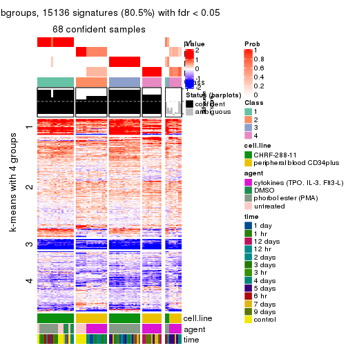</p>

</div>
<div id='tab-MAD-pam-get-signatures-no-scale-4'>
<pre><code class="r">get_signatures(res, k = 5, scale_rows = FALSE)
</code></pre>

<p></p>

</div>
<div id='tab-MAD-pam-get-signatures-no-scale-5'>
<pre><code class="r">get_signatures(res, k = 6, scale_rows = FALSE)
</code></pre>

<p></p>

</div>
</div>


Compare the overlap of signatures from different k:

```r
compare_signatures(res)
```


`get_signature()` returns a data frame invisibly. TO get the list of signatures, the function
call should be assigned to a variable explicitly. In following code, if `plot` argument is set
to `FALSE`, no heatmap is plotted while only the differential analysis is performed.

```r
# code only for demonstration
tb = get_signature(res, k = ..., plot = FALSE)
```

An example of the output of `tb` is:

```
#>   which_row         fdr    mean_1    mean_2 scaled_mean_1 scaled_mean_2 km
#> 1        38 0.042760348  8.373488  9.131774    -0.5533452     0.5164555  1
#> 2        40 0.018707592  7.106213  8.469186    -0.6173731     0.5762149  1
#> 3        55 0.019134737 10.221463 11.207825    -0.6159697     0.5749050  1
#> 4        59 0.006059896  5.921854  7.869574    -0.6899429     0.6439467  1
#> 5        60 0.018055526  8.928898 10.211722    -0.6204761     0.5791110  1
#> 6        98 0.009384629 15.714769 14.887706     0.6635654    -0.6193277  2
...
```

The columns in `tb` are:

1. `which_row`: row indices corresponding to the input matrix.
2. `fdr`: FDR for the differential test. 
3. `mean_x`: The mean value in group x.
4. `scaled_mean_x`: The mean value in group x after rows are scaled.
5. `km`: Row groups if k-means clustering is applied to rows.


UMAP plot which shows how samples are separated.


<script>
$( function() {
	$( '#tabs-MAD-pam-dimension-reduction' ).tabs();
} );
</script>
<div id='tabs-MAD-pam-dimension-reduction'>
<ul>
<li><a href='#tab-MAD-pam-dimension-reduction-1'>k = 2</a></li>
<li><a href='#tab-MAD-pam-dimension-reduction-2'>k = 3</a></li>
<li><a href='#tab-MAD-pam-dimension-reduction-3'>k = 4</a></li>
<li><a href='#tab-MAD-pam-dimension-reduction-4'>k = 5</a></li>
<li><a href='#tab-MAD-pam-dimension-reduction-5'>k = 6</a></li>
</ul>
<div id='tab-MAD-pam-dimension-reduction-1'>
<pre><code class="r">dimension_reduction(res, k = 2, method = &quot;UMAP&quot;)
</code></pre>

<p></p>

</div>
<div id='tab-MAD-pam-dimension-reduction-2'>
<pre><code class="r">dimension_reduction(res, k = 3, method = &quot;UMAP&quot;)
</code></pre>

<p></p>

</div>
<div id='tab-MAD-pam-dimension-reduction-3'>
<pre><code class="r">dimension_reduction(res, k = 4, method = &quot;UMAP&quot;)
</code></pre>

<p></p>

</div>
<div id='tab-MAD-pam-dimension-reduction-4'>
<pre><code class="r">dimension_reduction(res, k = 5, method = &quot;UMAP&quot;)
</code></pre>

<p>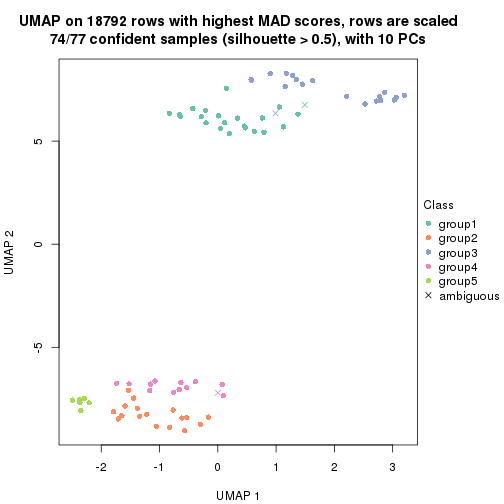</p>

</div>
<div id='tab-MAD-pam-dimension-reduction-5'>
<pre><code class="r">dimension_reduction(res, k = 6, method = &quot;UMAP&quot;)
</code></pre>

<p></p>

</div>
</div>


Following heatmap shows how subgroups are split when increasing `k`:

```r
collect_classes(res)
```


Test correlation between subgroups and known annotations. If the known
annotation is numeric, one-way ANOVA test is applied, and if the known
annotation is discrete, chi-squared contingency table test is applied.

```r
test_to_known_factors(res)
```

```
#>          n cell.line(p) agent(p)  time(p) k
#> MAD:pam 77     1.27e-17 3.00e-14 3.61e-01 2
#> MAD:pam 75     5.18e-17 1.56e-15 9.82e-03 3
#> MAD:pam 68     1.14e-14 1.77e-13 4.33e-05 4
#> MAD:pam 74     3.24e-15 2.93e-21 6.97e-07 5
#> MAD:pam 74     1.50e-14 6.02e-26 3.93e-08 6
```


If matrix rows can be associated to genes, consider to use `GO_Enrichment(res,
...)` to perform function enrichment for the signature genes.


 

---------------------------------------------------


### MAD:mclust**


The object with results only for a single top-value method and a single partition method 
can be extracted as:

```r
res = res_list["MAD", "mclust"]
# you can also extract it by
# res = res_list["MAD:mclust"]
```

A summary of `res` and all the functions that can be applied to it:

```r
res
```

```
#> A 'ConsensusPartition' object with k = 2, 3, 4, 5, 6.
#>   On a matrix with 18792 rows and 77 columns.
#>   Top rows (1000, 2000, 3000, 4000, 5000) are extracted by 'MAD' method.
#>   Subgroups are detected by 'mclust' method.
#>   Performed in total 1250 partitions by row resampling.
#>   Best k for subgroups seems to be 6.
#> 
#> Following methods can be applied to this 'ConsensusPartition' object:
#>  [1] "cola_report"             "collect_classes"         "collect_plots"          
#>  [4] "collect_stats"           "colnames"                "compare_signatures"     
#>  [7] "consensus_heatmap"       "dimension_reduction"     "functional_enrichment"  
#> [10] "get_anno_col"            "get_anno"                "get_classes"            
#> [13] "get_consensus"           "get_matrix"              "get_membership"         
#> [16] "get_param"               "get_signatures"          "get_stats"              
#> [19] "is_best_k"               "is_stable_k"             "membership_heatmap"     
#> [22] "ncol"                    "nrow"                    "plot_ecdf"              
#> [25] "rownames"                "select_partition_number" "show"                   
#> [28] "suggest_best_k"          "test_to_known_factors"
```

`collect_plots()` function collects all the plots made from `res` for all `k` (number of partitions)
into one single page to provide an easy and fast comparison between different `k`.

```r
collect_plots(res)
```


The plots are:

- The first row: a plot of the ECDF (Empirical cumulative distribution
  function) curves of the consensus matrix for each `k` and the heatmap of
  predicted classes for each `k`.
- The second row: heatmaps of the consensus matrix for each `k`.
- The third row: heatmaps of the membership matrix for each `k`.
- The fouth row: heatmaps of the signatures for each `k`.

All the plots in panels can be made by individual functions and they are
plotted later in this section.

`select_partition_number()` produces several plots showing different
statistics for choosing "optimized" `k`. There are following statistics:

- ECDF curves of the consensus matrix for each `k`;
- 1-PAC. [The PAC
  score](https://en.wikipedia.org/wiki/Consensus_clustering#Over-interpretation_potential_of_consensus_clustering)
  measures the proportion of the ambiguous subgrouping.
- Mean silhouette score.
- Concordance. The mean probability of fiting the consensus class ids in all
  partitions.
- Area increased. Denote $A_k$ as the area under the ECDF curve for current
  `k`, the area increased is defined as $A_k - A_{k-1}$.
- Rand index. The percent of pairs of samples that are both in a same cluster
  or both are not in a same cluster in the partition of k and k-1.
- Jaccard index. The ratio of pairs of samples are both in a same cluster in
  the partition of k and k-1 and the pairs of samples are both in a same
  cluster in the partition k or k-1.

The detailed explanations of these statistics can be found in [the cola
vignette](http://bioconductor.org/packages/devel/bioc/vignettes/cola/inst/doc/cola.html#toc_13).

Generally speaking, lower PAC score, higher mean silhouette score or higher
concordance corresponds to better partition. Rand index and Jaccard index
measure how similar the current partition is compared to partition with `k-1`.
If they are too similar, we won't accept `k` is better than `k-1`.

```r
select_partition_number(res)
```


The numeric values for all these statistics can be obtained by `get_stats()`.

```r
get_stats(res)
```

```
#>   k 1-PAC mean_silhouette concordance area_increased  Rand Jaccard
#> 2 2 1.000           1.000       1.000         0.5049 0.496   0.496
#> 3 3 0.999           0.987       0.992         0.2797 0.859   0.714
#> 4 4 0.900           0.879       0.925         0.1302 0.864   0.632
#> 5 5 0.998           0.966       0.985         0.0662 0.934   0.752
#> 6 6 1.000           0.979       0.991         0.0369 0.973   0.875
```

`suggest_best_k()` suggests the best $k$ based on these statistics. The rules are as follows:

- All $k$ with Jaccard index larger than 0.95 are removed because the increase of
  the partition number does not provides enough extra information. If all $k$ are removed,
  the best $k$ is assigned by `NA`.
- For $k$ with 1-PAC larger than 0.9, the maximal $k$ is taken as the "best k". Other $k$ is called "optional k".
- If it does not fit the second rule. The $k$ with the highest vote of highest
  1-PAC, mean silhouette and concordance is taken as the "best k".

```r
suggest_best_k(res)
```

```
#> [1] 6
#> attr(,"optional")
#> [1] 2 3 5
```

There is also optional best $k$ = 2 3 5 that is worth to check.

Following shows the table of the partitions (You need to click the **show/hide
code output** link to see it). The membership matrix (columns with name `p*`)
is inferred by
[`clue::cl_consensus()`](https://www.rdocumentation.org/link/cl_consensus?package=clue)
function with the `SE` method. Basically the value in the membership matrix
represents the probability to belong to a certain group. The finall class
label for an item is determined with the group with highest probability it
belongs to.

In `get_classes()` function, the entropy is calculated from the membership
matrix and the silhouette score is calculated from the consensus matrix.


<script>
$( function() {
	$( '#tabs-MAD-mclust-get-classes' ).tabs();
} );
</script>
<div id='tabs-MAD-mclust-get-classes'>
<ul>
<li><a href='#tab-MAD-mclust-get-classes-1'>k = 2</a></li>
<li><a href='#tab-MAD-mclust-get-classes-2'>k = 3</a></li>
<li><a href='#tab-MAD-mclust-get-classes-3'>k = 4</a></li>
<li><a href='#tab-MAD-mclust-get-classes-4'>k = 5</a></li>
<li><a href='#tab-MAD-mclust-get-classes-5'>k = 6</a></li>
</ul>

<div id='tab-MAD-mclust-get-classes-1'>
<p><a id='tab-MAD-mclust-get-classes-1-a' style='color:#0366d6' href='#'>show/hide code output</a></p>
<pre><code class="r">cbind(get_classes(res, k = 2), get_membership(res, k = 2))
</code></pre>

<pre><code>#&gt;          class entropy silhouette p1 p2
#&gt; GSM87962     1       0          1  1  0
#&gt; GSM87963     1       0          1  1  0
#&gt; GSM87983     1       0          1  1  0
#&gt; GSM87984     1       0          1  1  0
#&gt; GSM87961     1       0          1  1  0
#&gt; GSM87970     1       0          1  1  0
#&gt; GSM87971     1       0          1  1  0
#&gt; GSM87990     1       0          1  1  0
#&gt; GSM87991     1       0          1  1  0
#&gt; GSM87974     1       0          1  1  0
#&gt; GSM87994     1       0          1  1  0
#&gt; GSM87978     1       0          1  1  0
#&gt; GSM87979     1       0          1  1  0
#&gt; GSM87998     1       0          1  1  0
#&gt; GSM87999     1       0          1  1  0
#&gt; GSM87968     1       0          1  1  0
#&gt; GSM87987     1       0          1  1  0
#&gt; GSM87969     1       0          1  1  0
#&gt; GSM87988     1       0          1  1  0
#&gt; GSM87989     1       0          1  1  0
#&gt; GSM87972     1       0          1  1  0
#&gt; GSM87992     1       0          1  1  0
#&gt; GSM87973     1       0          1  1  0
#&gt; GSM87993     1       0          1  1  0
#&gt; GSM87975     1       0          1  1  0
#&gt; GSM87995     1       0          1  1  0
#&gt; GSM87976     1       0          1  1  0
#&gt; GSM87977     1       0          1  1  0
#&gt; GSM87996     1       0          1  1  0
#&gt; GSM87997     1       0          1  1  0
#&gt; GSM87980     1       0          1  1  0
#&gt; GSM88000     1       0          1  1  0
#&gt; GSM87981     1       0          1  1  0
#&gt; GSM87982     1       0          1  1  0
#&gt; GSM88001     1       0          1  1  0
#&gt; GSM87967     1       0          1  1  0
#&gt; GSM87964     1       0          1  1  0
#&gt; GSM87965     1       0          1  1  0
#&gt; GSM87966     1       0          1  1  0
#&gt; GSM87985     1       0          1  1  0
#&gt; GSM87986     1       0          1  1  0
#&gt; GSM88004     2       0          1  0  1
#&gt; GSM88015     2       0          1  0  1
#&gt; GSM88005     2       0          1  0  1
#&gt; GSM88006     2       0          1  0  1
#&gt; GSM88016     2       0          1  0  1
#&gt; GSM88007     2       0          1  0  1
#&gt; GSM88017     2       0          1  0  1
#&gt; GSM88029     2       0          1  0  1
#&gt; GSM88008     2       0          1  0  1
#&gt; GSM88009     2       0          1  0  1
#&gt; GSM88018     2       0          1  0  1
#&gt; GSM88024     2       0          1  0  1
#&gt; GSM88030     2       0          1  0  1
#&gt; GSM88036     2       0          1  0  1
#&gt; GSM88010     2       0          1  0  1
#&gt; GSM88011     2       0          1  0  1
#&gt; GSM88019     2       0          1  0  1
#&gt; GSM88027     2       0          1  0  1
#&gt; GSM88031     2       0          1  0  1
#&gt; GSM88012     2       0          1  0  1
#&gt; GSM88020     2       0          1  0  1
#&gt; GSM88032     2       0          1  0  1
#&gt; GSM88037     2       0          1  0  1
#&gt; GSM88013     2       0          1  0  1
#&gt; GSM88021     2       0          1  0  1
#&gt; GSM88025     2       0          1  0  1
#&gt; GSM88033     2       0          1  0  1
#&gt; GSM88014     2       0          1  0  1
#&gt; GSM88022     2       0          1  0  1
#&gt; GSM88034     2       0          1  0  1
#&gt; GSM88002     2       0          1  0  1
#&gt; GSM88003     2       0          1  0  1
#&gt; GSM88023     2       0          1  0  1
#&gt; GSM88026     2       0          1  0  1
#&gt; GSM88028     2       0          1  0  1
#&gt; GSM88035     2       0          1  0  1
</code></pre>

<script>
$('#tab-MAD-mclust-get-classes-1-a').parent().next().next().hide();
$('#tab-MAD-mclust-get-classes-1-a').click(function(){
  $('#tab-MAD-mclust-get-classes-1-a').parent().next().next().toggle();
  return(false);
});
</script>
</div>

<div id='tab-MAD-mclust-get-classes-2'>
<p><a id='tab-MAD-mclust-get-classes-2-a' style='color:#0366d6' href='#'>show/hide code output</a></p>
<pre><code class="r">cbind(get_classes(res, k = 3), get_membership(res, k = 3))
</code></pre>

<pre><code>#&gt;          class entropy silhouette    p1 p2    p3
#&gt; GSM87962     1  0.0000      0.976 1.000  0 0.000
#&gt; GSM87963     1  0.0000      0.976 1.000  0 0.000
#&gt; GSM87983     1  0.0000      0.976 1.000  0 0.000
#&gt; GSM87984     1  0.0000      0.976 1.000  0 0.000
#&gt; GSM87961     1  0.0000      0.976 1.000  0 0.000
#&gt; GSM87970     1  0.0000      0.976 1.000  0 0.000
#&gt; GSM87971     1  0.0000      0.976 1.000  0 0.000
#&gt; GSM87990     1  0.0000      0.976 1.000  0 0.000
#&gt; GSM87991     1  0.0000      0.976 1.000  0 0.000
#&gt; GSM87974     1  0.0000      0.976 1.000  0 0.000
#&gt; GSM87994     1  0.2537      0.922 0.920  0 0.080
#&gt; GSM87978     1  0.0000      0.976 1.000  0 0.000
#&gt; GSM87979     1  0.0000      0.976 1.000  0 0.000
#&gt; GSM87998     1  0.3192      0.896 0.888  0 0.112
#&gt; GSM87999     1  0.3192      0.896 0.888  0 0.112
#&gt; GSM87968     1  0.0000      0.976 1.000  0 0.000
#&gt; GSM87987     1  0.3192      0.896 0.888  0 0.112
#&gt; GSM87969     1  0.3192      0.896 0.888  0 0.112
#&gt; GSM87988     3  0.0892      0.981 0.020  0 0.980
#&gt; GSM87989     3  0.0892      0.981 0.020  0 0.980
#&gt; GSM87972     3  0.0592      0.988 0.012  0 0.988
#&gt; GSM87992     3  0.0000      0.997 0.000  0 1.000
#&gt; GSM87973     3  0.0000      0.997 0.000  0 1.000
#&gt; GSM87993     3  0.0000      0.997 0.000  0 1.000
#&gt; GSM87975     3  0.0000      0.997 0.000  0 1.000
#&gt; GSM87995     3  0.0000      0.997 0.000  0 1.000
#&gt; GSM87976     3  0.0000      0.997 0.000  0 1.000
#&gt; GSM87977     3  0.0000      0.997 0.000  0 1.000
#&gt; GSM87996     3  0.0000      0.997 0.000  0 1.000
#&gt; GSM87997     3  0.0000      0.997 0.000  0 1.000
#&gt; GSM87980     3  0.0000      0.997 0.000  0 1.000
#&gt; GSM88000     3  0.0000      0.997 0.000  0 1.000
#&gt; GSM87981     3  0.0000      0.997 0.000  0 1.000
#&gt; GSM87982     3  0.0000      0.997 0.000  0 1.000
#&gt; GSM88001     3  0.0000      0.997 0.000  0 1.000
#&gt; GSM87967     3  0.0000      0.997 0.000  0 1.000
#&gt; GSM87964     1  0.0000      0.976 1.000  0 0.000
#&gt; GSM87965     1  0.0000      0.976 1.000  0 0.000
#&gt; GSM87966     1  0.0000      0.976 1.000  0 0.000
#&gt; GSM87985     1  0.0000      0.976 1.000  0 0.000
#&gt; GSM87986     1  0.0000      0.976 1.000  0 0.000
#&gt; GSM88004     2  0.0000      1.000 0.000  1 0.000
#&gt; GSM88015     2  0.0000      1.000 0.000  1 0.000
#&gt; GSM88005     2  0.0000      1.000 0.000  1 0.000
#&gt; GSM88006     2  0.0000      1.000 0.000  1 0.000
#&gt; GSM88016     2  0.0000      1.000 0.000  1 0.000
#&gt; GSM88007     2  0.0000      1.000 0.000  1 0.000
#&gt; GSM88017     2  0.0000      1.000 0.000  1 0.000
#&gt; GSM88029     2  0.0000      1.000 0.000  1 0.000
#&gt; GSM88008     2  0.0000      1.000 0.000  1 0.000
#&gt; GSM88009     2  0.0000      1.000 0.000  1 0.000
#&gt; GSM88018     2  0.0000      1.000 0.000  1 0.000
#&gt; GSM88024     2  0.0000      1.000 0.000  1 0.000
#&gt; GSM88030     2  0.0000      1.000 0.000  1 0.000
#&gt; GSM88036     2  0.0000      1.000 0.000  1 0.000
#&gt; GSM88010     2  0.0000      1.000 0.000  1 0.000
#&gt; GSM88011     2  0.0000      1.000 0.000  1 0.000
#&gt; GSM88019     2  0.0000      1.000 0.000  1 0.000
#&gt; GSM88027     2  0.0000      1.000 0.000  1 0.000
#&gt; GSM88031     2  0.0000      1.000 0.000  1 0.000
#&gt; GSM88012     2  0.0000      1.000 0.000  1 0.000
#&gt; GSM88020     2  0.0000      1.000 0.000  1 0.000
#&gt; GSM88032     2  0.0000      1.000 0.000  1 0.000
#&gt; GSM88037     2  0.0000      1.000 0.000  1 0.000
#&gt; GSM88013     2  0.0000      1.000 0.000  1 0.000
#&gt; GSM88021     2  0.0000      1.000 0.000  1 0.000
#&gt; GSM88025     2  0.0000      1.000 0.000  1 0.000
#&gt; GSM88033     2  0.0000      1.000 0.000  1 0.000
#&gt; GSM88014     2  0.0000      1.000 0.000  1 0.000
#&gt; GSM88022     2  0.0000      1.000 0.000  1 0.000
#&gt; GSM88034     2  0.0000      1.000 0.000  1 0.000
#&gt; GSM88002     2  0.0000      1.000 0.000  1 0.000
#&gt; GSM88003     2  0.0000      1.000 0.000  1 0.000
#&gt; GSM88023     2  0.0000      1.000 0.000  1 0.000
#&gt; GSM88026     2  0.0000      1.000 0.000  1 0.000
#&gt; GSM88028     2  0.0000      1.000 0.000  1 0.000
#&gt; GSM88035     2  0.0000      1.000 0.000  1 0.000
</code></pre>

<script>
$('#tab-MAD-mclust-get-classes-2-a').parent().next().next().hide();
$('#tab-MAD-mclust-get-classes-2-a').click(function(){
  $('#tab-MAD-mclust-get-classes-2-a').parent().next().next().toggle();
  return(false);
});
</script>
</div>

<div id='tab-MAD-mclust-get-classes-3'>
<p><a id='tab-MAD-mclust-get-classes-3-a' style='color:#0366d6' href='#'>show/hide code output</a></p>
<pre><code class="r">cbind(get_classes(res, k = 4), get_membership(res, k = 4))
</code></pre>

<pre><code>#&gt;          class entropy silhouette    p1    p2    p3    p4
#&gt; GSM87962     1  0.0000      0.981 1.000 0.000 0.000 0.000
#&gt; GSM87963     1  0.0000      0.981 1.000 0.000 0.000 0.000
#&gt; GSM87983     1  0.0000      0.981 1.000 0.000 0.000 0.000
#&gt; GSM87984     1  0.0000      0.981 1.000 0.000 0.000 0.000
#&gt; GSM87961     1  0.0000      0.981 1.000 0.000 0.000 0.000
#&gt; GSM87970     1  0.0000      0.981 1.000 0.000 0.000 0.000
#&gt; GSM87971     1  0.0000      0.981 1.000 0.000 0.000 0.000
#&gt; GSM87990     1  0.0000      0.981 1.000 0.000 0.000 0.000
#&gt; GSM87991     1  0.0000      0.981 1.000 0.000 0.000 0.000
#&gt; GSM87974     1  0.0000      0.981 1.000 0.000 0.000 0.000
#&gt; GSM87994     1  0.0188      0.979 0.996 0.000 0.004 0.000
#&gt; GSM87978     1  0.0000      0.981 1.000 0.000 0.000 0.000
#&gt; GSM87979     1  0.0000      0.981 1.000 0.000 0.000 0.000
#&gt; GSM87998     1  0.0188      0.979 0.996 0.000 0.004 0.000
#&gt; GSM87999     1  0.0188      0.979 0.996 0.000 0.004 0.000
#&gt; GSM87968     1  0.0000      0.981 1.000 0.000 0.000 0.000
#&gt; GSM87987     1  0.0188      0.979 0.996 0.000 0.004 0.000
#&gt; GSM87969     1  0.0188      0.979 0.996 0.000 0.004 0.000
#&gt; GSM87988     1  0.2814      0.842 0.868 0.000 0.132 0.000
#&gt; GSM87989     1  0.4331      0.594 0.712 0.000 0.288 0.000
#&gt; GSM87972     3  0.4250      0.605 0.276 0.000 0.724 0.000
#&gt; GSM87992     3  0.0817      0.953 0.024 0.000 0.976 0.000
#&gt; GSM87973     3  0.0000      0.976 0.000 0.000 1.000 0.000
#&gt; GSM87993     3  0.0000      0.976 0.000 0.000 1.000 0.000
#&gt; GSM87975     3  0.0000      0.976 0.000 0.000 1.000 0.000
#&gt; GSM87995     3  0.0000      0.976 0.000 0.000 1.000 0.000
#&gt; GSM87976     3  0.0000      0.976 0.000 0.000 1.000 0.000
#&gt; GSM87977     3  0.0000      0.976 0.000 0.000 1.000 0.000
#&gt; GSM87996     3  0.0000      0.976 0.000 0.000 1.000 0.000
#&gt; GSM87997     3  0.0000      0.976 0.000 0.000 1.000 0.000
#&gt; GSM87980     3  0.0000      0.976 0.000 0.000 1.000 0.000
#&gt; GSM88000     3  0.0000      0.976 0.000 0.000 1.000 0.000
#&gt; GSM87981     3  0.0000      0.976 0.000 0.000 1.000 0.000
#&gt; GSM87982     3  0.0000      0.976 0.000 0.000 1.000 0.000
#&gt; GSM88001     3  0.0000      0.976 0.000 0.000 1.000 0.000
#&gt; GSM87967     3  0.0000      0.976 0.000 0.000 1.000 0.000
#&gt; GSM87964     1  0.0000      0.981 1.000 0.000 0.000 0.000
#&gt; GSM87965     1  0.0000      0.981 1.000 0.000 0.000 0.000
#&gt; GSM87966     1  0.0000      0.981 1.000 0.000 0.000 0.000
#&gt; GSM87985     1  0.0000      0.981 1.000 0.000 0.000 0.000
#&gt; GSM87986     1  0.0000      0.981 1.000 0.000 0.000 0.000
#&gt; GSM88004     2  0.4981      0.619 0.000 0.536 0.000 0.464
#&gt; GSM88015     2  0.4916      0.674 0.000 0.576 0.000 0.424
#&gt; GSM88005     2  0.4916      0.674 0.000 0.576 0.000 0.424
#&gt; GSM88006     2  0.4916      0.674 0.000 0.576 0.000 0.424
#&gt; GSM88016     2  0.4925      0.668 0.000 0.572 0.000 0.428
#&gt; GSM88007     2  0.4916      0.674 0.000 0.576 0.000 0.424
#&gt; GSM88017     2  0.4925      0.668 0.000 0.572 0.000 0.428
#&gt; GSM88029     2  0.4916      0.674 0.000 0.576 0.000 0.424
#&gt; GSM88008     2  0.4916      0.674 0.000 0.576 0.000 0.424
#&gt; GSM88009     2  0.4916      0.674 0.000 0.576 0.000 0.424
#&gt; GSM88018     4  0.1557      0.889 0.000 0.056 0.000 0.944
#&gt; GSM88024     4  0.4898     -0.272 0.000 0.416 0.000 0.584
#&gt; GSM88030     4  0.0000      0.963 0.000 0.000 0.000 1.000
#&gt; GSM88036     4  0.0000      0.963 0.000 0.000 0.000 1.000
#&gt; GSM88010     4  0.0000      0.963 0.000 0.000 0.000 1.000
#&gt; GSM88011     4  0.0000      0.963 0.000 0.000 0.000 1.000
#&gt; GSM88019     4  0.0000      0.963 0.000 0.000 0.000 1.000
#&gt; GSM88027     4  0.0000      0.963 0.000 0.000 0.000 1.000
#&gt; GSM88031     4  0.0000      0.963 0.000 0.000 0.000 1.000
#&gt; GSM88012     4  0.0000      0.963 0.000 0.000 0.000 1.000
#&gt; GSM88020     4  0.0000      0.963 0.000 0.000 0.000 1.000
#&gt; GSM88032     4  0.0000      0.963 0.000 0.000 0.000 1.000
#&gt; GSM88037     4  0.0000      0.963 0.000 0.000 0.000 1.000
#&gt; GSM88013     4  0.0000      0.963 0.000 0.000 0.000 1.000
#&gt; GSM88021     4  0.0000      0.963 0.000 0.000 0.000 1.000
#&gt; GSM88025     4  0.0000      0.963 0.000 0.000 0.000 1.000
#&gt; GSM88033     4  0.0000      0.963 0.000 0.000 0.000 1.000
#&gt; GSM88014     4  0.0000      0.963 0.000 0.000 0.000 1.000
#&gt; GSM88022     4  0.0000      0.963 0.000 0.000 0.000 1.000
#&gt; GSM88034     4  0.0000      0.963 0.000 0.000 0.000 1.000
#&gt; GSM88002     2  0.1211      0.640 0.000 0.960 0.000 0.040
#&gt; GSM88003     2  0.1211      0.640 0.000 0.960 0.000 0.040
#&gt; GSM88023     2  0.1211      0.640 0.000 0.960 0.000 0.040
#&gt; GSM88026     2  0.1211      0.640 0.000 0.960 0.000 0.040
#&gt; GSM88028     2  0.1211      0.640 0.000 0.960 0.000 0.040
#&gt; GSM88035     2  0.1211      0.640 0.000 0.960 0.000 0.040
</code></pre>

<script>
$('#tab-MAD-mclust-get-classes-3-a').parent().next().next().hide();
$('#tab-MAD-mclust-get-classes-3-a').click(function(){
  $('#tab-MAD-mclust-get-classes-3-a').parent().next().next().toggle();
  return(false);
});
</script>
</div>

<div id='tab-MAD-mclust-get-classes-4'>
<p><a id='tab-MAD-mclust-get-classes-4-a' style='color:#0366d6' href='#'>show/hide code output</a></p>
<pre><code class="r">cbind(get_classes(res, k = 5), get_membership(res, k = 5))
</code></pre>

<pre><code>#&gt;          class entropy silhouette    p1    p2    p3    p4 p5
#&gt; GSM87962     1  0.0000      0.999 1.000 0.000 0.000 0.000  0
#&gt; GSM87963     1  0.0000      0.999 1.000 0.000 0.000 0.000  0
#&gt; GSM87983     1  0.0000      0.999 1.000 0.000 0.000 0.000  0
#&gt; GSM87984     1  0.0000      0.999 1.000 0.000 0.000 0.000  0
#&gt; GSM87961     1  0.0000      0.999 1.000 0.000 0.000 0.000  0
#&gt; GSM87970     1  0.0000      0.999 1.000 0.000 0.000 0.000  0
#&gt; GSM87971     1  0.0000      0.999 1.000 0.000 0.000 0.000  0
#&gt; GSM87990     1  0.0000      0.999 1.000 0.000 0.000 0.000  0
#&gt; GSM87991     1  0.0000      0.999 1.000 0.000 0.000 0.000  0
#&gt; GSM87974     1  0.0000      0.999 1.000 0.000 0.000 0.000  0
#&gt; GSM87994     1  0.0162      0.996 0.996 0.000 0.004 0.000  0
#&gt; GSM87978     1  0.0000      0.999 1.000 0.000 0.000 0.000  0
#&gt; GSM87979     1  0.0000      0.999 1.000 0.000 0.000 0.000  0
#&gt; GSM87998     1  0.0162      0.996 0.996 0.000 0.004 0.000  0
#&gt; GSM87999     1  0.0162      0.996 0.996 0.000 0.004 0.000  0
#&gt; GSM87968     1  0.0000      0.999 1.000 0.000 0.000 0.000  0
#&gt; GSM87987     1  0.0162      0.996 0.996 0.000 0.004 0.000  0
#&gt; GSM87969     1  0.0162      0.996 0.996 0.000 0.004 0.000  0
#&gt; GSM87988     3  0.3534      0.659 0.256 0.000 0.744 0.000  0
#&gt; GSM87989     3  0.3534      0.659 0.256 0.000 0.744 0.000  0
#&gt; GSM87972     3  0.2605      0.795 0.148 0.000 0.852 0.000  0
#&gt; GSM87992     3  0.0000      0.948 0.000 0.000 1.000 0.000  0
#&gt; GSM87973     3  0.0000      0.948 0.000 0.000 1.000 0.000  0
#&gt; GSM87993     3  0.0000      0.948 0.000 0.000 1.000 0.000  0
#&gt; GSM87975     3  0.0000      0.948 0.000 0.000 1.000 0.000  0
#&gt; GSM87995     3  0.0000      0.948 0.000 0.000 1.000 0.000  0
#&gt; GSM87976     3  0.0000      0.948 0.000 0.000 1.000 0.000  0
#&gt; GSM87977     3  0.0000      0.948 0.000 0.000 1.000 0.000  0
#&gt; GSM87996     3  0.0000      0.948 0.000 0.000 1.000 0.000  0
#&gt; GSM87997     3  0.0000      0.948 0.000 0.000 1.000 0.000  0
#&gt; GSM87980     3  0.0000      0.948 0.000 0.000 1.000 0.000  0
#&gt; GSM88000     3  0.0000      0.948 0.000 0.000 1.000 0.000  0
#&gt; GSM87981     3  0.0000      0.948 0.000 0.000 1.000 0.000  0
#&gt; GSM87982     3  0.0000      0.948 0.000 0.000 1.000 0.000  0
#&gt; GSM88001     3  0.0000      0.948 0.000 0.000 1.000 0.000  0
#&gt; GSM87967     3  0.0000      0.948 0.000 0.000 1.000 0.000  0
#&gt; GSM87964     1  0.0000      0.999 1.000 0.000 0.000 0.000  0
#&gt; GSM87965     1  0.0000      0.999 1.000 0.000 0.000 0.000  0
#&gt; GSM87966     1  0.0000      0.999 1.000 0.000 0.000 0.000  0
#&gt; GSM87985     1  0.0000      0.999 1.000 0.000 0.000 0.000  0
#&gt; GSM87986     1  0.0000      0.999 1.000 0.000 0.000 0.000  0
#&gt; GSM88004     2  0.2471      0.836 0.000 0.864 0.000 0.136  0
#&gt; GSM88015     2  0.0000      0.947 0.000 1.000 0.000 0.000  0
#&gt; GSM88005     2  0.0000      0.947 0.000 1.000 0.000 0.000  0
#&gt; GSM88006     2  0.0000      0.947 0.000 1.000 0.000 0.000  0
#&gt; GSM88016     2  0.1608      0.915 0.000 0.928 0.000 0.072  0
#&gt; GSM88007     2  0.0000      0.947 0.000 1.000 0.000 0.000  0
#&gt; GSM88017     2  0.0000      0.947 0.000 1.000 0.000 0.000  0
#&gt; GSM88029     2  0.1732      0.904 0.000 0.920 0.000 0.080  0
#&gt; GSM88008     2  0.0000      0.947 0.000 1.000 0.000 0.000  0
#&gt; GSM88009     2  0.0000      0.947 0.000 1.000 0.000 0.000  0
#&gt; GSM88018     2  0.1732      0.904 0.000 0.920 0.000 0.080  0
#&gt; GSM88024     2  0.1671      0.911 0.000 0.924 0.000 0.076  0
#&gt; GSM88030     4  0.0000      1.000 0.000 0.000 0.000 1.000  0
#&gt; GSM88036     4  0.0000      1.000 0.000 0.000 0.000 1.000  0
#&gt; GSM88010     4  0.0000      1.000 0.000 0.000 0.000 1.000  0
#&gt; GSM88011     4  0.0000      1.000 0.000 0.000 0.000 1.000  0
#&gt; GSM88019     4  0.0000      1.000 0.000 0.000 0.000 1.000  0
#&gt; GSM88027     4  0.0000      1.000 0.000 0.000 0.000 1.000  0
#&gt; GSM88031     4  0.0000      1.000 0.000 0.000 0.000 1.000  0
#&gt; GSM88012     4  0.0000      1.000 0.000 0.000 0.000 1.000  0
#&gt; GSM88020     4  0.0000      1.000 0.000 0.000 0.000 1.000  0
#&gt; GSM88032     4  0.0000      1.000 0.000 0.000 0.000 1.000  0
#&gt; GSM88037     4  0.0000      1.000 0.000 0.000 0.000 1.000  0
#&gt; GSM88013     4  0.0000      1.000 0.000 0.000 0.000 1.000  0
#&gt; GSM88021     4  0.0000      1.000 0.000 0.000 0.000 1.000  0
#&gt; GSM88025     4  0.0000      1.000 0.000 0.000 0.000 1.000  0
#&gt; GSM88033     4  0.0000      1.000 0.000 0.000 0.000 1.000  0
#&gt; GSM88014     4  0.0000      1.000 0.000 0.000 0.000 1.000  0
#&gt; GSM88022     4  0.0000      1.000 0.000 0.000 0.000 1.000  0
#&gt; GSM88034     4  0.0000      1.000 0.000 0.000 0.000 1.000  0
#&gt; GSM88002     5  0.0000      1.000 0.000 0.000 0.000 0.000  1
#&gt; GSM88003     5  0.0000      1.000 0.000 0.000 0.000 0.000  1
#&gt; GSM88023     5  0.0000      1.000 0.000 0.000 0.000 0.000  1
#&gt; GSM88026     5  0.0000      1.000 0.000 0.000 0.000 0.000  1
#&gt; GSM88028     5  0.0000      1.000 0.000 0.000 0.000 0.000  1
#&gt; GSM88035     5  0.0000      1.000 0.000 0.000 0.000 0.000  1
</code></pre>

<script>
$('#tab-MAD-mclust-get-classes-4-a').parent().next().next().hide();
$('#tab-MAD-mclust-get-classes-4-a').click(function(){
  $('#tab-MAD-mclust-get-classes-4-a').parent().next().next().toggle();
  return(false);
});
</script>
</div>

<div id='tab-MAD-mclust-get-classes-5'>
<p><a id='tab-MAD-mclust-get-classes-5-a' style='color:#0366d6' href='#'>show/hide code output</a></p>
<pre><code class="r">cbind(get_classes(res, k = 6), get_membership(res, k = 6))
</code></pre>

<pre><code>#&gt;          class entropy silhouette    p1 p2    p3    p4 p5    p6
#&gt; GSM87962     1  0.0000      0.999 1.000  0 0.000 0.000  0 0.000
#&gt; GSM87963     1  0.0000      0.999 1.000  0 0.000 0.000  0 0.000
#&gt; GSM87983     1  0.0000      0.999 1.000  0 0.000 0.000  0 0.000
#&gt; GSM87984     1  0.0000      0.999 1.000  0 0.000 0.000  0 0.000
#&gt; GSM87961     1  0.0000      0.999 1.000  0 0.000 0.000  0 0.000
#&gt; GSM87970     1  0.0000      0.999 1.000  0 0.000 0.000  0 0.000
#&gt; GSM87971     1  0.0000      0.999 1.000  0 0.000 0.000  0 0.000
#&gt; GSM87990     1  0.0000      0.999 1.000  0 0.000 0.000  0 0.000
#&gt; GSM87991     1  0.0000      0.999 1.000  0 0.000 0.000  0 0.000
#&gt; GSM87974     1  0.0000      0.999 1.000  0 0.000 0.000  0 0.000
#&gt; GSM87994     1  0.0146      0.997 0.996  0 0.000 0.000  0 0.004
#&gt; GSM87978     1  0.0000      0.999 1.000  0 0.000 0.000  0 0.000
#&gt; GSM87979     1  0.0000      0.999 1.000  0 0.000 0.000  0 0.000
#&gt; GSM87998     1  0.0146      0.997 0.996  0 0.000 0.000  0 0.004
#&gt; GSM87999     1  0.0146      0.997 0.996  0 0.000 0.000  0 0.004
#&gt; GSM87968     1  0.0000      0.999 1.000  0 0.000 0.000  0 0.000
#&gt; GSM87987     1  0.0146      0.997 0.996  0 0.000 0.000  0 0.004
#&gt; GSM87969     1  0.0146      0.997 0.996  0 0.000 0.000  0 0.004
#&gt; GSM87988     3  0.3652      0.534 0.324  0 0.672 0.000  0 0.004
#&gt; GSM87989     3  0.2442      0.798 0.144  0 0.852 0.000  0 0.004
#&gt; GSM87972     3  0.2006      0.847 0.104  0 0.892 0.000  0 0.004
#&gt; GSM87992     3  0.0000      0.955 0.000  0 1.000 0.000  0 0.000
#&gt; GSM87973     3  0.0000      0.955 0.000  0 1.000 0.000  0 0.000
#&gt; GSM87993     3  0.0000      0.955 0.000  0 1.000 0.000  0 0.000
#&gt; GSM87975     3  0.0000      0.955 0.000  0 1.000 0.000  0 0.000
#&gt; GSM87995     3  0.0000      0.955 0.000  0 1.000 0.000  0 0.000
#&gt; GSM87976     3  0.0000      0.955 0.000  0 1.000 0.000  0 0.000
#&gt; GSM87977     3  0.0000      0.955 0.000  0 1.000 0.000  0 0.000
#&gt; GSM87996     3  0.0000      0.955 0.000  0 1.000 0.000  0 0.000
#&gt; GSM87997     3  0.0000      0.955 0.000  0 1.000 0.000  0 0.000
#&gt; GSM87980     3  0.0000      0.955 0.000  0 1.000 0.000  0 0.000
#&gt; GSM88000     3  0.0000      0.955 0.000  0 1.000 0.000  0 0.000
#&gt; GSM87981     3  0.0000      0.955 0.000  0 1.000 0.000  0 0.000
#&gt; GSM87982     3  0.0000      0.955 0.000  0 1.000 0.000  0 0.000
#&gt; GSM88001     3  0.0000      0.955 0.000  0 1.000 0.000  0 0.000
#&gt; GSM87967     3  0.0000      0.955 0.000  0 1.000 0.000  0 0.000
#&gt; GSM87964     1  0.0000      0.999 1.000  0 0.000 0.000  0 0.000
#&gt; GSM87965     1  0.0000      0.999 1.000  0 0.000 0.000  0 0.000
#&gt; GSM87966     1  0.0000      0.999 1.000  0 0.000 0.000  0 0.000
#&gt; GSM87985     1  0.0000      0.999 1.000  0 0.000 0.000  0 0.000
#&gt; GSM87986     1  0.0000      0.999 1.000  0 0.000 0.000  0 0.000
#&gt; GSM88004     2  0.0000      1.000 0.000  1 0.000 0.000  0 0.000
#&gt; GSM88015     2  0.0000      1.000 0.000  1 0.000 0.000  0 0.000
#&gt; GSM88005     2  0.0000      1.000 0.000  1 0.000 0.000  0 0.000
#&gt; GSM88006     2  0.0000      1.000 0.000  1 0.000 0.000  0 0.000
#&gt; GSM88016     2  0.0000      1.000 0.000  1 0.000 0.000  0 0.000
#&gt; GSM88007     2  0.0000      1.000 0.000  1 0.000 0.000  0 0.000
#&gt; GSM88017     2  0.0000      1.000 0.000  1 0.000 0.000  0 0.000
#&gt; GSM88029     2  0.0000      1.000 0.000  1 0.000 0.000  0 0.000
#&gt; GSM88008     2  0.0000      1.000 0.000  1 0.000 0.000  0 0.000
#&gt; GSM88009     2  0.0000      1.000 0.000  1 0.000 0.000  0 0.000
#&gt; GSM88018     2  0.0000      1.000 0.000  1 0.000 0.000  0 0.000
#&gt; GSM88024     2  0.0000      1.000 0.000  1 0.000 0.000  0 0.000
#&gt; GSM88030     4  0.0000      0.991 0.000  0 0.000 1.000  0 0.000
#&gt; GSM88036     4  0.0000      0.991 0.000  0 0.000 1.000  0 0.000
#&gt; GSM88010     4  0.0000      0.991 0.000  0 0.000 1.000  0 0.000
#&gt; GSM88011     4  0.0000      0.991 0.000  0 0.000 1.000  0 0.000
#&gt; GSM88019     4  0.0000      0.991 0.000  0 0.000 1.000  0 0.000
#&gt; GSM88027     4  0.0000      0.991 0.000  0 0.000 1.000  0 0.000
#&gt; GSM88031     6  0.0146      1.000 0.000  0 0.000 0.004  0 0.996
#&gt; GSM88012     4  0.0000      0.991 0.000  0 0.000 1.000  0 0.000
#&gt; GSM88020     6  0.0146      1.000 0.000  0 0.000 0.004  0 0.996
#&gt; GSM88032     6  0.0146      1.000 0.000  0 0.000 0.004  0 0.996
#&gt; GSM88037     6  0.0146      1.000 0.000  0 0.000 0.004  0 0.996
#&gt; GSM88013     4  0.0632      0.980 0.000  0 0.000 0.976  0 0.024
#&gt; GSM88021     6  0.0146      1.000 0.000  0 0.000 0.004  0 0.996
#&gt; GSM88025     6  0.0146      1.000 0.000  0 0.000 0.004  0 0.996
#&gt; GSM88033     6  0.0146      1.000 0.000  0 0.000 0.004  0 0.996
#&gt; GSM88014     4  0.0632      0.980 0.000  0 0.000 0.976  0 0.024
#&gt; GSM88022     4  0.0632      0.980 0.000  0 0.000 0.976  0 0.024
#&gt; GSM88034     6  0.0146      1.000 0.000  0 0.000 0.004  0 0.996
#&gt; GSM88002     5  0.0000      1.000 0.000  0 0.000 0.000  1 0.000
#&gt; GSM88003     5  0.0000      1.000 0.000  0 0.000 0.000  1 0.000
#&gt; GSM88023     5  0.0000      1.000 0.000  0 0.000 0.000  1 0.000
#&gt; GSM88026     5  0.0000      1.000 0.000  0 0.000 0.000  1 0.000
#&gt; GSM88028     5  0.0000      1.000 0.000  0 0.000 0.000  1 0.000
#&gt; GSM88035     5  0.0000      1.000 0.000  0 0.000 0.000  1 0.000
</code></pre>

<script>
$('#tab-MAD-mclust-get-classes-5-a').parent().next().next().hide();
$('#tab-MAD-mclust-get-classes-5-a').click(function(){
  $('#tab-MAD-mclust-get-classes-5-a').parent().next().next().toggle();
  return(false);
});
</script>
</div>
</div>

Heatmaps for the consensus matrix. It visualizes the probability of two
samples to be in a same group.


<script>
$( function() {
	$( '#tabs-MAD-mclust-consensus-heatmap' ).tabs();
} );
</script>
<div id='tabs-MAD-mclust-consensus-heatmap'>
<ul>
<li><a href='#tab-MAD-mclust-consensus-heatmap-1'>k = 2</a></li>
<li><a href='#tab-MAD-mclust-consensus-heatmap-2'>k = 3</a></li>
<li><a href='#tab-MAD-mclust-consensus-heatmap-3'>k = 4</a></li>
<li><a href='#tab-MAD-mclust-consensus-heatmap-4'>k = 5</a></li>
<li><a href='#tab-MAD-mclust-consensus-heatmap-5'>k = 6</a></li>
</ul>
<div id='tab-MAD-mclust-consensus-heatmap-1'>
<pre><code class="r">consensus_heatmap(res, k = 2)
</code></pre>

<p></p>

</div>
<div id='tab-MAD-mclust-consensus-heatmap-2'>
<pre><code class="r">consensus_heatmap(res, k = 3)
</code></pre>

<p></p>

</div>
<div id='tab-MAD-mclust-consensus-heatmap-3'>
<pre><code class="r">consensus_heatmap(res, k = 4)
</code></pre>

<p></p>

</div>
<div id='tab-MAD-mclust-consensus-heatmap-4'>
<pre><code class="r">consensus_heatmap(res, k = 5)
</code></pre>

<p></p>

</div>
<div id='tab-MAD-mclust-consensus-heatmap-5'>
<pre><code class="r">consensus_heatmap(res, k = 6)
</code></pre>

<p></p>

</div>
</div>

Heatmaps for the membership of samples in all partitions to see how consistent they are:


<script>
$( function() {
	$( '#tabs-MAD-mclust-membership-heatmap' ).tabs();
} );
</script>
<div id='tabs-MAD-mclust-membership-heatmap'>
<ul>
<li><a href='#tab-MAD-mclust-membership-heatmap-1'>k = 2</a></li>
<li><a href='#tab-MAD-mclust-membership-heatmap-2'>k = 3</a></li>
<li><a href='#tab-MAD-mclust-membership-heatmap-3'>k = 4</a></li>
<li><a href='#tab-MAD-mclust-membership-heatmap-4'>k = 5</a></li>
<li><a href='#tab-MAD-mclust-membership-heatmap-5'>k = 6</a></li>
</ul>
<div id='tab-MAD-mclust-membership-heatmap-1'>
<pre><code class="r">membership_heatmap(res, k = 2)
</code></pre>

<p></p>

</div>
<div id='tab-MAD-mclust-membership-heatmap-2'>
<pre><code class="r">membership_heatmap(res, k = 3)
</code></pre>

<p></p>

</div>
<div id='tab-MAD-mclust-membership-heatmap-3'>
<pre><code class="r">membership_heatmap(res, k = 4)
</code></pre>

<p></p>

</div>
<div id='tab-MAD-mclust-membership-heatmap-4'>
<pre><code class="r">membership_heatmap(res, k = 5)
</code></pre>

<p></p>

</div>
<div id='tab-MAD-mclust-membership-heatmap-5'>
<pre><code class="r">membership_heatmap(res, k = 6)
</code></pre>

<p></p>

</div>
</div>

As soon as we have had the classes for columns, we can look for signatures
which are significantly different between classes which can be candidate marks
for certain classes. Following are the heatmaps for signatures.


Signature heatmaps where rows are scaled:


<script>
$( function() {
	$( '#tabs-MAD-mclust-get-signatures' ).tabs();
} );
</script>
<div id='tabs-MAD-mclust-get-signatures'>
<ul>
<li><a href='#tab-MAD-mclust-get-signatures-1'>k = 2</a></li>
<li><a href='#tab-MAD-mclust-get-signatures-2'>k = 3</a></li>
<li><a href='#tab-MAD-mclust-get-signatures-3'>k = 4</a></li>
<li><a href='#tab-MAD-mclust-get-signatures-4'>k = 5</a></li>
<li><a href='#tab-MAD-mclust-get-signatures-5'>k = 6</a></li>
</ul>
<div id='tab-MAD-mclust-get-signatures-1'>
<pre><code class="r">get_signatures(res, k = 2)
</code></pre>

<p></p>

</div>
<div id='tab-MAD-mclust-get-signatures-2'>
<pre><code class="r">get_signatures(res, k = 3)
</code></pre>

<p></p>

</div>
<div id='tab-MAD-mclust-get-signatures-3'>
<pre><code class="r">get_signatures(res, k = 4)
</code></pre>

<p></p>

</div>
<div id='tab-MAD-mclust-get-signatures-4'>
<pre><code class="r">get_signatures(res, k = 5)
</code></pre>

<p></p>

</div>
<div id='tab-MAD-mclust-get-signatures-5'>
<pre><code class="r">get_signatures(res, k = 6)
</code></pre>

<p></p>

</div>
</div>


Signature heatmaps where rows are not scaled:


<script>
$( function() {
	$( '#tabs-MAD-mclust-get-signatures-no-scale' ).tabs();
} );
</script>
<div id='tabs-MAD-mclust-get-signatures-no-scale'>
<ul>
<li><a href='#tab-MAD-mclust-get-signatures-no-scale-1'>k = 2</a></li>
<li><a href='#tab-MAD-mclust-get-signatures-no-scale-2'>k = 3</a></li>
<li><a href='#tab-MAD-mclust-get-signatures-no-scale-3'>k = 4</a></li>
<li><a href='#tab-MAD-mclust-get-signatures-no-scale-4'>k = 5</a></li>
<li><a href='#tab-MAD-mclust-get-signatures-no-scale-5'>k = 6</a></li>
</ul>
<div id='tab-MAD-mclust-get-signatures-no-scale-1'>
<pre><code class="r">get_signatures(res, k = 2, scale_rows = FALSE)
</code></pre>

<p></p>

</div>
<div id='tab-MAD-mclust-get-signatures-no-scale-2'>
<pre><code class="r">get_signatures(res, k = 3, scale_rows = FALSE)
</code></pre>

<p></p>

</div>
<div id='tab-MAD-mclust-get-signatures-no-scale-3'>
<pre><code class="r">get_signatures(res, k = 4, scale_rows = FALSE)
</code></pre>

<p></p>

</div>
<div id='tab-MAD-mclust-get-signatures-no-scale-4'>
<pre><code class="r">get_signatures(res, k = 5, scale_rows = FALSE)
</code></pre>

<p></p>

</div>
<div id='tab-MAD-mclust-get-signatures-no-scale-5'>
<pre><code class="r">get_signatures(res, k = 6, scale_rows = FALSE)
</code></pre>

<p></p>

</div>
</div>


Compare the overlap of signatures from different k:

```r
compare_signatures(res)
```


`get_signature()` returns a data frame invisibly. TO get the list of signatures, the function
call should be assigned to a variable explicitly. In following code, if `plot` argument is set
to `FALSE`, no heatmap is plotted while only the differential analysis is performed.

```r
# code only for demonstration
tb = get_signature(res, k = ..., plot = FALSE)
```

An example of the output of `tb` is:

```
#>   which_row         fdr    mean_1    mean_2 scaled_mean_1 scaled_mean_2 km
#> 1        38 0.042760348  8.373488  9.131774    -0.5533452     0.5164555  1
#> 2        40 0.018707592  7.106213  8.469186    -0.6173731     0.5762149  1
#> 3        55 0.019134737 10.221463 11.207825    -0.6159697     0.5749050  1
#> 4        59 0.006059896  5.921854  7.869574    -0.6899429     0.6439467  1
#> 5        60 0.018055526  8.928898 10.211722    -0.6204761     0.5791110  1
#> 6        98 0.009384629 15.714769 14.887706     0.6635654    -0.6193277  2
...
```

The columns in `tb` are:

1. `which_row`: row indices corresponding to the input matrix.
2. `fdr`: FDR for the differential test. 
3. `mean_x`: The mean value in group x.
4. `scaled_mean_x`: The mean value in group x after rows are scaled.
5. `km`: Row groups if k-means clustering is applied to rows.


UMAP plot which shows how samples are separated.


<script>
$( function() {
	$( '#tabs-MAD-mclust-dimension-reduction' ).tabs();
} );
</script>
<div id='tabs-MAD-mclust-dimension-reduction'>
<ul>
<li><a href='#tab-MAD-mclust-dimension-reduction-1'>k = 2</a></li>
<li><a href='#tab-MAD-mclust-dimension-reduction-2'>k = 3</a></li>
<li><a href='#tab-MAD-mclust-dimension-reduction-3'>k = 4</a></li>
<li><a href='#tab-MAD-mclust-dimension-reduction-4'>k = 5</a></li>
<li><a href='#tab-MAD-mclust-dimension-reduction-5'>k = 6</a></li>
</ul>
<div id='tab-MAD-mclust-dimension-reduction-1'>
<pre><code class="r">dimension_reduction(res, k = 2, method = &quot;UMAP&quot;)
</code></pre>

<p></p>

</div>
<div id='tab-MAD-mclust-dimension-reduction-2'>
<pre><code class="r">dimension_reduction(res, k = 3, method = &quot;UMAP&quot;)
</code></pre>

<p></p>

</div>
<div id='tab-MAD-mclust-dimension-reduction-3'>
<pre><code class="r">dimension_reduction(res, k = 4, method = &quot;UMAP&quot;)
</code></pre>

<p></p>

</div>
<div id='tab-MAD-mclust-dimension-reduction-4'>
<pre><code class="r">dimension_reduction(res, k = 5, method = &quot;UMAP&quot;)
</code></pre>

<p></p>

</div>
<div id='tab-MAD-mclust-dimension-reduction-5'>
<pre><code class="r">dimension_reduction(res, k = 6, method = &quot;UMAP&quot;)
</code></pre>

<p></p>

</div>
</div>


Following heatmap shows how subgroups are split when increasing `k`:

```r
collect_classes(res)
```


Test correlation between subgroups and known annotations. If the known
annotation is numeric, one-way ANOVA test is applied, and if the known
annotation is discrete, chi-squared contingency table test is applied.

```r
test_to_known_factors(res)
```

```
#>             n cell.line(p) agent(p)  time(p) k
#> MAD:mclust 77     1.27e-17 3.00e-14 3.61e-01 2
#> MAD:mclust 77     1.90e-17 1.77e-15 3.80e-03 3
#> MAD:mclust 76     2.21e-16 2.45e-15 1.46e-05 4
#> MAD:mclust 77     7.52e-16 8.50e-22 1.27e-08 5
#> MAD:mclust 77     3.56e-15 2.90e-20 8.56e-08 6
```


If matrix rows can be associated to genes, consider to use `GO_Enrichment(res,
...)` to perform function enrichment for the signature genes.


 

---------------------------------------------------


### MAD:NMF**


The object with results only for a single top-value method and a single partition method 
can be extracted as:

```r
res = res_list["MAD", "NMF"]
# you can also extract it by
# res = res_list["MAD:NMF"]
```

A summary of `res` and all the functions that can be applied to it:

```r
res
```

```
#> A 'ConsensusPartition' object with k = 2, 3, 4, 5, 6.
#>   On a matrix with 18792 rows and 77 columns.
#>   Top rows (1000, 2000, 3000, 4000, 5000) are extracted by 'MAD' method.
#>   Subgroups are detected by 'NMF' method.
#>   Performed in total 1250 partitions by row resampling.
#>   Best k for subgroups seems to be 2.
#> 
#> Following methods can be applied to this 'ConsensusPartition' object:
#>  [1] "cola_report"             "collect_classes"         "collect_plots"          
#>  [4] "collect_stats"           "colnames"                "compare_signatures"     
#>  [7] "consensus_heatmap"       "dimension_reduction"     "functional_enrichment"  
#> [10] "get_anno_col"            "get_anno"                "get_classes"            
#> [13] "get_consensus"           "get_matrix"              "get_membership"         
#> [16] "get_param"               "get_signatures"          "get_stats"              
#> [19] "is_best_k"               "is_stable_k"             "membership_heatmap"     
#> [22] "ncol"                    "nrow"                    "plot_ecdf"              
#> [25] "rownames"                "select_partition_number" "show"                   
#> [28] "suggest_best_k"          "test_to_known_factors"
```

`collect_plots()` function collects all the plots made from `res` for all `k` (number of partitions)
into one single page to provide an easy and fast comparison between different `k`.

```r
collect_plots(res)
```


The plots are:

- The first row: a plot of the ECDF (Empirical cumulative distribution
  function) curves of the consensus matrix for each `k` and the heatmap of
  predicted classes for each `k`.
- The second row: heatmaps of the consensus matrix for each `k`.
- The third row: heatmaps of the membership matrix for each `k`.
- The fouth row: heatmaps of the signatures for each `k`.

All the plots in panels can be made by individual functions and they are
plotted later in this section.

`select_partition_number()` produces several plots showing different
statistics for choosing "optimized" `k`. There are following statistics:

- ECDF curves of the consensus matrix for each `k`;
- 1-PAC. [The PAC
  score](https://en.wikipedia.org/wiki/Consensus_clustering#Over-interpretation_potential_of_consensus_clustering)
  measures the proportion of the ambiguous subgrouping.
- Mean silhouette score.
- Concordance. The mean probability of fiting the consensus class ids in all
  partitions.
- Area increased. Denote $A_k$ as the area under the ECDF curve for current
  `k`, the area increased is defined as $A_k - A_{k-1}$.
- Rand index. The percent of pairs of samples that are both in a same cluster
  or both are not in a same cluster in the partition of k and k-1.
- Jaccard index. The ratio of pairs of samples are both in a same cluster in
  the partition of k and k-1 and the pairs of samples are both in a same
  cluster in the partition k or k-1.

The detailed explanations of these statistics can be found in [the cola
vignette](http://bioconductor.org/packages/devel/bioc/vignettes/cola/inst/doc/cola.html#toc_13).

Generally speaking, lower PAC score, higher mean silhouette score or higher
concordance corresponds to better partition. Rand index and Jaccard index
measure how similar the current partition is compared to partition with `k-1`.
If they are too similar, we won't accept `k` is better than `k-1`.

```r
select_partition_number(res)
```


The numeric values for all these statistics can be obtained by `get_stats()`.

```r
get_stats(res)
```

```
#>   k 1-PAC mean_silhouette concordance area_increased  Rand Jaccard
#> 2 2 1.000           1.000       1.000         0.5049 0.496   0.496
#> 3 3 0.723           0.759       0.771         0.2398 0.895   0.788
#> 4 4 0.863           0.879       0.938         0.1712 0.837   0.603
#> 5 5 0.767           0.840       0.869         0.0614 0.863   0.558
#> 6 6 0.838           0.800       0.890         0.0329 0.971   0.873
```

`suggest_best_k()` suggests the best $k$ based on these statistics. The rules are as follows:

- All $k$ with Jaccard index larger than 0.95 are removed because the increase of
  the partition number does not provides enough extra information. If all $k$ are removed,
  the best $k$ is assigned by `NA`.
- For $k$ with 1-PAC larger than 0.9, the maximal $k$ is taken as the "best k". Other $k$ is called "optional k".
- If it does not fit the second rule. The $k$ with the highest vote of highest
  1-PAC, mean silhouette and concordance is taken as the "best k".

```r
suggest_best_k(res)
```

```
#> [1] 2
```


Following shows the table of the partitions (You need to click the **show/hide
code output** link to see it). The membership matrix (columns with name `p*`)
is inferred by
[`clue::cl_consensus()`](https://www.rdocumentation.org/link/cl_consensus?package=clue)
function with the `SE` method. Basically the value in the membership matrix
represents the probability to belong to a certain group. The finall class
label for an item is determined with the group with highest probability it
belongs to.

In `get_classes()` function, the entropy is calculated from the membership
matrix and the silhouette score is calculated from the consensus matrix.


<script>
$( function() {
	$( '#tabs-MAD-NMF-get-classes' ).tabs();
} );
</script>
<div id='tabs-MAD-NMF-get-classes'>
<ul>
<li><a href='#tab-MAD-NMF-get-classes-1'>k = 2</a></li>
<li><a href='#tab-MAD-NMF-get-classes-2'>k = 3</a></li>
<li><a href='#tab-MAD-NMF-get-classes-3'>k = 4</a></li>
<li><a href='#tab-MAD-NMF-get-classes-4'>k = 5</a></li>
<li><a href='#tab-MAD-NMF-get-classes-5'>k = 6</a></li>
</ul>

<div id='tab-MAD-NMF-get-classes-1'>
<p><a id='tab-MAD-NMF-get-classes-1-a' style='color:#0366d6' href='#'>show/hide code output</a></p>
<pre><code class="r">cbind(get_classes(res, k = 2), get_membership(res, k = 2))
</code></pre>

<pre><code>#&gt;          class entropy silhouette p1 p2
#&gt; GSM87962     1       0          1  1  0
#&gt; GSM87963     1       0          1  1  0
#&gt; GSM87983     1       0          1  1  0
#&gt; GSM87984     1       0          1  1  0
#&gt; GSM87961     1       0          1  1  0
#&gt; GSM87970     1       0          1  1  0
#&gt; GSM87971     1       0          1  1  0
#&gt; GSM87990     1       0          1  1  0
#&gt; GSM87991     1       0          1  1  0
#&gt; GSM87974     1       0          1  1  0
#&gt; GSM87994     1       0          1  1  0
#&gt; GSM87978     1       0          1  1  0
#&gt; GSM87979     1       0          1  1  0
#&gt; GSM87998     1       0          1  1  0
#&gt; GSM87999     1       0          1  1  0
#&gt; GSM87968     1       0          1  1  0
#&gt; GSM87987     1       0          1  1  0
#&gt; GSM87969     1       0          1  1  0
#&gt; GSM87988     1       0          1  1  0
#&gt; GSM87989     1       0          1  1  0
#&gt; GSM87972     1       0          1  1  0
#&gt; GSM87992     1       0          1  1  0
#&gt; GSM87973     1       0          1  1  0
#&gt; GSM87993     1       0          1  1  0
#&gt; GSM87975     1       0          1  1  0
#&gt; GSM87995     1       0          1  1  0
#&gt; GSM87976     1       0          1  1  0
#&gt; GSM87977     1       0          1  1  0
#&gt; GSM87996     1       0          1  1  0
#&gt; GSM87997     1       0          1  1  0
#&gt; GSM87980     1       0          1  1  0
#&gt; GSM88000     1       0          1  1  0
#&gt; GSM87981     1       0          1  1  0
#&gt; GSM87982     1       0          1  1  0
#&gt; GSM88001     1       0          1  1  0
#&gt; GSM87967     1       0          1  1  0
#&gt; GSM87964     1       0          1  1  0
#&gt; GSM87965     1       0          1  1  0
#&gt; GSM87966     1       0          1  1  0
#&gt; GSM87985     1       0          1  1  0
#&gt; GSM87986     1       0          1  1  0
#&gt; GSM88004     2       0          1  0  1
#&gt; GSM88015     2       0          1  0  1
#&gt; GSM88005     2       0          1  0  1
#&gt; GSM88006     2       0          1  0  1
#&gt; GSM88016     2       0          1  0  1
#&gt; GSM88007     2       0          1  0  1
#&gt; GSM88017     2       0          1  0  1
#&gt; GSM88029     2       0          1  0  1
#&gt; GSM88008     2       0          1  0  1
#&gt; GSM88009     2       0          1  0  1
#&gt; GSM88018     2       0          1  0  1
#&gt; GSM88024     2       0          1  0  1
#&gt; GSM88030     2       0          1  0  1
#&gt; GSM88036     2       0          1  0  1
#&gt; GSM88010     2       0          1  0  1
#&gt; GSM88011     2       0          1  0  1
#&gt; GSM88019     2       0          1  0  1
#&gt; GSM88027     2       0          1  0  1
#&gt; GSM88031     2       0          1  0  1
#&gt; GSM88012     2       0          1  0  1
#&gt; GSM88020     2       0          1  0  1
#&gt; GSM88032     2       0          1  0  1
#&gt; GSM88037     2       0          1  0  1
#&gt; GSM88013     2       0          1  0  1
#&gt; GSM88021     2       0          1  0  1
#&gt; GSM88025     2       0          1  0  1
#&gt; GSM88033     2       0          1  0  1
#&gt; GSM88014     2       0          1  0  1
#&gt; GSM88022     2       0          1  0  1
#&gt; GSM88034     2       0          1  0  1
#&gt; GSM88002     2       0          1  0  1
#&gt; GSM88003     2       0          1  0  1
#&gt; GSM88023     2       0          1  0  1
#&gt; GSM88026     2       0          1  0  1
#&gt; GSM88028     2       0          1  0  1
#&gt; GSM88035     2       0          1  0  1
</code></pre>

<script>
$('#tab-MAD-NMF-get-classes-1-a').parent().next().next().hide();
$('#tab-MAD-NMF-get-classes-1-a').click(function(){
  $('#tab-MAD-NMF-get-classes-1-a').parent().next().next().toggle();
  return(false);
});
</script>
</div>

<div id='tab-MAD-NMF-get-classes-2'>
<p><a id='tab-MAD-NMF-get-classes-2-a' style='color:#0366d6' href='#'>show/hide code output</a></p>
<pre><code class="r">cbind(get_classes(res, k = 3), get_membership(res, k = 3))
</code></pre>

<pre><code>#&gt;          class entropy silhouette    p1    p2    p3
#&gt; GSM87962     1  0.0000     0.7417 1.000 0.000 0.000
#&gt; GSM87963     1  0.0000     0.7417 1.000 0.000 0.000
#&gt; GSM87983     1  0.0000     0.7417 1.000 0.000 0.000
#&gt; GSM87984     1  0.0000     0.7417 1.000 0.000 0.000
#&gt; GSM87961     1  0.0000     0.7417 1.000 0.000 0.000
#&gt; GSM87970     1  0.0000     0.7417 1.000 0.000 0.000
#&gt; GSM87971     1  0.0000     0.7417 1.000 0.000 0.000
#&gt; GSM87990     1  0.0000     0.7417 1.000 0.000 0.000
#&gt; GSM87991     1  0.0747     0.7444 0.984 0.016 0.000
#&gt; GSM87974     1  0.0000     0.7417 1.000 0.000 0.000
#&gt; GSM87994     1  0.6045     0.7923 0.620 0.380 0.000
#&gt; GSM87978     1  0.0000     0.7417 1.000 0.000 0.000
#&gt; GSM87979     1  0.0237     0.7424 0.996 0.004 0.000
#&gt; GSM87998     1  0.6204     0.7958 0.576 0.424 0.000
#&gt; GSM87999     1  0.6225     0.7961 0.568 0.432 0.000
#&gt; GSM87968     1  0.0592     0.7438 0.988 0.012 0.000
#&gt; GSM87987     1  0.6235     0.7962 0.564 0.436 0.000
#&gt; GSM87969     1  0.6140     0.7949 0.596 0.404 0.000
#&gt; GSM87988     1  0.6291     0.7957 0.532 0.468 0.000
#&gt; GSM87989     1  0.6291     0.7957 0.532 0.468 0.000
#&gt; GSM87972     1  0.6291     0.7957 0.532 0.468 0.000
#&gt; GSM87992     1  0.6295     0.7953 0.528 0.472 0.000
#&gt; GSM87973     1  0.6295     0.7953 0.528 0.472 0.000
#&gt; GSM87993     1  0.6295     0.7953 0.528 0.472 0.000
#&gt; GSM87975     1  0.6295     0.7953 0.528 0.472 0.000
#&gt; GSM87995     1  0.6295     0.7953 0.528 0.472 0.000
#&gt; GSM87976     1  0.6295     0.7953 0.528 0.472 0.000
#&gt; GSM87977     1  0.6295     0.7953 0.528 0.472 0.000
#&gt; GSM87996     1  0.6295     0.7953 0.528 0.472 0.000
#&gt; GSM87997     1  0.6295     0.7953 0.528 0.472 0.000
#&gt; GSM87980     1  0.6295     0.7953 0.528 0.472 0.000
#&gt; GSM88000     1  0.6295     0.7953 0.528 0.472 0.000
#&gt; GSM87981     1  0.6295     0.7953 0.528 0.472 0.000
#&gt; GSM87982     1  0.6295     0.7953 0.528 0.472 0.000
#&gt; GSM88001     1  0.6295     0.7953 0.528 0.472 0.000
#&gt; GSM87967     1  0.6295     0.7953 0.528 0.472 0.000
#&gt; GSM87964     1  0.0000     0.7417 1.000 0.000 0.000
#&gt; GSM87965     1  0.0000     0.7417 1.000 0.000 0.000
#&gt; GSM87966     1  0.0000     0.7417 1.000 0.000 0.000
#&gt; GSM87985     1  0.0000     0.7417 1.000 0.000 0.000
#&gt; GSM87986     1  0.0000     0.7417 1.000 0.000 0.000
#&gt; GSM88004     2  0.7542     0.8278 0.040 0.528 0.432
#&gt; GSM88015     2  0.9151     0.3792 0.292 0.528 0.180
#&gt; GSM88005     2  0.9184     0.5625 0.188 0.528 0.284
#&gt; GSM88006     2  0.9211     0.5482 0.196 0.528 0.276
#&gt; GSM88016     2  0.8362     0.7431 0.088 0.528 0.384
#&gt; GSM88007     2  0.7627     0.8216 0.044 0.528 0.428
#&gt; GSM88017     2  0.6295     0.8753 0.000 0.528 0.472
#&gt; GSM88029     2  0.6299     0.8711 0.000 0.524 0.476
#&gt; GSM88008     2  0.6505     0.8729 0.004 0.528 0.468
#&gt; GSM88009     2  0.6295     0.8753 0.000 0.528 0.472
#&gt; GSM88018     2  0.6804     0.8651 0.012 0.528 0.460
#&gt; GSM88024     2  0.6295     0.8753 0.000 0.528 0.472
#&gt; GSM88030     3  0.5678    -0.0391 0.000 0.316 0.684
#&gt; GSM88036     3  0.5810    -0.1718 0.000 0.336 0.664
#&gt; GSM88010     2  0.6302     0.8660 0.000 0.520 0.480
#&gt; GSM88011     2  0.6302     0.8660 0.000 0.520 0.480
#&gt; GSM88019     2  0.6309     0.8354 0.000 0.504 0.496
#&gt; GSM88027     2  0.6302     0.8660 0.000 0.520 0.480
#&gt; GSM88031     3  0.2165     0.7901 0.000 0.064 0.936
#&gt; GSM88012     3  0.4702     0.4897 0.000 0.212 0.788
#&gt; GSM88020     3  0.0000     0.8152 0.000 0.000 1.000
#&gt; GSM88032     3  0.0000     0.8152 0.000 0.000 1.000
#&gt; GSM88037     3  0.0000     0.8152 0.000 0.000 1.000
#&gt; GSM88013     3  0.2537     0.7780 0.000 0.080 0.920
#&gt; GSM88021     3  0.0000     0.8152 0.000 0.000 1.000
#&gt; GSM88025     3  0.0000     0.8152 0.000 0.000 1.000
#&gt; GSM88033     3  0.0000     0.8152 0.000 0.000 1.000
#&gt; GSM88014     3  0.2537     0.7780 0.000 0.080 0.920
#&gt; GSM88022     3  0.3752     0.6735 0.000 0.144 0.856
#&gt; GSM88034     3  0.0237     0.8093 0.000 0.004 0.996
#&gt; GSM88002     2  0.6295     0.8753 0.000 0.528 0.472
#&gt; GSM88003     2  0.6295     0.8753 0.000 0.528 0.472
#&gt; GSM88023     2  0.6295     0.8753 0.000 0.528 0.472
#&gt; GSM88026     2  0.6295     0.8753 0.000 0.528 0.472
#&gt; GSM88028     2  0.6295     0.8753 0.000 0.528 0.472
#&gt; GSM88035     2  0.6295     0.8753 0.000 0.528 0.472
</code></pre>

<script>
$('#tab-MAD-NMF-get-classes-2-a').parent().next().next().hide();
$('#tab-MAD-NMF-get-classes-2-a').click(function(){
  $('#tab-MAD-NMF-get-classes-2-a').parent().next().next().toggle();
  return(false);
});
</script>
</div>

<div id='tab-MAD-NMF-get-classes-3'>
<p><a id='tab-MAD-NMF-get-classes-3-a' style='color:#0366d6' href='#'>show/hide code output</a></p>
<pre><code class="r">cbind(get_classes(res, k = 4), get_membership(res, k = 4))
</code></pre>

<pre><code>#&gt;          class entropy silhouette    p1    p2    p3    p4
#&gt; GSM87962     1  0.1022     0.8861 0.968 0.000 0.032 0.000
#&gt; GSM87963     1  0.0592     0.8779 0.984 0.000 0.016 0.000
#&gt; GSM87983     1  0.1557     0.8831 0.944 0.000 0.056 0.000
#&gt; GSM87984     1  0.0707     0.8806 0.980 0.000 0.020 0.000
#&gt; GSM87961     1  0.0469     0.8744 0.988 0.000 0.012 0.000
#&gt; GSM87970     1  0.4222     0.6805 0.728 0.000 0.272 0.000
#&gt; GSM87971     1  0.1716     0.8794 0.936 0.000 0.064 0.000
#&gt; GSM87990     1  0.3444     0.7966 0.816 0.000 0.184 0.000
#&gt; GSM87991     3  0.4193     0.6567 0.268 0.000 0.732 0.000
#&gt; GSM87974     3  0.4746     0.4553 0.368 0.000 0.632 0.000
#&gt; GSM87994     3  0.3356     0.7725 0.176 0.000 0.824 0.000
#&gt; GSM87978     3  0.4679     0.4945 0.352 0.000 0.648 0.000
#&gt; GSM87979     3  0.4008     0.6906 0.244 0.000 0.756 0.000
#&gt; GSM87998     3  0.2704     0.8203 0.124 0.000 0.876 0.000
#&gt; GSM87999     3  0.2760     0.8173 0.128 0.000 0.872 0.000
#&gt; GSM87968     3  0.4543     0.5537 0.324 0.000 0.676 0.000
#&gt; GSM87987     3  0.1716     0.8579 0.064 0.000 0.936 0.000
#&gt; GSM87969     3  0.2760     0.8174 0.128 0.000 0.872 0.000
#&gt; GSM87988     3  0.0469     0.8830 0.012 0.000 0.988 0.000
#&gt; GSM87989     3  0.0336     0.8844 0.008 0.000 0.992 0.000
#&gt; GSM87972     3  0.0336     0.8844 0.008 0.000 0.992 0.000
#&gt; GSM87992     3  0.0000     0.8863 0.000 0.000 1.000 0.000
#&gt; GSM87973     3  0.0000     0.8863 0.000 0.000 1.000 0.000
#&gt; GSM87993     3  0.0000     0.8863 0.000 0.000 1.000 0.000
#&gt; GSM87975     3  0.0000     0.8863 0.000 0.000 1.000 0.000
#&gt; GSM87995     3  0.0000     0.8863 0.000 0.000 1.000 0.000
#&gt; GSM87976     3  0.0000     0.8863 0.000 0.000 1.000 0.000
#&gt; GSM87977     3  0.0000     0.8863 0.000 0.000 1.000 0.000
#&gt; GSM87996     3  0.0000     0.8863 0.000 0.000 1.000 0.000
#&gt; GSM87997     3  0.0000     0.8863 0.000 0.000 1.000 0.000
#&gt; GSM87980     3  0.0000     0.8863 0.000 0.000 1.000 0.000
#&gt; GSM88000     3  0.0000     0.8863 0.000 0.000 1.000 0.000
#&gt; GSM87981     3  0.0000     0.8863 0.000 0.000 1.000 0.000
#&gt; GSM87982     3  0.0000     0.8863 0.000 0.000 1.000 0.000
#&gt; GSM88001     3  0.0000     0.8863 0.000 0.000 1.000 0.000
#&gt; GSM87967     3  0.0000     0.8863 0.000 0.000 1.000 0.000
#&gt; GSM87964     1  0.1022     0.8862 0.968 0.000 0.032 0.000
#&gt; GSM87965     1  0.3975     0.7293 0.760 0.000 0.240 0.000
#&gt; GSM87966     3  0.4994     0.0614 0.480 0.000 0.520 0.000
#&gt; GSM87985     1  0.1118     0.8866 0.964 0.000 0.036 0.000
#&gt; GSM87986     1  0.4500     0.5865 0.684 0.000 0.316 0.000
#&gt; GSM88004     2  0.0000     0.9953 0.000 1.000 0.000 0.000
#&gt; GSM88015     2  0.0469     0.9864 0.012 0.988 0.000 0.000
#&gt; GSM88005     2  0.0000     0.9953 0.000 1.000 0.000 0.000
#&gt; GSM88006     2  0.0000     0.9953 0.000 1.000 0.000 0.000
#&gt; GSM88016     2  0.0000     0.9953 0.000 1.000 0.000 0.000
#&gt; GSM88007     2  0.0000     0.9953 0.000 1.000 0.000 0.000
#&gt; GSM88017     2  0.0000     0.9953 0.000 1.000 0.000 0.000
#&gt; GSM88029     2  0.0000     0.9953 0.000 1.000 0.000 0.000
#&gt; GSM88008     2  0.0000     0.9953 0.000 1.000 0.000 0.000
#&gt; GSM88009     2  0.0000     0.9953 0.000 1.000 0.000 0.000
#&gt; GSM88018     2  0.0000     0.9953 0.000 1.000 0.000 0.000
#&gt; GSM88024     2  0.0000     0.9953 0.000 1.000 0.000 0.000
#&gt; GSM88030     4  0.2281     0.9012 0.000 0.096 0.000 0.904
#&gt; GSM88036     4  0.2345     0.8969 0.000 0.100 0.000 0.900
#&gt; GSM88010     4  0.4008     0.7037 0.000 0.244 0.000 0.756
#&gt; GSM88011     4  0.0707     0.9626 0.000 0.020 0.000 0.980
#&gt; GSM88019     4  0.0469     0.9670 0.000 0.012 0.000 0.988
#&gt; GSM88027     4  0.0469     0.9670 0.000 0.012 0.000 0.988
#&gt; GSM88031     4  0.0469     0.9670 0.000 0.012 0.000 0.988
#&gt; GSM88012     4  0.0469     0.9670 0.000 0.012 0.000 0.988
#&gt; GSM88020     4  0.0188     0.9681 0.000 0.004 0.000 0.996
#&gt; GSM88032     4  0.0000     0.9681 0.000 0.000 0.000 1.000
#&gt; GSM88037     4  0.0000     0.9681 0.000 0.000 0.000 1.000
#&gt; GSM88013     4  0.0000     0.9681 0.000 0.000 0.000 1.000
#&gt; GSM88021     4  0.0000     0.9681 0.000 0.000 0.000 1.000
#&gt; GSM88025     4  0.0000     0.9681 0.000 0.000 0.000 1.000
#&gt; GSM88033     4  0.0000     0.9681 0.000 0.000 0.000 1.000
#&gt; GSM88014     4  0.0000     0.9681 0.000 0.000 0.000 1.000
#&gt; GSM88022     4  0.0336     0.9677 0.000 0.008 0.000 0.992
#&gt; GSM88034     4  0.0000     0.9681 0.000 0.000 0.000 1.000
#&gt; GSM88002     2  0.0469     0.9917 0.012 0.988 0.000 0.000
#&gt; GSM88003     2  0.0469     0.9917 0.012 0.988 0.000 0.000
#&gt; GSM88023     2  0.0469     0.9917 0.012 0.988 0.000 0.000
#&gt; GSM88026     2  0.0469     0.9917 0.012 0.988 0.000 0.000
#&gt; GSM88028     2  0.0469     0.9917 0.012 0.988 0.000 0.000
#&gt; GSM88035     2  0.0469     0.9917 0.012 0.988 0.000 0.000
</code></pre>

<script>
$('#tab-MAD-NMF-get-classes-3-a').parent().next().next().hide();
$('#tab-MAD-NMF-get-classes-3-a').click(function(){
  $('#tab-MAD-NMF-get-classes-3-a').parent().next().next().toggle();
  return(false);
});
</script>
</div>

<div id='tab-MAD-NMF-get-classes-4'>
<p><a id='tab-MAD-NMF-get-classes-4-a' style='color:#0366d6' href='#'>show/hide code output</a></p>
<pre><code class="r">cbind(get_classes(res, k = 5), get_membership(res, k = 5))
</code></pre>

<pre><code>#&gt;          class entropy silhouette    p1    p2    p3    p4    p5
#&gt; GSM87962     1  0.0898      0.848 0.972 0.000 0.008 0.000 0.020
#&gt; GSM87963     1  0.1041      0.843 0.964 0.000 0.004 0.000 0.032
#&gt; GSM87983     1  0.1830      0.852 0.932 0.000 0.040 0.000 0.028
#&gt; GSM87984     1  0.1012      0.850 0.968 0.000 0.012 0.000 0.020
#&gt; GSM87961     1  0.1282      0.840 0.952 0.000 0.004 0.000 0.044
#&gt; GSM87970     1  0.2914      0.863 0.872 0.000 0.076 0.000 0.052
#&gt; GSM87971     1  0.2414      0.826 0.900 0.008 0.012 0.000 0.080
#&gt; GSM87990     1  0.1493      0.856 0.948 0.000 0.028 0.000 0.024
#&gt; GSM87991     1  0.3274      0.810 0.780 0.000 0.220 0.000 0.000
#&gt; GSM87974     1  0.3999      0.855 0.808 0.008 0.116 0.000 0.068
#&gt; GSM87994     1  0.3561      0.777 0.740 0.000 0.260 0.000 0.000
#&gt; GSM87978     1  0.4011      0.856 0.808 0.008 0.112 0.000 0.072
#&gt; GSM87979     1  0.3710      0.853 0.808 0.000 0.144 0.000 0.048
#&gt; GSM87998     1  0.3774      0.734 0.704 0.000 0.296 0.000 0.000
#&gt; GSM87999     1  0.3913      0.693 0.676 0.000 0.324 0.000 0.000
#&gt; GSM87968     1  0.4169      0.854 0.800 0.012 0.116 0.000 0.072
#&gt; GSM87987     1  0.4227      0.497 0.580 0.000 0.420 0.000 0.000
#&gt; GSM87969     1  0.3689      0.770 0.740 0.000 0.256 0.000 0.004
#&gt; GSM87988     3  0.2020      0.894 0.100 0.000 0.900 0.000 0.000
#&gt; GSM87989     3  0.1908      0.904 0.092 0.000 0.908 0.000 0.000
#&gt; GSM87972     3  0.1282      0.951 0.044 0.000 0.952 0.000 0.004
#&gt; GSM87992     3  0.1410      0.934 0.060 0.000 0.940 0.000 0.000
#&gt; GSM87973     3  0.0579      0.959 0.008 0.000 0.984 0.000 0.008
#&gt; GSM87993     3  0.0609      0.959 0.020 0.000 0.980 0.000 0.000
#&gt; GSM87975     3  0.1907      0.938 0.044 0.000 0.928 0.000 0.028
#&gt; GSM87995     3  0.0703      0.957 0.024 0.000 0.976 0.000 0.000
#&gt; GSM87976     3  0.2077      0.932 0.040 0.000 0.920 0.000 0.040
#&gt; GSM87977     3  0.1310      0.955 0.024 0.000 0.956 0.000 0.020
#&gt; GSM87996     3  0.0794      0.954 0.028 0.000 0.972 0.000 0.000
#&gt; GSM87997     3  0.0510      0.959 0.016 0.000 0.984 0.000 0.000
#&gt; GSM87980     3  0.1493      0.948 0.028 0.000 0.948 0.000 0.024
#&gt; GSM88000     3  0.0510      0.959 0.016 0.000 0.984 0.000 0.000
#&gt; GSM87981     3  0.1582      0.946 0.028 0.000 0.944 0.000 0.028
#&gt; GSM87982     3  0.0693      0.958 0.008 0.000 0.980 0.000 0.012
#&gt; GSM88001     3  0.0404      0.959 0.012 0.000 0.988 0.000 0.000
#&gt; GSM87967     3  0.0671      0.957 0.004 0.000 0.980 0.000 0.016
#&gt; GSM87964     1  0.3077      0.806 0.864 0.028 0.008 0.000 0.100
#&gt; GSM87965     1  0.2011      0.868 0.908 0.000 0.088 0.000 0.004
#&gt; GSM87966     1  0.3224      0.843 0.824 0.000 0.160 0.000 0.016
#&gt; GSM87985     1  0.1018      0.852 0.968 0.000 0.016 0.000 0.016
#&gt; GSM87986     1  0.2388      0.861 0.900 0.000 0.072 0.000 0.028
#&gt; GSM88004     2  0.1270      0.882 0.000 0.948 0.000 0.000 0.052
#&gt; GSM88015     2  0.1211      0.895 0.016 0.960 0.000 0.000 0.024
#&gt; GSM88005     2  0.0703      0.907 0.000 0.976 0.000 0.000 0.024
#&gt; GSM88006     2  0.0510      0.908 0.000 0.984 0.000 0.000 0.016
#&gt; GSM88016     2  0.0404      0.911 0.000 0.988 0.000 0.000 0.012
#&gt; GSM88007     2  0.0162      0.911 0.000 0.996 0.000 0.000 0.004
#&gt; GSM88017     2  0.2806      0.841 0.000 0.844 0.000 0.004 0.152
#&gt; GSM88029     2  0.2930      0.840 0.000 0.832 0.000 0.004 0.164
#&gt; GSM88008     2  0.0290      0.911 0.000 0.992 0.000 0.000 0.008
#&gt; GSM88009     2  0.0703      0.904 0.000 0.976 0.000 0.000 0.024
#&gt; GSM88018     2  0.2629      0.856 0.000 0.860 0.000 0.004 0.136
#&gt; GSM88024     2  0.2389      0.868 0.000 0.880 0.000 0.004 0.116
#&gt; GSM88030     4  0.6092      0.270 0.000 0.364 0.000 0.504 0.132
#&gt; GSM88036     4  0.6140      0.244 0.000 0.372 0.000 0.492 0.136
#&gt; GSM88010     4  0.4481      0.413 0.000 0.416 0.000 0.576 0.008
#&gt; GSM88011     4  0.3983      0.560 0.000 0.340 0.000 0.660 0.000
#&gt; GSM88019     4  0.4135      0.551 0.000 0.340 0.000 0.656 0.004
#&gt; GSM88027     4  0.4497      0.403 0.000 0.424 0.000 0.568 0.008
#&gt; GSM88031     4  0.0000      0.828 0.000 0.000 0.000 1.000 0.000
#&gt; GSM88012     4  0.0510      0.827 0.000 0.016 0.000 0.984 0.000
#&gt; GSM88020     4  0.1671      0.795 0.000 0.000 0.000 0.924 0.076
#&gt; GSM88032     4  0.0162      0.828 0.000 0.000 0.000 0.996 0.004
#&gt; GSM88037     4  0.0162      0.828 0.000 0.000 0.000 0.996 0.004
#&gt; GSM88013     4  0.0451      0.828 0.000 0.008 0.000 0.988 0.004
#&gt; GSM88021     4  0.0162      0.828 0.000 0.000 0.000 0.996 0.004
#&gt; GSM88025     4  0.0162      0.828 0.000 0.000 0.000 0.996 0.004
#&gt; GSM88033     4  0.0162      0.828 0.000 0.000 0.000 0.996 0.004
#&gt; GSM88014     4  0.0451      0.828 0.000 0.008 0.000 0.988 0.004
#&gt; GSM88022     4  0.0404      0.828 0.000 0.012 0.000 0.988 0.000
#&gt; GSM88034     4  0.0880      0.818 0.000 0.000 0.000 0.968 0.032
#&gt; GSM88002     5  0.3999      0.994 0.000 0.344 0.000 0.000 0.656
#&gt; GSM88003     5  0.3999      0.994 0.000 0.344 0.000 0.000 0.656
#&gt; GSM88023     5  0.4015      0.991 0.000 0.348 0.000 0.000 0.652
#&gt; GSM88026     5  0.3999      0.994 0.000 0.344 0.000 0.000 0.656
#&gt; GSM88028     5  0.3983      0.991 0.000 0.340 0.000 0.000 0.660
#&gt; GSM88035     5  0.3983      0.991 0.000 0.340 0.000 0.000 0.660
</code></pre>

<script>
$('#tab-MAD-NMF-get-classes-4-a').parent().next().next().hide();
$('#tab-MAD-NMF-get-classes-4-a').click(function(){
  $('#tab-MAD-NMF-get-classes-4-a').parent().next().next().toggle();
  return(false);
});
</script>
</div>

<div id='tab-MAD-NMF-get-classes-5'>
<p><a id='tab-MAD-NMF-get-classes-5-a' style='color:#0366d6' href='#'>show/hide code output</a></p>
<pre><code class="r">cbind(get_classes(res, k = 6), get_membership(res, k = 6))
</code></pre>

<pre><code>#&gt;          class entropy silhouette    p1    p2    p3    p4    p5    p6
#&gt; GSM87962     1  0.0717    0.89297 0.976 0.000 0.000 0.000 0.016 0.008
#&gt; GSM87963     1  0.0622    0.89321 0.980 0.000 0.000 0.000 0.012 0.008
#&gt; GSM87983     1  0.2187    0.88573 0.908 0.004 0.012 0.000 0.012 0.064
#&gt; GSM87984     1  0.1514    0.89099 0.944 0.004 0.004 0.000 0.012 0.036
#&gt; GSM87961     1  0.0820    0.89011 0.972 0.000 0.000 0.000 0.012 0.016
#&gt; GSM87970     1  0.1408    0.88501 0.944 0.000 0.000 0.000 0.036 0.020
#&gt; GSM87971     1  0.2933    0.85674 0.860 0.008 0.000 0.000 0.056 0.076
#&gt; GSM87990     1  0.1820    0.89222 0.924 0.000 0.008 0.000 0.012 0.056
#&gt; GSM87991     1  0.2201    0.88096 0.900 0.000 0.052 0.000 0.000 0.048
#&gt; GSM87974     1  0.3017    0.86124 0.848 0.004 0.000 0.000 0.052 0.096
#&gt; GSM87994     1  0.3103    0.85880 0.836 0.000 0.064 0.000 0.000 0.100
#&gt; GSM87978     1  0.3079    0.85899 0.848 0.008 0.000 0.000 0.052 0.092
#&gt; GSM87979     1  0.2554    0.87501 0.876 0.000 0.000 0.000 0.048 0.076
#&gt; GSM87998     1  0.3857    0.79331 0.768 0.000 0.152 0.000 0.000 0.080
#&gt; GSM87999     1  0.4156    0.75421 0.732 0.000 0.188 0.000 0.000 0.080
#&gt; GSM87968     1  0.4079    0.84236 0.800 0.016 0.028 0.000 0.048 0.108
#&gt; GSM87987     1  0.4494    0.71041 0.692 0.000 0.216 0.000 0.000 0.092
#&gt; GSM87969     1  0.3252    0.84772 0.832 0.000 0.112 0.000 0.008 0.048
#&gt; GSM87988     3  0.2799    0.84489 0.076 0.000 0.860 0.000 0.000 0.064
#&gt; GSM87989     3  0.2744    0.84976 0.072 0.000 0.864 0.000 0.000 0.064
#&gt; GSM87972     3  0.1780    0.93685 0.028 0.000 0.932 0.000 0.012 0.028
#&gt; GSM87992     3  0.0909    0.94022 0.020 0.000 0.968 0.000 0.000 0.012
#&gt; GSM87973     3  0.0767    0.95119 0.004 0.000 0.976 0.000 0.012 0.008
#&gt; GSM87993     3  0.0363    0.95034 0.012 0.000 0.988 0.000 0.000 0.000
#&gt; GSM87975     3  0.2295    0.91651 0.028 0.000 0.904 0.000 0.016 0.052
#&gt; GSM87995     3  0.0363    0.95034 0.012 0.000 0.988 0.000 0.000 0.000
#&gt; GSM87976     3  0.2487    0.90599 0.024 0.000 0.892 0.000 0.020 0.064
#&gt; GSM87977     3  0.1269    0.94328 0.012 0.000 0.956 0.000 0.020 0.012
#&gt; GSM87996     3  0.0363    0.95034 0.012 0.000 0.988 0.000 0.000 0.000
#&gt; GSM87997     3  0.0146    0.95165 0.004 0.000 0.996 0.000 0.000 0.000
#&gt; GSM87980     3  0.1546    0.93852 0.016 0.000 0.944 0.000 0.020 0.020
#&gt; GSM88000     3  0.0146    0.95165 0.004 0.000 0.996 0.000 0.000 0.000
#&gt; GSM87981     3  0.1452    0.93977 0.012 0.000 0.948 0.000 0.020 0.020
#&gt; GSM87982     3  0.0870    0.95090 0.004 0.000 0.972 0.000 0.012 0.012
#&gt; GSM88001     3  0.0260    0.95121 0.008 0.000 0.992 0.000 0.000 0.000
#&gt; GSM87967     3  0.0508    0.95045 0.000 0.000 0.984 0.000 0.012 0.004
#&gt; GSM87964     1  0.2933    0.85396 0.860 0.008 0.000 0.000 0.056 0.076
#&gt; GSM87965     1  0.0260    0.89568 0.992 0.000 0.008 0.000 0.000 0.000
#&gt; GSM87966     1  0.1749    0.89176 0.932 0.000 0.036 0.000 0.008 0.024
#&gt; GSM87985     1  0.1218    0.89185 0.956 0.004 0.000 0.000 0.012 0.028
#&gt; GSM87986     1  0.2118    0.88727 0.916 0.004 0.020 0.000 0.012 0.048
#&gt; GSM88004     2  0.1075    0.69571 0.000 0.952 0.000 0.000 0.048 0.000
#&gt; GSM88015     2  0.1151    0.69102 0.000 0.956 0.000 0.000 0.012 0.032
#&gt; GSM88005     2  0.0692    0.70641 0.000 0.976 0.000 0.000 0.020 0.004
#&gt; GSM88006     2  0.0603    0.70680 0.000 0.980 0.000 0.000 0.016 0.004
#&gt; GSM88016     2  0.1196    0.69215 0.000 0.952 0.000 0.000 0.008 0.040
#&gt; GSM88007     2  0.0363    0.70615 0.000 0.988 0.000 0.000 0.012 0.000
#&gt; GSM88017     2  0.4293   -0.16700 0.000 0.536 0.000 0.004 0.012 0.448
#&gt; GSM88029     2  0.4382   -0.04894 0.004 0.564 0.000 0.004 0.012 0.416
#&gt; GSM88008     2  0.0632    0.70536 0.000 0.976 0.000 0.000 0.024 0.000
#&gt; GSM88009     2  0.0865    0.70197 0.000 0.964 0.000 0.000 0.036 0.000
#&gt; GSM88018     2  0.3073    0.54330 0.000 0.788 0.000 0.000 0.008 0.204
#&gt; GSM88024     2  0.3323    0.49568 0.000 0.752 0.000 0.000 0.008 0.240
#&gt; GSM88030     6  0.4949    0.97651 0.004 0.228 0.000 0.092 0.008 0.668
#&gt; GSM88036     6  0.4859    0.97633 0.004 0.236 0.000 0.080 0.008 0.672
#&gt; GSM88010     2  0.3966    0.12260 0.000 0.552 0.000 0.444 0.000 0.004
#&gt; GSM88011     4  0.3998   -0.03292 0.000 0.492 0.000 0.504 0.000 0.004
#&gt; GSM88019     4  0.4089   -0.00589 0.000 0.468 0.000 0.524 0.000 0.008
#&gt; GSM88027     2  0.3847    0.09668 0.000 0.544 0.000 0.456 0.000 0.000
#&gt; GSM88031     4  0.0000    0.88746 0.000 0.000 0.000 1.000 0.000 0.000
#&gt; GSM88012     4  0.0520    0.88177 0.000 0.008 0.000 0.984 0.000 0.008
#&gt; GSM88020     4  0.1501    0.81942 0.000 0.000 0.000 0.924 0.000 0.076
#&gt; GSM88032     4  0.0000    0.88746 0.000 0.000 0.000 1.000 0.000 0.000
#&gt; GSM88037     4  0.0000    0.88746 0.000 0.000 0.000 1.000 0.000 0.000
#&gt; GSM88013     4  0.0291    0.88594 0.000 0.004 0.000 0.992 0.004 0.000
#&gt; GSM88021     4  0.0000    0.88746 0.000 0.000 0.000 1.000 0.000 0.000
#&gt; GSM88025     4  0.0000    0.88746 0.000 0.000 0.000 1.000 0.000 0.000
#&gt; GSM88033     4  0.0000    0.88746 0.000 0.000 0.000 1.000 0.000 0.000
#&gt; GSM88014     4  0.0291    0.88594 0.000 0.004 0.000 0.992 0.004 0.000
#&gt; GSM88022     4  0.0291    0.88594 0.000 0.004 0.000 0.992 0.004 0.000
#&gt; GSM88034     4  0.0865    0.86102 0.000 0.000 0.000 0.964 0.000 0.036
#&gt; GSM88002     5  0.1714    0.99332 0.000 0.092 0.000 0.000 0.908 0.000
#&gt; GSM88003     5  0.1714    0.99332 0.000 0.092 0.000 0.000 0.908 0.000
#&gt; GSM88023     5  0.1858    0.99419 0.000 0.092 0.000 0.000 0.904 0.004
#&gt; GSM88026     5  0.1858    0.99419 0.000 0.092 0.000 0.000 0.904 0.004
#&gt; GSM88028     5  0.1918    0.99113 0.000 0.088 0.000 0.000 0.904 0.008
#&gt; GSM88035     5  0.1918    0.99113 0.000 0.088 0.000 0.000 0.904 0.008
</code></pre>

<script>
$('#tab-MAD-NMF-get-classes-5-a').parent().next().next().hide();
$('#tab-MAD-NMF-get-classes-5-a').click(function(){
  $('#tab-MAD-NMF-get-classes-5-a').parent().next().next().toggle();
  return(false);
});
</script>
</div>
</div>

Heatmaps for the consensus matrix. It visualizes the probability of two
samples to be in a same group.


<script>
$( function() {
	$( '#tabs-MAD-NMF-consensus-heatmap' ).tabs();
} );
</script>
<div id='tabs-MAD-NMF-consensus-heatmap'>
<ul>
<li><a href='#tab-MAD-NMF-consensus-heatmap-1'>k = 2</a></li>
<li><a href='#tab-MAD-NMF-consensus-heatmap-2'>k = 3</a></li>
<li><a href='#tab-MAD-NMF-consensus-heatmap-3'>k = 4</a></li>
<li><a href='#tab-MAD-NMF-consensus-heatmap-4'>k = 5</a></li>
<li><a href='#tab-MAD-NMF-consensus-heatmap-5'>k = 6</a></li>
</ul>
<div id='tab-MAD-NMF-consensus-heatmap-1'>
<pre><code class="r">consensus_heatmap(res, k = 2)
</code></pre>

<p></p>

</div>
<div id='tab-MAD-NMF-consensus-heatmap-2'>
<pre><code class="r">consensus_heatmap(res, k = 3)
</code></pre>

<p></p>

</div>
<div id='tab-MAD-NMF-consensus-heatmap-3'>
<pre><code class="r">consensus_heatmap(res, k = 4)
</code></pre>

<p>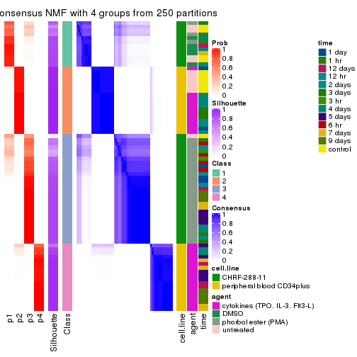</p>

</div>
<div id='tab-MAD-NMF-consensus-heatmap-4'>
<pre><code class="r">consensus_heatmap(res, k = 5)
</code></pre>

<p></p>

</div>
<div id='tab-MAD-NMF-consensus-heatmap-5'>
<pre><code class="r">consensus_heatmap(res, k = 6)
</code></pre>

<p></p>

</div>
</div>

Heatmaps for the membership of samples in all partitions to see how consistent they are:


<script>
$( function() {
	$( '#tabs-MAD-NMF-membership-heatmap' ).tabs();
} );
</script>
<div id='tabs-MAD-NMF-membership-heatmap'>
<ul>
<li><a href='#tab-MAD-NMF-membership-heatmap-1'>k = 2</a></li>
<li><a href='#tab-MAD-NMF-membership-heatmap-2'>k = 3</a></li>
<li><a href='#tab-MAD-NMF-membership-heatmap-3'>k = 4</a></li>
<li><a href='#tab-MAD-NMF-membership-heatmap-4'>k = 5</a></li>
<li><a href='#tab-MAD-NMF-membership-heatmap-5'>k = 6</a></li>
</ul>
<div id='tab-MAD-NMF-membership-heatmap-1'>
<pre><code class="r">membership_heatmap(res, k = 2)
</code></pre>

<p></p>

</div>
<div id='tab-MAD-NMF-membership-heatmap-2'>
<pre><code class="r">membership_heatmap(res, k = 3)
</code></pre>

<p></p>

</div>
<div id='tab-MAD-NMF-membership-heatmap-3'>
<pre><code class="r">membership_heatmap(res, k = 4)
</code></pre>

<p></p>

</div>
<div id='tab-MAD-NMF-membership-heatmap-4'>
<pre><code class="r">membership_heatmap(res, k = 5)
</code></pre>

<p></p>

</div>
<div id='tab-MAD-NMF-membership-heatmap-5'>
<pre><code class="r">membership_heatmap(res, k = 6)
</code></pre>

<p></p>

</div>
</div>

As soon as we have had the classes for columns, we can look for signatures
which are significantly different between classes which can be candidate marks
for certain classes. Following are the heatmaps for signatures.


Signature heatmaps where rows are scaled:


<script>
$( function() {
	$( '#tabs-MAD-NMF-get-signatures' ).tabs();
} );
</script>
<div id='tabs-MAD-NMF-get-signatures'>
<ul>
<li><a href='#tab-MAD-NMF-get-signatures-1'>k = 2</a></li>
<li><a href='#tab-MAD-NMF-get-signatures-2'>k = 3</a></li>
<li><a href='#tab-MAD-NMF-get-signatures-3'>k = 4</a></li>
<li><a href='#tab-MAD-NMF-get-signatures-4'>k = 5</a></li>
<li><a href='#tab-MAD-NMF-get-signatures-5'>k = 6</a></li>
</ul>
<div id='tab-MAD-NMF-get-signatures-1'>
<pre><code class="r">get_signatures(res, k = 2)
</code></pre>

<p></p>

</div>
<div id='tab-MAD-NMF-get-signatures-2'>
<pre><code class="r">get_signatures(res, k = 3)
</code></pre>

<p></p>

</div>
<div id='tab-MAD-NMF-get-signatures-3'>
<pre><code class="r">get_signatures(res, k = 4)
</code></pre>

<p></p>

</div>
<div id='tab-MAD-NMF-get-signatures-4'>
<pre><code class="r">get_signatures(res, k = 5)
</code></pre>

<p></p>

</div>
<div id='tab-MAD-NMF-get-signatures-5'>
<pre><code class="r">get_signatures(res, k = 6)
</code></pre>

<p></p>

</div>
</div>


Signature heatmaps where rows are not scaled:


<script>
$( function() {
	$( '#tabs-MAD-NMF-get-signatures-no-scale' ).tabs();
} );
</script>
<div id='tabs-MAD-NMF-get-signatures-no-scale'>
<ul>
<li><a href='#tab-MAD-NMF-get-signatures-no-scale-1'>k = 2</a></li>
<li><a href='#tab-MAD-NMF-get-signatures-no-scale-2'>k = 3</a></li>
<li><a href='#tab-MAD-NMF-get-signatures-no-scale-3'>k = 4</a></li>
<li><a href='#tab-MAD-NMF-get-signatures-no-scale-4'>k = 5</a></li>
<li><a href='#tab-MAD-NMF-get-signatures-no-scale-5'>k = 6</a></li>
</ul>
<div id='tab-MAD-NMF-get-signatures-no-scale-1'>
<pre><code class="r">get_signatures(res, k = 2, scale_rows = FALSE)
</code></pre>

<p></p>

</div>
<div id='tab-MAD-NMF-get-signatures-no-scale-2'>
<pre><code class="r">get_signatures(res, k = 3, scale_rows = FALSE)
</code></pre>

<p></p>

</div>
<div id='tab-MAD-NMF-get-signatures-no-scale-3'>
<pre><code class="r">get_signatures(res, k = 4, scale_rows = FALSE)
</code></pre>

<p></p>

</div>
<div id='tab-MAD-NMF-get-signatures-no-scale-4'>
<pre><code class="r">get_signatures(res, k = 5, scale_rows = FALSE)
</code></pre>

<p></p>

</div>
<div id='tab-MAD-NMF-get-signatures-no-scale-5'>
<pre><code class="r">get_signatures(res, k = 6, scale_rows = FALSE)
</code></pre>

<p></p>

</div>
</div>


Compare the overlap of signatures from different k:

```r
compare_signatures(res)
```


`get_signature()` returns a data frame invisibly. TO get the list of signatures, the function
call should be assigned to a variable explicitly. In following code, if `plot` argument is set
to `FALSE`, no heatmap is plotted while only the differential analysis is performed.

```r
# code only for demonstration
tb = get_signature(res, k = ..., plot = FALSE)
```

An example of the output of `tb` is:

```
#>   which_row         fdr    mean_1    mean_2 scaled_mean_1 scaled_mean_2 km
#> 1        38 0.042760348  8.373488  9.131774    -0.5533452     0.5164555  1
#> 2        40 0.018707592  7.106213  8.469186    -0.6173731     0.5762149  1
#> 3        55 0.019134737 10.221463 11.207825    -0.6159697     0.5749050  1
#> 4        59 0.006059896  5.921854  7.869574    -0.6899429     0.6439467  1
#> 5        60 0.018055526  8.928898 10.211722    -0.6204761     0.5791110  1
#> 6        98 0.009384629 15.714769 14.887706     0.6635654    -0.6193277  2
...
```

The columns in `tb` are:

1. `which_row`: row indices corresponding to the input matrix.
2. `fdr`: FDR for the differential test. 
3. `mean_x`: The mean value in group x.
4. `scaled_mean_x`: The mean value in group x after rows are scaled.
5. `km`: Row groups if k-means clustering is applied to rows.


UMAP plot which shows how samples are separated.


<script>
$( function() {
	$( '#tabs-MAD-NMF-dimension-reduction' ).tabs();
} );
</script>
<div id='tabs-MAD-NMF-dimension-reduction'>
<ul>
<li><a href='#tab-MAD-NMF-dimension-reduction-1'>k = 2</a></li>
<li><a href='#tab-MAD-NMF-dimension-reduction-2'>k = 3</a></li>
<li><a href='#tab-MAD-NMF-dimension-reduction-3'>k = 4</a></li>
<li><a href='#tab-MAD-NMF-dimension-reduction-4'>k = 5</a></li>
<li><a href='#tab-MAD-NMF-dimension-reduction-5'>k = 6</a></li>
</ul>
<div id='tab-MAD-NMF-dimension-reduction-1'>
<pre><code class="r">dimension_reduction(res, k = 2, method = &quot;UMAP&quot;)
</code></pre>

<p></p>

</div>
<div id='tab-MAD-NMF-dimension-reduction-2'>
<pre><code class="r">dimension_reduction(res, k = 3, method = &quot;UMAP&quot;)
</code></pre>

<p></p>

</div>
<div id='tab-MAD-NMF-dimension-reduction-3'>
<pre><code class="r">dimension_reduction(res, k = 4, method = &quot;UMAP&quot;)
</code></pre>

<p></p>

</div>
<div id='tab-MAD-NMF-dimension-reduction-4'>
<pre><code class="r">dimension_reduction(res, k = 5, method = &quot;UMAP&quot;)
</code></pre>

<p></p>

</div>
<div id='tab-MAD-NMF-dimension-reduction-5'>
<pre><code class="r">dimension_reduction(res, k = 6, method = &quot;UMAP&quot;)
</code></pre>

<p></p>

</div>
</div>


Following heatmap shows how subgroups are split when increasing `k`:

```r
collect_classes(res)
```


Test correlation between subgroups and known annotations. If the known
annotation is numeric, one-way ANOVA test is applied, and if the known
annotation is discrete, chi-squared contingency table test is applied.

```r
test_to_known_factors(res)
```

```
#>          n cell.line(p) agent(p)  time(p) k
#> MAD:NMF 77     1.27e-17 3.00e-14 3.61e-01 2
#> MAD:NMF 73     1.41e-16 1.34e-12 2.07e-03 3
#> MAD:NMF 74     5.93e-16 2.37e-20 1.80e-04 4
#> MAD:NMF 72     8.58e-15 2.48e-20 3.16e-08 5
#> MAD:NMF 70     1.02e-13 5.64e-18 2.84e-07 6
```


If matrix rows can be associated to genes, consider to use `GO_Enrichment(res,
...)` to perform function enrichment for the signature genes.


 

---------------------------------------------------


### ATC:hclust*


The object with results only for a single top-value method and a single partition method 
can be extracted as:

```r
res = res_list["ATC", "hclust"]
# you can also extract it by
# res = res_list["ATC:hclust"]
```

A summary of `res` and all the functions that can be applied to it:

```r
res
```

```
#> A 'ConsensusPartition' object with k = 2, 3, 4, 5, 6.
#>   On a matrix with 18792 rows and 77 columns.
#>   Top rows (1000, 2000, 3000, 4000, 5000) are extracted by 'ATC' method.
#>   Subgroups are detected by 'hclust' method.
#>   Performed in total 1250 partitions by row resampling.
#>   Best k for subgroups seems to be 3.
#> 
#> Following methods can be applied to this 'ConsensusPartition' object:
#>  [1] "cola_report"             "collect_classes"         "collect_plots"          
#>  [4] "collect_stats"           "colnames"                "compare_signatures"     
#>  [7] "consensus_heatmap"       "dimension_reduction"     "functional_enrichment"  
#> [10] "get_anno_col"            "get_anno"                "get_classes"            
#> [13] "get_consensus"           "get_matrix"              "get_membership"         
#> [16] "get_param"               "get_signatures"          "get_stats"              
#> [19] "is_best_k"               "is_stable_k"             "membership_heatmap"     
#> [22] "ncol"                    "nrow"                    "plot_ecdf"              
#> [25] "rownames"                "select_partition_number" "show"                   
#> [28] "suggest_best_k"          "test_to_known_factors"
```

`collect_plots()` function collects all the plots made from `res` for all `k` (number of partitions)
into one single page to provide an easy and fast comparison between different `k`.

```r
collect_plots(res)
```


The plots are:

- The first row: a plot of the ECDF (Empirical cumulative distribution
  function) curves of the consensus matrix for each `k` and the heatmap of
  predicted classes for each `k`.
- The second row: heatmaps of the consensus matrix for each `k`.
- The third row: heatmaps of the membership matrix for each `k`.
- The fouth row: heatmaps of the signatures for each `k`.

All the plots in panels can be made by individual functions and they are
plotted later in this section.

`select_partition_number()` produces several plots showing different
statistics for choosing "optimized" `k`. There are following statistics:

- ECDF curves of the consensus matrix for each `k`;
- 1-PAC. [The PAC
  score](https://en.wikipedia.org/wiki/Consensus_clustering#Over-interpretation_potential_of_consensus_clustering)
  measures the proportion of the ambiguous subgrouping.
- Mean silhouette score.
- Concordance. The mean probability of fiting the consensus class ids in all
  partitions.
- Area increased. Denote $A_k$ as the area under the ECDF curve for current
  `k`, the area increased is defined as $A_k - A_{k-1}$.
- Rand index. The percent of pairs of samples that are both in a same cluster
  or both are not in a same cluster in the partition of k and k-1.
- Jaccard index. The ratio of pairs of samples are both in a same cluster in
  the partition of k and k-1 and the pairs of samples are both in a same
  cluster in the partition k or k-1.

The detailed explanations of these statistics can be found in [the cola
vignette](http://bioconductor.org/packages/devel/bioc/vignettes/cola/inst/doc/cola.html#toc_13).

Generally speaking, lower PAC score, higher mean silhouette score or higher
concordance corresponds to better partition. Rand index and Jaccard index
measure how similar the current partition is compared to partition with `k-1`.
If they are too similar, we won't accept `k` is better than `k-1`.

```r
select_partition_number(res)
```


The numeric values for all these statistics can be obtained by `get_stats()`.

```r
get_stats(res)
```

```
#>   k 1-PAC mean_silhouette concordance area_increased  Rand Jaccard
#> 2 2 1.000           1.000       1.000         0.5049 0.496   0.496
#> 3 3 0.903           0.965       0.976         0.0883 0.966   0.932
#> 4 4 0.868           0.895       0.945         0.0677 0.986   0.970
#> 5 5 0.737           0.834       0.869         0.1199 0.911   0.802
#> 6 6 0.820           0.853       0.874         0.1353 0.872   0.643
```

`suggest_best_k()` suggests the best $k$ based on these statistics. The rules are as follows:

- All $k$ with Jaccard index larger than 0.95 are removed because the increase of
  the partition number does not provides enough extra information. If all $k$ are removed,
  the best $k$ is assigned by `NA`.
- For $k$ with 1-PAC larger than 0.9, the maximal $k$ is taken as the "best k". Other $k$ is called "optional k".
- If it does not fit the second rule. The $k$ with the highest vote of highest
  1-PAC, mean silhouette and concordance is taken as the "best k".

```r
suggest_best_k(res)
```

```
#> [1] 3
#> attr(,"optional")
#> [1] 2
```

There is also optional best $k$ = 2 that is worth to check.

Following shows the table of the partitions (You need to click the **show/hide
code output** link to see it). The membership matrix (columns with name `p*`)
is inferred by
[`clue::cl_consensus()`](https://www.rdocumentation.org/link/cl_consensus?package=clue)
function with the `SE` method. Basically the value in the membership matrix
represents the probability to belong to a certain group. The finall class
label for an item is determined with the group with highest probability it
belongs to.

In `get_classes()` function, the entropy is calculated from the membership
matrix and the silhouette score is calculated from the consensus matrix.


<script>
$( function() {
	$( '#tabs-ATC-hclust-get-classes' ).tabs();
} );
</script>
<div id='tabs-ATC-hclust-get-classes'>
<ul>
<li><a href='#tab-ATC-hclust-get-classes-1'>k = 2</a></li>
<li><a href='#tab-ATC-hclust-get-classes-2'>k = 3</a></li>
<li><a href='#tab-ATC-hclust-get-classes-3'>k = 4</a></li>
<li><a href='#tab-ATC-hclust-get-classes-4'>k = 5</a></li>
<li><a href='#tab-ATC-hclust-get-classes-5'>k = 6</a></li>
</ul>

<div id='tab-ATC-hclust-get-classes-1'>
<p><a id='tab-ATC-hclust-get-classes-1-a' style='color:#0366d6' href='#'>show/hide code output</a></p>
<pre><code class="r">cbind(get_classes(res, k = 2), get_membership(res, k = 2))
</code></pre>

<pre><code>#&gt;          class entropy silhouette p1 p2
#&gt; GSM87962     1       0          1  1  0
#&gt; GSM87963     1       0          1  1  0
#&gt; GSM87983     1       0          1  1  0
#&gt; GSM87984     1       0          1  1  0
#&gt; GSM87961     1       0          1  1  0
#&gt; GSM87970     1       0          1  1  0
#&gt; GSM87971     1       0          1  1  0
#&gt; GSM87990     1       0          1  1  0
#&gt; GSM87991     1       0          1  1  0
#&gt; GSM87974     1       0          1  1  0
#&gt; GSM87994     1       0          1  1  0
#&gt; GSM87978     1       0          1  1  0
#&gt; GSM87979     1       0          1  1  0
#&gt; GSM87998     1       0          1  1  0
#&gt; GSM87999     1       0          1  1  0
#&gt; GSM87968     1       0          1  1  0
#&gt; GSM87987     1       0          1  1  0
#&gt; GSM87969     1       0          1  1  0
#&gt; GSM87988     1       0          1  1  0
#&gt; GSM87989     1       0          1  1  0
#&gt; GSM87972     1       0          1  1  0
#&gt; GSM87992     1       0          1  1  0
#&gt; GSM87973     1       0          1  1  0
#&gt; GSM87993     1       0          1  1  0
#&gt; GSM87975     1       0          1  1  0
#&gt; GSM87995     1       0          1  1  0
#&gt; GSM87976     1       0          1  1  0
#&gt; GSM87977     1       0          1  1  0
#&gt; GSM87996     1       0          1  1  0
#&gt; GSM87997     1       0          1  1  0
#&gt; GSM87980     1       0          1  1  0
#&gt; GSM88000     1       0          1  1  0
#&gt; GSM87981     1       0          1  1  0
#&gt; GSM87982     1       0          1  1  0
#&gt; GSM88001     1       0          1  1  0
#&gt; GSM87967     1       0          1  1  0
#&gt; GSM87964     1       0          1  1  0
#&gt; GSM87965     1       0          1  1  0
#&gt; GSM87966     1       0          1  1  0
#&gt; GSM87985     1       0          1  1  0
#&gt; GSM87986     1       0          1  1  0
#&gt; GSM88004     2       0          1  0  1
#&gt; GSM88015     2       0          1  0  1
#&gt; GSM88005     2       0          1  0  1
#&gt; GSM88006     2       0          1  0  1
#&gt; GSM88016     2       0          1  0  1
#&gt; GSM88007     2       0          1  0  1
#&gt; GSM88017     2       0          1  0  1
#&gt; GSM88029     2       0          1  0  1
#&gt; GSM88008     2       0          1  0  1
#&gt; GSM88009     2       0          1  0  1
#&gt; GSM88018     2       0          1  0  1
#&gt; GSM88024     2       0          1  0  1
#&gt; GSM88030     2       0          1  0  1
#&gt; GSM88036     2       0          1  0  1
#&gt; GSM88010     2       0          1  0  1
#&gt; GSM88011     2       0          1  0  1
#&gt; GSM88019     2       0          1  0  1
#&gt; GSM88027     2       0          1  0  1
#&gt; GSM88031     2       0          1  0  1
#&gt; GSM88012     2       0          1  0  1
#&gt; GSM88020     2       0          1  0  1
#&gt; GSM88032     2       0          1  0  1
#&gt; GSM88037     2       0          1  0  1
#&gt; GSM88013     2       0          1  0  1
#&gt; GSM88021     2       0          1  0  1
#&gt; GSM88025     2       0          1  0  1
#&gt; GSM88033     2       0          1  0  1
#&gt; GSM88014     2       0          1  0  1
#&gt; GSM88022     2       0          1  0  1
#&gt; GSM88034     2       0          1  0  1
#&gt; GSM88002     2       0          1  0  1
#&gt; GSM88003     2       0          1  0  1
#&gt; GSM88023     2       0          1  0  1
#&gt; GSM88026     2       0          1  0  1
#&gt; GSM88028     2       0          1  0  1
#&gt; GSM88035     2       0          1  0  1
</code></pre>

<script>
$('#tab-ATC-hclust-get-classes-1-a').parent().next().next().hide();
$('#tab-ATC-hclust-get-classes-1-a').click(function(){
  $('#tab-ATC-hclust-get-classes-1-a').parent().next().next().toggle();
  return(false);
});
</script>
</div>

<div id='tab-ATC-hclust-get-classes-2'>
<p><a id='tab-ATC-hclust-get-classes-2-a' style='color:#0366d6' href='#'>show/hide code output</a></p>
<pre><code class="r">cbind(get_classes(res, k = 3), get_membership(res, k = 3))
</code></pre>

<pre><code>#&gt;          class entropy silhouette    p1    p2    p3
#&gt; GSM87962     1  0.0000      1.000 1.000 0.000 0.000
#&gt; GSM87963     1  0.0000      1.000 1.000 0.000 0.000
#&gt; GSM87983     1  0.0000      1.000 1.000 0.000 0.000
#&gt; GSM87984     1  0.0000      1.000 1.000 0.000 0.000
#&gt; GSM87961     1  0.0000      1.000 1.000 0.000 0.000
#&gt; GSM87970     1  0.0000      1.000 1.000 0.000 0.000
#&gt; GSM87971     1  0.0000      1.000 1.000 0.000 0.000
#&gt; GSM87990     1  0.0000      1.000 1.000 0.000 0.000
#&gt; GSM87991     1  0.0000      1.000 1.000 0.000 0.000
#&gt; GSM87974     1  0.0000      1.000 1.000 0.000 0.000
#&gt; GSM87994     1  0.0000      1.000 1.000 0.000 0.000
#&gt; GSM87978     1  0.0000      1.000 1.000 0.000 0.000
#&gt; GSM87979     1  0.0000      1.000 1.000 0.000 0.000
#&gt; GSM87998     1  0.0000      1.000 1.000 0.000 0.000
#&gt; GSM87999     1  0.0000      1.000 1.000 0.000 0.000
#&gt; GSM87968     1  0.0000      1.000 1.000 0.000 0.000
#&gt; GSM87987     1  0.0000      1.000 1.000 0.000 0.000
#&gt; GSM87969     1  0.0000      1.000 1.000 0.000 0.000
#&gt; GSM87988     1  0.0000      1.000 1.000 0.000 0.000
#&gt; GSM87989     1  0.0000      1.000 1.000 0.000 0.000
#&gt; GSM87972     1  0.0000      1.000 1.000 0.000 0.000
#&gt; GSM87992     1  0.0000      1.000 1.000 0.000 0.000
#&gt; GSM87973     1  0.0000      1.000 1.000 0.000 0.000
#&gt; GSM87993     1  0.0000      1.000 1.000 0.000 0.000
#&gt; GSM87975     1  0.0000      1.000 1.000 0.000 0.000
#&gt; GSM87995     1  0.0000      1.000 1.000 0.000 0.000
#&gt; GSM87976     1  0.0000      1.000 1.000 0.000 0.000
#&gt; GSM87977     1  0.0000      1.000 1.000 0.000 0.000
#&gt; GSM87996     1  0.0000      1.000 1.000 0.000 0.000
#&gt; GSM87997     1  0.0000      1.000 1.000 0.000 0.000
#&gt; GSM87980     1  0.0000      1.000 1.000 0.000 0.000
#&gt; GSM88000     1  0.0000      1.000 1.000 0.000 0.000
#&gt; GSM87981     1  0.0000      1.000 1.000 0.000 0.000
#&gt; GSM87982     1  0.0000      1.000 1.000 0.000 0.000
#&gt; GSM88001     1  0.0000      1.000 1.000 0.000 0.000
#&gt; GSM87967     1  0.0000      1.000 1.000 0.000 0.000
#&gt; GSM87964     1  0.0747      0.984 0.984 0.000 0.016
#&gt; GSM87965     1  0.0000      1.000 1.000 0.000 0.000
#&gt; GSM87966     1  0.0000      1.000 1.000 0.000 0.000
#&gt; GSM87985     1  0.0000      1.000 1.000 0.000 0.000
#&gt; GSM87986     1  0.0000      1.000 1.000 0.000 0.000
#&gt; GSM88004     2  0.0000      0.942 0.000 1.000 0.000
#&gt; GSM88015     2  0.0000      0.942 0.000 1.000 0.000
#&gt; GSM88005     2  0.0000      0.942 0.000 1.000 0.000
#&gt; GSM88006     2  0.0000      0.942 0.000 1.000 0.000
#&gt; GSM88016     2  0.0000      0.942 0.000 1.000 0.000
#&gt; GSM88007     2  0.0000      0.942 0.000 1.000 0.000
#&gt; GSM88017     2  0.0000      0.942 0.000 1.000 0.000
#&gt; GSM88029     2  0.0000      0.942 0.000 1.000 0.000
#&gt; GSM88008     2  0.0000      0.942 0.000 1.000 0.000
#&gt; GSM88009     2  0.0000      0.942 0.000 1.000 0.000
#&gt; GSM88018     2  0.0000      0.942 0.000 1.000 0.000
#&gt; GSM88024     2  0.0000      0.942 0.000 1.000 0.000
#&gt; GSM88030     3  0.0747      1.000 0.000 0.016 0.984
#&gt; GSM88036     3  0.0747      1.000 0.000 0.016 0.984
#&gt; GSM88010     2  0.3192      0.907 0.000 0.888 0.112
#&gt; GSM88011     2  0.3192      0.907 0.000 0.888 0.112
#&gt; GSM88019     2  0.0000      0.942 0.000 1.000 0.000
#&gt; GSM88027     2  0.0000      0.942 0.000 1.000 0.000
#&gt; GSM88031     2  0.3619      0.893 0.000 0.864 0.136
#&gt; GSM88012     2  0.3192      0.907 0.000 0.888 0.112
#&gt; GSM88020     2  0.5397      0.715 0.000 0.720 0.280
#&gt; GSM88032     2  0.3619      0.893 0.000 0.864 0.136
#&gt; GSM88037     2  0.3619      0.893 0.000 0.864 0.136
#&gt; GSM88013     2  0.3192      0.907 0.000 0.888 0.112
#&gt; GSM88021     2  0.3619      0.893 0.000 0.864 0.136
#&gt; GSM88025     2  0.3619      0.893 0.000 0.864 0.136
#&gt; GSM88033     2  0.3619      0.893 0.000 0.864 0.136
#&gt; GSM88014     2  0.3192      0.907 0.000 0.888 0.112
#&gt; GSM88022     2  0.3192      0.907 0.000 0.888 0.112
#&gt; GSM88034     3  0.0747      1.000 0.000 0.016 0.984
#&gt; GSM88002     2  0.0000      0.942 0.000 1.000 0.000
#&gt; GSM88003     2  0.0000      0.942 0.000 1.000 0.000
#&gt; GSM88023     2  0.0000      0.942 0.000 1.000 0.000
#&gt; GSM88026     2  0.0000      0.942 0.000 1.000 0.000
#&gt; GSM88028     2  0.0000      0.942 0.000 1.000 0.000
#&gt; GSM88035     2  0.0000      0.942 0.000 1.000 0.000
</code></pre>

<script>
$('#tab-ATC-hclust-get-classes-2-a').parent().next().next().hide();
$('#tab-ATC-hclust-get-classes-2-a').click(function(){
  $('#tab-ATC-hclust-get-classes-2-a').parent().next().next().toggle();
  return(false);
});
</script>
</div>

<div id='tab-ATC-hclust-get-classes-3'>
<p><a id='tab-ATC-hclust-get-classes-3-a' style='color:#0366d6' href='#'>show/hide code output</a></p>
<pre><code class="r">cbind(get_classes(res, k = 4), get_membership(res, k = 4))
</code></pre>

<pre><code>#&gt;          class entropy silhouette    p1    p2    p3    p4
#&gt; GSM87962     1   0.000      0.937 1.000 0.000 0.000 0.000
#&gt; GSM87963     1   0.000      0.937 1.000 0.000 0.000 0.000
#&gt; GSM87983     1   0.000      0.937 1.000 0.000 0.000 0.000
#&gt; GSM87984     1   0.000      0.937 1.000 0.000 0.000 0.000
#&gt; GSM87961     1   0.000      0.937 1.000 0.000 0.000 0.000
#&gt; GSM87970     1   0.287      0.879 0.864 0.000 0.136 0.000
#&gt; GSM87971     1   0.287      0.879 0.864 0.000 0.136 0.000
#&gt; GSM87990     1   0.000      0.937 1.000 0.000 0.000 0.000
#&gt; GSM87991     1   0.000      0.937 1.000 0.000 0.000 0.000
#&gt; GSM87974     1   0.287      0.879 0.864 0.000 0.136 0.000
#&gt; GSM87994     1   0.000      0.937 1.000 0.000 0.000 0.000
#&gt; GSM87978     1   0.228      0.907 0.904 0.000 0.096 0.000
#&gt; GSM87979     1   0.228      0.907 0.904 0.000 0.096 0.000
#&gt; GSM87998     1   0.000      0.937 1.000 0.000 0.000 0.000
#&gt; GSM87999     1   0.000      0.937 1.000 0.000 0.000 0.000
#&gt; GSM87968     1   0.228      0.907 0.904 0.000 0.096 0.000
#&gt; GSM87987     1   0.000      0.937 1.000 0.000 0.000 0.000
#&gt; GSM87969     1   0.228      0.907 0.904 0.000 0.096 0.000
#&gt; GSM87988     1   0.000      0.937 1.000 0.000 0.000 0.000
#&gt; GSM87989     1   0.000      0.937 1.000 0.000 0.000 0.000
#&gt; GSM87972     1   0.228      0.907 0.904 0.000 0.096 0.000
#&gt; GSM87992     1   0.000      0.937 1.000 0.000 0.000 0.000
#&gt; GSM87973     1   0.228      0.907 0.904 0.000 0.096 0.000
#&gt; GSM87993     1   0.000      0.937 1.000 0.000 0.000 0.000
#&gt; GSM87975     1   0.499      0.272 0.528 0.000 0.472 0.000
#&gt; GSM87995     1   0.000      0.937 1.000 0.000 0.000 0.000
#&gt; GSM87976     1   0.499      0.272 0.528 0.000 0.472 0.000
#&gt; GSM87977     1   0.228      0.907 0.904 0.000 0.096 0.000
#&gt; GSM87996     1   0.000      0.937 1.000 0.000 0.000 0.000
#&gt; GSM87997     1   0.000      0.937 1.000 0.000 0.000 0.000
#&gt; GSM87980     1   0.228      0.907 0.904 0.000 0.096 0.000
#&gt; GSM88000     1   0.000      0.937 1.000 0.000 0.000 0.000
#&gt; GSM87981     1   0.228      0.907 0.904 0.000 0.096 0.000
#&gt; GSM87982     1   0.228      0.907 0.904 0.000 0.096 0.000
#&gt; GSM88001     1   0.000      0.937 1.000 0.000 0.000 0.000
#&gt; GSM87967     1   0.228      0.907 0.904 0.000 0.096 0.000
#&gt; GSM87964     3   0.000      0.000 0.000 0.000 1.000 0.000
#&gt; GSM87965     1   0.000      0.937 1.000 0.000 0.000 0.000
#&gt; GSM87966     1   0.000      0.937 1.000 0.000 0.000 0.000
#&gt; GSM87985     1   0.000      0.937 1.000 0.000 0.000 0.000
#&gt; GSM87986     1   0.000      0.937 1.000 0.000 0.000 0.000
#&gt; GSM88004     2   0.000      0.941 0.000 1.000 0.000 0.000
#&gt; GSM88015     2   0.000      0.941 0.000 1.000 0.000 0.000
#&gt; GSM88005     2   0.000      0.941 0.000 1.000 0.000 0.000
#&gt; GSM88006     2   0.000      0.941 0.000 1.000 0.000 0.000
#&gt; GSM88016     2   0.000      0.941 0.000 1.000 0.000 0.000
#&gt; GSM88007     2   0.000      0.941 0.000 1.000 0.000 0.000
#&gt; GSM88017     2   0.000      0.941 0.000 1.000 0.000 0.000
#&gt; GSM88029     2   0.000      0.941 0.000 1.000 0.000 0.000
#&gt; GSM88008     2   0.000      0.941 0.000 1.000 0.000 0.000
#&gt; GSM88009     2   0.000      0.941 0.000 1.000 0.000 0.000
#&gt; GSM88018     2   0.000      0.941 0.000 1.000 0.000 0.000
#&gt; GSM88024     2   0.000      0.941 0.000 1.000 0.000 0.000
#&gt; GSM88030     4   0.000      1.000 0.000 0.000 0.000 1.000
#&gt; GSM88036     4   0.000      1.000 0.000 0.000 0.000 1.000
#&gt; GSM88010     2   0.253      0.907 0.000 0.888 0.000 0.112
#&gt; GSM88011     2   0.253      0.907 0.000 0.888 0.000 0.112
#&gt; GSM88019     2   0.000      0.941 0.000 1.000 0.000 0.000
#&gt; GSM88027     2   0.000      0.941 0.000 1.000 0.000 0.000
#&gt; GSM88031     2   0.297      0.888 0.000 0.856 0.000 0.144
#&gt; GSM88012     2   0.253      0.907 0.000 0.888 0.000 0.112
#&gt; GSM88020     2   0.433      0.710 0.000 0.712 0.000 0.288
#&gt; GSM88032     2   0.297      0.888 0.000 0.856 0.000 0.144
#&gt; GSM88037     2   0.297      0.888 0.000 0.856 0.000 0.144
#&gt; GSM88013     2   0.253      0.907 0.000 0.888 0.000 0.112
#&gt; GSM88021     2   0.297      0.888 0.000 0.856 0.000 0.144
#&gt; GSM88025     2   0.297      0.888 0.000 0.856 0.000 0.144
#&gt; GSM88033     2   0.297      0.888 0.000 0.856 0.000 0.144
#&gt; GSM88014     2   0.253      0.907 0.000 0.888 0.000 0.112
#&gt; GSM88022     2   0.253      0.907 0.000 0.888 0.000 0.112
#&gt; GSM88034     4   0.000      1.000 0.000 0.000 0.000 1.000
#&gt; GSM88002     2   0.000      0.941 0.000 1.000 0.000 0.000
#&gt; GSM88003     2   0.000      0.941 0.000 1.000 0.000 0.000
#&gt; GSM88023     2   0.000      0.941 0.000 1.000 0.000 0.000
#&gt; GSM88026     2   0.000      0.941 0.000 1.000 0.000 0.000
#&gt; GSM88028     2   0.000      0.941 0.000 1.000 0.000 0.000
#&gt; GSM88035     2   0.000      0.941 0.000 1.000 0.000 0.000
</code></pre>

<script>
$('#tab-ATC-hclust-get-classes-3-a').parent().next().next().hide();
$('#tab-ATC-hclust-get-classes-3-a').click(function(){
  $('#tab-ATC-hclust-get-classes-3-a').parent().next().next().toggle();
  return(false);
});
</script>
</div>

<div id='tab-ATC-hclust-get-classes-4'>
<p><a id='tab-ATC-hclust-get-classes-4-a' style='color:#0366d6' href='#'>show/hide code output</a></p>
<pre><code class="r">cbind(get_classes(res, k = 5), get_membership(res, k = 5))
</code></pre>

<pre><code>#&gt;          class entropy silhouette    p1    p2    p3    p4    p5
#&gt; GSM87962     1   0.000      0.893 1.000 0.000 0.000 0.000 0.000
#&gt; GSM87963     1   0.000      0.893 1.000 0.000 0.000 0.000 0.000
#&gt; GSM87983     1   0.000      0.893 1.000 0.000 0.000 0.000 0.000
#&gt; GSM87984     1   0.000      0.893 1.000 0.000 0.000 0.000 0.000
#&gt; GSM87961     1   0.000      0.893 1.000 0.000 0.000 0.000 0.000
#&gt; GSM87970     1   0.410      0.802 0.760 0.000 0.040 0.000 0.200
#&gt; GSM87971     1   0.410      0.802 0.760 0.000 0.040 0.000 0.200
#&gt; GSM87990     1   0.000      0.893 1.000 0.000 0.000 0.000 0.000
#&gt; GSM87991     1   0.000      0.893 1.000 0.000 0.000 0.000 0.000
#&gt; GSM87974     1   0.410      0.802 0.760 0.000 0.040 0.000 0.200
#&gt; GSM87994     1   0.000      0.893 1.000 0.000 0.000 0.000 0.000
#&gt; GSM87978     1   0.311      0.832 0.800 0.000 0.000 0.000 0.200
#&gt; GSM87979     1   0.311      0.832 0.800 0.000 0.000 0.000 0.200
#&gt; GSM87998     1   0.000      0.893 1.000 0.000 0.000 0.000 0.000
#&gt; GSM87999     1   0.000      0.893 1.000 0.000 0.000 0.000 0.000
#&gt; GSM87968     1   0.311      0.832 0.800 0.000 0.000 0.000 0.200
#&gt; GSM87987     1   0.000      0.893 1.000 0.000 0.000 0.000 0.000
#&gt; GSM87969     1   0.311      0.832 0.800 0.000 0.000 0.000 0.200
#&gt; GSM87988     1   0.000      0.893 1.000 0.000 0.000 0.000 0.000
#&gt; GSM87989     1   0.000      0.893 1.000 0.000 0.000 0.000 0.000
#&gt; GSM87972     1   0.311      0.832 0.800 0.000 0.000 0.000 0.200
#&gt; GSM87992     1   0.000      0.893 1.000 0.000 0.000 0.000 0.000
#&gt; GSM87973     1   0.311      0.832 0.800 0.000 0.000 0.000 0.200
#&gt; GSM87993     1   0.000      0.893 1.000 0.000 0.000 0.000 0.000
#&gt; GSM87975     1   0.655      0.185 0.424 0.000 0.376 0.000 0.200
#&gt; GSM87995     1   0.000      0.893 1.000 0.000 0.000 0.000 0.000
#&gt; GSM87976     1   0.655      0.185 0.424 0.000 0.376 0.000 0.200
#&gt; GSM87977     1   0.311      0.832 0.800 0.000 0.000 0.000 0.200
#&gt; GSM87996     1   0.000      0.893 1.000 0.000 0.000 0.000 0.000
#&gt; GSM87997     1   0.000      0.893 1.000 0.000 0.000 0.000 0.000
#&gt; GSM87980     1   0.311      0.832 0.800 0.000 0.000 0.000 0.200
#&gt; GSM88000     1   0.000      0.893 1.000 0.000 0.000 0.000 0.000
#&gt; GSM87981     1   0.311      0.832 0.800 0.000 0.000 0.000 0.200
#&gt; GSM87982     1   0.311      0.832 0.800 0.000 0.000 0.000 0.200
#&gt; GSM88001     1   0.000      0.893 1.000 0.000 0.000 0.000 0.000
#&gt; GSM87967     1   0.311      0.832 0.800 0.000 0.000 0.000 0.200
#&gt; GSM87964     3   0.000      0.000 0.000 0.000 1.000 0.000 0.000
#&gt; GSM87965     1   0.000      0.893 1.000 0.000 0.000 0.000 0.000
#&gt; GSM87966     1   0.000      0.893 1.000 0.000 0.000 0.000 0.000
#&gt; GSM87985     1   0.000      0.893 1.000 0.000 0.000 0.000 0.000
#&gt; GSM87986     1   0.000      0.893 1.000 0.000 0.000 0.000 0.000
#&gt; GSM88004     2   0.426      0.797 0.000 0.560 0.000 0.440 0.000
#&gt; GSM88015     2   0.426      0.797 0.000 0.560 0.000 0.440 0.000
#&gt; GSM88005     2   0.426      0.797 0.000 0.560 0.000 0.440 0.000
#&gt; GSM88006     2   0.426      0.797 0.000 0.560 0.000 0.440 0.000
#&gt; GSM88016     2   0.426      0.797 0.000 0.560 0.000 0.440 0.000
#&gt; GSM88007     2   0.426      0.797 0.000 0.560 0.000 0.440 0.000
#&gt; GSM88017     2   0.359      0.786 0.000 0.736 0.000 0.264 0.000
#&gt; GSM88029     2   0.359      0.786 0.000 0.736 0.000 0.264 0.000
#&gt; GSM88008     2   0.426      0.797 0.000 0.560 0.000 0.440 0.000
#&gt; GSM88009     2   0.426      0.797 0.000 0.560 0.000 0.440 0.000
#&gt; GSM88018     2   0.426      0.797 0.000 0.560 0.000 0.440 0.000
#&gt; GSM88024     2   0.359      0.786 0.000 0.736 0.000 0.264 0.000
#&gt; GSM88030     5   0.366      1.000 0.000 0.168 0.000 0.032 0.800
#&gt; GSM88036     5   0.366      1.000 0.000 0.168 0.000 0.032 0.800
#&gt; GSM88010     4   0.088      0.952 0.000 0.032 0.000 0.968 0.000
#&gt; GSM88011     4   0.088      0.952 0.000 0.032 0.000 0.968 0.000
#&gt; GSM88019     2   0.426      0.797 0.000 0.560 0.000 0.440 0.000
#&gt; GSM88027     2   0.426      0.797 0.000 0.560 0.000 0.440 0.000
#&gt; GSM88031     4   0.000      0.956 0.000 0.000 0.000 1.000 0.000
#&gt; GSM88012     4   0.088      0.952 0.000 0.032 0.000 0.968 0.000
#&gt; GSM88020     4   0.256      0.790 0.000 0.000 0.000 0.856 0.144
#&gt; GSM88032     4   0.000      0.956 0.000 0.000 0.000 1.000 0.000
#&gt; GSM88037     4   0.000      0.956 0.000 0.000 0.000 1.000 0.000
#&gt; GSM88013     4   0.088      0.952 0.000 0.032 0.000 0.968 0.000
#&gt; GSM88021     4   0.000      0.956 0.000 0.000 0.000 1.000 0.000
#&gt; GSM88025     4   0.000      0.956 0.000 0.000 0.000 1.000 0.000
#&gt; GSM88033     4   0.000      0.956 0.000 0.000 0.000 1.000 0.000
#&gt; GSM88014     4   0.088      0.952 0.000 0.032 0.000 0.968 0.000
#&gt; GSM88022     4   0.088      0.952 0.000 0.032 0.000 0.968 0.000
#&gt; GSM88034     5   0.366      1.000 0.000 0.168 0.000 0.032 0.800
#&gt; GSM88002     2   0.281      0.748 0.000 0.832 0.000 0.168 0.000
#&gt; GSM88003     2   0.281      0.748 0.000 0.832 0.000 0.168 0.000
#&gt; GSM88023     2   0.281      0.748 0.000 0.832 0.000 0.168 0.000
#&gt; GSM88026     2   0.281      0.748 0.000 0.832 0.000 0.168 0.000
#&gt; GSM88028     2   0.281      0.748 0.000 0.832 0.000 0.168 0.000
#&gt; GSM88035     2   0.281      0.748 0.000 0.832 0.000 0.168 0.000
</code></pre>

<script>
$('#tab-ATC-hclust-get-classes-4-a').parent().next().next().hide();
$('#tab-ATC-hclust-get-classes-4-a').click(function(){
  $('#tab-ATC-hclust-get-classes-4-a').parent().next().next().toggle();
  return(false);
});
</script>
</div>

<div id='tab-ATC-hclust-get-classes-5'>
<p><a id='tab-ATC-hclust-get-classes-5-a' style='color:#0366d6' href='#'>show/hide code output</a></p>
<pre><code class="r">cbind(get_classes(res, k = 6), get_membership(res, k = 6))
</code></pre>

<pre><code>#&gt;          class entropy silhouette    p1    p2    p3    p4    p5    p6
#&gt; GSM87962     1  0.0260    0.97209 0.992 0.000 0.008 0.000 0.000 0.000
#&gt; GSM87963     1  0.0260    0.97209 0.992 0.000 0.008 0.000 0.000 0.000
#&gt; GSM87983     1  0.0260    0.97209 0.992 0.000 0.008 0.000 0.000 0.000
#&gt; GSM87984     1  0.0260    0.97209 0.992 0.000 0.008 0.000 0.000 0.000
#&gt; GSM87961     1  0.0260    0.97209 0.992 0.000 0.008 0.000 0.000 0.000
#&gt; GSM87970     3  0.4247    0.87434 0.296 0.000 0.664 0.000 0.000 0.040
#&gt; GSM87971     3  0.4247    0.87434 0.296 0.000 0.664 0.000 0.000 0.040
#&gt; GSM87990     1  0.0260    0.97209 0.992 0.000 0.008 0.000 0.000 0.000
#&gt; GSM87991     1  0.0146    0.97295 0.996 0.000 0.004 0.000 0.000 0.000
#&gt; GSM87974     3  0.4247    0.87434 0.296 0.000 0.664 0.000 0.000 0.040
#&gt; GSM87994     1  0.0000    0.97338 1.000 0.000 0.000 0.000 0.000 0.000
#&gt; GSM87978     3  0.3592    0.89598 0.344 0.000 0.656 0.000 0.000 0.000
#&gt; GSM87979     3  0.3592    0.89598 0.344 0.000 0.656 0.000 0.000 0.000
#&gt; GSM87998     1  0.0000    0.97338 1.000 0.000 0.000 0.000 0.000 0.000
#&gt; GSM87999     1  0.0000    0.97338 1.000 0.000 0.000 0.000 0.000 0.000
#&gt; GSM87968     3  0.3592    0.89598 0.344 0.000 0.656 0.000 0.000 0.000
#&gt; GSM87987     1  0.0146    0.96988 0.996 0.000 0.004 0.000 0.000 0.000
#&gt; GSM87969     1  0.3563    0.00751 0.664 0.000 0.336 0.000 0.000 0.000
#&gt; GSM87988     1  0.0000    0.97338 1.000 0.000 0.000 0.000 0.000 0.000
#&gt; GSM87989     1  0.0000    0.97338 1.000 0.000 0.000 0.000 0.000 0.000
#&gt; GSM87972     3  0.3634    0.89929 0.356 0.000 0.644 0.000 0.000 0.000
#&gt; GSM87992     1  0.0000    0.97338 1.000 0.000 0.000 0.000 0.000 0.000
#&gt; GSM87973     3  0.3634    0.89929 0.356 0.000 0.644 0.000 0.000 0.000
#&gt; GSM87993     1  0.0000    0.97338 1.000 0.000 0.000 0.000 0.000 0.000
#&gt; GSM87975     3  0.4583    0.25814 0.044 0.000 0.580 0.000 0.000 0.376
#&gt; GSM87995     1  0.0000    0.97338 1.000 0.000 0.000 0.000 0.000 0.000
#&gt; GSM87976     3  0.4583    0.25814 0.044 0.000 0.580 0.000 0.000 0.376
#&gt; GSM87977     3  0.3634    0.89929 0.356 0.000 0.644 0.000 0.000 0.000
#&gt; GSM87996     1  0.0000    0.97338 1.000 0.000 0.000 0.000 0.000 0.000
#&gt; GSM87997     1  0.0000    0.97338 1.000 0.000 0.000 0.000 0.000 0.000
#&gt; GSM87980     3  0.3634    0.89929 0.356 0.000 0.644 0.000 0.000 0.000
#&gt; GSM88000     1  0.0000    0.97338 1.000 0.000 0.000 0.000 0.000 0.000
#&gt; GSM87981     3  0.3634    0.89929 0.356 0.000 0.644 0.000 0.000 0.000
#&gt; GSM87982     3  0.3634    0.89929 0.356 0.000 0.644 0.000 0.000 0.000
#&gt; GSM88001     1  0.0000    0.97338 1.000 0.000 0.000 0.000 0.000 0.000
#&gt; GSM87967     3  0.3634    0.89929 0.356 0.000 0.644 0.000 0.000 0.000
#&gt; GSM87964     6  0.0000    0.00000 0.000 0.000 0.000 0.000 0.000 1.000
#&gt; GSM87965     1  0.0260    0.97209 0.992 0.000 0.008 0.000 0.000 0.000
#&gt; GSM87966     1  0.0260    0.97209 0.992 0.000 0.008 0.000 0.000 0.000
#&gt; GSM87985     1  0.0260    0.97209 0.992 0.000 0.008 0.000 0.000 0.000
#&gt; GSM87986     1  0.0260    0.97209 0.992 0.000 0.008 0.000 0.000 0.000
#&gt; GSM88004     2  0.0000    0.84532 0.000 1.000 0.000 0.000 0.000 0.000
#&gt; GSM88015     2  0.0000    0.84532 0.000 1.000 0.000 0.000 0.000 0.000
#&gt; GSM88005     2  0.0000    0.84532 0.000 1.000 0.000 0.000 0.000 0.000
#&gt; GSM88006     2  0.0000    0.84532 0.000 1.000 0.000 0.000 0.000 0.000
#&gt; GSM88016     2  0.0000    0.84532 0.000 1.000 0.000 0.000 0.000 0.000
#&gt; GSM88007     2  0.0000    0.84532 0.000 1.000 0.000 0.000 0.000 0.000
#&gt; GSM88017     2  0.3076    0.80223 0.000 0.760 0.240 0.000 0.000 0.000
#&gt; GSM88029     2  0.3076    0.80223 0.000 0.760 0.240 0.000 0.000 0.000
#&gt; GSM88008     2  0.0000    0.84532 0.000 1.000 0.000 0.000 0.000 0.000
#&gt; GSM88009     2  0.0000    0.84532 0.000 1.000 0.000 0.000 0.000 0.000
#&gt; GSM88018     2  0.0000    0.84532 0.000 1.000 0.000 0.000 0.000 0.000
#&gt; GSM88024     2  0.3076    0.80223 0.000 0.760 0.240 0.000 0.000 0.000
#&gt; GSM88030     5  0.0000    1.00000 0.000 0.000 0.000 0.000 1.000 0.000
#&gt; GSM88036     5  0.0000    1.00000 0.000 0.000 0.000 0.000 1.000 0.000
#&gt; GSM88010     4  0.3428    0.61296 0.000 0.304 0.000 0.696 0.000 0.000
#&gt; GSM88011     4  0.3428    0.61296 0.000 0.304 0.000 0.696 0.000 0.000
#&gt; GSM88019     2  0.0000    0.84532 0.000 1.000 0.000 0.000 0.000 0.000
#&gt; GSM88027     2  0.0000    0.84532 0.000 1.000 0.000 0.000 0.000 0.000
#&gt; GSM88031     4  0.0000    0.89323 0.000 0.000 0.000 1.000 0.000 0.000
#&gt; GSM88012     4  0.1204    0.88707 0.000 0.056 0.000 0.944 0.000 0.000
#&gt; GSM88020     4  0.2300    0.78206 0.000 0.000 0.000 0.856 0.144 0.000
#&gt; GSM88032     4  0.0000    0.89323 0.000 0.000 0.000 1.000 0.000 0.000
#&gt; GSM88037     4  0.0000    0.89323 0.000 0.000 0.000 1.000 0.000 0.000
#&gt; GSM88013     4  0.1204    0.88707 0.000 0.056 0.000 0.944 0.000 0.000
#&gt; GSM88021     4  0.0000    0.89323 0.000 0.000 0.000 1.000 0.000 0.000
#&gt; GSM88025     4  0.0000    0.89323 0.000 0.000 0.000 1.000 0.000 0.000
#&gt; GSM88033     4  0.0000    0.89323 0.000 0.000 0.000 1.000 0.000 0.000
#&gt; GSM88014     4  0.1204    0.88707 0.000 0.056 0.000 0.944 0.000 0.000
#&gt; GSM88022     4  0.1204    0.88707 0.000 0.056 0.000 0.944 0.000 0.000
#&gt; GSM88034     5  0.0000    1.00000 0.000 0.000 0.000 0.000 1.000 0.000
#&gt; GSM88002     2  0.3563    0.76013 0.000 0.664 0.336 0.000 0.000 0.000
#&gt; GSM88003     2  0.3563    0.76013 0.000 0.664 0.336 0.000 0.000 0.000
#&gt; GSM88023     2  0.3563    0.76013 0.000 0.664 0.336 0.000 0.000 0.000
#&gt; GSM88026     2  0.3563    0.76013 0.000 0.664 0.336 0.000 0.000 0.000
#&gt; GSM88028     2  0.3563    0.76013 0.000 0.664 0.336 0.000 0.000 0.000
#&gt; GSM88035     2  0.3563    0.76013 0.000 0.664 0.336 0.000 0.000 0.000
</code></pre>

<script>
$('#tab-ATC-hclust-get-classes-5-a').parent().next().next().hide();
$('#tab-ATC-hclust-get-classes-5-a').click(function(){
  $('#tab-ATC-hclust-get-classes-5-a').parent().next().next().toggle();
  return(false);
});
</script>
</div>
</div>

Heatmaps for the consensus matrix. It visualizes the probability of two
samples to be in a same group.


<script>
$( function() {
	$( '#tabs-ATC-hclust-consensus-heatmap' ).tabs();
} );
</script>
<div id='tabs-ATC-hclust-consensus-heatmap'>
<ul>
<li><a href='#tab-ATC-hclust-consensus-heatmap-1'>k = 2</a></li>
<li><a href='#tab-ATC-hclust-consensus-heatmap-2'>k = 3</a></li>
<li><a href='#tab-ATC-hclust-consensus-heatmap-3'>k = 4</a></li>
<li><a href='#tab-ATC-hclust-consensus-heatmap-4'>k = 5</a></li>
<li><a href='#tab-ATC-hclust-consensus-heatmap-5'>k = 6</a></li>
</ul>
<div id='tab-ATC-hclust-consensus-heatmap-1'>
<pre><code class="r">consensus_heatmap(res, k = 2)
</code></pre>

<p></p>

</div>
<div id='tab-ATC-hclust-consensus-heatmap-2'>
<pre><code class="r">consensus_heatmap(res, k = 3)
</code></pre>

<p></p>

</div>
<div id='tab-ATC-hclust-consensus-heatmap-3'>
<pre><code class="r">consensus_heatmap(res, k = 4)
</code></pre>

<p></p>

</div>
<div id='tab-ATC-hclust-consensus-heatmap-4'>
<pre><code class="r">consensus_heatmap(res, k = 5)
</code></pre>

<p></p>

</div>
<div id='tab-ATC-hclust-consensus-heatmap-5'>
<pre><code class="r">consensus_heatmap(res, k = 6)
</code></pre>

<p></p>

</div>
</div>

Heatmaps for the membership of samples in all partitions to see how consistent they are:


<script>
$( function() {
	$( '#tabs-ATC-hclust-membership-heatmap' ).tabs();
} );
</script>
<div id='tabs-ATC-hclust-membership-heatmap'>
<ul>
<li><a href='#tab-ATC-hclust-membership-heatmap-1'>k = 2</a></li>
<li><a href='#tab-ATC-hclust-membership-heatmap-2'>k = 3</a></li>
<li><a href='#tab-ATC-hclust-membership-heatmap-3'>k = 4</a></li>
<li><a href='#tab-ATC-hclust-membership-heatmap-4'>k = 5</a></li>
<li><a href='#tab-ATC-hclust-membership-heatmap-5'>k = 6</a></li>
</ul>
<div id='tab-ATC-hclust-membership-heatmap-1'>
<pre><code class="r">membership_heatmap(res, k = 2)
</code></pre>

<p></p>

</div>
<div id='tab-ATC-hclust-membership-heatmap-2'>
<pre><code class="r">membership_heatmap(res, k = 3)
</code></pre>

<p>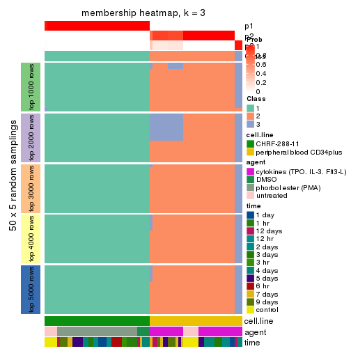</p>

</div>
<div id='tab-ATC-hclust-membership-heatmap-3'>
<pre><code class="r">membership_heatmap(res, k = 4)
</code></pre>

<p></p>

</div>
<div id='tab-ATC-hclust-membership-heatmap-4'>
<pre><code class="r">membership_heatmap(res, k = 5)
</code></pre>

<p></p>

</div>
<div id='tab-ATC-hclust-membership-heatmap-5'>
<pre><code class="r">membership_heatmap(res, k = 6)
</code></pre>

<p></p>

</div>
</div>

As soon as we have had the classes for columns, we can look for signatures
which are significantly different between classes which can be candidate marks
for certain classes. Following are the heatmaps for signatures.


Signature heatmaps where rows are scaled:


<script>
$( function() {
	$( '#tabs-ATC-hclust-get-signatures' ).tabs();
} );
</script>
<div id='tabs-ATC-hclust-get-signatures'>
<ul>
<li><a href='#tab-ATC-hclust-get-signatures-1'>k = 2</a></li>
<li><a href='#tab-ATC-hclust-get-signatures-2'>k = 3</a></li>
<li><a href='#tab-ATC-hclust-get-signatures-3'>k = 4</a></li>
<li><a href='#tab-ATC-hclust-get-signatures-4'>k = 5</a></li>
<li><a href='#tab-ATC-hclust-get-signatures-5'>k = 6</a></li>
</ul>
<div id='tab-ATC-hclust-get-signatures-1'>
<pre><code class="r">get_signatures(res, k = 2)
</code></pre>

<p></p>

</div>
<div id='tab-ATC-hclust-get-signatures-2'>
<pre><code class="r">get_signatures(res, k = 3)
</code></pre>

<p></p>

</div>
<div id='tab-ATC-hclust-get-signatures-3'>
<pre><code class="r">get_signatures(res, k = 4)
</code></pre>

<p></p>

</div>
<div id='tab-ATC-hclust-get-signatures-4'>
<pre><code class="r">get_signatures(res, k = 5)
</code></pre>

<p></p>

</div>
<div id='tab-ATC-hclust-get-signatures-5'>
<pre><code class="r">get_signatures(res, k = 6)
</code></pre>

<p></p>

</div>
</div>


Signature heatmaps where rows are not scaled:


<script>
$( function() {
	$( '#tabs-ATC-hclust-get-signatures-no-scale' ).tabs();
} );
</script>
<div id='tabs-ATC-hclust-get-signatures-no-scale'>
<ul>
<li><a href='#tab-ATC-hclust-get-signatures-no-scale-1'>k = 2</a></li>
<li><a href='#tab-ATC-hclust-get-signatures-no-scale-2'>k = 3</a></li>
<li><a href='#tab-ATC-hclust-get-signatures-no-scale-3'>k = 4</a></li>
<li><a href='#tab-ATC-hclust-get-signatures-no-scale-4'>k = 5</a></li>
<li><a href='#tab-ATC-hclust-get-signatures-no-scale-5'>k = 6</a></li>
</ul>
<div id='tab-ATC-hclust-get-signatures-no-scale-1'>
<pre><code class="r">get_signatures(res, k = 2, scale_rows = FALSE)
</code></pre>

<p></p>

</div>
<div id='tab-ATC-hclust-get-signatures-no-scale-2'>
<pre><code class="r">get_signatures(res, k = 3, scale_rows = FALSE)
</code></pre>

<p></p>

</div>
<div id='tab-ATC-hclust-get-signatures-no-scale-3'>
<pre><code class="r">get_signatures(res, k = 4, scale_rows = FALSE)
</code></pre>

<p></p>

</div>
<div id='tab-ATC-hclust-get-signatures-no-scale-4'>
<pre><code class="r">get_signatures(res, k = 5, scale_rows = FALSE)
</code></pre>

<p></p>

</div>
<div id='tab-ATC-hclust-get-signatures-no-scale-5'>
<pre><code class="r">get_signatures(res, k = 6, scale_rows = FALSE)
</code></pre>

<p></p>

</div>
</div>


Compare the overlap of signatures from different k:

```r
compare_signatures(res)
```


`get_signature()` returns a data frame invisibly. TO get the list of signatures, the function
call should be assigned to a variable explicitly. In following code, if `plot` argument is set
to `FALSE`, no heatmap is plotted while only the differential analysis is performed.

```r
# code only for demonstration
tb = get_signature(res, k = ..., plot = FALSE)
```

An example of the output of `tb` is:

```
#>   which_row         fdr    mean_1    mean_2 scaled_mean_1 scaled_mean_2 km
#> 1        38 0.042760348  8.373488  9.131774    -0.5533452     0.5164555  1
#> 2        40 0.018707592  7.106213  8.469186    -0.6173731     0.5762149  1
#> 3        55 0.019134737 10.221463 11.207825    -0.6159697     0.5749050  1
#> 4        59 0.006059896  5.921854  7.869574    -0.6899429     0.6439467  1
#> 5        60 0.018055526  8.928898 10.211722    -0.6204761     0.5791110  1
#> 6        98 0.009384629 15.714769 14.887706     0.6635654    -0.6193277  2
...
```

The columns in `tb` are:

1. `which_row`: row indices corresponding to the input matrix.
2. `fdr`: FDR for the differential test. 
3. `mean_x`: The mean value in group x.
4. `scaled_mean_x`: The mean value in group x after rows are scaled.
5. `km`: Row groups if k-means clustering is applied to rows.


UMAP plot which shows how samples are separated.


<script>
$( function() {
	$( '#tabs-ATC-hclust-dimension-reduction' ).tabs();
} );
</script>
<div id='tabs-ATC-hclust-dimension-reduction'>
<ul>
<li><a href='#tab-ATC-hclust-dimension-reduction-1'>k = 2</a></li>
<li><a href='#tab-ATC-hclust-dimension-reduction-2'>k = 3</a></li>
<li><a href='#tab-ATC-hclust-dimension-reduction-3'>k = 4</a></li>
<li><a href='#tab-ATC-hclust-dimension-reduction-4'>k = 5</a></li>
<li><a href='#tab-ATC-hclust-dimension-reduction-5'>k = 6</a></li>
</ul>
<div id='tab-ATC-hclust-dimension-reduction-1'>
<pre><code class="r">dimension_reduction(res, k = 2, method = &quot;UMAP&quot;)
</code></pre>

<p></p>

</div>
<div id='tab-ATC-hclust-dimension-reduction-2'>
<pre><code class="r">dimension_reduction(res, k = 3, method = &quot;UMAP&quot;)
</code></pre>

<p></p>

</div>
<div id='tab-ATC-hclust-dimension-reduction-3'>
<pre><code class="r">dimension_reduction(res, k = 4, method = &quot;UMAP&quot;)
</code></pre>

<p></p>

</div>
<div id='tab-ATC-hclust-dimension-reduction-4'>
<pre><code class="r">dimension_reduction(res, k = 5, method = &quot;UMAP&quot;)
</code></pre>

<p>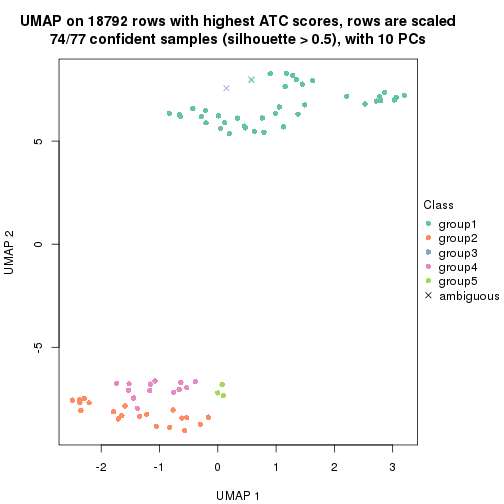</p>

</div>
<div id='tab-ATC-hclust-dimension-reduction-5'>
<pre><code class="r">dimension_reduction(res, k = 6, method = &quot;UMAP&quot;)
</code></pre>

<p></p>

</div>
</div>


Following heatmap shows how subgroups are split when increasing `k`:

```r
collect_classes(res)
```


Test correlation between subgroups and known annotations. If the known
annotation is numeric, one-way ANOVA test is applied, and if the known
annotation is discrete, chi-squared contingency table test is applied.

```r
test_to_known_factors(res)
```

```
#>             n cell.line(p) agent(p) time(p) k
#> ATC:hclust 77     1.27e-17 3.00e-14 0.36115 2
#> ATC:hclust 77     1.90e-17 1.75e-12 0.41080 3
#> ATC:hclust 74     8.53e-17 3.76e-12 0.33530 4
#> ATC:hclust 74     5.93e-16 5.41e-12 0.00706 5
#> ATC:hclust 73     5.28e-15 2.30e-12 0.03011 6
```


If matrix rows can be associated to genes, consider to use `GO_Enrichment(res,
...)` to perform function enrichment for the signature genes.


 

---------------------------------------------------


### ATC:kmeans**


The object with results only for a single top-value method and a single partition method 
can be extracted as:

```r
res = res_list["ATC", "kmeans"]
# you can also extract it by
# res = res_list["ATC:kmeans"]
```

A summary of `res` and all the functions that can be applied to it:

```r
res
```

```
#> A 'ConsensusPartition' object with k = 2, 3, 4, 5, 6.
#>   On a matrix with 18792 rows and 77 columns.
#>   Top rows (1000, 2000, 3000, 4000, 5000) are extracted by 'ATC' method.
#>   Subgroups are detected by 'kmeans' method.
#>   Performed in total 1250 partitions by row resampling.
#>   Best k for subgroups seems to be 2.
#> 
#> Following methods can be applied to this 'ConsensusPartition' object:
#>  [1] "cola_report"             "collect_classes"         "collect_plots"          
#>  [4] "collect_stats"           "colnames"                "compare_signatures"     
#>  [7] "consensus_heatmap"       "dimension_reduction"     "functional_enrichment"  
#> [10] "get_anno_col"            "get_anno"                "get_classes"            
#> [13] "get_consensus"           "get_matrix"              "get_membership"         
#> [16] "get_param"               "get_signatures"          "get_stats"              
#> [19] "is_best_k"               "is_stable_k"             "membership_heatmap"     
#> [22] "ncol"                    "nrow"                    "plot_ecdf"              
#> [25] "rownames"                "select_partition_number" "show"                   
#> [28] "suggest_best_k"          "test_to_known_factors"
```

`collect_plots()` function collects all the plots made from `res` for all `k` (number of partitions)
into one single page to provide an easy and fast comparison between different `k`.

```r
collect_plots(res)
```


The plots are:

- The first row: a plot of the ECDF (Empirical cumulative distribution
  function) curves of the consensus matrix for each `k` and the heatmap of
  predicted classes for each `k`.
- The second row: heatmaps of the consensus matrix for each `k`.
- The third row: heatmaps of the membership matrix for each `k`.
- The fouth row: heatmaps of the signatures for each `k`.

All the plots in panels can be made by individual functions and they are
plotted later in this section.

`select_partition_number()` produces several plots showing different
statistics for choosing "optimized" `k`. There are following statistics:

- ECDF curves of the consensus matrix for each `k`;
- 1-PAC. [The PAC
  score](https://en.wikipedia.org/wiki/Consensus_clustering#Over-interpretation_potential_of_consensus_clustering)
  measures the proportion of the ambiguous subgrouping.
- Mean silhouette score.
- Concordance. The mean probability of fiting the consensus class ids in all
  partitions.
- Area increased. Denote $A_k$ as the area under the ECDF curve for current
  `k`, the area increased is defined as $A_k - A_{k-1}$.
- Rand index. The percent of pairs of samples that are both in a same cluster
  or both are not in a same cluster in the partition of k and k-1.
- Jaccard index. The ratio of pairs of samples are both in a same cluster in
  the partition of k and k-1 and the pairs of samples are both in a same
  cluster in the partition k or k-1.

The detailed explanations of these statistics can be found in [the cola
vignette](http://bioconductor.org/packages/devel/bioc/vignettes/cola/inst/doc/cola.html#toc_13).

Generally speaking, lower PAC score, higher mean silhouette score or higher
concordance corresponds to better partition. Rand index and Jaccard index
measure how similar the current partition is compared to partition with `k-1`.
If they are too similar, we won't accept `k` is better than `k-1`.

```r
select_partition_number(res)
```


The numeric values for all these statistics can be obtained by `get_stats()`.

```r
get_stats(res)
```

```
#>   k 1-PAC mean_silhouette concordance area_increased  Rand Jaccard
#> 2 2 1.000           1.000       1.000         0.5049 0.496   0.496
#> 3 3 0.630           0.819       0.784         0.2408 1.000   1.000
#> 4 4 0.589           0.329       0.643         0.1158 0.823   0.643
#> 5 5 0.586           0.542       0.661         0.0796 0.785   0.416
#> 6 6 0.637           0.647       0.667         0.0544 0.862   0.468
```

`suggest_best_k()` suggests the best $k$ based on these statistics. The rules are as follows:

- All $k$ with Jaccard index larger than 0.95 are removed because the increase of
  the partition number does not provides enough extra information. If all $k$ are removed,
  the best $k$ is assigned by `NA`.
- For $k$ with 1-PAC larger than 0.9, the maximal $k$ is taken as the "best k". Other $k$ is called "optional k".
- If it does not fit the second rule. The $k$ with the highest vote of highest
  1-PAC, mean silhouette and concordance is taken as the "best k".

```r
suggest_best_k(res)
```

```
#> [1] 2
```


Following shows the table of the partitions (You need to click the **show/hide
code output** link to see it). The membership matrix (columns with name `p*`)
is inferred by
[`clue::cl_consensus()`](https://www.rdocumentation.org/link/cl_consensus?package=clue)
function with the `SE` method. Basically the value in the membership matrix
represents the probability to belong to a certain group. The finall class
label for an item is determined with the group with highest probability it
belongs to.

In `get_classes()` function, the entropy is calculated from the membership
matrix and the silhouette score is calculated from the consensus matrix.


<script>
$( function() {
	$( '#tabs-ATC-kmeans-get-classes' ).tabs();
} );
</script>
<div id='tabs-ATC-kmeans-get-classes'>
<ul>
<li><a href='#tab-ATC-kmeans-get-classes-1'>k = 2</a></li>
<li><a href='#tab-ATC-kmeans-get-classes-2'>k = 3</a></li>
<li><a href='#tab-ATC-kmeans-get-classes-3'>k = 4</a></li>
<li><a href='#tab-ATC-kmeans-get-classes-4'>k = 5</a></li>
<li><a href='#tab-ATC-kmeans-get-classes-5'>k = 6</a></li>
</ul>

<div id='tab-ATC-kmeans-get-classes-1'>
<p><a id='tab-ATC-kmeans-get-classes-1-a' style='color:#0366d6' href='#'>show/hide code output</a></p>
<pre><code class="r">cbind(get_classes(res, k = 2), get_membership(res, k = 2))
</code></pre>

<pre><code>#&gt;          class entropy silhouette p1 p2
#&gt; GSM87962     1       0          1  1  0
#&gt; GSM87963     1       0          1  1  0
#&gt; GSM87983     1       0          1  1  0
#&gt; GSM87984     1       0          1  1  0
#&gt; GSM87961     1       0          1  1  0
#&gt; GSM87970     1       0          1  1  0
#&gt; GSM87971     1       0          1  1  0
#&gt; GSM87990     1       0          1  1  0
#&gt; GSM87991     1       0          1  1  0
#&gt; GSM87974     1       0          1  1  0
#&gt; GSM87994     1       0          1  1  0
#&gt; GSM87978     1       0          1  1  0
#&gt; GSM87979     1       0          1  1  0
#&gt; GSM87998     1       0          1  1  0
#&gt; GSM87999     1       0          1  1  0
#&gt; GSM87968     1       0          1  1  0
#&gt; GSM87987     1       0          1  1  0
#&gt; GSM87969     1       0          1  1  0
#&gt; GSM87988     1       0          1  1  0
#&gt; GSM87989     1       0          1  1  0
#&gt; GSM87972     1       0          1  1  0
#&gt; GSM87992     1       0          1  1  0
#&gt; GSM87973     1       0          1  1  0
#&gt; GSM87993     1       0          1  1  0
#&gt; GSM87975     1       0          1  1  0
#&gt; GSM87995     1       0          1  1  0
#&gt; GSM87976     1       0          1  1  0
#&gt; GSM87977     1       0          1  1  0
#&gt; GSM87996     1       0          1  1  0
#&gt; GSM87997     1       0          1  1  0
#&gt; GSM87980     1       0          1  1  0
#&gt; GSM88000     1       0          1  1  0
#&gt; GSM87981     1       0          1  1  0
#&gt; GSM87982     1       0          1  1  0
#&gt; GSM88001     1       0          1  1  0
#&gt; GSM87967     1       0          1  1  0
#&gt; GSM87964     1       0          1  1  0
#&gt; GSM87965     1       0          1  1  0
#&gt; GSM87966     1       0          1  1  0
#&gt; GSM87985     1       0          1  1  0
#&gt; GSM87986     1       0          1  1  0
#&gt; GSM88004     2       0          1  0  1
#&gt; GSM88015     2       0          1  0  1
#&gt; GSM88005     2       0          1  0  1
#&gt; GSM88006     2       0          1  0  1
#&gt; GSM88016     2       0          1  0  1
#&gt; GSM88007     2       0          1  0  1
#&gt; GSM88017     2       0          1  0  1
#&gt; GSM88029     2       0          1  0  1
#&gt; GSM88008     2       0          1  0  1
#&gt; GSM88009     2       0          1  0  1
#&gt; GSM88018     2       0          1  0  1
#&gt; GSM88024     2       0          1  0  1
#&gt; GSM88030     2       0          1  0  1
#&gt; GSM88036     2       0          1  0  1
#&gt; GSM88010     2       0          1  0  1
#&gt; GSM88011     2       0          1  0  1
#&gt; GSM88019     2       0          1  0  1
#&gt; GSM88027     2       0          1  0  1
#&gt; GSM88031     2       0          1  0  1
#&gt; GSM88012     2       0          1  0  1
#&gt; GSM88020     2       0          1  0  1
#&gt; GSM88032     2       0          1  0  1
#&gt; GSM88037     2       0          1  0  1
#&gt; GSM88013     2       0          1  0  1
#&gt; GSM88021     2       0          1  0  1
#&gt; GSM88025     2       0          1  0  1
#&gt; GSM88033     2       0          1  0  1
#&gt; GSM88014     2       0          1  0  1
#&gt; GSM88022     2       0          1  0  1
#&gt; GSM88034     2       0          1  0  1
#&gt; GSM88002     2       0          1  0  1
#&gt; GSM88003     2       0          1  0  1
#&gt; GSM88023     2       0          1  0  1
#&gt; GSM88026     2       0          1  0  1
#&gt; GSM88028     2       0          1  0  1
#&gt; GSM88035     2       0          1  0  1
</code></pre>

<script>
$('#tab-ATC-kmeans-get-classes-1-a').parent().next().next().hide();
$('#tab-ATC-kmeans-get-classes-1-a').click(function(){
  $('#tab-ATC-kmeans-get-classes-1-a').parent().next().next().toggle();
  return(false);
});
</script>
</div>

<div id='tab-ATC-kmeans-get-classes-2'>
<p><a id='tab-ATC-kmeans-get-classes-2-a' style='color:#0366d6' href='#'>show/hide code output</a></p>
<pre><code class="r">cbind(get_classes(res, k = 3), get_membership(res, k = 3))
</code></pre>

<pre><code>#&gt;          class entropy silhouette    p1    p2 p3
#&gt; GSM87962     1  0.6274      0.805 0.544 0.000 NA
#&gt; GSM87963     1  0.6274      0.805 0.544 0.000 NA
#&gt; GSM87983     1  0.4504      0.802 0.804 0.000 NA
#&gt; GSM87984     1  0.4504      0.802 0.804 0.000 NA
#&gt; GSM87961     1  0.6274      0.805 0.544 0.000 NA
#&gt; GSM87970     1  0.6274      0.805 0.544 0.000 NA
#&gt; GSM87971     1  0.6274      0.805 0.544 0.000 NA
#&gt; GSM87990     1  0.4750      0.805 0.784 0.000 NA
#&gt; GSM87991     1  0.3551      0.789 0.868 0.000 NA
#&gt; GSM87974     1  0.6274      0.805 0.544 0.000 NA
#&gt; GSM87994     1  0.1753      0.775 0.952 0.000 NA
#&gt; GSM87978     1  0.6274      0.805 0.544 0.000 NA
#&gt; GSM87979     1  0.6274      0.805 0.544 0.000 NA
#&gt; GSM87998     1  0.0000      0.774 1.000 0.000 NA
#&gt; GSM87999     1  0.0000      0.774 1.000 0.000 NA
#&gt; GSM87968     1  0.6274      0.805 0.544 0.000 NA
#&gt; GSM87987     1  0.0237      0.775 0.996 0.000 NA
#&gt; GSM87969     1  0.6274      0.805 0.544 0.000 NA
#&gt; GSM87988     1  0.2625      0.763 0.916 0.000 NA
#&gt; GSM87989     1  0.2625      0.763 0.916 0.000 NA
#&gt; GSM87972     1  0.6267      0.803 0.548 0.000 NA
#&gt; GSM87992     1  0.2625      0.763 0.916 0.000 NA
#&gt; GSM87973     1  0.6180      0.801 0.584 0.000 NA
#&gt; GSM87993     1  0.2625      0.763 0.916 0.000 NA
#&gt; GSM87975     1  0.6302      0.804 0.520 0.000 NA
#&gt; GSM87995     1  0.2625      0.763 0.916 0.000 NA
#&gt; GSM87976     1  0.6302      0.804 0.520 0.000 NA
#&gt; GSM87977     1  0.6267      0.803 0.548 0.000 NA
#&gt; GSM87996     1  0.2625      0.763 0.916 0.000 NA
#&gt; GSM87997     1  0.2625      0.763 0.916 0.000 NA
#&gt; GSM87980     1  0.6267      0.803 0.548 0.000 NA
#&gt; GSM88000     1  0.2625      0.763 0.916 0.000 NA
#&gt; GSM87981     1  0.6267      0.803 0.548 0.000 NA
#&gt; GSM87982     1  0.6267      0.803 0.548 0.000 NA
#&gt; GSM88001     1  0.2625      0.763 0.916 0.000 NA
#&gt; GSM87967     1  0.6180      0.801 0.584 0.000 NA
#&gt; GSM87964     1  0.6274      0.805 0.544 0.000 NA
#&gt; GSM87965     1  0.6274      0.805 0.544 0.000 NA
#&gt; GSM87966     1  0.4504      0.802 0.804 0.000 NA
#&gt; GSM87985     1  0.4796      0.806 0.780 0.000 NA
#&gt; GSM87986     1  0.4504      0.802 0.804 0.000 NA
#&gt; GSM88004     2  0.0000      0.870 0.000 1.000 NA
#&gt; GSM88015     2  0.0000      0.870 0.000 1.000 NA
#&gt; GSM88005     2  0.0000      0.870 0.000 1.000 NA
#&gt; GSM88006     2  0.0000      0.870 0.000 1.000 NA
#&gt; GSM88016     2  0.0000      0.870 0.000 1.000 NA
#&gt; GSM88007     2  0.0000      0.870 0.000 1.000 NA
#&gt; GSM88017     2  0.3619      0.843 0.000 0.864 NA
#&gt; GSM88029     2  0.4178      0.848 0.000 0.828 NA
#&gt; GSM88008     2  0.0000      0.870 0.000 1.000 NA
#&gt; GSM88009     2  0.0000      0.870 0.000 1.000 NA
#&gt; GSM88018     2  0.0000      0.870 0.000 1.000 NA
#&gt; GSM88024     2  0.2537      0.860 0.000 0.920 NA
#&gt; GSM88030     2  0.5926      0.829 0.000 0.644 NA
#&gt; GSM88036     2  0.5926      0.829 0.000 0.644 NA
#&gt; GSM88010     2  0.2625      0.872 0.000 0.916 NA
#&gt; GSM88011     2  0.2066      0.870 0.000 0.940 NA
#&gt; GSM88019     2  0.2066      0.870 0.000 0.940 NA
#&gt; GSM88027     2  0.1529      0.870 0.000 0.960 NA
#&gt; GSM88031     2  0.5560      0.837 0.000 0.700 NA
#&gt; GSM88012     2  0.5591      0.837 0.000 0.696 NA
#&gt; GSM88020     2  0.5591      0.837 0.000 0.696 NA
#&gt; GSM88032     2  0.5591      0.837 0.000 0.696 NA
#&gt; GSM88037     2  0.5591      0.837 0.000 0.696 NA
#&gt; GSM88013     2  0.5591      0.837 0.000 0.696 NA
#&gt; GSM88021     2  0.5591      0.837 0.000 0.696 NA
#&gt; GSM88025     2  0.5591      0.837 0.000 0.696 NA
#&gt; GSM88033     2  0.5591      0.837 0.000 0.696 NA
#&gt; GSM88014     2  0.5591      0.837 0.000 0.696 NA
#&gt; GSM88022     2  0.5591      0.837 0.000 0.696 NA
#&gt; GSM88034     2  0.6192      0.814 0.000 0.580 NA
#&gt; GSM88002     2  0.4605      0.838 0.000 0.796 NA
#&gt; GSM88003     2  0.4605      0.838 0.000 0.796 NA
#&gt; GSM88023     2  0.4605      0.838 0.000 0.796 NA
#&gt; GSM88026     2  0.4605      0.838 0.000 0.796 NA
#&gt; GSM88028     2  0.4605      0.838 0.000 0.796 NA
#&gt; GSM88035     2  0.4605      0.838 0.000 0.796 NA
</code></pre>

<script>
$('#tab-ATC-kmeans-get-classes-2-a').parent().next().next().hide();
$('#tab-ATC-kmeans-get-classes-2-a').click(function(){
  $('#tab-ATC-kmeans-get-classes-2-a').parent().next().next().toggle();
  return(false);
});
</script>
</div>

<div id='tab-ATC-kmeans-get-classes-3'>
<p><a id='tab-ATC-kmeans-get-classes-3-a' style='color:#0366d6' href='#'>show/hide code output</a></p>
<pre><code class="r">cbind(get_classes(res, k = 4), get_membership(res, k = 4))
</code></pre>

<pre><code>#&gt;          class entropy silhouette    p1    p2    p3    p4
#&gt; GSM87962     1  0.6824     0.5148 0.548 0.000 0.336 0.116
#&gt; GSM87963     1  0.6824     0.5148 0.548 0.000 0.336 0.116
#&gt; GSM87983     3  0.6634     0.3020 0.292 0.000 0.592 0.116
#&gt; GSM87984     3  0.6634     0.3020 0.292 0.000 0.592 0.116
#&gt; GSM87961     1  0.6824     0.5148 0.548 0.000 0.336 0.116
#&gt; GSM87970     1  0.4250     0.7198 0.724 0.000 0.276 0.000
#&gt; GSM87971     1  0.4250     0.7198 0.724 0.000 0.276 0.000
#&gt; GSM87990     3  0.6711     0.2652 0.308 0.000 0.576 0.116
#&gt; GSM87991     3  0.6422     0.3651 0.248 0.000 0.632 0.120
#&gt; GSM87974     1  0.4690     0.7178 0.712 0.000 0.276 0.012
#&gt; GSM87994     3  0.3105     0.5639 0.120 0.000 0.868 0.012
#&gt; GSM87978     1  0.4250     0.7198 0.724 0.000 0.276 0.000
#&gt; GSM87979     1  0.4250     0.7198 0.724 0.000 0.276 0.000
#&gt; GSM87998     3  0.2125     0.5943 0.076 0.000 0.920 0.004
#&gt; GSM87999     3  0.2125     0.5943 0.076 0.000 0.920 0.004
#&gt; GSM87968     1  0.4250     0.7198 0.724 0.000 0.276 0.000
#&gt; GSM87987     3  0.2401     0.5870 0.092 0.000 0.904 0.004
#&gt; GSM87969     1  0.4250     0.7198 0.724 0.000 0.276 0.000
#&gt; GSM87988     3  0.1716     0.6116 0.000 0.000 0.936 0.064
#&gt; GSM87989     3  0.1716     0.6116 0.000 0.000 0.936 0.064
#&gt; GSM87972     1  0.7006     0.5739 0.456 0.000 0.428 0.116
#&gt; GSM87992     3  0.2216     0.6078 0.000 0.000 0.908 0.092
#&gt; GSM87973     3  0.7047    -0.5840 0.436 0.000 0.444 0.120
#&gt; GSM87993     3  0.2149     0.6074 0.000 0.000 0.912 0.088
#&gt; GSM87975     1  0.7273     0.5869 0.452 0.000 0.400 0.148
#&gt; GSM87995     3  0.2149     0.6074 0.000 0.000 0.912 0.088
#&gt; GSM87976     1  0.7273     0.5869 0.452 0.000 0.400 0.148
#&gt; GSM87977     1  0.7044     0.5696 0.452 0.000 0.428 0.120
#&gt; GSM87996     3  0.2149     0.6074 0.000 0.000 0.912 0.088
#&gt; GSM87997     3  0.2149     0.6074 0.000 0.000 0.912 0.088
#&gt; GSM87980     1  0.7282     0.5664 0.436 0.000 0.416 0.148
#&gt; GSM88000     3  0.2149     0.6074 0.000 0.000 0.912 0.088
#&gt; GSM87981     1  0.7119     0.5660 0.444 0.000 0.428 0.128
#&gt; GSM87982     1  0.7119     0.5660 0.444 0.000 0.428 0.128
#&gt; GSM88001     3  0.2149     0.6074 0.000 0.000 0.912 0.088
#&gt; GSM87967     3  0.7047    -0.5840 0.436 0.000 0.444 0.120
#&gt; GSM87964     1  0.5282     0.7090 0.688 0.000 0.276 0.036
#&gt; GSM87965     1  0.6824     0.5148 0.548 0.000 0.336 0.116
#&gt; GSM87966     3  0.6634     0.3020 0.292 0.000 0.592 0.116
#&gt; GSM87985     3  0.6746     0.2427 0.316 0.000 0.568 0.116
#&gt; GSM87986     3  0.6634     0.3020 0.292 0.000 0.592 0.116
#&gt; GSM88004     2  0.0000     0.4062 0.000 1.000 0.000 0.000
#&gt; GSM88015     2  0.0188     0.4053 0.004 0.996 0.000 0.000
#&gt; GSM88005     2  0.0000     0.4062 0.000 1.000 0.000 0.000
#&gt; GSM88006     2  0.0000     0.4062 0.000 1.000 0.000 0.000
#&gt; GSM88016     2  0.0188     0.4053 0.004 0.996 0.000 0.000
#&gt; GSM88007     2  0.0000     0.4062 0.000 1.000 0.000 0.000
#&gt; GSM88017     2  0.4840     0.1255 0.028 0.732 0.000 0.240
#&gt; GSM88029     2  0.5022     0.0920 0.028 0.708 0.000 0.264
#&gt; GSM88008     2  0.0000     0.4062 0.000 1.000 0.000 0.000
#&gt; GSM88009     2  0.0000     0.4062 0.000 1.000 0.000 0.000
#&gt; GSM88018     2  0.0188     0.4053 0.004 0.996 0.000 0.000
#&gt; GSM88024     2  0.1722     0.3614 0.008 0.944 0.000 0.048
#&gt; GSM88030     4  0.6609     0.6834 0.080 0.448 0.000 0.472
#&gt; GSM88036     4  0.6609     0.6834 0.080 0.448 0.000 0.472
#&gt; GSM88010     2  0.3674     0.3047 0.044 0.852 0.000 0.104
#&gt; GSM88011     2  0.3550     0.3113 0.044 0.860 0.000 0.096
#&gt; GSM88019     2  0.3570     0.3123 0.048 0.860 0.000 0.092
#&gt; GSM88027     2  0.2919     0.3448 0.044 0.896 0.000 0.060
#&gt; GSM88031     2  0.7664    -0.2514 0.248 0.460 0.000 0.292
#&gt; GSM88012     2  0.7677    -0.2538 0.248 0.456 0.000 0.296
#&gt; GSM88020     2  0.7747    -0.3534 0.252 0.432 0.000 0.316
#&gt; GSM88032     2  0.7677    -0.2538 0.248 0.456 0.000 0.296
#&gt; GSM88037     2  0.7677    -0.2538 0.248 0.456 0.000 0.296
#&gt; GSM88013     2  0.7677    -0.2538 0.248 0.456 0.000 0.296
#&gt; GSM88021     2  0.7677    -0.2538 0.248 0.456 0.000 0.296
#&gt; GSM88025     2  0.7677    -0.2538 0.248 0.456 0.000 0.296
#&gt; GSM88033     2  0.7763    -0.3095 0.264 0.432 0.000 0.304
#&gt; GSM88014     2  0.7677    -0.2538 0.248 0.456 0.000 0.296
#&gt; GSM88022     2  0.7677    -0.2538 0.248 0.456 0.000 0.296
#&gt; GSM88034     4  0.7698     0.4015 0.224 0.356 0.000 0.420
#&gt; GSM88002     2  0.4605     0.0768 0.000 0.664 0.000 0.336
#&gt; GSM88003     2  0.4605     0.0768 0.000 0.664 0.000 0.336
#&gt; GSM88023     2  0.4605     0.0768 0.000 0.664 0.000 0.336
#&gt; GSM88026     2  0.4605     0.0768 0.000 0.664 0.000 0.336
#&gt; GSM88028     2  0.4605     0.0768 0.000 0.664 0.000 0.336
#&gt; GSM88035     2  0.4605     0.0768 0.000 0.664 0.000 0.336
</code></pre>

<script>
$('#tab-ATC-kmeans-get-classes-3-a').parent().next().next().hide();
$('#tab-ATC-kmeans-get-classes-3-a').click(function(){
  $('#tab-ATC-kmeans-get-classes-3-a').parent().next().next().toggle();
  return(false);
});
</script>
</div>

<div id='tab-ATC-kmeans-get-classes-4'>
<p><a id='tab-ATC-kmeans-get-classes-4-a' style='color:#0366d6' href='#'>show/hide code output</a></p>
<pre><code class="r">cbind(get_classes(res, k = 5), get_membership(res, k = 5))
</code></pre>

<pre><code>#&gt;          class entropy silhouette    p1    p2    p3    p4    p5
#&gt; GSM87962     1  0.2891     0.4841 0.824 0.000 0.176 0.000 0.000
#&gt; GSM87963     1  0.2891     0.4841 0.824 0.000 0.176 0.000 0.000
#&gt; GSM87983     1  0.5065     0.3445 0.544 0.036 0.420 0.000 0.000
#&gt; GSM87984     1  0.5065     0.3445 0.544 0.036 0.420 0.000 0.000
#&gt; GSM87961     1  0.2891     0.4841 0.824 0.000 0.176 0.000 0.000
#&gt; GSM87970     1  0.7279     0.0687 0.492 0.056 0.176 0.000 0.276
#&gt; GSM87971     1  0.7279     0.0687 0.492 0.056 0.176 0.000 0.276
#&gt; GSM87990     1  0.5036     0.3688 0.560 0.036 0.404 0.000 0.000
#&gt; GSM87991     1  0.5495     0.2619 0.500 0.064 0.436 0.000 0.000
#&gt; GSM87974     1  0.7306     0.0453 0.484 0.056 0.176 0.000 0.284
#&gt; GSM87994     3  0.4428     0.6515 0.160 0.084 0.756 0.000 0.000
#&gt; GSM87978     1  0.7238     0.0631 0.492 0.052 0.176 0.000 0.280
#&gt; GSM87979     1  0.7238     0.0631 0.492 0.052 0.176 0.000 0.280
#&gt; GSM87998     3  0.4268     0.6825 0.144 0.084 0.772 0.000 0.000
#&gt; GSM87999     3  0.4268     0.6825 0.144 0.084 0.772 0.000 0.000
#&gt; GSM87968     1  0.7238     0.0631 0.492 0.052 0.176 0.000 0.280
#&gt; GSM87987     3  0.4309     0.6767 0.148 0.084 0.768 0.000 0.000
#&gt; GSM87969     1  0.7038     0.0360 0.496 0.036 0.176 0.000 0.292
#&gt; GSM87988     3  0.1197     0.8205 0.000 0.048 0.952 0.000 0.000
#&gt; GSM87989     3  0.1197     0.8205 0.000 0.048 0.952 0.000 0.000
#&gt; GSM87972     5  0.6371     0.9372 0.216 0.000 0.268 0.000 0.516
#&gt; GSM87992     3  0.1430     0.8426 0.000 0.004 0.944 0.000 0.052
#&gt; GSM87973     5  0.6309     0.9365 0.192 0.000 0.288 0.000 0.520
#&gt; GSM87993     3  0.1544     0.8418 0.000 0.000 0.932 0.000 0.068
#&gt; GSM87975     5  0.6526     0.9061 0.224 0.008 0.236 0.000 0.532
#&gt; GSM87995     3  0.1544     0.8418 0.000 0.000 0.932 0.000 0.068
#&gt; GSM87976     5  0.6526     0.9061 0.224 0.008 0.236 0.000 0.532
#&gt; GSM87977     5  0.6279     0.9470 0.200 0.000 0.268 0.000 0.532
#&gt; GSM87996     3  0.1544     0.8418 0.000 0.000 0.932 0.000 0.068
#&gt; GSM87997     3  0.1544     0.8418 0.000 0.000 0.932 0.000 0.068
#&gt; GSM87980     5  0.6421     0.9350 0.196 0.008 0.248 0.000 0.548
#&gt; GSM88000     3  0.1544     0.8418 0.000 0.000 0.932 0.000 0.068
#&gt; GSM87981     5  0.6271     0.9468 0.196 0.000 0.272 0.000 0.532
#&gt; GSM87982     5  0.6319     0.9406 0.196 0.000 0.284 0.000 0.520
#&gt; GSM88001     3  0.1544     0.8418 0.000 0.000 0.932 0.000 0.068
#&gt; GSM87967     5  0.6309     0.9365 0.192 0.000 0.288 0.000 0.520
#&gt; GSM87964     1  0.7606    -0.0231 0.444 0.076 0.176 0.000 0.304
#&gt; GSM87965     1  0.2891     0.4841 0.824 0.000 0.176 0.000 0.000
#&gt; GSM87966     1  0.5065     0.3445 0.544 0.036 0.420 0.000 0.000
#&gt; GSM87985     1  0.5028     0.3740 0.564 0.036 0.400 0.000 0.000
#&gt; GSM87986     1  0.5065     0.3445 0.544 0.036 0.420 0.000 0.000
#&gt; GSM88004     2  0.6749     0.6661 0.000 0.400 0.000 0.272 0.328
#&gt; GSM88015     2  0.6767     0.6559 0.000 0.380 0.000 0.272 0.348
#&gt; GSM88005     2  0.6749     0.6661 0.000 0.400 0.000 0.272 0.328
#&gt; GSM88006     2  0.6749     0.6661 0.000 0.400 0.000 0.272 0.328
#&gt; GSM88016     2  0.7423     0.6524 0.032 0.384 0.000 0.268 0.316
#&gt; GSM88007     2  0.6749     0.6661 0.000 0.400 0.000 0.272 0.328
#&gt; GSM88017     2  0.6979     0.6092 0.068 0.568 0.000 0.168 0.196
#&gt; GSM88029     2  0.6973     0.5857 0.072 0.572 0.000 0.192 0.164
#&gt; GSM88008     2  0.6749     0.6661 0.000 0.400 0.000 0.272 0.328
#&gt; GSM88009     2  0.6749     0.6661 0.000 0.400 0.000 0.272 0.328
#&gt; GSM88018     2  0.7423     0.6524 0.032 0.384 0.000 0.268 0.316
#&gt; GSM88024     2  0.7458     0.6555 0.044 0.424 0.000 0.228 0.304
#&gt; GSM88030     4  0.7128     0.2026 0.128 0.324 0.000 0.488 0.060
#&gt; GSM88036     4  0.7128     0.2026 0.128 0.324 0.000 0.488 0.060
#&gt; GSM88010     4  0.7022    -0.2597 0.020 0.228 0.000 0.464 0.288
#&gt; GSM88011     4  0.7056    -0.2713 0.020 0.236 0.000 0.456 0.288
#&gt; GSM88019     4  0.7415    -0.4095 0.036 0.236 0.000 0.396 0.332
#&gt; GSM88027     4  0.7531    -0.5385 0.036 0.292 0.000 0.340 0.332
#&gt; GSM88031     4  0.0162     0.7080 0.000 0.000 0.000 0.996 0.004
#&gt; GSM88012     4  0.1310     0.7037 0.024 0.000 0.000 0.956 0.020
#&gt; GSM88020     4  0.2104     0.6742 0.060 0.000 0.000 0.916 0.024
#&gt; GSM88032     4  0.0162     0.7080 0.000 0.000 0.000 0.996 0.004
#&gt; GSM88037     4  0.0162     0.7080 0.000 0.000 0.000 0.996 0.004
#&gt; GSM88013     4  0.1310     0.7037 0.024 0.000 0.000 0.956 0.020
#&gt; GSM88021     4  0.0000     0.7077 0.000 0.000 0.000 1.000 0.000
#&gt; GSM88025     4  0.0000     0.7077 0.000 0.000 0.000 1.000 0.000
#&gt; GSM88033     4  0.0671     0.7011 0.004 0.000 0.000 0.980 0.016
#&gt; GSM88014     4  0.1310     0.7037 0.024 0.000 0.000 0.956 0.020
#&gt; GSM88022     4  0.1310     0.7037 0.024 0.000 0.000 0.956 0.020
#&gt; GSM88034     4  0.4726     0.5664 0.100 0.088 0.000 0.776 0.036
#&gt; GSM88002     2  0.3231     0.5595 0.000 0.800 0.000 0.196 0.004
#&gt; GSM88003     2  0.3231     0.5595 0.000 0.800 0.000 0.196 0.004
#&gt; GSM88023     2  0.3074     0.5598 0.000 0.804 0.000 0.196 0.000
#&gt; GSM88026     2  0.3074     0.5598 0.000 0.804 0.000 0.196 0.000
#&gt; GSM88028     2  0.3074     0.5598 0.000 0.804 0.000 0.196 0.000
#&gt; GSM88035     2  0.3074     0.5598 0.000 0.804 0.000 0.196 0.000
</code></pre>

<script>
$('#tab-ATC-kmeans-get-classes-4-a').parent().next().next().hide();
$('#tab-ATC-kmeans-get-classes-4-a').click(function(){
  $('#tab-ATC-kmeans-get-classes-4-a').parent().next().next().toggle();
  return(false);
});
</script>
</div>

<div id='tab-ATC-kmeans-get-classes-5'>
<p><a id='tab-ATC-kmeans-get-classes-5-a' style='color:#0366d6' href='#'>show/hide code output</a></p>
<pre><code class="r">cbind(get_classes(res, k = 6), get_membership(res, k = 6))
</code></pre>

<pre><code>#&gt;          class entropy silhouette    p1    p2    p3    p4    p5    p6
#&gt; GSM87962     1  0.3986     -0.319 0.532 0.000 0.000 0.000 0.004 0.464
#&gt; GSM87963     1  0.3986     -0.319 0.532 0.000 0.000 0.000 0.004 0.464
#&gt; GSM87983     6  0.5729      0.952 0.252 0.000 0.204 0.000 0.004 0.540
#&gt; GSM87984     6  0.5729      0.952 0.252 0.000 0.204 0.000 0.004 0.540
#&gt; GSM87961     1  0.3857     -0.320 0.532 0.000 0.000 0.000 0.000 0.468
#&gt; GSM87970     1  0.0520      0.607 0.984 0.000 0.000 0.008 0.008 0.000
#&gt; GSM87971     1  0.0520      0.607 0.984 0.000 0.000 0.008 0.008 0.000
#&gt; GSM87990     6  0.5665      0.925 0.284 0.000 0.172 0.000 0.004 0.540
#&gt; GSM87991     6  0.6270      0.822 0.196 0.000 0.232 0.016 0.016 0.540
#&gt; GSM87974     1  0.0665      0.608 0.980 0.000 0.000 0.008 0.008 0.004
#&gt; GSM87994     3  0.7095      0.478 0.104 0.000 0.520 0.104 0.036 0.236
#&gt; GSM87978     1  0.0146      0.609 0.996 0.000 0.000 0.004 0.000 0.000
#&gt; GSM87979     1  0.0146      0.609 0.996 0.000 0.000 0.004 0.000 0.000
#&gt; GSM87998     3  0.6968      0.571 0.096 0.000 0.556 0.108 0.044 0.196
#&gt; GSM87999     3  0.6968      0.571 0.096 0.000 0.556 0.108 0.044 0.196
#&gt; GSM87968     1  0.0146      0.609 0.996 0.000 0.000 0.004 0.000 0.000
#&gt; GSM87987     3  0.7045      0.555 0.104 0.000 0.548 0.108 0.044 0.196
#&gt; GSM87969     1  0.1065      0.605 0.964 0.000 0.000 0.020 0.008 0.008
#&gt; GSM87988     3  0.4989      0.757 0.064 0.000 0.748 0.104 0.036 0.048
#&gt; GSM87989     3  0.4993      0.758 0.064 0.000 0.748 0.104 0.040 0.044
#&gt; GSM87972     1  0.6358      0.644 0.600 0.000 0.064 0.048 0.224 0.064
#&gt; GSM87992     3  0.1841      0.803 0.064 0.000 0.920 0.008 0.008 0.000
#&gt; GSM87973     1  0.6774      0.632 0.560 0.000 0.100 0.048 0.228 0.064
#&gt; GSM87993     3  0.1471      0.806 0.064 0.000 0.932 0.000 0.004 0.000
#&gt; GSM87975     1  0.6684      0.639 0.572 0.000 0.060 0.068 0.228 0.072
#&gt; GSM87995     3  0.1471      0.806 0.064 0.000 0.932 0.000 0.004 0.000
#&gt; GSM87976     1  0.6684      0.639 0.572 0.000 0.060 0.068 0.228 0.072
#&gt; GSM87977     1  0.6547      0.641 0.584 0.000 0.080 0.048 0.224 0.064
#&gt; GSM87996     3  0.1471      0.806 0.064 0.000 0.932 0.000 0.004 0.000
#&gt; GSM87997     3  0.1471      0.806 0.064 0.000 0.932 0.000 0.004 0.000
#&gt; GSM87980     1  0.6673      0.639 0.568 0.000 0.072 0.056 0.236 0.068
#&gt; GSM88000     3  0.1471      0.806 0.064 0.000 0.932 0.000 0.004 0.000
#&gt; GSM87981     1  0.6797      0.636 0.560 0.000 0.092 0.052 0.228 0.068
#&gt; GSM87982     1  0.6797      0.636 0.560 0.000 0.092 0.052 0.228 0.068
#&gt; GSM88001     3  0.1471      0.806 0.064 0.000 0.932 0.000 0.004 0.000
#&gt; GSM87967     1  0.6774      0.632 0.560 0.000 0.100 0.048 0.228 0.064
#&gt; GSM87964     1  0.3083      0.562 0.860 0.000 0.000 0.052 0.060 0.028
#&gt; GSM87965     1  0.3857     -0.320 0.532 0.000 0.000 0.000 0.000 0.468
#&gt; GSM87966     6  0.5597      0.952 0.252 0.000 0.204 0.000 0.000 0.544
#&gt; GSM87985     6  0.5522      0.919 0.288 0.000 0.168 0.000 0.000 0.544
#&gt; GSM87986     6  0.5597      0.952 0.252 0.000 0.204 0.000 0.000 0.544
#&gt; GSM88004     2  0.0405      0.760 0.000 0.988 0.004 0.000 0.008 0.000
#&gt; GSM88015     2  0.0260      0.757 0.000 0.992 0.000 0.000 0.000 0.008
#&gt; GSM88005     2  0.0405      0.760 0.000 0.988 0.004 0.000 0.008 0.000
#&gt; GSM88006     2  0.0405      0.760 0.000 0.988 0.004 0.000 0.008 0.000
#&gt; GSM88016     2  0.1296      0.742 0.000 0.952 0.012 0.000 0.004 0.032
#&gt; GSM88007     2  0.0405      0.760 0.000 0.988 0.004 0.000 0.008 0.000
#&gt; GSM88017     2  0.6161     -0.122 0.000 0.584 0.040 0.020 0.252 0.104
#&gt; GSM88029     2  0.6475     -0.234 0.000 0.552 0.040 0.032 0.268 0.108
#&gt; GSM88008     2  0.0405      0.760 0.000 0.988 0.004 0.000 0.008 0.000
#&gt; GSM88009     2  0.0405      0.760 0.000 0.988 0.004 0.000 0.008 0.000
#&gt; GSM88018     2  0.1390      0.740 0.000 0.948 0.016 0.000 0.004 0.032
#&gt; GSM88024     2  0.3473      0.601 0.000 0.844 0.024 0.012 0.068 0.052
#&gt; GSM88030     5  0.8201      0.328 0.000 0.208 0.044 0.224 0.352 0.172
#&gt; GSM88036     5  0.8201      0.328 0.000 0.208 0.044 0.224 0.352 0.172
#&gt; GSM88010     2  0.4695      0.497 0.000 0.696 0.000 0.168 0.004 0.132
#&gt; GSM88011     2  0.4695      0.497 0.000 0.696 0.000 0.168 0.004 0.132
#&gt; GSM88019     2  0.4445      0.603 0.000 0.748 0.012 0.124 0.004 0.112
#&gt; GSM88027     2  0.3997      0.643 0.000 0.788 0.012 0.084 0.004 0.112
#&gt; GSM88031     4  0.3163      0.893 0.000 0.232 0.000 0.764 0.000 0.004
#&gt; GSM88012     4  0.5125      0.853 0.000 0.232 0.000 0.632 0.004 0.132
#&gt; GSM88020     4  0.4608      0.824 0.000 0.208 0.000 0.712 0.036 0.044
#&gt; GSM88032     4  0.2996      0.895 0.000 0.228 0.000 0.772 0.000 0.000
#&gt; GSM88037     4  0.2996      0.895 0.000 0.228 0.000 0.772 0.000 0.000
#&gt; GSM88013     4  0.5125      0.853 0.000 0.232 0.000 0.632 0.004 0.132
#&gt; GSM88021     4  0.2996      0.895 0.000 0.228 0.000 0.772 0.000 0.000
#&gt; GSM88025     4  0.2996      0.895 0.000 0.228 0.000 0.772 0.000 0.000
#&gt; GSM88033     4  0.2854      0.884 0.000 0.208 0.000 0.792 0.000 0.000
#&gt; GSM88014     4  0.5125      0.853 0.000 0.232 0.000 0.632 0.004 0.132
#&gt; GSM88022     4  0.5125      0.853 0.000 0.232 0.000 0.632 0.004 0.132
#&gt; GSM88034     4  0.6524      0.546 0.000 0.124 0.020 0.596 0.160 0.100
#&gt; GSM88002     5  0.4269      0.774 0.000 0.412 0.000 0.020 0.568 0.000
#&gt; GSM88003     5  0.4269      0.774 0.000 0.412 0.000 0.020 0.568 0.000
#&gt; GSM88023     5  0.4269      0.774 0.000 0.412 0.000 0.020 0.568 0.000
#&gt; GSM88026     5  0.4269      0.774 0.000 0.412 0.000 0.020 0.568 0.000
#&gt; GSM88028     5  0.4269      0.774 0.000 0.412 0.000 0.020 0.568 0.000
#&gt; GSM88035     5  0.4269      0.774 0.000 0.412 0.000 0.020 0.568 0.000
</code></pre>

<script>
$('#tab-ATC-kmeans-get-classes-5-a').parent().next().next().hide();
$('#tab-ATC-kmeans-get-classes-5-a').click(function(){
  $('#tab-ATC-kmeans-get-classes-5-a').parent().next().next().toggle();
  return(false);
});
</script>
</div>
</div>

Heatmaps for the consensus matrix. It visualizes the probability of two
samples to be in a same group.


<script>
$( function() {
	$( '#tabs-ATC-kmeans-consensus-heatmap' ).tabs();
} );
</script>
<div id='tabs-ATC-kmeans-consensus-heatmap'>
<ul>
<li><a href='#tab-ATC-kmeans-consensus-heatmap-1'>k = 2</a></li>
<li><a href='#tab-ATC-kmeans-consensus-heatmap-2'>k = 3</a></li>
<li><a href='#tab-ATC-kmeans-consensus-heatmap-3'>k = 4</a></li>
<li><a href='#tab-ATC-kmeans-consensus-heatmap-4'>k = 5</a></li>
<li><a href='#tab-ATC-kmeans-consensus-heatmap-5'>k = 6</a></li>
</ul>
<div id='tab-ATC-kmeans-consensus-heatmap-1'>
<pre><code class="r">consensus_heatmap(res, k = 2)
</code></pre>

<p></p>

</div>
<div id='tab-ATC-kmeans-consensus-heatmap-2'>
<pre><code class="r">consensus_heatmap(res, k = 3)
</code></pre>

<p></p>

</div>
<div id='tab-ATC-kmeans-consensus-heatmap-3'>
<pre><code class="r">consensus_heatmap(res, k = 4)
</code></pre>

<p></p>

</div>
<div id='tab-ATC-kmeans-consensus-heatmap-4'>
<pre><code class="r">consensus_heatmap(res, k = 5)
</code></pre>

<p>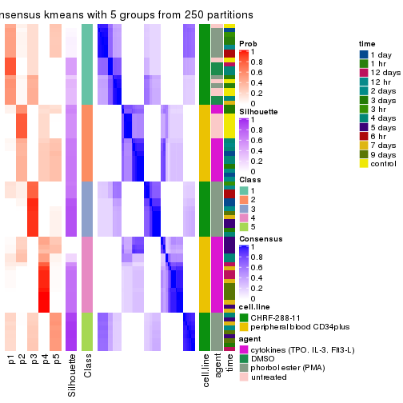</p>

</div>
<div id='tab-ATC-kmeans-consensus-heatmap-5'>
<pre><code class="r">consensus_heatmap(res, k = 6)
</code></pre>

<p></p>

</div>
</div>

Heatmaps for the membership of samples in all partitions to see how consistent they are:


<script>
$( function() {
	$( '#tabs-ATC-kmeans-membership-heatmap' ).tabs();
} );
</script>
<div id='tabs-ATC-kmeans-membership-heatmap'>
<ul>
<li><a href='#tab-ATC-kmeans-membership-heatmap-1'>k = 2</a></li>
<li><a href='#tab-ATC-kmeans-membership-heatmap-2'>k = 3</a></li>
<li><a href='#tab-ATC-kmeans-membership-heatmap-3'>k = 4</a></li>
<li><a href='#tab-ATC-kmeans-membership-heatmap-4'>k = 5</a></li>
<li><a href='#tab-ATC-kmeans-membership-heatmap-5'>k = 6</a></li>
</ul>
<div id='tab-ATC-kmeans-membership-heatmap-1'>
<pre><code class="r">membership_heatmap(res, k = 2)
</code></pre>

<p></p>

</div>
<div id='tab-ATC-kmeans-membership-heatmap-2'>
<pre><code class="r">membership_heatmap(res, k = 3)
</code></pre>

<p></p>

</div>
<div id='tab-ATC-kmeans-membership-heatmap-3'>
<pre><code class="r">membership_heatmap(res, k = 4)
</code></pre>

<p></p>

</div>
<div id='tab-ATC-kmeans-membership-heatmap-4'>
<pre><code class="r">membership_heatmap(res, k = 5)
</code></pre>

<p></p>

</div>
<div id='tab-ATC-kmeans-membership-heatmap-5'>
<pre><code class="r">membership_heatmap(res, k = 6)
</code></pre>

<p></p>

</div>
</div>

As soon as we have had the classes for columns, we can look for signatures
which are significantly different between classes which can be candidate marks
for certain classes. Following are the heatmaps for signatures.


Signature heatmaps where rows are scaled:


<script>
$( function() {
	$( '#tabs-ATC-kmeans-get-signatures' ).tabs();
} );
</script>
<div id='tabs-ATC-kmeans-get-signatures'>
<ul>
<li><a href='#tab-ATC-kmeans-get-signatures-1'>k = 2</a></li>
<li><a href='#tab-ATC-kmeans-get-signatures-2'>k = 3</a></li>
<li><a href='#tab-ATC-kmeans-get-signatures-3'>k = 4</a></li>
<li><a href='#tab-ATC-kmeans-get-signatures-4'>k = 5</a></li>
<li><a href='#tab-ATC-kmeans-get-signatures-5'>k = 6</a></li>
</ul>
<div id='tab-ATC-kmeans-get-signatures-1'>
<pre><code class="r">get_signatures(res, k = 2)
</code></pre>

<p></p>

</div>
<div id='tab-ATC-kmeans-get-signatures-2'>
<pre><code class="r">get_signatures(res, k = 3)
</code></pre>

<p></p>

</div>
<div id='tab-ATC-kmeans-get-signatures-3'>
<pre><code class="r">get_signatures(res, k = 4)
</code></pre>

<p></p>

</div>
<div id='tab-ATC-kmeans-get-signatures-4'>
<pre><code class="r">get_signatures(res, k = 5)
</code></pre>

<p></p>

</div>
<div id='tab-ATC-kmeans-get-signatures-5'>
<pre><code class="r">get_signatures(res, k = 6)
</code></pre>

<p></p>

</div>
</div>


Signature heatmaps where rows are not scaled:


<script>
$( function() {
	$( '#tabs-ATC-kmeans-get-signatures-no-scale' ).tabs();
} );
</script>
<div id='tabs-ATC-kmeans-get-signatures-no-scale'>
<ul>
<li><a href='#tab-ATC-kmeans-get-signatures-no-scale-1'>k = 2</a></li>
<li><a href='#tab-ATC-kmeans-get-signatures-no-scale-2'>k = 3</a></li>
<li><a href='#tab-ATC-kmeans-get-signatures-no-scale-3'>k = 4</a></li>
<li><a href='#tab-ATC-kmeans-get-signatures-no-scale-4'>k = 5</a></li>
<li><a href='#tab-ATC-kmeans-get-signatures-no-scale-5'>k = 6</a></li>
</ul>
<div id='tab-ATC-kmeans-get-signatures-no-scale-1'>
<pre><code class="r">get_signatures(res, k = 2, scale_rows = FALSE)
</code></pre>

<p></p>

</div>
<div id='tab-ATC-kmeans-get-signatures-no-scale-2'>
<pre><code class="r">get_signatures(res, k = 3, scale_rows = FALSE)
</code></pre>

<p></p>

</div>
<div id='tab-ATC-kmeans-get-signatures-no-scale-3'>
<pre><code class="r">get_signatures(res, k = 4, scale_rows = FALSE)
</code></pre>

<p></p>

</div>
<div id='tab-ATC-kmeans-get-signatures-no-scale-4'>
<pre><code class="r">get_signatures(res, k = 5, scale_rows = FALSE)
</code></pre>

<p></p>

</div>
<div id='tab-ATC-kmeans-get-signatures-no-scale-5'>
<pre><code class="r">get_signatures(res, k = 6, scale_rows = FALSE)
</code></pre>

<p></p>

</div>
</div>


Compare the overlap of signatures from different k:

```r
compare_signatures(res)
```


`get_signature()` returns a data frame invisibly. TO get the list of signatures, the function
call should be assigned to a variable explicitly. In following code, if `plot` argument is set
to `FALSE`, no heatmap is plotted while only the differential analysis is performed.

```r
# code only for demonstration
tb = get_signature(res, k = ..., plot = FALSE)
```

An example of the output of `tb` is:

```
#>   which_row         fdr    mean_1    mean_2 scaled_mean_1 scaled_mean_2 km
#> 1        38 0.042760348  8.373488  9.131774    -0.5533452     0.5164555  1
#> 2        40 0.018707592  7.106213  8.469186    -0.6173731     0.5762149  1
#> 3        55 0.019134737 10.221463 11.207825    -0.6159697     0.5749050  1
#> 4        59 0.006059896  5.921854  7.869574    -0.6899429     0.6439467  1
#> 5        60 0.018055526  8.928898 10.211722    -0.6204761     0.5791110  1
#> 6        98 0.009384629 15.714769 14.887706     0.6635654    -0.6193277  2
...
```

The columns in `tb` are:

1. `which_row`: row indices corresponding to the input matrix.
2. `fdr`: FDR for the differential test. 
3. `mean_x`: The mean value in group x.
4. `scaled_mean_x`: The mean value in group x after rows are scaled.
5. `km`: Row groups if k-means clustering is applied to rows.


UMAP plot which shows how samples are separated.


<script>
$( function() {
	$( '#tabs-ATC-kmeans-dimension-reduction' ).tabs();
} );
</script>
<div id='tabs-ATC-kmeans-dimension-reduction'>
<ul>
<li><a href='#tab-ATC-kmeans-dimension-reduction-1'>k = 2</a></li>
<li><a href='#tab-ATC-kmeans-dimension-reduction-2'>k = 3</a></li>
<li><a href='#tab-ATC-kmeans-dimension-reduction-3'>k = 4</a></li>
<li><a href='#tab-ATC-kmeans-dimension-reduction-4'>k = 5</a></li>
<li><a href='#tab-ATC-kmeans-dimension-reduction-5'>k = 6</a></li>
</ul>
<div id='tab-ATC-kmeans-dimension-reduction-1'>
<pre><code class="r">dimension_reduction(res, k = 2, method = &quot;UMAP&quot;)
</code></pre>

<p></p>

</div>
<div id='tab-ATC-kmeans-dimension-reduction-2'>
<pre><code class="r">dimension_reduction(res, k = 3, method = &quot;UMAP&quot;)
</code></pre>

<p></p>

</div>
<div id='tab-ATC-kmeans-dimension-reduction-3'>
<pre><code class="r">dimension_reduction(res, k = 4, method = &quot;UMAP&quot;)
</code></pre>

<p></p>

</div>
<div id='tab-ATC-kmeans-dimension-reduction-4'>
<pre><code class="r">dimension_reduction(res, k = 5, method = &quot;UMAP&quot;)
</code></pre>

<p></p>

</div>
<div id='tab-ATC-kmeans-dimension-reduction-5'>
<pre><code class="r">dimension_reduction(res, k = 6, method = &quot;UMAP&quot;)
</code></pre>

<p></p>

</div>
</div>


Following heatmap shows how subgroups are split when increasing `k`:

```r
collect_classes(res)
```


Test correlation between subgroups and known annotations. If the known
annotation is numeric, one-way ANOVA test is applied, and if the known
annotation is discrete, chi-squared contingency table test is applied.

```r
test_to_known_factors(res)
```

```
#>             n cell.line(p) agent(p)  time(p) k
#> ATC:kmeans 77     1.27e-17 3.00e-14 0.361151 2
#> ATC:kmeans 77     1.27e-17 3.00e-14 0.361151 3
#> ATC:kmeans 34     4.14e-08 9.78e-07 0.849639 4
#> ATC:kmeans 52     3.00e-11 3.29e-11 0.003835 5
#> ATC:kmeans 66     6.95e-13 4.96e-20 0.000119 6
```


If matrix rows can be associated to genes, consider to use `GO_Enrichment(res,
...)` to perform function enrichment for the signature genes.


 

---------------------------------------------------


### ATC:skmeans**


The object with results only for a single top-value method and a single partition method 
can be extracted as:

```r
res = res_list["ATC", "skmeans"]
# you can also extract it by
# res = res_list["ATC:skmeans"]
```

A summary of `res` and all the functions that can be applied to it:

```r
res
```

```
#> A 'ConsensusPartition' object with k = 2, 3, 4, 5, 6.
#>   On a matrix with 18792 rows and 77 columns.
#>   Top rows (1000, 2000, 3000, 4000, 5000) are extracted by 'ATC' method.
#>   Subgroups are detected by 'skmeans' method.
#>   Performed in total 1250 partitions by row resampling.
#>   Best k for subgroups seems to be 2.
#> 
#> Following methods can be applied to this 'ConsensusPartition' object:
#>  [1] "cola_report"             "collect_classes"         "collect_plots"          
#>  [4] "collect_stats"           "colnames"                "compare_signatures"     
#>  [7] "consensus_heatmap"       "dimension_reduction"     "functional_enrichment"  
#> [10] "get_anno_col"            "get_anno"                "get_classes"            
#> [13] "get_consensus"           "get_matrix"              "get_membership"         
#> [16] "get_param"               "get_signatures"          "get_stats"              
#> [19] "is_best_k"               "is_stable_k"             "membership_heatmap"     
#> [22] "ncol"                    "nrow"                    "plot_ecdf"              
#> [25] "rownames"                "select_partition_number" "show"                   
#> [28] "suggest_best_k"          "test_to_known_factors"
```

`collect_plots()` function collects all the plots made from `res` for all `k` (number of partitions)
into one single page to provide an easy and fast comparison between different `k`.

```r
collect_plots(res)
```


The plots are:

- The first row: a plot of the ECDF (Empirical cumulative distribution
  function) curves of the consensus matrix for each `k` and the heatmap of
  predicted classes for each `k`.
- The second row: heatmaps of the consensus matrix for each `k`.
- The third row: heatmaps of the membership matrix for each `k`.
- The fouth row: heatmaps of the signatures for each `k`.

All the plots in panels can be made by individual functions and they are
plotted later in this section.

`select_partition_number()` produces several plots showing different
statistics for choosing "optimized" `k`. There are following statistics:

- ECDF curves of the consensus matrix for each `k`;
- 1-PAC. [The PAC
  score](https://en.wikipedia.org/wiki/Consensus_clustering#Over-interpretation_potential_of_consensus_clustering)
  measures the proportion of the ambiguous subgrouping.
- Mean silhouette score.
- Concordance. The mean probability of fiting the consensus class ids in all
  partitions.
- Area increased. Denote $A_k$ as the area under the ECDF curve for current
  `k`, the area increased is defined as $A_k - A_{k-1}$.
- Rand index. The percent of pairs of samples that are both in a same cluster
  or both are not in a same cluster in the partition of k and k-1.
- Jaccard index. The ratio of pairs of samples are both in a same cluster in
  the partition of k and k-1 and the pairs of samples are both in a same
  cluster in the partition k or k-1.

The detailed explanations of these statistics can be found in [the cola
vignette](http://bioconductor.org/packages/devel/bioc/vignettes/cola/inst/doc/cola.html#toc_13).

Generally speaking, lower PAC score, higher mean silhouette score or higher
concordance corresponds to better partition. Rand index and Jaccard index
measure how similar the current partition is compared to partition with `k-1`.
If they are too similar, we won't accept `k` is better than `k-1`.

```r
select_partition_number(res)
```


The numeric values for all these statistics can be obtained by `get_stats()`.

```r
get_stats(res)
```

```
#>   k 1-PAC mean_silhouette concordance area_increased  Rand Jaccard
#> 2 2 1.000           1.000       1.000         0.5049 0.496   0.496
#> 3 3 0.747           0.933       0.919         0.2196 0.895   0.788
#> 4 4 0.805           0.880       0.919         0.2177 0.859   0.637
#> 5 5 0.803           0.766       0.806         0.0577 1.000   1.000
#> 6 6 0.798           0.701       0.774         0.0428 0.862   0.500
```

`suggest_best_k()` suggests the best $k$ based on these statistics. The rules are as follows:

- All $k$ with Jaccard index larger than 0.95 are removed because the increase of
  the partition number does not provides enough extra information. If all $k$ are removed,
  the best $k$ is assigned by `NA`.
- For $k$ with 1-PAC larger than 0.9, the maximal $k$ is taken as the "best k". Other $k$ is called "optional k".
- If it does not fit the second rule. The $k$ with the highest vote of highest
  1-PAC, mean silhouette and concordance is taken as the "best k".

```r
suggest_best_k(res)
```

```
#> [1] 2
```


Following shows the table of the partitions (You need to click the **show/hide
code output** link to see it). The membership matrix (columns with name `p*`)
is inferred by
[`clue::cl_consensus()`](https://www.rdocumentation.org/link/cl_consensus?package=clue)
function with the `SE` method. Basically the value in the membership matrix
represents the probability to belong to a certain group. The finall class
label for an item is determined with the group with highest probability it
belongs to.

In `get_classes()` function, the entropy is calculated from the membership
matrix and the silhouette score is calculated from the consensus matrix.


<script>
$( function() {
	$( '#tabs-ATC-skmeans-get-classes' ).tabs();
} );
</script>
<div id='tabs-ATC-skmeans-get-classes'>
<ul>
<li><a href='#tab-ATC-skmeans-get-classes-1'>k = 2</a></li>
<li><a href='#tab-ATC-skmeans-get-classes-2'>k = 3</a></li>
<li><a href='#tab-ATC-skmeans-get-classes-3'>k = 4</a></li>
<li><a href='#tab-ATC-skmeans-get-classes-4'>k = 5</a></li>
<li><a href='#tab-ATC-skmeans-get-classes-5'>k = 6</a></li>
</ul>

<div id='tab-ATC-skmeans-get-classes-1'>
<p><a id='tab-ATC-skmeans-get-classes-1-a' style='color:#0366d6' href='#'>show/hide code output</a></p>
<pre><code class="r">cbind(get_classes(res, k = 2), get_membership(res, k = 2))
</code></pre>

<pre><code>#&gt;          class entropy silhouette p1 p2
#&gt; GSM87962     1       0          1  1  0
#&gt; GSM87963     1       0          1  1  0
#&gt; GSM87983     1       0          1  1  0
#&gt; GSM87984     1       0          1  1  0
#&gt; GSM87961     1       0          1  1  0
#&gt; GSM87970     1       0          1  1  0
#&gt; GSM87971     1       0          1  1  0
#&gt; GSM87990     1       0          1  1  0
#&gt; GSM87991     1       0          1  1  0
#&gt; GSM87974     1       0          1  1  0
#&gt; GSM87994     1       0          1  1  0
#&gt; GSM87978     1       0          1  1  0
#&gt; GSM87979     1       0          1  1  0
#&gt; GSM87998     1       0          1  1  0
#&gt; GSM87999     1       0          1  1  0
#&gt; GSM87968     1       0          1  1  0
#&gt; GSM87987     1       0          1  1  0
#&gt; GSM87969     1       0          1  1  0
#&gt; GSM87988     1       0          1  1  0
#&gt; GSM87989     1       0          1  1  0
#&gt; GSM87972     1       0          1  1  0
#&gt; GSM87992     1       0          1  1  0
#&gt; GSM87973     1       0          1  1  0
#&gt; GSM87993     1       0          1  1  0
#&gt; GSM87975     1       0          1  1  0
#&gt; GSM87995     1       0          1  1  0
#&gt; GSM87976     1       0          1  1  0
#&gt; GSM87977     1       0          1  1  0
#&gt; GSM87996     1       0          1  1  0
#&gt; GSM87997     1       0          1  1  0
#&gt; GSM87980     1       0          1  1  0
#&gt; GSM88000     1       0          1  1  0
#&gt; GSM87981     1       0          1  1  0
#&gt; GSM87982     1       0          1  1  0
#&gt; GSM88001     1       0          1  1  0
#&gt; GSM87967     1       0          1  1  0
#&gt; GSM87964     1       0          1  1  0
#&gt; GSM87965     1       0          1  1  0
#&gt; GSM87966     1       0          1  1  0
#&gt; GSM87985     1       0          1  1  0
#&gt; GSM87986     1       0          1  1  0
#&gt; GSM88004     2       0          1  0  1
#&gt; GSM88015     2       0          1  0  1
#&gt; GSM88005     2       0          1  0  1
#&gt; GSM88006     2       0          1  0  1
#&gt; GSM88016     2       0          1  0  1
#&gt; GSM88007     2       0          1  0  1
#&gt; GSM88017     2       0          1  0  1
#&gt; GSM88029     2       0          1  0  1
#&gt; GSM88008     2       0          1  0  1
#&gt; GSM88009     2       0          1  0  1
#&gt; GSM88018     2       0          1  0  1
#&gt; GSM88024     2       0          1  0  1
#&gt; GSM88030     2       0          1  0  1
#&gt; GSM88036     2       0          1  0  1
#&gt; GSM88010     2       0          1  0  1
#&gt; GSM88011     2       0          1  0  1
#&gt; GSM88019     2       0          1  0  1
#&gt; GSM88027     2       0          1  0  1
#&gt; GSM88031     2       0          1  0  1
#&gt; GSM88012     2       0          1  0  1
#&gt; GSM88020     2       0          1  0  1
#&gt; GSM88032     2       0          1  0  1
#&gt; GSM88037     2       0          1  0  1
#&gt; GSM88013     2       0          1  0  1
#&gt; GSM88021     2       0          1  0  1
#&gt; GSM88025     2       0          1  0  1
#&gt; GSM88033     2       0          1  0  1
#&gt; GSM88014     2       0          1  0  1
#&gt; GSM88022     2       0          1  0  1
#&gt; GSM88034     2       0          1  0  1
#&gt; GSM88002     2       0          1  0  1
#&gt; GSM88003     2       0          1  0  1
#&gt; GSM88023     2       0          1  0  1
#&gt; GSM88026     2       0          1  0  1
#&gt; GSM88028     2       0          1  0  1
#&gt; GSM88035     2       0          1  0  1
</code></pre>

<script>
$('#tab-ATC-skmeans-get-classes-1-a').parent().next().next().hide();
$('#tab-ATC-skmeans-get-classes-1-a').click(function(){
  $('#tab-ATC-skmeans-get-classes-1-a').parent().next().next().toggle();
  return(false);
});
</script>
</div>

<div id='tab-ATC-skmeans-get-classes-2'>
<p><a id='tab-ATC-skmeans-get-classes-2-a' style='color:#0366d6' href='#'>show/hide code output</a></p>
<pre><code class="r">cbind(get_classes(res, k = 3), get_membership(res, k = 3))
</code></pre>

<pre><code>#&gt;          class entropy silhouette    p1    p2    p3
#&gt; GSM87962     1  0.0000      0.951 1.000 0.000 0.000
#&gt; GSM87963     1  0.0000      0.951 1.000 0.000 0.000
#&gt; GSM87983     1  0.0000      0.951 1.000 0.000 0.000
#&gt; GSM87984     1  0.0000      0.951 1.000 0.000 0.000
#&gt; GSM87961     1  0.0000      0.951 1.000 0.000 0.000
#&gt; GSM87970     1  0.0000      0.951 1.000 0.000 0.000
#&gt; GSM87971     1  0.0000      0.951 1.000 0.000 0.000
#&gt; GSM87990     1  0.0000      0.951 1.000 0.000 0.000
#&gt; GSM87991     1  0.0000      0.951 1.000 0.000 0.000
#&gt; GSM87974     1  0.0000      0.951 1.000 0.000 0.000
#&gt; GSM87994     1  0.0000      0.951 1.000 0.000 0.000
#&gt; GSM87978     1  0.0000      0.951 1.000 0.000 0.000
#&gt; GSM87979     1  0.0000      0.951 1.000 0.000 0.000
#&gt; GSM87998     1  0.0592      0.951 0.988 0.000 0.012
#&gt; GSM87999     1  0.0592      0.951 0.988 0.000 0.012
#&gt; GSM87968     1  0.0000      0.951 1.000 0.000 0.000
#&gt; GSM87987     1  0.0592      0.951 0.988 0.000 0.012
#&gt; GSM87969     1  0.0000      0.951 1.000 0.000 0.000
#&gt; GSM87988     1  0.3340      0.939 0.880 0.000 0.120
#&gt; GSM87989     1  0.3340      0.939 0.880 0.000 0.120
#&gt; GSM87972     1  0.3340      0.939 0.880 0.000 0.120
#&gt; GSM87992     1  0.3340      0.939 0.880 0.000 0.120
#&gt; GSM87973     1  0.3340      0.939 0.880 0.000 0.120
#&gt; GSM87993     1  0.3340      0.939 0.880 0.000 0.120
#&gt; GSM87975     1  0.3340      0.939 0.880 0.000 0.120
#&gt; GSM87995     1  0.3340      0.939 0.880 0.000 0.120
#&gt; GSM87976     1  0.3340      0.939 0.880 0.000 0.120
#&gt; GSM87977     1  0.3340      0.939 0.880 0.000 0.120
#&gt; GSM87996     1  0.3340      0.939 0.880 0.000 0.120
#&gt; GSM87997     1  0.3340      0.939 0.880 0.000 0.120
#&gt; GSM87980     1  0.3340      0.939 0.880 0.000 0.120
#&gt; GSM88000     1  0.3340      0.939 0.880 0.000 0.120
#&gt; GSM87981     1  0.3340      0.939 0.880 0.000 0.120
#&gt; GSM87982     1  0.3340      0.939 0.880 0.000 0.120
#&gt; GSM88001     1  0.3340      0.939 0.880 0.000 0.120
#&gt; GSM87967     1  0.3340      0.939 0.880 0.000 0.120
#&gt; GSM87964     1  0.0000      0.951 1.000 0.000 0.000
#&gt; GSM87965     1  0.0000      0.951 1.000 0.000 0.000
#&gt; GSM87966     1  0.0000      0.951 1.000 0.000 0.000
#&gt; GSM87985     1  0.0000      0.951 1.000 0.000 0.000
#&gt; GSM87986     1  0.0000      0.951 1.000 0.000 0.000
#&gt; GSM88004     2  0.0000      0.944 0.000 1.000 0.000
#&gt; GSM88015     2  0.0000      0.944 0.000 1.000 0.000
#&gt; GSM88005     2  0.0000      0.944 0.000 1.000 0.000
#&gt; GSM88006     2  0.0000      0.944 0.000 1.000 0.000
#&gt; GSM88016     2  0.0000      0.944 0.000 1.000 0.000
#&gt; GSM88007     2  0.0000      0.944 0.000 1.000 0.000
#&gt; GSM88017     2  0.0000      0.944 0.000 1.000 0.000
#&gt; GSM88029     2  0.0000      0.944 0.000 1.000 0.000
#&gt; GSM88008     2  0.0000      0.944 0.000 1.000 0.000
#&gt; GSM88009     2  0.0000      0.944 0.000 1.000 0.000
#&gt; GSM88018     2  0.0000      0.944 0.000 1.000 0.000
#&gt; GSM88024     2  0.0000      0.944 0.000 1.000 0.000
#&gt; GSM88030     3  0.4702      0.884 0.000 0.212 0.788
#&gt; GSM88036     3  0.4702      0.884 0.000 0.212 0.788
#&gt; GSM88010     2  0.5591      0.540 0.000 0.696 0.304
#&gt; GSM88011     2  0.5591      0.540 0.000 0.696 0.304
#&gt; GSM88019     2  0.5529      0.556 0.000 0.704 0.296
#&gt; GSM88027     2  0.2878      0.852 0.000 0.904 0.096
#&gt; GSM88031     3  0.3340      0.982 0.000 0.120 0.880
#&gt; GSM88012     3  0.3340      0.982 0.000 0.120 0.880
#&gt; GSM88020     3  0.3340      0.982 0.000 0.120 0.880
#&gt; GSM88032     3  0.3340      0.982 0.000 0.120 0.880
#&gt; GSM88037     3  0.3340      0.982 0.000 0.120 0.880
#&gt; GSM88013     3  0.3340      0.982 0.000 0.120 0.880
#&gt; GSM88021     3  0.3340      0.982 0.000 0.120 0.880
#&gt; GSM88025     3  0.3340      0.982 0.000 0.120 0.880
#&gt; GSM88033     3  0.3340      0.982 0.000 0.120 0.880
#&gt; GSM88014     3  0.3340      0.982 0.000 0.120 0.880
#&gt; GSM88022     3  0.3340      0.982 0.000 0.120 0.880
#&gt; GSM88034     3  0.3340      0.982 0.000 0.120 0.880
#&gt; GSM88002     2  0.0000      0.944 0.000 1.000 0.000
#&gt; GSM88003     2  0.0000      0.944 0.000 1.000 0.000
#&gt; GSM88023     2  0.0000      0.944 0.000 1.000 0.000
#&gt; GSM88026     2  0.0000      0.944 0.000 1.000 0.000
#&gt; GSM88028     2  0.0000      0.944 0.000 1.000 0.000
#&gt; GSM88035     2  0.0000      0.944 0.000 1.000 0.000
</code></pre>

<script>
$('#tab-ATC-skmeans-get-classes-2-a').parent().next().next().hide();
$('#tab-ATC-skmeans-get-classes-2-a').click(function(){
  $('#tab-ATC-skmeans-get-classes-2-a').parent().next().next().toggle();
  return(false);
});
</script>
</div>

<div id='tab-ATC-skmeans-get-classes-3'>
<p><a id='tab-ATC-skmeans-get-classes-3-a' style='color:#0366d6' href='#'>show/hide code output</a></p>
<pre><code class="r">cbind(get_classes(res, k = 4), get_membership(res, k = 4))
</code></pre>

<pre><code>#&gt;          class entropy silhouette    p1    p2    p3    p4
#&gt; GSM87962     1  0.1661      0.884 0.944 0.000 0.052 0.004
#&gt; GSM87963     1  0.1743      0.883 0.940 0.000 0.056 0.004
#&gt; GSM87983     1  0.0000      0.879 1.000 0.000 0.000 0.000
#&gt; GSM87984     1  0.0000      0.879 1.000 0.000 0.000 0.000
#&gt; GSM87961     1  0.1743      0.883 0.940 0.000 0.056 0.004
#&gt; GSM87970     1  0.3972      0.828 0.788 0.000 0.204 0.008
#&gt; GSM87971     1  0.3972      0.828 0.788 0.000 0.204 0.008
#&gt; GSM87990     1  0.0000      0.879 1.000 0.000 0.000 0.000
#&gt; GSM87991     1  0.0000      0.879 1.000 0.000 0.000 0.000
#&gt; GSM87974     1  0.3972      0.828 0.788 0.000 0.204 0.008
#&gt; GSM87994     1  0.0000      0.879 1.000 0.000 0.000 0.000
#&gt; GSM87978     1  0.3972      0.828 0.788 0.000 0.204 0.008
#&gt; GSM87979     1  0.3972      0.828 0.788 0.000 0.204 0.008
#&gt; GSM87998     1  0.2011      0.820 0.920 0.000 0.080 0.000
#&gt; GSM87999     1  0.2149      0.811 0.912 0.000 0.088 0.000
#&gt; GSM87968     1  0.3972      0.828 0.788 0.000 0.204 0.008
#&gt; GSM87987     1  0.1867      0.828 0.928 0.000 0.072 0.000
#&gt; GSM87969     1  0.3972      0.828 0.788 0.000 0.204 0.008
#&gt; GSM87988     3  0.3907      0.860 0.232 0.000 0.768 0.000
#&gt; GSM87989     3  0.3907      0.860 0.232 0.000 0.768 0.000
#&gt; GSM87972     3  0.0817      0.865 0.024 0.000 0.976 0.000
#&gt; GSM87992     3  0.3907      0.860 0.232 0.000 0.768 0.000
#&gt; GSM87973     3  0.0817      0.865 0.024 0.000 0.976 0.000
#&gt; GSM87993     3  0.3907      0.860 0.232 0.000 0.768 0.000
#&gt; GSM87975     3  0.0817      0.865 0.024 0.000 0.976 0.000
#&gt; GSM87995     3  0.3907      0.860 0.232 0.000 0.768 0.000
#&gt; GSM87976     3  0.0817      0.865 0.024 0.000 0.976 0.000
#&gt; GSM87977     3  0.0817      0.865 0.024 0.000 0.976 0.000
#&gt; GSM87996     3  0.3907      0.860 0.232 0.000 0.768 0.000
#&gt; GSM87997     3  0.3907      0.860 0.232 0.000 0.768 0.000
#&gt; GSM87980     3  0.0817      0.865 0.024 0.000 0.976 0.000
#&gt; GSM88000     3  0.3907      0.860 0.232 0.000 0.768 0.000
#&gt; GSM87981     3  0.0817      0.865 0.024 0.000 0.976 0.000
#&gt; GSM87982     3  0.0817      0.865 0.024 0.000 0.976 0.000
#&gt; GSM88001     3  0.3907      0.860 0.232 0.000 0.768 0.000
#&gt; GSM87967     3  0.0817      0.865 0.024 0.000 0.976 0.000
#&gt; GSM87964     1  0.3972      0.828 0.788 0.000 0.204 0.008
#&gt; GSM87965     1  0.1661      0.884 0.944 0.000 0.052 0.004
#&gt; GSM87966     1  0.0000      0.879 1.000 0.000 0.000 0.000
#&gt; GSM87985     1  0.0000      0.879 1.000 0.000 0.000 0.000
#&gt; GSM87986     1  0.0000      0.879 1.000 0.000 0.000 0.000
#&gt; GSM88004     2  0.0000      0.936 0.000 1.000 0.000 0.000
#&gt; GSM88015     2  0.0000      0.936 0.000 1.000 0.000 0.000
#&gt; GSM88005     2  0.0000      0.936 0.000 1.000 0.000 0.000
#&gt; GSM88006     2  0.0000      0.936 0.000 1.000 0.000 0.000
#&gt; GSM88016     2  0.0000      0.936 0.000 1.000 0.000 0.000
#&gt; GSM88007     2  0.0000      0.936 0.000 1.000 0.000 0.000
#&gt; GSM88017     2  0.0817      0.935 0.000 0.976 0.024 0.000
#&gt; GSM88029     2  0.0817      0.935 0.000 0.976 0.024 0.000
#&gt; GSM88008     2  0.0000      0.936 0.000 1.000 0.000 0.000
#&gt; GSM88009     2  0.0000      0.936 0.000 1.000 0.000 0.000
#&gt; GSM88018     2  0.0000      0.936 0.000 1.000 0.000 0.000
#&gt; GSM88024     2  0.0592      0.936 0.000 0.984 0.016 0.000
#&gt; GSM88030     4  0.4050      0.790 0.000 0.168 0.024 0.808
#&gt; GSM88036     4  0.4050      0.790 0.000 0.168 0.024 0.808
#&gt; GSM88010     2  0.4522      0.575 0.000 0.680 0.000 0.320
#&gt; GSM88011     2  0.4585      0.552 0.000 0.668 0.000 0.332
#&gt; GSM88019     2  0.4477      0.589 0.000 0.688 0.000 0.312
#&gt; GSM88027     2  0.2647      0.837 0.000 0.880 0.000 0.120
#&gt; GSM88031     4  0.0336      0.970 0.000 0.008 0.000 0.992
#&gt; GSM88012     4  0.0336      0.970 0.000 0.008 0.000 0.992
#&gt; GSM88020     4  0.0336      0.970 0.000 0.008 0.000 0.992
#&gt; GSM88032     4  0.0336      0.970 0.000 0.008 0.000 0.992
#&gt; GSM88037     4  0.0336      0.970 0.000 0.008 0.000 0.992
#&gt; GSM88013     4  0.0336      0.970 0.000 0.008 0.000 0.992
#&gt; GSM88021     4  0.0336      0.970 0.000 0.008 0.000 0.992
#&gt; GSM88025     4  0.0336      0.970 0.000 0.008 0.000 0.992
#&gt; GSM88033     4  0.0336      0.970 0.000 0.008 0.000 0.992
#&gt; GSM88014     4  0.0336      0.970 0.000 0.008 0.000 0.992
#&gt; GSM88022     4  0.0336      0.970 0.000 0.008 0.000 0.992
#&gt; GSM88034     4  0.0336      0.970 0.000 0.008 0.000 0.992
#&gt; GSM88002     2  0.0817      0.935 0.000 0.976 0.024 0.000
#&gt; GSM88003     2  0.0817      0.935 0.000 0.976 0.024 0.000
#&gt; GSM88023     2  0.0817      0.935 0.000 0.976 0.024 0.000
#&gt; GSM88026     2  0.0817      0.935 0.000 0.976 0.024 0.000
#&gt; GSM88028     2  0.0817      0.935 0.000 0.976 0.024 0.000
#&gt; GSM88035     2  0.0817      0.935 0.000 0.976 0.024 0.000
</code></pre>

<script>
$('#tab-ATC-skmeans-get-classes-3-a').parent().next().next().hide();
$('#tab-ATC-skmeans-get-classes-3-a').click(function(){
  $('#tab-ATC-skmeans-get-classes-3-a').parent().next().next().toggle();
  return(false);
});
</script>
</div>

<div id='tab-ATC-skmeans-get-classes-4'>
<p><a id='tab-ATC-skmeans-get-classes-4-a' style='color:#0366d6' href='#'>show/hide code output</a></p>
<pre><code class="r">cbind(get_classes(res, k = 5), get_membership(res, k = 5))
</code></pre>

<pre><code>#&gt;          class entropy silhouette    p1    p2    p3    p4 p5
#&gt; GSM87962     1  0.1697      0.786 0.932 0.000 0.008 0.000 NA
#&gt; GSM87963     1  0.1697      0.786 0.932 0.000 0.008 0.000 NA
#&gt; GSM87983     1  0.0162      0.782 0.996 0.000 0.004 0.000 NA
#&gt; GSM87984     1  0.0000      0.783 1.000 0.000 0.000 0.000 NA
#&gt; GSM87961     1  0.1697      0.786 0.932 0.000 0.008 0.000 NA
#&gt; GSM87970     1  0.5381      0.665 0.516 0.000 0.056 0.000 NA
#&gt; GSM87971     1  0.5393      0.660 0.504 0.000 0.056 0.000 NA
#&gt; GSM87990     1  0.0162      0.784 0.996 0.000 0.000 0.000 NA
#&gt; GSM87991     1  0.1608      0.747 0.928 0.000 0.072 0.000 NA
#&gt; GSM87974     1  0.5393      0.660 0.504 0.000 0.056 0.000 NA
#&gt; GSM87994     1  0.2280      0.717 0.880 0.000 0.120 0.000 NA
#&gt; GSM87978     1  0.5393      0.660 0.504 0.000 0.056 0.000 NA
#&gt; GSM87979     1  0.5414      0.670 0.528 0.000 0.060 0.000 NA
#&gt; GSM87998     1  0.3143      0.644 0.796 0.000 0.204 0.000 NA
#&gt; GSM87999     1  0.3242      0.630 0.784 0.000 0.216 0.000 NA
#&gt; GSM87968     1  0.5443      0.658 0.504 0.000 0.060 0.000 NA
#&gt; GSM87987     1  0.3242      0.636 0.784 0.000 0.216 0.000 NA
#&gt; GSM87969     1  0.5474      0.683 0.576 0.000 0.076 0.000 NA
#&gt; GSM87988     3  0.2732      0.810 0.160 0.000 0.840 0.000 NA
#&gt; GSM87989     3  0.2648      0.818 0.152 0.000 0.848 0.000 NA
#&gt; GSM87972     3  0.2471      0.843 0.000 0.000 0.864 0.000 NA
#&gt; GSM87992     3  0.2179      0.850 0.112 0.000 0.888 0.000 NA
#&gt; GSM87973     3  0.2280      0.849 0.000 0.000 0.880 0.000 NA
#&gt; GSM87993     3  0.2179      0.850 0.112 0.000 0.888 0.000 NA
#&gt; GSM87975     3  0.3561      0.757 0.000 0.000 0.740 0.000 NA
#&gt; GSM87995     3  0.2179      0.850 0.112 0.000 0.888 0.000 NA
#&gt; GSM87976     3  0.3612      0.750 0.000 0.000 0.732 0.000 NA
#&gt; GSM87977     3  0.2471      0.843 0.000 0.000 0.864 0.000 NA
#&gt; GSM87996     3  0.2179      0.850 0.112 0.000 0.888 0.000 NA
#&gt; GSM87997     3  0.2179      0.850 0.112 0.000 0.888 0.000 NA
#&gt; GSM87980     3  0.2561      0.840 0.000 0.000 0.856 0.000 NA
#&gt; GSM88000     3  0.2179      0.850 0.112 0.000 0.888 0.000 NA
#&gt; GSM87981     3  0.2377      0.846 0.000 0.000 0.872 0.000 NA
#&gt; GSM87982     3  0.2439      0.850 0.004 0.000 0.876 0.000 NA
#&gt; GSM88001     3  0.2179      0.850 0.112 0.000 0.888 0.000 NA
#&gt; GSM87967     3  0.2439      0.850 0.004 0.000 0.876 0.000 NA
#&gt; GSM87964     1  0.5393      0.660 0.504 0.000 0.056 0.000 NA
#&gt; GSM87965     1  0.1697      0.786 0.932 0.000 0.008 0.000 NA
#&gt; GSM87966     1  0.0162      0.782 0.996 0.000 0.004 0.000 NA
#&gt; GSM87985     1  0.0000      0.783 1.000 0.000 0.000 0.000 NA
#&gt; GSM87986     1  0.0162      0.782 0.996 0.000 0.004 0.000 NA
#&gt; GSM88004     2  0.0000      0.789 0.000 1.000 0.000 0.000 NA
#&gt; GSM88015     2  0.0000      0.789 0.000 1.000 0.000 0.000 NA
#&gt; GSM88005     2  0.0000      0.789 0.000 1.000 0.000 0.000 NA
#&gt; GSM88006     2  0.0000      0.789 0.000 1.000 0.000 0.000 NA
#&gt; GSM88016     2  0.0000      0.789 0.000 1.000 0.000 0.000 NA
#&gt; GSM88007     2  0.0000      0.789 0.000 1.000 0.000 0.000 NA
#&gt; GSM88017     2  0.4192      0.711 0.000 0.596 0.000 0.000 NA
#&gt; GSM88029     2  0.4210      0.709 0.000 0.588 0.000 0.000 NA
#&gt; GSM88008     2  0.0000      0.789 0.000 1.000 0.000 0.000 NA
#&gt; GSM88009     2  0.0000      0.789 0.000 1.000 0.000 0.000 NA
#&gt; GSM88018     2  0.0000      0.789 0.000 1.000 0.000 0.000 NA
#&gt; GSM88024     2  0.3452      0.752 0.000 0.756 0.000 0.000 NA
#&gt; GSM88030     4  0.5896      0.267 0.000 0.100 0.000 0.452 NA
#&gt; GSM88036     4  0.5896      0.267 0.000 0.100 0.000 0.452 NA
#&gt; GSM88010     2  0.3942      0.553 0.000 0.728 0.000 0.260 NA
#&gt; GSM88011     2  0.3662      0.565 0.000 0.744 0.000 0.252 NA
#&gt; GSM88019     2  0.3395      0.586 0.000 0.764 0.000 0.236 NA
#&gt; GSM88027     2  0.1851      0.730 0.000 0.912 0.000 0.088 NA
#&gt; GSM88031     4  0.0000      0.914 0.000 0.000 0.000 1.000 NA
#&gt; GSM88012     4  0.0404      0.910 0.000 0.000 0.000 0.988 NA
#&gt; GSM88020     4  0.0609      0.906 0.000 0.000 0.000 0.980 NA
#&gt; GSM88032     4  0.0000      0.914 0.000 0.000 0.000 1.000 NA
#&gt; GSM88037     4  0.0000      0.914 0.000 0.000 0.000 1.000 NA
#&gt; GSM88013     4  0.0162      0.914 0.000 0.000 0.000 0.996 NA
#&gt; GSM88021     4  0.0000      0.914 0.000 0.000 0.000 1.000 NA
#&gt; GSM88025     4  0.0000      0.914 0.000 0.000 0.000 1.000 NA
#&gt; GSM88033     4  0.0000      0.914 0.000 0.000 0.000 1.000 NA
#&gt; GSM88014     4  0.0162      0.914 0.000 0.000 0.000 0.996 NA
#&gt; GSM88022     4  0.0162      0.914 0.000 0.000 0.000 0.996 NA
#&gt; GSM88034     4  0.0609      0.906 0.000 0.000 0.000 0.980 NA
#&gt; GSM88002     2  0.4235      0.704 0.000 0.576 0.000 0.000 NA
#&gt; GSM88003     2  0.4235      0.704 0.000 0.576 0.000 0.000 NA
#&gt; GSM88023     2  0.4235      0.704 0.000 0.576 0.000 0.000 NA
#&gt; GSM88026     2  0.4235      0.704 0.000 0.576 0.000 0.000 NA
#&gt; GSM88028     2  0.4235      0.704 0.000 0.576 0.000 0.000 NA
#&gt; GSM88035     2  0.4235      0.704 0.000 0.576 0.000 0.000 NA
</code></pre>

<script>
$('#tab-ATC-skmeans-get-classes-4-a').parent().next().next().hide();
$('#tab-ATC-skmeans-get-classes-4-a').click(function(){
  $('#tab-ATC-skmeans-get-classes-4-a').parent().next().next().toggle();
  return(false);
});
</script>
</div>

<div id='tab-ATC-skmeans-get-classes-5'>
<p><a id='tab-ATC-skmeans-get-classes-5-a' style='color:#0366d6' href='#'>show/hide code output</a></p>
<pre><code class="r">cbind(get_classes(res, k = 6), get_membership(res, k = 6))
</code></pre>

<pre><code>#&gt;          class entropy silhouette    p1    p2    p3    p4    p5    p6
#&gt; GSM87962     1  0.0790     0.7932 0.968 0.000 0.000 0.000 0.000 0.032
#&gt; GSM87963     1  0.0790     0.7932 0.968 0.000 0.000 0.000 0.000 0.032
#&gt; GSM87983     1  0.1610     0.8680 0.916 0.000 0.084 0.000 0.000 0.000
#&gt; GSM87984     1  0.1610     0.8680 0.916 0.000 0.084 0.000 0.000 0.000
#&gt; GSM87961     1  0.0790     0.7932 0.968 0.000 0.000 0.000 0.000 0.032
#&gt; GSM87970     6  0.3861     0.6748 0.352 0.000 0.000 0.000 0.008 0.640
#&gt; GSM87971     6  0.3725     0.7060 0.316 0.000 0.000 0.000 0.008 0.676
#&gt; GSM87990     1  0.1753     0.8670 0.912 0.000 0.084 0.000 0.000 0.004
#&gt; GSM87991     1  0.2631     0.7698 0.820 0.000 0.180 0.000 0.000 0.000
#&gt; GSM87974     6  0.3707     0.7011 0.312 0.000 0.000 0.000 0.008 0.680
#&gt; GSM87994     1  0.3930     0.3942 0.576 0.000 0.420 0.000 0.000 0.004
#&gt; GSM87978     6  0.3619     0.7069 0.316 0.000 0.000 0.000 0.004 0.680
#&gt; GSM87979     6  0.3782     0.6714 0.360 0.000 0.000 0.000 0.004 0.636
#&gt; GSM87998     3  0.4158    -0.0233 0.416 0.000 0.572 0.000 0.004 0.008
#&gt; GSM87999     3  0.4158    -0.0233 0.416 0.000 0.572 0.000 0.004 0.008
#&gt; GSM87968     6  0.3619     0.7069 0.316 0.000 0.000 0.000 0.004 0.680
#&gt; GSM87987     3  0.4394    -0.0212 0.408 0.000 0.568 0.000 0.004 0.020
#&gt; GSM87969     6  0.4576     0.5797 0.412 0.000 0.024 0.000 0.008 0.556
#&gt; GSM87988     3  0.1757     0.6426 0.076 0.000 0.916 0.000 0.000 0.008
#&gt; GSM87989     3  0.1524     0.6537 0.060 0.000 0.932 0.000 0.000 0.008
#&gt; GSM87972     3  0.5853     0.4757 0.008 0.000 0.520 0.000 0.184 0.288
#&gt; GSM87992     3  0.0260     0.6835 0.008 0.000 0.992 0.000 0.000 0.000
#&gt; GSM87973     3  0.5689     0.5092 0.008 0.000 0.560 0.000 0.180 0.252
#&gt; GSM87993     3  0.0260     0.6835 0.008 0.000 0.992 0.000 0.000 0.000
#&gt; GSM87975     6  0.5870    -0.1782 0.000 0.000 0.276 0.000 0.244 0.480
#&gt; GSM87995     3  0.0260     0.6835 0.008 0.000 0.992 0.000 0.000 0.000
#&gt; GSM87976     6  0.5858    -0.1708 0.000 0.000 0.272 0.000 0.244 0.484
#&gt; GSM87977     3  0.5839     0.4735 0.008 0.000 0.524 0.000 0.184 0.284
#&gt; GSM87996     3  0.0260     0.6835 0.008 0.000 0.992 0.000 0.000 0.000
#&gt; GSM87997     3  0.0260     0.6835 0.008 0.000 0.992 0.000 0.000 0.000
#&gt; GSM87980     3  0.5982     0.3614 0.000 0.000 0.428 0.000 0.240 0.332
#&gt; GSM88000     3  0.0260     0.6835 0.008 0.000 0.992 0.000 0.000 0.000
#&gt; GSM87981     3  0.5680     0.4961 0.004 0.000 0.544 0.000 0.184 0.268
#&gt; GSM87982     3  0.5587     0.5107 0.004 0.000 0.564 0.000 0.180 0.252
#&gt; GSM88001     3  0.0260     0.6835 0.008 0.000 0.992 0.000 0.000 0.000
#&gt; GSM87967     3  0.5671     0.5116 0.008 0.000 0.564 0.000 0.180 0.248
#&gt; GSM87964     6  0.4745     0.6228 0.268 0.000 0.000 0.000 0.088 0.644
#&gt; GSM87965     1  0.0790     0.7932 0.968 0.000 0.000 0.000 0.000 0.032
#&gt; GSM87966     1  0.1814     0.8562 0.900 0.000 0.100 0.000 0.000 0.000
#&gt; GSM87985     1  0.1610     0.8680 0.916 0.000 0.084 0.000 0.000 0.000
#&gt; GSM87986     1  0.1610     0.8680 0.916 0.000 0.084 0.000 0.000 0.000
#&gt; GSM88004     2  0.0146     0.8581 0.000 0.996 0.000 0.000 0.004 0.000
#&gt; GSM88015     2  0.0405     0.8539 0.000 0.988 0.000 0.000 0.008 0.004
#&gt; GSM88005     2  0.0146     0.8581 0.000 0.996 0.000 0.000 0.004 0.000
#&gt; GSM88006     2  0.0146     0.8581 0.000 0.996 0.000 0.000 0.004 0.000
#&gt; GSM88016     2  0.0405     0.8539 0.000 0.988 0.000 0.000 0.008 0.004
#&gt; GSM88007     2  0.0146     0.8581 0.000 0.996 0.000 0.000 0.004 0.000
#&gt; GSM88017     5  0.4246     0.7475 0.000 0.400 0.000 0.000 0.580 0.020
#&gt; GSM88029     5  0.4209     0.7721 0.000 0.384 0.000 0.000 0.596 0.020
#&gt; GSM88008     2  0.0146     0.8581 0.000 0.996 0.000 0.000 0.004 0.000
#&gt; GSM88009     2  0.0146     0.8581 0.000 0.996 0.000 0.000 0.004 0.000
#&gt; GSM88018     2  0.0717     0.8478 0.000 0.976 0.000 0.000 0.016 0.008
#&gt; GSM88024     2  0.4049    -0.0150 0.000 0.648 0.000 0.000 0.332 0.020
#&gt; GSM88030     5  0.4904     0.5844 0.000 0.068 0.000 0.248 0.664 0.020
#&gt; GSM88036     5  0.4904     0.5844 0.000 0.068 0.000 0.248 0.664 0.020
#&gt; GSM88010     2  0.3973     0.6223 0.000 0.728 0.000 0.232 0.036 0.004
#&gt; GSM88011     2  0.3488     0.6583 0.000 0.764 0.000 0.216 0.016 0.004
#&gt; GSM88019     2  0.3158     0.7182 0.000 0.812 0.000 0.164 0.020 0.004
#&gt; GSM88027     2  0.2069     0.8068 0.000 0.908 0.000 0.068 0.020 0.004
#&gt; GSM88031     4  0.0000     0.9855 0.000 0.000 0.000 1.000 0.000 0.000
#&gt; GSM88012     4  0.0858     0.9739 0.000 0.000 0.000 0.968 0.028 0.004
#&gt; GSM88020     4  0.1168     0.9605 0.000 0.000 0.000 0.956 0.028 0.016
#&gt; GSM88032     4  0.0000     0.9855 0.000 0.000 0.000 1.000 0.000 0.000
#&gt; GSM88037     4  0.0000     0.9855 0.000 0.000 0.000 1.000 0.000 0.000
#&gt; GSM88013     4  0.0603     0.9806 0.000 0.000 0.000 0.980 0.016 0.004
#&gt; GSM88021     4  0.0000     0.9855 0.000 0.000 0.000 1.000 0.000 0.000
#&gt; GSM88025     4  0.0000     0.9855 0.000 0.000 0.000 1.000 0.000 0.000
#&gt; GSM88033     4  0.0000     0.9855 0.000 0.000 0.000 1.000 0.000 0.000
#&gt; GSM88014     4  0.0603     0.9806 0.000 0.000 0.000 0.980 0.016 0.004
#&gt; GSM88022     4  0.0603     0.9806 0.000 0.000 0.000 0.980 0.016 0.004
#&gt; GSM88034     4  0.1168     0.9605 0.000 0.000 0.000 0.956 0.028 0.016
#&gt; GSM88002     5  0.3547     0.8530 0.000 0.332 0.000 0.000 0.668 0.000
#&gt; GSM88003     5  0.3547     0.8530 0.000 0.332 0.000 0.000 0.668 0.000
#&gt; GSM88023     5  0.3547     0.8530 0.000 0.332 0.000 0.000 0.668 0.000
#&gt; GSM88026     5  0.3547     0.8530 0.000 0.332 0.000 0.000 0.668 0.000
#&gt; GSM88028     5  0.3547     0.8530 0.000 0.332 0.000 0.000 0.668 0.000
#&gt; GSM88035     5  0.3547     0.8530 0.000 0.332 0.000 0.000 0.668 0.000
</code></pre>

<script>
$('#tab-ATC-skmeans-get-classes-5-a').parent().next().next().hide();
$('#tab-ATC-skmeans-get-classes-5-a').click(function(){
  $('#tab-ATC-skmeans-get-classes-5-a').parent().next().next().toggle();
  return(false);
});
</script>
</div>
</div>

Heatmaps for the consensus matrix. It visualizes the probability of two
samples to be in a same group.


<script>
$( function() {
	$( '#tabs-ATC-skmeans-consensus-heatmap' ).tabs();
} );
</script>
<div id='tabs-ATC-skmeans-consensus-heatmap'>
<ul>
<li><a href='#tab-ATC-skmeans-consensus-heatmap-1'>k = 2</a></li>
<li><a href='#tab-ATC-skmeans-consensus-heatmap-2'>k = 3</a></li>
<li><a href='#tab-ATC-skmeans-consensus-heatmap-3'>k = 4</a></li>
<li><a href='#tab-ATC-skmeans-consensus-heatmap-4'>k = 5</a></li>
<li><a href='#tab-ATC-skmeans-consensus-heatmap-5'>k = 6</a></li>
</ul>
<div id='tab-ATC-skmeans-consensus-heatmap-1'>
<pre><code class="r">consensus_heatmap(res, k = 2)
</code></pre>

<p></p>

</div>
<div id='tab-ATC-skmeans-consensus-heatmap-2'>
<pre><code class="r">consensus_heatmap(res, k = 3)
</code></pre>

<p></p>

</div>
<div id='tab-ATC-skmeans-consensus-heatmap-3'>
<pre><code class="r">consensus_heatmap(res, k = 4)
</code></pre>

<p></p>

</div>
<div id='tab-ATC-skmeans-consensus-heatmap-4'>
<pre><code class="r">consensus_heatmap(res, k = 5)
</code></pre>

<p></p>

</div>
<div id='tab-ATC-skmeans-consensus-heatmap-5'>
<pre><code class="r">consensus_heatmap(res, k = 6)
</code></pre>

<p></p>

</div>
</div>

Heatmaps for the membership of samples in all partitions to see how consistent they are:


<script>
$( function() {
	$( '#tabs-ATC-skmeans-membership-heatmap' ).tabs();
} );
</script>
<div id='tabs-ATC-skmeans-membership-heatmap'>
<ul>
<li><a href='#tab-ATC-skmeans-membership-heatmap-1'>k = 2</a></li>
<li><a href='#tab-ATC-skmeans-membership-heatmap-2'>k = 3</a></li>
<li><a href='#tab-ATC-skmeans-membership-heatmap-3'>k = 4</a></li>
<li><a href='#tab-ATC-skmeans-membership-heatmap-4'>k = 5</a></li>
<li><a href='#tab-ATC-skmeans-membership-heatmap-5'>k = 6</a></li>
</ul>
<div id='tab-ATC-skmeans-membership-heatmap-1'>
<pre><code class="r">membership_heatmap(res, k = 2)
</code></pre>

<p></p>

</div>
<div id='tab-ATC-skmeans-membership-heatmap-2'>
<pre><code class="r">membership_heatmap(res, k = 3)
</code></pre>

<p></p>

</div>
<div id='tab-ATC-skmeans-membership-heatmap-3'>
<pre><code class="r">membership_heatmap(res, k = 4)
</code></pre>

<p>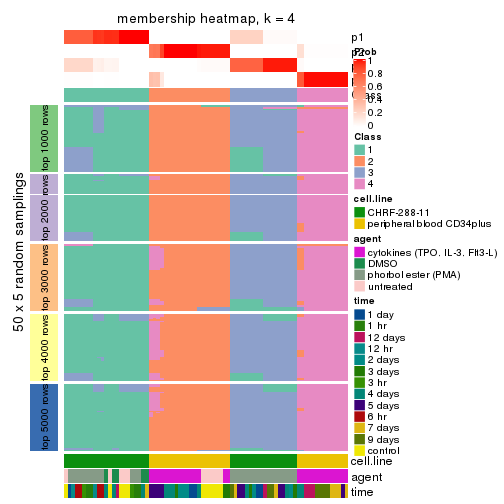</p>

</div>
<div id='tab-ATC-skmeans-membership-heatmap-4'>
<pre><code class="r">membership_heatmap(res, k = 5)
</code></pre>

<p></p>

</div>
<div id='tab-ATC-skmeans-membership-heatmap-5'>
<pre><code class="r">membership_heatmap(res, k = 6)
</code></pre>

<p></p>

</div>
</div>

As soon as we have had the classes for columns, we can look for signatures
which are significantly different between classes which can be candidate marks
for certain classes. Following are the heatmaps for signatures.


Signature heatmaps where rows are scaled:


<script>
$( function() {
	$( '#tabs-ATC-skmeans-get-signatures' ).tabs();
} );
</script>
<div id='tabs-ATC-skmeans-get-signatures'>
<ul>
<li><a href='#tab-ATC-skmeans-get-signatures-1'>k = 2</a></li>
<li><a href='#tab-ATC-skmeans-get-signatures-2'>k = 3</a></li>
<li><a href='#tab-ATC-skmeans-get-signatures-3'>k = 4</a></li>
<li><a href='#tab-ATC-skmeans-get-signatures-4'>k = 5</a></li>
<li><a href='#tab-ATC-skmeans-get-signatures-5'>k = 6</a></li>
</ul>
<div id='tab-ATC-skmeans-get-signatures-1'>
<pre><code class="r">get_signatures(res, k = 2)
</code></pre>

<p></p>

</div>
<div id='tab-ATC-skmeans-get-signatures-2'>
<pre><code class="r">get_signatures(res, k = 3)
</code></pre>

<p></p>

</div>
<div id='tab-ATC-skmeans-get-signatures-3'>
<pre><code class="r">get_signatures(res, k = 4)
</code></pre>

<p></p>

</div>
<div id='tab-ATC-skmeans-get-signatures-4'>
<pre><code class="r">get_signatures(res, k = 5)
</code></pre>

<p>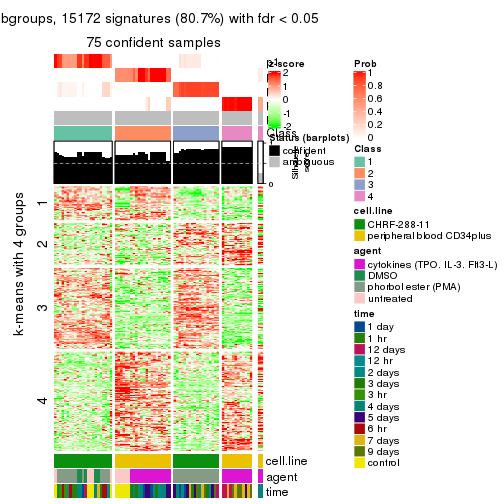</p>

</div>
<div id='tab-ATC-skmeans-get-signatures-5'>
<pre><code class="r">get_signatures(res, k = 6)
</code></pre>

<p></p>

</div>
</div>


Signature heatmaps where rows are not scaled:


<script>
$( function() {
	$( '#tabs-ATC-skmeans-get-signatures-no-scale' ).tabs();
} );
</script>
<div id='tabs-ATC-skmeans-get-signatures-no-scale'>
<ul>
<li><a href='#tab-ATC-skmeans-get-signatures-no-scale-1'>k = 2</a></li>
<li><a href='#tab-ATC-skmeans-get-signatures-no-scale-2'>k = 3</a></li>
<li><a href='#tab-ATC-skmeans-get-signatures-no-scale-3'>k = 4</a></li>
<li><a href='#tab-ATC-skmeans-get-signatures-no-scale-4'>k = 5</a></li>
<li><a href='#tab-ATC-skmeans-get-signatures-no-scale-5'>k = 6</a></li>
</ul>
<div id='tab-ATC-skmeans-get-signatures-no-scale-1'>
<pre><code class="r">get_signatures(res, k = 2, scale_rows = FALSE)
</code></pre>

<p></p>

</div>
<div id='tab-ATC-skmeans-get-signatures-no-scale-2'>
<pre><code class="r">get_signatures(res, k = 3, scale_rows = FALSE)
</code></pre>

<p></p>

</div>
<div id='tab-ATC-skmeans-get-signatures-no-scale-3'>
<pre><code class="r">get_signatures(res, k = 4, scale_rows = FALSE)
</code></pre>

<p></p>

</div>
<div id='tab-ATC-skmeans-get-signatures-no-scale-4'>
<pre><code class="r">get_signatures(res, k = 5, scale_rows = FALSE)
</code></pre>

<p></p>

</div>
<div id='tab-ATC-skmeans-get-signatures-no-scale-5'>
<pre><code class="r">get_signatures(res, k = 6, scale_rows = FALSE)
</code></pre>

<p></p>

</div>
</div>


Compare the overlap of signatures from different k:

```r
compare_signatures(res)
```


`get_signature()` returns a data frame invisibly. TO get the list of signatures, the function
call should be assigned to a variable explicitly. In following code, if `plot` argument is set
to `FALSE`, no heatmap is plotted while only the differential analysis is performed.

```r
# code only for demonstration
tb = get_signature(res, k = ..., plot = FALSE)
```

An example of the output of `tb` is:

```
#>   which_row         fdr    mean_1    mean_2 scaled_mean_1 scaled_mean_2 km
#> 1        38 0.042760348  8.373488  9.131774    -0.5533452     0.5164555  1
#> 2        40 0.018707592  7.106213  8.469186    -0.6173731     0.5762149  1
#> 3        55 0.019134737 10.221463 11.207825    -0.6159697     0.5749050  1
#> 4        59 0.006059896  5.921854  7.869574    -0.6899429     0.6439467  1
#> 5        60 0.018055526  8.928898 10.211722    -0.6204761     0.5791110  1
#> 6        98 0.009384629 15.714769 14.887706     0.6635654    -0.6193277  2
...
```

The columns in `tb` are:

1. `which_row`: row indices corresponding to the input matrix.
2. `fdr`: FDR for the differential test. 
3. `mean_x`: The mean value in group x.
4. `scaled_mean_x`: The mean value in group x after rows are scaled.
5. `km`: Row groups if k-means clustering is applied to rows.


UMAP plot which shows how samples are separated.


<script>
$( function() {
	$( '#tabs-ATC-skmeans-dimension-reduction' ).tabs();
} );
</script>
<div id='tabs-ATC-skmeans-dimension-reduction'>
<ul>
<li><a href='#tab-ATC-skmeans-dimension-reduction-1'>k = 2</a></li>
<li><a href='#tab-ATC-skmeans-dimension-reduction-2'>k = 3</a></li>
<li><a href='#tab-ATC-skmeans-dimension-reduction-3'>k = 4</a></li>
<li><a href='#tab-ATC-skmeans-dimension-reduction-4'>k = 5</a></li>
<li><a href='#tab-ATC-skmeans-dimension-reduction-5'>k = 6</a></li>
</ul>
<div id='tab-ATC-skmeans-dimension-reduction-1'>
<pre><code class="r">dimension_reduction(res, k = 2, method = &quot;UMAP&quot;)
</code></pre>

<p></p>

</div>
<div id='tab-ATC-skmeans-dimension-reduction-2'>
<pre><code class="r">dimension_reduction(res, k = 3, method = &quot;UMAP&quot;)
</code></pre>

<p>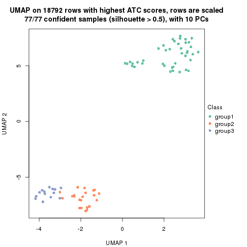</p>

</div>
<div id='tab-ATC-skmeans-dimension-reduction-3'>
<pre><code class="r">dimension_reduction(res, k = 4, method = &quot;UMAP&quot;)
</code></pre>

<p></p>

</div>
<div id='tab-ATC-skmeans-dimension-reduction-4'>
<pre><code class="r">dimension_reduction(res, k = 5, method = &quot;UMAP&quot;)
</code></pre>

<p></p>

</div>
<div id='tab-ATC-skmeans-dimension-reduction-5'>
<pre><code class="r">dimension_reduction(res, k = 6, method = &quot;UMAP&quot;)
</code></pre>

<p></p>

</div>
</div>


Following heatmap shows how subgroups are split when increasing `k`:

```r
collect_classes(res)
```


Test correlation between subgroups and known annotations. If the known
annotation is numeric, one-way ANOVA test is applied, and if the known
annotation is discrete, chi-squared contingency table test is applied.

```r
test_to_known_factors(res)
```

```
#>              n cell.line(p) agent(p)  time(p) k
#> ATC:skmeans 77     1.27e-17 3.00e-14 3.61e-01 2
#> ATC:skmeans 77     1.90e-17 1.49e-13 4.49e-03 3
#> ATC:skmeans 77     1.35e-16 5.01e-15 4.16e-05 4
#> ATC:skmeans 75     3.62e-16 2.04e-14 1.33e-05 5
#> ATC:skmeans 66     6.95e-13 3.10e-17 2.91e-06 6
```


If matrix rows can be associated to genes, consider to use `GO_Enrichment(res,
...)` to perform function enrichment for the signature genes.


 

---------------------------------------------------


### ATC:pam*


The object with results only for a single top-value method and a single partition method 
can be extracted as:

```r
res = res_list["ATC", "pam"]
# you can also extract it by
# res = res_list["ATC:pam"]
```

A summary of `res` and all the functions that can be applied to it:

```r
res
```

```
#> A 'ConsensusPartition' object with k = 2, 3, 4, 5, 6.
#>   On a matrix with 18792 rows and 77 columns.
#>   Top rows (1000, 2000, 3000, 4000, 5000) are extracted by 'ATC' method.
#>   Subgroups are detected by 'pam' method.
#>   Performed in total 1250 partitions by row resampling.
#>   Best k for subgroups seems to be 3.
#> 
#> Following methods can be applied to this 'ConsensusPartition' object:
#>  [1] "cola_report"             "collect_classes"         "collect_plots"          
#>  [4] "collect_stats"           "colnames"                "compare_signatures"     
#>  [7] "consensus_heatmap"       "dimension_reduction"     "functional_enrichment"  
#> [10] "get_anno_col"            "get_anno"                "get_classes"            
#> [13] "get_consensus"           "get_matrix"              "get_membership"         
#> [16] "get_param"               "get_signatures"          "get_stats"              
#> [19] "is_best_k"               "is_stable_k"             "membership_heatmap"     
#> [22] "ncol"                    "nrow"                    "plot_ecdf"              
#> [25] "rownames"                "select_partition_number" "show"                   
#> [28] "suggest_best_k"          "test_to_known_factors"
```

`collect_plots()` function collects all the plots made from `res` for all `k` (number of partitions)
into one single page to provide an easy and fast comparison between different `k`.

```r
collect_plots(res)
```

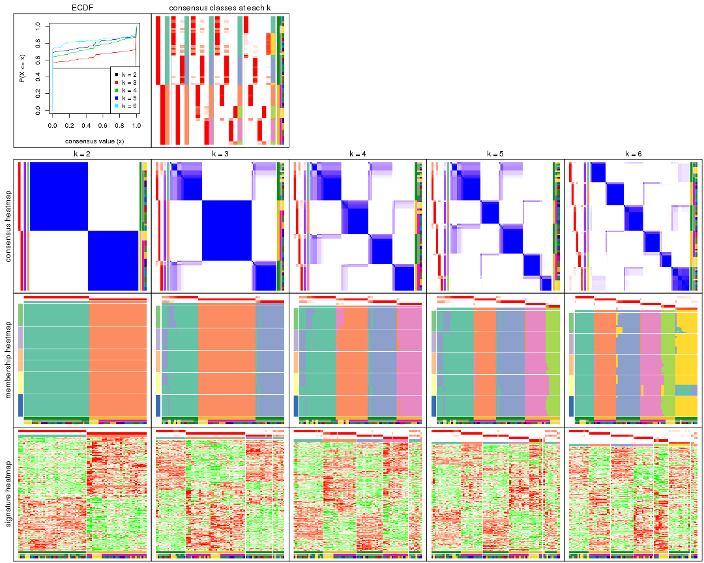

The plots are:

- The first row: a plot of the ECDF (Empirical cumulative distribution
  function) curves of the consensus matrix for each `k` and the heatmap of
  predicted classes for each `k`.
- The second row: heatmaps of the consensus matrix for each `k`.
- The third row: heatmaps of the membership matrix for each `k`.
- The fouth row: heatmaps of the signatures for each `k`.

All the plots in panels can be made by individual functions and they are
plotted later in this section.

`select_partition_number()` produces several plots showing different
statistics for choosing "optimized" `k`. There are following statistics:

- ECDF curves of the consensus matrix for each `k`;
- 1-PAC. [The PAC
  score](https://en.wikipedia.org/wiki/Consensus_clustering#Over-interpretation_potential_of_consensus_clustering)
  measures the proportion of the ambiguous subgrouping.
- Mean silhouette score.
- Concordance. The mean probability of fiting the consensus class ids in all
  partitions.
- Area increased. Denote $A_k$ as the area under the ECDF curve for current
  `k`, the area increased is defined as $A_k - A_{k-1}$.
- Rand index. The percent of pairs of samples that are both in a same cluster
  or both are not in a same cluster in the partition of k and k-1.
- Jaccard index. The ratio of pairs of samples are both in a same cluster in
  the partition of k and k-1 and the pairs of samples are both in a same
  cluster in the partition k or k-1.

The detailed explanations of these statistics can be found in [the cola
vignette](http://bioconductor.org/packages/devel/bioc/vignettes/cola/inst/doc/cola.html#toc_13).

Generally speaking, lower PAC score, higher mean silhouette score or higher
concordance corresponds to better partition. Rand index and Jaccard index
measure how similar the current partition is compared to partition with `k-1`.
If they are too similar, we won't accept `k` is better than `k-1`.

```r
select_partition_number(res)
```


The numeric values for all these statistics can be obtained by `get_stats()`.

```r
get_stats(res)
```

```
#>   k 1-PAC mean_silhouette concordance area_increased  Rand Jaccard
#> 2 2 1.000           1.000       1.000         0.5049 0.496   0.496
#> 3 3 0.913           0.855       0.946         0.2817 0.859   0.714
#> 4 4 0.830           0.805       0.924         0.1681 0.891   0.691
#> 5 5 0.877           0.801       0.927         0.0460 0.946   0.786
#> 6 6 0.897           0.890       0.941         0.0562 0.928   0.674
```

`suggest_best_k()` suggests the best $k$ based on these statistics. The rules are as follows:

- All $k$ with Jaccard index larger than 0.95 are removed because the increase of
  the partition number does not provides enough extra information. If all $k$ are removed,
  the best $k$ is assigned by `NA`.
- For $k$ with 1-PAC larger than 0.9, the maximal $k$ is taken as the "best k". Other $k$ is called "optional k".
- If it does not fit the second rule. The $k$ with the highest vote of highest
  1-PAC, mean silhouette and concordance is taken as the "best k".

```r
suggest_best_k(res)
```

```
#> [1] 3
#> attr(,"optional")
#> [1] 2
```

There is also optional best $k$ = 2 that is worth to check.

Following shows the table of the partitions (You need to click the **show/hide
code output** link to see it). The membership matrix (columns with name `p*`)
is inferred by
[`clue::cl_consensus()`](https://www.rdocumentation.org/link/cl_consensus?package=clue)
function with the `SE` method. Basically the value in the membership matrix
represents the probability to belong to a certain group. The finall class
label for an item is determined with the group with highest probability it
belongs to.

In `get_classes()` function, the entropy is calculated from the membership
matrix and the silhouette score is calculated from the consensus matrix.


<script>
$( function() {
	$( '#tabs-ATC-pam-get-classes' ).tabs();
} );
</script>
<div id='tabs-ATC-pam-get-classes'>
<ul>
<li><a href='#tab-ATC-pam-get-classes-1'>k = 2</a></li>
<li><a href='#tab-ATC-pam-get-classes-2'>k = 3</a></li>
<li><a href='#tab-ATC-pam-get-classes-3'>k = 4</a></li>
<li><a href='#tab-ATC-pam-get-classes-4'>k = 5</a></li>
<li><a href='#tab-ATC-pam-get-classes-5'>k = 6</a></li>
</ul>

<div id='tab-ATC-pam-get-classes-1'>
<p><a id='tab-ATC-pam-get-classes-1-a' style='color:#0366d6' href='#'>show/hide code output</a></p>
<pre><code class="r">cbind(get_classes(res, k = 2), get_membership(res, k = 2))
</code></pre>

<pre><code>#&gt;          class entropy silhouette p1 p2
#&gt; GSM87962     1       0          1  1  0
#&gt; GSM87963     1       0          1  1  0
#&gt; GSM87983     1       0          1  1  0
#&gt; GSM87984     1       0          1  1  0
#&gt; GSM87961     1       0          1  1  0
#&gt; GSM87970     1       0          1  1  0
#&gt; GSM87971     1       0          1  1  0
#&gt; GSM87990     1       0          1  1  0
#&gt; GSM87991     1       0          1  1  0
#&gt; GSM87974     1       0          1  1  0
#&gt; GSM87994     1       0          1  1  0
#&gt; GSM87978     1       0          1  1  0
#&gt; GSM87979     1       0          1  1  0
#&gt; GSM87998     1       0          1  1  0
#&gt; GSM87999     1       0          1  1  0
#&gt; GSM87968     1       0          1  1  0
#&gt; GSM87987     1       0          1  1  0
#&gt; GSM87969     1       0          1  1  0
#&gt; GSM87988     1       0          1  1  0
#&gt; GSM87989     1       0          1  1  0
#&gt; GSM87972     1       0          1  1  0
#&gt; GSM87992     1       0          1  1  0
#&gt; GSM87973     1       0          1  1  0
#&gt; GSM87993     1       0          1  1  0
#&gt; GSM87975     1       0          1  1  0
#&gt; GSM87995     1       0          1  1  0
#&gt; GSM87976     1       0          1  1  0
#&gt; GSM87977     1       0          1  1  0
#&gt; GSM87996     1       0          1  1  0
#&gt; GSM87997     1       0          1  1  0
#&gt; GSM87980     1       0          1  1  0
#&gt; GSM88000     1       0          1  1  0
#&gt; GSM87981     1       0          1  1  0
#&gt; GSM87982     1       0          1  1  0
#&gt; GSM88001     1       0          1  1  0
#&gt; GSM87967     1       0          1  1  0
#&gt; GSM87964     1       0          1  1  0
#&gt; GSM87965     1       0          1  1  0
#&gt; GSM87966     1       0          1  1  0
#&gt; GSM87985     1       0          1  1  0
#&gt; GSM87986     1       0          1  1  0
#&gt; GSM88004     2       0          1  0  1
#&gt; GSM88015     2       0          1  0  1
#&gt; GSM88005     2       0          1  0  1
#&gt; GSM88006     2       0          1  0  1
#&gt; GSM88016     2       0          1  0  1
#&gt; GSM88007     2       0          1  0  1
#&gt; GSM88017     2       0          1  0  1
#&gt; GSM88029     2       0          1  0  1
#&gt; GSM88008     2       0          1  0  1
#&gt; GSM88009     2       0          1  0  1
#&gt; GSM88018     2       0          1  0  1
#&gt; GSM88024     2       0          1  0  1
#&gt; GSM88030     2       0          1  0  1
#&gt; GSM88036     2       0          1  0  1
#&gt; GSM88010     2       0          1  0  1
#&gt; GSM88011     2       0          1  0  1
#&gt; GSM88019     2       0          1  0  1
#&gt; GSM88027     2       0          1  0  1
#&gt; GSM88031     2       0          1  0  1
#&gt; GSM88012     2       0          1  0  1
#&gt; GSM88020     2       0          1  0  1
#&gt; GSM88032     2       0          1  0  1
#&gt; GSM88037     2       0          1  0  1
#&gt; GSM88013     2       0          1  0  1
#&gt; GSM88021     2       0          1  0  1
#&gt; GSM88025     2       0          1  0  1
#&gt; GSM88033     2       0          1  0  1
#&gt; GSM88014     2       0          1  0  1
#&gt; GSM88022     2       0          1  0  1
#&gt; GSM88034     2       0          1  0  1
#&gt; GSM88002     2       0          1  0  1
#&gt; GSM88003     2       0          1  0  1
#&gt; GSM88023     2       0          1  0  1
#&gt; GSM88026     2       0          1  0  1
#&gt; GSM88028     2       0          1  0  1
#&gt; GSM88035     2       0          1  0  1
</code></pre>

<script>
$('#tab-ATC-pam-get-classes-1-a').parent().next().next().hide();
$('#tab-ATC-pam-get-classes-1-a').click(function(){
  $('#tab-ATC-pam-get-classes-1-a').parent().next().next().toggle();
  return(false);
});
</script>
</div>

<div id='tab-ATC-pam-get-classes-2'>
<p><a id='tab-ATC-pam-get-classes-2-a' style='color:#0366d6' href='#'>show/hide code output</a></p>
<pre><code class="r">cbind(get_classes(res, k = 3), get_membership(res, k = 3))
</code></pre>

<pre><code>#&gt;          class entropy silhouette    p1 p2    p3
#&gt; GSM87962     1  0.0000     0.8342 1.000  0 0.000
#&gt; GSM87963     1  0.0000     0.8342 1.000  0 0.000
#&gt; GSM87983     1  0.4555     0.6845 0.800  0 0.200
#&gt; GSM87984     1  0.4555     0.6845 0.800  0 0.200
#&gt; GSM87961     1  0.0000     0.8342 1.000  0 0.000
#&gt; GSM87970     1  0.0000     0.8342 1.000  0 0.000
#&gt; GSM87971     1  0.0000     0.8342 1.000  0 0.000
#&gt; GSM87990     1  0.0000     0.8342 1.000  0 0.000
#&gt; GSM87991     3  0.6307    -0.1131 0.488  0 0.512
#&gt; GSM87974     1  0.0000     0.8342 1.000  0 0.000
#&gt; GSM87994     3  0.0000     0.9183 0.000  0 1.000
#&gt; GSM87978     1  0.0000     0.8342 1.000  0 0.000
#&gt; GSM87979     1  0.0000     0.8342 1.000  0 0.000
#&gt; GSM87998     3  0.0000     0.9183 0.000  0 1.000
#&gt; GSM87999     3  0.0000     0.9183 0.000  0 1.000
#&gt; GSM87968     1  0.0000     0.8342 1.000  0 0.000
#&gt; GSM87987     3  0.5621     0.4231 0.308  0 0.692
#&gt; GSM87969     1  0.0000     0.8342 1.000  0 0.000
#&gt; GSM87988     3  0.0000     0.9183 0.000  0 1.000
#&gt; GSM87989     3  0.0000     0.9183 0.000  0 1.000
#&gt; GSM87972     1  0.6307     0.0822 0.512  0 0.488
#&gt; GSM87992     3  0.0000     0.9183 0.000  0 1.000
#&gt; GSM87973     3  0.0000     0.9183 0.000  0 1.000
#&gt; GSM87993     3  0.0000     0.9183 0.000  0 1.000
#&gt; GSM87975     1  0.6225     0.2353 0.568  0 0.432
#&gt; GSM87995     3  0.0000     0.9183 0.000  0 1.000
#&gt; GSM87976     1  0.1643     0.8099 0.956  0 0.044
#&gt; GSM87977     1  0.6307     0.0822 0.512  0 0.488
#&gt; GSM87996     3  0.0000     0.9183 0.000  0 1.000
#&gt; GSM87997     3  0.0000     0.9183 0.000  0 1.000
#&gt; GSM87980     1  0.6307     0.0822 0.512  0 0.488
#&gt; GSM88000     3  0.0000     0.9183 0.000  0 1.000
#&gt; GSM87981     3  0.5431     0.5232 0.284  0 0.716
#&gt; GSM87982     3  0.0000     0.9183 0.000  0 1.000
#&gt; GSM88001     3  0.0000     0.9183 0.000  0 1.000
#&gt; GSM87967     3  0.0592     0.9071 0.012  0 0.988
#&gt; GSM87964     1  0.0000     0.8342 1.000  0 0.000
#&gt; GSM87965     1  0.0000     0.8342 1.000  0 0.000
#&gt; GSM87966     1  0.6225     0.2583 0.568  0 0.432
#&gt; GSM87985     1  0.2448     0.7914 0.924  0 0.076
#&gt; GSM87986     1  0.4605     0.6801 0.796  0 0.204
#&gt; GSM88004     2  0.0000     1.0000 0.000  1 0.000
#&gt; GSM88015     2  0.0000     1.0000 0.000  1 0.000
#&gt; GSM88005     2  0.0000     1.0000 0.000  1 0.000
#&gt; GSM88006     2  0.0000     1.0000 0.000  1 0.000
#&gt; GSM88016     2  0.0000     1.0000 0.000  1 0.000
#&gt; GSM88007     2  0.0000     1.0000 0.000  1 0.000
#&gt; GSM88017     2  0.0000     1.0000 0.000  1 0.000
#&gt; GSM88029     2  0.0000     1.0000 0.000  1 0.000
#&gt; GSM88008     2  0.0000     1.0000 0.000  1 0.000
#&gt; GSM88009     2  0.0000     1.0000 0.000  1 0.000
#&gt; GSM88018     2  0.0000     1.0000 0.000  1 0.000
#&gt; GSM88024     2  0.0000     1.0000 0.000  1 0.000
#&gt; GSM88030     2  0.0000     1.0000 0.000  1 0.000
#&gt; GSM88036     2  0.0000     1.0000 0.000  1 0.000
#&gt; GSM88010     2  0.0000     1.0000 0.000  1 0.000
#&gt; GSM88011     2  0.0000     1.0000 0.000  1 0.000
#&gt; GSM88019     2  0.0000     1.0000 0.000  1 0.000
#&gt; GSM88027     2  0.0000     1.0000 0.000  1 0.000
#&gt; GSM88031     2  0.0000     1.0000 0.000  1 0.000
#&gt; GSM88012     2  0.0000     1.0000 0.000  1 0.000
#&gt; GSM88020     2  0.0000     1.0000 0.000  1 0.000
#&gt; GSM88032     2  0.0000     1.0000 0.000  1 0.000
#&gt; GSM88037     2  0.0000     1.0000 0.000  1 0.000
#&gt; GSM88013     2  0.0000     1.0000 0.000  1 0.000
#&gt; GSM88021     2  0.0000     1.0000 0.000  1 0.000
#&gt; GSM88025     2  0.0000     1.0000 0.000  1 0.000
#&gt; GSM88033     2  0.0000     1.0000 0.000  1 0.000
#&gt; GSM88014     2  0.0000     1.0000 0.000  1 0.000
#&gt; GSM88022     2  0.0000     1.0000 0.000  1 0.000
#&gt; GSM88034     2  0.0000     1.0000 0.000  1 0.000
#&gt; GSM88002     2  0.0000     1.0000 0.000  1 0.000
#&gt; GSM88003     2  0.0000     1.0000 0.000  1 0.000
#&gt; GSM88023     2  0.0000     1.0000 0.000  1 0.000
#&gt; GSM88026     2  0.0000     1.0000 0.000  1 0.000
#&gt; GSM88028     2  0.0000     1.0000 0.000  1 0.000
#&gt; GSM88035     2  0.0000     1.0000 0.000  1 0.000
</code></pre>

<script>
$('#tab-ATC-pam-get-classes-2-a').parent().next().next().hide();
$('#tab-ATC-pam-get-classes-2-a').click(function(){
  $('#tab-ATC-pam-get-classes-2-a').parent().next().next().toggle();
  return(false);
});
</script>
</div>

<div id='tab-ATC-pam-get-classes-3'>
<p><a id='tab-ATC-pam-get-classes-3-a' style='color:#0366d6' href='#'>show/hide code output</a></p>
<pre><code class="r">cbind(get_classes(res, k = 4), get_membership(res, k = 4))
</code></pre>

<pre><code>#&gt;          class entropy silhouette    p1    p2    p3    p4
#&gt; GSM87962     1  0.0000     0.8342 1.000 0.000 0.000 0.000
#&gt; GSM87963     1  0.0000     0.8342 1.000 0.000 0.000 0.000
#&gt; GSM87983     1  0.3610     0.6845 0.800 0.000 0.200 0.000
#&gt; GSM87984     1  0.3610     0.6845 0.800 0.000 0.200 0.000
#&gt; GSM87961     1  0.0000     0.8342 1.000 0.000 0.000 0.000
#&gt; GSM87970     1  0.0000     0.8342 1.000 0.000 0.000 0.000
#&gt; GSM87971     1  0.0000     0.8342 1.000 0.000 0.000 0.000
#&gt; GSM87990     1  0.0000     0.8342 1.000 0.000 0.000 0.000
#&gt; GSM87991     3  0.4998    -0.1131 0.488 0.000 0.512 0.000
#&gt; GSM87974     1  0.0000     0.8342 1.000 0.000 0.000 0.000
#&gt; GSM87994     3  0.0000     0.9183 0.000 0.000 1.000 0.000
#&gt; GSM87978     1  0.0000     0.8342 1.000 0.000 0.000 0.000
#&gt; GSM87979     1  0.0000     0.8342 1.000 0.000 0.000 0.000
#&gt; GSM87998     3  0.0000     0.9183 0.000 0.000 1.000 0.000
#&gt; GSM87999     3  0.0000     0.9183 0.000 0.000 1.000 0.000
#&gt; GSM87968     1  0.0000     0.8342 1.000 0.000 0.000 0.000
#&gt; GSM87987     3  0.4454     0.4231 0.308 0.000 0.692 0.000
#&gt; GSM87969     1  0.0000     0.8342 1.000 0.000 0.000 0.000
#&gt; GSM87988     3  0.0000     0.9183 0.000 0.000 1.000 0.000
#&gt; GSM87989     3  0.0000     0.9183 0.000 0.000 1.000 0.000
#&gt; GSM87972     1  0.4998     0.0822 0.512 0.000 0.488 0.000
#&gt; GSM87992     3  0.0000     0.9183 0.000 0.000 1.000 0.000
#&gt; GSM87973     3  0.0000     0.9183 0.000 0.000 1.000 0.000
#&gt; GSM87993     3  0.0000     0.9183 0.000 0.000 1.000 0.000
#&gt; GSM87975     1  0.4933     0.2353 0.568 0.000 0.432 0.000
#&gt; GSM87995     3  0.0000     0.9183 0.000 0.000 1.000 0.000
#&gt; GSM87976     1  0.1302     0.8099 0.956 0.000 0.044 0.000
#&gt; GSM87977     1  0.4998     0.0822 0.512 0.000 0.488 0.000
#&gt; GSM87996     3  0.0000     0.9183 0.000 0.000 1.000 0.000
#&gt; GSM87997     3  0.0000     0.9183 0.000 0.000 1.000 0.000
#&gt; GSM87980     1  0.4998     0.0822 0.512 0.000 0.488 0.000
#&gt; GSM88000     3  0.0000     0.9183 0.000 0.000 1.000 0.000
#&gt; GSM87981     3  0.4304     0.5232 0.284 0.000 0.716 0.000
#&gt; GSM87982     3  0.0000     0.9183 0.000 0.000 1.000 0.000
#&gt; GSM88001     3  0.0000     0.9183 0.000 0.000 1.000 0.000
#&gt; GSM87967     3  0.0469     0.9071 0.012 0.000 0.988 0.000
#&gt; GSM87964     1  0.0000     0.8342 1.000 0.000 0.000 0.000
#&gt; GSM87965     1  0.0000     0.8342 1.000 0.000 0.000 0.000
#&gt; GSM87966     1  0.4933     0.2583 0.568 0.000 0.432 0.000
#&gt; GSM87985     1  0.1940     0.7914 0.924 0.000 0.076 0.000
#&gt; GSM87986     1  0.3649     0.6801 0.796 0.000 0.204 0.000
#&gt; GSM88004     2  0.0000     0.9433 0.000 1.000 0.000 0.000
#&gt; GSM88015     2  0.0000     0.9433 0.000 1.000 0.000 0.000
#&gt; GSM88005     2  0.0000     0.9433 0.000 1.000 0.000 0.000
#&gt; GSM88006     2  0.0000     0.9433 0.000 1.000 0.000 0.000
#&gt; GSM88016     2  0.0000     0.9433 0.000 1.000 0.000 0.000
#&gt; GSM88007     2  0.0000     0.9433 0.000 1.000 0.000 0.000
#&gt; GSM88017     2  0.0000     0.9433 0.000 1.000 0.000 0.000
#&gt; GSM88029     2  0.4585     0.5551 0.000 0.668 0.000 0.332
#&gt; GSM88008     2  0.0000     0.9433 0.000 1.000 0.000 0.000
#&gt; GSM88009     2  0.0000     0.9433 0.000 1.000 0.000 0.000
#&gt; GSM88018     2  0.0000     0.9433 0.000 1.000 0.000 0.000
#&gt; GSM88024     2  0.0000     0.9433 0.000 1.000 0.000 0.000
#&gt; GSM88030     4  0.0000     0.9512 0.000 0.000 0.000 1.000
#&gt; GSM88036     4  0.0000     0.9512 0.000 0.000 0.000 1.000
#&gt; GSM88010     4  0.4406     0.5482 0.000 0.300 0.000 0.700
#&gt; GSM88011     4  0.4843     0.3770 0.000 0.396 0.000 0.604
#&gt; GSM88019     2  0.0188     0.9409 0.000 0.996 0.000 0.004
#&gt; GSM88027     2  0.0000     0.9433 0.000 1.000 0.000 0.000
#&gt; GSM88031     4  0.0000     0.9512 0.000 0.000 0.000 1.000
#&gt; GSM88012     4  0.0000     0.9512 0.000 0.000 0.000 1.000
#&gt; GSM88020     4  0.0000     0.9512 0.000 0.000 0.000 1.000
#&gt; GSM88032     4  0.0000     0.9512 0.000 0.000 0.000 1.000
#&gt; GSM88037     4  0.0000     0.9512 0.000 0.000 0.000 1.000
#&gt; GSM88013     4  0.0000     0.9512 0.000 0.000 0.000 1.000
#&gt; GSM88021     4  0.0000     0.9512 0.000 0.000 0.000 1.000
#&gt; GSM88025     4  0.0000     0.9512 0.000 0.000 0.000 1.000
#&gt; GSM88033     4  0.0000     0.9512 0.000 0.000 0.000 1.000
#&gt; GSM88014     4  0.0000     0.9512 0.000 0.000 0.000 1.000
#&gt; GSM88022     4  0.0000     0.9512 0.000 0.000 0.000 1.000
#&gt; GSM88034     4  0.0000     0.9512 0.000 0.000 0.000 1.000
#&gt; GSM88002     2  0.3837     0.7412 0.000 0.776 0.000 0.224
#&gt; GSM88003     2  0.2868     0.8455 0.000 0.864 0.000 0.136
#&gt; GSM88023     2  0.3311     0.8076 0.000 0.828 0.000 0.172
#&gt; GSM88026     2  0.2868     0.8454 0.000 0.864 0.000 0.136
#&gt; GSM88028     2  0.0000     0.9433 0.000 1.000 0.000 0.000
#&gt; GSM88035     2  0.0000     0.9433 0.000 1.000 0.000 0.000
</code></pre>

<script>
$('#tab-ATC-pam-get-classes-3-a').parent().next().next().hide();
$('#tab-ATC-pam-get-classes-3-a').click(function(){
  $('#tab-ATC-pam-get-classes-3-a').parent().next().next().toggle();
  return(false);
});
</script>
</div>

<div id='tab-ATC-pam-get-classes-4'>
<p><a id='tab-ATC-pam-get-classes-4-a' style='color:#0366d6' href='#'>show/hide code output</a></p>
<pre><code class="r">cbind(get_classes(res, k = 5), get_membership(res, k = 5))
</code></pre>

<pre><code>#&gt;          class entropy silhouette    p1    p2    p3    p4    p5
#&gt; GSM87962     1  0.0000     0.8297 1.000 0.000 0.000 0.000 0.000
#&gt; GSM87963     1  0.0000     0.8297 1.000 0.000 0.000 0.000 0.000
#&gt; GSM87983     1  0.3109     0.6845 0.800 0.000 0.200 0.000 0.000
#&gt; GSM87984     1  0.3109     0.6845 0.800 0.000 0.200 0.000 0.000
#&gt; GSM87961     1  0.0000     0.8297 1.000 0.000 0.000 0.000 0.000
#&gt; GSM87970     1  0.0000     0.8297 1.000 0.000 0.000 0.000 0.000
#&gt; GSM87971     1  0.0000     0.8297 1.000 0.000 0.000 0.000 0.000
#&gt; GSM87990     1  0.0000     0.8297 1.000 0.000 0.000 0.000 0.000
#&gt; GSM87991     3  0.4305    -0.1131 0.488 0.000 0.512 0.000 0.000
#&gt; GSM87974     1  0.0000     0.8297 1.000 0.000 0.000 0.000 0.000
#&gt; GSM87994     3  0.0000     0.9183 0.000 0.000 1.000 0.000 0.000
#&gt; GSM87978     1  0.0000     0.8297 1.000 0.000 0.000 0.000 0.000
#&gt; GSM87979     1  0.0000     0.8297 1.000 0.000 0.000 0.000 0.000
#&gt; GSM87998     3  0.0000     0.9183 0.000 0.000 1.000 0.000 0.000
#&gt; GSM87999     3  0.0000     0.9183 0.000 0.000 1.000 0.000 0.000
#&gt; GSM87968     1  0.0000     0.8297 1.000 0.000 0.000 0.000 0.000
#&gt; GSM87987     3  0.3837     0.4231 0.308 0.000 0.692 0.000 0.000
#&gt; GSM87969     1  0.0000     0.8297 1.000 0.000 0.000 0.000 0.000
#&gt; GSM87988     3  0.0000     0.9183 0.000 0.000 1.000 0.000 0.000
#&gt; GSM87989     3  0.0000     0.9183 0.000 0.000 1.000 0.000 0.000
#&gt; GSM87972     1  0.4305     0.0822 0.512 0.000 0.488 0.000 0.000
#&gt; GSM87992     3  0.0000     0.9183 0.000 0.000 1.000 0.000 0.000
#&gt; GSM87973     3  0.0000     0.9183 0.000 0.000 1.000 0.000 0.000
#&gt; GSM87993     3  0.0000     0.9183 0.000 0.000 1.000 0.000 0.000
#&gt; GSM87975     1  0.4249     0.2353 0.568 0.000 0.432 0.000 0.000
#&gt; GSM87995     3  0.0000     0.9183 0.000 0.000 1.000 0.000 0.000
#&gt; GSM87976     1  0.1121     0.8095 0.956 0.000 0.044 0.000 0.000
#&gt; GSM87977     1  0.4305     0.0822 0.512 0.000 0.488 0.000 0.000
#&gt; GSM87996     3  0.0000     0.9183 0.000 0.000 1.000 0.000 0.000
#&gt; GSM87997     3  0.0000     0.9183 0.000 0.000 1.000 0.000 0.000
#&gt; GSM87980     1  0.4305     0.0822 0.512 0.000 0.488 0.000 0.000
#&gt; GSM88000     3  0.0000     0.9183 0.000 0.000 1.000 0.000 0.000
#&gt; GSM87981     3  0.3707     0.5232 0.284 0.000 0.716 0.000 0.000
#&gt; GSM87982     3  0.0000     0.9183 0.000 0.000 1.000 0.000 0.000
#&gt; GSM88001     3  0.0000     0.9183 0.000 0.000 1.000 0.000 0.000
#&gt; GSM87967     3  0.0404     0.9071 0.012 0.000 0.988 0.000 0.000
#&gt; GSM87964     1  0.0000     0.8297 1.000 0.000 0.000 0.000 0.000
#&gt; GSM87965     1  0.0000     0.8297 1.000 0.000 0.000 0.000 0.000
#&gt; GSM87966     1  0.4249     0.2583 0.568 0.000 0.432 0.000 0.000
#&gt; GSM87985     1  0.1671     0.7914 0.924 0.000 0.076 0.000 0.000
#&gt; GSM87986     1  0.3143     0.6801 0.796 0.000 0.204 0.000 0.000
#&gt; GSM88004     2  0.0000     0.9588 0.000 1.000 0.000 0.000 0.000
#&gt; GSM88015     2  0.0000     0.9588 0.000 1.000 0.000 0.000 0.000
#&gt; GSM88005     2  0.0000     0.9588 0.000 1.000 0.000 0.000 0.000
#&gt; GSM88006     2  0.0000     0.9588 0.000 1.000 0.000 0.000 0.000
#&gt; GSM88016     2  0.0000     0.9588 0.000 1.000 0.000 0.000 0.000
#&gt; GSM88007     2  0.0000     0.9588 0.000 1.000 0.000 0.000 0.000
#&gt; GSM88017     2  0.0703     0.9364 0.000 0.976 0.000 0.000 0.024
#&gt; GSM88029     5  0.0162     0.9164 0.000 0.004 0.000 0.000 0.996
#&gt; GSM88008     2  0.0000     0.9588 0.000 1.000 0.000 0.000 0.000
#&gt; GSM88009     2  0.0000     0.9588 0.000 1.000 0.000 0.000 0.000
#&gt; GSM88018     2  0.0000     0.9588 0.000 1.000 0.000 0.000 0.000
#&gt; GSM88024     2  0.0000     0.9588 0.000 1.000 0.000 0.000 0.000
#&gt; GSM88030     5  0.3424     0.6863 0.000 0.000 0.000 0.240 0.760
#&gt; GSM88036     5  0.4074     0.4650 0.000 0.000 0.000 0.364 0.636
#&gt; GSM88010     2  0.4268     0.1327 0.000 0.556 0.000 0.444 0.000
#&gt; GSM88011     4  0.4219     0.2470 0.000 0.416 0.000 0.584 0.000
#&gt; GSM88019     2  0.0000     0.9588 0.000 1.000 0.000 0.000 0.000
#&gt; GSM88027     2  0.0000     0.9588 0.000 1.000 0.000 0.000 0.000
#&gt; GSM88031     4  0.0000     0.9571 0.000 0.000 0.000 1.000 0.000
#&gt; GSM88012     4  0.0000     0.9571 0.000 0.000 0.000 1.000 0.000
#&gt; GSM88020     4  0.0000     0.9571 0.000 0.000 0.000 1.000 0.000
#&gt; GSM88032     4  0.0000     0.9571 0.000 0.000 0.000 1.000 0.000
#&gt; GSM88037     4  0.0000     0.9571 0.000 0.000 0.000 1.000 0.000
#&gt; GSM88013     4  0.0000     0.9571 0.000 0.000 0.000 1.000 0.000
#&gt; GSM88021     4  0.0000     0.9571 0.000 0.000 0.000 1.000 0.000
#&gt; GSM88025     4  0.0000     0.9571 0.000 0.000 0.000 1.000 0.000
#&gt; GSM88033     4  0.0000     0.9571 0.000 0.000 0.000 1.000 0.000
#&gt; GSM88014     4  0.0000     0.9571 0.000 0.000 0.000 1.000 0.000
#&gt; GSM88022     4  0.0000     0.9571 0.000 0.000 0.000 1.000 0.000
#&gt; GSM88034     4  0.0000     0.9571 0.000 0.000 0.000 1.000 0.000
#&gt; GSM88002     5  0.0000     0.9191 0.000 0.000 0.000 0.000 1.000
#&gt; GSM88003     5  0.0000     0.9191 0.000 0.000 0.000 0.000 1.000
#&gt; GSM88023     5  0.0000     0.9191 0.000 0.000 0.000 0.000 1.000
#&gt; GSM88026     5  0.0000     0.9191 0.000 0.000 0.000 0.000 1.000
#&gt; GSM88028     5  0.0000     0.9191 0.000 0.000 0.000 0.000 1.000
#&gt; GSM88035     5  0.0000     0.9191 0.000 0.000 0.000 0.000 1.000
</code></pre>

<script>
$('#tab-ATC-pam-get-classes-4-a').parent().next().next().hide();
$('#tab-ATC-pam-get-classes-4-a').click(function(){
  $('#tab-ATC-pam-get-classes-4-a').parent().next().next().toggle();
  return(false);
});
</script>
</div>

<div id='tab-ATC-pam-get-classes-5'>
<p><a id='tab-ATC-pam-get-classes-5-a' style='color:#0366d6' href='#'>show/hide code output</a></p>
<pre><code class="r">cbind(get_classes(res, k = 6), get_membership(res, k = 6))
</code></pre>

<pre><code>#&gt;          class entropy silhouette    p1    p2    p3    p4    p5    p6
#&gt; GSM87962     1  0.0146      0.969 0.996 0.000 0.000 0.000 0.000 0.004
#&gt; GSM87963     1  0.0000      0.972 1.000 0.000 0.000 0.000 0.000 0.000
#&gt; GSM87983     1  0.0000      0.972 1.000 0.000 0.000 0.000 0.000 0.000
#&gt; GSM87984     1  0.0000      0.972 1.000 0.000 0.000 0.000 0.000 0.000
#&gt; GSM87961     1  0.0146      0.969 0.996 0.000 0.000 0.000 0.000 0.004
#&gt; GSM87970     6  0.2491      0.873 0.164 0.000 0.000 0.000 0.000 0.836
#&gt; GSM87971     6  0.2048      0.899 0.120 0.000 0.000 0.000 0.000 0.880
#&gt; GSM87990     1  0.0000      0.972 1.000 0.000 0.000 0.000 0.000 0.000
#&gt; GSM87991     1  0.0000      0.972 1.000 0.000 0.000 0.000 0.000 0.000
#&gt; GSM87974     6  0.1910      0.900 0.108 0.000 0.000 0.000 0.000 0.892
#&gt; GSM87994     1  0.3076      0.662 0.760 0.000 0.240 0.000 0.000 0.000
#&gt; GSM87978     6  0.2092      0.898 0.124 0.000 0.000 0.000 0.000 0.876
#&gt; GSM87979     6  0.2454      0.876 0.160 0.000 0.000 0.000 0.000 0.840
#&gt; GSM87998     3  0.0000      0.950 0.000 0.000 1.000 0.000 0.000 0.000
#&gt; GSM87999     3  0.0146      0.947 0.004 0.000 0.996 0.000 0.000 0.000
#&gt; GSM87968     6  0.1910      0.900 0.108 0.000 0.000 0.000 0.000 0.892
#&gt; GSM87987     6  0.3737      0.424 0.000 0.000 0.392 0.000 0.000 0.608
#&gt; GSM87969     6  0.2135      0.896 0.128 0.000 0.000 0.000 0.000 0.872
#&gt; GSM87988     3  0.0000      0.950 0.000 0.000 1.000 0.000 0.000 0.000
#&gt; GSM87989     3  0.0000      0.950 0.000 0.000 1.000 0.000 0.000 0.000
#&gt; GSM87972     6  0.1910      0.852 0.000 0.000 0.108 0.000 0.000 0.892
#&gt; GSM87992     3  0.0000      0.950 0.000 0.000 1.000 0.000 0.000 0.000
#&gt; GSM87973     3  0.1327      0.911 0.000 0.000 0.936 0.000 0.000 0.064
#&gt; GSM87993     3  0.0000      0.950 0.000 0.000 1.000 0.000 0.000 0.000
#&gt; GSM87975     6  0.1910      0.852 0.000 0.000 0.108 0.000 0.000 0.892
#&gt; GSM87995     3  0.0000      0.950 0.000 0.000 1.000 0.000 0.000 0.000
#&gt; GSM87976     6  0.1910      0.900 0.108 0.000 0.000 0.000 0.000 0.892
#&gt; GSM87977     6  0.1910      0.852 0.000 0.000 0.108 0.000 0.000 0.892
#&gt; GSM87996     3  0.0000      0.950 0.000 0.000 1.000 0.000 0.000 0.000
#&gt; GSM87997     3  0.0000      0.950 0.000 0.000 1.000 0.000 0.000 0.000
#&gt; GSM87980     6  0.1910      0.852 0.000 0.000 0.108 0.000 0.000 0.892
#&gt; GSM88000     3  0.0000      0.950 0.000 0.000 1.000 0.000 0.000 0.000
#&gt; GSM87981     3  0.3828      0.173 0.000 0.000 0.560 0.000 0.000 0.440
#&gt; GSM87982     3  0.1327      0.911 0.000 0.000 0.936 0.000 0.000 0.064
#&gt; GSM88001     3  0.0000      0.950 0.000 0.000 1.000 0.000 0.000 0.000
#&gt; GSM87967     3  0.1501      0.900 0.000 0.000 0.924 0.000 0.000 0.076
#&gt; GSM87964     6  0.2491      0.873 0.164 0.000 0.000 0.000 0.000 0.836
#&gt; GSM87965     1  0.0000      0.972 1.000 0.000 0.000 0.000 0.000 0.000
#&gt; GSM87966     1  0.0000      0.972 1.000 0.000 0.000 0.000 0.000 0.000
#&gt; GSM87985     1  0.0000      0.972 1.000 0.000 0.000 0.000 0.000 0.000
#&gt; GSM87986     1  0.0000      0.972 1.000 0.000 0.000 0.000 0.000 0.000
#&gt; GSM88004     2  0.0000      0.959 0.000 1.000 0.000 0.000 0.000 0.000
#&gt; GSM88015     2  0.0000      0.959 0.000 1.000 0.000 0.000 0.000 0.000
#&gt; GSM88005     2  0.0000      0.959 0.000 1.000 0.000 0.000 0.000 0.000
#&gt; GSM88006     2  0.0000      0.959 0.000 1.000 0.000 0.000 0.000 0.000
#&gt; GSM88016     2  0.0000      0.959 0.000 1.000 0.000 0.000 0.000 0.000
#&gt; GSM88007     2  0.0000      0.959 0.000 1.000 0.000 0.000 0.000 0.000
#&gt; GSM88017     2  0.0632      0.937 0.000 0.976 0.000 0.000 0.024 0.000
#&gt; GSM88029     5  0.0146      0.929 0.000 0.004 0.000 0.000 0.996 0.000
#&gt; GSM88008     2  0.0000      0.959 0.000 1.000 0.000 0.000 0.000 0.000
#&gt; GSM88009     2  0.0000      0.959 0.000 1.000 0.000 0.000 0.000 0.000
#&gt; GSM88018     2  0.0000      0.959 0.000 1.000 0.000 0.000 0.000 0.000
#&gt; GSM88024     2  0.0000      0.959 0.000 1.000 0.000 0.000 0.000 0.000
#&gt; GSM88030     5  0.4036      0.763 0.000 0.000 0.000 0.136 0.756 0.108
#&gt; GSM88036     5  0.4934      0.572 0.000 0.000 0.000 0.264 0.628 0.108
#&gt; GSM88010     2  0.3833      0.143 0.000 0.556 0.000 0.444 0.000 0.000
#&gt; GSM88011     4  0.3789      0.242 0.000 0.416 0.000 0.584 0.000 0.000
#&gt; GSM88019     2  0.0000      0.959 0.000 1.000 0.000 0.000 0.000 0.000
#&gt; GSM88027     2  0.0000      0.959 0.000 1.000 0.000 0.000 0.000 0.000
#&gt; GSM88031     4  0.0000      0.949 0.000 0.000 0.000 1.000 0.000 0.000
#&gt; GSM88012     4  0.0000      0.949 0.000 0.000 0.000 1.000 0.000 0.000
#&gt; GSM88020     4  0.0000      0.949 0.000 0.000 0.000 1.000 0.000 0.000
#&gt; GSM88032     4  0.0000      0.949 0.000 0.000 0.000 1.000 0.000 0.000
#&gt; GSM88037     4  0.0000      0.949 0.000 0.000 0.000 1.000 0.000 0.000
#&gt; GSM88013     4  0.0000      0.949 0.000 0.000 0.000 1.000 0.000 0.000
#&gt; GSM88021     4  0.0000      0.949 0.000 0.000 0.000 1.000 0.000 0.000
#&gt; GSM88025     4  0.0000      0.949 0.000 0.000 0.000 1.000 0.000 0.000
#&gt; GSM88033     4  0.0000      0.949 0.000 0.000 0.000 1.000 0.000 0.000
#&gt; GSM88014     4  0.0000      0.949 0.000 0.000 0.000 1.000 0.000 0.000
#&gt; GSM88022     4  0.0000      0.949 0.000 0.000 0.000 1.000 0.000 0.000
#&gt; GSM88034     4  0.1910      0.857 0.000 0.000 0.000 0.892 0.000 0.108
#&gt; GSM88002     5  0.0000      0.932 0.000 0.000 0.000 0.000 1.000 0.000
#&gt; GSM88003     5  0.0000      0.932 0.000 0.000 0.000 0.000 1.000 0.000
#&gt; GSM88023     5  0.0000      0.932 0.000 0.000 0.000 0.000 1.000 0.000
#&gt; GSM88026     5  0.0000      0.932 0.000 0.000 0.000 0.000 1.000 0.000
#&gt; GSM88028     5  0.0000      0.932 0.000 0.000 0.000 0.000 1.000 0.000
#&gt; GSM88035     5  0.0000      0.932 0.000 0.000 0.000 0.000 1.000 0.000
</code></pre>

<script>
$('#tab-ATC-pam-get-classes-5-a').parent().next().next().hide();
$('#tab-ATC-pam-get-classes-5-a').click(function(){
  $('#tab-ATC-pam-get-classes-5-a').parent().next().next().toggle();
  return(false);
});
</script>
</div>
</div>

Heatmaps for the consensus matrix. It visualizes the probability of two
samples to be in a same group.


<script>
$( function() {
	$( '#tabs-ATC-pam-consensus-heatmap' ).tabs();
} );
</script>
<div id='tabs-ATC-pam-consensus-heatmap'>
<ul>
<li><a href='#tab-ATC-pam-consensus-heatmap-1'>k = 2</a></li>
<li><a href='#tab-ATC-pam-consensus-heatmap-2'>k = 3</a></li>
<li><a href='#tab-ATC-pam-consensus-heatmap-3'>k = 4</a></li>
<li><a href='#tab-ATC-pam-consensus-heatmap-4'>k = 5</a></li>
<li><a href='#tab-ATC-pam-consensus-heatmap-5'>k = 6</a></li>
</ul>
<div id='tab-ATC-pam-consensus-heatmap-1'>
<pre><code class="r">consensus_heatmap(res, k = 2)
</code></pre>

<p></p>

</div>
<div id='tab-ATC-pam-consensus-heatmap-2'>
<pre><code class="r">consensus_heatmap(res, k = 3)
</code></pre>

<p></p>

</div>
<div id='tab-ATC-pam-consensus-heatmap-3'>
<pre><code class="r">consensus_heatmap(res, k = 4)
</code></pre>

<p></p>

</div>
<div id='tab-ATC-pam-consensus-heatmap-4'>
<pre><code class="r">consensus_heatmap(res, k = 5)
</code></pre>

<p></p>

</div>
<div id='tab-ATC-pam-consensus-heatmap-5'>
<pre><code class="r">consensus_heatmap(res, k = 6)
</code></pre>

<p></p>

</div>
</div>

Heatmaps for the membership of samples in all partitions to see how consistent they are:


<script>
$( function() {
	$( '#tabs-ATC-pam-membership-heatmap' ).tabs();
} );
</script>
<div id='tabs-ATC-pam-membership-heatmap'>
<ul>
<li><a href='#tab-ATC-pam-membership-heatmap-1'>k = 2</a></li>
<li><a href='#tab-ATC-pam-membership-heatmap-2'>k = 3</a></li>
<li><a href='#tab-ATC-pam-membership-heatmap-3'>k = 4</a></li>
<li><a href='#tab-ATC-pam-membership-heatmap-4'>k = 5</a></li>
<li><a href='#tab-ATC-pam-membership-heatmap-5'>k = 6</a></li>
</ul>
<div id='tab-ATC-pam-membership-heatmap-1'>
<pre><code class="r">membership_heatmap(res, k = 2)
</code></pre>

<p></p>

</div>
<div id='tab-ATC-pam-membership-heatmap-2'>
<pre><code class="r">membership_heatmap(res, k = 3)
</code></pre>

<p></p>

</div>
<div id='tab-ATC-pam-membership-heatmap-3'>
<pre><code class="r">membership_heatmap(res, k = 4)
</code></pre>

<p></p>

</div>
<div id='tab-ATC-pam-membership-heatmap-4'>
<pre><code class="r">membership_heatmap(res, k = 5)
</code></pre>

<p></p>

</div>
<div id='tab-ATC-pam-membership-heatmap-5'>
<pre><code class="r">membership_heatmap(res, k = 6)
</code></pre>

<p></p>

</div>
</div>

As soon as we have had the classes for columns, we can look for signatures
which are significantly different between classes which can be candidate marks
for certain classes. Following are the heatmaps for signatures.


Signature heatmaps where rows are scaled:


<script>
$( function() {
	$( '#tabs-ATC-pam-get-signatures' ).tabs();
} );
</script>
<div id='tabs-ATC-pam-get-signatures'>
<ul>
<li><a href='#tab-ATC-pam-get-signatures-1'>k = 2</a></li>
<li><a href='#tab-ATC-pam-get-signatures-2'>k = 3</a></li>
<li><a href='#tab-ATC-pam-get-signatures-3'>k = 4</a></li>
<li><a href='#tab-ATC-pam-get-signatures-4'>k = 5</a></li>
<li><a href='#tab-ATC-pam-get-signatures-5'>k = 6</a></li>
</ul>
<div id='tab-ATC-pam-get-signatures-1'>
<pre><code class="r">get_signatures(res, k = 2)
</code></pre>

<p></p>

</div>
<div id='tab-ATC-pam-get-signatures-2'>
<pre><code class="r">get_signatures(res, k = 3)
</code></pre>

<p></p>

</div>
<div id='tab-ATC-pam-get-signatures-3'>
<pre><code class="r">get_signatures(res, k = 4)
</code></pre>

<p></p>

</div>
<div id='tab-ATC-pam-get-signatures-4'>
<pre><code class="r">get_signatures(res, k = 5)
</code></pre>

<p></p>

</div>
<div id='tab-ATC-pam-get-signatures-5'>
<pre><code class="r">get_signatures(res, k = 6)
</code></pre>

<p></p>

</div>
</div>


Signature heatmaps where rows are not scaled:


<script>
$( function() {
	$( '#tabs-ATC-pam-get-signatures-no-scale' ).tabs();
} );
</script>
<div id='tabs-ATC-pam-get-signatures-no-scale'>
<ul>
<li><a href='#tab-ATC-pam-get-signatures-no-scale-1'>k = 2</a></li>
<li><a href='#tab-ATC-pam-get-signatures-no-scale-2'>k = 3</a></li>
<li><a href='#tab-ATC-pam-get-signatures-no-scale-3'>k = 4</a></li>
<li><a href='#tab-ATC-pam-get-signatures-no-scale-4'>k = 5</a></li>
<li><a href='#tab-ATC-pam-get-signatures-no-scale-5'>k = 6</a></li>
</ul>
<div id='tab-ATC-pam-get-signatures-no-scale-1'>
<pre><code class="r">get_signatures(res, k = 2, scale_rows = FALSE)
</code></pre>

<p></p>

</div>
<div id='tab-ATC-pam-get-signatures-no-scale-2'>
<pre><code class="r">get_signatures(res, k = 3, scale_rows = FALSE)
</code></pre>

<p></p>

</div>
<div id='tab-ATC-pam-get-signatures-no-scale-3'>
<pre><code class="r">get_signatures(res, k = 4, scale_rows = FALSE)
</code></pre>

<p></p>

</div>
<div id='tab-ATC-pam-get-signatures-no-scale-4'>
<pre><code class="r">get_signatures(res, k = 5, scale_rows = FALSE)
</code></pre>

<p></p>

</div>
<div id='tab-ATC-pam-get-signatures-no-scale-5'>
<pre><code class="r">get_signatures(res, k = 6, scale_rows = FALSE)
</code></pre>

<p></p>

</div>
</div>


Compare the overlap of signatures from different k:

```r
compare_signatures(res)
```


`get_signature()` returns a data frame invisibly. TO get the list of signatures, the function
call should be assigned to a variable explicitly. In following code, if `plot` argument is set
to `FALSE`, no heatmap is plotted while only the differential analysis is performed.

```r
# code only for demonstration
tb = get_signature(res, k = ..., plot = FALSE)
```

An example of the output of `tb` is:

```
#>   which_row         fdr    mean_1    mean_2 scaled_mean_1 scaled_mean_2 km
#> 1        38 0.042760348  8.373488  9.131774    -0.5533452     0.5164555  1
#> 2        40 0.018707592  7.106213  8.469186    -0.6173731     0.5762149  1
#> 3        55 0.019134737 10.221463 11.207825    -0.6159697     0.5749050  1
#> 4        59 0.006059896  5.921854  7.869574    -0.6899429     0.6439467  1
#> 5        60 0.018055526  8.928898 10.211722    -0.6204761     0.5791110  1
#> 6        98 0.009384629 15.714769 14.887706     0.6635654    -0.6193277  2
...
```

The columns in `tb` are:

1. `which_row`: row indices corresponding to the input matrix.
2. `fdr`: FDR for the differential test. 
3. `mean_x`: The mean value in group x.
4. `scaled_mean_x`: The mean value in group x after rows are scaled.
5. `km`: Row groups if k-means clustering is applied to rows.


UMAP plot which shows how samples are separated.


<script>
$( function() {
	$( '#tabs-ATC-pam-dimension-reduction' ).tabs();
} );
</script>
<div id='tabs-ATC-pam-dimension-reduction'>
<ul>
<li><a href='#tab-ATC-pam-dimension-reduction-1'>k = 2</a></li>
<li><a href='#tab-ATC-pam-dimension-reduction-2'>k = 3</a></li>
<li><a href='#tab-ATC-pam-dimension-reduction-3'>k = 4</a></li>
<li><a href='#tab-ATC-pam-dimension-reduction-4'>k = 5</a></li>
<li><a href='#tab-ATC-pam-dimension-reduction-5'>k = 6</a></li>
</ul>
<div id='tab-ATC-pam-dimension-reduction-1'>
<pre><code class="r">dimension_reduction(res, k = 2, method = &quot;UMAP&quot;)
</code></pre>

<p></p>

</div>
<div id='tab-ATC-pam-dimension-reduction-2'>
<pre><code class="r">dimension_reduction(res, k = 3, method = &quot;UMAP&quot;)
</code></pre>

<p></p>

</div>
<div id='tab-ATC-pam-dimension-reduction-3'>
<pre><code class="r">dimension_reduction(res, k = 4, method = &quot;UMAP&quot;)
</code></pre>

<p></p>

</div>
<div id='tab-ATC-pam-dimension-reduction-4'>
<pre><code class="r">dimension_reduction(res, k = 5, method = &quot;UMAP&quot;)
</code></pre>

<p></p>

</div>
<div id='tab-ATC-pam-dimension-reduction-5'>
<pre><code class="r">dimension_reduction(res, k = 6, method = &quot;UMAP&quot;)
</code></pre>

<p></p>

</div>
</div>


Following heatmap shows how subgroups are split when increasing `k`:

```r
collect_classes(res)
```


Test correlation between subgroups and known annotations. If the known
annotation is numeric, one-way ANOVA test is applied, and if the known
annotation is discrete, chi-squared contingency table test is applied.

```r
test_to_known_factors(res)
```

```
#>          n cell.line(p) agent(p)  time(p) k
#> ATC:pam 77     1.27e-17 3.00e-14 3.61e-01 2
#> ATC:pam 70     6.31e-16 7.64e-15 1.55e-01 3
#> ATC:pam 69     6.99e-15 2.24e-14 5.71e-03 4
#> ATC:pam 67     9.75e-14 3.80e-17 8.34e-05 5
#> ATC:pam 73     2.43e-14 1.22e-19 2.42e-04 6
```


If matrix rows can be associated to genes, consider to use `GO_Enrichment(res,
...)` to perform function enrichment for the signature genes.


 

---------------------------------------------------


### ATC:mclust**


The object with results only for a single top-value method and a single partition method 
can be extracted as:

```r
res = res_list["ATC", "mclust"]
# you can also extract it by
# res = res_list["ATC:mclust"]
```

A summary of `res` and all the functions that can be applied to it:

```r
res
```

```
#> A 'ConsensusPartition' object with k = 2, 3, 4, 5, 6.
#>   On a matrix with 18792 rows and 77 columns.
#>   Top rows (1000, 2000, 3000, 4000, 5000) are extracted by 'ATC' method.
#>   Subgroups are detected by 'mclust' method.
#>   Performed in total 1250 partitions by row resampling.
#>   Best k for subgroups seems to be 3.
#> 
#> Following methods can be applied to this 'ConsensusPartition' object:
#>  [1] "cola_report"             "collect_classes"         "collect_plots"          
#>  [4] "collect_stats"           "colnames"                "compare_signatures"     
#>  [7] "consensus_heatmap"       "dimension_reduction"     "functional_enrichment"  
#> [10] "get_anno_col"            "get_anno"                "get_classes"            
#> [13] "get_consensus"           "get_matrix"              "get_membership"         
#> [16] "get_param"               "get_signatures"          "get_stats"              
#> [19] "is_best_k"               "is_stable_k"             "membership_heatmap"     
#> [22] "ncol"                    "nrow"                    "plot_ecdf"              
#> [25] "rownames"                "select_partition_number" "show"                   
#> [28] "suggest_best_k"          "test_to_known_factors"
```

`collect_plots()` function collects all the plots made from `res` for all `k` (number of partitions)
into one single page to provide an easy and fast comparison between different `k`.

```r
collect_plots(res)
```


The plots are:

- The first row: a plot of the ECDF (Empirical cumulative distribution
  function) curves of the consensus matrix for each `k` and the heatmap of
  predicted classes for each `k`.
- The second row: heatmaps of the consensus matrix for each `k`.
- The third row: heatmaps of the membership matrix for each `k`.
- The fouth row: heatmaps of the signatures for each `k`.

All the plots in panels can be made by individual functions and they are
plotted later in this section.

`select_partition_number()` produces several plots showing different
statistics for choosing "optimized" `k`. There are following statistics:

- ECDF curves of the consensus matrix for each `k`;
- 1-PAC. [The PAC
  score](https://en.wikipedia.org/wiki/Consensus_clustering#Over-interpretation_potential_of_consensus_clustering)
  measures the proportion of the ambiguous subgrouping.
- Mean silhouette score.
- Concordance. The mean probability of fiting the consensus class ids in all
  partitions.
- Area increased. Denote $A_k$ as the area under the ECDF curve for current
  `k`, the area increased is defined as $A_k - A_{k-1}$.
- Rand index. The percent of pairs of samples that are both in a same cluster
  or both are not in a same cluster in the partition of k and k-1.
- Jaccard index. The ratio of pairs of samples are both in a same cluster in
  the partition of k and k-1 and the pairs of samples are both in a same
  cluster in the partition k or k-1.

The detailed explanations of these statistics can be found in [the cola
vignette](http://bioconductor.org/packages/devel/bioc/vignettes/cola/inst/doc/cola.html#toc_13).

Generally speaking, lower PAC score, higher mean silhouette score or higher
concordance corresponds to better partition. Rand index and Jaccard index
measure how similar the current partition is compared to partition with `k-1`.
If they are too similar, we won't accept `k` is better than `k-1`.

```r
select_partition_number(res)
```


The numeric values for all these statistics can be obtained by `get_stats()`.

```r
get_stats(res)
```

```
#>   k 1-PAC mean_silhouette concordance area_increased  Rand Jaccard
#> 2 2 1.000           1.000       1.000         0.5049 0.496   0.496
#> 3 3 0.960           0.922       0.967         0.2779 0.859   0.714
#> 4 4 0.800           0.794       0.874         0.1198 0.938   0.826
#> 5 5 0.846           0.841       0.927         0.0774 0.926   0.748
#> 6 6 0.796           0.674       0.780         0.0467 0.946   0.758
```

`suggest_best_k()` suggests the best $k$ based on these statistics. The rules are as follows:

- All $k$ with Jaccard index larger than 0.95 are removed because the increase of
  the partition number does not provides enough extra information. If all $k$ are removed,
  the best $k$ is assigned by `NA`.
- For $k$ with 1-PAC larger than 0.9, the maximal $k$ is taken as the "best k". Other $k$ is called "optional k".
- If it does not fit the second rule. The $k$ with the highest vote of highest
  1-PAC, mean silhouette and concordance is taken as the "best k".

```r
suggest_best_k(res)
```

```
#> [1] 3
#> attr(,"optional")
#> [1] 2
```

There is also optional best $k$ = 2 that is worth to check.

Following shows the table of the partitions (You need to click the **show/hide
code output** link to see it). The membership matrix (columns with name `p*`)
is inferred by
[`clue::cl_consensus()`](https://www.rdocumentation.org/link/cl_consensus?package=clue)
function with the `SE` method. Basically the value in the membership matrix
represents the probability to belong to a certain group. The finall class
label for an item is determined with the group with highest probability it
belongs to.

In `get_classes()` function, the entropy is calculated from the membership
matrix and the silhouette score is calculated from the consensus matrix.


<script>
$( function() {
	$( '#tabs-ATC-mclust-get-classes' ).tabs();
} );
</script>
<div id='tabs-ATC-mclust-get-classes'>
<ul>
<li><a href='#tab-ATC-mclust-get-classes-1'>k = 2</a></li>
<li><a href='#tab-ATC-mclust-get-classes-2'>k = 3</a></li>
<li><a href='#tab-ATC-mclust-get-classes-3'>k = 4</a></li>
<li><a href='#tab-ATC-mclust-get-classes-4'>k = 5</a></li>
<li><a href='#tab-ATC-mclust-get-classes-5'>k = 6</a></li>
</ul>

<div id='tab-ATC-mclust-get-classes-1'>
<p><a id='tab-ATC-mclust-get-classes-1-a' style='color:#0366d6' href='#'>show/hide code output</a></p>
<pre><code class="r">cbind(get_classes(res, k = 2), get_membership(res, k = 2))
</code></pre>

<pre><code>#&gt;          class entropy silhouette p1 p2
#&gt; GSM87962     1       0          1  1  0
#&gt; GSM87963     1       0          1  1  0
#&gt; GSM87983     1       0          1  1  0
#&gt; GSM87984     1       0          1  1  0
#&gt; GSM87961     1       0          1  1  0
#&gt; GSM87970     1       0          1  1  0
#&gt; GSM87971     1       0          1  1  0
#&gt; GSM87990     1       0          1  1  0
#&gt; GSM87991     1       0          1  1  0
#&gt; GSM87974     1       0          1  1  0
#&gt; GSM87994     1       0          1  1  0
#&gt; GSM87978     1       0          1  1  0
#&gt; GSM87979     1       0          1  1  0
#&gt; GSM87998     1       0          1  1  0
#&gt; GSM87999     1       0          1  1  0
#&gt; GSM87968     1       0          1  1  0
#&gt; GSM87987     1       0          1  1  0
#&gt; GSM87969     1       0          1  1  0
#&gt; GSM87988     1       0          1  1  0
#&gt; GSM87989     1       0          1  1  0
#&gt; GSM87972     1       0          1  1  0
#&gt; GSM87992     1       0          1  1  0
#&gt; GSM87973     1       0          1  1  0
#&gt; GSM87993     1       0          1  1  0
#&gt; GSM87975     1       0          1  1  0
#&gt; GSM87995     1       0          1  1  0
#&gt; GSM87976     1       0          1  1  0
#&gt; GSM87977     1       0          1  1  0
#&gt; GSM87996     1       0          1  1  0
#&gt; GSM87997     1       0          1  1  0
#&gt; GSM87980     1       0          1  1  0
#&gt; GSM88000     1       0          1  1  0
#&gt; GSM87981     1       0          1  1  0
#&gt; GSM87982     1       0          1  1  0
#&gt; GSM88001     1       0          1  1  0
#&gt; GSM87967     1       0          1  1  0
#&gt; GSM87964     1       0          1  1  0
#&gt; GSM87965     1       0          1  1  0
#&gt; GSM87966     1       0          1  1  0
#&gt; GSM87985     1       0          1  1  0
#&gt; GSM87986     1       0          1  1  0
#&gt; GSM88004     2       0          1  0  1
#&gt; GSM88015     2       0          1  0  1
#&gt; GSM88005     2       0          1  0  1
#&gt; GSM88006     2       0          1  0  1
#&gt; GSM88016     2       0          1  0  1
#&gt; GSM88007     2       0          1  0  1
#&gt; GSM88017     2       0          1  0  1
#&gt; GSM88029     2       0          1  0  1
#&gt; GSM88008     2       0          1  0  1
#&gt; GSM88009     2       0          1  0  1
#&gt; GSM88018     2       0          1  0  1
#&gt; GSM88024     2       0          1  0  1
#&gt; GSM88030     2       0          1  0  1
#&gt; GSM88036     2       0          1  0  1
#&gt; GSM88010     2       0          1  0  1
#&gt; GSM88011     2       0          1  0  1
#&gt; GSM88019     2       0          1  0  1
#&gt; GSM88027     2       0          1  0  1
#&gt; GSM88031     2       0          1  0  1
#&gt; GSM88012     2       0          1  0  1
#&gt; GSM88020     2       0          1  0  1
#&gt; GSM88032     2       0          1  0  1
#&gt; GSM88037     2       0          1  0  1
#&gt; GSM88013     2       0          1  0  1
#&gt; GSM88021     2       0          1  0  1
#&gt; GSM88025     2       0          1  0  1
#&gt; GSM88033     2       0          1  0  1
#&gt; GSM88014     2       0          1  0  1
#&gt; GSM88022     2       0          1  0  1
#&gt; GSM88034     2       0          1  0  1
#&gt; GSM88002     2       0          1  0  1
#&gt; GSM88003     2       0          1  0  1
#&gt; GSM88023     2       0          1  0  1
#&gt; GSM88026     2       0          1  0  1
#&gt; GSM88028     2       0          1  0  1
#&gt; GSM88035     2       0          1  0  1
</code></pre>

<script>
$('#tab-ATC-mclust-get-classes-1-a').parent().next().next().hide();
$('#tab-ATC-mclust-get-classes-1-a').click(function(){
  $('#tab-ATC-mclust-get-classes-1-a').parent().next().next().toggle();
  return(false);
});
</script>
</div>

<div id='tab-ATC-mclust-get-classes-2'>
<p><a id='tab-ATC-mclust-get-classes-2-a' style='color:#0366d6' href='#'>show/hide code output</a></p>
<pre><code class="r">cbind(get_classes(res, k = 3), get_membership(res, k = 3))
</code></pre>

<pre><code>#&gt;          class entropy silhouette    p1 p2    p3
#&gt; GSM87962     1  0.0000      0.900 1.000  0 0.000
#&gt; GSM87963     1  0.0000      0.900 1.000  0 0.000
#&gt; GSM87983     1  0.0000      0.900 1.000  0 0.000
#&gt; GSM87984     1  0.0000      0.900 1.000  0 0.000
#&gt; GSM87961     1  0.0000      0.900 1.000  0 0.000
#&gt; GSM87970     1  0.0592      0.901 0.988  0 0.012
#&gt; GSM87971     1  0.1031      0.897 0.976  0 0.024
#&gt; GSM87990     1  0.0237      0.901 0.996  0 0.004
#&gt; GSM87991     1  0.5948      0.487 0.640  0 0.360
#&gt; GSM87974     1  0.0592      0.901 0.988  0 0.012
#&gt; GSM87994     1  0.4887      0.711 0.772  0 0.228
#&gt; GSM87978     1  0.0592      0.901 0.988  0 0.012
#&gt; GSM87979     1  0.0592      0.901 0.988  0 0.012
#&gt; GSM87998     1  0.6305      0.156 0.516  0 0.484
#&gt; GSM87999     1  0.6309      0.098 0.500  0 0.500
#&gt; GSM87968     1  0.0592      0.901 0.988  0 0.012
#&gt; GSM87987     1  0.4842      0.720 0.776  0 0.224
#&gt; GSM87969     1  0.2796      0.850 0.908  0 0.092
#&gt; GSM87988     3  0.5363      0.568 0.276  0 0.724
#&gt; GSM87989     3  0.4605      0.703 0.204  0 0.796
#&gt; GSM87972     3  0.0000      0.966 0.000  0 1.000
#&gt; GSM87992     3  0.0424      0.959 0.008  0 0.992
#&gt; GSM87973     3  0.0000      0.966 0.000  0 1.000
#&gt; GSM87993     3  0.0000      0.966 0.000  0 1.000
#&gt; GSM87975     3  0.0000      0.966 0.000  0 1.000
#&gt; GSM87995     3  0.0000      0.966 0.000  0 1.000
#&gt; GSM87976     3  0.0000      0.966 0.000  0 1.000
#&gt; GSM87977     3  0.0000      0.966 0.000  0 1.000
#&gt; GSM87996     3  0.0000      0.966 0.000  0 1.000
#&gt; GSM87997     3  0.0000      0.966 0.000  0 1.000
#&gt; GSM87980     3  0.0000      0.966 0.000  0 1.000
#&gt; GSM88000     3  0.0000      0.966 0.000  0 1.000
#&gt; GSM87981     3  0.0000      0.966 0.000  0 1.000
#&gt; GSM87982     3  0.0000      0.966 0.000  0 1.000
#&gt; GSM88001     3  0.0000      0.966 0.000  0 1.000
#&gt; GSM87967     3  0.0000      0.966 0.000  0 1.000
#&gt; GSM87964     1  0.1860      0.883 0.948  0 0.052
#&gt; GSM87965     1  0.0424      0.901 0.992  0 0.008
#&gt; GSM87966     1  0.0747      0.898 0.984  0 0.016
#&gt; GSM87985     1  0.0000      0.900 1.000  0 0.000
#&gt; GSM87986     1  0.0237      0.901 0.996  0 0.004
#&gt; GSM88004     2  0.0000      1.000 0.000  1 0.000
#&gt; GSM88015     2  0.0000      1.000 0.000  1 0.000
#&gt; GSM88005     2  0.0000      1.000 0.000  1 0.000
#&gt; GSM88006     2  0.0000      1.000 0.000  1 0.000
#&gt; GSM88016     2  0.0000      1.000 0.000  1 0.000
#&gt; GSM88007     2  0.0000      1.000 0.000  1 0.000
#&gt; GSM88017     2  0.0000      1.000 0.000  1 0.000
#&gt; GSM88029     2  0.0000      1.000 0.000  1 0.000
#&gt; GSM88008     2  0.0000      1.000 0.000  1 0.000
#&gt; GSM88009     2  0.0000      1.000 0.000  1 0.000
#&gt; GSM88018     2  0.0000      1.000 0.000  1 0.000
#&gt; GSM88024     2  0.0000      1.000 0.000  1 0.000
#&gt; GSM88030     2  0.0000      1.000 0.000  1 0.000
#&gt; GSM88036     2  0.0000      1.000 0.000  1 0.000
#&gt; GSM88010     2  0.0000      1.000 0.000  1 0.000
#&gt; GSM88011     2  0.0000      1.000 0.000  1 0.000
#&gt; GSM88019     2  0.0000      1.000 0.000  1 0.000
#&gt; GSM88027     2  0.0000      1.000 0.000  1 0.000
#&gt; GSM88031     2  0.0000      1.000 0.000  1 0.000
#&gt; GSM88012     2  0.0000      1.000 0.000  1 0.000
#&gt; GSM88020     2  0.0000      1.000 0.000  1 0.000
#&gt; GSM88032     2  0.0000      1.000 0.000  1 0.000
#&gt; GSM88037     2  0.0000      1.000 0.000  1 0.000
#&gt; GSM88013     2  0.0000      1.000 0.000  1 0.000
#&gt; GSM88021     2  0.0000      1.000 0.000  1 0.000
#&gt; GSM88025     2  0.0000      1.000 0.000  1 0.000
#&gt; GSM88033     2  0.0000      1.000 0.000  1 0.000
#&gt; GSM88014     2  0.0000      1.000 0.000  1 0.000
#&gt; GSM88022     2  0.0000      1.000 0.000  1 0.000
#&gt; GSM88034     2  0.0000      1.000 0.000  1 0.000
#&gt; GSM88002     2  0.0000      1.000 0.000  1 0.000
#&gt; GSM88003     2  0.0000      1.000 0.000  1 0.000
#&gt; GSM88023     2  0.0000      1.000 0.000  1 0.000
#&gt; GSM88026     2  0.0000      1.000 0.000  1 0.000
#&gt; GSM88028     2  0.0000      1.000 0.000  1 0.000
#&gt; GSM88035     2  0.0000      1.000 0.000  1 0.000
</code></pre>

<script>
$('#tab-ATC-mclust-get-classes-2-a').parent().next().next().hide();
$('#tab-ATC-mclust-get-classes-2-a').click(function(){
  $('#tab-ATC-mclust-get-classes-2-a').parent().next().next().toggle();
  return(false);
});
</script>
</div>

<div id='tab-ATC-mclust-get-classes-3'>
<p><a id='tab-ATC-mclust-get-classes-3-a' style='color:#0366d6' href='#'>show/hide code output</a></p>
<pre><code class="r">cbind(get_classes(res, k = 4), get_membership(res, k = 4))
</code></pre>

<pre><code>#&gt;          class entropy silhouette    p1    p2    p3    p4
#&gt; GSM87962     1  0.0000     0.9075 1.000 0.000 0.000 0.000
#&gt; GSM87963     1  0.0000     0.9075 1.000 0.000 0.000 0.000
#&gt; GSM87983     1  0.0000     0.9075 1.000 0.000 0.000 0.000
#&gt; GSM87984     1  0.0000     0.9075 1.000 0.000 0.000 0.000
#&gt; GSM87961     1  0.0188     0.9086 0.996 0.000 0.004 0.000
#&gt; GSM87970     1  0.0188     0.9086 0.996 0.000 0.004 0.000
#&gt; GSM87971     1  0.0707     0.9048 0.980 0.000 0.020 0.000
#&gt; GSM87990     1  0.0188     0.9086 0.996 0.000 0.004 0.000
#&gt; GSM87991     1  0.4830     0.4205 0.608 0.000 0.392 0.000
#&gt; GSM87974     1  0.0188     0.9086 0.996 0.000 0.004 0.000
#&gt; GSM87994     1  0.3400     0.7778 0.820 0.000 0.180 0.000
#&gt; GSM87978     1  0.0188     0.9086 0.996 0.000 0.004 0.000
#&gt; GSM87979     1  0.0336     0.9085 0.992 0.000 0.008 0.000
#&gt; GSM87998     1  0.4925     0.3316 0.572 0.000 0.428 0.000
#&gt; GSM87999     1  0.4925     0.3316 0.572 0.000 0.428 0.000
#&gt; GSM87968     1  0.0336     0.9085 0.992 0.000 0.008 0.000
#&gt; GSM87987     1  0.2647     0.8435 0.880 0.000 0.120 0.000
#&gt; GSM87969     1  0.2011     0.8744 0.920 0.000 0.080 0.000
#&gt; GSM87988     3  0.4955     0.0403 0.444 0.000 0.556 0.000
#&gt; GSM87989     3  0.3024     0.7826 0.148 0.000 0.852 0.000
#&gt; GSM87972     3  0.0000     0.9568 0.000 0.000 1.000 0.000
#&gt; GSM87992     3  0.0000     0.9568 0.000 0.000 1.000 0.000
#&gt; GSM87973     3  0.0000     0.9568 0.000 0.000 1.000 0.000
#&gt; GSM87993     3  0.0000     0.9568 0.000 0.000 1.000 0.000
#&gt; GSM87975     3  0.0000     0.9568 0.000 0.000 1.000 0.000
#&gt; GSM87995     3  0.0000     0.9568 0.000 0.000 1.000 0.000
#&gt; GSM87976     3  0.0000     0.9568 0.000 0.000 1.000 0.000
#&gt; GSM87977     3  0.0000     0.9568 0.000 0.000 1.000 0.000
#&gt; GSM87996     3  0.0000     0.9568 0.000 0.000 1.000 0.000
#&gt; GSM87997     3  0.0000     0.9568 0.000 0.000 1.000 0.000
#&gt; GSM87980     3  0.0000     0.9568 0.000 0.000 1.000 0.000
#&gt; GSM88000     3  0.0000     0.9568 0.000 0.000 1.000 0.000
#&gt; GSM87981     3  0.0000     0.9568 0.000 0.000 1.000 0.000
#&gt; GSM87982     3  0.0000     0.9568 0.000 0.000 1.000 0.000
#&gt; GSM88001     3  0.0000     0.9568 0.000 0.000 1.000 0.000
#&gt; GSM87967     3  0.0000     0.9568 0.000 0.000 1.000 0.000
#&gt; GSM87964     1  0.1389     0.8929 0.952 0.000 0.048 0.000
#&gt; GSM87965     1  0.0188     0.9086 0.996 0.000 0.004 0.000
#&gt; GSM87966     1  0.1637     0.8850 0.940 0.000 0.060 0.000
#&gt; GSM87985     1  0.0000     0.9075 1.000 0.000 0.000 0.000
#&gt; GSM87986     1  0.0188     0.9081 0.996 0.000 0.004 0.000
#&gt; GSM88004     4  0.4955     0.5685 0.000 0.444 0.000 0.556
#&gt; GSM88015     4  0.4994     0.5472 0.000 0.480 0.000 0.520
#&gt; GSM88005     4  0.4994     0.5472 0.000 0.480 0.000 0.520
#&gt; GSM88006     4  0.4994     0.5472 0.000 0.480 0.000 0.520
#&gt; GSM88016     4  0.4843     0.6023 0.000 0.396 0.000 0.604
#&gt; GSM88007     4  0.4994     0.5472 0.000 0.480 0.000 0.520
#&gt; GSM88017     4  0.3569     0.6501 0.000 0.196 0.000 0.804
#&gt; GSM88029     4  0.4817     0.5975 0.000 0.388 0.000 0.612
#&gt; GSM88008     4  0.4994     0.5472 0.000 0.480 0.000 0.520
#&gt; GSM88009     4  0.4994     0.5472 0.000 0.480 0.000 0.520
#&gt; GSM88018     4  0.4888     0.5882 0.000 0.412 0.000 0.588
#&gt; GSM88024     4  0.4406     0.6284 0.000 0.300 0.000 0.700
#&gt; GSM88030     4  0.0707     0.7344 0.000 0.020 0.000 0.980
#&gt; GSM88036     4  0.0707     0.7344 0.000 0.020 0.000 0.980
#&gt; GSM88010     4  0.2149     0.7159 0.000 0.088 0.000 0.912
#&gt; GSM88011     4  0.2081     0.7194 0.000 0.084 0.000 0.916
#&gt; GSM88019     4  0.2011     0.7184 0.000 0.080 0.000 0.920
#&gt; GSM88027     4  0.2149     0.7173 0.000 0.088 0.000 0.912
#&gt; GSM88031     4  0.0000     0.7331 0.000 0.000 0.000 1.000
#&gt; GSM88012     4  0.0188     0.7344 0.000 0.004 0.000 0.996
#&gt; GSM88020     4  0.0469     0.7340 0.000 0.012 0.000 0.988
#&gt; GSM88032     4  0.0000     0.7331 0.000 0.000 0.000 1.000
#&gt; GSM88037     4  0.0000     0.7331 0.000 0.000 0.000 1.000
#&gt; GSM88013     4  0.0336     0.7356 0.000 0.008 0.000 0.992
#&gt; GSM88021     4  0.0000     0.7331 0.000 0.000 0.000 1.000
#&gt; GSM88025     4  0.0000     0.7331 0.000 0.000 0.000 1.000
#&gt; GSM88033     4  0.0000     0.7331 0.000 0.000 0.000 1.000
#&gt; GSM88014     4  0.0336     0.7356 0.000 0.008 0.000 0.992
#&gt; GSM88022     4  0.0336     0.7356 0.000 0.008 0.000 0.992
#&gt; GSM88034     4  0.0469     0.7340 0.000 0.012 0.000 0.988
#&gt; GSM88002     2  0.4477     1.0000 0.000 0.688 0.000 0.312
#&gt; GSM88003     2  0.4477     1.0000 0.000 0.688 0.000 0.312
#&gt; GSM88023     2  0.4477     1.0000 0.000 0.688 0.000 0.312
#&gt; GSM88026     2  0.4477     1.0000 0.000 0.688 0.000 0.312
#&gt; GSM88028     2  0.4477     1.0000 0.000 0.688 0.000 0.312
#&gt; GSM88035     2  0.4477     1.0000 0.000 0.688 0.000 0.312
</code></pre>

<script>
$('#tab-ATC-mclust-get-classes-3-a').parent().next().next().hide();
$('#tab-ATC-mclust-get-classes-3-a').click(function(){
  $('#tab-ATC-mclust-get-classes-3-a').parent().next().next().toggle();
  return(false);
});
</script>
</div>

<div id='tab-ATC-mclust-get-classes-4'>
<p><a id='tab-ATC-mclust-get-classes-4-a' style='color:#0366d6' href='#'>show/hide code output</a></p>
<pre><code class="r">cbind(get_classes(res, k = 5), get_membership(res, k = 5))
</code></pre>

<pre><code>#&gt;          class entropy silhouette    p1    p2    p3    p4    p5
#&gt; GSM87962     1  0.0000      0.916 1.000 0.000 0.000 0.000 0.000
#&gt; GSM87963     1  0.0000      0.916 1.000 0.000 0.000 0.000 0.000
#&gt; GSM87983     1  0.0000      0.916 1.000 0.000 0.000 0.000 0.000
#&gt; GSM87984     1  0.0000      0.916 1.000 0.000 0.000 0.000 0.000
#&gt; GSM87961     1  0.0000      0.916 1.000 0.000 0.000 0.000 0.000
#&gt; GSM87970     1  0.0162      0.917 0.996 0.000 0.004 0.000 0.000
#&gt; GSM87971     1  0.0290      0.916 0.992 0.000 0.008 0.000 0.000
#&gt; GSM87990     1  0.0162      0.917 0.996 0.000 0.004 0.000 0.000
#&gt; GSM87991     1  0.4074      0.470 0.636 0.000 0.364 0.000 0.000
#&gt; GSM87974     1  0.0162      0.917 0.996 0.000 0.004 0.000 0.000
#&gt; GSM87994     1  0.2605      0.802 0.852 0.000 0.148 0.000 0.000
#&gt; GSM87978     1  0.0162      0.917 0.996 0.000 0.004 0.000 0.000
#&gt; GSM87979     1  0.0162      0.917 0.996 0.000 0.004 0.000 0.000
#&gt; GSM87998     1  0.4210      0.357 0.588 0.000 0.412 0.000 0.000
#&gt; GSM87999     1  0.4227      0.335 0.580 0.000 0.420 0.000 0.000
#&gt; GSM87968     1  0.0162      0.917 0.996 0.000 0.004 0.000 0.000
#&gt; GSM87987     1  0.1671      0.873 0.924 0.000 0.076 0.000 0.000
#&gt; GSM87969     1  0.0963      0.902 0.964 0.000 0.036 0.000 0.000
#&gt; GSM87988     3  0.3949      0.439 0.332 0.000 0.668 0.000 0.000
#&gt; GSM87989     3  0.2690      0.779 0.156 0.000 0.844 0.000 0.000
#&gt; GSM87972     3  0.0000      0.963 0.000 0.000 1.000 0.000 0.000
#&gt; GSM87992     3  0.0000      0.963 0.000 0.000 1.000 0.000 0.000
#&gt; GSM87973     3  0.0000      0.963 0.000 0.000 1.000 0.000 0.000
#&gt; GSM87993     3  0.0000      0.963 0.000 0.000 1.000 0.000 0.000
#&gt; GSM87975     3  0.0000      0.963 0.000 0.000 1.000 0.000 0.000
#&gt; GSM87995     3  0.0000      0.963 0.000 0.000 1.000 0.000 0.000
#&gt; GSM87976     3  0.0000      0.963 0.000 0.000 1.000 0.000 0.000
#&gt; GSM87977     3  0.0000      0.963 0.000 0.000 1.000 0.000 0.000
#&gt; GSM87996     3  0.0000      0.963 0.000 0.000 1.000 0.000 0.000
#&gt; GSM87997     3  0.0000      0.963 0.000 0.000 1.000 0.000 0.000
#&gt; GSM87980     3  0.0000      0.963 0.000 0.000 1.000 0.000 0.000
#&gt; GSM88000     3  0.0000      0.963 0.000 0.000 1.000 0.000 0.000
#&gt; GSM87981     3  0.0000      0.963 0.000 0.000 1.000 0.000 0.000
#&gt; GSM87982     3  0.0000      0.963 0.000 0.000 1.000 0.000 0.000
#&gt; GSM88001     3  0.0000      0.963 0.000 0.000 1.000 0.000 0.000
#&gt; GSM87967     3  0.0000      0.963 0.000 0.000 1.000 0.000 0.000
#&gt; GSM87964     1  0.0880      0.905 0.968 0.000 0.032 0.000 0.000
#&gt; GSM87965     1  0.0162      0.917 0.996 0.000 0.004 0.000 0.000
#&gt; GSM87966     1  0.0794      0.905 0.972 0.000 0.028 0.000 0.000
#&gt; GSM87985     1  0.0000      0.916 1.000 0.000 0.000 0.000 0.000
#&gt; GSM87986     1  0.0162      0.916 0.996 0.000 0.004 0.000 0.000
#&gt; GSM88004     2  0.2424      0.815 0.000 0.868 0.000 0.132 0.000
#&gt; GSM88015     2  0.0290      0.894 0.000 0.992 0.000 0.008 0.000
#&gt; GSM88005     2  0.0162      0.894 0.000 0.996 0.000 0.004 0.000
#&gt; GSM88006     2  0.0000      0.893 0.000 1.000 0.000 0.000 0.000
#&gt; GSM88016     2  0.2280      0.838 0.000 0.880 0.000 0.120 0.000
#&gt; GSM88007     2  0.0000      0.893 0.000 1.000 0.000 0.000 0.000
#&gt; GSM88017     2  0.4040      0.595 0.000 0.712 0.000 0.276 0.012
#&gt; GSM88029     2  0.3282      0.763 0.000 0.804 0.000 0.188 0.008
#&gt; GSM88008     2  0.0162      0.894 0.000 0.996 0.000 0.004 0.000
#&gt; GSM88009     2  0.0451      0.891 0.000 0.988 0.000 0.004 0.008
#&gt; GSM88018     2  0.0510      0.894 0.000 0.984 0.000 0.016 0.000
#&gt; GSM88024     2  0.3039      0.808 0.000 0.836 0.000 0.152 0.012
#&gt; GSM88030     4  0.2377      0.738 0.000 0.000 0.000 0.872 0.128
#&gt; GSM88036     4  0.2377      0.738 0.000 0.000 0.000 0.872 0.128
#&gt; GSM88010     4  0.4161      0.441 0.000 0.392 0.000 0.608 0.000
#&gt; GSM88011     4  0.4210      0.405 0.000 0.412 0.000 0.588 0.000
#&gt; GSM88019     4  0.4210      0.405 0.000 0.412 0.000 0.588 0.000
#&gt; GSM88027     4  0.4256      0.339 0.000 0.436 0.000 0.564 0.000
#&gt; GSM88031     4  0.0609      0.821 0.000 0.020 0.000 0.980 0.000
#&gt; GSM88012     4  0.1851      0.811 0.000 0.088 0.000 0.912 0.000
#&gt; GSM88020     4  0.0324      0.817 0.000 0.004 0.000 0.992 0.004
#&gt; GSM88032     4  0.0162      0.818 0.000 0.004 0.000 0.996 0.000
#&gt; GSM88037     4  0.0162      0.818 0.000 0.004 0.000 0.996 0.000
#&gt; GSM88013     4  0.2732      0.778 0.000 0.160 0.000 0.840 0.000
#&gt; GSM88021     4  0.0162      0.818 0.000 0.004 0.000 0.996 0.000
#&gt; GSM88025     4  0.1608      0.816 0.000 0.072 0.000 0.928 0.000
#&gt; GSM88033     4  0.0880      0.821 0.000 0.032 0.000 0.968 0.000
#&gt; GSM88014     4  0.2732      0.778 0.000 0.160 0.000 0.840 0.000
#&gt; GSM88022     4  0.2732      0.778 0.000 0.160 0.000 0.840 0.000
#&gt; GSM88034     4  0.0404      0.813 0.000 0.000 0.000 0.988 0.012
#&gt; GSM88002     5  0.0000      0.999 0.000 0.000 0.000 0.000 1.000
#&gt; GSM88003     5  0.0000      0.999 0.000 0.000 0.000 0.000 1.000
#&gt; GSM88023     5  0.0000      0.999 0.000 0.000 0.000 0.000 1.000
#&gt; GSM88026     5  0.0000      0.999 0.000 0.000 0.000 0.000 1.000
#&gt; GSM88028     5  0.0162      0.995 0.000 0.000 0.000 0.004 0.996
#&gt; GSM88035     5  0.0000      0.999 0.000 0.000 0.000 0.000 1.000
</code></pre>

<script>
$('#tab-ATC-mclust-get-classes-4-a').parent().next().next().hide();
$('#tab-ATC-mclust-get-classes-4-a').click(function(){
  $('#tab-ATC-mclust-get-classes-4-a').parent().next().next().toggle();
  return(false);
});
</script>
</div>

<div id='tab-ATC-mclust-get-classes-5'>
<p><a id='tab-ATC-mclust-get-classes-5-a' style='color:#0366d6' href='#'>show/hide code output</a></p>
<pre><code class="r">cbind(get_classes(res, k = 6), get_membership(res, k = 6))
</code></pre>

<pre><code>#&gt;          class entropy silhouette    p1    p2    p3    p4    p5    p6
#&gt; GSM87962     1  0.3765     0.8775 0.596 0.000 0.000 0.000 0.000 0.404
#&gt; GSM87963     1  0.3774     0.8768 0.592 0.000 0.000 0.000 0.000 0.408
#&gt; GSM87983     1  0.3789     0.8726 0.584 0.000 0.000 0.000 0.000 0.416
#&gt; GSM87984     1  0.3789     0.8726 0.584 0.000 0.000 0.000 0.000 0.416
#&gt; GSM87961     1  0.3774     0.8768 0.592 0.000 0.000 0.000 0.000 0.408
#&gt; GSM87970     1  0.3672     0.8754 0.632 0.000 0.000 0.000 0.000 0.368
#&gt; GSM87971     1  0.3672     0.8754 0.632 0.000 0.000 0.000 0.000 0.368
#&gt; GSM87990     1  0.3774     0.8847 0.592 0.000 0.000 0.000 0.000 0.408
#&gt; GSM87991     6  0.2562     0.4130 0.172 0.000 0.000 0.000 0.000 0.828
#&gt; GSM87974     1  0.3672     0.8754 0.632 0.000 0.000 0.000 0.000 0.368
#&gt; GSM87994     6  0.1285     0.5313 0.052 0.000 0.004 0.000 0.000 0.944
#&gt; GSM87978     1  0.3672     0.8754 0.632 0.000 0.000 0.000 0.000 0.368
#&gt; GSM87979     1  0.3684     0.8771 0.628 0.000 0.000 0.000 0.000 0.372
#&gt; GSM87998     6  0.0146     0.5510 0.000 0.000 0.004 0.000 0.000 0.996
#&gt; GSM87999     6  0.0260     0.5519 0.000 0.000 0.008 0.000 0.000 0.992
#&gt; GSM87968     1  0.3672     0.8754 0.632 0.000 0.000 0.000 0.000 0.368
#&gt; GSM87987     6  0.3940    -0.1776 0.348 0.000 0.012 0.000 0.000 0.640
#&gt; GSM87969     6  0.3999    -0.7020 0.496 0.000 0.004 0.000 0.000 0.500
#&gt; GSM87988     6  0.4147     0.1981 0.060 0.000 0.224 0.000 0.000 0.716
#&gt; GSM87989     6  0.4193    -0.3400 0.024 0.000 0.352 0.000 0.000 0.624
#&gt; GSM87972     3  0.3991     0.6699 0.004 0.000 0.524 0.000 0.000 0.472
#&gt; GSM87992     3  0.1584     0.6153 0.008 0.000 0.928 0.000 0.000 0.064
#&gt; GSM87973     3  0.3860     0.6707 0.000 0.000 0.528 0.000 0.000 0.472
#&gt; GSM87993     3  0.0520     0.6551 0.008 0.000 0.984 0.000 0.000 0.008
#&gt; GSM87975     3  0.3991     0.6699 0.004 0.000 0.524 0.000 0.000 0.472
#&gt; GSM87995     3  0.0520     0.6551 0.008 0.000 0.984 0.000 0.000 0.008
#&gt; GSM87976     3  0.3991     0.6699 0.004 0.000 0.524 0.000 0.000 0.472
#&gt; GSM87977     3  0.3860     0.6707 0.000 0.000 0.528 0.000 0.000 0.472
#&gt; GSM87996     3  0.0520     0.6551 0.008 0.000 0.984 0.000 0.000 0.008
#&gt; GSM87997     3  0.0520     0.6551 0.008 0.000 0.984 0.000 0.000 0.008
#&gt; GSM87980     3  0.3804     0.6754 0.000 0.000 0.576 0.000 0.000 0.424
#&gt; GSM88000     3  0.0972     0.6579 0.008 0.000 0.964 0.000 0.000 0.028
#&gt; GSM87981     3  0.3860     0.6707 0.000 0.000 0.528 0.000 0.000 0.472
#&gt; GSM87982     3  0.3804     0.6754 0.000 0.000 0.576 0.000 0.000 0.424
#&gt; GSM88001     3  0.0520     0.6551 0.008 0.000 0.984 0.000 0.000 0.008
#&gt; GSM87967     3  0.3991     0.6707 0.004 0.000 0.524 0.000 0.000 0.472
#&gt; GSM87964     1  0.3774     0.8173 0.592 0.000 0.000 0.000 0.000 0.408
#&gt; GSM87965     1  0.3727     0.8879 0.612 0.000 0.000 0.000 0.000 0.388
#&gt; GSM87966     6  0.3838    -0.5801 0.448 0.000 0.000 0.000 0.000 0.552
#&gt; GSM87985     1  0.3782     0.8836 0.588 0.000 0.000 0.000 0.000 0.412
#&gt; GSM87986     1  0.3789     0.8726 0.584 0.000 0.000 0.000 0.000 0.416
#&gt; GSM88004     2  0.1411     0.8856 0.004 0.936 0.000 0.060 0.000 0.000
#&gt; GSM88015     2  0.0146     0.9179 0.000 0.996 0.000 0.004 0.000 0.000
#&gt; GSM88005     2  0.0146     0.9179 0.000 0.996 0.000 0.004 0.000 0.000
#&gt; GSM88006     2  0.0000     0.9170 0.000 1.000 0.000 0.000 0.000 0.000
#&gt; GSM88016     2  0.1531     0.8873 0.004 0.928 0.000 0.068 0.000 0.000
#&gt; GSM88007     2  0.0000     0.9170 0.000 1.000 0.000 0.000 0.000 0.000
#&gt; GSM88017     2  0.3693     0.6946 0.016 0.756 0.000 0.216 0.012 0.000
#&gt; GSM88029     2  0.3290     0.7833 0.044 0.820 0.000 0.132 0.004 0.000
#&gt; GSM88008     2  0.0000     0.9170 0.000 1.000 0.000 0.000 0.000 0.000
#&gt; GSM88009     2  0.0146     0.9181 0.000 0.996 0.000 0.004 0.000 0.000
#&gt; GSM88018     2  0.0146     0.9181 0.000 0.996 0.000 0.004 0.000 0.000
#&gt; GSM88024     2  0.3018     0.7795 0.004 0.816 0.000 0.168 0.012 0.000
#&gt; GSM88030     4  0.3032     0.6904 0.096 0.012 0.000 0.852 0.040 0.000
#&gt; GSM88036     4  0.3032     0.6904 0.096 0.012 0.000 0.852 0.040 0.000
#&gt; GSM88010     4  0.5123     0.1954 0.084 0.408 0.000 0.508 0.000 0.000
#&gt; GSM88011     4  0.5136     0.1698 0.084 0.420 0.000 0.496 0.000 0.000
#&gt; GSM88019     4  0.5136     0.1698 0.084 0.420 0.000 0.496 0.000 0.000
#&gt; GSM88027     4  0.5113     0.0992 0.080 0.448 0.000 0.472 0.000 0.000
#&gt; GSM88031     4  0.2668     0.7221 0.168 0.004 0.000 0.828 0.000 0.000
#&gt; GSM88012     4  0.3424     0.6786 0.092 0.096 0.000 0.812 0.000 0.000
#&gt; GSM88020     4  0.1918     0.7199 0.088 0.000 0.000 0.904 0.008 0.000
#&gt; GSM88032     4  0.2793     0.7138 0.200 0.000 0.000 0.800 0.000 0.000
#&gt; GSM88037     4  0.2793     0.7138 0.200 0.000 0.000 0.800 0.000 0.000
#&gt; GSM88013     4  0.4390     0.6878 0.132 0.148 0.000 0.720 0.000 0.000
#&gt; GSM88021     4  0.2793     0.7138 0.200 0.000 0.000 0.800 0.000 0.000
#&gt; GSM88025     4  0.4144     0.7197 0.200 0.072 0.000 0.728 0.000 0.000
#&gt; GSM88033     4  0.3110     0.7186 0.196 0.012 0.000 0.792 0.000 0.000
#&gt; GSM88014     4  0.4459     0.6834 0.132 0.156 0.000 0.712 0.000 0.000
#&gt; GSM88022     4  0.4638     0.6810 0.156 0.152 0.000 0.692 0.000 0.000
#&gt; GSM88034     4  0.2613     0.7088 0.140 0.000 0.000 0.848 0.012 0.000
#&gt; GSM88002     5  0.0000     0.9990 0.000 0.000 0.000 0.000 1.000 0.000
#&gt; GSM88003     5  0.0000     0.9990 0.000 0.000 0.000 0.000 1.000 0.000
#&gt; GSM88023     5  0.0000     0.9990 0.000 0.000 0.000 0.000 1.000 0.000
#&gt; GSM88026     5  0.0000     0.9990 0.000 0.000 0.000 0.000 1.000 0.000
#&gt; GSM88028     5  0.0146     0.9950 0.000 0.000 0.000 0.004 0.996 0.000
#&gt; GSM88035     5  0.0000     0.9990 0.000 0.000 0.000 0.000 1.000 0.000
</code></pre>

<script>
$('#tab-ATC-mclust-get-classes-5-a').parent().next().next().hide();
$('#tab-ATC-mclust-get-classes-5-a').click(function(){
  $('#tab-ATC-mclust-get-classes-5-a').parent().next().next().toggle();
  return(false);
});
</script>
</div>
</div>

Heatmaps for the consensus matrix. It visualizes the probability of two
samples to be in a same group.


<script>
$( function() {
	$( '#tabs-ATC-mclust-consensus-heatmap' ).tabs();
} );
</script>
<div id='tabs-ATC-mclust-consensus-heatmap'>
<ul>
<li><a href='#tab-ATC-mclust-consensus-heatmap-1'>k = 2</a></li>
<li><a href='#tab-ATC-mclust-consensus-heatmap-2'>k = 3</a></li>
<li><a href='#tab-ATC-mclust-consensus-heatmap-3'>k = 4</a></li>
<li><a href='#tab-ATC-mclust-consensus-heatmap-4'>k = 5</a></li>
<li><a href='#tab-ATC-mclust-consensus-heatmap-5'>k = 6</a></li>
</ul>
<div id='tab-ATC-mclust-consensus-heatmap-1'>
<pre><code class="r">consensus_heatmap(res, k = 2)
</code></pre>

<p></p>

</div>
<div id='tab-ATC-mclust-consensus-heatmap-2'>
<pre><code class="r">consensus_heatmap(res, k = 3)
</code></pre>

<p></p>

</div>
<div id='tab-ATC-mclust-consensus-heatmap-3'>
<pre><code class="r">consensus_heatmap(res, k = 4)
</code></pre>

<p></p>

</div>
<div id='tab-ATC-mclust-consensus-heatmap-4'>
<pre><code class="r">consensus_heatmap(res, k = 5)
</code></pre>

<p></p>

</div>
<div id='tab-ATC-mclust-consensus-heatmap-5'>
<pre><code class="r">consensus_heatmap(res, k = 6)
</code></pre>

<p></p>

</div>
</div>

Heatmaps for the membership of samples in all partitions to see how consistent they are:


<script>
$( function() {
	$( '#tabs-ATC-mclust-membership-heatmap' ).tabs();
} );
</script>
<div id='tabs-ATC-mclust-membership-heatmap'>
<ul>
<li><a href='#tab-ATC-mclust-membership-heatmap-1'>k = 2</a></li>
<li><a href='#tab-ATC-mclust-membership-heatmap-2'>k = 3</a></li>
<li><a href='#tab-ATC-mclust-membership-heatmap-3'>k = 4</a></li>
<li><a href='#tab-ATC-mclust-membership-heatmap-4'>k = 5</a></li>
<li><a href='#tab-ATC-mclust-membership-heatmap-5'>k = 6</a></li>
</ul>
<div id='tab-ATC-mclust-membership-heatmap-1'>
<pre><code class="r">membership_heatmap(res, k = 2)
</code></pre>

<p></p>

</div>
<div id='tab-ATC-mclust-membership-heatmap-2'>
<pre><code class="r">membership_heatmap(res, k = 3)
</code></pre>

<p></p>

</div>
<div id='tab-ATC-mclust-membership-heatmap-3'>
<pre><code class="r">membership_heatmap(res, k = 4)
</code></pre>

<p></p>

</div>
<div id='tab-ATC-mclust-membership-heatmap-4'>
<pre><code class="r">membership_heatmap(res, k = 5)
</code></pre>

<p></p>

</div>
<div id='tab-ATC-mclust-membership-heatmap-5'>
<pre><code class="r">membership_heatmap(res, k = 6)
</code></pre>

<p></p>

</div>
</div>

As soon as we have had the classes for columns, we can look for signatures
which are significantly different between classes which can be candidate marks
for certain classes. Following are the heatmaps for signatures.


Signature heatmaps where rows are scaled:


<script>
$( function() {
	$( '#tabs-ATC-mclust-get-signatures' ).tabs();
} );
</script>
<div id='tabs-ATC-mclust-get-signatures'>
<ul>
<li><a href='#tab-ATC-mclust-get-signatures-1'>k = 2</a></li>
<li><a href='#tab-ATC-mclust-get-signatures-2'>k = 3</a></li>
<li><a href='#tab-ATC-mclust-get-signatures-3'>k = 4</a></li>
<li><a href='#tab-ATC-mclust-get-signatures-4'>k = 5</a></li>
<li><a href='#tab-ATC-mclust-get-signatures-5'>k = 6</a></li>
</ul>
<div id='tab-ATC-mclust-get-signatures-1'>
<pre><code class="r">get_signatures(res, k = 2)
</code></pre>

<p></p>

</div>
<div id='tab-ATC-mclust-get-signatures-2'>
<pre><code class="r">get_signatures(res, k = 3)
</code></pre>

<p></p>

</div>
<div id='tab-ATC-mclust-get-signatures-3'>
<pre><code class="r">get_signatures(res, k = 4)
</code></pre>

<p></p>

</div>
<div id='tab-ATC-mclust-get-signatures-4'>
<pre><code class="r">get_signatures(res, k = 5)
</code></pre>

<p></p>

</div>
<div id='tab-ATC-mclust-get-signatures-5'>
<pre><code class="r">get_signatures(res, k = 6)
</code></pre>

<p></p>

</div>
</div>


Signature heatmaps where rows are not scaled:


<script>
$( function() {
	$( '#tabs-ATC-mclust-get-signatures-no-scale' ).tabs();
} );
</script>
<div id='tabs-ATC-mclust-get-signatures-no-scale'>
<ul>
<li><a href='#tab-ATC-mclust-get-signatures-no-scale-1'>k = 2</a></li>
<li><a href='#tab-ATC-mclust-get-signatures-no-scale-2'>k = 3</a></li>
<li><a href='#tab-ATC-mclust-get-signatures-no-scale-3'>k = 4</a></li>
<li><a href='#tab-ATC-mclust-get-signatures-no-scale-4'>k = 5</a></li>
<li><a href='#tab-ATC-mclust-get-signatures-no-scale-5'>k = 6</a></li>
</ul>
<div id='tab-ATC-mclust-get-signatures-no-scale-1'>
<pre><code class="r">get_signatures(res, k = 2, scale_rows = FALSE)
</code></pre>

<p></p>

</div>
<div id='tab-ATC-mclust-get-signatures-no-scale-2'>
<pre><code class="r">get_signatures(res, k = 3, scale_rows = FALSE)
</code></pre>

<p></p>

</div>
<div id='tab-ATC-mclust-get-signatures-no-scale-3'>
<pre><code class="r">get_signatures(res, k = 4, scale_rows = FALSE)
</code></pre>

<p></p>

</div>
<div id='tab-ATC-mclust-get-signatures-no-scale-4'>
<pre><code class="r">get_signatures(res, k = 5, scale_rows = FALSE)
</code></pre>

<p></p>

</div>
<div id='tab-ATC-mclust-get-signatures-no-scale-5'>
<pre><code class="r">get_signatures(res, k = 6, scale_rows = FALSE)
</code></pre>

<p></p>

</div>
</div>


Compare the overlap of signatures from different k:

```r
compare_signatures(res)
```


`get_signature()` returns a data frame invisibly. TO get the list of signatures, the function
call should be assigned to a variable explicitly. In following code, if `plot` argument is set
to `FALSE`, no heatmap is plotted while only the differential analysis is performed.

```r
# code only for demonstration
tb = get_signature(res, k = ..., plot = FALSE)
```

An example of the output of `tb` is:

```
#>   which_row         fdr    mean_1    mean_2 scaled_mean_1 scaled_mean_2 km
#> 1        38 0.042760348  8.373488  9.131774    -0.5533452     0.5164555  1
#> 2        40 0.018707592  7.106213  8.469186    -0.6173731     0.5762149  1
#> 3        55 0.019134737 10.221463 11.207825    -0.6159697     0.5749050  1
#> 4        59 0.006059896  5.921854  7.869574    -0.6899429     0.6439467  1
#> 5        60 0.018055526  8.928898 10.211722    -0.6204761     0.5791110  1
#> 6        98 0.009384629 15.714769 14.887706     0.6635654    -0.6193277  2
...
```

The columns in `tb` are:

1. `which_row`: row indices corresponding to the input matrix.
2. `fdr`: FDR for the differential test. 
3. `mean_x`: The mean value in group x.
4. `scaled_mean_x`: The mean value in group x after rows are scaled.
5. `km`: Row groups if k-means clustering is applied to rows.


UMAP plot which shows how samples are separated.


<script>
$( function() {
	$( '#tabs-ATC-mclust-dimension-reduction' ).tabs();
} );
</script>
<div id='tabs-ATC-mclust-dimension-reduction'>
<ul>
<li><a href='#tab-ATC-mclust-dimension-reduction-1'>k = 2</a></li>
<li><a href='#tab-ATC-mclust-dimension-reduction-2'>k = 3</a></li>
<li><a href='#tab-ATC-mclust-dimension-reduction-3'>k = 4</a></li>
<li><a href='#tab-ATC-mclust-dimension-reduction-4'>k = 5</a></li>
<li><a href='#tab-ATC-mclust-dimension-reduction-5'>k = 6</a></li>
</ul>
<div id='tab-ATC-mclust-dimension-reduction-1'>
<pre><code class="r">dimension_reduction(res, k = 2, method = &quot;UMAP&quot;)
</code></pre>

<p></p>

</div>
<div id='tab-ATC-mclust-dimension-reduction-2'>
<pre><code class="r">dimension_reduction(res, k = 3, method = &quot;UMAP&quot;)
</code></pre>

<p></p>

</div>
<div id='tab-ATC-mclust-dimension-reduction-3'>
<pre><code class="r">dimension_reduction(res, k = 4, method = &quot;UMAP&quot;)
</code></pre>

<p></p>

</div>
<div id='tab-ATC-mclust-dimension-reduction-4'>
<pre><code class="r">dimension_reduction(res, k = 5, method = &quot;UMAP&quot;)
</code></pre>

<p></p>

</div>
<div id='tab-ATC-mclust-dimension-reduction-5'>
<pre><code class="r">dimension_reduction(res, k = 6, method = &quot;UMAP&quot;)
</code></pre>

<p></p>

</div>
</div>


Following heatmap shows how subgroups are split when increasing `k`:

```r
collect_classes(res)
```


Test correlation between subgroups and known annotations. If the known
annotation is numeric, one-way ANOVA test is applied, and if the known
annotation is discrete, chi-squared contingency table test is applied.

```r
test_to_known_factors(res)
```

```
#>             n cell.line(p) agent(p)  time(p) k
#> ATC:mclust 77     1.27e-17 3.00e-14 3.61e-01 2
#> ATC:mclust 74     8.53e-17 1.32e-15 1.59e-02 3
#> ATC:mclust 73     9.72e-16 8.47e-23 2.99e-05 4
#> ATC:mclust 69     3.69e-14 1.00e-19 5.42e-07 5
#> ATC:mclust 67     4.31e-13 2.32e-19 7.09e-09 6
```


If matrix rows can be associated to genes, consider to use `GO_Enrichment(res,
...)` to perform function enrichment for the signature genes.


 

---------------------------------------------------


### ATC:NMF*


The object with results only for a single top-value method and a single partition method 
can be extracted as:

```r
res = res_list["ATC", "NMF"]
# you can also extract it by
# res = res_list["ATC:NMF"]
```

A summary of `res` and all the functions that can be applied to it:

```r
res
```

```
#> A 'ConsensusPartition' object with k = 2, 3, 4, 5, 6.
#>   On a matrix with 18792 rows and 77 columns.
#>   Top rows (1000, 2000, 3000, 4000, 5000) are extracted by 'ATC' method.
#>   Subgroups are detected by 'NMF' method.
#>   Performed in total 1250 partitions by row resampling.
#>   Best k for subgroups seems to be 4.
#> 
#> Following methods can be applied to this 'ConsensusPartition' object:
#>  [1] "cola_report"             "collect_classes"         "collect_plots"          
#>  [4] "collect_stats"           "colnames"                "compare_signatures"     
#>  [7] "consensus_heatmap"       "dimension_reduction"     "functional_enrichment"  
#> [10] "get_anno_col"            "get_anno"                "get_classes"            
#> [13] "get_consensus"           "get_matrix"              "get_membership"         
#> [16] "get_param"               "get_signatures"          "get_stats"              
#> [19] "is_best_k"               "is_stable_k"             "membership_heatmap"     
#> [22] "ncol"                    "nrow"                    "plot_ecdf"              
#> [25] "rownames"                "select_partition_number" "show"                   
#> [28] "suggest_best_k"          "test_to_known_factors"
```

`collect_plots()` function collects all the plots made from `res` for all `k` (number of partitions)
into one single page to provide an easy and fast comparison between different `k`.

```r
collect_plots(res)
```


The plots are:

- The first row: a plot of the ECDF (Empirical cumulative distribution
  function) curves of the consensus matrix for each `k` and the heatmap of
  predicted classes for each `k`.
- The second row: heatmaps of the consensus matrix for each `k`.
- The third row: heatmaps of the membership matrix for each `k`.
- The fouth row: heatmaps of the signatures for each `k`.

All the plots in panels can be made by individual functions and they are
plotted later in this section.

`select_partition_number()` produces several plots showing different
statistics for choosing "optimized" `k`. There are following statistics:

- ECDF curves of the consensus matrix for each `k`;
- 1-PAC. [The PAC
  score](https://en.wikipedia.org/wiki/Consensus_clustering#Over-interpretation_potential_of_consensus_clustering)
  measures the proportion of the ambiguous subgrouping.
- Mean silhouette score.
- Concordance. The mean probability of fiting the consensus class ids in all
  partitions.
- Area increased. Denote $A_k$ as the area under the ECDF curve for current
  `k`, the area increased is defined as $A_k - A_{k-1}$.
- Rand index. The percent of pairs of samples that are both in a same cluster
  or both are not in a same cluster in the partition of k and k-1.
- Jaccard index. The ratio of pairs of samples are both in a same cluster in
  the partition of k and k-1 and the pairs of samples are both in a same
  cluster in the partition k or k-1.

The detailed explanations of these statistics can be found in [the cola
vignette](http://bioconductor.org/packages/devel/bioc/vignettes/cola/inst/doc/cola.html#toc_13).

Generally speaking, lower PAC score, higher mean silhouette score or higher
concordance corresponds to better partition. Rand index and Jaccard index
measure how similar the current partition is compared to partition with `k-1`.
If they are too similar, we won't accept `k` is better than `k-1`.

```r
select_partition_number(res)
```


The numeric values for all these statistics can be obtained by `get_stats()`.

```r
get_stats(res)
```

```
#>   k 1-PAC mean_silhouette concordance area_increased  Rand Jaccard
#> 2 2 1.000           1.000       1.000         0.5049 0.496   0.496
#> 3 3 0.877           0.814       0.898         0.1802 0.931   0.860
#> 4 4 0.935           0.915       0.939         0.0489 0.902   0.784
#> 5 5 0.721           0.700       0.846         0.1234 0.938   0.840
#> 6 6 0.686           0.545       0.805         0.0995 0.893   0.684
```

`suggest_best_k()` suggests the best $k$ based on these statistics. The rules are as follows:

- All $k$ with Jaccard index larger than 0.95 are removed because the increase of
  the partition number does not provides enough extra information. If all $k$ are removed,
  the best $k$ is assigned by `NA`.
- For $k$ with 1-PAC larger than 0.9, the maximal $k$ is taken as the "best k". Other $k$ is called "optional k".
- If it does not fit the second rule. The $k$ with the highest vote of highest
  1-PAC, mean silhouette and concordance is taken as the "best k".

```r
suggest_best_k(res)
```

```
#> [1] 4
#> attr(,"optional")
#> [1] 2
```

There is also optional best $k$ = 2 that is worth to check.

Following shows the table of the partitions (You need to click the **show/hide
code output** link to see it). The membership matrix (columns with name `p*`)
is inferred by
[`clue::cl_consensus()`](https://www.rdocumentation.org/link/cl_consensus?package=clue)
function with the `SE` method. Basically the value in the membership matrix
represents the probability to belong to a certain group. The finall class
label for an item is determined with the group with highest probability it
belongs to.

In `get_classes()` function, the entropy is calculated from the membership
matrix and the silhouette score is calculated from the consensus matrix.


<script>
$( function() {
	$( '#tabs-ATC-NMF-get-classes' ).tabs();
} );
</script>
<div id='tabs-ATC-NMF-get-classes'>
<ul>
<li><a href='#tab-ATC-NMF-get-classes-1'>k = 2</a></li>
<li><a href='#tab-ATC-NMF-get-classes-2'>k = 3</a></li>
<li><a href='#tab-ATC-NMF-get-classes-3'>k = 4</a></li>
<li><a href='#tab-ATC-NMF-get-classes-4'>k = 5</a></li>
<li><a href='#tab-ATC-NMF-get-classes-5'>k = 6</a></li>
</ul>

<div id='tab-ATC-NMF-get-classes-1'>
<p><a id='tab-ATC-NMF-get-classes-1-a' style='color:#0366d6' href='#'>show/hide code output</a></p>
<pre><code class="r">cbind(get_classes(res, k = 2), get_membership(res, k = 2))
</code></pre>

<pre><code>#&gt;          class entropy silhouette p1 p2
#&gt; GSM87962     1       0          1  1  0
#&gt; GSM87963     1       0          1  1  0
#&gt; GSM87983     1       0          1  1  0
#&gt; GSM87984     1       0          1  1  0
#&gt; GSM87961     1       0          1  1  0
#&gt; GSM87970     1       0          1  1  0
#&gt; GSM87971     1       0          1  1  0
#&gt; GSM87990     1       0          1  1  0
#&gt; GSM87991     1       0          1  1  0
#&gt; GSM87974     1       0          1  1  0
#&gt; GSM87994     1       0          1  1  0
#&gt; GSM87978     1       0          1  1  0
#&gt; GSM87979     1       0          1  1  0
#&gt; GSM87998     1       0          1  1  0
#&gt; GSM87999     1       0          1  1  0
#&gt; GSM87968     1       0          1  1  0
#&gt; GSM87987     1       0          1  1  0
#&gt; GSM87969     1       0          1  1  0
#&gt; GSM87988     1       0          1  1  0
#&gt; GSM87989     1       0          1  1  0
#&gt; GSM87972     1       0          1  1  0
#&gt; GSM87992     1       0          1  1  0
#&gt; GSM87973     1       0          1  1  0
#&gt; GSM87993     1       0          1  1  0
#&gt; GSM87975     1       0          1  1  0
#&gt; GSM87995     1       0          1  1  0
#&gt; GSM87976     1       0          1  1  0
#&gt; GSM87977     1       0          1  1  0
#&gt; GSM87996     1       0          1  1  0
#&gt; GSM87997     1       0          1  1  0
#&gt; GSM87980     1       0          1  1  0
#&gt; GSM88000     1       0          1  1  0
#&gt; GSM87981     1       0          1  1  0
#&gt; GSM87982     1       0          1  1  0
#&gt; GSM88001     1       0          1  1  0
#&gt; GSM87967     1       0          1  1  0
#&gt; GSM87964     1       0          1  1  0
#&gt; GSM87965     1       0          1  1  0
#&gt; GSM87966     1       0          1  1  0
#&gt; GSM87985     1       0          1  1  0
#&gt; GSM87986     1       0          1  1  0
#&gt; GSM88004     2       0          1  0  1
#&gt; GSM88015     2       0          1  0  1
#&gt; GSM88005     2       0          1  0  1
#&gt; GSM88006     2       0          1  0  1
#&gt; GSM88016     2       0          1  0  1
#&gt; GSM88007     2       0          1  0  1
#&gt; GSM88017     2       0          1  0  1
#&gt; GSM88029     2       0          1  0  1
#&gt; GSM88008     2       0          1  0  1
#&gt; GSM88009     2       0          1  0  1
#&gt; GSM88018     2       0          1  0  1
#&gt; GSM88024     2       0          1  0  1
#&gt; GSM88030     2       0          1  0  1
#&gt; GSM88036     2       0          1  0  1
#&gt; GSM88010     2       0          1  0  1
#&gt; GSM88011     2       0          1  0  1
#&gt; GSM88019     2       0          1  0  1
#&gt; GSM88027     2       0          1  0  1
#&gt; GSM88031     2       0          1  0  1
#&gt; GSM88012     2       0          1  0  1
#&gt; GSM88020     2       0          1  0  1
#&gt; GSM88032     2       0          1  0  1
#&gt; GSM88037     2       0          1  0  1
#&gt; GSM88013     2       0          1  0  1
#&gt; GSM88021     2       0          1  0  1
#&gt; GSM88025     2       0          1  0  1
#&gt; GSM88033     2       0          1  0  1
#&gt; GSM88014     2       0          1  0  1
#&gt; GSM88022     2       0          1  0  1
#&gt; GSM88034     2       0          1  0  1
#&gt; GSM88002     2       0          1  0  1
#&gt; GSM88003     2       0          1  0  1
#&gt; GSM88023     2       0          1  0  1
#&gt; GSM88026     2       0          1  0  1
#&gt; GSM88028     2       0          1  0  1
#&gt; GSM88035     2       0          1  0  1
</code></pre>

<script>
$('#tab-ATC-NMF-get-classes-1-a').parent().next().next().hide();
$('#tab-ATC-NMF-get-classes-1-a').click(function(){
  $('#tab-ATC-NMF-get-classes-1-a').parent().next().next().toggle();
  return(false);
});
</script>
</div>

<div id='tab-ATC-NMF-get-classes-2'>
<p><a id='tab-ATC-NMF-get-classes-2-a' style='color:#0366d6' href='#'>show/hide code output</a></p>
<pre><code class="r">cbind(get_classes(res, k = 3), get_membership(res, k = 3))
</code></pre>

<pre><code>#&gt;          class entropy silhouette    p1    p2    p3
#&gt; GSM87962     1  0.0747      0.983 0.984 0.000 0.016
#&gt; GSM87963     1  0.0747      0.983 0.984 0.000 0.016
#&gt; GSM87983     1  0.0892      0.981 0.980 0.000 0.020
#&gt; GSM87984     1  0.1289      0.973 0.968 0.000 0.032
#&gt; GSM87961     1  0.1031      0.979 0.976 0.000 0.024
#&gt; GSM87970     1  0.0237      0.988 0.996 0.000 0.004
#&gt; GSM87971     1  0.4121      0.818 0.832 0.000 0.168
#&gt; GSM87990     1  0.0892      0.981 0.980 0.000 0.020
#&gt; GSM87991     1  0.0424      0.987 0.992 0.000 0.008
#&gt; GSM87974     1  0.0000      0.989 1.000 0.000 0.000
#&gt; GSM87994     1  0.0424      0.987 0.992 0.000 0.008
#&gt; GSM87978     1  0.0424      0.986 0.992 0.000 0.008
#&gt; GSM87979     1  0.0000      0.989 1.000 0.000 0.000
#&gt; GSM87998     1  0.0000      0.989 1.000 0.000 0.000
#&gt; GSM87999     1  0.0000      0.989 1.000 0.000 0.000
#&gt; GSM87968     1  0.0000      0.989 1.000 0.000 0.000
#&gt; GSM87987     1  0.0000      0.989 1.000 0.000 0.000
#&gt; GSM87969     1  0.0000      0.989 1.000 0.000 0.000
#&gt; GSM87988     1  0.0000      0.989 1.000 0.000 0.000
#&gt; GSM87989     1  0.0000      0.989 1.000 0.000 0.000
#&gt; GSM87972     1  0.0000      0.989 1.000 0.000 0.000
#&gt; GSM87992     1  0.0000      0.989 1.000 0.000 0.000
#&gt; GSM87973     1  0.0000      0.989 1.000 0.000 0.000
#&gt; GSM87993     1  0.0000      0.989 1.000 0.000 0.000
#&gt; GSM87975     1  0.0000      0.989 1.000 0.000 0.000
#&gt; GSM87995     1  0.0000      0.989 1.000 0.000 0.000
#&gt; GSM87976     1  0.0000      0.989 1.000 0.000 0.000
#&gt; GSM87977     1  0.0000      0.989 1.000 0.000 0.000
#&gt; GSM87996     1  0.0000      0.989 1.000 0.000 0.000
#&gt; GSM87997     1  0.0000      0.989 1.000 0.000 0.000
#&gt; GSM87980     1  0.0000      0.989 1.000 0.000 0.000
#&gt; GSM88000     1  0.0000      0.989 1.000 0.000 0.000
#&gt; GSM87981     1  0.0000      0.989 1.000 0.000 0.000
#&gt; GSM87982     1  0.0000      0.989 1.000 0.000 0.000
#&gt; GSM88001     1  0.0000      0.989 1.000 0.000 0.000
#&gt; GSM87967     1  0.0000      0.989 1.000 0.000 0.000
#&gt; GSM87964     1  0.3412      0.872 0.876 0.000 0.124
#&gt; GSM87965     1  0.0237      0.988 0.996 0.000 0.004
#&gt; GSM87966     1  0.0237      0.988 0.996 0.000 0.004
#&gt; GSM87985     1  0.0747      0.983 0.984 0.000 0.016
#&gt; GSM87986     1  0.0892      0.981 0.980 0.000 0.020
#&gt; GSM88004     3  0.6280      0.981 0.000 0.460 0.540
#&gt; GSM88015     3  0.6260      0.972 0.000 0.448 0.552
#&gt; GSM88005     3  0.6267      0.977 0.000 0.452 0.548
#&gt; GSM88006     3  0.6274      0.980 0.000 0.456 0.544
#&gt; GSM88016     3  0.6295      0.971 0.000 0.472 0.528
#&gt; GSM88007     3  0.6280      0.981 0.000 0.460 0.540
#&gt; GSM88017     2  0.0892      0.564 0.000 0.980 0.020
#&gt; GSM88029     2  0.1411      0.571 0.000 0.964 0.036
#&gt; GSM88008     3  0.6308      0.942 0.000 0.492 0.508
#&gt; GSM88009     2  0.5835     -0.571 0.000 0.660 0.340
#&gt; GSM88018     2  0.5058     -0.242 0.000 0.756 0.244
#&gt; GSM88024     2  0.0892      0.559 0.000 0.980 0.020
#&gt; GSM88030     2  0.6180      0.683 0.000 0.584 0.416
#&gt; GSM88036     2  0.6180      0.683 0.000 0.584 0.416
#&gt; GSM88010     2  0.0000      0.549 0.000 1.000 0.000
#&gt; GSM88011     2  0.2261      0.424 0.000 0.932 0.068
#&gt; GSM88019     2  0.0424      0.549 0.000 0.992 0.008
#&gt; GSM88027     2  0.1860      0.461 0.000 0.948 0.052
#&gt; GSM88031     2  0.6180      0.683 0.000 0.584 0.416
#&gt; GSM88012     2  0.6079      0.680 0.000 0.612 0.388
#&gt; GSM88020     2  0.6180      0.683 0.000 0.584 0.416
#&gt; GSM88032     2  0.6180      0.683 0.000 0.584 0.416
#&gt; GSM88037     2  0.6180      0.683 0.000 0.584 0.416
#&gt; GSM88013     2  0.6180      0.683 0.000 0.584 0.416
#&gt; GSM88021     2  0.6180      0.683 0.000 0.584 0.416
#&gt; GSM88025     2  0.6180      0.683 0.000 0.584 0.416
#&gt; GSM88033     2  0.6180      0.683 0.000 0.584 0.416
#&gt; GSM88014     2  0.6168      0.683 0.000 0.588 0.412
#&gt; GSM88022     2  0.6111      0.682 0.000 0.604 0.396
#&gt; GSM88034     2  0.6180      0.683 0.000 0.584 0.416
#&gt; GSM88002     2  0.0237      0.553 0.000 0.996 0.004
#&gt; GSM88003     2  0.0000      0.549 0.000 1.000 0.000
#&gt; GSM88023     2  0.0000      0.549 0.000 1.000 0.000
#&gt; GSM88026     2  0.1163      0.506 0.000 0.972 0.028
#&gt; GSM88028     2  0.0237      0.544 0.000 0.996 0.004
#&gt; GSM88035     2  0.0000      0.549 0.000 1.000 0.000
</code></pre>

<script>
$('#tab-ATC-NMF-get-classes-2-a').parent().next().next().hide();
$('#tab-ATC-NMF-get-classes-2-a').click(function(){
  $('#tab-ATC-NMF-get-classes-2-a').parent().next().next().toggle();
  return(false);
});
</script>
</div>

<div id='tab-ATC-NMF-get-classes-3'>
<p><a id='tab-ATC-NMF-get-classes-3-a' style='color:#0366d6' href='#'>show/hide code output</a></p>
<pre><code class="r">cbind(get_classes(res, k = 4), get_membership(res, k = 4))
</code></pre>

<pre><code>#&gt;          class entropy silhouette    p1    p2 p3    p4
#&gt; GSM87962     1  0.0524      0.974 0.988 0.004 NA 0.000
#&gt; GSM87963     1  0.2048      0.940 0.928 0.008 NA 0.000
#&gt; GSM87983     1  0.0592      0.972 0.984 0.000 NA 0.000
#&gt; GSM87984     1  0.0592      0.972 0.984 0.000 NA 0.000
#&gt; GSM87961     1  0.0672      0.973 0.984 0.008 NA 0.000
#&gt; GSM87970     1  0.1576      0.955 0.948 0.004 NA 0.000
#&gt; GSM87971     1  0.5320      0.522 0.572 0.012 NA 0.000
#&gt; GSM87990     1  0.0592      0.973 0.984 0.000 NA 0.000
#&gt; GSM87991     1  0.0188      0.975 0.996 0.000 NA 0.000
#&gt; GSM87974     1  0.1489      0.959 0.952 0.004 NA 0.000
#&gt; GSM87994     1  0.0188      0.975 0.996 0.000 NA 0.000
#&gt; GSM87978     1  0.2197      0.932 0.916 0.004 NA 0.000
#&gt; GSM87979     1  0.0336      0.975 0.992 0.000 NA 0.000
#&gt; GSM87998     1  0.0000      0.975 1.000 0.000 NA 0.000
#&gt; GSM87999     1  0.0000      0.975 1.000 0.000 NA 0.000
#&gt; GSM87968     1  0.0817      0.971 0.976 0.000 NA 0.000
#&gt; GSM87987     1  0.0188      0.975 0.996 0.000 NA 0.000
#&gt; GSM87969     1  0.0336      0.975 0.992 0.000 NA 0.000
#&gt; GSM87988     1  0.0188      0.976 0.996 0.000 NA 0.000
#&gt; GSM87989     1  0.0188      0.976 0.996 0.000 NA 0.000
#&gt; GSM87972     1  0.0336      0.975 0.992 0.000 NA 0.000
#&gt; GSM87992     1  0.0336      0.975 0.992 0.000 NA 0.000
#&gt; GSM87973     1  0.0188      0.976 0.996 0.000 NA 0.000
#&gt; GSM87993     1  0.0336      0.975 0.992 0.000 NA 0.000
#&gt; GSM87975     1  0.1411      0.964 0.960 0.000 NA 0.020
#&gt; GSM87995     1  0.0336      0.975 0.992 0.000 NA 0.000
#&gt; GSM87976     1  0.1520      0.961 0.956 0.000 NA 0.020
#&gt; GSM87977     1  0.0469      0.975 0.988 0.000 NA 0.000
#&gt; GSM87996     1  0.0188      0.976 0.996 0.000 NA 0.000
#&gt; GSM87997     1  0.0336      0.975 0.992 0.000 NA 0.000
#&gt; GSM87980     1  0.1297      0.966 0.964 0.000 NA 0.020
#&gt; GSM88000     1  0.0336      0.975 0.992 0.000 NA 0.000
#&gt; GSM87981     1  0.0469      0.975 0.988 0.000 NA 0.000
#&gt; GSM87982     1  0.0469      0.975 0.988 0.000 NA 0.000
#&gt; GSM88001     1  0.0336      0.975 0.992 0.000 NA 0.000
#&gt; GSM87967     1  0.0188      0.976 0.996 0.000 NA 0.000
#&gt; GSM87964     1  0.4270      0.834 0.804 0.008 NA 0.020
#&gt; GSM87965     1  0.0188      0.975 0.996 0.000 NA 0.000
#&gt; GSM87966     1  0.0188      0.975 0.996 0.000 NA 0.000
#&gt; GSM87985     1  0.0188      0.975 0.996 0.000 NA 0.000
#&gt; GSM87986     1  0.0188      0.975 0.996 0.000 NA 0.000
#&gt; GSM88004     2  0.1059      0.932 0.000 0.972 NA 0.016
#&gt; GSM88015     2  0.3172      0.806 0.000 0.840 NA 0.000
#&gt; GSM88005     2  0.0921      0.908 0.000 0.972 NA 0.000
#&gt; GSM88006     2  0.0469      0.920 0.000 0.988 NA 0.000
#&gt; GSM88016     2  0.1256      0.941 0.000 0.964 NA 0.028
#&gt; GSM88007     2  0.1174      0.935 0.000 0.968 NA 0.020
#&gt; GSM88017     2  0.1824      0.945 0.000 0.936 NA 0.060
#&gt; GSM88029     2  0.1716      0.944 0.000 0.936 NA 0.064
#&gt; GSM88008     2  0.1356      0.942 0.000 0.960 NA 0.032
#&gt; GSM88009     2  0.1557      0.948 0.000 0.944 NA 0.056
#&gt; GSM88018     2  0.1489      0.947 0.000 0.952 NA 0.044
#&gt; GSM88024     2  0.1792      0.942 0.000 0.932 NA 0.068
#&gt; GSM88030     4  0.5510      0.463 0.000 0.376 NA 0.600
#&gt; GSM88036     4  0.5602      0.378 0.000 0.408 NA 0.568
#&gt; GSM88010     2  0.4836      0.507 0.000 0.672 NA 0.320
#&gt; GSM88011     4  0.6393      0.688 0.000 0.188 NA 0.652
#&gt; GSM88019     4  0.2300      0.894 0.000 0.048 NA 0.924
#&gt; GSM88027     4  0.6388      0.690 0.000 0.192 NA 0.652
#&gt; GSM88031     4  0.1209      0.905 0.000 0.032 NA 0.964
#&gt; GSM88012     4  0.2469      0.864 0.000 0.108 NA 0.892
#&gt; GSM88020     4  0.1211      0.905 0.000 0.040 NA 0.960
#&gt; GSM88032     4  0.0921      0.903 0.000 0.028 NA 0.972
#&gt; GSM88037     4  0.0921      0.903 0.000 0.028 NA 0.972
#&gt; GSM88013     4  0.1118      0.905 0.000 0.036 NA 0.964
#&gt; GSM88021     4  0.1118      0.905 0.000 0.036 NA 0.964
#&gt; GSM88025     4  0.1022      0.905 0.000 0.032 NA 0.968
#&gt; GSM88033     4  0.1022      0.905 0.000 0.032 NA 0.968
#&gt; GSM88014     4  0.1211      0.905 0.000 0.040 NA 0.960
#&gt; GSM88022     4  0.1302      0.904 0.000 0.044 NA 0.956
#&gt; GSM88034     4  0.1211      0.905 0.000 0.040 NA 0.960
#&gt; GSM88002     2  0.1557      0.948 0.000 0.944 NA 0.056
#&gt; GSM88003     2  0.1557      0.948 0.000 0.944 NA 0.056
#&gt; GSM88023     2  0.1557      0.948 0.000 0.944 NA 0.056
#&gt; GSM88026     2  0.1474      0.948 0.000 0.948 NA 0.052
#&gt; GSM88028     2  0.1557      0.948 0.000 0.944 NA 0.056
#&gt; GSM88035     2  0.1557      0.948 0.000 0.944 NA 0.056
</code></pre>

<script>
$('#tab-ATC-NMF-get-classes-3-a').parent().next().next().hide();
$('#tab-ATC-NMF-get-classes-3-a').click(function(){
  $('#tab-ATC-NMF-get-classes-3-a').parent().next().next().toggle();
  return(false);
});
</script>
</div>

<div id='tab-ATC-NMF-get-classes-4'>
<p><a id='tab-ATC-NMF-get-classes-4-a' style='color:#0366d6' href='#'>show/hide code output</a></p>
<pre><code class="r">cbind(get_classes(res, k = 5), get_membership(res, k = 5))
</code></pre>

<pre><code>#&gt;          class entropy silhouette    p1    p2    p3    p4 p5
#&gt; GSM87962     3  0.3398     0.5566 0.216 0.000 0.780 0.000 NA
#&gt; GSM87963     3  0.5182    -0.3577 0.412 0.000 0.544 0.000 NA
#&gt; GSM87983     3  0.1597     0.7674 0.048 0.000 0.940 0.000 NA
#&gt; GSM87984     3  0.2669     0.7105 0.104 0.000 0.876 0.000 NA
#&gt; GSM87961     3  0.4800    -0.1200 0.368 0.000 0.604 0.000 NA
#&gt; GSM87970     1  0.4262     0.6774 0.560 0.000 0.440 0.000 NA
#&gt; GSM87971     1  0.4946     0.6733 0.648 0.000 0.300 0.000 NA
#&gt; GSM87990     3  0.3355     0.6054 0.184 0.000 0.804 0.000 NA
#&gt; GSM87991     3  0.0963     0.7770 0.036 0.000 0.964 0.000 NA
#&gt; GSM87974     1  0.4425     0.6529 0.544 0.000 0.452 0.000 NA
#&gt; GSM87994     3  0.0609     0.7804 0.020 0.000 0.980 0.000 NA
#&gt; GSM87978     1  0.4815     0.6330 0.524 0.000 0.456 0.000 NA
#&gt; GSM87979     3  0.3513     0.6193 0.180 0.000 0.800 0.000 NA
#&gt; GSM87998     3  0.0703     0.7792 0.024 0.000 0.976 0.000 NA
#&gt; GSM87999     3  0.0955     0.7784 0.028 0.000 0.968 0.000 NA
#&gt; GSM87968     3  0.4451     0.1086 0.340 0.000 0.644 0.000 NA
#&gt; GSM87987     3  0.1041     0.7834 0.032 0.000 0.964 0.000 NA
#&gt; GSM87969     3  0.2424     0.7123 0.132 0.000 0.868 0.000 NA
#&gt; GSM87988     3  0.0404     0.7812 0.012 0.000 0.988 0.000 NA
#&gt; GSM87989     3  0.0404     0.7812 0.012 0.000 0.988 0.000 NA
#&gt; GSM87972     3  0.2561     0.6848 0.144 0.000 0.856 0.000 NA
#&gt; GSM87992     3  0.0703     0.7806 0.024 0.000 0.976 0.000 NA
#&gt; GSM87973     3  0.1341     0.7732 0.056 0.000 0.944 0.000 NA
#&gt; GSM87993     3  0.0703     0.7819 0.024 0.000 0.976 0.000 NA
#&gt; GSM87975     3  0.4949    -0.2684 0.396 0.000 0.572 0.000 NA
#&gt; GSM87995     3  0.0880     0.7802 0.032 0.000 0.968 0.000 NA
#&gt; GSM87976     3  0.4966    -0.3059 0.404 0.000 0.564 0.000 NA
#&gt; GSM87977     3  0.3123     0.6279 0.184 0.000 0.812 0.000 NA
#&gt; GSM87996     3  0.0880     0.7798 0.032 0.000 0.968 0.000 NA
#&gt; GSM87997     3  0.0880     0.7798 0.032 0.000 0.968 0.000 NA
#&gt; GSM87980     3  0.4327     0.0164 0.360 0.000 0.632 0.000 NA
#&gt; GSM88000     3  0.1121     0.7774 0.044 0.000 0.956 0.000 NA
#&gt; GSM87981     3  0.3109     0.5964 0.200 0.000 0.800 0.000 NA
#&gt; GSM87982     3  0.2732     0.6686 0.160 0.000 0.840 0.000 NA
#&gt; GSM88001     3  0.0794     0.7813 0.028 0.000 0.972 0.000 NA
#&gt; GSM87967     3  0.1430     0.7756 0.052 0.000 0.944 0.000 NA
#&gt; GSM87964     1  0.4490     0.5606 0.756 0.000 0.168 0.004 NA
#&gt; GSM87965     3  0.2439     0.7134 0.120 0.000 0.876 0.000 NA
#&gt; GSM87966     3  0.1121     0.7755 0.044 0.000 0.956 0.000 NA
#&gt; GSM87985     3  0.1251     0.7764 0.036 0.000 0.956 0.000 NA
#&gt; GSM87986     3  0.1251     0.7748 0.036 0.000 0.956 0.000 NA
#&gt; GSM88004     2  0.0162     0.9308 0.004 0.996 0.000 0.000 NA
#&gt; GSM88015     2  0.2813     0.8839 0.040 0.876 0.000 0.000 NA
#&gt; GSM88005     2  0.1357     0.9224 0.004 0.948 0.000 0.000 NA
#&gt; GSM88006     2  0.0865     0.9278 0.004 0.972 0.000 0.000 NA
#&gt; GSM88016     2  0.0798     0.9293 0.000 0.976 0.000 0.008 NA
#&gt; GSM88007     2  0.1168     0.9265 0.000 0.960 0.000 0.008 NA
#&gt; GSM88017     2  0.3849     0.7688 0.000 0.752 0.000 0.016 NA
#&gt; GSM88029     2  0.3326     0.8368 0.000 0.824 0.000 0.024 NA
#&gt; GSM88008     2  0.1082     0.9261 0.000 0.964 0.000 0.008 NA
#&gt; GSM88009     2  0.0693     0.9299 0.000 0.980 0.000 0.008 NA
#&gt; GSM88018     2  0.2095     0.9155 0.012 0.920 0.000 0.008 NA
#&gt; GSM88024     2  0.2305     0.8909 0.000 0.896 0.000 0.012 NA
#&gt; GSM88030     4  0.7507     0.3736 0.048 0.248 0.000 0.432 NA
#&gt; GSM88036     4  0.7621     0.3240 0.052 0.268 0.000 0.408 NA
#&gt; GSM88010     2  0.5619     0.3393 0.016 0.592 0.000 0.336 NA
#&gt; GSM88011     4  0.5949     0.6518 0.012 0.132 0.000 0.620 NA
#&gt; GSM88019     4  0.2214     0.8489 0.004 0.028 0.000 0.916 NA
#&gt; GSM88027     4  0.5941     0.5608 0.000 0.228 0.000 0.592 NA
#&gt; GSM88031     4  0.0579     0.8621 0.000 0.008 0.000 0.984 NA
#&gt; GSM88012     4  0.2517     0.8143 0.004 0.104 0.000 0.884 NA
#&gt; GSM88020     4  0.3391     0.7915 0.000 0.012 0.000 0.800 NA
#&gt; GSM88032     4  0.0451     0.8614 0.000 0.004 0.000 0.988 NA
#&gt; GSM88037     4  0.0162     0.8621 0.000 0.004 0.000 0.996 NA
#&gt; GSM88013     4  0.0290     0.8625 0.000 0.008 0.000 0.992 NA
#&gt; GSM88021     4  0.0451     0.8626 0.000 0.008 0.000 0.988 NA
#&gt; GSM88025     4  0.0579     0.8625 0.000 0.008 0.000 0.984 NA
#&gt; GSM88033     4  0.0671     0.8602 0.000 0.004 0.000 0.980 NA
#&gt; GSM88014     4  0.0451     0.8626 0.000 0.008 0.000 0.988 NA
#&gt; GSM88022     4  0.0912     0.8610 0.000 0.012 0.000 0.972 NA
#&gt; GSM88034     4  0.3675     0.7714 0.004 0.008 0.000 0.772 NA
#&gt; GSM88002     2  0.0807     0.9300 0.012 0.976 0.000 0.000 NA
#&gt; GSM88003     2  0.0693     0.9306 0.012 0.980 0.000 0.000 NA
#&gt; GSM88023     2  0.0693     0.9306 0.012 0.980 0.000 0.000 NA
#&gt; GSM88026     2  0.0693     0.9303 0.012 0.980 0.000 0.000 NA
#&gt; GSM88028     2  0.0693     0.9306 0.012 0.980 0.000 0.000 NA
#&gt; GSM88035     2  0.0693     0.9306 0.012 0.980 0.000 0.000 NA
</code></pre>

<script>
$('#tab-ATC-NMF-get-classes-4-a').parent().next().next().hide();
$('#tab-ATC-NMF-get-classes-4-a').click(function(){
  $('#tab-ATC-NMF-get-classes-4-a').parent().next().next().toggle();
  return(false);
});
</script>
</div>

<div id='tab-ATC-NMF-get-classes-5'>
<p><a id='tab-ATC-NMF-get-classes-5-a' style='color:#0366d6' href='#'>show/hide code output</a></p>
<pre><code class="r">cbind(get_classes(res, k = 6), get_membership(res, k = 6))
</code></pre>

<pre><code>#&gt;          class entropy silhouette    p1    p2    p3    p4    p5    p6
#&gt; GSM87962     3  0.5617     -0.145 0.228 0.000 0.564 0.000 0.004 0.204
#&gt; GSM87963     3  0.6124     -0.831 0.316 0.000 0.356 0.000 0.000 0.328
#&gt; GSM87983     3  0.3732      0.547 0.076 0.000 0.780 0.000 0.000 0.144
#&gt; GSM87984     3  0.4520      0.386 0.092 0.000 0.688 0.000 0.000 0.220
#&gt; GSM87961     6  0.6227      0.000 0.320 0.000 0.300 0.000 0.004 0.376
#&gt; GSM87970     1  0.3474      0.476 0.820 0.000 0.056 0.000 0.012 0.112
#&gt; GSM87971     1  0.2821      0.469 0.860 0.000 0.040 0.000 0.004 0.096
#&gt; GSM87990     3  0.5283      0.140 0.180 0.000 0.620 0.000 0.004 0.196
#&gt; GSM87991     3  0.2794      0.630 0.060 0.000 0.860 0.000 0.000 0.080
#&gt; GSM87974     1  0.2113      0.527 0.908 0.000 0.060 0.000 0.004 0.028
#&gt; GSM87994     3  0.2179      0.648 0.036 0.000 0.900 0.000 0.000 0.064
#&gt; GSM87978     1  0.3063      0.504 0.840 0.000 0.092 0.000 0.000 0.068
#&gt; GSM87979     1  0.5412     -0.331 0.468 0.000 0.436 0.000 0.008 0.088
#&gt; GSM87998     3  0.1780      0.659 0.028 0.000 0.924 0.000 0.000 0.048
#&gt; GSM87999     3  0.1845      0.657 0.028 0.000 0.920 0.000 0.000 0.052
#&gt; GSM87968     1  0.4562      0.255 0.692 0.000 0.236 0.000 0.012 0.060
#&gt; GSM87987     3  0.1930      0.666 0.048 0.000 0.916 0.000 0.000 0.036
#&gt; GSM87969     3  0.4191      0.111 0.388 0.000 0.596 0.000 0.004 0.012
#&gt; GSM87988     3  0.0547      0.671 0.000 0.000 0.980 0.000 0.000 0.020
#&gt; GSM87989     3  0.0146      0.672 0.000 0.000 0.996 0.000 0.000 0.004
#&gt; GSM87972     3  0.4937      0.214 0.340 0.000 0.592 0.000 0.008 0.060
#&gt; GSM87992     3  0.0909      0.670 0.012 0.000 0.968 0.000 0.000 0.020
#&gt; GSM87973     3  0.4051      0.501 0.184 0.000 0.752 0.000 0.008 0.056
#&gt; GSM87993     3  0.1575      0.662 0.032 0.000 0.936 0.000 0.000 0.032
#&gt; GSM87975     1  0.4114      0.519 0.740 0.000 0.200 0.000 0.008 0.052
#&gt; GSM87995     3  0.1418      0.664 0.024 0.000 0.944 0.000 0.000 0.032
#&gt; GSM87976     1  0.4288      0.526 0.744 0.000 0.180 0.000 0.020 0.056
#&gt; GSM87977     3  0.5246     -0.224 0.456 0.000 0.472 0.000 0.016 0.056
#&gt; GSM87996     3  0.1003      0.671 0.016 0.000 0.964 0.000 0.000 0.020
#&gt; GSM87997     3  0.1794      0.658 0.040 0.000 0.924 0.000 0.000 0.036
#&gt; GSM87980     1  0.4655      0.405 0.632 0.000 0.300 0.000 0.000 0.068
#&gt; GSM88000     3  0.2448      0.634 0.064 0.000 0.884 0.000 0.000 0.052
#&gt; GSM87981     1  0.5127      0.163 0.480 0.000 0.452 0.000 0.008 0.060
#&gt; GSM87982     3  0.4898      0.249 0.328 0.000 0.604 0.000 0.008 0.060
#&gt; GSM88001     3  0.1794      0.654 0.036 0.000 0.924 0.000 0.000 0.040
#&gt; GSM87967     3  0.3534      0.542 0.160 0.000 0.796 0.000 0.008 0.036
#&gt; GSM87964     1  0.3913      0.379 0.788 0.000 0.012 0.000 0.096 0.104
#&gt; GSM87965     3  0.4525      0.323 0.228 0.000 0.684 0.000 0.000 0.088
#&gt; GSM87966     3  0.3073      0.613 0.080 0.000 0.840 0.000 0.000 0.080
#&gt; GSM87985     3  0.3508      0.586 0.080 0.000 0.812 0.000 0.004 0.104
#&gt; GSM87986     3  0.3017      0.617 0.072 0.000 0.844 0.000 0.000 0.084
#&gt; GSM88004     2  0.0000      0.886 0.000 1.000 0.000 0.000 0.000 0.000
#&gt; GSM88015     2  0.2711      0.816 0.000 0.872 0.000 0.008 0.084 0.036
#&gt; GSM88005     2  0.1464      0.872 0.000 0.944 0.000 0.004 0.036 0.016
#&gt; GSM88006     2  0.0837      0.882 0.000 0.972 0.000 0.004 0.020 0.004
#&gt; GSM88016     2  0.0405      0.885 0.000 0.988 0.000 0.000 0.008 0.004
#&gt; GSM88007     2  0.1080      0.876 0.000 0.960 0.000 0.004 0.032 0.004
#&gt; GSM88017     2  0.4335      0.104 0.004 0.536 0.000 0.008 0.448 0.004
#&gt; GSM88029     2  0.4022      0.385 0.000 0.628 0.000 0.008 0.360 0.004
#&gt; GSM88008     2  0.1367      0.866 0.000 0.944 0.000 0.012 0.044 0.000
#&gt; GSM88009     2  0.0260      0.885 0.000 0.992 0.000 0.000 0.008 0.000
#&gt; GSM88018     2  0.2308      0.831 0.012 0.896 0.000 0.000 0.076 0.016
#&gt; GSM88024     2  0.3565      0.576 0.000 0.716 0.000 0.004 0.276 0.004
#&gt; GSM88030     5  0.4792      0.738 0.000 0.200 0.000 0.132 0.668 0.000
#&gt; GSM88036     5  0.4765      0.739 0.000 0.196 0.000 0.132 0.672 0.000
#&gt; GSM88010     4  0.5543      0.201 0.000 0.364 0.000 0.516 0.112 0.008
#&gt; GSM88011     4  0.4256      0.624 0.000 0.112 0.000 0.744 0.140 0.004
#&gt; GSM88019     4  0.2361      0.743 0.000 0.028 0.000 0.884 0.088 0.000
#&gt; GSM88027     4  0.4650      0.562 0.000 0.172 0.000 0.712 0.104 0.012
#&gt; GSM88031     4  0.0713      0.786 0.000 0.000 0.000 0.972 0.028 0.000
#&gt; GSM88012     4  0.2346      0.703 0.000 0.124 0.000 0.868 0.008 0.000
#&gt; GSM88020     4  0.3868     -0.377 0.000 0.000 0.000 0.508 0.492 0.000
#&gt; GSM88032     4  0.1285      0.775 0.000 0.000 0.000 0.944 0.052 0.004
#&gt; GSM88037     4  0.1152      0.780 0.000 0.000 0.000 0.952 0.044 0.004
#&gt; GSM88013     4  0.0632      0.786 0.000 0.000 0.000 0.976 0.024 0.000
#&gt; GSM88021     4  0.0865      0.784 0.000 0.000 0.000 0.964 0.036 0.000
#&gt; GSM88025     4  0.1219      0.778 0.000 0.000 0.000 0.948 0.048 0.004
#&gt; GSM88033     4  0.2146      0.716 0.000 0.000 0.000 0.880 0.116 0.004
#&gt; GSM88014     4  0.0146      0.786 0.000 0.000 0.000 0.996 0.004 0.000
#&gt; GSM88022     4  0.0632      0.783 0.000 0.000 0.000 0.976 0.024 0.000
#&gt; GSM88034     5  0.3857      0.174 0.000 0.000 0.000 0.468 0.532 0.000
#&gt; GSM88002     2  0.0767      0.886 0.000 0.976 0.000 0.004 0.012 0.008
#&gt; GSM88003     2  0.0767      0.886 0.000 0.976 0.000 0.004 0.012 0.008
#&gt; GSM88023     2  0.0964      0.885 0.000 0.968 0.000 0.004 0.016 0.012
#&gt; GSM88026     2  0.0767      0.886 0.000 0.976 0.000 0.004 0.008 0.012
#&gt; GSM88028     2  0.0964      0.885 0.000 0.968 0.000 0.004 0.016 0.012
#&gt; GSM88035     2  0.0964      0.885 0.000 0.968 0.000 0.004 0.016 0.012
</code></pre>

<script>
$('#tab-ATC-NMF-get-classes-5-a').parent().next().next().hide();
$('#tab-ATC-NMF-get-classes-5-a').click(function(){
  $('#tab-ATC-NMF-get-classes-5-a').parent().next().next().toggle();
  return(false);
});
</script>
</div>
</div>

Heatmaps for the consensus matrix. It visualizes the probability of two
samples to be in a same group.


<script>
$( function() {
	$( '#tabs-ATC-NMF-consensus-heatmap' ).tabs();
} );
</script>
<div id='tabs-ATC-NMF-consensus-heatmap'>
<ul>
<li><a href='#tab-ATC-NMF-consensus-heatmap-1'>k = 2</a></li>
<li><a href='#tab-ATC-NMF-consensus-heatmap-2'>k = 3</a></li>
<li><a href='#tab-ATC-NMF-consensus-heatmap-3'>k = 4</a></li>
<li><a href='#tab-ATC-NMF-consensus-heatmap-4'>k = 5</a></li>
<li><a href='#tab-ATC-NMF-consensus-heatmap-5'>k = 6</a></li>
</ul>
<div id='tab-ATC-NMF-consensus-heatmap-1'>
<pre><code class="r">consensus_heatmap(res, k = 2)
</code></pre>

<p></p>

</div>
<div id='tab-ATC-NMF-consensus-heatmap-2'>
<pre><code class="r">consensus_heatmap(res, k = 3)
</code></pre>

<p></p>

</div>
<div id='tab-ATC-NMF-consensus-heatmap-3'>
<pre><code class="r">consensus_heatmap(res, k = 4)
</code></pre>

<p></p>

</div>
<div id='tab-ATC-NMF-consensus-heatmap-4'>
<pre><code class="r">consensus_heatmap(res, k = 5)
</code></pre>

<p></p>

</div>
<div id='tab-ATC-NMF-consensus-heatmap-5'>
<pre><code class="r">consensus_heatmap(res, k = 6)
</code></pre>

<p></p>

</div>
</div>

Heatmaps for the membership of samples in all partitions to see how consistent they are:


<script>
$( function() {
	$( '#tabs-ATC-NMF-membership-heatmap' ).tabs();
} );
</script>
<div id='tabs-ATC-NMF-membership-heatmap'>
<ul>
<li><a href='#tab-ATC-NMF-membership-heatmap-1'>k = 2</a></li>
<li><a href='#tab-ATC-NMF-membership-heatmap-2'>k = 3</a></li>
<li><a href='#tab-ATC-NMF-membership-heatmap-3'>k = 4</a></li>
<li><a href='#tab-ATC-NMF-membership-heatmap-4'>k = 5</a></li>
<li><a href='#tab-ATC-NMF-membership-heatmap-5'>k = 6</a></li>
</ul>
<div id='tab-ATC-NMF-membership-heatmap-1'>
<pre><code class="r">membership_heatmap(res, k = 2)
</code></pre>

<p></p>

</div>
<div id='tab-ATC-NMF-membership-heatmap-2'>
<pre><code class="r">membership_heatmap(res, k = 3)
</code></pre>

<p></p>

</div>
<div id='tab-ATC-NMF-membership-heatmap-3'>
<pre><code class="r">membership_heatmap(res, k = 4)
</code></pre>

<p></p>

</div>
<div id='tab-ATC-NMF-membership-heatmap-4'>
<pre><code class="r">membership_heatmap(res, k = 5)
</code></pre>

<p></p>

</div>
<div id='tab-ATC-NMF-membership-heatmap-5'>
<pre><code class="r">membership_heatmap(res, k = 6)
</code></pre>

<p></p>

</div>
</div>

As soon as we have had the classes for columns, we can look for signatures
which are significantly different between classes which can be candidate marks
for certain classes. Following are the heatmaps for signatures.


Signature heatmaps where rows are scaled:


<script>
$( function() {
	$( '#tabs-ATC-NMF-get-signatures' ).tabs();
} );
</script>
<div id='tabs-ATC-NMF-get-signatures'>
<ul>
<li><a href='#tab-ATC-NMF-get-signatures-1'>k = 2</a></li>
<li><a href='#tab-ATC-NMF-get-signatures-2'>k = 3</a></li>
<li><a href='#tab-ATC-NMF-get-signatures-3'>k = 4</a></li>
<li><a href='#tab-ATC-NMF-get-signatures-4'>k = 5</a></li>
<li><a href='#tab-ATC-NMF-get-signatures-5'>k = 6</a></li>
</ul>
<div id='tab-ATC-NMF-get-signatures-1'>
<pre><code class="r">get_signatures(res, k = 2)
</code></pre>

<p></p>

</div>
<div id='tab-ATC-NMF-get-signatures-2'>
<pre><code class="r">get_signatures(res, k = 3)
</code></pre>

<p></p>

</div>
<div id='tab-ATC-NMF-get-signatures-3'>
<pre><code class="r">get_signatures(res, k = 4)
</code></pre>

<p></p>

</div>
<div id='tab-ATC-NMF-get-signatures-4'>
<pre><code class="r">get_signatures(res, k = 5)
</code></pre>

<p></p>

</div>
<div id='tab-ATC-NMF-get-signatures-5'>
<pre><code class="r">get_signatures(res, k = 6)
</code></pre>

<p></p>

</div>
</div>


Signature heatmaps where rows are not scaled:


<script>
$( function() {
	$( '#tabs-ATC-NMF-get-signatures-no-scale' ).tabs();
} );
</script>
<div id='tabs-ATC-NMF-get-signatures-no-scale'>
<ul>
<li><a href='#tab-ATC-NMF-get-signatures-no-scale-1'>k = 2</a></li>
<li><a href='#tab-ATC-NMF-get-signatures-no-scale-2'>k = 3</a></li>
<li><a href='#tab-ATC-NMF-get-signatures-no-scale-3'>k = 4</a></li>
<li><a href='#tab-ATC-NMF-get-signatures-no-scale-4'>k = 5</a></li>
<li><a href='#tab-ATC-NMF-get-signatures-no-scale-5'>k = 6</a></li>
</ul>
<div id='tab-ATC-NMF-get-signatures-no-scale-1'>
<pre><code class="r">get_signatures(res, k = 2, scale_rows = FALSE)
</code></pre>

<p></p>

</div>
<div id='tab-ATC-NMF-get-signatures-no-scale-2'>
<pre><code class="r">get_signatures(res, k = 3, scale_rows = FALSE)
</code></pre>

<p></p>

</div>
<div id='tab-ATC-NMF-get-signatures-no-scale-3'>
<pre><code class="r">get_signatures(res, k = 4, scale_rows = FALSE)
</code></pre>

<p></p>

</div>
<div id='tab-ATC-NMF-get-signatures-no-scale-4'>
<pre><code class="r">get_signatures(res, k = 5, scale_rows = FALSE)
</code></pre>

<p></p>

</div>
<div id='tab-ATC-NMF-get-signatures-no-scale-5'>
<pre><code class="r">get_signatures(res, k = 6, scale_rows = FALSE)
</code></pre>

<p></p>

</div>
</div>


Compare the overlap of signatures from different k:

```r
compare_signatures(res)
```


`get_signature()` returns a data frame invisibly. TO get the list of signatures, the function
call should be assigned to a variable explicitly. In following code, if `plot` argument is set
to `FALSE`, no heatmap is plotted while only the differential analysis is performed.

```r
# code only for demonstration
tb = get_signature(res, k = ..., plot = FALSE)
```

An example of the output of `tb` is:

```
#>   which_row         fdr    mean_1    mean_2 scaled_mean_1 scaled_mean_2 km
#> 1        38 0.042760348  8.373488  9.131774    -0.5533452     0.5164555  1
#> 2        40 0.018707592  7.106213  8.469186    -0.6173731     0.5762149  1
#> 3        55 0.019134737 10.221463 11.207825    -0.6159697     0.5749050  1
#> 4        59 0.006059896  5.921854  7.869574    -0.6899429     0.6439467  1
#> 5        60 0.018055526  8.928898 10.211722    -0.6204761     0.5791110  1
#> 6        98 0.009384629 15.714769 14.887706     0.6635654    -0.6193277  2
...
```

The columns in `tb` are:

1. `which_row`: row indices corresponding to the input matrix.
2. `fdr`: FDR for the differential test. 
3. `mean_x`: The mean value in group x.
4. `scaled_mean_x`: The mean value in group x after rows are scaled.
5. `km`: Row groups if k-means clustering is applied to rows.


UMAP plot which shows how samples are separated.


<script>
$( function() {
	$( '#tabs-ATC-NMF-dimension-reduction' ).tabs();
} );
</script>
<div id='tabs-ATC-NMF-dimension-reduction'>
<ul>
<li><a href='#tab-ATC-NMF-dimension-reduction-1'>k = 2</a></li>
<li><a href='#tab-ATC-NMF-dimension-reduction-2'>k = 3</a></li>
<li><a href='#tab-ATC-NMF-dimension-reduction-3'>k = 4</a></li>
<li><a href='#tab-ATC-NMF-dimension-reduction-4'>k = 5</a></li>
<li><a href='#tab-ATC-NMF-dimension-reduction-5'>k = 6</a></li>
</ul>
<div id='tab-ATC-NMF-dimension-reduction-1'>
<pre><code class="r">dimension_reduction(res, k = 2, method = &quot;UMAP&quot;)
</code></pre>

<p></p>

</div>
<div id='tab-ATC-NMF-dimension-reduction-2'>
<pre><code class="r">dimension_reduction(res, k = 3, method = &quot;UMAP&quot;)
</code></pre>

<p></p>

</div>
<div id='tab-ATC-NMF-dimension-reduction-3'>
<pre><code class="r">dimension_reduction(res, k = 4, method = &quot;UMAP&quot;)
</code></pre>

<p></p>

</div>
<div id='tab-ATC-NMF-dimension-reduction-4'>
<pre><code class="r">dimension_reduction(res, k = 5, method = &quot;UMAP&quot;)
</code></pre>

<p></p>

</div>
<div id='tab-ATC-NMF-dimension-reduction-5'>
<pre><code class="r">dimension_reduction(res, k = 6, method = &quot;UMAP&quot;)
</code></pre>

<p></p>

</div>
</div>


Following heatmap shows how subgroups are split when increasing `k`:

```r
collect_classes(res)
```


Test correlation between subgroups and known annotations. If the known
annotation is numeric, one-way ANOVA test is applied, and if the known
annotation is discrete, chi-squared contingency table test is applied.

```r
test_to_known_factors(res)
```

```
#>          n cell.line(p) agent(p)  time(p) k
#> ATC:NMF 77     1.27e-17 3.00e-14 0.361151 2
#> ATC:NMF 73     1.41e-16 4.53e-12 0.016597 3
#> ATC:NMF 75     5.18e-17 1.64e-13 0.001290 4
#> ATC:NMF 68     1.14e-14 8.84e-11 0.000546 5
#> ATC:NMF 55     3.25e-11 7.27e-08 0.029874 6
```


If matrix rows can be associated to genes, consider to use `GO_Enrichment(res,
...)` to perform function enrichment for the signature genes.


 

## Session info


```r
sessionInfo()
```

```
#> R version 3.6.0 (2019-04-26)
#> Platform: x86_64-pc-linux-gnu (64-bit)
#> Running under: CentOS Linux 7 (Core)
#> 
#> Matrix products: default
#> BLAS:   /usr/lib64/libblas.so.3.4.2
#> LAPACK: /usr/lib64/liblapack.so.3.4.2
#> 
#> locale:
#>  [1] LC_CTYPE=en_GB.UTF-8       LC_NUMERIC=C               LC_TIME=en_GB.UTF-8       
#>  [4] LC_COLLATE=en_GB.UTF-8     LC_MONETARY=en_GB.UTF-8    LC_MESSAGES=en_GB.UTF-8   
#>  [7] LC_PAPER=en_GB.UTF-8       LC_NAME=C                  LC_ADDRESS=C              
#> [10] LC_TELEPHONE=C             LC_MEASUREMENT=en_GB.UTF-8 LC_IDENTIFICATION=C       
#> 
#> attached base packages:
#> [1] grid      parallel  stats     graphics  grDevices utils     datasets  methods   base     
#> 
#> other attached packages:
#> [1] genefilter_1.66.0    ComplexHeatmap_2.1.1 markdown_1.1         knitr_1.26          
#> [5] cola_1.3.2           GEOquery_2.52.0      Biobase_2.44.0       BiocGenerics_0.30.0 
#> [9] GetoptLong_0.1.7    
#> 
#> loaded via a namespace (and not attached):
#>  [1] bitops_1.0-6         matrixStats_0.55.0   bit64_0.9-7          doParallel_1.0.15   
#>  [5] RColorBrewer_1.1-2   httr_1.4.1           tools_3.6.0          backports_1.1.5     
#>  [9] R6_2.4.1             DBI_1.0.0            lazyeval_0.2.2       colorspace_1.4-1    
#> [13] withr_2.1.2          tidyselect_0.2.5     gridExtra_2.3        bit_1.1-14          
#> [17] compiler_3.6.0       xml2_1.2.2           microbenchmark_1.4-7 pkgmaker_0.28       
#> [21] slam_0.1-46          scales_1.1.0         readr_1.3.1          NMF_0.23.6          
#> [25] stringr_1.4.0        digest_0.6.23        pkgconfig_2.0.3      bibtex_0.4.2        
#> [29] highr_0.8            limma_3.40.6         rlang_0.4.2          GlobalOptions_0.1.1 
#> [33] RSQLite_2.1.2        impute_1.58.0        shape_1.4.4          mclust_5.4.5        
#> [37] dendextend_1.12.0    dplyr_0.8.3          RCurl_1.95-4.12      magrittr_1.5        
#> [41] Matrix_1.2-17        Rcpp_1.0.3           munsell_0.5.0        S4Vectors_0.22.1    
#> [45] viridis_0.5.1        lifecycle_0.1.0      stringi_1.4.3        plyr_1.8.4          
#> [49] blob_1.2.0           crayon_1.3.4         lattice_0.20-38      splines_3.6.0       
#> [53] annotate_1.62.0      circlize_0.4.9       hms_0.5.2            zeallot_0.1.0       
#> [57] pillar_1.4.2         rjson_0.2.20         rngtools_1.4         reshape2_1.4.3      
#> [61] codetools_0.2-16     stats4_3.6.0         XML_3.98-1.20        glue_1.3.1          
#> [65] evaluate_0.14        png_0.1-7            vctrs_0.2.0          foreach_1.4.7       
#> [69] polyclip_1.10-0      gtable_0.3.0         purrr_0.3.3          tidyr_1.0.0         
#> [73] clue_0.3-57          assertthat_0.2.1     ggplot2_3.2.1        xfun_0.11           
#> [77] gridBase_0.4-7       eulerr_6.0.0         xtable_1.8-4         skmeans_0.2-11      
#> [81] survival_2.44-1.1    viridisLite_0.3.0    tibble_2.1.3         iterators_1.0.12    
#> [85] AnnotationDbi_1.46.1 registry_0.5-1       memoise_1.1.0        IRanges_2.18.3      
#> [89] cluster_2.1.0        brew_1.0-6
```


